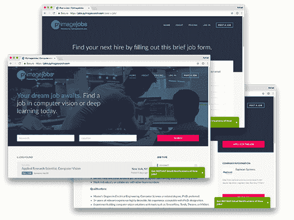
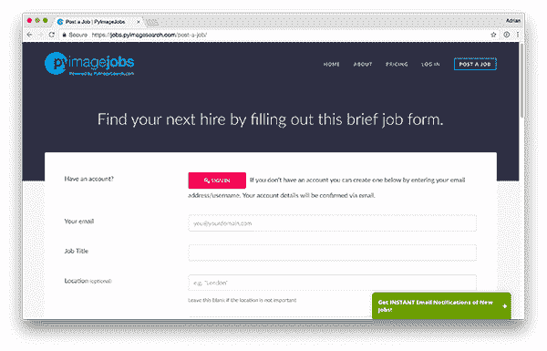
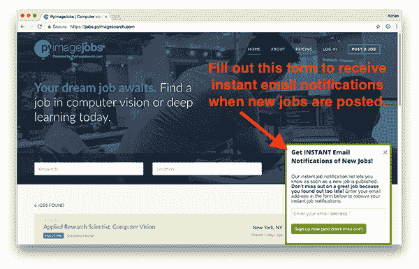
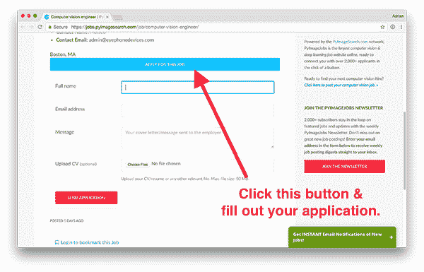

# 宣布 PyImageJobs:计算机视觉和深度学习工作委员会

> 原文：<https://pyimagesearch.com/2017/08/07/announcing-pyimagejobs-computer-vision-deep-learning-jobs-board/>

今天，我很高兴地宣布 [PyImageJobs](https://jobs.pyimagesearch.com/) 已经 ***正式推出*** 。

无论你是(1)期待 ***在计算机视觉、OpenCV 或深度学习领域找到一份工作*** ，还是(2)试图 ***为你的公司、组织或项目填补一个计算机视觉职位***——我都有你。

尽管 PyImageJobs *刚刚推出*，*庞大的* PyImageSearch 网络和社区*已经*使其成为 ***最大的计算机视觉就业在线平台*** **，**将数千名有才华的计算机视觉、图像处理和深度学习开发人员与渴望聘用他们的公司联系起来。

在 PyImageJobs 中，您可以找到以下职位:

*   全职工作
*   兼职职位
*   承包和咨询
*   博士后职位
*   实习
*   小型项目
*   …还有更多！

不管你是*在找工作*还是*准备好下一次雇佣*，PyImageJobs 都是适合你的工具。

## 为什么选择 PyImageJobs？

PyImageJobs 是出于需要而发展起来的。为了使 PyImageSearch 社区能够:

1.  查找计算机视觉开发人员和工程师的工作职位、承包工作或项目。
2.  将潜在的计算机视觉员工与渴望雇用他们的公司、组织和个人联系起来。

你看，每个月我都会收到近 100 份合同/咨询邀请，对我来说太多了，即使我围绕计算机视觉咨询建立了一个完整的公司。

我没有简单地拒绝这些提议，而是决定创建 PyImageJobs，帮助有才华的计算机视觉、图像处理和深度学习开发人员与准备招聘的公司和个人联系。

PyImageJobs 不仅仅是一个工作平台。无论你是在寻找全职员工、兼职员工，还是只是一个小项目的承包商/顾问——请放心，**这就是** ***正是*我创建 PyImageJobs** ***的原因。***

由于 PyImageJobs 是由 PyImageSearch.com 社区提供支持的，你可以放心，因为有成千上万的读者准备申请你的职位。

## 如何在 PyImageJobs 上发布工作或项目？

**Figure 1**: You can post part-time positions, freelance/contract work, internships, post-doc positions, remote work, and simple projects on PyImageJobs.

我之前提到过，PyImageJobs 并不局限于*全职*工作。您还可以发布:

*   兼职职位
*   自由职业者/合同工
*   实习
*   博士后职位
*   远程工作
*   简单的项目

无论你是需要在你的公司雇用一名全职计算机视觉工程师，还是仅仅需要一名计算机视觉开发人员来帮助你当前的项目，试试 PyImageJobs 吧——我非常有信心你能找到一名符合你需求的开发人员。

要在 PyImageJobs 上发布您的下一份工作/项目:

1.  前往 PyImageJobs 网站。
2.  点击[定价链接](https://jobs.pyimagesearch.com/post-a-job/)并选择一个计划。
3.  填写职位描述。

一旦提交，您的工作将在 24 小时内**发布，使您能够接触到成千上万活跃的计算机视觉、深度学习和 OpenCV 求职者。**

 **## 礼宾职位描述撰写服务(仅限限时)

在过去的一周里，我非常愉快地和一些雇主一起测试了 PyImageJobs 网站。

在几乎所有情况下*我都注意到在*雇主发布工作*和他们*找到下一个计算机视觉雇员*之间的主要障碍是**起草工作描述本身。***

 *招聘费用不是问题。这也不是信任问题——他们知道 PyImageJobs 和相关的 PyImageSearch 社区可以提供合格的应用程序。

相反，最主要的问题是，写一份工作描述可能是一个耗时且乏味的过程，尤其是如果你几乎没有写工作清单的经验。

毫无疑问——写一份完美的工作描述具有挑战性。幸运的是，我有多年的经验，不仅是*与计算机视觉工程师*一起工作，也有*雇佣他们*的经验。

对于一个 ***限时*** ，我提供一个 ***礼宾职位说明书撰写服务*** 。在未来，我将为这项服务向*收费*，所以如果你想让我为你写你的工作/项目描述，确保你现在利用这个机会。

简单地告诉我你的工作，我会帮你起草一份工作描述，保证得到申请人。

很难达成这样的交易。

要注册礼宾写作服务，只需使用以下链接并给我发消息:

[https://pyimagesearch.com/contact/](https://pyimagesearch.com/contact/)

## 我如何获得 PyImageJobs 上的工作或项目？

为了得到一份工作或一个项目，我建议你做两件事。

首先，前往 [PyImageJobs 网站](https://jobs.pyimagesearch.com/)并注册即时电子邮件通知:

**Figure 2:** Sign up for instant notifications to receive an email whenever a new job is posted on PyImageJobs. Don’t miss out on a great opportunity because you found out too late!

这将确保您在发布新职位的第一时间收到电子邮件通知。**你不想因为发现得太晚而错过一个绝佳的工作机会吧！**注册即时职位发布通知还将确保您每周收到 PyImageJobs 上发布的热门/新职位的精选摘要。

其次，准备好你的简历或者*履历*。确保它是最新的，并且包含您最近的项目。

当您准备申请工作时，点击工作列表，然后滚动到*“申请该工作”*按钮:

**Figure 3:** Applying for a job/position on PyImageJobs is as simple as filling out four quick fields.

点击此按钮将打开一个表格，您可以用它来申请该职位。您的信息将直接发送给雇主。

在未来的 PyImageSearch 博客帖子中，我将分享更多关于如何在申请 PyImageJobs 职位时让自己从人群中脱颖而出的信息。

## 摘要

今天，我很高兴地宣布 [**PyImageJobs 正式上线**](https://jobs.pyimagesearch.com/) 。

无论你是(1)期待 ***在计算机视觉、OpenCV 或深度学习领域找到一份工作*** ，还是(2)试图 ***为你的公司、组织或项目填补一个计算机视觉职位***——我都有你。

如果你有兴趣*提交你的工作或项目*，请[联系我](https://pyimagesearch.com/contact/)，我会帮你发布你的工作。**在有限的时间里，我甚至提供*礼宾写作服务*来帮你起草*完美的*工作/项目描述。**

如果你想开始申请计算机视觉的工作，去 [PyImageJobs 网站](https://jobs.pyimagesearch.com/)注册即时电子邮件通知列表(这样你就不会错过一个很好的工作机会)。

享受就业委员会，如果你有任何问题，请让我知道！***