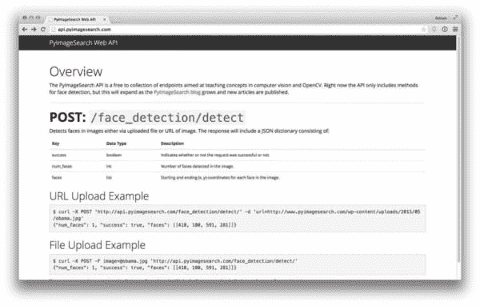

# 宣布 PyImageSearch Web API

> 原文：<https://pyimagesearch.com/2015/05/18/announcing-the-pyimagesearch-web-api/>

今天我超级兴奋地**正式宣布**[**PyImageSearch web API**](http://api.pyimagesearch.com/)。

我已经计划构建这个 API 有一段时间了，最后，上周关于构建一个[人脸检测 Web API](https://pyimagesearch.com/2015/05/11/creating-a-face-detection-api-with-python-and-opencv-in-just-5-minutes/) 的博客帖子正是我完成这个项目并将其发布到网上所需要的动力。

PyImageSearch Web API 是一个教学工具，用于进一步促进 PyImageSearch 博客上的高质量计算机视觉教程。

目前唯一的终点是图像中的人脸检测，但随着我在 PyImageSearch 博客上发布更多文章，终点的列表将继续增长。

例如，想象一下能够与我们构建的图像搜索引擎进行交互，以通过度假照片 进行 [搜索。](https://pyimagesearch.com/2014/12/01/complete-guide-building-image-search-engine-python-opencv/)

一个 API 端点来处理 [移动文档扫描](https://pyimagesearch.com/2014/09/01/build-kick-ass-mobile-document-scanner-just-5-minutes/) 怎么样？

或者也许我们可以包装一个 [深度学习分类器来识别手写数字](https://pyimagesearch.com/2014/09/22/getting-started-deep-learning-python/) ？

正如你所看到的，有相当多的可能性——我认为我们会从这个 API 中获得很多乐趣。

因此，请留意新的 PyImageSearch 博客帖子的发布。在适当的时候，我会加入新的 API 端点。

# 在哪里可以访问 PyImageSearch Web API？

PyImageSearch Web API 可以在 http://api.pyimagesearch.com 的找到，其中也包括每个端点的文档。

# PyImageSearch Web API 是免费的吗？

你打赌！PyImageSearch Web API*100%免费*。健康地使用它来帮助你的计算机视觉教育。

# 我可以在自己的应用程序中使用 PyImageSearch Web API 吗？

我会建议*反对*这样做。PyImageSearch web API 本来是一个**教学工具**，所以如果你滥用 API，我将不得不开始发布 API 密钥——这是我、*真的*不想做的事情。

# PyImageSearch Web API 有商业版吗？

也许将来会有 PyImageSearch Web API 的商业版本，您可以在自己的应用程序中使用它，但不是现在。如果随着 API 的发展，人们对它有足够的兴趣，我当然可以想象创建一个商业的、生产级别的 API 版本，并授权给开发者。

# 我可以贡献 PyImageSearch Web API 吗？

如果你已经开发了一个你认为会成为一个伟大的端点的计算机视觉应用，[请给我发消息](https://pyimagesearch.com/contact/)。我还会建议你使用我的[样板 Django 视图模板](https://pyimagesearch.com/2015/05/11/creating-a-face-detection-api-with-python-and-opencv-in-just-5-minutes/)(可以在页面中间找到)来包装你的应用程序，以构建基于计算机视觉的 web APIs。

# 如何支持 PyImageSearch Web API？

我个人为运行 PyImageSearch Web API 的服务器和主机支付现金。如果你喜欢它，觉得它有用，或者从中学习到什么，你可以拿起我的书 *[实用 Python 和 OpenCV](https://pyimagesearch.com/practical-python-opencv/)* 的副本来支持我自己和 PyImageSearch 博客。否则，请欣赏 API！

# 请求一个 API 端点？

你认为之前在 PyImageSearch 博客上的一篇文章会成为一个好的 API 端点吗？或者对包含 API 端点的计算机视觉教程有什么建议？在下面评论这篇文章让我知道或者[给我发消息](https://pyimagesearch.com/contact/)。