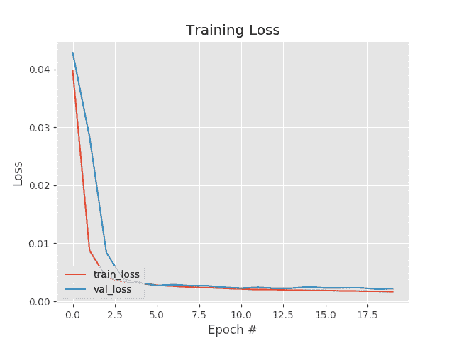
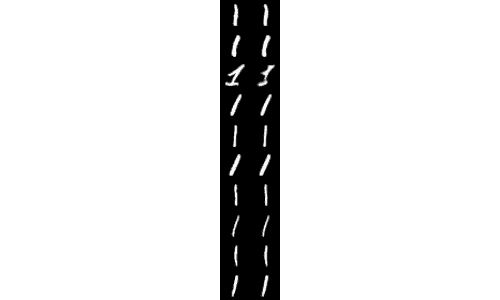
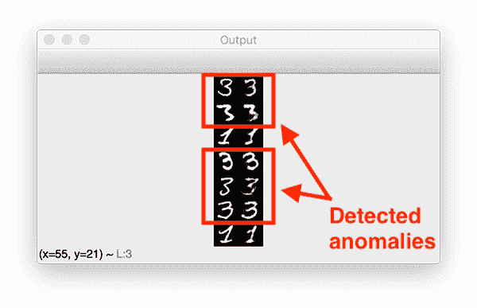
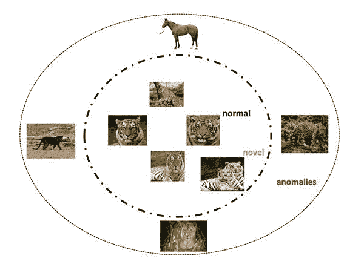

# 使用 Keras、TensorFlow 和深度学习进行异常检测

> 原文：<https://pyimagesearch.com/2020/03/02/anomaly-detection-with-keras-tensorflow-and-deep-learning/>

在本教程中，您将学习如何使用自动编码器、Keras 和 TensorFlow 执行异常和异常值检测。

早在一月份，我就向您展示了如何使用标准的机器学习模型来执行图像数据集中的异常检测和异常值检测。

我们的方法非常有效，但它回避了一个问题:

> 深度学习可以用来提高我们异常检测器的准确性吗？

要回答这样一个问题，我们需要深入兔子洞，回答如下问题:

*   我们应该使用什么模型架构？
*   对于异常/异常值检测，某些深度神经网络架构是否优于其他架构？
*   我们如何处理阶级不平衡的问题？
*   如果我们想训练一个*无人监管的*异常检测器会怎么样？

本教程解决了所有这些问题，在它结束时，您将能够使用深度学习在自己的图像数据集中执行异常检测。

**要了解如何使用 Keras、TensorFlow 和深度学习执行异常检测，*继续阅读！***

## 使用 Keras、TensorFlow 和深度学习进行异常检测

在本教程的第一部分，我们将讨论异常检测，包括:

*   是什么让异常检测如此具有挑战性
*   为什么传统的深度学习方法不足以检测异常/异常值
*   自动编码器如何用于异常检测

在此基础上，我们将实现一个自动编码器架构，该架构可用于使用 Keras 和 TensorFlow 进行异常检测。然后，我们将以一种无人监管的方式训练我们的自动编码器模型。

一旦训练了自动编码器，我将向您展示如何使用自动编码器来识别您的训练/测试集*和不属于数据集分割的*新图像*中的异常值/异常。*

### 什么是异常检测？

引用我的[介绍异常检测教程](https://pyimagesearch.com/2020/01/20/intro-to-anomaly-detection-with-opencv-computer-vision-and-scikit-learn/):

> 异常被定义为偏离标准、很少发生、不遵循“模式”其余部分的事件

异常情况的例子包括:

*   由世界事件引起的股票市场的大幅下跌和上涨
*   工厂里/传送带上的次品
*   实验室中被污染的样本

根据您的具体使用案例和应用，异常通常只发生 0.001-1%的时间——这是一个令人难以置信的*小部分时间*。

这个问题只是因为我们的阶级标签中存在巨大的不平衡而变得更加复杂。

根据定义，异常将*很少发生，*所以我们的大多数数据点将是有效事件。

为了检测异常，机器学习研究人员创建了隔离森林、一类支持向量机、椭圆包络和局部离群因子等算法来帮助检测此类事件；然而，所有这些方法都植根于*传统的机器学习。*

深度学习呢？

深度学习是否也可以用于异常检测？

答案是肯定的——但是你需要正确地描述这个问题。

### 深度学习和自动编码器如何用于异常检测？

正如我在我的[自动编码器简介教程](https://pyimagesearch.com/2020/01/20/intro-to-anomaly-detection-with-opencv-computer-vision-and-scikit-learn/)中所讨论的，自动编码器是一种无监督的神经网络，它可以:

1.  接受一组输入数据
2.  在内部将数据压缩成潜在空间表示
3.  从潜在表示中重建输入数据

为了完成这项任务，自动编码器使用两个组件:一个**编码器**和一个**解码器。**

**编码器**接受输入数据并将其压缩成潜在空间表示。**解码器**然后试图从潜在空间重建输入数据。

当以端到端的方式训练时，网络的隐藏层学习鲁棒的滤波器，甚至能够对输入数据进行去噪。

然而，从异常检测的角度来看，使自动编码器如此特殊的是重建损失。当我们训练自动编码器时，我们通常测量以下各项之间的**均方误差** (MSE):

1.  输入图像
2.  来自自动编码器的重建图像

损失越低，自动编码器在重建图像方面做得越好。

现在让我们假设我们在整个 MNIST 数据集上训练了一个自动编码器:

然后，我们向自动编码器提供一个数字，并告诉它重建它:

我们希望自动编码器在重建数字方面做得非常好，因为这正是自动编码器被训练做的事情，如果我们观察输入图像和重建图像之间的 MSE，我们会发现它非常低。

现在让我们假设我们向自动编码器展示了一张大象的照片，并要求它重建它:

由于自动编码器在之前*从未见过大象，更重要的是，*从未被训练来重建大象，* **我们的 MSE 将*非常高。****

如果重建的 MSE 很高，那么我们可能有一个异常值。

Alon Agmon 在这篇文章中更详细地解释了这个概念。

### 配置您的开发环境

为了跟随今天的异常检测教程，我推荐您使用 TensorFlow 2.0。

要配置您的系统并安装 TensorFlow 2.0，您可以遵循 my Ubuntu 或 macOS 指南:

*   *[如何在 Ubuntu](https://pyimagesearch.com/2019/12/09/how-to-install-tensorflow-2-0-on-ubuntu/)T3 上安装 tensor flow 2.0【Ubuntu 18.04 OS；CPU 和可选的 NVIDIA GPU)*
*   *[如何在 macOS 上安装 tensor flow 2.0](https://pyimagesearch.com/2019/12/09/how-to-install-tensorflow-2-0-on-macos/)*(Catalina 和 Mojave OSes)

**请注意:** PyImageSearch 不支持 Windows — [参考我们的 FAQ](https://pyimagesearch.com/faqs/single-faq/can-you-help-me-do-___-on-windows) 。

### 项目结构

继续从这篇文章的 ***“下载”*** 部分抓取代码。一旦你解压了这个项目，你会看到下面的结构:

```py
$ tree --dirsfirst
.
├── output
│   ├── autoencoder.model
│   └── images.pickle
├── pyimagesearch
│   ├── __init__.py
│   └── convautoencoder.py
├── find_anomalies.py
├── plot.png
├── recon_vis.png
└── train_unsupervised_autoencoder.py

2 directories, 8 files
```

我们的`convautoencoder.py`文件包含负责构建 Keras/TensorFlow 自动编码器实现的`ConvAutoencoder`类。

我们将使用`train_unsupervised_autoencoder.py`中未标记的数据训练一个自动编码器，产生以下输出:

*   `autoencoder.model`:序列化、训练好的 autoencoder 模型。
*   一系列未标记的图像，我们可以从中发现异常。
*   由我们的训练损失曲线组成的图。
*   `recon_vis.png`:将地面实况数字图像的样本与每个重建图像进行比较的可视化图形。

从那里，我们将在`find_anomalies.py`内部开发一个异常检测器，并应用我们的自动编码器来重建数据并发现异常。

### 使用 Keras 和 TensorFlow 实现我们的异常检测自动编码器

深度学习异常检测的第一步是实现我们的 autoencoder 脚本。

我们的卷积自动编码器实现与我们的[自动编码器介绍文章](https://pyimagesearch.com/2020/02/17/autoencoders-with-keras-tensorflow-and-deep-learning)以及我们的[去噪自动编码器教程](https://pyimagesearch.com/2020/02/24/denoising-autoencoders-with-keras-tensorflow-and-deep-learning)中的实现完全相同；然而，为了完整起见，我们将在这里回顾一下——如果你想了解关于自动编码器的更多细节，请务必参考那些帖子。

打开`convautoencoder.py`并检查:

```py
# import the necessary packages
from tensorflow.keras.layers import BatchNormalization
from tensorflow.keras.layers import Conv2D
from tensorflow.keras.layers import Conv2DTranspose
from tensorflow.keras.layers import LeakyReLU
from tensorflow.keras.layers import Activation
from tensorflow.keras.layers import Flatten
from tensorflow.keras.layers import Dense
from tensorflow.keras.layers import Reshape
from tensorflow.keras.layers import Input
from tensorflow.keras.models import Model
from tensorflow.keras import backend as K
import numpy as np

class ConvAutoencoder:
	@staticmethod
	def build(width, height, depth, filters=(32, 64), latentDim=16):
		# initialize the input shape to be "channels last" along with
		# the channels dimension itself
		# channels dimension itself
		inputShape = (height, width, depth)
		chanDim = -1

		# define the input to the encoder
		inputs = Input(shape=inputShape)
		x = inputs

		# loop over the number of filters
		for f in filters:
			# apply a CONV => RELU => BN operation
			x = Conv2D(f, (3, 3), strides=2, padding="same")(x)
			x = LeakyReLU(alpha=0.2)(x)
			x = BatchNormalization(axis=chanDim)(x)

		# flatten the network and then construct our latent vector
		volumeSize = K.int_shape(x)
		x = Flatten()(x)
		latent = Dense(latentDim)(x)

		# build the encoder model
		encoder = Model(inputs, latent, name="encoder")
```

进口包括`tf.keras`和 NumPy。

我们的`ConvAutoencoder`类包含一个静态方法`build`，它接受五个参数:

1.  `width`:输入图像的宽度。
2.  `height`:输入图像的高度。
3.  `depth`:图像中的通道数。
4.  `filters`:编码器和解码器将分别学习的滤波器数量
5.  `latentDim`:潜在空间表示的维度。

然后为编码器定义了`Input`,此时我们使用 Keras 的函数 API 循环遍历我们的`filters`,并添加我们的`CONV => LeakyReLU => BN`层集合。

然后我们拉平网络，构建我们的*潜在向量*。潜在空间表示是我们数据的压缩形式。

在上面的代码块中，我们使用自动编码器的`encoder`部分来构建我们的潜在空间表示——这个相同的表示现在将用于重建原始输入图像:

```py
		# start building the decoder model which will accept the
		# output of the encoder as its inputs
		latentInputs = Input(shape=(latentDim,))
		x = Dense(np.prod(volumeSize[1:]))(latentInputs)
		x = Reshape((volumeSize[1], volumeSize[2], volumeSize[3]))(x)

		# loop over our number of filters again, but this time in
		# reverse order
		for f in filters[::-1]:
			# apply a CONV_TRANSPOSE => RELU => BN operation
			x = Conv2DTranspose(f, (3, 3), strides=2,
				padding="same")(x)
			x = LeakyReLU(alpha=0.2)(x)
			x = BatchNormalization(axis=chanDim)(x)

		# apply a single CONV_TRANSPOSE layer used to recover the
		# original depth of the image
		x = Conv2DTranspose(depth, (3, 3), padding="same")(x)
		outputs = Activation("sigmoid")(x)

		# build the decoder model
		decoder = Model(latentInputs, outputs, name="decoder")

		# our autoencoder is the encoder + decoder
		autoencoder = Model(inputs, decoder(encoder(inputs)),
			name="autoencoder")

		# return a 3-tuple of the encoder, decoder, and autoencoder
		return (encoder, decoder, autoencoder)
```

这里，我们采用潜在的输入，并使用完全连接的层将其重塑为 3D 体积(即，图像数据)。

我们再次循环我们的过滤器，但是以相反的顺序，应用一系列的`CONV_TRANSPOSE => RELU => BN`层。`CONV_TRANSPOSE`层的目的是将体积大小增加回原始图像的空间尺寸。

最后，我们建立了解码器模型并构建了自动编码器。回想一下，自动编码器由编码器和解码器组件组成。然后，我们返回编码器、解码器和自动编码器的三元组。

同样，如果您需要关于我们的 autoencoder 实现的更多细节，请务必查看前面提到的教程。

### 实施异常检测培训脚本

随着我们的 autoencoder 的实现，我们现在准备继续我们的训练脚本。

打开项目目录中的`train_unsupervised_autoencoder.py`文件，并插入以下代码:

```py
# set the matplotlib backend so figures can be saved in the background
import matplotlib
matplotlib.use("Agg")

# import the necessary packages
from pyimagesearch.convautoencoder import ConvAutoencoder
from tensorflow.keras.optimizers import Adam
from tensorflow.keras.datasets import mnist
from sklearn.model_selection import train_test_split
import matplotlib.pyplot as plt
import numpy as np
import argparse
import random
import pickle
import cv2
```

导入包括我们的`ConvAutoencoder`、数据集`mnist`的实现，以及一些来自 TensorFlow、scikit-learn 和 OpenCV 的导入。

假设我们正在执行*无监督学习，*接下来我们将定义一个函数来构建一个无监督数据集:

```py
def build_unsupervised_dataset(data, labels, validLabel=1,
	anomalyLabel=3, contam=0.01, seed=42):
	# grab all indexes of the supplied class label that are *truly*
	# that particular label, then grab the indexes of the image
	# labels that will serve as our "anomalies"
	validIdxs = np.where(labels == validLabel)[0]
	anomalyIdxs = np.where(labels == anomalyLabel)[0]

	# randomly shuffle both sets of indexes
	random.shuffle(validIdxs)
	random.shuffle(anomalyIdxs)

	# compute the total number of anomaly data points to select
	i = int(len(validIdxs) * contam)
	anomalyIdxs = anomalyIdxs[:i]

	# use NumPy array indexing to extract both the valid images and
	# "anomlay" images
	validImages = data[validIdxs]
	anomalyImages = data[anomalyIdxs]

	# stack the valid images and anomaly images together to form a
	# single data matrix and then shuffle the rows
	images = np.vstack([validImages, anomalyImages])
	np.random.seed(seed)
	np.random.shuffle(images)

	# return the set of images
	return images
```

我们的`build_supervised_dataset`函数接受一个带标签的数据集(即用于*监督学习*)并把它变成一个无标签的数据集(即用于*非监督学习*)。

该函数接受一组输入`data`和`labels`，包括**有效标签**和**异常标签。**

**鉴于我们的`validLabel=1`默认只有 MNIST 数字*的*被选中；然而，我们也会用一组数字*三个*图像(`validLabel=3`)污染我们的数据集。**

`contam`百分比用于帮助我们采样和选择异常数据点。

从我们的一组`labels`(并使用有效标签)，我们生成一个列表`validIdxs` ( **第 22 行**)。完全相同的过程适用于抓取`anomalyIdxs` ( **线 23** )。然后，我们继续随机`shuffle`索引(**第 26 行和第 27 行**)。

考虑到我们的异常污染百分比，我们减少了我们的`anomalyIdxs` ( **行 30 和 31** )。

**第 35 行和第 36 行**然后构建两组图像:(1)有效图像和(2)异常图像。

这些列表中的每一个被堆叠以形成单个数据矩阵，然后被混洗并返回(**行 40-45** )。**注意到*标签被有意丢弃，*有效地使我们的数据集为*无监督学习做好准备。***

我们的下一个功能将帮助我们可视化无监督自动编码器做出的预测:

```py
def visualize_predictions(decoded, gt, samples=10):
	# initialize our list of output images
	outputs = None

	# loop over our number of output samples
	for i in range(0, samples):
		# grab the original image and reconstructed image
		original = (gt[i] * 255).astype("uint8")
		recon = (decoded[i] * 255).astype("uint8")

		# stack the original and reconstructed image side-by-side
		output = np.hstack([original, recon])

		# if the outputs array is empty, initialize it as the current
		# side-by-side image display
		if outputs is None:
			outputs = output

		# otherwise, vertically stack the outputs
		else:
			outputs = np.vstack([outputs, output])

	# return the output images
	return outputs
```

`visualize_predictions`函数是一个助手方法，用于可视化自动编码器的输入图像及其相应的输出重建。`original`和重建(`recon`)图像将根据`samples`参数的数量并排排列并垂直堆叠。如果你读过我的[自动编码器简介](https://pyimagesearch.com/2020/02/17/autoencoders-with-keras-tensorflow-and-deep-learning)指南或者[去噪自动编码器](https://pyimagesearch.com/2020/02/24/denoising-autoencoders-with-keras-tensorflow-and-deep-learning)教程，这段代码应该看起来很熟悉。

既然我们已经定义了导入和必要的函数，我们将继续解析我们的命令行参数:

```py
# construct the argument parse and parse the arguments
ap = argparse.ArgumentParser()
ap.add_argument("-d", "--dataset", type=str, required=True,
	help="path to output dataset file")
ap.add_argument("-m", "--model", type=str, required=True,
	help="path to output trained autoencoder")
ap.add_argument("-v", "--vis", type=str, default="recon_vis.png",
	help="path to output reconstruction visualization file")
ap.add_argument("-p", "--plot", type=str, default="plot.png",
	help="path to output plot file")
args = vars(ap.parse_args())
```

我们的函数接受[四个命令行参数](https://pyimagesearch.com/2018/03/12/python-argparse-command-line-arguments/)，它们都是输出文件路径:

*   `--dataset`:定义输出数据集文件的路径
*   `--model`:指定输出训练自动编码器的路径
*   `--vis`:指定输出可视化文件路径的*可选*参数。默认情况下，我将这个文件命名为`recon_vis.png`；但是，欢迎您用不同的路径和文件名覆盖它
*   `--plot` : *可选的*表示输出训练历史图的路径。默认情况下，该图将在当前工作目录中被命名为`plot.png`

现在，我们准备好了用于训练的数据:

```py
# initialize the number of epochs to train for, initial learning rate,
# and batch size
EPOCHS = 20
INIT_LR = 1e-3
BS = 32

# load the MNIST dataset
print("[INFO] loading MNIST dataset...")
((trainX, trainY), (testX, testY)) = mnist.load_data()

# build our unsupervised dataset of images with a small amount of
# contamination (i.e., anomalies) added into it
print("[INFO] creating unsupervised dataset...")
images = build_unsupervised_dataset(trainX, trainY, validLabel=1,
	anomalyLabel=3, contam=0.01)

# add a channel dimension to every image in the dataset, then scale
# the pixel intensities to the range [0, 1]
images = np.expand_dims(images, axis=-1)
images = images.astype("float32") / 255.0

# construct the training and testing split
(trainX, testX) = train_test_split(images, test_size=0.2,
	random_state=42)
```

首先，我们初始化三个超参数:(1)训练时期的数量，(2)初始学习率，以及(3)我们的批量大小(**第 86-88 行**)。

**行 92** 加载 MNIST，而**行 97 和 98** 构建我们的无监督数据集，其中添加了 1%的污染(即异常)。

从这里开始，我们的数据集没有标签，我们的自动编码器将尝试学习模式，而无需事先了解数据是什么。

现在我们已经建立了无监督数据集，它由 99%的数字 1 和 1%的数字 3(即异常/异常值)组成。

从那里，我们通过添加通道维度和缩放像素强度到范围*【0，1】*(**行 102 和 103** )来预处理我们的数据集。

使用 scikit-learn 的便利功能，我们将数据分成 80%的训练集和 20%的测试集(**行 106 和 107** )。

我们的数据已经准备好了，所以让我们构建我们的自动编码器并训练它:

```py
# construct our convolutional autoencoder
print("[INFO] building autoencoder...")
(encoder, decoder, autoencoder) = ConvAutoencoder.build(28, 28, 1)
opt = Adam(lr=INIT_LR, decay=INIT_LR / EPOCHS)
autoencoder.compile(loss="mse", optimizer=opt)

# train the convolutional autoencoder
H = autoencoder.fit(
	trainX, trainX,
	validation_data=(testX, testX),
	epochs=EPOCHS,
	batch_size=BS)

# use the convolutional autoencoder to make predictions on the
# testing images, construct the visualization, and then save it
# to disk
print("[INFO] making predictions...")
decoded = autoencoder.predict(testX)
vis = visualize_predictions(decoded, testX)
cv2.imwrite(args["vis"], vis)
```

我们用`Adam`优化器构建我们的`autoencoder`，用均方差`loss` ( **第 111-113 行**)构建`compile`。

**第 116-120 行**使用 TensorFlow/Keras 启动培训程序。我们的自动编码器将尝试学习如何重建原始输入图像。不容易重建的图像将具有*大的损失值。*

一旦训练完成，我们将需要一种方法来评估和直观检查我们的结果。幸运的是，我们的后口袋里有我们的`visualize_predictions`便利功能。**第 126-128 行**对测试集进行预测，根据结果构建可视化图像，并将输出图像写入磁盘。

从这里开始，我们将总结:

```py
# construct a plot that plots and saves the training history
N = np.arange(0, EPOCHS)
plt.style.use("ggplot")
plt.figure()
plt.plot(N, H.history["loss"], label="train_loss")
plt.plot(N, H.history["val_loss"], label="val_loss")
plt.title("Training Loss")
plt.xlabel("Epoch #")
plt.ylabel("Loss")
plt.legend(loc="lower left")
plt.savefig(args["plot"])

# serialize the image data to disk
print("[INFO] saving image data...")
f = open(args["dataset"], "wb")
f.write(pickle.dumps(images))
f.close()

# serialize the autoencoder model to disk
print("[INFO] saving autoencoder...")
autoencoder.save(args["model"], save_format="h5")
```

最后，我们:

*   绘制我们的训练历史损失曲线，并将结果图导出到磁盘(**行 131-140** )
*   将我们无监督的采样 MNIST 数据集序列化为 Python pickle 文件存储到磁盘，这样我们就可以用它来发现`find_anomalies.py`脚本中的异常(**第 144-146 行**
*   救救我们训练有素的`autoencoder` ( **第 150 行**)

开发无监督的自动编码器训练脚本的精彩工作。

### 使用 Keras 和 TensorFlow 训练我们的异常探测器

为了训练我们的异常检测器，请确保使用本教程的 ***“下载”*** 部分下载源代码。

从那里，启动一个终端并执行以下命令:

```py
$ python train_unsupervised_autoencoder.py \
	--dataset output/images.pickle \
	--model output/autoencoder.model
[INFO] loading MNIST dataset...
[INFO] creating unsupervised dataset...
[INFO] building autoencoder...
Train on 5447 samples, validate on 1362 samples
Epoch 1/20
5447/5447 [==============================] - 7s 1ms/sample - loss: 0.0421 - val_loss: 0.0405
Epoch 2/20
5447/5447 [==============================] - 6s 1ms/sample - loss: 0.0129 - val_loss: 0.0306
Epoch 3/20
5447/5447 [==============================] - 6s 1ms/sample - loss: 0.0045 - val_loss: 0.0088
Epoch 4/20
5447/5447 [==============================] - 6s 1ms/sample - loss: 0.0033 - val_loss: 0.0037
Epoch 5/20
5447/5447 [==============================] - 6s 1ms/sample - loss: 0.0029 - val_loss: 0.0027
...
Epoch 16/20
5447/5447 [==============================] - 6s 1ms/sample - loss: 0.0018 - val_loss: 0.0020
Epoch 17/20
5447/5447 [==============================] - 6s 1ms/sample - loss: 0.0018 - val_loss: 0.0020
Epoch 18/20
5447/5447 [==============================] - 6s 1ms/sample - loss: 0.0017 - val_loss: 0.0021
Epoch 19/20
5447/5447 [==============================] - 6s 1ms/sample - loss: 0.0018 - val_loss: 0.0021
Epoch 20/20
5447/5447 [==============================] - 6s 1ms/sample - loss: 0.0016 - val_loss: 0.0019
[INFO] making predictions...
[INFO] saving image data...
[INFO] saving autoencoder...
```

[](https://pyimagesearch.com/wp-content/uploads/2020/03/autoencoder_anomaly_detection_plot.png)

**Figure 5:** In this plot we have our loss curves from training an autoencoder with Keras, TensorFlow, and deep learning.

在我的 3Ghz 英特尔至强处理器上训练整个模型花费了 **~2 分钟**，正如我们在**图 5** 中的训练历史图所示，我们的训练相当稳定。

此外，我们可以查看我们的输出`recon_vis.png`可视化文件，以了解我们的自动编码器已经学会从 MNIST 数据集正确地重建`1`数字:

[](https://pyimagesearch.com/wp-content/uploads/2020/03/autoencoder_anomaly_detection_recon_vis.png)

**Figure 6:** Reconstructing a handwritten digit using a deep learning autoencoder trained with Keras and TensorFlow.

在继续下一部分之前，您应该确认`autoencoder.model`和`images.pickle`文件已经正确保存到您的`output`目录中:

```py
$ ls output/
autoencoder.model	images.pickle
```

在下一节中，您将需要这些文件。

### 使用 autoencoder 实现我们的脚本来发现异常/异常值

我们现在的目标是:

1.  以我们预先训练的自动编码器为例
2.  使用它进行预测(即，重建数据集中的数字)
3.  测量原始输入图像和重建图像之间的 MSE
4.  计算 MSE 的分位数，并使用这些分位数来识别异常值和异常值

打开`find_anomalies.py`文件，让我们开始吧:

```py
# import the necessary packages
from tensorflow.keras.models import load_model
import numpy as np
import argparse
import pickle
import cv2

# construct the argument parse and parse the arguments
ap = argparse.ArgumentParser()
ap.add_argument("-d", "--dataset", type=str, required=True,
	help="path to input image dataset file")
ap.add_argument("-m", "--model", type=str, required=True,
	help="path to trained autoencoder")
ap.add_argument("-q", "--quantile", type=float, default=0.999,
	help="q-th quantile used to identify outliers")
args = vars(ap.parse_args())
```

我们将从导入和命令行参数开始。从`tf.keras`导入的`load_model`使我们能够从磁盘加载序列化的 autoencoder 模型。命令行参数包括:

*   `--dataset`:我们的输入数据集 pickle 文件的路径，该文件作为我们的无监督训练脚本的结果被导出到磁盘
*   `--model`:我们训练有素的自动编码器路径
*   `--quantile`:识别异常值的第 *q* 个分位数

从这里，我们将(1)加载我们的自动编码器和数据，以及(2)进行预测:

```py
# load the model and image data from disk
print("[INFO] loading autoencoder and image data...")
autoencoder = load_model(args["model"])
images = pickle.loads(open(args["dataset"], "rb").read())

# make predictions on our image data and initialize our list of
# reconstruction errors
decoded = autoencoder.predict(images)
errors = []

# loop over all original images and their corresponding
# reconstructions
for (image, recon) in zip(images, decoded):
	# compute the mean squared error between the ground-truth image
	# and the reconstructed image, then add it to our list of errors
	mse = np.mean((image - recon) ** 2)
	errors.append(mse)
```

**第 20 行和第 21 行**从磁盘加载`autoencoder`和`images`数据。

然后，我们通过我们的`autoencoder`传递`images`的集合，以进行预测并尝试重建输入(**第 25 行**)。

在原始和重建图像上循环，**行 30-34** 计算地面实况和重建图像之间的均方误差，建立`errors`的列表。

从这里，我们会发现异常:

```py
# compute the q-th quantile of the errors which serves as our
# threshold to identify anomalies -- any data point that our model
# reconstructed with > threshold error will be marked as an outlier
thresh = np.quantile(errors, args["quantile"])
idxs = np.where(np.array(errors) >= thresh)[0]
print("[INFO] mse threshold: {}".format(thresh))
print("[INFO] {} outliers found".format(len(idxs)))
```

**第 39 行**计算误差的 *q* 分位数——这个值将作为我们检测异常值的阈值。

对照`thresh`、**线 40** 测量每个误差，确定数据中所有异常的指数。因此，任何具有值`>= thresh`的 MSE 都被认为是异常值。

接下来，我们将遍历数据集中的异常指数:

```py
# initialize the outputs array
outputs = None

# loop over the indexes of images with a high mean squared error term
for i in idxs:
	# grab the original image and reconstructed image
	original = (images[i] * 255).astype("uint8")
	recon = (decoded[i] * 255).astype("uint8")

	# stack the original and reconstructed image side-by-side
	output = np.hstack([original, recon])

	# if the outputs array is empty, initialize it as the current
	# side-by-side image display
	if outputs is None:
		outputs = output

	# otherwise, vertically stack the outputs
	else:
		outputs = np.vstack([outputs, output])

# show the output visualization
cv2.imshow("Output", outputs)
cv2.waitKey(0)
```

在循环内部，我们并排排列每个`original`和`recon`图像，将所有结果垂直堆叠为一个`outputs`图像。**第 66 和 67 行**显示结果图像。

### 具有深度学习结果的异常检测

我们现在准备使用深度学习和我们训练的 Keras/TensorFlow 模型来检测我们数据集中的异常。

首先，确保您已经使用本教程的 ***“下载”*** 部分下载了源代码——从这里，您可以执行以下命令来检测我们数据集中的异常:

```py
$ python find_anomalies.py --dataset output/images.pickle \
	--model output/autoencoder.model
[INFO] loading autoencoder and image data...
[INFO] mse threshold: 0.02863757349550724
[INFO] 7 outliers found
```

MSE 阈值约为 0.0286，对应于 99.9%的分位数，我们的自动编码器能够找到七个异常值，其中五个被正确标记为:

[](https://pyimagesearch.com/wp-content/uploads/2020/03/autoencoder_anomaly_detection_output.png)

**Figure 7:** Shown are anomalies that have been detected from reconstructing data with a Keras-based autoencoder.

尽管自动编码器仅在 MNIST 数据集(总共 67 个样本)的所有`3`数字中的 1%上被训练，但在给定有限数据的情况下，自动编码器在重建它们方面做得非常好— **,但我们可以看到这些重建的 MSE 高于其他重建。**

此外，被错误标记为异常值的`1`数字也可能被认为是可疑的。

深度学习实践者可以使用自动编码器来发现他们数据集**中的异常值，即使图像被正确*标记为*！**

正确标记但表明深度神经网络架构存在问题的图像应该表示值得进一步探索的图像子类——自动编码器可以帮助您发现这些异常子类。

### 我的自动编码器异常检测精度不够好。我该怎么办？

[](https://pyimagesearch.com/wp-content/uploads/2020/03/autoencoder_anomaly_detection_example.jpg)

**Figure 8:** Anomaly detection with unsupervised deep learning models is an active area of research and is far from solved. (image source: Figure 4 of [*Deep Learning for Anomaly Detection: A Survey*](https://arxiv.org/pdf/1901.03407.pdf) by Chalapathy and Chawla)

无监督学习，特别是异常/异常值检测，距离机器学习、深度学习和计算机视觉的解决领域*很远*—**没有现成的异常检测解决方案是 100%正确的。**

我建议你阅读 2019 年的调查论文， *[深度学习异常检测:一项调查](https://arxiv.org/abs/1901.03407)* ，由 Chalapathy 和 Chawla 撰写，以了解更多关于当前基于深度学习的异常检测的最新信息。

虽然很有希望，但请记住，该领域正在快速发展，但异常/异常值检测距离解决问题还很远。

## 摘要

在本教程中，您学习了如何使用 Keras、TensorFlow 和深度学习来执行异常和异常值检测。

传统的分类架构*不足以*进行异常检测，因为:

*   它们不能在无人监督的情况下使用
*   他们努力处理严重的阶级不平衡
*   因此，他们很难正确地回忆起异常值

**另一方面，自动编码器:**

*   自然适用于无人监督的问题
*   学会对输入图像进行*编码*和*重构*
*   可以通过测量编码图像和重建图像之间的误差来检测异常值

我们以一种*无监督的方式*在 MNIST 数据集上训练我们的自动编码器，通过移除类别标签，抓取所有具有值`1`的标签，然后使用 1%的`3`标签。

正如我们的结果所显示的，我们的自动编码器能够挑出许多用来“污染”我们的`1`的`3`数字。

如果你喜欢这个基于深度学习的异常检测教程，请在评论中告诉我！你的反馈有助于指导我将来写什么教程。

**要下载这篇博文的源代码(并在未来教程在 PyImageSearch 上发布时得到通知)，*只需在下面的表格中输入您的电子邮件地址！***