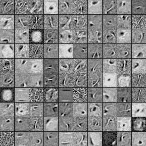

# 使用 Python 将深度学习和 RBM 应用于 MNIST

> 原文：<https://pyimagesearch.com/2014/06/23/applying-deep-learning-rbm-mnist-using-python/>

[](http://deeplearning.net/tutorial/rbm.html)

在我的上一篇文章中，我提到过，当利用原始像素作为特征向量时，图像中微小的一个像素偏移会破坏受限的玻尔兹曼机器+分类器流水线的性能。

今天我将继续这一讨论。

更重要的是，我将提供一些 Python 和 scikit-learn 代码，你可以使用这些代码来将受限的波尔兹曼机器应用到你自己的图像分类问题中。

**OpenCV 和 Python 版本:**
这个例子将运行在 **Python 2.7** 和 **OpenCV 2.4.X/OpenCV 3.0+** 上。

但是在我们进入代码之前，让我们花点时间来讨论一下 MNIST 数据集。

# MNIST 数据集

[](https://pyimagesearch.com/wp-content/uploads/2014/06/mnist_sample.jpg)

**Figure 1:** MNIST digit recognition sample

MNIST 数据集是计算机视觉和机器学习文献中研究得最多的数据集之一。在许多情况下，它是一个基准，一些机器学习算法的排名标准。

这个数据集的目标是正确分类手写数字 0-9。我们不打算利用整个数据集(由 60，000 幅训练图像和 10，000 幅测试图像组成)，而是利用一个小样本(3，000 幅用于训练，2，000 幅用于测试)。每个数字的数据点大致均匀分布，因此不存在明显的类别标签不平衡。

每个特征向量是 784-dim，对应于图像的*28×28*灰度像素强度。这些灰度像素强度是无符号整数，范围在[0，255]内。

所有数字都放在黑色背景上，前景是白色和灰色阴影。

给定这些原始像素强度，我们将首先根据我们的训练数据训练一个受限的玻尔兹曼机器，以学习数字的无监督特征表示。

然后，我们将采用这些“学习”的特征，并在它们的基础上训练一个逻辑回归分类器。

为了评估我们的管道，我们将获取测试数据，并通过我们的分类器运行它，并报告准确性。

然而，我在之前的[帖子](https://pyimagesearch.com/2014/06/16/1-pixel-shifts-images-can-kill-rbm-performance/)中提到，测试集图像简单的一个像素平移会导致精度下降，即使这些平移小到人眼几乎察觉不到(如果有的话)。

为了测试这种说法，我们将通过将每幅图像向上、向下、向左和向右平移一个像素来生成一个比原始图像大四倍的测试集。

最后，我们将通过管道传递这个“轻推”数据集，并报告我们的结果。

听起来不错吧？

让我们检查一些代码。

[](https://pyimagesearch.com/practical-python-opencv/?src=in-post-rbm-mnist)

# 使用 Python 将 RBM 应用于 MNIST 数据集

我们要做的第一件事是创建一个文件`rbm.py`，并开始导入我们需要的包:

```py
# import the necessary packages
from sklearn.cross_validation import train_test_split
from sklearn.metrics import classification_report
from sklearn.linear_model import LogisticRegression
from sklearn.neural_network import BernoulliRBM
from sklearn.grid_search import GridSearchCV
from sklearn.pipeline import Pipeline
import numpy as np
import argparse
import time
import cv2

```

我们将从导入 scikit-learn 的`cross_validation`子包中的`train_test_split`函数开始。`train_test_split`函数将使我们创建 MNIST 数据集的训练和测试分割变得非常简单。

接下来，我们将从`metrics`子包中导入`classification_report`函数，我们将使用它来生成一个关于(1)整个系统和(2)每个单独类标签的精度的格式良好的精度报告。

在第 4 行的**上，我们将导入我们将在整个例子中使用的分类器——一个`LogisticRegression`分类器。**

我提到过，我们将使用受限玻尔兹曼机器来学习原始像素值的无监督表示。这将由 scikit-learn 的`neural_network`子包中的`BernoulliRBM`类来处理。

`BernoulliRBM`实现(顾名思义)，由二进制可见单元和二进制隐藏节点组成。算法本身是 *O(d² )* ，其中 *d* 是需要学习的元件个数。

为了找到逻辑回归系数`C`的最佳值，以及我们的 RBM 的最佳学习速率、迭代次数和组件数量，我们需要在特征空间上执行交叉验证网格搜索。`GridSearchCV`类(我们在**6 号线**上导入的)将为我们处理这个搜索。

接下来，我们需要在**行 7** 导入的`Pipeline`类。这个类允许我们使用 scikit-learn 估计器的拟合和转换方法来定义一系列步骤。

我们的分类管道将包括首先训练一个`BernoulliRBM`来学习特征空间的无监督表示，然后在学习的特征上训练一个`LogisticRegression`分类器。

最后，我们导入 NumPy 进行数值处理，`argparse`解析命令行参数，`time`跟踪给定模型训练所需的时间，而`cv2`用于 OpenCV 绑定。

但是在我们开始之前，我们首先需要设置一些函数来加载和操作我们的 MNIST 数据集:

```py
def load_digits(datasetPath):
	# build the dataset and then split it into data
	# and labels
	X = np.genfromtxt(datasetPath, delimiter = ",", dtype = "uint8")
	y = X[:, 0]
	X = X[:, 1:]

	# return a tuple of the data and targets
	return (X, y)

```

`load_digits`函数，顾名思义，从磁盘上加载我们的 MNIST 数字数据集。该函数采用一个参数`datasetPath`，它是数据集 CSV 文件所在的路径。

我们使用`np.genfromtxt`函数从磁盘上加载 CSV 文件，在**行 17** 上抓取类标签(这是 CSV 文件的第一列)，然后在**行 18** 上抓取实际的原始像素特征向量。这些特征向量是 784 维的，对应于灰度数字图像的*28×28*展平表示。

最后，我们在第 21 行的**上返回我们的特征向量矩阵和类标签的元组。**

接下来，我们需要一个函数对我们的数据进行一些预处理。

`BernoulliRBM`假设我们的特征向量的列落在范围[0，1]内。但是，MNIST 数据集表示为无符号的 8 位整数，范围在[0，255]内。

为了将列缩放到范围[0，1]，我们需要做的就是定义一个`scale`函数:

```py
def scale(X, eps = 0.001):
	# scale the data points s.t the columns of the feature space
	# (i.e the predictors) are within the range [0, 1]
	return (X - np.min(X, axis = 0)) / (np.max(X, axis = 0) + eps)

```

`scale`函数有两个参数，我们的数据矩阵`X`和一个用于防止被零除错误的 epsilon 值。

这个函数是不言自明的。对于矩阵中 784 列中的每一列，我们从该列的最小值中减去该值，然后除以该列的最大值。通过这样做，我们确保了每一列的值都在范围[0，1]内。

现在我们需要最后一个函数:一个生成比原始数据集大四倍的“轻推”数据集的方法，将每张图像向上、向下、向左和向右平移一个像素。

为了处理数据集的这种微调，我们将创建`nudge`函数:

```py
def nudge(X, y):
	# initialize the translations to shift the image one pixel
	# up, down, left, and right, then initialize the new data
	# matrix and targets
	translations = [(0, -1), (0, 1), (-1, 0), (1, 0)]
	data = []
	target = []

	# loop over each of the digits
	for (image, label) in zip(X, y):
		# reshape the image from a feature vector of 784 raw
		# pixel intensities to a 28x28 'image'
		image = image.reshape(28, 28)

		# loop over the translations
		for (tX, tY) in translations:
			# translate the image
			M = np.float32([[1, 0, tX], [0, 1, tY]])
			trans = cv2.warpAffine(image, M, (28, 28))

			# update the list of data and target
			data.append(trans.flatten())
			target.append(label)

	# return a tuple of the data matrix and targets
	return (np.array(data), np.array(target))

```

`nudge`函数有两个参数:我们的数据矩阵`X`和我们的类标签`y`。

我们首先初始化一个(x，y) `translations`列表，然后是新的`data`矩阵和第 32-34 行的**标签。**

然后，我们开始遍历`Line 37`上的每个图像和类标签。

正如我提到的，每个图像都被表示为一个 784 维的特征向量，对应于 *28 x 28* 数字图像。

然而，为了利用`cv2.warpAffine`函数来翻译我们的图像，我们首先需要将 784 特征向量重新整形为一个形状为`(28, 28)`的二维数组——这是在**行 40** 上处理的。

接下来，我们开始在第 43 条线上的`translations`上循环。

我们在**行 45** 上构建我们实际的翻译矩阵`M`，然后通过调用**行 46** 上的`cv2.warpAffine`函数来应用翻译。

然后，我们能够通过将 *28 x 28* 图像展平回 784-dim 特征向量来更新**行 48** 上的新的微推`data`矩阵。

我们的类标签`target`列表随后在**行的第 50** 处被更新。

最后，我们在第 53 行的**返回新数据矩阵和类标签的元组。**

这三个辅助函数虽然本质上很简单，但对于设置我们的实验却至关重要。

现在我们终于可以开始把这些碎片拼在一起了:

```py
# construct the argument parser and parse the arguments
ap = argparse.ArgumentParser()
ap.add_argument("-d", "--dataset", required = True,
	help = "path to the dataset file")
ap.add_argument("-t", "--test", required = True, type = float,
	help = "size of test split")
ap.add_argument("-s", "--search", type = int, default = 0,
	help = "whether or not a grid search should be performed")
args = vars(ap.parse_args())

```

**第 56-63 行**处理解析我们的命令行参数。我们的`rbm.py`脚本需要三个参数:`--dataset`，这是我们的 MNIST 所在的路径。csv 文件驻留在磁盘上，`--test`，用于我们的测试分割的数据百分比(其余用于训练)，以及`--search`，一个用于确定是否应该执行网格搜索来调整超参数的整数。

`--search`的值`1`表示应该执行网格搜索；值`0`表示已经进行了网格搜索，并且已经手动设置了`BernoulliRBM`和`LogisticRegression`模型的模型参数。

```py
# load the digits dataset, convert the data points from integers
# to floats, and then scale the data s.t. the predictors (columns)
# are within the range [0, 1] -- this is a requirement of the
# Bernoulli RBM
(X, y) = load_digits(args["dataset"])
X = X.astype("float32")
X = scale(X)

# construct the training/testing split
(trainX, testX, trainY, testY) = train_test_split(X, y,
	test_size = args["test"], random_state = 42)

```

现在我们的命令行参数已经被解析了，我们可以在第 69 行的**上从磁盘上加载我们的数据集。然后我们在**行 70** 上将其转换为浮点数据类型，并使用**行 71** 上的`scale`函数将特征向量列缩放到范围[0，1]内。**

为了评估我们的系统，我们需要两组数据:训练集和测试集。我们的管道将使用训练数据进行训练，然后使用测试集进行评估，以确保我们的准确性报告不会有偏差。

为了生成我们的训练和测试分割，我们将调用第 74 行上的`train_test_split`函数。这个函数会自动为我们生成拆分。

```py
# check to see if a grid search should be done
if args["search"] == 1:
	# perform a grid search on the 'C' parameter of Logistic
	# Regression
	print "SEARCHING LOGISTIC REGRESSION"
	params = {"C": [1.0, 10.0, 100.0]}
	start = time.time()
	gs = GridSearchCV(LogisticRegression(), params, n_jobs = -1, verbose = 1)
	gs.fit(trainX, trainY)

	# print diagnostic information to the user and grab the
	# best model
	print "done in %0.3fs" % (time.time() - start)
	print "best score: %0.3f" % (gs.best_score_)
	print "LOGISTIC REGRESSION PARAMETERS"
	bestParams = gs.best_estimator_.get_params()

	# loop over the parameters and print each of them out
	# so they can be manually set
	for p in sorted(params.keys()):
		print "\t %s: %f" % (p, bestParams[p])

```

在**行 78** 上进行检查，以查看是否应该执行网格搜索来调整我们管道的超参数。

如果要执行网格搜索，我们首先在第 81-85 行**上搜索逻辑回归分类器的系数`C`。我们将对原始像素数据 ***和*** 仅使用逻辑回归分类器来评估我们的方法，受限的波尔兹曼机器+逻辑回归分类器，因此我们需要独立地搜索系数`C`空间。**

**第 89-97 行**然后打印出标准逻辑回归分类器的最佳参数值。

现在我们可以继续我们的管道:一个`BernoulliRBM`和一个`LogisticRegression`分类器一起使用。

```py
	# initialize the RBM + Logistic Regression pipeline
	rbm = BernoulliRBM()
	logistic = LogisticRegression()
	classifier = Pipeline([("rbm", rbm), ("logistic", logistic)])

	# perform a grid search on the learning rate, number of
	# iterations, and number of components on the RBM and
	# C for Logistic Regression
	print "SEARCHING RBM + LOGISTIC REGRESSION"
	params = {
		"rbm__learning_rate": [0.1, 0.01, 0.001],
		"rbm__n_iter": [20, 40, 80],
		"rbm__n_components": [50, 100, 200],
		"logistic__C": [1.0, 10.0, 100.0]}

	# perform a grid search over the parameter
	start = time.time()
	gs = GridSearchCV(classifier, params, n_jobs = -1, verbose = 1)
	gs.fit(trainX, trainY)

	# print diagnostic information to the user and grab the
	# best model
	print "\ndone in %0.3fs" % (time.time() - start)
	print "best score: %0.3f" % (gs.best_score_)
	print "RBM + LOGISTIC REGRESSION PARAMETERS"
	bestParams = gs.best_estimator_.get_params()

	# loop over the parameters and print each of them out
	# so they can be manually set
	for p in sorted(params.keys()):
		print "\t %s: %f" % (p, bestParams[p])

	# show a reminder message
	print "\nIMPORTANT"
	print "Now that your parameters have been searched, manually set"
	print "them and re-run this script with --search 0"

```

我们在**行 100-102** 上定义我们的流水线，由我们的受限波尔兹曼机器和逻辑回归分类器组成。

然而，现在我们有更多的参数可以搜索，而不仅仅是逻辑回归分类器的系数`C`。现在，我们还必须搜索迭代次数、组件数量(即所得特征空间的大小)，以及 RBM 的学习速率。我们在第 108-112 行中定义了这个搜索空间。

我们从第 115-117 行的**开始网格搜索。**

然后在**行 121-129 显示管道的最佳参数。**

要确定管道的最佳值，请执行以下命令:

```py
$ python rbm.py --dataset data/digits.csv --test 0.4 --search 1

```

在搜索网格空间时，您可能想泡一杯咖啡或者出去散散步。对于我们选择的每一个参数，都需要对模型进行训练和交叉验证。肯定不是快速操作。但这是你为最佳参数所付出的代价，当使用受限玻尔兹曼机时，这是至关重要的。

走了很长一段路后，您应该看到已经选择了以下最佳值:

```py
rbm__learning_rate: 0.01
rbm__n_iter: 40
rbm__n_components: 200
logistic__C: 1.0

```

太棒了。我们的超参数已经调整好了。

让我们设置这些参数并评估我们的分类管道:

```py
# otherwise, use the manually specified parameters
else:
	# evaluate using Logistic Regression and only the raw pixel
	# features (these parameters were cross-validated)
	logistic = LogisticRegression(C = 1.0)
	logistic.fit(trainX, trainY)
	print "LOGISTIC REGRESSION ON ORIGINAL DATASET"
	print classification_report(testY, logistic.predict(testX))

	# initialize the RBM + Logistic Regression classifier with
	# the cross-validated parameters
	rbm = BernoulliRBM(n_components = 200, n_iter = 40,
		learning_rate = 0.01,  verbose = True)
	logistic = LogisticRegression(C = 1.0)

	# train the classifier and show an evaluation report
	classifier = Pipeline([("rbm", rbm), ("logistic", logistic)])
	classifier.fit(trainX, trainY)
	print "RBM + LOGISTIC REGRESSION ON ORIGINAL DATASET"
	print classification_report(testY, classifier.predict(testX))

	# nudge the dataset and then re-evaluate
	print "RBM + LOGISTIC REGRESSION ON NUDGED DATASET"
	(testX, testY) = nudge(testX, testY)
	print classification_report(testY, classifier.predict(testX))

```

为了获得基线精度，我们将在第**行第 140 和 141** 的原始像素特征向量上训练一个标准的逻辑回归分类器(无监督学习)。然后使用`classification_report`功能在**行 143** 上打印出基线的精度。

然后，我们构建我们的`BernoulliRBM` + `LogisticRegression`分类器流水线，并在**行 147-155** 的测试数据上对其进行评估。

但是，当我们通过将每张图片向上、向下、向左和向右平移一个像素来微调测试集时，会发生什么呢？

为了找到答案，我们在第 162 行的**处挪动数据集，然后在第 163** 行的**处重新评估它。**

要评估我们的系统，发出以下命令:

```py
$ python rbm.py --dataset data/digits.csv --test 0.4

```

几分钟后，我们应该会看到一些结果。

# 结果

第一组结果是我们在原始像素特征向量上严格训练的逻辑回归分类器:

```py
LOGISTIC REGRESSION ON ORIGINAL DATASET
             precision    recall  f1-score   support

          0       0.94      0.96      0.95       196
          1       0.94      0.97      0.95       245
          2       0.89      0.90      0.90       197
          3       0.88      0.84      0.86       202
          4       0.90      0.93      0.91       193
          5       0.85      0.75      0.80       183
          6       0.91      0.93      0.92       194
          7       0.90      0.90      0.90       212
          8       0.85      0.83      0.84       186
          9       0.81      0.84      0.83       192

avg / total       0.89      0.89      0.89      2000

```

使用这种方法，我们能够达到 89%的准确率。使用像素亮度作为我们的特征向量并不坏。

但是看看当我们训练我们的受限玻尔兹曼机+逻辑回归流水线时会发生什么:

```py
RBM + LOGISTIC REGRESSION ON ORIGINAL DATASET
             precision    recall  f1-score   support

          0       0.95      0.98      0.97       196
          1       0.97      0.96      0.97       245
          2       0.92      0.95      0.94       197
          3       0.93      0.91      0.92       202
          4       0.92      0.95      0.94       193
          5       0.95      0.86      0.90       183
          6       0.95      0.95      0.95       194
          7       0.93      0.91      0.92       212
          8       0.91      0.90      0.91       186
          9       0.86      0.90      0.88       192

avg / total       0.93      0.93      0.93      2000

```

我们的准确率能够从 89%提高到 93%！这绝对是一个重大的飞跃！

但是现在问题开始了…

当我们轻推数据集，将每幅图像向上、向下、向左和向右平移一个像素时，会发生什么？

我的意思是，这些变化是如此之小，以至于肉眼几乎无法识别。

这当然不成问题，是吗？

事实证明，是这样的:

```py
RBM + LOGISTIC REGRESSION ON NUDGED DATASET
             precision    recall  f1-score   support

          0       0.94      0.93      0.94       784
          1       0.96      0.89      0.93       980
          2       0.87      0.91      0.89       788
          3       0.85      0.85      0.85       808
          4       0.88      0.92      0.90       772
          5       0.86      0.80      0.83       732
          6       0.90      0.91      0.90       776
          7       0.86      0.90      0.88       848
          8       0.80      0.85      0.82       744
          9       0.84      0.79      0.81       768

avg / total       0.88      0.88      0.88      8000

```

在轻推我们的数据集后，RBM +逻辑回归管道下降到 88%的准确率。比原始测试集低 5%，比基线逻辑回归分类器低 1%。

所以现在你可以看到使用原始像素亮度作为特征向量的问题。即使是图像中微小的偏移也会导致精确度下降。

但别担心，有办法解决这个问题。

# 我们如何解决翻译问题？

神经网络、深度网络和卷积网络中的研究人员有两种方法来解决移位和翻译问题。

第一种方法是在训练时生成额外的数据。

在这篇文章中，我们在训练后轻推了一下我们的数据集*,看看它对分类准确度的影响。*然而*，我们也可以在*训练之前微调我们的数据集*，试图让我们的模型更加健壮。*

第二种方法是从我们的训练图像中随机选择区域，而不是完整地使用它们。

例如，我们可以从图像中随机抽取一个 *24 x 24* 区域，而不是使用整个 *28 x 28* 图像。做足够多的次数，足够多的训练图像，我们可以减轻翻译问题。

# 摘要

在这篇博文中，我们已经证明了，即使是人眼几乎无法分辨的图像中微小的一个像素的平移也会损害我们的分类管道的性能。

我们看到精确度下降的原因是因为我们利用原始像素强度作为特征向量。

此外，当利用原始像素强度作为特征时，平移不是唯一会导致精度损失的变形。捕获图像时的旋转、变换甚至噪声都会对模型性能产生负面影响。

为了处理这些情况，我们可以(1)生成额外的训练数据，以尝试使我们的模型更加健壮，和/或(2)从图像中随机采样，而不是完整地使用它。

在实践中，神经网络和深度学习方法比这个实验要稳健得多。通过堆叠层和学习一组卷积核，深度网络能够处理许多这些问题。

不过，如果你刚开始使用原始像素亮度作为特征向量，这个实验还是很重要的。

要么准备好花大量时间预处理您的数据，要么确保您知道如何利用分类模型来处理数据可能不像您希望的那样“干净”和预处理良好的情况。