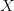
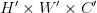
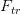
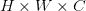
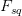
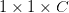
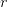
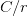
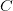

# 使用 Keras 和 TensorFlow 关注渠道

> 原文：<https://pyimagesearch.com/2022/05/30/attending-to-channels-using-keras-and-tensorflow/>

* * *

## **目录**

* * *

## [**利用 Keras 和 TensorFlow**](#TOC) 参加渠道

使用卷积神经网络(CNN)，我们可以让我们的模型从图像中找出空间和通道特征。然而，空间特征侧重于如何计算等级模式。

在本教程中，您将了解如何使用 Keras 和 TensorFlow 关注渠道，这是一种新颖的研究理念，其中您的模型侧重于信息的渠道表示，以更好地处理和理解数据。

**要学习如何实施渠道关注，** ***只要保持阅读。***

* * *

## [**利用 Keras 和 TensorFlow**](#TOC) 参加渠道

2017 年，胡等人发表了题为[压缩-激发网络](https://arxiv.org/abs/1709.01507)的论文。他们的方法基于这样一个概念，即以某种方式关注通道方式的特征表示和空间特征将产生更好的结果。

这个想法是一种新颖的架构，它自适应地为通道特性分配一个加权值，本质上是模拟通道之间的相互依赖关系。

这种被提议的结构被称为挤压激励(SE)网络。作者成功地实现了利用频道功能重新校准的附加功能来帮助网络更多地关注基本功能，同时抑制不太重要的功能的目标。

* * *

### [](#TOC)

 **SE 网络块可以是任何标准卷积神经网络的附加模块。网络的完整架构见**图 1** 。

在进入代码之前，让我们先看一下完整的架构。

首先，我们有一个输入数据

, of dimensions . is passed through a transformation (consider it to be a convolution operation) .

现在我们有

feature map of dimensions . We know that another normal convolution operation will give us channels that will have some spatial information or the other.

但是如果我们走不同的路线呢？我们使用操作

to squeeze out our input feature map . Now we have a representation of the shape . This is considered a global representation of the channels.

现在我们将应用“激发”操作。我们将简单地创建一个具有 sigmoid 激活函数的小型密集网络。这确保了我们没有对这种表示使用简单的一次性编码。

一键编码违背了在多个通道而不仅仅是一个通道上实现强调的目的。我们可以从**图 2** 中大致了解一下密集网络。

通过该模块的激励部分，我们旨在创建一个没有线性的小网络。当我们在网络中前进时，你可以看到层的形状是如何变化的。

第一密集层使用比率减少过滤器

. This reduces the computational complexity while the network’s intention of a non-linear, sigmoidal nature is maintained.

SE 块的最后一个 sigmoid 层输出一个通道式关系，应用到你的特征图

. Now you have achieved a convolution block output where the importance of channels is also specified! (Check **Figure 1** for the colored output at the end. The color scheme represents channel-wise importance.)

* * *

### [**配置您的开发环境**](#TOC)

要遵循这个指南，您需要在您的系统上安装 OpenCV 库。

幸运的是，OpenCV 可以通过 pip 安装:

```py
$ pip install opencv-contrib-python
$ pip install tensorflow
```

**如果您需要帮助配置 OpenCV 的开发环境，我们*强烈推荐*阅读我们的** [***pip 安装 OpenCV* 指南**](https://www.pyimagesearch.com/2018/09/19/pip-install-opencv/)——它将在几分钟内让您启动并运行。

* * *

### [**在配置开发环境时遇到了问题？**](#TOC)

说了这么多，你是:

*   时间紧迫？
*   了解你雇主的行政锁定系统？
*   想要跳过与命令行、包管理器和虚拟环境斗争的麻烦吗？
*   **准备好在您的 Windows、macOS 或 Linux 系统上运行代码*****？***

 *那今天就加入 [PyImageSearch 大学](https://www.pyimagesearch.com/pyimagesearch-university/)吧！

**获得本教程的 Jupyter 笔记本和其他 PyImageSearch 指南，这些指南是** ***预先配置的*** **，可以在您的网络浏览器中运行在 Google Colab 的生态系统上！**无需安装。

最棒的是，这些 Jupyter 笔记本可以在 Windows、macOS 和 Linux 上运行！

* * *

### [**项目结构**](#TOC)

我们首先需要回顾我们的项目目录结构。

首先访问本教程的 ***“下载”*** 部分，检索源代码和示例图像。

从这里，看一下目录结构:

```py
!tree .
.
├── output.txt
├── pyimagesearch
│   ├── config.py
│   ├── data.py
│   ├── __init__.py
│   └── model.py
├── README.md
└── train.py

1 directory, 7 files
```

首先，让我们检查一下`pyimagesearch`目录:

*   `config.py`:包含完整项目的端到端配置管道。
*   `data.py`:包含处理数据的实用函数。
*   包含了我们项目要使用的模型架构。
*   `__init__.py`:在 python 目录中创建目录，以便于包调用和使用。

在核心目录中，我们有:

*   `output.txt`:包含我们项目输出的文本文件。
*   `train.py`:包含我们项目的培训程序。

* * *

### [**配置先决条件**](#TOC)

首先，我们将回顾位于我们代码的`pyimagesearch`目录中的`config.py`脚本。该脚本包含几个定义的参数和超参数，将在整个项目流程中使用。

```py
# define the number of convolution layer filters and dense layer units
CONV_FILTER = 64
DENSE_UNITS = 4096

# define the input shape of the dataset
INPUT_SHAPE = (32, 32, 3)

# define the block hyperparameters for the VGG models
BLOCKS = [
	(1, 64),
	(2, 128),
	(2, 256)
]

# number of classes in the CIFAR-10 dataset
NUMBER_CLASSES = 10

# the ratio for the squeeze-and-excitation layer
RATIO = 16

# define the model compilation hyperparameters
OPTIMIZER = "adam"
LOSS = "sparse_categorical_crossentropy"
METRICS = ["acc"]

# define the number of training epochs and the batch size
EPOCHS = 100
BATCH_SIZE = 32
```

在**第 2 行和第 3 行**上，我们已经定义了卷积滤波器和密集节点的数量，稍后在定义我们的模型时将会用到它们。

在第 6 行的**上，定义了我们的图像数据集的输入形状。**

VGG 模型的块超参数在第 9-13 行的**中定义。它采用元组格式，包含层的数量和层的过滤器数量。接下来指定数据集中类的数量(**第 16 行**)。**

励磁块所需的比率已在**行 19** 中定义。然后，在**的第 22-24 行**，指定了优化器、损失和度量等模型规范。

我们最终的配置变量是时期和批量大小(**第 27 行和第 28 行**)。

* * *

### [**预处理 CIFAR-10 数据集**](#TOC)

对于我们今天的项目，我们将使用 [CIFAR-10](https://www.cs.toronto.edu/~kriz/cifar.html) 数据集来训练我们的模型。数据集将为我们提供 60000 个 **32×32×3** 图像的实例，每个实例属于 **10 个类别**中的一个。

在将其插入我们的项目之前，我们将执行一些预处理，以使数据更适合于训练。为此，让我们转到`pyimagesearch`目录中的`data.py`脚本。

```py
# import the necessary packages
from tensorflow.keras.datasets import cifar10
import numpy as np

def standardization(xTrain, xVal, xTest):
	# extract the mean and standard deviation from the train dataset
	mean = np.mean(xTrain)
	std  = np.std(xTrain)

	# standardize the training, validation, and the testing dataset
	xTrain = ((xTrain - mean) / std).astype(np.float32)
	xVal = ((xVal - mean) / std).astype(np.float32)
	xTest  = ((xTest  - mean) / std).astype(np.float32)

	# return the standardized training, validation and the testing
	# dataset
	return (xTrain, xVal, xTest)
```

我们已经使用 tensorflow 将`cifar10`数据集直接加载到我们的项目中( **Line 2** )。

我们将使用的第一个预处理函数是`standardization` ( **第 5 行**)。它使用训练图像、验证图像和测试图像作为其参数。

我们在第 7 行和第 8 行获取训练集的平均值和标准偏差。我们将使用这些值来改变我们所有的分割。在**的第 11-13 行**，我们根据训练集的平均值和标准偏差值对训练集、验证集和测试集进行标准化。

你可能会想，为什么我们要故意改变图像的像素值呢？这是为了让我们可以将完整数据集的分布调整为更精确的曲线。这有助于我们的模型更好地理解数据，并更准确地做出预测。

这样做的唯一缺点是，在将推断图像输入到我们的模型之前，我们还必须以这种方式改变它们，否则我们很可能会得到错误的预测。

```py
def get_cifar10_data():
	# get the CIFAR-10 data
	(xTrain, yTrain), (xTest, yTest) = cifar10.load_data()

	# split the training data into train and val sets
	trainSize = int(0.9 * len(xTrain))
	((xTrain, yTrain), (xVal, yVal)) = (
		(xTrain[:trainSize], yTrain[:trainSize]),
		(xTrain[trainSize:], yTrain[trainSize:]))
	(xTrain, xVal, xTest) = standardization(xTrain, xVal, xTest)

	# return the train, val, and test datasets
	return ((xTrain, yTrain), (xVal, yVal), (xTest, yTest))
```

我们的下一个功能是 19 号线的**上的`get_cifar10_data`。我们使用 **`tensorflow`** 加载 **`cifar10`** 数据集，并将其解包到训练集和测试集中。**

接下来，在**第 24-27 行**，我们使用索引将训练集分成两部分:训练集和验证集。在返回 3 个分割之前，我们使用之前创建的`standardization`函数来预处理数据集(**第 28-31 行**)。

* * *

### [**定义我们的培训模式架构**](#TOC)

随着我们的数据管道都开始工作，我们清单上的下一件事是模型架构。为此，我们将转移到位于`pyimagesearch`目录中的`model.py`脚本。

模型架构受到[惯用程序员模型动物园](https://github.com/GoogleCloudPlatform/keras-idiomatic-programmer)的大量启发。

```py
# import the necessary packages
from tensorflow.keras.layers import GlobalAveragePooling2D
from tensorflow.keras.layers import MaxPooling2D
from tensorflow.keras.layers import Multiply
from tensorflow.keras.layers import Flatten
from tensorflow.keras.layers import Conv2D
from tensorflow.keras.layers import Dense
from tensorflow.keras.layers import ReLU
from tensorflow.keras import Input
from tensorflow.keras import Model
from tensorflow import keras

class VGG:
	def __init__(self, inputShape, ratio, blocks, numClasses,
		denseUnits, convFilters, isSqueezeExcite, optimizer, loss,
		metrics):
		# initialize the input shape, the squeeze excitation ratio,
		# the blocks for the VGG architecture, and the number of 
		# classes for the classifier
		self.inputShape = inputShape
		self.ratio = ratio
		self.blocks = blocks
		self.numClasses = numClasses

		# initialize the dense layer units and conv filters
		self.denseUnits = denseUnits
		self.convFilters = convFilters

		# flag that decides whether to add the squeeze excitation
		# layer to the network
		self.isSqueezeExcite = isSqueezeExcite

		# initialize the compilation parameters
		self.optimizer = optimizer
		self.loss = loss
		self.metrics = metrics
```

为了使事情更简单，我们在第 13 行的**上为我们的模型架构创建了一个类模板，命名为`VGG`。**

我们的第一个函数是 `__init__`，它接受以下参数(**第 14-36 行**)。

*   `inputShape`:确定输入数据的形状，以馈入我们的模型。
*   `ratio`:确定`excitation`模块降维时的比率。
*   `blocks`:指定我们想要的图层块的数量。
*   `numClasses`:指定我们需要的输出类的数量。
*   `denseUnits`:指定密集节点的数量。
*   `convFilters`:指定一个`conv`层的卷积滤波器的数量。
*   `isSqueezeExcite`:检查一个块是否是阿瑟块。
*   `optimizer`:定义用于模型的优化器。
*   `loss`:定义用于模型的损耗。
*   `metrics`:定义模型训练要考虑的指标。

```py
	def stem(self, inputs):
		# pass the input through a CONV => ReLU layer block
		x = Conv2D(filters=self.convFilters, kernel_size=(3, 3),
			strides=(1, 1), padding="same", activation="relu")(inputs)

		# return the processed inputs
		return x

	def learner(self, x):
		# build the learner by stacking blocks of convolutional layers
		for numLayers, numFilters in self.blocks:
			x = self.group(x, numLayers, numFilters)

		# return the processed inputs
		return x
```

接下来，我们有基本功能。第一个是`stem` ( **第 38 行**)，它接受一个层输入作为它的参数。然后，在函数内部，它通过卷积层传递层输入并返回输出(**第 40-44 行**)。

**线 46** 上的以下功能为`learner`。它将图层输入作为其参数。此功能的目的是堆叠层块。

我们之前已经将`blocks`定义为包含层和针对层的过滤器的元组的集合。我们迭代那些在**第 48 行**的。在**第 49 行**引用了一个名为`group`的函数，在此之后定义。

```py
	def group(self, x, numLayers, numFilters):
		# iterate over the number of layers and build a block with 
		# convolutional layers
		for _ in range(numLayers):
			x = Conv2D(filters=numFilters, kernel_size=(3, 3),
				strides=(1, 1), padding="same", activation="relu")(x)

		# max pool the output of the convolutional block, this is done
		# to reduce the spatial dimension of the output
		x = MaxPooling2D(2, strides=(2, 2))(x)

		# check if we are going to add the squeeze excitation block
		if self.isSqueezeExcite:
			# add the squeeze excitation block followed by passing the
			# output through a ReLU layer
			x = self.squeeze_excite_block(x)
			x = ReLU()(x)

		# return the processed outputs 
		return x
```

之前引用的函数`group`在**行 54** 中定义。它接受层输入、层数和过滤器数作为参数。

在第 57 行**上，我们迭代层数并添加卷积层。一旦循环结束，我们添加一个最大池层(**第 63 行**)。**

在**线路 66** 上，我们检查该模型是否为 SE 网络，并相应地在**线路 69** 上添加一个 SE 块。接下来是一个`ReLU`层。

```py
	def squeeze_excite_block(self, x):
		# store the input
		shortcut = x

		# calculate the number of filters the input has
		filters = x.shape[-1]

		# the squeeze operation reduces the input dimensionality
		# here we do a global average pooling across the filters, which
		# reduces the input to a 1D vector
		x = GlobalAveragePooling2D(keepdims=True)(x)

		# reduce the number of filters (1 x 1 x C/r)
		x = Dense(filters // self.ratio, activation="relu",
			kernel_initializer="he_normal", use_bias=False)(x)

		# the excitation operation restores the input dimensionality
		x = Dense(filters, activation="sigmoid",
			kernel_initializer="he_normal", use_bias=False)(x)

		# multiply the attention weights with the original input
		x = Multiply()([shortcut, x])

		# return the output of the SE block
		return x
```

最后，我们到达 SE 块(**第 75 行**)。但是，首先，我们将输入存储在**线 77** 上以备后用。

在**第 80 行**上，我们计算挤压操作的过滤器数量。

在**85**行，我们有`squeeze`操作。接下来是`excitation`操作。我们首先将过滤器的数量减少到

for purposes explained in the introduction section by adding a dense layer with nodes. (For a quick reminder, it is for complexity reduction.)

随后是维度恢复，因为我们有另一个密度函数，其滤波器等于

.

恢复维度后，sigmoid 函数为我们提供了每个通道的权重。因此，我们需要做的就是将它乘以我们之前存储的输入，现在我们有了加权的通道输出(**第 96 行**)。这也是论文作者所说的规模经营。

```py
	def classifier(self, x):
		# flatten the input
		x = Flatten()(x)

		# apply Fully Connected Dense layers with ReLU activation
		x = Dense(self.denseUnits, activation="relu")(x)
		x = Dense(self.denseUnits, activation="relu")(x)
		x = Dense(self.numClasses, activation="softmax")(x)

		# return the predictions
		return x

	def build_model(self):
		# initialize the input layer
		inputs = Input(self.inputShape)

		# pass the input through the stem => learner => classifier
		x = self.stem(inputs)
		x = self.learner(x)
		outputs = self.classifier(x)

		# build the keras model with the inputs and outputs
		model = Model(inputs, outputs)

		# return the model
		return model
```

在**第 101** 行，我们为架构的剩余层定义了`classifier`函数。我们添加一个展平层，然后是 3 个密集层，最后一个是我们的输出层，其过滤器的数量等于`cifar10`数据集中的类的数量(**第 106-111 行**)。

有了我们的架构，我们接下来的函数就是`build_model` ( **第 113 行**)。这个函数只是用来使用我们到目前为止定义的函数，并按照正确的顺序设置它。在**第 118-120 行**上，我们首先使用`stem`函数，然后使用`learner`函数，最后用`classifier`函数将其加满。

在第 124-126 行上，我们初始化并返回模型。这就完成了我们的模型架构。

```py
	def train_model(self, model, xTrain, yTrain, xVal, yVal, epochs,
		batchSize):
		# compile the model
		model.compile(
			optimizer=self.optimizer, loss=self.loss,
			metrics=self.metrics)

		# initialize a list containing our callback functions
		callbacks = [
			keras.callbacks.EarlyStopping(monitor="val_loss",
				patience=5, restore_best_weights=True),
			keras.callbacks.ReduceLROnPlateau(monitor="val_loss",
				patience=3)
			]

		# train the model
		model.fit(xTrain, yTrain, validation_data=(xVal, yVal),
			epochs=epochs, batch_size=batchSize, callbacks=callbacks)

		# return the trained model
		return model
```

在第 128 行的**上，我们有函数`train_model`，它接受以下参数:**

*   `model`:将用于训练的模型。
*   `xTrain`:训练图像输入数据集。
*   `yTrain`:训练数据集标签。
*   `xVal`:验证图像数据集。
*   `yVal`:验证标签。
*   `epochs`:指定运行训练的次数。
*   `batchSize`:指定抓取数据的批量大小。

我们首先用优化器、损失和指标来编译我们的模型(**第 131-133 行**)。

在第 136-141 行上，我们设置了一些回调函数来帮助我们的训练。最后，我们将数据放入我们的模型，并开始训练(**第 144 和 145 行**)。

* * *

### [**训练压缩激励网络**](#TOC)

我们最后的任务是训练 SE 网络并记录其结果。然而，首先，为了理解它如何优于常规的 CNN，我们将一起训练一个普通的 CNN 和阿瑟区块供电的 CNN 来记录它们的结果。

为此，让我们转到位于我们项目根目录中的`train.py`脚本。

```py
# USAGE
# python train.py

# setting the random seed for reproducibility
import tensorflow as tf
tf.keras.utils.set_random_seed(42)

# import the necessary packages
from pyimagesearch import config
from pyimagesearch.model import VGG
from pyimagesearch.data import get_cifar10_data

# get the dataset
print("[INFO] downloading the dataset...")
((xTrain, yTrain), (xVal, yVal), (xTest, yTest)) = get_cifar10_data()

# build a vanilla VGG model
print("[INFO] building a vanilla VGG model...")
vggObject = VGG(inputShape=config.INPUT_SHAPE, ratio=config.RATIO,
	blocks=config.BLOCKS, numClasses=config.NUMBER_CLASSES,
	denseUnits=config.DENSE_UNITS, convFilters=config.CONV_FILTER,
	isSqueezeExcite=False, optimizer=config.OPTIMIZER, loss=config.LOSS,
	metrics=config.METRICS)
vggModel = vggObject.build_model()

# build a VGG model with SE layer
print("[INFO] building VGG model with SE layer...")
vggSEObject = VGG(inputShape=config.INPUT_SHAPE, ratio=config.RATIO,
	blocks=config.BLOCKS, numClasses=config.NUMBER_CLASSES,
	denseUnits=config.DENSE_UNITS, convFilters=config.CONV_FILTER,
	isSqueezeExcite=True, optimizer=config.OPTIMIZER, loss=config.LOSS,
	metrics=config.METRICS)
vggSEModel = vggSEObject.build_model()
```

在第 6 行的**上，和其他导入一起，我们定义了一个特定的随机种子，使得我们的项目在每次有人运行时都是可重复的。**

在**的第 14 和 15 行，**我们使用之前在`data.py`脚本中创建的`get_cifar10_data`函数下载`cifar10`数据集。数据被分成三部分:训练、验证和测试。

然后，我们使用我们的模型架构脚本`model.py` ( **第 19-24 行**)初始化普通 CNN。如果你没记错的话，我们的类中有一个`isSqueezeExcite` bool 变量，它告诉函数要初始化的模型是否有阿瑟块。对于普通的 CNN，我们只需将该变量设置为`False` ( **第 22 行**)。

现在，我们将使用 SE 块初始化 CNN。我们遵循与之前创建的普通 CNN 相同的步骤，保持所有参数不变，除了`isSqueezeExcite` bool 变量，在本例中我们将它设置为`True`。

***注意:*** *所有你看到正在使用的参数都已经在我们的`config.py`脚本中定义好了。*

```py
# train the vanilla VGG model
print("[INFO] training the vanilla VGG model...")
vggModel = vggObject.train_model(model=vggModel, xTrain=xTrain,
	yTrain=yTrain, xVal=xVal, yVal=yVal, epochs=config.EPOCHS,
	batchSize=config.BATCH_SIZE)

# evaluate the vanilla VGG model on the testing dataset
print("[INFO] evaluating performance of vanilla VGG model...")
(loss, acc) = vggModel.evaluate(xTest, yTest,
	batch_size=config.BATCH_SIZE)

# print the testing loss and the testing accuracy of the vanilla VGG
# model
print(f"[INFO] VANILLA VGG TEST Loss: {loss:0.4f}")
print(f"[INFO] VANILLA VGG TEST Accuracy: {acc:0.4f}")
```

首先，使用来自`VGG`类模板的`train_model`函数训练普通的 CNN(**第 37-39 行**)。然后，使用测试数据集测试的普通 CNN 的损失和准确性被存储在**行 43 和 44** 上。

```py
# train the VGG model with the SE layer
print("[INFO] training the VGG model with SE layer...")
vggSEModel = vggSEObject.train_model(model=vggSEModel, xTrain=xTrain,
	yTrain=yTrain, xVal=xVal, yVal=yVal, epochs=config.EPOCHS,
	batchSize=config.BATCH_SIZE)

# evaluate the VGG model with the SE layer on the testing dataset
print("[INFO] evaluating performance of VGG model with SE layer...")
(loss, acc) = vggSEModel.evaluate(xTest, yTest,
	batch_size=config.BATCH_SIZE)

# print the testing loss and the testing accuracy of the SE VGG
# model
print(f"[INFO] SE VGG TEST Loss: {loss:0.4f}")
print(f"[INFO] SE VGG TEST Accuracy: {acc:0.4f}")
```

现在是用 SE 块(**线 53-55** )训练`VGG`模型的时候了。我们类似地存储在测试数据集上测试的`VGG` SE 模型的损失和准确性(**行 59 和 60** )。

我们打印这些值，以便与普通的 CNN 结果进行比较。

让我们来看看这些模特们的表现如何！

```py
[INFO] building a vanilla VGG model...
[INFO] training the vanilla VGG model...
Epoch 1/100
1407/1407 [==============================] - 22s 10ms/step - loss: 1.5038 - acc: 0.4396 - val_loss: 1.1800 - val_acc: 0.5690 - lr: 0.0010
Epoch 2/100
1407/1407 [==============================] - 13s 9ms/step - loss: 1.0136 - acc: 0.6387 - val_loss: 0.8751 - val_acc: 0.6922 - lr: 0.0010
Epoch 3/100
1407/1407 [==============================] - 13s 9ms/step - loss: 0.8177 - acc: 0.7109 - val_loss: 0.8017 - val_acc: 0.7200 - lr: 0.0010
...
Epoch 8/100
1407/1407 [==============================] - 13s 9ms/step - loss: 0.3874 - acc: 0.8660 - val_loss: 0.7762 - val_acc: 0.7616 - lr: 0.0010
Epoch 9/100
1407/1407 [==============================] - 13s 9ms/step - loss: 0.1571 - acc: 0.9441 - val_loss: 0.9518 - val_acc: 0.7880 - lr: 1.0000e-04
Epoch 10/100
1407/1407 [==============================] - 13s 9ms/step - loss: 0.0673 - acc: 0.9774 - val_loss: 1.1386 - val_acc: 0.7902 - lr: 1.0000e-04

[INFO] evaluating performance of vanilla VGG model...
313/313 [==============================] - 1s 4ms/step - loss: 0.7785 - acc: 0.7430

[INFO] VANILLA VGG TEST Loss: 0.7785
[INFO] VANILLA VGG TEST Accuracy: 0.7430
```

首先，我们有香草 VGG，它已经训练了`10`个时代，达到了`97%`的训练精度。验证精度在`79%`达到峰值。我们已经可以看到，香草 VGG 没有推广好。

在评估测试数据集时，精确度达到`74%`。

```py
[INFO] building VGG model with SE layer...
[INFO] training the VGG model with SE layer...
Epoch 1/100
1407/1407 [==============================] - 18s 12ms/step - loss: 1.5177 - acc: 0.4352 - val_loss: 1.1684 - val_acc: 0.5710 - lr: 0.0010
Epoch 2/100
1407/1407 [==============================] - 17s 12ms/step - loss: 1.0092 - acc: 0.6423 - val_loss: 0.8803 - val_acc: 0.6892 - lr: 0.0010
Epoch 3/100
1407/1407 [==============================] - 17s 12ms/step - loss: 0.7834 - acc: 0.7222 - val_loss: 0.7986 - val_acc: 0.7272 - lr: 0.0010
...
Epoch 8/100
1407/1407 [==============================] - 17s 12ms/step - loss: 0.2723 - acc: 0.9029 - val_loss: 0.8258 - val_acc: 0.7754 - lr: 0.0010
Epoch 9/100
1407/1407 [==============================] - 17s 12ms/step - loss: 0.0939 - acc: 0.9695 - val_loss: 0.8940 - val_acc: 0.8058 - lr: 1.0000e-04
Epoch 10/100
1407/1407 [==============================] - 17s 12ms/step - loss: 0.0332 - acc: 0.9901 - val_loss: 1.1226 - val_acc: 0.8116 - lr: 1.0000e-04

[INFO] evaluating performance of VGG model with SE layer...
313/313 [==============================] - 2s 5ms/step - loss: 0.7395 - acc: 0.7572

[INFO] SE VGG TEST Loss: 0.7395
[INFO] SE VGG TEST Accuracy: 0.7572
```

SE VGG 达到了`99%`的训练精度。验证精度在`81%`达到峰值。概括仍然不好，但可以称为比香草 VGG 更好。

经过相同次数的训练后，测试精度达到了`75%`，超过了普通的 VGG。

* * *

* * *

## [**汇总**](#TOC)

这篇文章结束了我们关于修正卷积神经网络(CNN)的连续博客。在我们的上一篇文章中，我们看到了如何教会 CNN 自己校正图像的方向。本周，我们知道了当频道特性也包含在特性池中时会发生什么。

结果一清二楚；我们可以推动 CNN 采取额外的措施，并通过正确的方法获得更好的结果。

今天，我们使用了经常被忽略的通道来支持空间信息。虽然空间信息对肉眼来说更有意义，但算法提取信息的方式不应受到破坏。

我们比较了附加挤压激励(SE)模块的普通架构。结果显示，当 SE 模块连接到网络上时，网络评估模式的能力有所提高。SE 块简单地添加到全局特征池中，允许模型从更多特征中进行选择。

* * *

### [**引用信息**](#TOC)

**Chakraborty，D.** “使用 Keras 和 TensorFlow 关注频道”， *PyImageSearch* ，P. Chugh，A. R. Gosthipaty，S. Huot，K. Kidriavsteva，R. Raha 和 A. Thanki 编辑。，2022 年，【https://pyimg.co/jq94n 

```py
@incollection{Chakraborty_2022_Attending_Channels,
  author = {Devjyoti Chakraborty},
  title = {Attending to Channels Using {Keras} and {TensorFlow}},
  booktitle = {PyImageSearch},  editor = {Puneet Chugh and Aritra Roy Gosthipaty and Susan Huot and Kseniia Kidriavsteva and Ritwik Raha and Abhishek Thanki},
  year = {2022},
  note = {https://pyimg.co/jq94n},
}
```

* * *

**要下载这篇文章的源代码(并在未来教程在 PyImageSearch 上发布时得到通知)，*只需在下面的表格中输入您的电子邮件地址！******