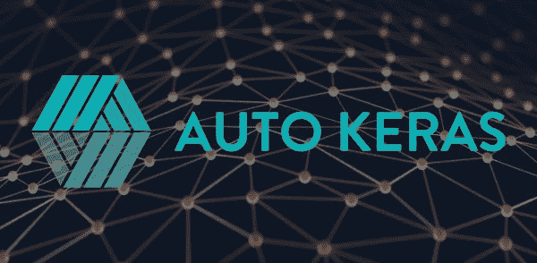
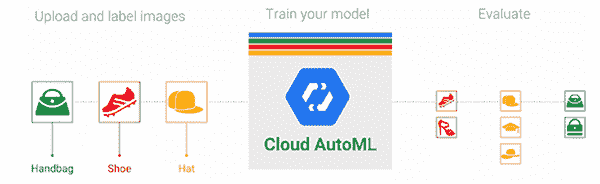
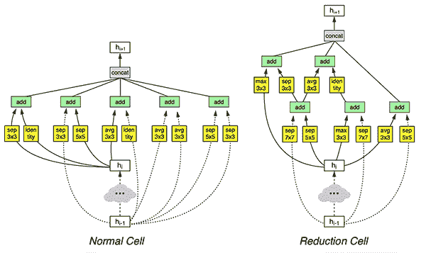
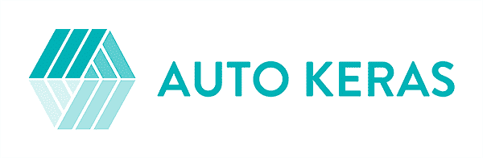
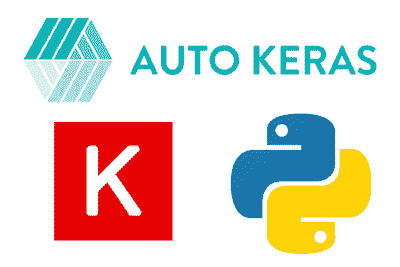
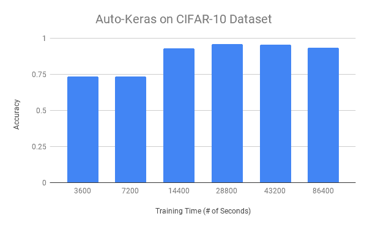

# Auto-Keras 和 AutoML:入门指南

> 原文：<https://pyimagesearch.com/2019/01/07/auto-keras-and-automl-a-getting-started-guide/>

[](https://pyimagesearch.com/wp-content/uploads/2019/01/autokeras_header.jpg)

在本教程中，您将学习如何使用 Auto-Keras，这是谷歌 AutoML 的开源替代产品，用于自动化机器学习和深度学习。

当在数据集上训练神经网络时，深度学习实践者试图优化和平衡两个主要目标:

1.  **定义适合数据集特性的神经网络架构**
2.  **通过多次实验调整一组超参数**，这将产生一个具有高精度的模型，并且能够推广到训练和测试集之外的数据。需要调整的典型超参数包括优化器算法(SGD、Adam 等。)，学习率和学习率调度，以及正则化，等等

根据数据集和问题的不同，深度学习专家可能需要进行多达*十*到*数百*次实验，才能在神经网络架构和超参数之间找到平衡。

这些实验在 GPU 计算时间上总计可达数百到数千小时。

而且这还只是针对*专家*——非深度学习专家呢？

输入自动角和自动:

Auto-Keras 和 AutoML 的最终目标都是通过使用*自动化*神经架构搜索(NAS)算法来降低执行机器学习和深度学习的门槛。

**Auto-Keras 和 AutoML 使非深度学习专家能够利用深度学习或其实际数据的*最少*领域知识来训练自己的模型。**

使用 AutoML 和 Auto-Keras，具有最少机器学习专业知识的程序员可以应用这些算法，不费吹灰之力实现最先进的性能。

听起来好得难以置信？

嗯，也许吧——但你需要先阅读这篇文章的其余部分，找出原因。

**要了解更多关于 AutoML(以及如何*自动*用 Auto-Keras 训练和调整神经网络)，*继续阅读！***

## Auto-Keras 和 AutoML:入门指南

在这篇博文的第一部分，我们将讨论**自动机器学习(AutoML)** 和**神经架构搜索(NAS)** ，这种算法使 AutoML 在应用于神经网络和深度学习时成为可能。

我们还将简要讨论**谷歌的 AutoML** ，这是一套工具和库，允许具有有限机器学习专业知识的程序员根据自己的数据训练高精度模型。

当然，Google 的 AutoML 是一个专有算法(它也有点贵)。

AutoML 的替代方案是围绕 Keras 和 PyTorch 构建的开源 Auto-Keras。

然后，我将向您展示如何使用 Auto-Keras 自动*训练一个网络，并对其进行评估。*

 *### 什么是自动机器学习(AutoML)？

[](https://pyimagesearch.com/wp-content/uploads/2019/01/autokeras_automl.png)

**Figure 1:** Auto-Keras is an alternative to [Google’s AutoML](https://cloud.google.com/automl/). These software projects can help you train models automatically with little intervention. They are great options for novice deep learning practitioners or to obtain a baseline to beat later on.

在无监督学习(从未标记数据中自动学习模式)之外，面向非专家的自动化机器学习被认为是机器学习的“圣杯”。

想象一下*通过以下方式自动*创建机器学习模型的能力:

1.  安装库/使用 web 界面
2.  将库/接口指向您的数据
3.  根据数据*自动训练模型，而*不必调整参数/需要深入了解驱动它的算法

一些公司正试图创造这样的解决方案——一个大的例子是谷歌的 AutoML。

Google AutoML 使机器学习经验非常有限的开发人员和工程师能够在自己的数据集上自动训练神经网络。

在引擎盖下，谷歌的 AutoML 算法是迭代的:

1.  在训练集上训练网络
2.  在测试集上评估网络
3.  修改神经网络架构
4.  调谐超参数
5.  重复这个过程

使用 AutoML 的程序员或工程师不需要定义他们自己的神经网络架构或调整超参数——AutoML 会自动为他们完成这些工作。

### 神经结构搜索(NAS)使 AutoML 成为可能

[](https://pyimagesearch.com/wp-content/uploads/2019/01/autokeras_cells.png)

**Figure 2:** Neural Architecture Search (NAS) produced a model summarized by these graphs when searching for the best CNN architecture for CIFAR-10 (source: Figure 4 of [Zoph et al.](https://arxiv.org/pdf/1707.07012.pdf))

谷歌的 AutoML 和 Auto-Keras 都是由一种叫做神经架构搜索(NAS)的算法驱动的。

给定你的输入数据集，一个神经结构搜索算法将*自动*搜索最佳的结构和相应的参数。

神经架构搜索本质上是用一套自动调优模型的算法来代替深度学习工程师/从业者！

在计算机视觉和图像识别的背景下，神经架构搜索算法将:

1.  接受输入训练数据集
2.  优化并找到称为“单元”的*架构构建块*——这些单元是自动学习的，可能看起来类似于初始、剩余或挤压/发射微架构
3.  不断训练和搜索“NAS 搜索空间”以获得更优化的单元

如果 AutoML 系统的用户是经验丰富的深度学习实践者，那么他们可以决定:

1.  在训练数据集的一个非常小的子集上运行 NAS
2.  找到一组最佳的架构构建块/单元
3.  获取这些单元，并手动定义在架构搜索期间发现的网络的更深版本
4.  使用他们自己的专业知识和最佳实践对网络进行全面培训

这样的方法是完全自动化的机器学习解决方案和需要专业深度学习实践者的解决方案之间的*混合*——通常这种方法会比 NAS 自己发现的方法更准确。

我建议阅读 [*带强化学习的神经架构搜索*](https://arxiv.org/abs/1611.01578) (Zoph 和 Le，2016)以及 [*学习可扩展图像识别的可转移架构*](https://arxiv.org/abs/1707.07012) (Zoph 等人，2017)，以了解这些算法如何工作的更多详细信息。

### auto-Keras:Google AutoML 的开源替代方案

[](https://pyimagesearch.com/wp-content/uploads/2019/01/autokeras_logo.png)

**Figure 3:** The [Auto-Keras](https://autokeras.com/) package was developed by the DATA Lab team at Texas A&M University. Auto-Keras is an open source alternative to [Google’s AutoML](https://cloud.google.com/automl/).

由德克萨斯 A & M 大学的[数据实验室团队开发的](http://people.tamu.edu/~guangzhou92/Data_Lab/) [Auto-Keras](https://autokeras.com/) 软件包是谷歌 AutoML 的替代产品。

Auto-Keras 还利用神经架构搜索，但应用“网络态射”(在改变架构时保持网络功能)以及贝叶斯优化来指导网络态射，以实现更高效的神经网络搜索。

你可以在金等人的 2018 年出版物中找到 Auto-Keras 框架的完整细节， [*Auto-Keras:使用网络态射的高效神经架构搜索*](https://arxiv.org/abs/1806.10282) 。

### 项目结构

继续从今天博客文章的 ***【下载】*** 部分抓取压缩文件。

从那里你应该解压文件并使用你的终端导航到它。

让我们用`tree`命令来检查今天的项目:

```py
$ tree --dirsfirst
.
├── output
│   ├── 14400.txt
│   ├── 28800.txt
│   ├── 3600.txt
│   ├── 43200.txt
│   ├── 7200.txt
│   └── 86400.txt
└── train_auto_keras.py

1 directory, 7 files

```

今天我们将回顾一个 Python 脚本:`train_auto_keras.py`。

由于会有大量输出打印到屏幕上，我选择将我们的分类报告(在 scikit-learn 的`classification_report`工具的帮助下生成)作为文本文件保存到磁盘上。检查上面的`output/`文件夹，您可以看到一些已经生成的报告。继续在您的终端(`cat output/14400.txt`)上打印一个，看看它是什么样子。

### 安装 Auto-Keras

[](https://pyimagesearch.com/wp-content/uploads/2019/01/autokeras_libraries.png)

**Figure 4:** The Auto-Keras package depends upon Python 3.6, TensorFlow, and Keras.

正如 [Auto-Keras GitHub 库声明的](https://github.com/jhfjhfj1/autokeras)，Auto-Keras 处于“预发布”状态——这是*而不是*正式发布。

**其次，Auto-Keras *需要* Python 3.6，并且*只有*兼容 Python 3.6。**

如果你使用的是除了 3.6 之外的任何其他版本的 Python，你将能够使用 Auto-Keras 包***而不是**。*

要检查您的 Python 版本，只需使用以下命令:

```py
$ python --version

```

如果您有 Python 3.6，您可以使用 pip 安装 Auto-Keras:

```py
$ pip install tensorflow # or tensorflow-gpu
$ pip install keras
$ pip install autokeras

```

如果您在安装或使用 Auto-Keras 时有任何问题，请确保您在官方的 [Auto-Keras GitHub 问题页面](https://github.com/jhfjhfj1/autokeras/issues)上发帖，作者将能够帮助您。

### 用 Auto-Keras 实现我们的培训脚本

让我们继续使用 Auto-Keras 实现我们的培训脚本。打开`train_auto_keras.py`文件并插入以下代码:

```py
# import the necessary packages
from sklearn.metrics import classification_report
from keras.datasets import cifar10
import autokeras as ak
import os

def main():
	# initialize the output directory
	OUTPUT_PATH = "output"

```

首先，我们在第 2-5 行导入必要的包:

*   如前所述，我们将使用 scikit-learn 的`classification_report`来计算统计数据，并将其保存在输出文件中。
*   我们将使用 [CIFAR-10 数据集](https://www.cs.toronto.edu/~kriz/cifar.html)，它方便地内置在`keras.datasets`中。
*   接下来是我们最显著的导入，`autokeras`，为了简化，我将其导入为`ak`。
*   需要`os`模块，因为我们将在构建输出文件路径时在各种操作系统上容纳路径分隔符。

让我们在**第 7 行**为我们的脚本定义`main`函数。由于 Auto-Keras 和 TensorFlow 处理线程的方式，我们需要将代码包装在一个`main`函数中。详见[本 GitHub 发布线程](https://github.com/jhfjhfj1/autokeras/issues/311)。

我们的基地`OUTPUT_PATH`定义在**线 9** 上。

现在，让我们初始化自动 Keras 的训练时间列表:

```py
	# initialize the list of training times that we'll allow
	# Auto-Keras to train for
	TRAINING_TIMES = [
		60 * 60,		# 1 hour
		60 * 60 * 2,	# 2 hours
		60 * 60 * 4,	# 4 hours
		60 * 60 * 8,	# 8 hours
		60 * 60 * 12,	# 12 hours
		60 * 60 * 24,	# 24 hours
	]

```

**第 13-20 行**定义了一组`TRAINING_TIMES` ，包括`[1, 2, 4, 8, 12, 24]`小时。今天，我们将使用 Auto-Keras 探索更长的训练时间对准确性的影响。

让我们加载 CIFAR-10 数据集并初始化类名:

```py
	# load the training and testing data, then scale it into the
	# range [0, 1]
	print("[INFO] loading CIFAR-10 data...")
	((trainX, trainY), (testX, testY)) = cifar10.load_data()
	trainX = trainX.astype("float") / 255.0
	testX = testX.astype("float") / 255.0

	# initialize the label names for the CIFAR-10 dataset
	labelNames = ["airplane", "automobile", "bird", "cat", "deer",
		"dog", "frog", "horse", "ship", "truck"]

```

我们的 CIFAR-10 数据被加载并存储到**线 25** 上的训练/测试分割中。

随后，我们将把这个数据缩放到范围*【0，1】*(**第 26 行和第 27 行**)。

我们的类`labelNames`在**行的第 30 行和第 31 行**被初始化。这 10 个类包含在 CIFAR-10 中。请注意，顺序在这里很重要。

现在让我们开始循环我们的`TRAINING_TIMES`，每次都使用 Auto-Keras:

```py
	# loop over the number of seconds to allow the current Auto-Keras
	# model to train for
	for seconds in TRAINING_TIMES:
		# train our Auto-Keras model
		print("[INFO] training model for {} seconds max...".format(
			seconds))
		model = ak.ImageClassifier(verbose=True)
		model.fit(trainX, trainY, time_limit=seconds)
		model.final_fit(trainX, trainY, testX, testY, retrain=True)

		# evaluate the Auto-Keras model
		score = model.evaluate(testX, testY)
		predictions = model.predict(testX)
		report = classification_report(testY, predictions,
			target_names=labelNames)

		# write the report to disk
		p = os.path.sep.join(OUTPUT_PATH, "{}.txt".format(seconds))
		f = open(p, "w")
		f.write(report)
		f.write("\nscore: {}".format(score))
		f.close()

```

上面的代码块是今天脚本的核心。在第 35 行的**上，我们定义了一个循环，其中我们:**

*   初始化我们的`model` ( `ak.ImageClassifier`)并允许训练开始(**第 39 和 40 行**)。请注意，我们没有像在之前的教程中一样为特定的 CNN 类实例化一个对象，比如[这个](https://pyimagesearch.com/2018/04/16/keras-and-convolutional-neural-networks-cnns/)。我们也不需要像通常那样调整超参数。Auto-Keras 为我们处理所有这些问题，并提供其调查结果报告。
*   一旦达到时间限制，采用 Auto-Keras 找到的最佳`model`和参数+重新训练模型(**第 41 行**)。
*   评估并构建分类`report` ( **第 44-47 行**)。
*   将分类`report`和精度`score`写入磁盘，这样我们可以评估更长训练时间的影响(**第 50-54 行**)。

我们将对每个`TRAINING_TIMES`重复这个过程。

最后，我们将检查并启动执行的`main`线程:

```py
# if this is the main thread of execution then start the process (our
# code must be wrapped like this to avoid threading issues with
# TensorFlow)
if __name__ == "__main__":
	main()

```

这里我们已经检查过，确保这是执行的`main`线程，然后是`main`函数。

仅仅 60 行代码之后，我们就完成了使用 CIFAR-10 示例脚本编写 Auto-Keras 的工作。但是我们还没有完成…

### 用 Auto-kers 训练神经网络

让我们继续使用 Auto-Keras 训练我们的神经网络。

确保使用本教程的 ***【下载】*** 部分下载源代码。

从那里，打开一个终端，导航到您下载源代码的位置，并执行以下命令:

```py
$ python train_auto_keras.py
[INFO] training model for 3600 seconds max...   
Preprocessing the images.
Preprocessing finished.

Initializing search.
Initialization finished.

+----------------------------------------------+
|               Training model 0               |
+----------------------------------------------+
Using TensorFlow backend.

No loss decrease after 5 epochs.

Saving model.
+--------------------------------------------------------------------------+
|        Model ID        |          Loss          |      Metric Value      |
+--------------------------------------------------------------------------+
|           0            |   4.816269397735596    |         0.5852         |
+--------------------------------------------------------------------------+

+----------------------------------------------+
|               Training model 1               |
+----------------------------------------------+
Using TensorFlow backend.
Epoch-14, Current Metric - 0.83:  28%|██████▊                 | 110/387 [01:02<02:46,  1.67 batch/s]Time is out.
[INFO] training model for 86400 seconds max...  
Preprocessing the images.
Preprocessing finished.

Initializing search.
Initialization finished.

+----------------------------------------------+
|               Training model 0               |
+----------------------------------------------+
Using TensorFlow backend.

No loss decrease after 5 epochs.
...
+----------------------------------------------+
|              Training model 21               |
+----------------------------------------------+
Using TensorFlow backend.

No loss decrease after 5 epochs.

+--------------------------------------------------------------------------+
|    Father Model ID     |                 Added Operation                 |
+--------------------------------------------------------------------------+
|                        |             to_deeper_model 16 ReLU             |
|           16           |               to_wider_model 16 64              |
+--------------------------------------------------------------------------+

Saving model.
+--------------------------------------------------------------------------+
|        Model ID        |          Loss          |      Metric Value      |
+--------------------------------------------------------------------------+
|           21           |   0.8843476831912994   |   0.9316000000000001   |
+--------------------------------------------------------------------------+

+----------------------------------------------+
|              Training model 22               |
+----------------------------------------------+
Using TensorFlow backend.
Epoch-3, Current Metric - 0.9:  80%|████████████████████▊     | 310/387 [03:50<00:58,  1.31 batch/s]Time is out.

No loss decrease after 30 epochs.

```

在这里，您可以看到我们的脚本指示 Auto-Keras 执行六组实验。

在 NVIDIA K80 GPU 上，包括时间限制+重新适应模型的时间在内的总训练时间**为 3 天**多一点。

### 自动 Keras 结果

[](https://pyimagesearch.com/wp-content/uploads/2019/01/autokeas_results.png)

**Figure 5:** Using Auto-Keras usually is a very time-consuming process. Training with Auto-Keras produces the best models for CIFAR-10 in the 8-12 hour range. Past that, Auto-Keras is not able to optimize further.

在上面的**图 5** 中，您可以看到使用 Auto-Keras 的训练时间(*x*-轴)对整体精度(*y*-轴)的影响。

较低的训练时间，即 1 和 2 小时，导致约 73%的准确率。一旦我们训练了 4 个小时，我们就能达到 93%的准确率。

我们获得的最佳精度在 8-12 范围内，在此范围内我们达到了 95%的精度。

超过 8-12 小时的训练不会增加我们的准确性，这意味着我们已经达到了饱和点，Auto-Keras 不能进一步优化。

### Auto-Keras 和 AutoML 值得吗？

[](https://pyimagesearch.com/wp-content/uploads/2019/01/autokeras_worthit.png)

**Figure 6:** Is Auto-Keras (or AutoML) worth it? It is certainly a great step forward in the industry and is especially helpful for those without deep learning domain knowledge. That said, seasoned deep learning experts can craft architectures + train them in significantly less time + achieve equal or greater accuracy.

在无监督学习(从未标记数据中自动学习模式)之外，面向非专家的自动化机器学习被认为是机器学习的“圣杯”。

谷歌的 AutoML 和开源的 Auto-Keras 包都试图将机器学习带给大众，即使没有丰富的技术经验。

虽然 Auto-Keras 在 CIFAR-10 上工作得相当好，但我使用我之前关于[深度学习、医学成像和疟疾检测的帖子](https://pyimagesearch.com/2018/12/03/deep-learning-and-medical-image-analysis-with-keras/)运行了第二组实验。

在之前的那篇**文章中，我使用一个简化的 ResNet 架构获得了 97.1%的准确率**，训练时间不到一个小时。

**然后，我让 Auto-Keras 在同一个数据集上运行 24 小时——*结果只有 96%的准确率*，低于我手动定义的架构。**

谷歌的 AutoML 和 Auto-Keras 都是巨大的进步；然而，自动化机器学习还远未解决。

自动机器学习(目前)无法击败深度学习方面的专业知识——领域专业知识，特别是你正在处理的数据，对于获得更高精度的模型来说是绝对关键的。

**我的建议是[投资你自己的知识](https://pyimagesearch.com/deep-learning-computer-vision-python-book/)，不要依赖自动化算法。**

要成为一名成功的深度学习实践者和工程师，你需要为工作带来正确的工具。使用 AutoML 和 Auto-Keras，它们是什么，*工具*，然后继续用额外的知识填充你自己的工具箱。

## 摘要

在今天的博文中，我们讨论了 Auto-Keras 和 AutoML，这是一组用于执行自动化机器学习和深度学习的工具和库。

Auto-Keras 和 AutoML 的最终目标都是通过使用神经架构搜索(NAS)算法来降低执行机器学习和深度学习的门槛。

**NAS 算法，Auto-Keras 和 AutoML 的主干，将*自动* :**

1.  定义和优化神经网络架构
2.  根据模型调整超参数

**主要优势包括:**

*   能够在几乎没有专业知识的情况下执行机器学习和深度学习
*   获得高精度模型，该模型能够推广到训练和测试集之外的数据
*   使用 GUI 界面或简单的 API 快速启动和运行
*   不费吹灰之力就有可能达到艺术水平的表演

当然，这是要付出代价的——事实上是两种代价。

首先，谷歌的 AutoML 很贵，大约 20 美元/小时。

为了节省资金，你可以使用 Auto-Keras，这是谷歌 AutoML 的一个开源替代品，但你仍然需要为 GPU 计算时间付费。

用 NAS 算法替换实际的深度学习专家将需要许多小时的计算来搜索最佳参数。

虽然我们实现了 CIFAR-10 的高精度模型(约 96%的精度)，但当我将 Auto-Keras 应用于我之前关于[医学深度学习和疟疾预测](https://pyimagesearch.com/2018/12/03/deep-learning-and-medical-image-analysis-with-keras/)的帖子时， **Auto-Keras 仅实现了 96.1%的精度，比我的 97%的精度低了整整一个百分点(Auto-Keras 要求*多 2300%的计算时间！* )**

虽然 Auto-Keras 和 AutoML 在自动化机器学习和深度学习方面可能是朝着正确方向迈出的一步，但在这一领域仍有相当多的工作要做。

没有现成算法解决机器学习/深度学习的灵丹妙药。**相反，我建议你[投资自己成为一名深度学习实践者和工程师](https://pyimagesearch.com/deep-learning-computer-vision-python-book/)。**

你今天和明天学到的技能将在未来获得巨大的回报。

我希望你喜欢今天的教程！

**要下载这篇文章的源代码(并在未来教程在 PyImageSearch 上发布时得到通知)，*只需在下面的表格中输入您的电子邮件地址！****