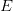
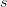
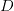
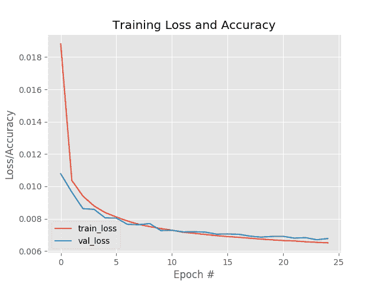
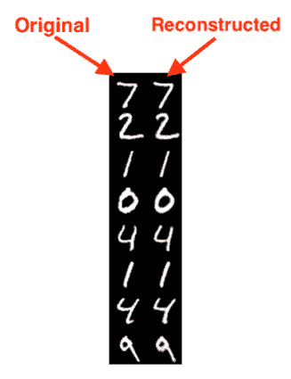

# 具有 Keras、TensorFlow 和深度学习的自动编码器

> 原文：<https://pyimagesearch.com/2020/02/17/autoencoders-with-keras-tensorflow-and-deep-learning/>

在本教程中，您将学习如何使用 Keras、TensorFlow 和深度学习来实现和训练自动编码器。

今天的教程开始了自动编码器应用的三部分系列:

1.  *具有 Keras、TensorFlow 和深度学习的自动编码器*(今天的教程)
2.  *用 Keras 和 TensorFlow 去噪自动编码器*(下周教程)
3.  *使用 Keras、TensorFlow 和深度学习进行异常检测*(两周后的教程)

几周前，我发表了一篇关于使用*标准*机器学习算法进行异常/异常检测的[介绍性指南。](https://pyimagesearch.com/2020/01/20/intro-to-anomaly-detection-with-opencv-computer-vision-and-scikit-learn/)

我的意图是*立即*跟进那个帖子，提供一个关于*基于深度学习的*异常检测的指南；然而，当我开始写教程的代码时，*我意识到我从来没有在 PyImageSearch 博客上讨论过自动编码器！*

试图在没有关于*什么是*自动编码器和*它们如何工作的*的先验背景的情况下讨论基于深度学习的异常检测，将很难理解、理解和消化。

因此，我们将在接下来的几周时间里研究自动编码器算法，包括它们的实际应用。

**要了解使用 Keras 和 TensorFlow 的自动编码器的基础知识，*请继续阅读！***

## 具有 Keras、TensorFlow 和深度学习的自动编码器

在本教程的第一部分，我们将讨论什么是**自动编码器**，包括**卷积自动编码器**如何应用于图像数据。我们还将讨论自动编码器和其他生成模型之间的*差异*，例如**生成对抗网络(GANs)。**

从那以后，我将向您展示如何使用 Keras 和 TensorFlow 实现和训练卷积自动编码器。

然后我们将回顾训练脚本的结果，包括可视化 autoencoder 如何重构输入数据。

最后，如果您有兴趣了解更多关于应用于图像数据集的深度学习的信息，我将向您推荐接下来的步骤。

### 什么是自动编码器？

自动编码器是一种类型的**无监督神经网络**(即，没有类别标签或标记数据)，它寻求:

1.  接受一组输入数据(即*输入*)。
2.  在内部*将输入数据压缩*到一个**潜在空间表示**(也就是说，*压缩*和*量化*输入的单个向量)。
3.  **从该潜在表示(即输出)中重建输入数据**。

通常，我们认为自动编码器有两个组件/子网:

1.  **编码器:**接受输入数据并将其压缩到潜在空间。如果我们把我们的输入数据表示为，把编码器表示为，那么输出的潜在空间表示，，就会是")。
2.  **解码器:**解码器负责接受潜在空间表示，然后重构原始输入。如果我们将解码器功能表示为，检测器的输出表示为，那么我们可以将解码器表示为")。

使用我们的数学符号，自动编码器的整个训练过程可以写成:

)")

**下面的图 1** 展示了自动编码器的基本架构:

在这里你可以看到:

1.  我们向自动编码器输入一个数字。
2.  编码器子网创建数字的潜在表示。这种潜在的表现形式*(就维度而言)远小于输入。*
3.  *解码器子网络然后从潜在表示中重建原始数字。*

 ***你可以把自动编码器想象成一个网络，*重构它的输入！***

为了训练自动编码器，我们输入数据，尝试重建数据，然后最小化均方误差(或类似的损失函数)。

**理想情况下，自动编码器的输出*与输入的*几乎相同。**

### 自动编码器重构它的输入，这有什么大不了的？

在这一点上，你们中的一些人可能会想:

> 艾德里安，这有什么大不了的？
> 
> 如果自动编码器的目标仅仅是重建输入，为什么一开始还要使用网络呢？
> 
> 如果我想要我的输入数据的一个副本，我可以用一个函数调用来复制它。
> 
> 我究竟为什么要应用深度学习，还要经历训练一个网络的麻烦？

这个问题，虽然是一个合理的问题，但确实包含了一个关于自动编码器的误解。

是的，在训练过程中，我们的目标是训练一个网络，它可以学习如何重建我们的输入数据— **但自动编码器的真正价值存在于潜在空间表示中。**

请记住，自动编码器*压缩*我们的输入数据，更重要的是，当我们训练自动编码器时，我们*真正关心的是编码器*

, and the latent-space representation, ")*.*

")解码器

, is used to train the autoencoder end-to-end, but in practical applications, we often (but not always) care more about the encoder and the latent-space.

在本教程的后面，我们将在 MNIST 数据集上训练一个自动编码器。MNIST 数据集由单通道的 *28×28* 像素的数字组成，这意味着每个数字由*28×28 = 784*个值表示。**我们将在这里训练的自动编码器将能够把这些数字压缩成一个只有 *16 个值*的向量——这减少了*近 98%！***

那么如果一个输入数据点被压缩成这么小的向量，我们能做什么呢？

这就是事情变得非常有趣的地方。

### 自动编码器有哪些应用？

自动编码器通常用于:

*   **降维**(即认为 PCA 但更强大/智能)。
*   **去噪**(例如。去除噪声并预处理图像以提高 OCR 准确度)。
*   **异常/异常值检测**(例如。检测数据集中标注错误的数据点，或者检测输入数据点何时超出我们的典型数据分布)。

在计算机视觉领域之外，您将看到自动编码器应用于自然语言处理(NLP)和文本理解问题，包括理解单词的语义，构建单词嵌入，甚至文本摘要。

### 自动编码器和 GANs 有什么不同？

如果你以前做过生成对抗网络(GANs)的工作，你可能想知道自动编码器和 GANs 有什么不同。

GANs 和自动编码器都是**生成模型**；然而，自动编码器本质上是通过*压缩来学习*身份函数*。*

自动编码器将接受我们的输入数据，将其压缩到潜在空间表示，然后尝试仅使用潜在空间向量来重建输入。

典型地，潜在空间表示将具有比原始输入数据少得多的维度*。*

 ***甘斯另一方面:**

1.  接受低维输入。
2.  从中构建一个高维空间。
3.  生成最终输出，该输出是原始训练数据的*而非*部分，但理想情况下*同样通过*。

此外，gan 具有自动编码器所没有的*进化损失景观。*

 *在训练 GAN 时，**生成模型**生成“假”图像，然后将这些图像与真实的“真实”图像混合在一起，然后**鉴别器模型**必须确定哪些图像是“真实”的，哪些是“假的/生成的”。

随着生成模型越来越好地生成可以骗过鉴别者的假图像，损失格局也在演变和变化(这也是为什么训练 GANs 如此之难的原因之一)。

虽然 GANs 和 autoencoders 都是生成模型，但它们的大多数相似之处也就到此为止了。

自动编码器无法生成新的、真实的数据点，而这些数据点可能被人类认为是“可以通过的”。相反，自动编码器主要用作将输入数据点压缩成潜在空间表示的方法。然后，该潜在空间表示可以用于压缩、去噪、异常检测等。

关于 GANs 和自动编码器之间的差异的更多细节，[我建议读一读 Quora 上的这个帖子](https://www.quora.com/What-is-the-difference-between-Generative-Adversarial-Networks-and-Autoencoders)。

### 配置您的开发环境

为了跟随今天关于自动编码器的教程，你应该使用 TensorFlow 2.0。我有两个 TF 2.0 的安装教程和相关的包，可以帮助您的开发系统跟上速度:

*   *[如何在 Ubuntu](https://pyimagesearch.com/2019/12/09/how-to-install-tensorflow-2-0-on-ubuntu/)T3 上安装 tensor flow 2.0【Ubuntu 18.04 OS；CPU 和可选的 NVIDIA GPU)*
*   *[如何在 macOS 上安装 tensor flow 2.0](https://pyimagesearch.com/2019/12/09/how-to-install-tensorflow-2-0-on-macos/)*(Catalina 和 Mojave OSes)

**请注意:** PyImageSearch 不支持 Windows — [参考我们的 FAQ](https://pyimagesearch.com/faqs/single-faq/can-you-help-me-do-___-on-windows) 。

### 项目结构

一定要抓取与博文相关的 ***【下载】*** 。从那里，提取。压缩并检查文件/文件夹布局:

```py
$ tree --dirsfirst
.
├── pyimagesearch
│   ├── __init__.py
│   └── convautoencoder.py
├── output.png
├── plot.png
└── train_conv_autoencoder.py

1 directory, 5 files
```

今天我们将回顾两个 Python 脚本:

*   `convautoencoder.py`:包含用`tf.keras`组装我们的神经网络所需的`ConvAutoencoder`类和`build`方法。
*   `train_conv_autoencoder.py`:在 MNIST 数据集上训练一个数字自动编码器。一旦 autoencoder 被训练好，我们将遍历大量的输出示例，并将它们写入磁盘供以后检查。

我们的训练脚本会生成`plot.png`图和`output.png`图。输出图像包含原始图像和重建图像的并排样本。

在下一节中，我们将使用 TensorFlow 内置的高级 Keras API 实现我们的自动编码器。

### 用 Keras 和 TensorFlow 实现卷积自动编码器

在训练自动编码器之前，我们首先需要实现自动编码器架构本身。

为此，我们将使用 Keras 和 TensorFlow。

我的实现大致遵循了 Francois Chollet 在官方 Keras 博客上自己的自动编码器实现。我在这里的主要贡献是更详细地介绍实现本身。

打开项目结构中的`convautoencoder.py`文件，并插入以下代码:

```py
# import the necessary packages
from tensorflow.keras.layers import BatchNormalization
from tensorflow.keras.layers import Conv2D
from tensorflow.keras.layers import Conv2DTranspose
from tensorflow.keras.layers import LeakyReLU
from tensorflow.keras.layers import Activation
from tensorflow.keras.layers import Flatten
from tensorflow.keras.layers import Dense
from tensorflow.keras.layers import Reshape
from tensorflow.keras.layers import Input
from tensorflow.keras.models import Model
from tensorflow.keras import backend as K
import numpy as np

class ConvAutoencoder:
	@staticmethod
	def build(width, height, depth, filters=(32, 64), latentDim=16):
		# initialize the input shape to be "channels last" along with
		# the channels dimension itself
		# channels dimension itself
		inputShape = (height, width, depth)
		chanDim = -1
```

我们从选择从`tf.keras`和 NumPy 的进口开始。如果您的系统上没有安装 TensorFlow 2.0，请参考上面的*“配置您的开发环境”*一节。

我们的`ConvAutoencoder`类包含一个静态方法`build`，它接受五个参数:

*   `width`:输入图像的宽度，单位为像素。
*   `height`:输入图像的高度，单位为像素。
*   `depth`:输入体积的通道数(即深度)。
*   `filters`:包含用于卷积运算的过滤器集合的元组。默认情况下，该参数包括`32`和`64`滤镜。
*   `latentDim`:我们的全连通(`Dense`)潜在向量中的神经元数量。默认情况下，如果该参数未被传递，则该值被设置为`16`。

从那里，我们初始化`inputShape`和通道维度(我们假设“通道最后”排序)。

我们现在准备初始化输入，并开始向网络添加图层:

```py
		# define the input to the encoder
		inputs = Input(shape=inputShape)
		x = inputs

		# loop over the number of filters
		for f in filters:
			# apply a CONV => RELU => BN operation
			x = Conv2D(f, (3, 3), strides=2, padding="same")(x)
			x = LeakyReLU(alpha=0.2)(x)
			x = BatchNormalization(axis=chanDim)(x)

		# flatten the network and then construct our latent vector
		volumeSize = K.int_shape(x)
		x = Flatten()(x)
		latent = Dense(latentDim)(x)

		# build the encoder model
		encoder = Model(inputs, latent, name="encoder")
```

**第 25 和 26 行**定义了编码器的输入。

准备好我们的输入，我们开始循环`filters`的数目，并添加我们的`CONV=>LeakyReLU=>BN`层集合(**第 29-33 行**)。

接下来，我们拉平网络并构建我们的潜在向量(**第 36-38 行**)——**这是我们实际的潜在空间表示(即“压缩”的数据表示)。**

然后我们建立我们的`encoder`模型(**线 41** )。

如果我们要对`encoder`做一个`print(encoder.summary())`，假设 *28×28* 单通道图像(`depth=1`)和`filters=(32, 64)`和`latentDim=16`，我们会得到如下结果:

```py
Model: "encoder"
_________________________________________________________________
Layer (type)                 Output Shape              Param #
=================================================================
input_1 (InputLayer)         [(None, 28, 28, 1)]       0
_________________________________________________________________
conv2d (Conv2D)              (None, 14, 14, 32)        320
_________________________________________________________________
leaky_re_lu (LeakyReLU)      (None, 14, 14, 32)        0
_________________________________________________________________
batch_normalization (BatchNo (None, 14, 14, 32)        128
_________________________________________________________________
conv2d_1 (Conv2D)            (None, 7, 7, 64)          18496
_________________________________________________________________
leaky_re_lu_1 (LeakyReLU)    (None, 7, 7, 64)          0
_________________________________________________________________
batch_normalization_1 (Batch (None, 7, 7, 64)          256
_________________________________________________________________
flatten (Flatten)            (None, 3136)              0
_________________________________________________________________
dense (Dense)                (None, 16)                50192
=================================================================
Total params: 69,392
Trainable params: 69,200
Non-trainable params: 192
_________________________________________________________________
```

在这里我们可以观察到:

*   我们的编码器首先接受一个 *28x28x1* 输入音量。
*   我们接着应用两轮`CONV=>RELU=>BN` ，每轮用 *3×3* 跨步卷积。步长卷积允许我们减少体积的空间维度。
*   在应用最后一批规范化后，我们最终得到一个 *7x7x64* 卷，它被展平成一个 *3136* -dim 向量。
*   我们的全连通层(即`Dense` 层)充当我们的 **潜在空间表征。**

接下来，让我们了解解码器模型如何获取这种潜在空间表示并重建原始输入图像:

```py
		# start building the decoder model which will accept the
		# output of the encoder as its inputs
		latentInputs = Input(shape=(latentDim,))
		x = Dense(np.prod(volumeSize[1:]))(latentInputs)
		x = Reshape((volumeSize[1], volumeSize[2], volumeSize[3]))(x)

		# loop over our number of filters again, but this time in
		# reverse order
		for f in filters[::-1]:
			# apply a CONV_TRANSPOSE => RELU => BN operation
			x = Conv2DTranspose(f, (3, 3), strides=2,
				padding="same")(x)
			x = LeakyReLU(alpha=0.2)(x)
			x = BatchNormalization(axis=chanDim)(x)
```

为了开始构建解码器模型，我们:

*   基于`latentDim`构建解码器模型的输入。(**第 45 行和第 46 行**)。
*   接受 1D `latentDim` 矢量，把它变成 2D 体，这样我们就可以开始应用卷积了( **第 47 行** )。
*   循环多个过滤器，这次以相反的顺序应用一个`CONV_TRANSPOSE => RELU => BN` 操作( **第 51-56 行** )。

转置卷积用于增加体积的*空间尺寸*(即宽度和高度)。

让我们完成自动编码器的创建:

```py
		# apply a single CONV_TRANSPOSE layer used to recover the
		# original depth of the image
		x = Conv2DTranspose(depth, (3, 3), padding="same")(x)
		outputs = Activation("sigmoid")(x)

		# build the decoder model
		decoder = Model(latentInputs, outputs, name="decoder")

		# our autoencoder is the encoder + decoder
		autoencoder = Model(inputs, decoder(encoder(inputs)),
			name="autoencoder")

		# return a 3-tuple of the encoder, decoder, and autoencoder
		return (encoder, decoder, autoencoder)
```

总结一下，我们:

*   在第 60 行的**处应用一个最终的`CONV_TRANSPOSE`图层，用于恢复图像的原始通道深度(单通道/灰度图像为 1 个通道，RGB 图像为 3 个通道)。**
*   应用一个 sigmoid 激活功能(**第 61 行** )。
*   建立`decoder` 模型，用 `encoder` 添加到 `autoencoder` ( **第 64-68 行** )。 **自动编码器变成了编码器+解码器。**
*   返回编码器、解码器和自动编码器的三元组。

如果我们要在这里完成一个`print(decoder.summary())`操作，我们会得到如下结果:

```py
Model: "decoder"
_________________________________________________________________
Layer (type)                 Output Shape              Param #
=================================================================
input_2 (InputLayer)         [(None, 16)]              0
_________________________________________________________________
dense_1 (Dense)              (None, 3136)              53312
_________________________________________________________________
reshape (Reshape)            (None, 7, 7, 64)          0
_________________________________________________________________
conv2d_transpose (Conv2DTran (None, 14, 14, 64)        36928
_________________________________________________________________
leaky_re_lu_2 (LeakyReLU)    (None, 14, 14, 64)        0
_________________________________________________________________
batch_normalization_2 (Batch (None, 14, 14, 64)        256
_________________________________________________________________
conv2d_transpose_1 (Conv2DTr (None, 28, 28, 32)        18464
_________________________________________________________________
leaky_re_lu_3 (LeakyReLU)    (None, 28, 28, 32)        0
_________________________________________________________________
batch_normalization_3 (Batch (None, 28, 28, 32)        128
_________________________________________________________________
conv2d_transpose_2 (Conv2DTr (None, 28, 28, 1)         289
_________________________________________________________________
activation (Activation)      (None, 28, 28, 1)         0
=================================================================
Total params: 109,377
Trainable params: 109,185
Non-trainable params: 192
_________________________________________________________________
```

`decoder`从`encoder`接受我们的 16 维潜在表示，然后建立一个*新的*3136 维全连通层，它是*7×7×64 = 3136 的乘积。*

使用我们新的 3136-dim FC 层，我们将其重塑为一个 7 x 7 x 64 的 3D 体积。从那里我们可以开始应用我们的`CONV_TRANSPOSE=>RELU=>BN`操作。与用于*减少*音量大小的标准步进卷积不同，我们的转置卷积用于*增加*音量大小。

最后，应用转置卷积层来恢复图像的原始通道深度。由于我们的图像是灰度的，我们学习一个*单滤波器*，其输出是一个*28×28×1*的体积(即原始 MNIST 数字图像的尺寸)。

`print(autoencoder.summary())`操作显示了编码器和解码器的组合特性:

```py
Model: "autoencoder"
_________________________________________________________________
Layer (type)                 Output Shape              Param #
=================================================================
input_1 (InputLayer)         [(None, 28, 28, 1)]       0
_________________________________________________________________
encoder (Model)              (None, 16)                69392
_________________________________________________________________
decoder (Model)              (None, 28, 28, 1)         109377
=================================================================
Total params: 178,769
Trainable params: 178,385
Non-trainable params: 384
_________________________________________________________________
```

我们`encoder`的输入是来自 MNIST 数据集的**原始** *28 x 28 x 1* 图像。我们的`encoder`然后学习数据的 16 维潜在空间表示，之后`decoder` **重建**原始 *28 x 28 x 1* 图像。

在下一节中，我们将开发脚本来训练我们的自动编码器。

### 创建卷积自动编码器训练脚本

实现了我们的 autoencoder 架构后，让我们继续学习训练脚本。

打开项目目录结构中的`train_conv_autoencoder.py`，插入以下代码:

```py
# set the matplotlib backend so figures can be saved in the background
import matplotlib
matplotlib.use("Agg")

# import the necessary packages
from pyimagesearch.convautoencoder import ConvAutoencoder
from tensorflow.keras.optimizers import Adam
from tensorflow.keras.datasets import mnist
import matplotlib.pyplot as plt
import numpy as np
import argparse
import cv2

# construct the argument parse and parse the arguments
ap = argparse.ArgumentParser()
ap.add_argument("-s", "--samples", type=int, default=8,
	help="# number of samples to visualize when decoding")
ap.add_argument("-o", "--output", type=str, default="output.png",
	help="path to output visualization file")
ap.add_argument("-p", "--plot", type=str, default="plot.png",
	help="path to output plot file")
args = vars(ap.parse_args())
```

在**2-12 号线，**我们处理我们的进口。我们将使用`matplotlib`的`"Agg"`后端，这样我们可以将我们的训练图导出到磁盘。

我们需要我们的定制`ConvAutoencoder`架构类，它是我们在上一节中实现的。

我们将在 MNIST 基准数据集上训练时使用`Adam`优化器。为了可视化，我们将使用 OpenCV。

接下来，我们将解析三个[命令行参数](https://pyimagesearch.com/2018/03/12/python-argparse-command-line-arguments/)，它们都是可选的:

*   `--samples`:可视化输出样本数。默认情况下，该值设置为`8`。
*   `--output`:输出可视化图像的路径。默认情况下，我们将我们的可视化命名为 output.png
*   `--plot`:matplotlib 输出图的路径。如果终端中未提供此参数，则默认为 plot.png。

现在，我们将设置几个超参数并预处理我们的 MNIST 数据集:

```py
# initialize the number of epochs to train for and batch size
EPOCHS = 25
BS = 32

# load the MNIST dataset
print("[INFO] loading MNIST dataset...")
((trainX, _), (testX, _)) = mnist.load_data()

# add a channel dimension to every image in the dataset, then scale
# the pixel intensities to the range [0, 1]
trainX = np.expand_dims(trainX, axis=-1)
testX = np.expand_dims(testX, axis=-1)
trainX = trainX.astype("float32") / 255.0
testX = testX.astype("float32") / 255.0
```

**第 25 行和第 26 行**初始化批量大小和训练时期的数量。

从那里，我们将使用我们的 MNIST 数据集。TensorFlow/Keras 有一个方便的`load_data`方法，我们可以调用`mnist`来获取数据(**第 30 行**)。从那里，**第 34-37 行** (1)为数据集中的每个图像添加一个通道维度，以及(2)将像素强度缩放到范围*【0，1】*。

我们现在准备好**构建和训练我们的自动编码器:**

```py
# construct our convolutional autoencoder
print("[INFO] building autoencoder...")
(encoder, decoder, autoencoder) = ConvAutoencoder.build(28, 28, 1)
opt = Adam(lr=1e-3)
autoencoder.compile(loss="mse", optimizer=opt)

# train the convolutional autoencoder
H = autoencoder.fit(
	trainX, trainX,
	validation_data=(testX, testX),
	epochs=EPOCHS,
	batch_size=BS)
```

为了构建卷积自动编码器，我们在我们的`ConvAutoencoder`类上调用`build`方法，并传递必要的参数(**第 41 行**)。回想一下，这产生了`(encoder, decoder, autoencoder)`元组——在这个脚本中，我们只需要`autoencoder`进行训练和预测。

我们用初始学习率`1e-3`初始化我们的`Adam`优化器，然后用均方误差损失对其进行编译(**第 42 行和第 43 行**)。

从那里，我们在 MNIST 数据(**线 46-50** )上`fit`(训练)我们的`autoencoder`。

让我们继续绘制我们的培训历史:

```py
# construct a plot that plots and saves the training history
N = np.arange(0, EPOCHS)
plt.style.use("ggplot")
plt.figure()
plt.plot(N, H.history["loss"], label="train_loss")
plt.plot(N, H.history["val_loss"], label="val_loss")
plt.title("Training Loss and Accuracy")
plt.xlabel("Epoch #")
plt.ylabel("Loss/Accuracy")
plt.legend(loc="lower left")
plt.savefig(args["plot"])
```

从那里，我们将对我们的测试集进行预测:

```py
# use the convolutional autoencoder to make predictions on the
# testing images, then initialize our list of output images
print("[INFO] making predictions...")
decoded = autoencoder.predict(testX)
outputs = None

# loop over our number of output samples
for i in range(0, args["samples"]):
	# grab the original image and reconstructed image
	original = (testX[i] * 255).astype("uint8")
	recon = (decoded[i] * 255).astype("uint8")

	# stack the original and reconstructed image side-by-side
	output = np.hstack([original, recon])

	# if the outputs array is empty, initialize it as the current
	# side-by-side image display
	if outputs is None:
		outputs = output

	# otherwise, vertically stack the outputs
	else:
		outputs = np.vstack([outputs, output])

# save the outputs image to disk
cv2.imwrite(args["output"], outputs)
```

**第 67 行**对测试集进行预测。然后我们循环遍历作为命令行参数传递的`--samples`的编号(**第 71 行**)，这样我们就可以构建我们的可视化。在循环内部，我们:

*   抓取*原始图像和重建图像*(**第 73 行和第 74 行**)。
*   并排堆叠一对图像*(**第 77 行** )。*
**   将*对垂直堆叠* ( **第 81-86 行** )。*   最后，我们将可视化图像输出到磁盘( **Line 89** )。*

 *在下一部分，我们将看到我们努力工作的成果。

### 用 Keras 和 TensorFlow 训练卷积自动编码器

我们现在可以看到我们的自动编码器在工作了！

确保你使用了这篇文章的 ***“下载”*** 部分来下载源代码——从那里你可以执行下面的命令:

```py
$ python train_conv_autoencoder.py
[INFO] loading MNIST dataset...
[INFO] building autoencoder...
Train on 60000 samples, validate on 10000 samples
Epoch 1/25
60000/60000 [==============================] - 68s 1ms/sample - loss: 0.0188 - val_loss: 0.0108
Epoch 2/25
60000/60000 [==============================] - 68s 1ms/sample - loss: 0.0104 - val_loss: 0.0096
Epoch 3/25
60000/60000 [==============================] - 68s 1ms/sample - loss: 0.0094 - val_loss: 0.0086
Epoch 4/25
60000/60000 [==============================] - 68s 1ms/sample - loss: 0.0088 - val_loss: 0.0086
Epoch 5/25
60000/60000 [==============================] - 68s 1ms/sample - loss: 0.0084 - val_loss: 0.0080
...
Epoch 20/25
60000/60000 [==============================] - 83s 1ms/sample - loss: 0.0067 - val_loss: 0.0069
Epoch 21/25
60000/60000 [==============================] - 83s 1ms/sample - loss: 0.0066 - val_loss: 0.0069
Epoch 22/25
60000/60000 [==============================] - 83s 1ms/sample - loss: 0.0066 - val_loss: 0.0068
Epoch 23/25
60000/60000 [==============================] - 83s 1ms/sample - loss: 0.0066 - val_loss: 0.0068
Epoch 24/25
60000/60000 [==============================] - 83s 1ms/sample - loss: 0.0065 - val_loss: 0.0067
Epoch 25/25
60000/60000 [==============================] - 83s 1ms/sample - loss: 0.0065 - val_loss: 0.0068
[INFO] making predictions...
```

[](https://pyimagesearch.com/wp-content/uploads/2020/02/plot.png)

**Figure 4:** Our deep learning autoencoder training history plot was generated with matplotlib. Our autoencoder was trained with Keras, TensorFlow, and Deep Learning.

如**图 4** 和终端输出所示，我们的训练过程能够最小化自动编码器的重建损失。

但是自动编码器在重建训练数据方面做得如何呢？

答案是 ***很好:***

[](https://pyimagesearch.com/wp-content/uploads/2020/02/keras_autoencoder_output.png)

**Figure 5:** A sample of of Keras/TensorFlow deep learning autoencoder inputs *(left)* and outputs *(right)*.

在**图 5** 中，*左边的*是我们的原始图像，而*右边的*是自动编码器预测的重建数字。**如你所见，这些数字*几乎无法区分*！**

此时，你可能会想:

> 太好了…所以我可以训练一个网络来重建我的原始图像。
> 
> 但是你说过*真正重要的*是内部潜在空间的表示。
> 
> 我如何访问该表示，以及如何使用它进行去噪和异常/异常值检测？

这些都是很好的问题— **我将在 PyImageSearch 的下两个教程中回答这两个问题，敬请关注！**

## 摘要

在本教程中，您学习了自动编码器的基础知识。

自动编码器是生成型模型，由一个*编码器*和一个*解码器*模型组成。训练时，编码器获取输入数据点，并学习数据的潜在空间表示。这种潜在空间表示是数据的*压缩*表示，允许模型用比原始数据少得多的*参数来表示它。*

然后，解码器模型采用潜在空间表示，并试图从中重建原始数据点。当端到端训练时，编码器和解码器以组合的方式工作。

在实践中，我们使用自动编码器进行降维、压缩、去噪和异常检测。

理解了基本原理之后，我们使用 Keras 和 TensorFlow 实现了一个卷积自动编码器。

在下周的教程中，我们将学习如何使用卷积自动编码器去噪。

**要下载这篇文章的源代码(并在未来教程在 PyImageSearch 上发布时得到通知)，*只需在下面的表格中输入您的电子邮件地址！*******