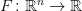
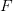
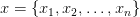
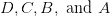
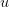
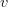
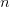
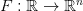

# 自动微分第 1 部分:理解数学

> 原文：<https://pyimagesearch.com/2022/12/05/automatic-differentiation-part-1-understanding-the-math/>

* * *

## **目录**

* * *

## [**自动微分第一部分:理解数学**](#TOC)

在本教程中，你将学习**反向传播**所需的自动微分背后的数学。

本课是关于**Autodiff 101-从头开始了解自动区分的两部分系列的第一部分**:

1.  [***自动微分第一部分:理解数学***](https://pyimg.co/pyxml) **(今日教程)**
2.  *自动微分第 2 部分:使用微克实现*

**要了解自动微分，** ***只需继续阅读。***

* * *

## [**自动微分第一部分:理解数学**](#TOC)

想象你正徒步下山。天很黑，有很多颠簸和转弯。你无法知道如何到达中心。现在想象一下，你每前进一次，都要暂停一下，拿出山丘的拓扑图，计算下一组你的方向和速度。听起来很无趣，对吧？

如果你读过我们的教程，你会知道这个类比指的是什么。小山是你的损失景观，拓扑图是多元微积分的规则集，你是神经网络的参数。目标是达到全局最小值。

这就引出了一个问题:

> *为什么我们今天使用深度学习框架？*

脑海里首先闪现的是**自动微分**。我们写向前传球，就是这样；不用担心后传。每个操作符都是自动微分的，并等待在优化算法中使用(如随机梯度下降)。

今天在本教程中，我们将走过自动微分的山谷。

* * *

### [**简介**](#TOC)

在本节中，我们将为理解`autodiff`奠定必要的基础。

* * *

#### [**雅可比**](#TOC)

让我们考虑一个函数

. is a multivariate function that simultaneously depends on multiple variables. Here the multiple variables can be . The output of the function is a **scalar value**. This can be considered as a neural network that takes an image and outputs the probability of a dog’s presence in the image.

***注意*** **:** 让我们回忆一下，在神经网络中，我们计算的是关于参数(权重和偏差)而不是输入(图像)的梯度。因此，函数的域是参数而不是输入，这有助于保持梯度计算的可访问性。我们现在需要从使**简单**和**有效**的角度考虑我们在本教程中所做的一切，以获得关于权重和偏差(*参数*)的梯度。图 1 中的**对此进行了说明。**

神经网络由许多子层组成。所以让我们考虑一下我们的函数")

as a composition of multiple functions (primitive operations).

 \ = \ D \circ C \circ B \circ A")

该功能")

is composed of four primitive functions, namely . For anyone new to composition, we can call ")to be a function where )))")is equal to ").

下一步是找到")的梯度

. However, before diving into the gradients of the function, let us revisit Jacobian matrices. It turns out that the derivatives of a multivariate function are a Jacobian matrix consisting of partial derivatives of the function w.r.t. all the variables upon which it depends.

考虑两个多元函数，

and , which depend on the variables and . The Jacobian would look like this:

}}{\partial{x, y}} \ = \ \begin{bmatrix} \displaystyle\frac{\partial u}{\partial x} & \displaystyle\frac{\partial u}{\partial y}\\  \\ \displaystyle\frac{\partial v}{\partial x} & \displaystyle\frac{\partial v}{\partial y} \end{bmatrix}")

现在让我们计算函数")的雅可比矩阵

. We need to note here that the function depends of variables , and outputs a scalar value. This means that the Jacobian will be a row vector.

 \ = \ \displaystyle\frac{\partial{y}}{\partial{x}} \ = \ \begin{bmatrix} \displaystyle\frac{\partial y}{\partial x_{1}} & \ldots  & \displaystyle\frac{\partial y}{\partial x_{n}} \end{bmatrix}")

* * *

#### [**链式法则**](#TOC)

还记得我们的函数")

is composed of many primitive functions? The derivative of such a composed function is done with the help of the chain rule. To help our way into the chain rule, let us first write down the composition and then define the intermediate values.

 = D(C(B(A(x))))")

is composed of:

*   ")
*   ")
*   ")
*   ")

现在作文已经拼出来了，我们先来求中间值的导数。

*    = \displaystyle\frac{\partial{y}}{\partial{c}}")
*    = \displaystyle\frac{\partial{c}}{\partial{b}}")
*    = \displaystyle\frac{\partial{b}}{\partial{a}}")
*    = \displaystyle\frac{\partial{a}}{\partial{x}}")

现在借助链式法则，我们推导出函数")的导数

.

 \ = \ \displaystyle\frac{\partial{y}}{\partial{c}} \displaystyle\frac{\partial{c}}{\partial{b}} \displaystyle\frac{\partial{b}}{\partial{a}} \displaystyle\frac{\partial{a}}{\partial{x}}")

* * *

#### [**混合了雅可比和链式法则**](#TOC)

在了解了雅可比矩阵和链式法则之后，让我们一起将两者形象化。如**图二**所示。

 \ = \ \displaystyle\frac{\partial{y}}{\partial{x}} \ = \ \begin{bmatrix} \displaystyle\frac{\partial y}{\partial x_{1}} & \ldots  & \displaystyle\frac{\partial y}{\partial x_{n}} \end{bmatrix}")

 \ = \ \displaystyle\frac{\partial{y}}{\partial{c}} \displaystyle\frac{\partial{c}}{\partial{b}} \displaystyle\frac{\partial{b}}{\partial{a}} \displaystyle\frac{\partial{a}}{\partial{x}}")

我们函数的导数")

is just the matrix multiplication of the Jacobian matrices of the intermediate terms.

现在，这就是我们要问的问题:

> 我们做矩阵乘法的顺序有关系吗？

* * *

#### [**正向和反向累加**](#TOC)

在本节中，我们试图理解雅可比矩阵乘法排序问题的答案。

在两种极端情况下，我们可以对乘法进行排序:正向累加和反向累加。

* * *

#### [**正向累加**](#TOC)

如果我们按照与函数")相同的顺序从右到左排列乘法

was evaluated, the process is called forward accumulation. The best way to think about the ordering is to place brackets in the equation, as shown in **Figure 3**.

 \ = \ \displaystyle\frac{\partial{y}}{\partial{c}} \left(\frac{\partial{c}}{\partial{b}} \left(\frac{\partial{b}}{\partial{a}} \displaystyle\frac{\partial{a}}{\partial{x}}\right)\right)")

使用功能

, the forward accumulation process is matrix multiplication in all the steps. This is more [FLOPs](https://stackoverflow.com/a/60275432/19623137).

***注意:*** 向前累加在我们想要得到一个函数的导数的时候是很有好处的

.

理解转发累加的另一种方式是考虑雅可比矢量积(JVP)。考虑一个雅各比派")

and a vector . The Jacobian-Vector Product would look to be v")

v \ = \ \displaystyle\frac{\partial{y}}{\partial{c}} \left(\displaystyle\frac{\partial{c}}{\partial{b}} \left(\displaystyle\frac{\partial{b}}{\partial{a}} \left(\displaystyle\frac{\partial{a}}{\partial{x}} v\right)\right)\right)")

这样做是为了让我们在所有阶段都有矩阵向量乘法(这使得过程更有效)。

➤ **问题:**如果我们有一个雅可比矢量积，我们如何从中获得雅可比？

➤ **回答:**我们传递一个热点向量，一次得到雅可比矩阵的每一列。

因此，我们可以将前向累加视为一个过程，在此过程中，我们构建每列的雅可比矩阵。

* * *

#### [**反向积累**](#TOC)

假设我们从左到右对乘法进行排序，方向与函数求值的方向相反。在这种情况下，这个过程叫做反向积累。该过程的示意图如**图 4** 所示。

 \ = \ \left(\left(\displaystyle\frac{\partial{y}}{\partial{c}} \displaystyle\frac{\partial{c}}{\partial{b}}\right) \displaystyle\frac{\partial{b}}{\partial{a}} \right)\displaystyle\frac{\partial{a}}{\partial{x}}")

事实证明，用反向累加来推导一个函数的导数

is a vector to matrix multiplication at all steps. This means that for the particular function, reverse accumulation has lesser FLOPs than forwarding accumulation.

理解前向累加的另一种方法是考虑一个矢量雅可比乘积(VJP)。考虑一个雅各比派")

and a vector . The Vector-Jacobian Product would look to be ")

 \ = \ \left(\left(\left(v^{T} \displaystyle\frac{\partial{y}}{\partial{c}}\right) \displaystyle\frac{\partial{c}}{\partial{b}}\right) \displaystyle\frac{\partial{b}}{\partial{a}}\right)\displaystyle\frac{\partial{a}}{\partial{x}}")

这允许我们在所有阶段进行向量矩阵乘法(这使得过程更有效)。

➤ **问题:**如果我们有一个向量雅可比乘积，我们如何从中获得雅可比？

➤ **回答:**我们传递一个独热向量，一次得到雅可比矩阵的每一行。

所以我们可以把逆向累加看作是一个建立每行雅可比矩阵的过程。

现在，如果我们考虑我们之前提到的函数")

, we know that the Jacobian ")is a row vector. Therefore, if we apply the reverse accumulation process, which means the Vector-Jacobian Product, we can obtain the row vector in one shot. On the other hand, if we apply the forward accumulation process, the Jacobian-Vector Product, we will obtain a single element as a column, and we would need to iterate to build the entire row.

这就是为什么反向累加在神经网络文献中更常用的原因。

* * *

* * *

## [**汇总**](#TOC)

在本教程中，我们学习了自动微分的数学，以及如何将其应用于神经网络的参数。下一篇教程将对此进行扩展，看看我们如何使用 python 包实现自动微分。该实现将涉及创建 python 包并使用它来训练神经网络的逐步演练。

你喜欢关于自动微分基础的数学教程吗？让我们知道。

**推特:** [@PyImageSearch](https://twitter.com/pyimagesearch)

* * *

### [**参考文献**](#TOC)

*   [自动微分—VideoLectures.NET](http://videolectures.net/deeplearning2017_johnson_automatic_differentiation/)

* * *

### [**引用信息**](#TOC)

A. R. Gosthipaty 和 R. Raha。“自动微分第一部分:理解数学”， *PyImageSearch* ，P. Chugh、S. Huot、K. Kidriavsteva 和 A. Thanki 编辑。，2022 年，【https://pyimg.co/pyxml 

```py
@incollection{ARG-RR_2022_autodiff1,
  author = {Aritra Roy Gosthipaty and Ritwik Raha},
  title = {Automatic Differentiation Part 1: Understanding the Math},
  booktitle = {PyImageSearch},
  editor = {Puneet Chugh and Susan Huot and Kseniia Kidriavsteva and Abhishek Thanki},
  year = {2022},
  note = {https://pyimg.co/pyxml},
}
```

* * *

* * *