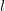
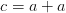
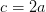

# 自动微分第 2 部分:使用微图形实现

> 原文：<https://pyimagesearch.com/2022/12/26/automatic-differentiation-part-2-implementation-using-micrograd/>

* * *

## **目录**

* * *

## [**自动微分第二部分:使用微克实现**](#TOC)

在本教程中，您将学习如何在名为`micrograd`的 Python 包的帮助下进行自动微分。

本课是关于 **Autodiff 101 的两部分系列的最后一课——从头开始理解自动区分**:

1.  [*自动微分第一部分:理解数学*](https://pyimg.co/pyxml)
2.  [***自动微分第二部分:使用微克实现***](https://pyimg.co/ra6ow) **(今日教程)**

**要学习如何使用 Python 实现自动微分，*继续阅读即可。***

* * *

## [**自动微分第二部分:使用微克实现**](#TOC)

* * *

### [**简介**](#TOC)

* * *

#### [**什么是神经网络？**](#TOC)

神经网络是我们大脑的数学抽象(至少，它是这样开始的)。该系统由许多可学习的旋钮(权重和偏差)和一个简单的操作(点积)组成。神经网络接受输入，并使用一个目标函数，我们需要通过旋转旋钮来优化该函数。调谐旋钮的最佳方式是使用目标函数相对于所有单个旋钮的梯度作为信号。

如果你坐下来试着用手算一下梯度，会花很长时间。所以，为了绕过这个过程，我们使用自动微分的概念。

在[之前的教程](https://pyimg.co/pyxml)中，我们深入学习了自动微分的数学。本教程将应用概念，从头开始理解自动微分 Python 包。

我们今天要讲的这个包叫做 [`micrograd`](https://github.com/karpathy/micrograd) 。这是一个由安德烈·卡帕西创建的开源 Python 包。我们已经学习了[视频讲座](https://youtu.be/VMj-3S1tku0)，Andrej 从零开始构建这个包。在这里，我们将视频讲座分解到一个博客中，并添加我们的想法来丰富内容。

* * *

### [**在配置开发环境时遇到了问题？**](#TOC)

说了这么多，你是:

*   时间紧迫？
*   了解你雇主的行政锁定系统？
*   想要跳过与命令行、包管理器和虚拟环境斗争的麻烦吗？
*   **准备好在您的 Windows、macOS 或 Linux 系统上运行代码*****？***

 *那今天就加入 [PyImageSearch 大学](https://pyimagesearch.com/pyimagesearch-university/)吧！

**获得本教程的 Jupyter 笔记本和其他 PyImageSearch 指南，这些指南是** ***预先配置的*** **，可以在您的网络浏览器中运行在 Google Colab 的生态系统上！**无需安装。

最棒的是，这些 Jupyter 笔记本可以在 Windows、macOS 和 Linux 上运行！

* * *

### [**关于`micrograd`**](#TOC)

`micrograd`是一个 Python 包，旨在理解反向累积(反向传播)过程如何在 PyTorch 或 Jax 等现代深度学习包中工作。这是一个简单的自动微分包，仅适用于**标量**。

* * *

### [**导入和设置**](#TOC)

```py
import math
import random
from typing import List, Tuple, Union
from matplotlib import pyplot as plt
```

* * *

### [**`Value`班**](#TOC)

我们从定义`Value`类开始。为了以后进行跟踪和反向传播，将原始标量值包装到`Value`类中变得非常重要。

当包装在`Value`类中时，标量值被认为是图形的**节点**。当我们使用`Value` s 并建立一个等式时，这个等式被认为是一个[有向无环图](https://en.wikipedia.org/wiki/Directed_acyclic_graph) (DAG)。在*演算*和*图遍历*的帮助下，我们自动计算节点的梯度(autodiff)并通过它们反向传播。

`Value`类具有以下属性:

*   `data`:需要包装在`Value`类中的原始浮点数据。
*   `grad`:这个会保存节点的**全局导数**。全局导数是根节点(最终节点)相对于当前节点的偏导数。
*   这是一个私有方法，计算当前节点的子节点的全局导数。
*   `_prev`:当前节点的子节点。

```py
class Value(object):
    """
    We need to wrap the raw data into a class that will store the
    metadata to help in automatic differentiation.

    Attributes:
        data (float): The data for the Value node.
        _children (Tuple): The children of the current node.
    """

    def __init__(self, data: float, _children: Tuple = ()):
        # The raw data for the Value node.
        self.data = data

        # The partial gradient of the last node with respect to this
        # node. This is also termed as the global gradient.
        # Gradient 0.0 means that there is no effect of the change
        # of the last node with respect to this node. On
        # initialization it is assumed that all the variables have no
        # effect on the entire architecture.
        self.grad = 0.0

        # The function that derives the gradient of the children nodes
        # of the current node. It is easier this way, because each node
        # is built from children nodes and an operation. Upon back-propagation
        # the current node can easily fill in the gradients of the children.
        # Note: The global gradient is the multiplication of the local gradient
        # and the flowing gradient from the parent.
        self._backward = lambda: None

        # Define the children of this node.
        self._prev = set(_children)

    def __repr__(self):
        # This is the string representation of the Value node.
        return f"Value(data={self.data}, grad={self.grad})"
```

```py
# Build a Value node
raw_data = 5.0
print(f"Raw Data(data={raw_data}, type={type(raw_data)}")
value_node = Value(data=raw_data)

# Calling the `__repr__` function here
print(value_node)
```

```py
>>> Raw Data(data=5.0, type=<class 'float'>
>>> Value(data=5.0, grad=0.0)
```

* * *

### [**加法**](#TOC)

现在我们已经构建了我们的`Value`类，我们需要定义原始操作和它们的`_backward`函数。这将有助于跟踪每个节点的操作，并通过 DAG 表达式反向传播梯度。

在本节中，我们处理**加法**操作。这将有助于两个值相加。当我们使用`+`操作符时，Python 类有一个特殊的方法`__add__`被调用，如图**图 1** 所示。

这里我们创建了`custom_addition`函数，这个函数后来被分配给了`Value`类的`__add__`方法。这样做是为了让我们把重点放在加法方法上，舍弃一切对加法运算不重要的东西。

加法运算非常简单:

1.  将`self`和`other`节点作为调用的参数。然后我们取他们的`data`并应用加法。
2.  然后，结果被包装在`Value`类中。
3.  节点`out`被初始化，这里我们提到`self`和`other`是它的孩子。

* * *

#### [**计算梯度**](#TOC)

对于我们定义的每个原始操作，我们都会有这个部分。例如，为了计算子节点的全局梯度，我们需要定义`addition`操作的局部梯度。

让我们考虑一个节点

that is built by adding two children nodes and . Then, the partial derivatives of are derived in **Figure 2**.

现在想想反向传播。损失(目标)函数的偏导数

is already deduced for . This means we have }/{(\partial{c})}"). This gradient needs to flow to the child nodes and , respectively.

应用链式法则，我们得到的全局梯度

and , as shown in **Figure 3**.

加法运算就像一个**路由器**作用于流入的渐变。它将渐变路由到所有的子节点。

➤ ***注:*** 在我们定义的`_backward`函数中，我们用`+=`运算累加子代的渐变。这样做是为了绕过一个独特的情况。假设我们有

. Here we know that the expression can be simplified to , but our `_backward` for `__add__` does not know how to do this. The `__backward__` in `__add__` treats one as `self` and the other as `other`. If the gradients are not accumulated, we will see a discrepancy with the gradients.

```py
def custom_addition(self, other: Union["Value", float]) -> "Value":
    """
    The addition operation for the Value class.
    Args:
        other (Union["Value", float]): The other value to add to this one.
    Usage:
        >>> x = Value(2)
        >>> y = Value(3)
        >>> z = x + y
        >>> z.data
        5
    """
    # If the other value is not a Value, then we need to wrap it.
    other = other if isinstance(other, Value) else Value(other)

    # Create a new Value node that will be the output of the addition.
    out = Value(data=self.data + other.data, _children=(self, other))

    def _backward():
        # Local gradient:
        # x = a + b
        # dx/da = 1
        # dx/db = 1
        # Global gradient with chain rule:
        # dy/da = dy/dx . dx/da = dy/dx . 1
        # dy/db = dy/dx . dx/db = dy/dx . 1
        self.grad += out.grad * 1.0
        other.grad += out.grad * 1.0

    # Set the backward function on the output node.
    out._backward = _backward
    return out

def custom_reverse_addition(self, other):
    """
    Reverse addition operation for the Value class.
    Args:
        other (float): The other value to add to this one.
    Usage:
        >>> x = Value(2)
        >>> y = Value(3)
        >>> z = y + x
        >>> z.data
        5
    """
    # This is the same as adding. We can reuse the __add__ method.
    return self + other

Value.__add__ = custom_addition
Value.__radd__ = custom_reverse_addition
```

```py
# Build a and b
a = Value(data=5.0)
b = Value(data=6.0)

# Print the addition
print(f"{a} + {b} => {a+b}")
```

```py
>>> Value(data=5.0, grad=0.0) + Value(data=6.0, grad=0.0) => Value(data=11.0, grad=0.0)
```

```py
# Add a and b
c = a + b

# Assign a global gradient to c
c.grad = 11.0
print(f"c => {c}")

# Now apply `_backward` to c
c._backward()
print(f"a => {a}")
print(f"b => {b}")
```

```py
>>> c => Value(data=11.0, grad=11.0)
>>> a => Value(data=5.0, grad=11.0)
>>> b => Value(data=6.0, grad=11.0)
```

➤ ***注:***的全局渐变

is routed to and .

* * *

### [**乘法**](#TOC)

在这一节中，我们处理**乘法**运算。当我们使用`*`操作符时，Python 类有一个特殊的方法`__mul__`被调用，如图**图 4** 所示。

我们将`self`和`other`节点作为调用的参数。然后我们取他们的`data`并应用乘法。然后结果被包装在`Value`类中。最后，`out`节点被初始化，这里我们提到`self`和`other`是它的子节点。

* * *

#### [**计算梯度**](#TOC)

让我们考虑一个节点

that is built by multiplying two children nodes and . Then, the partial derivatives of are shown in **Figure 5**.

现在想想反向传播。损失(目标)函数的偏导数

is already deduced for . This means we have }/{(\partial{c})}"). This gradient needs to flow to the children nodes and , respectively.

应用链式法则，我们得到的全局梯度

and , as shown in **Figure 6**.

```py
def custom_multiplication(self, other: Union["Value", float]) -> "Value":
    """
    The multiplication operation for the Value class.
    Args:
        other (float): The other value to multiply to this one.
    Usage:
        >>> x = Value(2)
        >>> y = Value(3)
        >>> z = x * y
        >>> z.data
        6
    """
    # If the other value is not a Value, then we need to wrap it.
    other = other if isinstance(other, Value) else Value(other)

    # Create a new Value node that will be the output of
    # the multiplication.
    out = Value(data=self.data * other.data, _children=(self, other))

    def _backward():
        # Local gradient:
        # x = a * b
        # dx/da = b
        # dx/db = a
        # Global gradient with chain rule:
        # dy/da = dy/dx . dx/da = dy/dx . b
        # dy/db = dy/dx . dx/db = dy/dx . a
        self.grad += out.grad * other.data
        other.grad += out.grad * self.data

    # Set the backward function on the output node.
    out._backward = _backward
    return out

def custom_reverse_multiplication(self, other):
    """
    Reverse multiplication operation for the Value class.
    Args:
        other (float): The other value to multiply to this one.
    Usage:
        >>> x = Value(2)
        >>> y = Value(3)
        >>> z = y * x
        >>> z.data
        6
    """
    # This is the same as multiplying. We can reuse the __mul__ method.
    return self * other

Value.__mul__ = custom_multiplication
Value.__rmul__ = custom_reverse_multiplication
```

```py
# Build a and b
a = Value(data=5.0)
b = Value(data=6.0)

# Print the multiplication
print(f"{a} * {b} => {a*b}")
```

```py
>>> Value(data=5.0, grad=0.0) * Value(data=6.0, grad=0.0) => Value(data=30.0, grad=0.0)
```

```py
# Multiply a and b
c = a * b

# Assign a global gradient to c
c.grad = 11.0
print(f"c => {c}")

# Now apply `_backward` to c
c._backward()
print(f"a => {a}")
print(f"b => {b}")
```

```py
>>> c => Value(data=30.0, grad=11.0)
>>> a => Value(data=5.0, grad=66.0)
>>> b => Value(data=6.0, grad=55.0)
```

* * *

### [**力量**](#TOC)

在本节中，我们处理**电源**的操作。Python 类有一个特殊的方法`__pow__`，当我们使用`**`操作符时会调用这个方法，如图**图 7** 所示。

在获得作为调用参数的`self`和`other`节点后，我们获取它们的`data`并应用幂运算。

* * *

#### [**计算梯度**](#TOC)

让我们考虑一个节点

that is built by multiplying two children nodes and . Then, the partial derivatives of are derived in **Figure 8**.

现在想想反向传播。损失(目标)函数的偏导数

is already deduced for . This means we have }/{(\partial{c})}"). This gradient needs to flow to the child node .

应用链式法则，我们得到的全局梯度

and , as shown in **Figure 9**.

```py
def custom_power(self, other):
    """
    The power operation for the Value class.
    Args:
        other (float): The other value to raise this one to.
    Usage:
        >>> x = Value(2)
        >>> z = x ** 2.0
        >>> z.data
        4
    """
    assert isinstance(
        other, (int, float)
    ), "only supporting int/float powers for now"

    # Create a new Value node that will be the output of the power.
    out = Value(data=self.data ** other, _children=(self,))

    def _backward():
        # Local gradient:
        # x = a ** b
        # dx/da = b * a ** (b - 1)
        # Global gradient:
        # dy/da = dy/dx . dx/da = dy/dx . b * a ** (b - 1)
        self.grad += out.grad * (other * self.data ** (other - 1))

    # Set the backward function on the output node.
    out._backward = _backward
    return out

Value.__pow__ = custom_power
```

```py
# Build a
a = Value(data=5.0)
# For power operation we will use
# the raw data and not wrap it into
# a node. This is done for simplicity.
b = 2.0

# Print the power operation
print(f"{a} ** {b} => {a**b}")
```

```py
>>> Value(data=5.0, grad=0.0) ** 2.0 => Value(data=25.0, grad=0.0)
```

```py
# Raise a to the power of b
c = a ** b

# Assign a global gradient to c
c.grad = 11.0
print(f"c => {c}")

# Now apply `_backward` to c
c._backward()
print(f"a => {a}")
print(f"b => {b}")
```

```py
>>> c => Value(data=25.0, grad=11.0)
>>> a => Value(data=5.0, grad=110.0)
>>> b => 2.0
```

* * *

### [**否定**](#TOC)

对于**否定**操作，我们将使用上面定义的`__mul__`操作。此外，Python 类有一个特殊的方法`__neg__`，当我们使用一元`-`操作符时，这个方法被调用，如图**图 10** 所示。

这意味着否定的`_backward`将被处理，我们不需要明确地定义它。

```py
def custom_negation(self):
    """
    Negation operation for the Value class.
    Usage:
        >>> x = Value(2)
        >>> z = -x
        >>> z.data
        -2
    """
    # This is the same as multiplying by -1\. We can reuse the
    # __mul__ method.
    return self * -1

Value.__neg__ = custom_negation
```

```py
# Build `a`
a = Value(data=5.0)

# Print the negation
print(f"Negation of {a} => {(-a)}")
```

```py
>>> Negation of Value(data=5.0, grad=0.0) => Value(data=-5.0, grad=0.0)
```

```py
# Negate a
c = -a

# Assign a global gradient to c
c.grad = 11.0
print(f"c => {c}")

# Now apply `_backward` to c
c._backward()
print(f"a => {a}")
```

```py
>>> c => Value(data=-5.0, grad=11.0)
>>> a => Value(data=5.0, grad=-11.0)
```

* * *

### [**减法**](#TOC)

**减法**操作可以用`__add__`和`__neg__`来处理。此外，当我们使用`-`操作符时，Python 类有一个特殊的方法`__sub__`被调用，如图**图 11** 所示。

这将帮助我们将`_backward`减法运算委托给加法和否定运算。

```py
def custom_subtraction(self, other):
    """
    Subtraction operation for the Value class.
    Args:
        other (float): The other value to subtract to this one.
    Usage:
        >>> x = Value(2)
        >>> y = Value(3)
        >>> z = x - y
        >>> z.data
        -1
    """
    # This is the same as adding the negative of the other value.
    # We can reuse the __add__ and the __neg__ methods.
    return self + (-other)

def custom_reverse_subtraction(self, other):
    """
    Reverse subtraction operation for the Value class.
    Args:
        other (float): The other value to subtract to this one.
    Usage:
        >>> x = Value(2)
        >>> y = Value(3)
        >>> z = y - x
        >>> z.data
        1
    """
    # This is the same as subtracting. We can reuse the __sub__ method.
    return other + (-self)

Value.__sub__ = custom_subtraction
Value.__rsub__ = custom_reverse_subtraction
```

```py
# Build a and b
a = Value(data=5.0)
b = Value(data=4.0)

# Print the negation
print(f"{a} - {b} => {(a-b)}")
```

```py
>>> Value(data=5.0, grad=0.0) - Value(data=4.0, grad=0.0) => Value(data=1.0, grad=0.0)
```

```py
# Subtract b from a
c = a - b

# Assign a global gradient to c
c.grad = 11.0
print(f"c => {c}")

# Now apply `_backward` to c
c._backward()
print(f"a => {a}")
print(f"b => {b}")
```

```py
>>> c => Value(data=1.0, grad=11.0)
>>> a => Value(data=5.0, grad=11.0)
>>> b => Value(data=4.0, grad=0.0)
```

➤ ***注:*** 渐变并没有像纸上想象的那样流动。为什么？你能想出这个问题的答案吗？

➤ ***提示:*** 减法运算由一个以上的原始运算组成:否定和加法。

我们将在教程的后面讨论这一点。

* * *

### [**师**](#TOC)

**分割**操作可以用`__mul__`和`__pow__`来处理。此外，当我们使用`/`操作符时，Python 类有一个特殊的方法`__div__`被调用，如图**图 12** 所示。

这将帮助我们将`_backward`除法运算委托给幂运算。

```py
def custom_division(self, other):
    """
    Division operation for the Value class.
    Args:
        other (float): The other value to divide to this one.
    Usage:
        >>> x = Value(10)
        >>> y = Value(5)
        >>> z = x / y
        >>> z.data
        2
    """
    # Use the __pow__ method to implement division.
    return self * other ** -1

def custom_reverse_division(self, other):
    """
    Reverse division operation for the Value class.
    Args:
        other (float): The other value to divide to this one.
    Usage:
        >>> x = Value(10)
        >>> y = Value(5)
        >>> z = y / x
        >>> z.data
        0.5
    """
    # Use the __pow__ method to implement division.
    return other * self ** -1

Value.__truediv__ = custom_division
Value.__rtruediv__ = custom_reverse_division
```

```py
# Build a and b
a = Value(data=6.0)
b = Value(data=3.0)

# Print the negation
print(f"{a} / {b} => {(a/b)}")
```

```py
>>> Value(data=6.0, grad=0.0) / Value(data=3.0, grad=0.0) => Value(data=2.0, grad=0.0)
```

```py
# Divide a with b
c = a / b

# Assign a global gradient to c
c.grad = 11.0
print(f"c => {c}")

# Now apply `_backward` to c
c._backward()
print(f"a => {a}")
print(f"b => {b}")
```

```py
>>> c => Value(data=2.0, grad=11.0)
>>> a => Value(data=6.0, grad=3.6666666666666665)
>>> b => Value(data=3.0, grad=0.0)
```

➤，在除法中，我们看到了和减法一样的梯度流问题。你已经解决问题了吗？👀

* * *

### [**RectivedLlinearUnit**](#TOC)

在本节中，我们介绍非线性。ReLU 是**不是**一个原函数；我们需要为它构建函数和`_backward`函数。

```py
def relu(self):
    """
    The ReLU activation function.
    Usage:
        >>> x = Value(-2)
        >>> y = x.relu()
        >>> y.data
        0
    """
    out = Value(data=0 if self.data < 0 else self.data, _children=(self,))

    def _backward():
        # Local gradient:
        # x = relu(a)
        # dx/da = 0 if a < 0 else 1
        # Global gradient:
        # dy/da = dy/dx . dx/da = dy/dx . (0 if a < 0 else 1)
        self.grad += out.grad * (out.data > 0)

    # Set the backward function on the output node.
    out._backward = _backward
    return out

Value.relu = relu
```

```py
# Build a
a = Value(data=6.0)

# Print a and the negation
print(f"ReLU ({a}) => {(a.relu())}")
print(f"ReLU (-{a}) => {((-a).relu())}")
```

```py
>>> ReLU (Value(data=6.0, grad=0.0)) => Value(data=6.0, grad=0.0)
>>> ReLU (-Value(data=6.0, grad=0.0)) => Value(data=0, grad=0.0)
```

```py
# Build a and b
a = Value(3.0)
b = Value(-3.0)

# Apply relu on both the nodes
relu_a = a.relu()
relu_b = b.relu()

# Assign a global gradients
relu_a.grad = 11.0
relu_b.grad = 11.0

# Now apply `_backward`
relu_a._backward()
print(f"a => {a}")
relu_b._backward()
print(f"b => {b}")
```

```py
>>> a => Value(data=3.0, grad=11.0)
>>> b => Value(data=-3.0, grad=0.0)
```

* * *

### [**全球落后**](#TOC)

到目前为止，我们已经设计了原语和非原语(ReLU)函数及其各自的`_backward`方法。每个图元只能将流动渐变支持到其子图元。

我们现在必须设计一种方法，在 DAG(构建的方程)中迭代所有这样的原始方法，并在整个表达式中反向传播梯度。

为此，`Value`调用需要一个全局`backward`方法。我们在 DAG 的最后一个节点上应用`backward`函数。该函数执行以下操作:

*   按拓扑顺序对 DAG 进行排序
*   将最后一个节点的`grad`设置为 1.0
*   遍历拓扑排序的图，并应用每个原语的`_backward`方法。

```py
def backward(self):
    """
    The backward pass of the backward propagation algorithm.
    Usage:
        >>> x = Value(2)
        >>> y = Value(3)
        >>> z = x * y
        >>> z.backward()
        >>> x.grad
        3
        >>> y.grad
        2
    """
    # Build an empty list which will hold the
    # topologically sorted graph
    topo = []

    # Build a set of all the visited nodes
    visited = set()

    # A closure to help build the topologically sorted graph
    def build_topo(node: "Value"):
        if node not in visited:
            # If node is not visited add the node to the
            # visited set.
            visited.add(node)

            # Iterate over the children of the node that
            # is being visited
            for child in node._prev:
                # Apply recursion to build the topologically sorted
                # graph of the children
                build_topo(child)

            # Only append node to the topologically sorted list
            # if all its children are visited.
            topo.append(node)

    # Call the `build_topo` method on self
    build_topo(self)

    # Go one node at a time and apply the chain rule
    # to get its gradient
    self.grad = 1.0
    for node in reversed(topo):
        node._backward()

Value.backward = backward
```

```py
# Now create an expression that uses a lot of
# primitive operations
a = Value(2.0)
b = Value(3.0)
c = a+b
d = 4.0
e = c**d
f = Value(6.0)
g = e/f

print(“BEFORE backward”)
for element in [a, b, c, d, e, f, g]:
    print(element)

# Backward on the final node will backprop
# the gradients through the entire DAG
g.backward()

print(“AFTER backward”)
for element in [a, b, c, d, e, f, g]:
    print(element)
```

```py
>>> BEFORE backward
>>> Value(data=2.0, grad=0.0)
>>> Value(data=3.0, grad=0.0)
>>> Value(data=5.0, grad=0.0)
>>> 4.0
>>> Value(data=625.0, grad=0.0)
>>> Value(data=6.0, grad=0.0)
>>> Value(data=104.16666666666666, grad=0.0)

>>> AFTER backward
>>> Value(data=2.0, grad=83.33333333333333)
>>> Value(data=3.0, grad=83.33333333333333)
>>> Value(data=5.0, grad=83.33333333333333)
>>> 4.0
>>> Value(data=625.0, grad=0.16666666666666666)
>>> Value(data=6.0, grad=-17.36111111111111)
>>> Value(data=104.16666666666666, grad=1.0)
```

还记得我们关于`__sub__`和`__div__`的问题吗？梯度并不按照微积分的规则反向传播。实现`_backward`功能没有错。

但是，这两个操作(`__sub__`和`__div__`)是用不止一个原始操作(`__neg__`和`__add__`用于`__sub__`)构建的；`__mul__`和`__pow__`为`__div__`。

这会创建一个中间节点，阻止渐变正确地流向子节点(记住，`_backward`不应该通过整个 DAG 反向传播渐变)。

```py
# Solve the problem with subtraction
a = Value(data=6.0)
b = Value(data=3.0)

c = a - b
c.backward()
print(f"c => {c}")
print(f"a => {a}")
print(f"b => {b}")
```

```py
c => Value(data=3.0, grad=1.0)
a => Value(data=6.0, grad=1.0)
b => Value(data=3.0, grad=-1.0)
```

```py
# Solve the problem with division
a = Value(data=6.0)
b = Value(data=3.0)

c = a / b
c.backward()
print(f"c => {c}")
print(f"a => {a}")
print(f"b => {b}")
```

```py
>>> c => Value(data=2.0, grad=1.0)
>>> a => Value(data=6.0, grad=0.3333333333333333)
>>> b => Value(data=3.0, grad=-0.6666666666666666)
```

* * *

### [**用`micrograd`**](#TOC) 构建多层感知器

如果我们只是构建`Value`类，而不是用它来构建神经网络，那有什么好处呢？

在本节中，我们构建了一个非常简单的神经网络(多层感知器),并使用它来建模一个简单的数据集。

* * *

#### [**模块**](#TOC)

这是父类。`Module`类有两个方法:

*   `zero_grad`:用于将参数的所有梯度归零。
*   `parameters`:该功能被构建为可被覆盖。这将最终为我们获得**神经元**、**层**和 **mlp** 的参数。

```py
class Module(object):
    """
    The parent class for all neural network modules.
    """

    def zero_grad(self):
        # Zero out the gradients of all parameters.
        for p in self.parameters():
            p.grad = 0

    def parameters(self):
        # Initialize a parameters function that all the children will
        # override and return a list of parameters.
        return []
```

* * *

#### [**神经元**](#TOC)

这是我们神经网络的单元，整个结构就是建立在这个单元上的。它有一个权重列表和一个偏好。神经元的功能如图**图 13** 所示。

```py
class Neuron(Module):
    """
    A single neuron.
    Parameters:
        number_inputs (int): number of inputs
        is_nonlinear (bool): whether to apply ReLU nonlinearity
        name (int): the index of neuron
    """

    def __init__(self, number_inputs: int, name, is_nonlinear: bool = True):
        # Create weights for the neuron. The weights are initialized
        # from a random uniform distribution.
        self.weights = [Value(data=random.uniform(-1, 1)) for _ in range(number_inputs)]

        # Create bias for the neuron.
        self.bias = Value(data=0.0)
        self.is_nonlinear = is_nonlinear

        self.name = name

    def __call__(self, x: List["Value"]) -> "Value":
        # Compute the dot product of the input and the weights. Add the
        # bias to the dot product.
        act = sum(
            ((wi * xi) for wi, xi in zip(self.weights, x)),
            self.bias
        )

        # If activation is mentioned, apply ReLU to it.
        return act.relu() if self.is_nonlinear else act

    def parameters(self):
        # Get the parameters of the neuron. The parameters of a neuron
        # is its weights and bias.
        return self.weights + [self.bias]

    def __repr__(self):
        # Print a better representation of the neuron.
        return f"Neuron {self.name}(Number={len(self.weights)}, Non-Linearity={'ReLU' if self.is_nonlinear else 'None'})"
```

```py
x = [2.0, 3.0]
neuron = Neuron(number_inputs=2, name=1)
print(neuron)
out = neuron(x)
print(f"Output => {out}")
```

```py
>>> Neuron 1(Number=2, Non-Linearity=ReLU)
>>> Output => Value(data=2.3063230206881347, grad=0.0)
```

* * *

#### [**层**](#TOC)

一层由许多`Neuron`构成。

```py
class Layer(Module):
    """
    A layer of neurons.
    Parameters:
        number_inputs (int): number of inputs
        number_outputs (int): number of outputs
        name (int): index of the layer
    """

    def __init__(self, number_inputs: int, number_outputs: int, name: int, **kwargs):
        # A layer is a list of neurons.
        self.neurons = [
            Neuron(number_inputs=number_inputs, name=idx, **kwargs) for idx in range(number_outputs)
        ]
        self.name = name
        self.number_outputs = number_outputs

    def __call__(self, x: List["Value"]) -> Union[List["Value"], "Value"]:
        # Iterate over all the neurons and compute the output of each.
        out = [n(x) for n in self.neurons]
        return out if self.number_outputs != 1 else out[0]

    def parameters(self):
        # The parameters of a layer is the parameters of all the neurons.
        return [p for n in self.neurons for p in n.parameters()]

    def __repr__(self):
        # Print a better representation of the layer.
        layer_str = "\n".join(f'    - {str(n)}' for n in self.neurons)
        return f"Layer {self.name} \n{layer_str}\n"
```

```py
x = [2.0, 3.0]
layer = Layer(number_inputs=2, number_outputs=3, name=1)
print(layer)
out = layer(x)
print(f"Output => {out}")
```

```py
>>> Layer 1 
>>>     - Neuron 0(Number=2, Non-Linearity=ReLU)
>>>     - Neuron 1(Number=2, Non-Linearity=ReLU)
>>>     - Neuron 2(Number=2, Non-Linearity=ReLU)

>>> Output => [Value(data=0, grad=0.0), Value(data=1.1705131190055296, grad=0.0), Value(data=3.0608608028649344, grad=0.0)]
```

```py
x = [2.0, 3.0]
layer = Layer(number_inputs=2, number_outputs=1, name=1)
print(layer)
out = layer(x)
print(f"Output => {out}")
```

```py
>>> Layer 1 
>>>     - Neuron 0(Number=2, Non-Linearity=ReLU)

>>> Output => Value(data=2.3123867684232247, grad=0.0)
```

* * *

#### [**多层感知器**](#TOC)

多层感知器(`MLP`)是由许多`Layer`组成的。

```py
class MLP(Module):
    """
    The Multi-Layer Perceptron (MLP) class.
    Parameters:
        number_inputs (int): number of inputs.
        list_number_outputs (List[int]): number of outputs in each layer.
    """

    def __init__(self, number_inputs: int, list_number_outputs: List[int]):
        # Get the number of inputs and all the number of outputs in
        # a single list.
        total_size = [number_inputs] + list_number_outputs

        # Build layers by connecting each layer to the previous one.
        self.layers = [
            # Do not use non linearity in the last layer.
            Layer(
                number_inputs=total_size[i],
                number_outputs=total_size[i + 1],
                name=i,
                is_nonlinear=i != len(list_number_outputs) - 1
            )
            for i in range(len(list_number_outputs))
        ]

    def __call__(self, x: List["Value"]) -> List["Value"]:
        # Iterate over the layers and compute the output of
        # each sequentially.
        for layer in self.layers:
            x = layer(x)
        return x

    def parameters(self):
        # Get the parameters of the MLP
        return [p for layer in self.layers for p in layer.parameters()]

    def __repr__(self):
        # Print a better representation of the MLP.
        mlp_str = "\n".join(f'  - {str(layer)}' for layer in self.layers)
        return f"MLP of \n{mlp_str}"
```

```py
x = [2.0, 3.0]
mlp = MLP(number_inputs=2, list_number_outputs=[3, 3, 1])
print(mlp)
out = mlp(x)
print(f"Output => {out}")
```

```py
>>> MLP of 
>>>   - Layer 0 
>>>     - Neuron 0(Number=2, Non-Linearity=ReLU)
>>>     - Neuron 1(Number=2, Non-Linearity=ReLU)
>>>     - Neuron 2(Number=2, Non-Linearity=ReLU)

>>>   - Layer 1 
>>>     - Neuron 0(Number=3, Non-Linearity=ReLU)
>>>     - Neuron 1(Number=3, Non-Linearity=ReLU)
>>>     - Neuron 2(Number=3, Non-Linearity=ReLU)

>>>   - Layer 2 
>>>     - Neuron 0(Number=3, Non-Linearity=None)

>>> Output => Value(data=-0.3211612402687316, grad=0.0)
```

* * *

#### [**训练 MLP**](#TOC)

在本节中，我们将创建一个小型数据集，并尝试了解如何使用我们的 MLP 对数据集进行建模。

```py
# Build a dataset
xs = [
    [0.5, 0.5, 0.70],
    [0.4, -0.1, 0.5],
    [-0.2, -0.75, 1.0],
]
ys = [0.0, 1.0, 0.0]
```

```py
# Build an MLP
mlp = MLP(number_inputs=3, list_number_outputs=[3, 3, 1])
```

在下面的代码片段中，我们定义了三个函数:

*   `forward`:前进功能采用`mlp`和输入。输入通过`mlp`转发，我们从`mlp`获得预测。
*   我们有事实和预测。该函数计算两者之间的损耗。我们将优化我们的`mlp`，使损失为零。
*   `update_mlp`:在这个函数中，我们用梯度信息更新`mlp`的参数(权重和偏差)。

```py
def forward(mlp: "MLP", xs: List[List[float]]) -> List["Value"]:
    # Get the predictions upon forwarding the input data through
    # the mlp
    ypred = [mlp(x) for x in xs]
    return ypred
```

```py
def compute_loss(ys: List[int], ypred: List["Value"]) -> "Value":
    # Obtain the L2 distance of the prediction and ground truths
    loss = sum(
        [(ygt - yout)**2 for ygt, yout in zip(ys, ypred)]
    )
    return loss
```

```py
def update_mlp(mlp: "MLP"):
    # Iterate over all the layers of the MLP
    for layer in mlp.layers:
        # Iterate over all the neurons of each layer
        for neuron in layer.neurons:
            # Iterate over all the weights of each neuron
            for weight in neuron.weights:
                # Update the data of the weight with the 
                # gradient information.
                weight.data -= (1e-2 * weight.grad)
            # Update the data of the bias with the 
            # gradient information.
            neuron.bias.data -= (1e-2 * neuron.bias.grad)
```

```py
# Define the epochs for which we want to run the training process.
epochs = 50

# Define a loss list to help log the loss.
loss_list = []

# Iterate each epoch and train the model.
for idx in range(epochs):
    # Step 1: Forward the inputs to the mlp and get the predictions
    ypred = forward(mlp, xs)
    # Step 2: Compute Loss between the predictions and the ground truths
    loss = compute_loss(ys, ypred)
    # Step 3: Ground the gradients. These accumulate which is not desired.
    mlp.zero_grad()
    # Step 4: Backpropagate the gradients through the entire architecture
    loss.backward()
    # Step 5: Update the mlp
    update_mlp(mlp)
    # Step 6: Log the loss
    loss_list.append(loss.data)
    print(f"Epoch {idx}: Loss {loss.data: 0.2f}")
```

```py
Epoch 0: Loss  0.95
Epoch 1: Loss  0.89
Epoch 2: Loss  0.81
Epoch 3: Loss  0.74
Epoch 4: Loss  0.68
Epoch 5: Loss  0.63
Epoch 6: Loss  0.59
.
.
Epoch 47: Loss  0.24
Epoch 48: Loss  0.23
Epoch 49: Loss  0.22
```

```py
# Plot the loss
plt.plot(loss_list)
plt.grid()
plt.ylabel("Loss")
plt.xlabel("Epoch")
plt.show()
```

损失图如**图 14** 所示。

```py
# Inference
pred = mlp(xs[0])
ygt = ys[0]

print(f"Prediction => {pred.data: 0.2f}")
print(f"Ground Truth => {ygt: 0.2f}")
```

```py
>>> Prediction =>  0.14
>>> Ground Truth =>  0.00
```

* * *

* * *

## [**汇总**](#TOC)

我们写这篇博客的主要目的是看看自动挖掘过程的内幕。在 Andrej 的`micrograd`库的帮助下，我们现在知道了如何构建一个非常小但有效的 autodiff 包。

我们希望 **autodiff** 、**、反向传播、**和基本神经网络训练的核心概念现在对你已经很清楚了。

让我们知道你喜欢这个教程。

**推特:** [@PyImageSearch](https://twitter.com/pyimagesearch)

* * *

### [**引用信息**](#TOC)

A. R. Gosthipaty 和 R. Raha。“自动微分第二部分:使用微图实现”， *PyImageSearch* ，P. Chugh，S. Huot，K. Kidriavsteva，A. Thanki，2022，[https://pyimg.co/ra6ow](https://pyimg.co/ra6ow)

```py
@incollection{ARG-RR_2022_autodiff2,
  author = {Aritra Roy Gosthipaty and Ritwik Raha},
  title = {Automatic Differentiation Part 2: Implementation Using Micrograd},
  booktitle = {PyImageSearch},
  editor = {Puneet Chugh and Susan Huot and Kseniia Kidriavsteva and Abhishek Thanki},
  year = {2022},
  note = {https://pyimg.co/ra6ow},
}
```

* * *

* * *

**要下载这篇文章的源代码(并在未来教程在 PyImageSearch 上发布时得到通知)，*只需在下面的表格中输入您的电子邮件地址！****