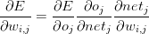

# 用 Python 从头开始反向传播

> 原文：<https://pyimagesearch.com/2021/05/06/backpropagation-from-scratch-with-python/>

反向传播可以说是*神经网络历史上*最重要的算法——如果没有(有效的)反向传播，将*不可能*将深度学习网络训练到我们今天看到的深度。反向传播可以被认为是现代神经网络和深度学习的基石。

反向传播的最初形式早在 20 世纪 70 年代就被引入，但直到 1988 年由[鲁梅尔哈特、辛顿和威廉姆斯](https://dl.acm.org/doi/10.5555/65669.104451)撰写的开创性论文*通过反向传播误差*学习表示，我们才能够设计出更快的算法，更适合于训练更深层次的网络。

现在有数百(如果不是数千的话)关于反向传播的教程。我最喜欢的包括:

1.  [吴恩达](https://www.coursera.org/learn/machine-learning)Coursera 关于机器学习课程内部反向传播的讨论。
2.  高度数学化的第 2 章— *反向传播算法如何工作*来自*神经网络和深度学习*作者 [Michael Nielsen](http://neuralnetworksanddeeplearning.com/chap2.html) 。
3.  [斯坦福的 cs231n](http://cs231n.stanford.edu/) 对反向传播的探索与分析。
4.  马特·马祖尔的优秀的具体例子(有实际工作数据)展示了反向传播是如何工作的。

正如你所看到的，并不缺少反向传播指南——我将采取不同的方法，做一些让 PyImageSearch 出版物与众不同的事情，而不是重复和重复其他人已经说过几百次的话:

***使用 Python 语言构建一个直观、易于理解的反向传播算法实现。*T3****

在这个实现中，我们将构建一个实际的神经网络，并使用反向传播算法对其进行训练。当您完成这一部分时，您将理解反向传播是如何工作的——也许更重要的是，您将对这种算法如何用于从头开始训练神经网络有更深的理解。

### **反向传播**

反向传播算法包括两个阶段:

1.  *正向传递*，我们的输入通过网络传递，并获得输出预测(也称为*传播*阶段)。
2.  *反向传递*，我们在网络的最后一层(即预测层)计算损失函数的梯度，并使用该梯度递归应用链规则来更新我们网络中的权重(也称为*权重更新*阶段)。

我们将从高层次回顾这些阶段开始。从那里，我们将使用 Python 实现反向传播算法。一旦我们实现了反向传播，我们将希望能够使用我们的网络进行*预测*——这只是正向传递阶段，只有一个小的调整(就代码而言)使预测更有效。

最后，我将演示如何使用反向传播和 Python 来训练一个定制的神经网络:

1.  XOR 数据集
2.  MNIST 数据集

### **向前传球**

前向传递的目的是通过应用一系列点积和激活，在网络中传播我们的输入，直到我们到达网络的输出层(即我们的预测)。为了形象化这个过程，让我们首先考虑 XOR 数据集(**表 1** ，*左*)。

| ***x*0** | ***x* [1]** | ***y*** |  | ***x*0** | ***x* [1]** | ***x* [2]** |
| --- | --- | --- | --- | --- | --- | --- |
| Zero | Zero | Zero |  | Zero | Zero | one |
| Zero | one | one |  | Zero | one | one |
| one | Zero | one |  | one | Zero | one |
| one | one | Zero |  | one | one | one |

**Table 1:** *Left:* The bitwise XOR dataset (including class labels). *Right:* The XOR dataset design matrix with a bias column inserted (excluding class labels for brevity).

在这里，我们可以看到设计矩阵中的每个条目*X*(*左*)都是二维的——每个数据点由*两个*数字表示。比如第一个数据点用特征向量 *(0，0)* 表示，第二个数据点用 *(0，1)* 表示，等等。然后，我们将输出值 *y* 作为右列。我们的目标输出值是*类标签*。给定来自设计矩阵的输入，我们的目标是正确预测目标输出值。

为了在这个问题上获得完美的分类精度，我们需要一个至少有一个隐藏层的前馈神经网络，所以让我们从一个*221*架构开始(**图 1** 、*顶层*)。这是一个好的开始；然而，我们忘记了包含偏差项。在我们的网络中包含偏置项 ***b*** 有两种方式。我们可以:

1.  使用单独的变量。
2.  通过在特征向量中插入一列 1，将偏差视为权重矩阵中的可训练参数*。*

将一列 1 插入到我们的特征向量中是通过编程完成的，但为了确保我们理解这一点，让我们更新我们的 XOR 设计矩阵，以明确地看到这种情况发生(**表 1** ，*右*)。如你所见，我们的特征向量中增加了一列 1。实际上，您可以将该列插入到您喜欢的任何地方，但是我们通常将它放在(1)特征向量中的第一个条目或者(2)特征向量中的最后一个条目。

由于我们已经改变了输入特征向量的大小(通常在神经网络实现本身内部执行*，因此我们不需要显式修改我们的设计矩阵)，这将我们(感知的)网络架构从*221*改变为(内部)*331*(**图 1** 、*底部*)。*

我们仍将这种网络架构称为*221*，但在实施时，它实际上是*331*，因为权重矩阵中嵌入了偏置项。

最后，回想一下，我们的输入层和所有隐藏层都需要一个偏差项；然而，最终输出层*不需要偏置。应用偏差技巧的好处是，我们不再需要明确跟踪偏差参数——它现在是权重矩阵*中的一个可训练参数*,从而使训练更有效，也更容易实现。*

为了看到向前传球的效果，我们首先初始化网络中的权重，如图 2 中的**所示。注意权重矩阵中的每个箭头都有一个相关的值——这是给定节点的*当前*权重值，表示给定输入被放大或缩小的量。然后，在反向传播阶段，该权重值将被*更新*。**

在**图 2** 的*最左边*，我们给出特征向量 *(0，1，1)* (以及目标输出值 1 到网络)。这里我们可以看到 *0* 、 *1* 和 *1* 已经被分配给网络中的三个输入节点。为了通过网络传播这些值并获得最终分类，我们需要获取输入值和权重值之间的点积，然后应用激活函数(在本例中是 *sigmoid* 函数， *σ* )。

让我们计算隐藏层中三个节点的输入:

1.  *σ((0×0.351)+(1×1.076)+(1×1.116))= 0.899*
2.  *σ((0×0.097)+(1×0.165)+(1×0.542))= 0.593*
3.  *σ((0×0.457)+(1×0.165)+(1×0.331))= 0.378*

查看隐藏层的节点值(**图 2** 、*中间*)，我们可以看到节点已经更新以反映我们的计算。

我们现在有了隐藏层节点的*输入*。为了计算输出预测，我们再次计算点积，然后是 sigmoid 激活:

***((0*)。* 899 *×* 0 *。* 383) + (0 *。*593*×*0*。* 327) + (0 *。*378*×*0*。* 329)) = 0 *。506****

 ***网络的输出因此为*0.506* 。我们可以应用阶跃函数来确定该输出是否是正确的分类:

 = \begin{cases} 1 & \textit{if net} > 0 \\ 0 & \textit{otherwise} \end{cases}")

应用具有 *net = 0.506* 的阶跃函数，我们看到我们的网络预测了 *1* ，这实际上是正确的类标签。但是我们的网络*对这个类标签*不是很有信心——预测值 *0.506* 非常接近台阶的阈值。理想情况下，这种预测应该更接近于*0.98-0.99*，这意味着我们的网络已经真正了解了数据集中的潜在模式。为了让我们的网络真正“学习”，我们需要应用向后传递。

### **向后传球**

为了应用反向传播算法，我们的激活函数必须是*可微的*，以便我们可以计算误差相对于给定权重 *w* *[i，j]* 、损耗( *E* )、节点输出 *o* *[j]* 以及网络输出 *net* *[j] 的*

**②**

 **由于反向传播背后的演算已经在以前的作品中详尽地解释过多次(参见[吴恩达](https://www.coursera.org/learn/machine-learning)、[迈克尔·尼尔森](http://neuralnetworksanddeeplearning.com/chap2.html)和[马特·马祖尔](https://mattmazur.com/2015/ 03/17/a-step-by-step-backpropagation-example/))，我将跳过反向传播链规则更新的推导，而是在下一节中通过代码来解释它。

对于数学敏锐的人来说，请参阅上面的参考文献，以获得关于链规则及其在反向传播算法中的作用的更多信息。通过用代码解释这个过程，我的目标是帮助读者通过更直观的实现方式来理解反向传播。

### **用 Python 实现反向传播**

让我们继续并开始实现反向传播。打开一个新文件，将其命名为`neuralnetwork.py`，将其存储在`pyimagesearch`的`nn`子模块中(就像我们对`perceptron.py`所做的那样)，然后让我们开始工作:

```py
# import the necessary packages
import numpy as np

class NeuralNetwork:
	def __init__(self, layers, alpha=0.1):
		# initialize the list of weights matrices, then store the
		# network architecture and learning rate
		self.W = []
		self.layers = layers
		self.alpha = alpha
```

在**第 2 行，**我们导入了实现反向传播所需的唯一包 NumPy 数值处理库。

**第 5 行**定义了我们的`NeuralNetwork`类的构造函数。构造函数需要一个参数，后跟第二个可选参数:

*   `layers`:表示前馈网络的实际*架构*的整数列表。例如，*【2，2，1】*的值意味着我们的第一个输入层有两个节点，我们的隐藏层有两个节点，我们的最终输出层有一个节点。
*   这里我们可以指定神经网络的学习速率。该值在权重更新阶段应用。

**第 8 行**初始化每一层的权重列表`W`。然后我们将`layers`和`alpha`存储在**第 9 行和第 10 行**。

我们的权重列表`W`是空的，所以现在让我们开始初始化它:

```py
		# start looping from the index of the first layer but
		# stop before we reach the last two layers
		for i in np.arange(0, len(layers) - 2):
			# randomly initialize a weight matrix connecting the
			# number of nodes in each respective layer together,
			# adding an extra node for the bias
			w = np.random.randn(layers[i] + 1, layers[i + 1] + 1)
			self.W.append(w / np.sqrt(layers[i]))
```

在**第 14 行，**我们开始循环网络中的层数(即`len(layers)`)，但是我们在最后两层之前停止了(我们将在后面解释这个构造函数时找到确切的原因)。

网络中的每一层都是通过从标准正态分布(**第 18 行**)中采样值构建一个 *M×N* 权重矩阵来随机初始化的。矩阵是*M*T6×N，因为我们希望将*当前层*中的每个节点连接到*下一层*中的每个节点。

比如，我们假设`layers[i] = 2`和`layers[i + 1] = 2`。因此，我们的权重矩阵将是 *2×2* 来连接层之间的所有节点集。然而，我们在这里需要小心，因为我们忘记了一个重要的组成部分——*偏差项*。为了考虑偏差，我们给`layers[i]`和`layers[i + 1]`的数量加 1——这样做改变了我们的权重矩阵`w`，以具有给定当前层的 *2+1* 节点和下一层的 *2+1* 节点的形状 *3×3* 。我们通过除以当前层中节点数量的平方根来缩放`w`，从而归一化每个神经元输出的方差([http://cs231n.stanford.edu/](http://cs231n.stanford.edu/))(**第 19 行**)。

构造函数的最后一个代码块处理输入连接需要偏置项，但输出不需要的特殊情况:

```py
		# the last two layers are a special case where the input
		# connections need a bias term but the output does not
		w = np.random.randn(layers[-2] + 1, layers[-1])
		self.W.append(w / np.sqrt(layers[-2]))
```

同样，这些权重值是随机采样的，然后进行归一化。

我们定义的下一个函数是一个名为`__repr__`的 Python“魔法方法”——这个函数对于调试很有用:

```py
	def __repr__(self):
		# construct and return a string that represents the network
		# architecture
		return "NeuralNetwork: {}".format(
			"-".join(str(l) for l in self.layers))
```

在我们的例子中，我们将通过连接每一层中节点数量的整数值来为我们的`NeuralNetwork`对象格式化一个字符串。给定`(2, 2, 1)`的`layers`值，调用该函数的输出将是:

```py
>>> from pyimagesearch.nn import NeuralNetwork
>>> nn = NeuralNetwork([2, 2, 1])
>>> print(nn)
NeuralNetwork: 2-2-1
```

接下来，我们可以定义我们的 sigmoid 激活函数:

```py
	def sigmoid(self, x):
		# compute and return the sigmoid activation value for a
		# given input value
		return 1.0 / (1 + np.exp(-x))
```

以及 sigmoid 的*导数*，我们将在向后传递时使用:

```py
  	def sigmoid_deriv(self, x):
		# compute the derivative of the sigmoid function ASSUMING
		# that x has already been passed through the 'sigmoid'
		# function
		return x * (1 - x)
```

再次注意，每当你执行反向传播时，你总是想选择一个*可微*的激活函数。

我们将从 scikit-learn 库获得灵感，并定义一个名为`fit`的函数，它将负责实际训练我们的`NeuralNetwork`:

```py
  	def fit(self, X, y, epochs=1000, displayUpdate=100):
		# insert a column of 1's as the last entry in the feature
		# matrix -- this little trick allows us to treat the bias
		# as a trainable parameter within the weight matrix
		X = np.c_[X, np.ones((X.shape[0]))]

		# loop over the desired number of epochs
		for epoch in np.arange(0, epochs):
			# loop over each individual data point and train
			# our network on it
			for (x, target) in zip(X, y):
				self.fit_partial(x, target)

			# check to see if we should display a training update
			if epoch == 0 or (epoch + 1) % displayUpdate == 0:
				loss = self.calculate_loss(X, y)
				print("[INFO] epoch={}, loss={:.7f}".format(
					epoch + 1, loss))
```

`fit`方法需要两个参数，后跟两个可选参数。第一个`X`，是我们的*训练数据*。第二个，`y`，是`X`中每个条目对应的类标签。然后我们指定`epochs`，这是我们将训练我们的网络的纪元数量。`displayUpdate`参数简单地控制我们在终端上打印训练进度的次数。

在**第 47 行，**我们通过插入一列 1 作为我们特征矩阵的最后一个条目，`X`来执行偏差技巧。从那里，我们开始在**线 50** 上循环我们的`epochs`号。对于每个时期，我们将在训练集中的每个单独的数据点上循环，对数据点进行预测，计算反向传播阶段，然后更新我们的权重矩阵(**行 53 和 54** )。**第 57-60 行**简单地检查我们是否应该在我们的终端上显示一个训练更新。

反向传播算法的核心在下面的`fit_partial`方法中:

```py
  	def fit_partial(self, x, y):
		# construct our list of output activations for each layer
		# as our data point flows through the network; the first
		# activation is a special case -- it's just the input
		# feature vector itself
		A = [np.atleast_2d(x)]
```

`fit_partial`函数需要两个参数:

*   `x`:来自我们设计矩阵的单个数据点。
*   `y`:对应的类标签。

然后，我们在第 67 行的**上初始化一个列表`A`——当我们的数据点`x`通过网络向前传播时，这个列表负责存储每一层的输出激活。我们用`x`初始化这个列表，它只是输入数据点。**

从这里，我们可以开始向前传播阶段:

```py
		# FEEDFORWARD:
		# loop over the layers in the network
		for layer in np.arange(0, len(self.W)):
			# feedforward the activation at the current layer by
			# taking the dot product between the activation and
			# the weight matrix -- this is called the "net input"
			# to the current layer
			net = A[layer].dot(self.W[layer])

			# computing the "net output" is simply applying our
			# nonlinear activation function to the net input
			out = self.sigmoid(net)

			# once we have the net output, add it to our list of
			# activations
			A.append(out)
```

我们开始在**线路 71** 上的网络的每一层上循环。当前`layer`的*净输入*通过取激活和权重矩阵之间的点积来计算(**行 76** )。当前层的*净输出*然后通过使净输入通过非线性 sigmoid 激活函数来计算。一旦我们有了净输出，我们就把它添加到我们的激活列表中(**第 84 行**)。

信不信由你，这段代码是正向传递的*整体*——我们只是简单地在网络的每一层上循环，取激活和权重之间的点积，通过非线性激活函数传递值，并继续下一层。因此，`A`中的最后一个条目是我们网络中最后一层的输出(即*预测*)。

既然向前传球已经完成，我们可以继续进行稍微复杂一点的向后传球:

```py
		# BACKPROPAGATION
		# the first phase of backpropagation is to compute the
		# difference between our *prediction* (the final output
		# activation in the activations list) and the true target
		# value
		error = A[-1] - y

		# from here, we need to apply the chain rule and build our
		# list of deltas 'D'; the first entry in the deltas is
		# simply the error of the output layer times the derivative
		# of our activation function for the output value
		D = [error * self.sigmoid_deriv(A[-1])]
```

反向传递的第一阶段是计算我们的`error`，或者简单地计算我们的*预测*标签和*地面实况*标签之间的差(**行 91** )。由于激活列表`A`中的最后一个条目包含网络的输出，我们可以通过`A[-1]`访问输出预测。值`y`是输入数据点`x`的目标输出。

***备注:*** 使用 Python 编程语言时，指定索引值`-1`表示我们要访问列表中最后一个条目*。你可以在本教程中阅读更多关于 Python 数组索引和切片的内容:[http://pyimg.co/6dfae](http://pyimg.co/6dfae)。*

接下来，我们需要开始应用链式规则来构建我们的增量列表。增量将用于更新我们的权重矩阵，通过学习率`alpha`进行缩放。增量列表中的第一个条目是我们输出层的误差乘以输出值的 sigmoid 的导数(**第 97 行**)。

给定网络中最后一层的增量，我们现在可以使用`for`循环反向工作:

```py
		# once you understand the chain rule it becomes super easy
		# to implement with a 'for' loop -- simply loop over the
		# layers in reverse order (ignoring the last two since we
		# already have taken them into account)
		for layer in np.arange(len(A) - 2, 0, -1):
			# the delta for the current layer is equal to the delta
			# of the *previous layer* dotted with the weight matrix
			# of the current layer, followed by multiplying the delta
			# by the derivative of the nonlinear activation function
			# for the activations of the current layer
			delta = D[-1].dot(self.W[layer].T)
			delta = delta * self.sigmoid_deriv(A[layer])
			D.append(delta)
```

在**第 103 行上，**我们开始以*逆序*循环遍历网络中的每一层(忽略前两层，因为它们已经在**第 97** 行中得到考虑)，因为我们需要向后*工作*来计算每一层的增量更新。当前层的`delta`等于前一层的增量，`D[-1]`用当前层的权重矩阵(**行 109** )来表示。为了完成`delta`的计算，我们通过将`layer`的激活传递给我们的 sigmoid 的导数(**行 110** )来将其相乘。然后我们用刚刚计算的`delta`更新增量`D`列表(**行 111** )。

查看这个代码块，我们可以看到反向传播步骤是迭代的——我们只是从*前一层*中取增量，用*当前层*的权重点它，然后乘以激活的导数。重复这个过程，直到我们到达网络中的第一层。

给定我们的增量列表`D`，我们可以进入权重更新阶段:

```py
  		# since we looped over our layers in reverse order we need to
		# reverse the deltas
		D = D[::-1]

		# WEIGHT UPDATE PHASE
		# loop over the layers
		for layer in np.arange(0, len(self.W)):
			# update our weights by taking the dot product of the layer
			# activations with their respective deltas, then multiplying
			# this value by some small learning rate and adding to our
			# weight matrix -- this is where the actual "learning" takes
			# place
			self.W[layer] += -self.alpha * A[layer].T.dot(D[layer])
```

记住，在反向传播步骤中，我们以*反向*的顺序循环我们的层。为了执行我们的权重更新阶段，我们将简单地*反转`D`中条目的顺序*，这样我们就可以从 *0* 到 *N、*网络中的总层数(**行 115** )依次循环每一层。

更新我们的实际权重矩阵(即，实际“学习”发生的地方)是在**行 125** 完成的，这是我们的梯度下降。我们取当前`layer`激活`A[layer]`与当前`layer`、`D[layer]`的增量的点积，并将它们乘以学习速率`alpha`。该值被添加到当前`layer`、`W[layer]`的权重矩阵中。

我们对网络中的所有层重复这一过程。在执行权重更新阶段之后，反向传播正式完成。

一旦我们的网络在给定的数据集上得到训练，我们将希望在测试集上进行预测，这可以通过下面的`predict`方法来完成:

```py
  	def predict(self, X, addBias=True):
		# initialize the output prediction as the input features -- this
		# value will be (forward) propagated through the network to
		# obtain the final prediction
		p = np.atleast_2d(X)

		# check to see if the bias column should be added
		if addBias:
			# insert a column of 1's as the last entry in the feature
			# matrix (bias)
			p = np.c_[p, np.ones((p.shape[0]))]

		# loop over our layers in the network
		for layer in np.arange(0, len(self.W)):
			# computing the output prediction is as simple as taking
			# the dot product between the current activation value 'p'
			# and the weight matrix associated with the current layer,
			# then passing this value through a nonlinear activation
			# function
			p = self.sigmoid(np.dot(p, self.W[layer]))

		# return the predicted value
		return p
```

`predict`函数只是一个美化了的向前传递。该函数接受一个必需参数，后跟第二个可选参数:

*   `X`:我们将要预测类别标签的数据点。
*   `addBias`:一个布尔值，指示我们是否需要添加一列 *1* 到`X`来执行偏置技巧。

在**线 131** 上，我们初始化`p`，输出预测作为输入数据点`X`。这个值`p`将通过网络中的每一层，传播直到我们达到最终的输出预测。

在**第 134-137 行，**我们做了一个检查，看看偏差项是否应该嵌入到数据点中。如果是这样，我们插入一列 1 作为矩阵的最后一列(正如我们在上面的`fit`方法中所做的)。

从那里，我们通过在**线路 140** 上循环我们网络中的所有层来执行正向传播。通过获取当前激活`p`和当前`layer`的权重矩阵之间的点积来更新数据点`p`，随后通过我们的 sigmoid 激活函数传递输出(**行 146** )。

假设我们在网络中的所有层上循环，我们将最终到达最后一层，这将给我们最终的类标签预测。我们将预测值返回给第 149 行上的调用函数**。**

我们将在`NeuralNetwork`类中定义的最后一个函数将用于计算整个*训练集的损失:*

```py
  	def calculate_loss(self, X, targets):
		# make predictions for the input data points then compute
		# the loss
		targets = np.atleast_2d(targets)
		predictions = self.predict(X, addBias=False)
		loss = 0.5 * np.sum((predictions - targets) ** 2)

		# return the loss
		return loss
```

`calculate_loss`函数要求我们传入数据点`X`以及它们的基本事实标签`targets`。我们对**线 155** 上的`X`进行预测，然后计算**线 156** 上的误差平方和。然后，损失返回到**线 159** 上的调用函数。随着我们的网络学习，我们应该看到这种损失减少。

### **使用 Python 的反向传播示例#1:按位异或**

现在我们已经实现了我们的`NeuralNetwork`类，让我们继续在按位 XOR 数据集上训练它。正如我们从感知机的工作中所知，这个数据集是*而不是*线性可分的——我们的目标是训练一个可以模拟这种非线性函数的神经网络。

继续打开一个新文件，将其命名为`nn_xor.py`，并插入以下代码:

```py
# import the necessary packages
from pyimagesearch.nn import NeuralNetwork
import numpy as np

# construct the XOR dataset
X = np.array([[0, 0], [0, 1], [1, 0], [1, 1]])
y = np.array([[0], [1], [1], [0]])
```

**第 2 行和第 3 行**导入我们需要的 Python 包。注意我们是如何导入新实现的`NeuralNetwork`类的。**第 6 行和第 7 行**然后构建 XOR 数据集。

我们现在可以定义我们的网络架构并对其进行训练:

```py
# define our 2-2-1 neural network and train it
nn = NeuralNetwork([2, 2, 1], alpha=0.5)
nn.fit(X, y, epochs=20000)
```

在第 10 行的**上，我们实例化了我们的`NeuralNetwork`以拥有一个*221*架构，这意味着有:**

1.  具有两个节点的输入层(即我们的两个输入)。
2.  具有两个节点的单个隐藏层。
3.  具有一个节点的输出图层。

**11 号线**共训练我们的网络 20000 个纪元。

一旦我们的网络被训练，我们将循环我们的 XOR 数据集，允许网络预测每个数据集的输出，并在屏幕上显示预测结果:

```py
# now that our network is trained, loop over the XOR data points
for (x, target) in zip(X, y):
	# make a prediction on the data point and display the result
	# to our console
	pred = nn.predict(x)[0][0]
	step = 1 if pred > 0.5 else 0
	print("[INFO] data={}, ground-truth={}, pred={:.4f}, step={}".format(
		x, target[0], pred, step))
```

**第 18 行**将阶跃函数应用于 sigmoid 输出。如果预测是 *> 0.5* ，我们将返回*1*，否则，我们将返回*0*。应用这个步骤函数允许我们将输出类标签二进制化，就像 XOR 函数一样。

要使用 Python 的反向传播来训练我们的神经网络，只需执行以下命令:

```py
$ python nn_xor.py
[INFO] epoch=1, loss=0.5092796
[INFO] epoch=100, loss=0.4923591
[INFO] epoch=200, loss=0.4677865
...
[INFO] epoch=19800, loss=0.0002478
[INFO] epoch=19900, loss=0.0002465
[INFO] epoch=20000, loss=0.0002452
```

平方损失图如下所示(**图 3** )。正如我们所看到的，在整个训练过程中，损耗慢慢减少到接近于零。此外，查看输出的最后四行，我们可以看到我们的预测:

```py
[INFO] data=[0 0], ground-truth=0, pred=0.0054, step=0
[INFO] data=[0 1], ground-truth=1, pred=0.9894, step=1
[INFO] data=[1 0], ground-truth=1, pred=0.9876, step=1
[INFO] data=[1 1], ground-truth=0, pred=0.0140, step=0
```

对于每一个数据点，我们的神经网络能够正确地学习 XOR 模式，表明我们的多层神经网络能够学习非线性函数。

为了证明学习 XOR 函数至少需要一个隐藏层，回到**行 10** ，这里我们定义了*221*架构:

```py
# define our 2-2-1 neural network and train it
nn = NeuralNetwork([2, 2, 1], alpha=0.5)
nn.fit(X, y, epochs=20000)
```

并改成 *2-1* 架构:

```py
# define our 2-1 neural network and train it
nn = NeuralNetwork([2, 1], alpha=0.5)
nn.fit(X, y, epochs=20000)
```

在此基础上，您可以尝试重新培训您的网络:

```py
$ python nn_xor.py
...
[INFO] data=[0 0], ground-truth=0, pred=0.5161, step=1
[INFO] data=[0 1], ground-truth=1, pred=0.5000, step=1
[INFO] data=[1 0], ground-truth=1, pred=0.4839, step=0
[INFO] data=[1 1], ground-truth=0, pred=0.4678, step=0
```

无论你如何摆弄学习率或权重初始化，你永远无法逼近异或函数。这一事实就是为什么具有通过反向传播训练的非线性激活函数的多层网络如此重要——它们使我们能够学习数据集中的模式，否则这些模式是非线性可分离的。

### **用 Python 反向传播例子:MNIST 样本**

作为第二个更有趣的例子，让我们检查一下用于手写数字识别的 MNIST 数据集的子集(**图 4** )。MNIST 数据集的这个子集内置在 scikit-learn 库中，包括 1797 个示例数字，每个数字都是 *8×8* 灰度图像(原始图像是 *28×28* )。展平后，这些图像由一个 *8×8* = *64* -dim 矢量表示。

现在，让我们继续在这个 MNIST 子集上训练我们的`NeuralNetwork`实现。打开一个新文件，命名为`nn_mnist.py`，我们开始工作:

```py
# import the necessary packages
from pyimagesearch.nn import NeuralNetwork
from sklearn.preprocessing import LabelBinarizer
from sklearn.model_selection import train_test_split
from sklearn.metrics import classification_report
from sklearn import datasets
```

我们从第 2-6 行开始，导入我们需要的 Python 包。

在那里，我们使用 scikit-learn 辅助函数从磁盘加载 MNIST 数据集:

```py
# load the MNIST dataset and apply min/max scaling to scale the
# pixel intensity values to the range [0, 1] (each image is
# represented by an 8 x 8 = 64-dim feature vector)
print("[INFO] loading MNIST (sample) dataset...")
digits = datasets.load_digits()
data = digits.data.astype("float")
data = (data - data.min()) / (data.max() - data.min())
print("[INFO] samples: {}, dim: {}".format(data.shape[0],
	data.shape[1]))
```

我们还通过将每个数字缩放到范围*【0，1】***(第 14 行**)来执行最小/最大归一化。

接下来，让我们构建一个培训和测试分割，使用 75%的数据进行测试，25%的数据进行评估:

```py
# construct the training and testing splits
(trainX, testX, trainY, testY) = train_test_split(data,
	digits.target, test_size=0.25)

# convert the labels from integers to vectors
trainY = LabelBinarizer().fit_transform(trainY)
testY = LabelBinarizer().fit_transform(testY)
```

我们还将把我们的类标签整数编码成向量，这个过程叫做*一键编码*。

从那里，我们准备好训练我们的网络:

```py
# train the network
print("[INFO] training network...")
nn = NeuralNetwork([trainX.shape[1], 32, 16, 10])
print("[INFO] {}".format(nn))
nn.fit(trainX, trainY, epochs=1000)
```

在这里，我们可以看到我们正在训练一个采用*64321610*架构的`NeuralNetwork`。由于数字 *0-9* 有十个可能的输出类，所以输出层有十个节点。

然后我们允许我们的网络训练 1000 个纪元。一旦我们的网络经过训练，我们就可以在测试集上对其进行评估:

```py
# evaluate the network
print("[INFO] evaluating network...")
predictions = nn.predict(testX)
predictions = predictions.argmax(axis=1)
print(classification_report(testY.argmax(axis=1), predictions))
```

**线 34** 计算`testX`中每个数据点的输出`predictions`。`predictions`数组具有`(450, 10)`的形状，因为在测试集中有 450 个数据点，每个数据点有十种可能的类别标签概率。

为了找到对于*每个数据点*具有*最大概率*的类别标签，我们使用**行 35** 上的`argmax`函数—该函数将返回具有最高预测概率的标签的索引。然后，我们在屏幕的第 36**行**显示一个格式良好的分类报告。

要在 MNIST 数据集上训练我们的定制`NeuralNetwork`实现，只需执行以下命令:

```py
$ python nn_mnist.py
[INFO] loading MNIST (sample) dataset...
[INFO] samples: 1797, dim: 64
[INFO] training network...
[INFO] NeuralNetwork: 64-32-16-10
[INFO] epoch=1, loss=604.5868589
[INFO] epoch=100, loss=9.1163376
[INFO] epoch=200, loss=3.7157723
[INFO] epoch=300, loss=2.6078803
[INFO] epoch=400, loss=2.3823153
[INFO] epoch=500, loss=1.8420944
[INFO] epoch=600, loss=1.3214138
[INFO] epoch=700, loss=1.2095033
[INFO] epoch=800, loss=1.1663942
[INFO] epoch=900, loss=1.1394731
[INFO] epoch=1000, loss=1.1203779
[INFO] evaluating network...
             precision    recall  f1-score   support

          0       1.00      1.00      1.00        45
          1       0.98      1.00      0.99        51
          2       0.98      1.00      0.99        47
          3       0.98      0.93      0.95        43
          4       0.95      1.00      0.97        39
          5       0.94      0.97      0.96        35
          6       1.00      1.00      1.00        53
          7       1.00      1.00      1.00        49
          8       0.97      0.95      0.96        41
          9       1.00      0.96      0.98        47

avg / total       0.98      0.98      0.98       450
```

我还包括了一个平方损失图(**图 5** )。请注意，我们的损失一开始非常高，但在培训过程中迅速下降。我们的分类报告表明，我们正在我们的测试集上获得 *≈98%* 的分类精度；然而，我们在对数字`4`和`5`进行分类时遇到了一些麻烦(准确率分别为 95%和 94%)。在本书的后面，我们将学习如何在*完整的* MNIST 数据集上训练卷积神经网络，并进一步提高我们的准确性。

### **反向传播总结**

今天，我们学习了如何使用 Python 从头开始实现反向传播算法。反向传播是专门用于训练多层前馈网络的梯度下降算法族的推广。

反向传播算法包括两个阶段:

1.  正向传递，我们通过网络传递我们的输入，以获得我们的输出分类。
2.  反向传递(即，权重更新阶段),其中我们计算损失函数的梯度，并使用该信息迭代地应用链规则来更新我们的网络中的权重。

不管我们是使用简单的前馈神经网络还是复杂的深度卷积神经网络，反向传播算法仍然用于训练这些模型。这是通过确保网络内部的激活函数是*可微的*来实现的，允许应用链式法则。此外，网络内部需要更新其权重/参数的任何其他层也必须与反向传播兼容。

我们使用 Python 编程语言实现了反向传播算法，并设计了一个多层前馈`NeuralNetwork`类。然后在 XOR 数据集上训练该实现，以证明我们的神经网络能够通过应用具有至少一个隐藏层的反向传播算法来学习非线性函数。然后，我们将相同的反向传播+ Python 实现应用于 MNIST 数据集的子集，以证明该算法也可用于处理图像数据。

在实践中，反向传播不仅难以实现(由于计算梯度的错误)，而且在没有特殊优化库的情况下很难实现高效，这就是为什么我们经常使用 Keras、TensorFlow 和 mxnet 等库，这些库已经使用优化策略*(正确地】实现了反向传播。******