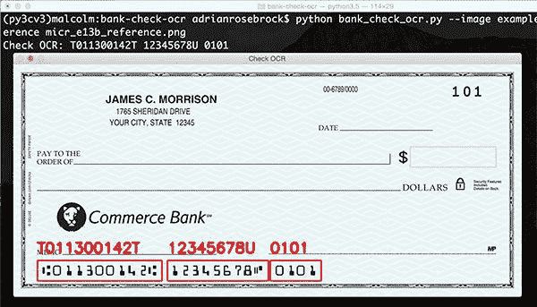
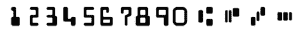
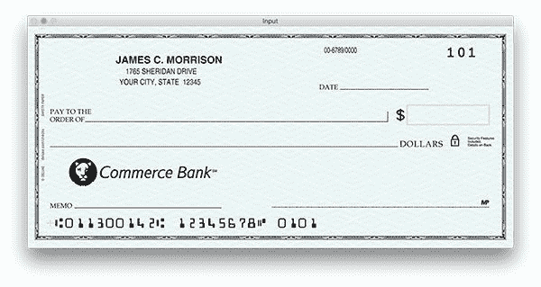
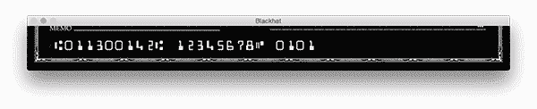
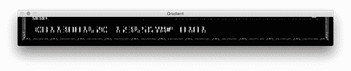
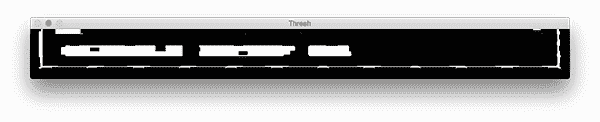
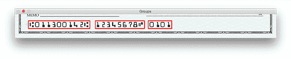
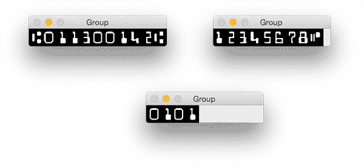

# 用 OpenCV 和 Python 实现银行支票 OCR(下)

> 原文：<https://pyimagesearch.com/2017/07/31/bank-check-ocr-opencv-python-part-ii/>

[](https://pyimagesearch.com/wp-content/uploads/2017/07/bank_check_output.jpg)

今天的博文是我们关于使用 OpenCV、Python 和计算机视觉技术 OCR 识别银行支票账户和路由号码的两部分系列文章的第二部分。

[上周](https://pyimagesearch.com/2017/07/24/bank-check-ocr-with-opencv-and-python-part-i/)我们学习了如何从输入图像中提取 MICR E-13B 数字和符号。今天我们将利用这些知识，用它来让*实际识别*每个字符，从而让我们能够 OCR 识别实际的银行支票和银行代号。

**要了解如何使用 Python 和 OpenCV 对银行支票进行 OCR，请继续阅读。**

## 用 OpenCV 和 Python 实现银行支票 OCR

在本系列的第一部分中，我们学习了如何本地化银行支票上使用的 14 种 MICR E-13B 字体字符。

这些字符中有 10 个是数字，它们构成了我们实际的账号和路由号。剩下的四个字符是银行使用的特殊符号，用于区分银行代号、帐号和支票上的任何其他编码信息。

下图显示了我们将在本教程中进行 OCR 的所有 14 个字符:

[](https://pyimagesearch.com/wp-content/uploads/2017/07/micr_chars-1.png)

**Figure 1:** The fourteen MICR E-13B characters used in bank checks. We will write Python + OpenCV code to recognize each of these characters.

下面的列表显示了四个符号:

*   ⑆公交(划行支行路由公交#)
*   ⑈ On-us(划定客户账号)
*   ⑇金额(划入交易金额)
*   ⑉破折号(分隔数字的一部分，如路由或帐户)

由于 OpenCV 不允许我们在图像上绘制 Unicode 字符，我们将在代码中使用以下 ASCII 字符映射来表示*运输*、*数量*、 *On-us* 和*破折号*:

*   T = ⑆
*   U = ⑈
*   A = ⑇
*   D = ⑉

既然我们已经能够实际定位数字和符号，我们就可以像在我们的[信用卡 OCR post](https://pyimagesearch.com/2017/07/17/credit-card-ocr-with-opencv-and-python/) 中一样应用模板匹配来执行 OCR。

### 使用 OpenCV 读取帐号和路由号码

为了构建我们的银行支票 OCR 系统，我们将重用上周的一些代码。如果您还没有阅读本系列的第一部分，现在花点时间[回去通读一下](https://pyimagesearch.com/2017/07/24/bank-check-ocr-with-opencv-and-python-part-i/)—`extract_digitis_and_symbols`函数的解释对于本地化银行支票字符尤其重要和关键。

也就是说，让我们打开一个新文件，将其命名为`bank_check_ocr.py`，并插入以下代码:

```py
# import the necessary packages
from skimage.segmentation import clear_border
from imutils import contours
import numpy as np
import argparse
import imutils
import cv2

```

2-7 号线处理我们的标准进口。如果你熟悉这个博客，这些进口应该不是什么新鲜事。如果您的系统上没有这些软件包，您可以执行以下操作来安装它们:

1.  [使用系统的相关说明安装 OpenCV](https://pyimagesearch.com/opencv-tutorials-resources-guides/) (同时确保您遵循任何 Python virtualenv 命令)。
2.  激活您的 Python virtualenv 并安装软件包:
    1.  `$ workon cv`
    2.  `$ pip install numpy`
    3.  `$ pip install skimage`
    4.  `$ pip install imutils`

***注意:**对于任何 pip 命令，您可以使用`--upgrade`标志来更新您是否已经安装了软件。*

现在我们已经安装了依赖项，让我们*快速回顾一下*上周在本系列第一部分中提到的函数:

```py
def extract_digits_and_symbols(image, charCnts, minW=5, minH=15):
	# grab the internal Python iterator for the list of character
	# contours, then  initialize the character ROI and location
	# lists, respectively
	charIter = charCnts.__iter__()
	rois = []
	locs = []

	# keep looping over the character contours until we reach the end
	# of the list
	while True:
		try:
			# grab the next character contour from the list, compute
			# its bounding box, and initialize the ROI
			c = next(charIter)
			(cX, cY, cW, cH) = cv2.boundingRect(c)
			roi = None

			# check to see if the width and height are sufficiently
			# large, indicating that we have found a digit
			if cW >= minW and cH >= minH:
				# extract the ROI
				roi = image[cY:cY + cH, cX:cX + cW]
				rois.append(roi)
				locs.append((cX, cY, cX + cW, cY + cH))

```

该函数只有一个目标，即基于轮廓查找和定位数字和符号。这是通过遍历轮廓列表`charCnts`，并在函数结束时返回的两个列表中跟踪感兴趣区域和 ROI 位置(`rois`和`locs`)来实现的。

在**行** **29** 我们检查轮廓的外接矩形是否至少和一个手指一样宽和一样高。如果是，我们提取并附加`roi` ( **行 31 和 32** )，然后将 ROI 的位置附加到`locs` ( **行 33** )。否则，我们将采取以下措施:

```py
			# otherwise, we are examining one of the special symbols
			else:
				# MICR symbols include three separate parts, so we
				# need to grab the next two parts from our iterator,
				# followed by initializing the bounding box
				# coordinates for the symbol
				parts = [c, next(charIter), next(charIter)]
				(sXA, sYA, sXB, sYB) = (np.inf, np.inf, -np.inf,
					-np.inf)

				# loop over the parts
				for p in parts:
					# compute the bounding box for the part, then
					# update our bookkeeping variables
					(pX, pY, pW, pH) = cv2.boundingRect(p)
					sXA = min(sXA, pX)
					sYA = min(sYA, pY)
					sXB = max(sXB, pX + pW)
					sYB = max(sYB, pY + pH)

				# extract the ROI
				roi = image[sYA:sYB, sXA:sXB]
				rois.append(roi)
				locs.append((sXA, sYA, sXB, sYB))

```

在上面的代码块中，我们已经确定了轮廓是特殊符号的一部分(如经纬仪、破折号等。).在这种情况下，我们在第 41 行的**上获取当前轮廓和`next`两个轮廓(使用我们上周讨论过的 Python 迭代器)。**

一个特殊符号的这些`parts`被循环，以便我们可以计算用于提取所有三个轮廓 ( **行 46-53** )周围的`roi` *的边界框。然后，和我们之前做的一样，我们提取`roi`并将其附加到`rois` ( **第 56 行和第 57 行**)，然后将其位置附加到`locs` ( **第 58 行**)。*

最后，我们需要捕捉一个`StopIteration`异常来优雅地退出我们的函数:

```py
		# we have reached the end of the iterator; gracefully break
		# from the loop
		except StopIteration:
			break

	# return a tuple of the ROIs and locations
	return (rois, locs)

```

一旦我们到达了`charCnts`列表的末尾(并且列表中没有进一步的条目)，对`charCnts`的`next`调用将导致抛出`StopIteration`异常。捕捉这个异常允许我们从循环中`break`(**第 62 行和第 63 行**)。

最后，我们返回一个包含`rois`和相应的`locs`的二元组。

这是对`extract_digits_and_symbols`功能的快速回顾——完整、详细的回顾，[请参考上周的博文](https://pyimagesearch.com/2017/07/24/bank-check-ocr-with-opencv-and-python-part-i/)。

现在是时候接触新材料了。首先，我们将浏览几个代码块，大家应该也有点熟悉:

```py
# construct the argument parse and parse the arguments
ap = argparse.ArgumentParser()
ap.add_argument("-i", "--image", required=True,
	help="path to input image")
ap.add_argument("-r", "--reference", required=True,
	help="path to reference MICR E-13B font")
args = vars(ap.parse_args())

```

**第 69-74 行**处理我们的命令行参数解析。在这个脚本中，我们将同时使用输入的`--image`和`--reference` MICR E-13B 字体图像。

让我们初始化我们的特殊字符(因为它们在 OpenCV 中不能用 Unicode 表示)并预处理我们的参考图像:

```py
# initialize the list of reference character names, in the same
# order as they appear in the reference image where the digits
# their names and:
# T = Transit (delimit bank branch routing transit #)
# U = On-us (delimit customer account number)
# A = Amount (delimit transaction amount)
# D = Dash (delimit parts of numbers, such as routing or account)
charNames = ["1", "2", "3", "4", "5", "6", "7", "8", "9", "0",
	"T", "U", "A", "D"]

# load the reference MICR image from disk, convert it to grayscale,
# and threshold it, such that the digits appear as *white* on a
# *black* background
ref = cv2.imread(args["reference"])
ref = cv2.cvtColor(ref, cv2.COLOR_BGR2GRAY)
ref = imutils.resize(ref, width=400)
ref = cv2.threshold(ref, 0, 255, cv2.THRESH_BINARY_INV |
	cv2.THRESH_OTSU)[1]

```

第 83 行和第 84 行建立了一个包括数字和特殊符号的字符名称列表。

然后，我们加载`--reference`图像，同时转换为灰度并调整大小，随后进行反向阈值处理(**第 89-93 行**)。

下面您可以看到预处理我们的参考图像的输出:

[](https://pyimagesearch.com/wp-content/uploads/2017/07/micr_reference-1.png)

**Figure 2:** The MICR E-13B font for the digits 0-9 and four special symbols. We will be using this font along with template matching to OCR our bank check images.

现在我们准备在`ref`中查找轮廓并进行分类:

```py
# find contours in the MICR image (i.e,. the outlines of the
# characters) and sort them from left to right
refCnts = cv2.findContours(ref.copy(), cv2.RETR_EXTERNAL,
	cv2.CHAIN_APPROX_SIMPLE)
refCnts = imutils.grab_contours(refCnts)
refCnts = contours.sort_contours(refCnts, method="left-to-right")[0]

```

参考图像轮廓在**第 97 行和第 98 行**计算，然后根据我们运行的 OpenCV 版本更新`refCnts`(**第 99 行**)。

我们在**行 100** 上从左到右对`refCnts`进行排序。

在这一点上，我们有一个有组织的参考轮廓。下一步是提取数字和符号，然后构建字符 ROI 字典:

```py
# extract the digits and symbols from the list of contours, then
# initialize a dictionary to map the character name to the ROI
refROIs = extract_digits_and_symbols(ref, refCnts,
	minW=10, minH=20)[0]
chars = {}

# loop over the reference ROIs
for (name, roi) in zip(charNames, refROIs):
	# resize the ROI to a fixed size, then update the characters
	# dictionary, mapping the character name to the ROI
	roi = cv2.resize(roi, (36, 36)) 
	chars[name] = roi

```

我们调用第 104 和 105 行**上的`extract_digits_and_symbols`函数**，提供`ref`图像和`refCnts`。

然后我们在第 106 行的**上初始化一个`chars`字典。我们在跨越**行 109-113** 的循环中填充这个字典。在字典中，字符`name`(键)与`roi`图像(值)相关联。**

接下来，我们将实例化一个内核，加载并提取支票图像底部的 20%，其中包含帐号:

```py
# initialize a rectangular kernel (wider than it is tall) along with
# an empty list to store the output of the check OCR
rectKernel = cv2.getStructuringElement(cv2.MORPH_RECT, (17, 7))
output = []

# load the input image, grab its dimensions, and apply array slicing
# to keep only the bottom 20% of the image (that's where the account
# information is)
image = cv2.imread(args["image"])
(h, w,) = image.shape[:2]
delta = int(h - (h * 0.2))
bottom = image[delta:h, 0:w]

```

我们将应用一个矩形内核来执行一些形态学操作(在**第 117 行**初始化)。我们还初始化了一个`output`列表来包含检查底部的字符。我们将把这些字符打印到终端上，稍后还会把它们画在支票图像上。

**第 123-126 行**简单加载`image`，抓取尺寸，提取支票图像底部的 20%。

***注意:**这不是旋转不变的——如果你的支票可能会被旋转，上下颠倒或垂直显示，那么你需要先添加逻辑来旋转它。在支票上应用自上而下的透视变换(比如在我们的[文档扫描仪帖子](https://pyimagesearch.com/2014/09/01/build-kick-ass-mobile-document-scanner-just-5-minutes/)中)可以帮助完成任务。* 

下面您可以找到我们的示例检查输入图像:

[](https://pyimagesearch.com/wp-content/uploads/2017/07/bank_check_ocr_input.jpg)

**Figure 3:** The example input bank check that we are going to OCR and extract the routing number and account number from ([source](https://www.bankatcommerce.com/direct-deposit.htm)).

接下来，让我们将支票转换为灰度并应用形态学变换:

```py
# convert the bottom image to grayscale, then apply a blackhat
# morphological operator to find dark regions against a light
# background (i.e., the routing and account numbers)
gray = cv2.cvtColor(bottom, cv2.COLOR_BGR2GRAY)
blackhat = cv2.morphologyEx(gray, cv2.MORPH_BLACKHAT, rectKernel)

```

在**行 131** 上，我们将支票图像的底部转换成灰度，在**行 132** 上，我们使用 [blackhat 形态学算子](http://docs.opencv.org/trunk/d9/d61/tutorial_py_morphological_ops.html)来寻找浅色背景下的深色区域。这个操作使用了我们的`rectKernel`。

结果显示了我们帐户和路由号码:

[](https://pyimagesearch.com/wp-content/uploads/2017/07/bank_check_ocr_blackhat.png)

**Figure 5:** Applying black hat morphological operation reveals our bank account number and routing number from the rest of the check.

现在让我们计算在 *x* 方向上的沙尔梯度:

```py
# compute the Scharr gradient of the blackhat image, then scale
# the rest back into the range [0, 255]
gradX = cv2.Sobel(blackhat, ddepth=cv2.CV_32F, dx=1, dy=0,
	ksize=-1)
gradX = np.absolute(gradX)
(minVal, maxVal) = (np.min(gradX), np.max(gradX))
gradX = (255 * ((gradX - minVal) / (maxVal - minVal)))
gradX = gradX.astype("uint8")

```

使用我们的 blackhat 算子，我们用`cv2.Sobel`函数(**第 136 和 137 行**)计算沙尔梯度。我们在**线 138** 上采用`gradX`的逐元素绝对值。

然后我们在第 139-141 行的**上将`gradX`缩放到范围【0-255】:**

[](https://pyimagesearch.com/wp-content/uploads/2017/07/bank_check_gradient.png)

**Figure 6:** Computing the Scharr gradient magnitude representation of the bank check image reveals vertical changes in the gradient.

让我们看看是否可以缩小字符之间的间隙，并将图像二值化:

```py
# apply a closing operation using the rectangular kernel to help
# cloes gaps in between rounting and account digits, then apply
# Otsu's thresholding method to binarize the image
gradX = cv2.morphologyEx(gradX, cv2.MORPH_CLOSE, rectKernel)
thresh = cv2.threshold(gradX, 0, 255,
	cv2.THRESH_BINARY | cv2.THRESH_OTSU)[1]

```

在第**行第 146** 处，我们在应用关闭操作时再次使用了我们的内核。我们通过在**行 147 和 148** 上执行二进制阈值来遵循这一点。

此操作的结果如下所示:

[](https://pyimagesearch.com/wp-content/uploads/2017/07/bank_check_thresh.png)

Figure 7: Thresholding our gradient magnitude representation reveals possible regions that contain the bank check account number and routing number.

在预处理支票图像时，我们的形态学+阈值操作无疑会留下“假阳性”检测区域，我们可以应用一些额外的处理来帮助消除这些操作:

```py
# remove any pixels that are touching the borders of the image (this
# simply helps us in the next step when we prune contours)
thresh = clear_border(thresh)

```

**第 152 行**通过移除图像边界像素来简单地清除边界；结果是微妙的，但将证明是非常有用的:

[](https://pyimagesearch.com/wp-content/uploads/2017/07/bank_check_clear_border.png)

**Figure 8:** To help remove noise we can clear any connected components that lie on the border of the image.

如上图所示，我们已经清楚地在支票上找到了三组数字。但是，我们实际上是如何从每一个个体群体中提取出 T1 的呢？下面的代码块将向我们展示如何操作:

```py
# find contours in the thresholded image, then initialize the
# list of group locations
groupCnts = cv2.findContours(thresh.copy(), cv2.RETR_EXTERNAL,
	cv2.CHAIN_APPROX_SIMPLE)
groupCnts = imutils.grab_contours(groupCnts)
groupLocs = []

# loop over the group contours
for (i, c) in enumerate(groupCnts):
	# compute the bounding box of the contour
	(x, y, w, h) = cv2.boundingRect(c)

	# only accept the contour region as a grouping of characters if
	# the ROI is sufficiently large
	if w > 50 and h > 15:
		groupLocs.append((x, y, w, h))

# sort the digit locations from left-to-right
groupLocs = sorted(groupLocs, key=lambda x:x[0])

```

在第 156-158 行,我们发现我们的轮廓也处理了令人讨厌的 OpenCV 版本不兼容性。

接下来，我们初始化一个列表来包含我们的号码组位置(**行 159** )。

在`groupCnts`上循环，我们确定轮廓边界框(**第 164 行**，并检查框参数是否符合字符分组的条件——如果是，我们将 ROI 值附加到`groupLocs` ( **第 168 和 169 行**)。

使用 lambdas，我们从左到右对数字位置进行排序(**行 172** )。

我们的分组区域显示在这张图片上:

[](https://pyimagesearch.com/wp-content/uploads/2017/07/bank_check_groups.png)

**Figure 9:** Applying contour filtering allows us to find the (1) account number, (2) routing number, and (3) additional information groups on the bank check.

接下来，让我们循环一遍组位置:

```py
# loop over the group locations
for (gX, gY, gW, gH) in groupLocs:
	# initialize the group output of characters
	groupOutput = []

	# extract the group ROI of characters from the grayscale
	# image, then apply thresholding to segment the digits from
	# the background of the credit card
	group = gray[gY - 5:gY + gH + 5, gX - 5:gX + gW + 5]
	group = cv2.threshold(group, 0, 255,
		cv2.THRESH_BINARY_INV | cv2.THRESH_OTSU)[1]

	cv2.imshow("Group", group)
	cv2.waitKey(0)

	# find character contours in the group, then sort them from
	# left to right
	charCnts = cv2.findContours(group.copy(), cv2.RETR_EXTERNAL,
		cv2.CHAIN_APPROX_SIMPLE)
	charCnts = imutils.grab_contours(charCnts)
	charCnts = contours.sort_contours(charCnts,
		method="left-to-right")[0]

```

在这个循环中，首先，我们初始化一个`groupOutput`列表，这个列表稍后将被追加到`output`列表中(**第 177 行**)。

随后，我们从图像中提取字符分组 ROI(**行 182** )并对其进行阈值处理(**行 183 和 184** )。

出于开发和调试的目的(**第 186 行和第 187 行**)，我们将该组显示在屏幕上，并在继续之前等待按键(如果您愿意，可以随意从脚本中删除这段代码)。

我们在第 191-195 行的**找到并分类组内的人物轮廓。该步骤的结果如图**图 10** 所示。**

[](https://pyimagesearch.com/wp-content/uploads/2017/07/bank_check_char_groups.png)

**Figure 10:** By using the *(x, y)*-coordinates of the locations, we can extract each group from the thresholded image. Given the group, contour detection allows us to detect each individual character.

现在，让我们用函数提取数字和符号，然后在`rois`上循环:

```py
	# find the characters and symbols in the group
	(rois, locs) = extract_digits_and_symbols(group, charCnts)

	# loop over the ROIs from the group
	for roi in rois:
		# initialize the list of template matching scores and
		# resize the ROI to a fixed size
		scores = []
		roi = cv2.resize(roi, (36, 36))

		# loop over the reference character name and corresponding
		# ROI
		for charName in charNames:
			# apply correlation-based template matching, take the
			# score, and update the scores list
			result = cv2.matchTemplate(roi, chars[charName],
				cv2.TM_CCOEFF)
			(_, score, _, _) = cv2.minMaxLoc(result)
			scores.append(score)

		# the classification for the character ROI will be the
		# reference character name with the *largest* template
		# matching score
		groupOutput.append(charNames[np.argmax(scores)])

```

在**行 198** 上，我们向`extract_digits_and_symbols`函数提供`group`和`charCnts`，该函数返回`rois`和`locs`。

我们循环遍历`rois`，首先初始化一个匹配分数列表的模板，然后将`roi`调整到已知的尺寸。

我们遍历角色名并执行模板匹配，将查询图像`roi`与第**行 212 和 213** 上的可能的角色图像(它们存储在`chars`字典中并由`charName`索引)进行比较。

为了提取与该操作的`score`匹配的模板，我们使用了`cv2.minMaxLoc`函数，随后，我们将它添加到第 215 行**的`scores`中。**

这个代码块的最后一步是从`scores`中获取最大值`score`，并使用它来查找角色名——我们将结果追加到`groupOutput` ( **第 220 行**)。

你可以在我们之前关于[信用卡 OCR](https://pyimagesearch.com/2017/07/17/credit-card-ocr-with-opencv-and-python/) 的博客文章中读到更多关于这种基于模板匹配的 OCR 方法的内容。

接下来，我们将利用原始的`image`将`groupOutput`结果附加到一个名为`output`的列表中。

```py
	# draw (padded) bounding box surrounding the group along with
	# the OCR output of the group
	cv2.rectangle(image, (gX - 10, gY + delta - 10),
		(gX + gW + 10, gY + gY + delta), (0, 0, 255), 2)
	cv2.putText(image, "".join(groupOutput),
		(gX - 10, gY + delta - 25), cv2.FONT_HERSHEY_SIMPLEX,
		0.95, (0, 0, 255), 3)

	# add the group output to the overall check OCR output
	output.append("".join(groupOutput))

```

**行 224 和 225** 处理在`groups`和**行周围绘制一个红色矩形**在图像上绘制组输出字符(路由、检查和检查号)。

最后，我们将`groupOutput`字符添加到一个`output`字符串中(**第 231 行**)。

我们的最后一步是将 OCR 文本写入我们的终端，并显示最终的输出图像:

```py
# display the output check OCR information to the screen
print("Check OCR: {}".format(" ".join(output)))
cv2.imshow("Check OCR", image)
cv2.waitKey(0)

```

我们将 OCR 结果打印到终端，将图像显示到屏幕上，然后等待，直到按下键退出第 234-236 行的**。**

让我们在下一节看看我们的银行支票 OCR 系统是如何执行的。

### 银行支票 OCR 结果

要应用我们的银行支票 OCR 算法，请确保您使用本文的 ***【下载】*** 部分下载源代码+示例图片。

从那里，执行以下命令:

```py
$ python bank_check_ocr.py --image example_check.png \
	--reference micr_e13b_reference.png

```

我们努力工作的成果如下:

[](https://pyimagesearch.com/wp-content/uploads/2017/07/bank_check_output.jpg)

**Figure 11:** Using OpenCV and Python, we have been able to correctly OCR our bank account number and routing number from an image of a check.

### 改进我们的银行支票 OCR 系统

在这个特殊的例子中，我们能够使用基本的模板匹配作为我们的字符识别算法。

然而，模板匹配对于字符识别来说并不是最可靠的方法，*尤其是*对于真实世界的图像来说，这些图像可能会更嘈杂，更难分割。

在这些情况下，最好是训练自己的 HOG +线性 SVM 分类器或卷积神经网络。为此，您需要创建一个支票图像数据集，并手动标记和提取图像中的每个数字。我建议每个字符有 1000-5000 个数字，然后训练你的分类器。

从那里，你将能够享受到*更高的*字符分类精度——最大的问题是简单地创建/获得这样一个数据集。

由于支票本质上包含敏感信息，因此通常很难找到一个数据集，它不仅(1)代表真实世界的银行支票图像，而且(2)便宜/易于许可。

许多数据集属于银行本身，这使得计算机视觉研究人员和开发人员很难使用它们。

## 摘要

在今天的博文中，我们学习了如何使用 OpenCV、Python 和模板匹配对图像应用回溯 OCR。事实上，这与我们用于[信用卡 OCR](https://pyimagesearch.com/2017/07/17/credit-card-ocr-with-opencv-and-python/) 的方法相同——主要区别在于我们必须特别小心地提取每个 MICR E-13B 符号，尤其是当这些符号包含多个轮廓时。

然而，虽然我们的模板匹配方法在这个特定的示例图像上工作正常，但真实世界的输入可能会有更多的噪声，使我们更难使用简单的轮廓技术提取数字和符号。

在这些情况下，最好是定位每个数字和字符，然后应用*机器学习*来获得更高的数字分类精度。定向梯度直方图+线性 SVM 和深度学习等方法将在包含更多噪声的真实世界图像上获得更好的数字和符号识别精度。

如果你有兴趣了解更多关于 HOG +线性 SVM 和深度学习的知识，一定要看看 [PyImageSearch 大师课程](https://pyimagesearch.com/pyimagesearch-gurus/)。

**在您离开之前，*请务必在下面的表格中输入您的电子邮件地址，以便在以后发布博文时得到通知！***