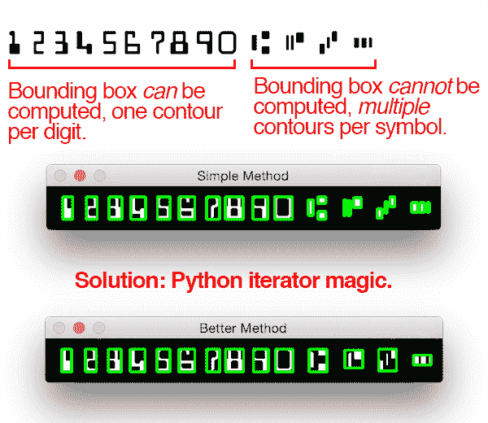
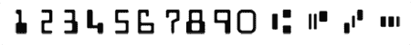
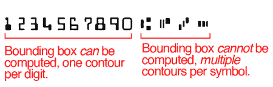
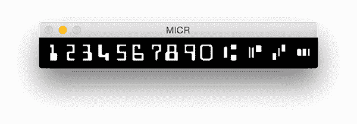
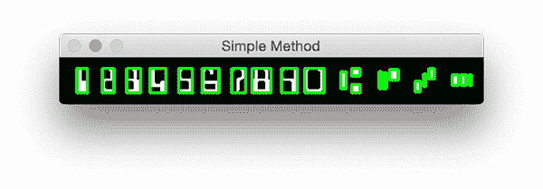
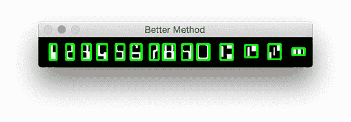

# 用 OpenCV 和 Python 实现银行支票 OCR(上)

> 原文：<https://pyimagesearch.com/2017/07/24/bank-check-ocr-with-opencv-and-python-part-i/>

[](https://pyimagesearch.com/wp-content/uploads/2017/07/micr_bounding_header.png)

今天这篇博文的灵感来自于李伟，一位 PyImageSearch 的读者，他上周给我发了一封电子邮件，问我:

> 嗨阿德里安，
> 
> 感谢你的 PyImageSearch 博客。我每周都读它，并期待你每周一的新帖子。我真的很喜欢上周的[信用卡 OCR](https://pyimagesearch.com/2017/07/17/credit-card-ocr-with-opencv-and-python/) 教程。
> 
> 我在想:同样的技术可以用于银行支票 OCR 吗？
> 
> 我正在做一个项目，需要我从支票图像中 OCR 银行账户和路由号码，但我正在努力提取数字/符号。你能写一篇关于这个的博文吗？
> 
> 谢谢你。

很棒的问题，李伟，谢谢提问。

简短的回答是 ***是的*** ，您可以使用我们用于信用卡 OCR 的相同模板匹配技术，并将其应用于银行支票 OCR…

但是有一个条件。

正如李伟发现的那样，从支票中提取银行代号、账号数字和符号的**要难得多。**

 **原因是因为银行支票使用特殊的字体，其中一个特定的符号*由多个部分*组成——这意味着我们需要设计一种方法，可以*自动*计算这些符号的边界框并提取它们，就像这篇文章顶部的图像一样。

**要开始用 OpenCV 和 Python 构建自己的银行支票 OCR 系统，*继续阅读*。**

## 用 OpenCV 和 Python 实现银行支票 OCR(上)

由于用 OpenCV 和 Python 对银行支票进行 OCR 比对信用卡进行 OCR 要复杂得多，我决定将本指南分成两部分(仅仅一篇文章就太长了)。

在第一部分(今天的博文)，我们将讨论两个话题:

1.  首先，我们将了解 MICR E-13B 字体，这种字体被美国、英国、加拿大和其他国家用于支票识别。
2.  其次，我们将讨论如何从 MICR E-13B 参考图像中提取数字和符号。这将使我们能够提取每个字符的 ROI，然后用它们来 OCR 银行支票。我们将使用 OpenCV contours 和一点 Python 迭代器“魔力”来完成这个任务。

下周，在本系列的第二部分，我将回顾我们如何使用我们的参考 ROI 和模板匹配来实际识别这些提取的符号和数字。

### MICR E-13B 字体

[](https://pyimagesearch.com/wp-content/uploads/2017/07/micr_chars.png)

**Figure 1:** The MICR E-13B font, commonly used for bank check recognition. We’ll be OCR’ing this bank check font using Python and OpenCV

MICR(磁性墨水字符识别)是一种用于处理文档的金融行业技术。你经常会在帐户报表和支票的底部找到这种 E-13B 格式的磁性墨水。

MICR 的 E-13B 变体包含 14 个字符:

*   数字:数字 0-9
*   ⑆公交:银行分行分隔符
*   ⑇金额:事务处理金额分隔符
*   美国⑈:客户帐号分隔符
*   ⑉破折号:数字分隔符(例如，在路由和帐号之间)

对于上面显示的四个符号，我们稍后将利用每个符号仅包含三个轮廓的事实。

既然我们已经了解了 MICR E-13B 检查字体，让我们在深入研究代码之前做一些考虑。

### 银行支票字符识别比看起来要难

[](https://pyimagesearch.com/wp-content/uploads/2017/07/micr_bounding_box_issue.png)

**Figure 2:** Extracting digits and symbols from a bank check isn’t as simple as computing contours and extracting them as some symbols consist of *multiple* parts.

在我们之前的帖子[信用卡 OCR 帖子](https://pyimagesearch.com/2017/07/17/credit-card-ocr-with-opencv-and-python/)中，我们有一个更简单的任务，为每个数字计算单一轮廓的边界框。

然而，MICR E-13B 的情况并非如此。

在银行支票上使用的 MICR E-13B 字体中，每个数字仍然有一个轮廓。

然而，控制符号对于每个角色有三个轮廓，使得任务稍微更具挑战性。

我们不能使用简单的轮廓和包围盒方法。相反，我们需要设计自己的方法来可靠地提取数字和符号。

在下一节中，我们将逐步完成这些步骤。

### 用 OpenCV 提取 MICR 数字和符号

考虑到与提取银行支票字符相关的挑战，似乎我们已经完成了我们的工作。

让我们开始解决这个问题，打开一个新文件，命名为`bank_check_ocr.py`，并插入以下代码:

```py
# import the necessary packages
from skimage.segmentation import clear_border
from imutils import contours
import numpy as np
import argparse
import imutils
import cv2

```

2-7 号线处理我们的进口包裹。确保您的环境中安装了以下软件:

*   OpenCV:从[页面](https://pyimagesearch.com/opencv-tutorials-resources-guides/)中选择适合您系统的安装指南。
*   `scikit-image`:可通过`pip install -U scikit-image`进行 pip 安装。
*   `numpy`:通过`pip install numpy`安装
*   `imutils`:可通过`pip install --upgrade imutils`进行 pip 安装。我经常给 [imutils](https://pyimagesearch.com/2015/02/02/just-open-sourced-personal-imutils-package-series-opencv-convenience-functions/) 添加功能，所以如果你已经有了一个副本，这将是一个用显示的`--upgrade`标志更新它的好时机。

***提示:[https://pyimagesearch.com/tag/install](https://pyimagesearch.com/tag/install)你可以通过查看与我的博客相关的“安装”标签找到安装教程。***

既然我们已经导入了相关的包(并在需要时安装了它们)，让我们构建一个从 MICR 字体中提取字符的函数:

```py
def extract_digits_and_symbols(image, charCnts, minW=5, minH=15):
	# grab the internal Python iterator for the list of character
	# contours, then  initialize the character ROI and location
	# lists, respectively
	charIter = charCnts.__iter__()
	rois = []
	locs = []

```

**第 9 行**开始一个提取 MICR 数字和符号的函数(这个函数会很长)。这个函数被分解成五个容易理解的部分，我们将在本节的剩余部分回顾它们。

首先，我们的函数有 4 个参数:

*   `image`:MICR E-13B 字体图像(在代码下载中提供)。
*   `charCnts`:包含参考图像中人物轮廓的列表(我们将在后面的帖子中解释如何获取这些章节)。
*   `minW`:可选参数，表示最小字符宽度。这有助于我们解释当我们遇到 2 或 3 个小轮廓时，它们一起构成了一个 MICR 人物。默认值是 5 个像素的宽度。
*   `minH`:最小字符高度。该参数是可选的，默认值为 15 像素。用法理性同`minW`。

在第 13 行的**上，我们为我们的`charCnts`列表初始化了一个[迭代器](https://docs.python.org/3/tutorial/classes.html#iterators)。列表对象本质上是“可迭代的”，这意味着可用的`__iter__`和`__next__`方法是由生成器生成的。**

***注意:**由于我们对列表迭代器没有任何特殊要求(除了典型的从左到右遍历)，我们使用内置在标准 Python 列表中的迭代器。如果我们有特殊的需求，我们可以创建一个特殊的类和一个定制的生成器+迭代器。不幸的是，Python 迭代器没有像 Java 等语言中那样的“hasNext”方法——相反，当 iterable 对象中没有更多的项时，Python 会抛出一个异常。我们用这个函数中的 try-catch 块来解释这个异常。*

**第 14 行和第 15 行**初始化空列表来保存我们的`rois`(感兴趣区域)，和`locs` (ROI 位置)。我们将在函数末尾的元组中返回这些列表。

让我们开始循环，看看迭代器是如何工作的:

```py
	# keep looping over the character contours until we reach the end
	# of the list
	while True:
		try:
			# grab the next character contour from the list, compute
			# its bounding box, and initialize the ROI
			c = next(charIter)
			(cX, cY, cW, cH) = cv2.boundingRect(c)
			roi = None

```

在我们的函数中，我们在**第 19 行**开始一个无限循环——我们的退出条件将是循环体的一部分(当我们捕获到一个`StopIterator`异常时)。为了捕捉这个异常，我们需要在第 20 行的**上打开一个 try-catch 块。**

对于循环的每次迭代，我们通过简单地调用`next(charIter)` ( **第 23 行**)来获取`next`角色轮廓。

让我们在第 24 行的**上计算轮廓`c`周围的外接矩形。从这个函数调用中，我们可以提取出 *(x，y)*——矩形的坐标和宽度/高度。**

我们在第 25 行的**上初始化一个`roi`，稍后我们将在其中存储角色图像。**

接下来，我们将检查边界框的宽度和高度，并采取相应的措施:

```py
			# check to see if the width and height are sufficiently
			# large, indicating that we have found a digit
			if cW >= minW and cH >= minH:
				# extract the ROI
				roi = image[cY:cY + cH, cX:cX + cW]
				rois.append(roi)
				locs.append((cX, cY, cX + cW, cY + cH))

```

如果字符计数器的尺寸分别大于或等于最小宽度和高度(**第 29 行**)，我们采取以下措施:

1.  使用我们的边界矩形调用中的坐标和宽度/高度从图像中提取出`roi`(**第 31 行**)。
2.  将`roi`追加到`rois` ( **第 32 行**)。
3.  将一个元组追加到`locs` ( **第 33 行**)。这个元组由矩形两个角的 *(x，y)* 坐标组成。我们稍后将返回这个位置列表。

否则，我们假设我们正在使用 MICR E-13B 字符符号，并需要应用一组更高级的处理操作:

```py
			# otherwise, we are examining one of the special symbols
			else:
				# MICR symbols include three separate parts, so we
				# need to grab the next two parts from our iterator,
				# followed by initializing the bounding box
				# coordinates for the symbol
				parts = [c, next(charIter), next(charIter)]
				(sXA, sYA, sXB, sYB) = (np.inf, np.inf, -np.inf,
					-np.inf)

				# loop over the parts
				for p in parts:
					# compute the bounding box for the part, then
					# update our bookkeeping variables
					(pX, pY, pW, pH) = cv2.boundingRect(p)
					sXA = min(sXA, pX)
					sYA = min(sYA, pY)
					sXB = max(sXB, pX + pW)
					sYB = max(sYB, pY + pH)

				# extract the ROI
				roi = image[sYA:sYB, sXA:sXB]
				rois.append(roi)
				locs.append((sXA, sYA, sXB, sYB))

```

if-else 的`else`块具有分析特殊符号的逻辑，这些特殊符号包含在 MICR E-13B 字体中发现的多个轮廓。我们做的第一件事是在第 41 行的**上建立符号的`parts`。列表`parts`包含三个轮廓:(1)我们已经在**行 23** 上抓取的轮廓，(2)下一个轮廓，以及(3)下一个轮廓。这就是迭代器的工作方式— *每次我们调用 next 时，都会得到后续的项目*。**

正如我们需要知道一个有*一个*轮廓的角色的边界框，我们需要知道一个有*三个*轮廓的角色的边界框。为此，初始化四个边界框参数，`sXA`到`sYB` ( **第 42 行和第 43 行**)。

现在我们将遍历列表`parts`，它理想地表示一个字符/符号。**第 46 行**开始这个循环，首先我们计算第 49 行上第一个项目`p`的外接矩形。

使用边界矩形参数，我们比较并计算相对于先前值的最小值和最大值(**第 50-53 行**)。这就是我们首先将`sXA`到`sYB`初始化为正/负无穷大值的原因——为了代码的简洁性和可读性，这是一种方便的方法。

现在我们已经找到了围绕符号的方框的坐标，让我们从图像中提取出`roi`，将`roi`附加到`rois`，并将方框坐标元组附加到`locs` ( **第 56-58 行**)。

函数的剩余代码块处理 while 循环退出条件和返回语句。

```py
		# we have reached the end of the iterator; gracefully break
		# from the loop
		except StopIteration:
			break

	# return a tuple of the ROIs and locations
	return (rois, locs)

```

如果在`charIter`(我们的迭代器对象)上调用`next`抛出了一个`StopIteration`异常，那么我们已经到达了最后一个轮廓，并试图抓取一个不存在的轮廓。在这种情况下，我们`break`退出了我们的循环。该逻辑显示在**行 62 和 63** 上。

最后，我们在第 66 行的**上返回一个方便的元组中的`rois`和`locs`。**

现在，我们已经准备好解析命令行参数，并继续执行脚本:

```py
# construct the argument parse and parse the arguments
ap = argparse.ArgumentParser()
ap.add_argument("-i", "--image", required=True,
	help="path to input image")
ap.add_argument("-r", "--reference", required=True,
	help="path to reference MICR E-13B font")
args = vars(ap.parse_args())

```

在第 69-74 行上，我们建立了两个必需的命令行参数:

*   `--image`:我们的查询图片。我们不会使用这个论点，直到*下周的帖子*。
*   `--reference`:我们参考 MICR E-13B 字体图片。

接下来，我们将为每个符号/字符创建“名称”,并将它们存储在一个列表中。

```py
# initialize the list of reference character names, in the same
# order as they appear in the reference image where the digits
# their names and:
# T = Transit (delimit bank branch routing transit #)
# U = On-us (delimit customer account number)
# A = Amount (delimit transaction amount)
# D = Dash (delimit parts of numbers, such as routing or account)
charNames = ["1", "2", "3", "4", "5", "6", "7", "8", "9", "0",
	"T", "U", "A", "D"]

```

上面的代码块相当简单——我们只是为我们在参考图像中从左到右遇到的符号建立名称。这些`charNames`以列表形式在**行 83 和 84** 中指定。

***注:*** *由于 OpenCV 不支持 unicode 中的绘图字符，我们需要定义“T”为 transit，“U”为 on-us，“A”为 amount，“D”为 dash。* 

接下来，我们将把参考图像加载到内存中，并执行一些预处理:

```py
# load the reference MICR image from disk, convert it to grayscale,
# and threshold it, such that the digits appear as *white* on a
# *black* background
ref = cv2.imread(args["reference"])
ref = cv2.cvtColor(ref, cv2.COLOR_BGR2GRAY)
ref = imutils.resize(ref, width=400)
ref = cv2.threshold(ref, 0, 255, cv2.THRESH_BINARY_INV |
	cv2.THRESH_OTSU)[1]

```

在上面的模块中，我们完成了四项任务:

1.  将`--reference`图像作为`ref` ( **第 89 行**)载入内存。
2.  转换为灰度(**第 90 行**)。
3.  调整到`width=400` ( **行 91** )。
4.  使用 Otsu 方法的二进制逆阈值(**第 92-93 行**)。

这些简单操作的结果可以在**图 3** 中看到:

[](https://pyimagesearch.com/wp-content/uploads/2017/07/micr_reference.png)

**Figure 3:** Thresholding our MICR E-13B image to reveal the individual characters and symbols.

这段代码的其余部分是被分解成两部分的**。首先，我将向您展示一个逻辑和简单的轮廓方法以及生成的图像。然后，我们将转移到一个更高级的方法，该方法利用了我们在脚本顶部编写的函数— `extract_digits_and_symbols`。**

 **对于这两个部分，我们将使用一些共同的数据，包括`ref`(我们刚刚预处理的参考图像)和`refCnts`(我们即将提取的参考轮廓)。

```py
# find contours in the MICR image (i.e,. the outlines of the
# characters) and sort them from left to right
refCnts = cv2.findContours(ref.copy(), cv2.RETR_EXTERNAL,
	cv2.CHAIN_APPROX_SIMPLE)
refCnts = imutils.grab_contours(refCnts)
refCnts = contours.sort_contours(refCnts, method="left-to-right")[0]

# create a clone of the original image so we can draw on it
clone = np.dstack([ref.copy()] * 3)

# loop over the (sorted) contours
for c in refCnts:
	# compute the bounding box of the contour and draw it on our
	# image
	(x, y, w, h) = cv2.boundingRect(c)
	cv2.rectangle(clone, (x, y), (x + w, y + h), (0, 255, 0), 2)

# show the output of applying the simple contour method
cv2.imshow("Simple Method", clone)
cv2.waitKey(0)

```

为了从参考图像中提取轮廓，我们使用 OpenCV 的`cv2.findContours`函数(**第 97 行和第 98 行**)。

***注:** OpenCV 2.4，3，4 [返回轮廓的方式不同](https://pyimagesearch.com/2015/08/10/checking-your-opencv-version-using-python/)，所以 **Line 99** 有一定的逻辑来说明这一点。*

接下来，我们在**行 100** 上从左到右对轮廓进行排序。

我们将在图像上进行绘制，因此我们将所有通道复制到第 103 行的一个名为`clone`的图像上。

在显示结果之前，简单轮廓方法的最后一步是在排序后的轮廓上循环(**行 106** )。在这个循环中，我们计算每个轮廓的边界框(**线 109** ，然后在它周围画一个矩形(**线 110** )。

通过显示图像(**行 113** )并在此暂停直到按下一个键(**行 114** )来显示结果—参见**图 4** :

[](https://pyimagesearch.com/wp-content/uploads/2017/07/micr_simple_method.png)

**Figure 4:** The naïve method of extracting bank check symbols with OpenCV can extract digits, but fails to correctly compute the bounding box for each of the control symbols.

你看到这种方法的问题了吗？问题是我们有 *22 个边界框*，而不是想要的 *14 个边界轮廓*(每个角色一个)。显然，这个问题可以用更先进的方法来解决。

更高级的方法如下所示:

```py
# extract the digits and symbols from the list of contours, then
# initialize a dictionary to map the character name to the ROI
(refROIs, refLocs) = extract_digits_and_symbols(ref, refCnts,
	minW=10, minH=20)
chars = {}

# re-initialize the clone image so we can draw on it again
clone = np.dstack([ref.copy()] * 3)

# loop over the reference ROIs and locations
for (name, roi, loc) in zip(charNames, refROIs, refLocs):
	# draw a bounding box surrounding the character on the output
	# image
	(xA, yA, xB, yB) = loc
	cv2.rectangle(clone, (xA, yA), (xB, yB), (0, 255, 0), 2)

	# resize the ROI to a fixed size, then update the characters
	# dictionary, mapping the character name to the ROI
	roi = cv2.resize(roi, (36, 36)) 
	chars[name] = roi

	# display the character ROI to our screen
	cv2.imshow("Char", roi)
	cv2.waitKey(0)

# show the output of our better method
cv2.imshow("Better Method", clone)
cv2.waitKey(0)

```

还记得我们在这个脚本开头写的那个长函数`extract_digits_and_symbols`吗？它现在已经在**118 线和**119 线投入使用。

接下来，我们初始化一个空字典`chars`，它将保存每个符号的`name`和`roi`。

我们按照这个动作，用一个新的`ref`副本覆盖`clone`图像(**第 123 行**)(去掉我们刚刚画的矩形)。

最后，我们循环字符(**第 126 行)**。我们有三个列表，我们可以方便地将它们合并成一个包含三元组的相同长度的列表。这个三元组列表就是我们要循环的。

在 for 循环的主体中，首先我们在我们的`clone`图像上为每个字符画一个矩形(**第 129-130 行**)。

其次，我们将`roi`的大小调整为 36 乘 36 像素(**第 134 行**)，并用`name`和`roi`作为键值对更新我们的`chars`字典。

最后一步(主要用于调试/开发目的)，是在屏幕上显示每个`roi`，直到按下一个键。

产生的“更好的方法”图像显示在屏幕上(**行 142** )，直到按下一个键(**行 143** )，然后结束我们的脚本。

**图 5** 显示了结果:

[](https://pyimagesearch.com/wp-content/uploads/2017/07/micr_better_method.png)

**Figure 5:** By examining contour properties of each character/symbol, we can use Python iterator magic to correctly build the bounding boxes for each bank check control character.

### 数字和符号提取结果

现在我们已经编码了我们的 MICR E-13B 数字和符号提取器，让我们试一试。

一定要使用这篇博文的 ***【下载】*** 部分下载源代码+示例图片。

从那里，执行以下脚本:

```py
$ python bank_check_ocr.py --image example_check.png \
	--reference micr_e13b_reference.png

```

如下面的 GIF 所示，我们已经正确地提取了每个字符:

[](https://pyimagesearch.com/wp-content/uploads/2017/07/micr_extracted_characters.gif)

**Figure 6:** Extracting each individual bank check digit and symbol using OpenCV and Python.

在这个博客系列的第二部分中，我们将学习如何使用 Python 和 OpenCV 对这些银行支票字符进行 OCR。

## 摘要

正如今天的博客文章所展示的，OCR 识别银行支票比 OCR 识别信用卡更困难——这主要是因为银行支票符号由多个部分组成。

我们不能假设我们的参考字体图像中的每个轮廓都映射到一个单独的字符。

相反，我们需要插入额外的逻辑来检查每个轮廓的尺寸，并确定我们正在检查的是数字还是符号。

在我们已经找到一个*符号*的情况下，我们需要抓取接下来的两个轮廓来构建我们的边界框(因为银行支票控制字符由*三个*不同的部分组成)。

现在我们知道了如何从图像中提取银行支票的数字和符号，我们可以继续使用 Python 和 OpenCV 对银行支票进行 OCR。

**要在下一次银行支票 OCR 发布时得到通知，*只需在下面的表格中输入您的电子邮件地址！***

下周见。****