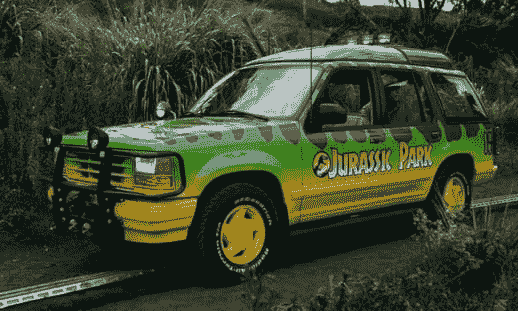
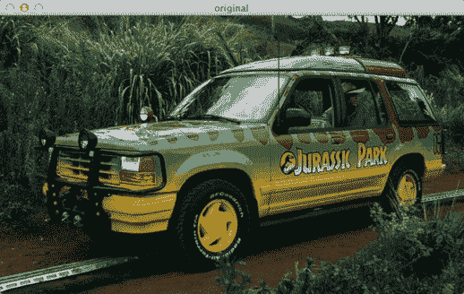
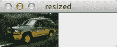
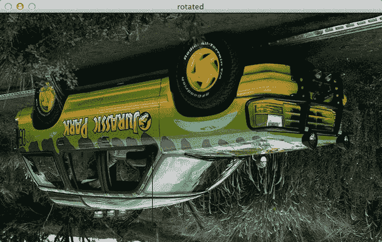
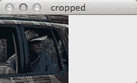
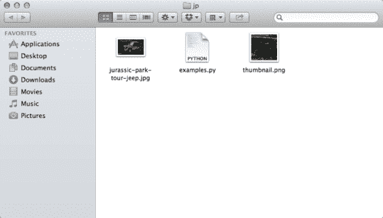

# Python 和 OpenCV 中的基本图像操作:调整大小(缩放)、旋转和裁剪

> 原文：<https://pyimagesearch.com/2014/01/20/basic-image-manipulations-in-python-and-opencv-resizing-scaling-rotating-and-cropping/>

你准备好开始建立你的第一个图像搜索引擎了吗？没那么快！让我们先来看一些基本的图像处理和操作，它们在你的图像搜索引擎之旅中会派上用场。如果你已经是一个图像处理专家，这篇文章对你来说可能会很无聊，但是还是读一读吧——你可能会学到一两个技巧。

**OpenCV 和 Python 版本:**
这个例子将运行在 **Python 2.7** 和 **OpenCV 2.4.X/OpenCV 3.0+** 上。

对于这个基本图像处理的介绍，我假设您已经掌握了如何创建和执行 Python 脚本的基本知识。我还假设您已经安装了 OpenCV。如果你需要帮助安装 OpenCV，请查看 OpenCV 网站上的[快速入门指南](http://opencv.org/quickstart.html)。

继续我对《侏罗纪公园》的痴迷让我们以《侏罗纪公园》吉普车为例来玩玩:

[](https://pyimagesearch.com/wp-content/uploads/2014/01/jurassic-park-tour-jeep.jpg)

**Figure 1:** Our example image — a Jurassic Park Tour Jeep.

继续将此图像下载到您的计算机上。您将需要它来开始使用一些 Python 和 OpenCV 示例代码。

准备好了吗？开始了。

首先，让我们加载图像并显示在屏幕上:

```py
# import the necessary packages
import cv2

# load the image and show it
image = cv2.imread("jurassic-park-tour-jeep.jpg")
cv2.imshow("original", image)
cv2.waitKey(0)

```

在我的电脑上执行这个 Python 代码片段会产生以下结果:

[](https://pyimagesearch.com/wp-content/uploads/2014/01/basic-original.png)

**Figure 2:** Loading and Displaying the Jurassic Park tour jeep.

如您所见，图像现在正在显示。让我们继续分解代码:

*   **第 2 行:**第一行只是告诉 Python 解释器导入 OpenCV 包。
*   **第 5 行:**我们现在正在从磁盘上加载图像。`imread`函数返回一个 NumPy 数组，代表图像本身。
*   **第 6 行和第 7 行:**调用`imshow`在我们的屏幕上显示图像。第一个参数是一个字符串，即我们窗口的“名称”。第二个参数是对我们在第 5 行从磁盘上下载的图像的引用。最后，调用`waitKey`会暂停脚本的执行，直到我们按下键盘上的一个键。使用参数“0”表示任何按键都不会暂停执行。

[](https://pyimagesearch.com/practical-python-opencv/?src=in-post-basic-image-manip)

仅仅加载和显示图像并不有趣。让我们调整这张图片的大小，让它变得更小。我们可以通过使用图像的`shape`属性来检查图像的尺寸，因为图像毕竟是一个 NumPy 数组:

```py
# print the dimensions of the image
print image.shape

```

当执行该代码时，我们看到 *(388，647，3)* 被输出到我们的终端。这意味着图像有 *388* 行、 *647* 列和 *3* 通道(RGB 分量)。当我们写矩阵时，通常是以*(【行数 x 列数】)*的形式写它们，这与用 NumPy 指定矩阵大小的方式相同。

然而，当处理图像时，这可能会变得有点混乱，因为我们通常按照*宽度 x 高度*来指定图像。看着矩阵的形状，我们可能认为我们的图像是 *388* 像素宽和 *647* 像素高。然而，这是不正确的。我们的图像实际上是 *647* 像素宽和 *388* 像素高，这意味着高度是形状中的第*个*条目，宽度是第*个*个条目。如果您刚刚开始使用 OpenCV，这一点可能会有点混乱，记住这一点很重要。

因为我们知道我们的图像是 647 像素宽，让我们调整它的大小，使其宽度为 100 像素:

```py
# we need to keep in mind aspect ratio so the image does
# not look skewed or distorted -- therefore, we calculate
# the ratio of the new image to the old image
r = 100.0 / image.shape[1]
dim = (100, int(image.shape[0] * r))

# perform the actual resizing of the image and show it
resized = cv2.resize(image, dim, interpolation = cv2.INTER_AREA)
cv2.imshow("resized", resized)
cv2.waitKey(0)

```

执行这段代码，我们可以看到新的调整后的图像只有 100 像素宽:

[](https://pyimagesearch.com/wp-content/uploads/2014/01/basic-resized.png)

**Figure 3:** We have now resized the image to 100px wide.

让我们分解代码并检查它:

*   **第 15 行和第 16 行:**我们要记住图像的长宽比，也就是图像的宽度和高度的比例关系。在这种情况下，我们调整图像的大小，使其宽度为 100 像素，因此，我们需要计算新宽度与旧宽度的比率`r`。然后，我们通过使用 100 个像素的宽度和旧图像的高度(T4)来构建图像的新维度。这样做可以让我们保持图像的长宽比。
*   **第 19-21 行:**图像的实际大小调整发生在这里。第一个参数是我们想要调整大小的原始图像，第二个参数是新图像的计算尺寸。第三个参数告诉我们调整大小时使用的算法。现在不要担心那个。最后，我们显示图像并等待按键。

调整图像大小并没有那么糟糕。现在，让我们假设我们是侏罗纪公园电影中的霸王龙——让我们把这辆吉普车倒过来:

```py
# grab the dimensions of the image and calculate the center
# of the image
(h, w) = image.shape[:2]
center = (w / 2, h / 2)

# rotate the image by 180 degrees
M = cv2.getRotationMatrix2D(center, 180, 1.0)
rotated = cv2.warpAffine(image, M, (w, h))
cv2.imshow("rotated", rotated)
cv2.waitKey(0)

```

那么吉普车现在是什么样子？你猜对了——上下颠倒了。

[](https://pyimagesearch.com/wp-content/uploads/2014/01/basic-rotated.png)

**Figure 4:** The jeep has now been flipped upside. We could have also rotated the jeep by any arbitrary angle.

这是我们到目前为止看到的最复杂的例子。让我们来分解一下:

*   **第 25 行:**为了方便起见，我们抓取图像的宽度和高度，并将它们存储在各自的变量中。
*   **第 26 行:**计算图像的中心——我们简单地将宽度和高度除以 2。
*   **第 29 行:**计算一个可用于旋转(和缩放)图像的矩阵。第一个参数是我们计算的图像的中心。如果你想围绕任意点旋转图像，这里就是你要提供那个点的地方。第二个参数是我们的旋转角度(度)。第三个参数是我们的缩放因子，在本例中为 1.0，因为我们希望保持图像的原始比例。如果我们想将图像的大小减半，我们将使用 0.5。类似地，如果我们想将图像的大小加倍，我们将使用 2.0。
*   **第 30 行:**通过提供图像、旋转矩阵和输出尺寸，执行实际的旋转。
*   **第 31-32 行:**显示旋转后的图像。

旋转图像绝对是迄今为止我们做过的最复杂的图像处理技术。

让我们继续裁剪图像，捕捉格兰特的特写:

```py
# crop the image using array slices -- it's a NumPy array
# after all!
cropped = image[70:170, 440:540]
cv2.imshow("cropped", cropped)
cv2.waitKey(0)

```

看看格兰特。他看起来像看到生病的三角龙吗？

[](https://pyimagesearch.com/wp-content/uploads/2014/01/basic-cropped.png)

**Figure 5:** Cropping is simple with Python and OpenCV — we’re just slicing NumPy arrays!

裁剪在 Python 和 OpenCV 中已经死了，就像 Dennis Nedry 一样。我们所做的就是分割数组。我们首先向切片提供 *startY* 和 *endY* 坐标，然后是 *startX* 和 *endX* 坐标。就是这样。我们已经裁剪了图像！

作为最后一个例子，让我们将裁剪后的图像保存到磁盘，只保存为 PNG 格式(原始图像是 JPG):

```py
# write the cropped image to disk in PNG format
cv2.imwrite("thumbnail.png", cropped)

```

我们在这里所做的只是提供文件的路径(第一个参数)，然后是我们想要保存的图像(第二个参数)。就这么简单。

[](https://pyimagesearch.com/wp-content/uploads/2014/01/basic-saved.png)

**Figure 6:** We have now saved ‘thumbnail.png’ to disk.

如您所见，OpenCV 为我们处理了格式的改变。

现在你知道了！Python 和 OpenCV 中的基本图像操作！继续自己玩代码，在你最喜欢的侏罗纪公园图片上试试。