# bat-country:一个可扩展的轻量级 Python 包，用于深度做梦，带有 Caffe 和卷积神经网络

> 原文：<https://pyimagesearch.com/2015/07/06/bat-country-an-extendible-lightweight-python-package-for-deep-dreaming-with-caffe-and-convolutional-neural-networks/>

[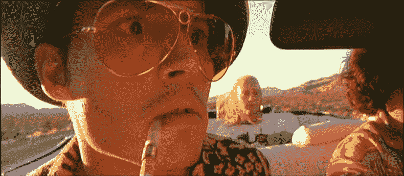](https://pyimagesearch.com/wp-content/uploads/2015/07/batcountry_fal_header_animated.gif)

> 我们不能停在这里，这是蝙蝠国。

就在几天前，[谷歌研究博客发表了一篇文章](http://googleresearch.blogspot.com/2015/06/inceptionism-going-deeper-into-neural.html)，展示了一种独特、有趣、甚至可能令人不安的方法，来可视化卷积神经网络(CNN)各层内部的情况。

***注:**在你走之前，[我建议看看用蝙蝠国](#show_and_tell)生成的图片——大部分出来都很棒，尤其是《侏罗纪公园》的图片。*

他们的方法是将 CNN 颠倒过来，输入一张图像，然后逐渐将图像调整到网络“认为”的特定对象或类别的样子。

至少可以说，结果是惊人的。较低的级别显示图像中类似边缘的区域。中间层能够表示物体的基本形状和组成部分(门把手、眼睛、鼻子等)。).最后，最后一层能够形成完整的解释(狗、猫、树等)。)——*——而且经常是以一种迷幻的、恍惚的方式。*

除了他们的成果，谷歌还发布了一款[优秀的 IPython 笔记本](https://github.com/google/deepdream),让你可以四处玩耍，创造一些你自己的神游图像。

IPython 笔记本确实很棒。玩起来很有趣。因为这是一台 IPython 笔记本，所以入门相当容易。但是我想更进一步。把它做成**模块化**。更多**可定制**。更像一个 Python 模块，它的行为和表现就像一个 Python 模块。当然，它必须是 **pip-installable** (你需要自带 Caffe 安装)。

这就是为什么我把 [bat-country](https://github.com/jrosebr1/bat-country) 放在一起，这是一个易于使用、高度可扩展的轻量级 Python 模块，通过卷积神经网络和 Caffe 实现无概念和深度做梦。

相比之下，我在这里的贡献实在是微不足道。所有真正的研究都是由谷歌完成的——我只是拿着 IPython 笔记本，把它变成一个 Python 模块，同时牢记可扩展性的重要性，*比如自定义步骤函数*。

在我们深入这篇文章的其余部分之前，我想花一点时间提醒大家注意贾斯廷·约翰逊的 [cnn-vis](https://github.com/jcjohnson/cnn-vis) ，这是一个用于生成概念图像的命令行工具。他的工具非常强大，更像谷歌(可能)用于他们自己的研究出版物的工具。如果你正在寻找一个更高级、更完整的包，一定要去看看 cnn-vis。你可能也会对 Vision.ai 的联合创始人托马斯·马利西维茨的 [clouddream](https://github.com/VISIONAI/clouddream) docker 图像感兴趣，以快速启动并运行咖啡馆。

但是与此同时，如果你有兴趣玩一个简单易用的 Python 包，可以去[从 GitHub](https://github.com/jrosebr1/bat-country) 获取源代码或者通过`pip install bat-country`安装它

**这篇博文的其余部分组织如下:**

*   **一个简单的例子。** 3 行代码生成你自己的深梦/无概念图像。
*   **要求。**运行`bat-country`所需的库和包(大部分只是 Caffe 及其相关的依赖项)。
*   **引擎盖下是怎么回事？**对`bat-country`的解剖以及如何扩展它。
*   **展示和讲述。**如果这篇文章有你不想错过的部分， ***就是这个*** 。我收集了一些非常棒的图片，这些图片是我在周末用`bat-country`生成的。至少可以说，结果非常不真实。

# bat-country:一个可扩展的轻量级 Python 包，用于 Caffe 和 CNN 的深度梦想

我想再次说明，蝙蝠国的代码很大程度上是基于 T2 谷歌研究团队的工作。我在这里的贡献主要是将代码重构为一个可用的 Python 包，使这个包可以通过定制的预处理、解处理、阶跃函数等进行扩展。，并确保该包是 pip 可安装的。话虽如此，让我们先来看看蝙蝠国。

## 一个简单的例子。

正如我提到的，简单是`bat-country`的目标之一。假设您已经在系统上安装了 Caffe 和`bat-country`,只需 3 行 Python 代码就可以生成一个深度梦境/幻觉图像:

```py
# we can't stop here...
bc = BatCountry("caffe/models/bvlc_googlenet")
image = bc.dream(np.float32(Image.open("/path/to/image.jpg")))
bc.cleanup()

```

执行完这段代码后，您可以获取由`dream`方法返回的`image`,并将其写入文件:

```py
result = Image.fromarray(np.uint8(image))
result.save("/path/to/output.jpg")

```

就是这样！在 GitHub 这里可以看到`demo.py` [的视图源代码。](https://github.com/jrosebr1/bat-country/blob/master/demo.py)

## 要求。

bat-country 软件包要求在你的系统上已经安装了 Caffe，一个来自伯克利的开源 CNN 实现。本节将详细介绍在您的系统上安装 Caffe 的基本步骤。然而，一个很好的替代方法是使用 Vision.ai 的 Tomasz 提供的 [Docker 图像。使用 Docker 镜像会让你轻松地启动并运行。但是对于那些想要自己安装的人，请继续阅读。](https://github.com/VISIONAI/clouddream)

### 第一步:安装咖啡

看看官方安装说明让 Caffe 开始运行。我建议不要在你自己的系统上安装 Caffe，而是创建一个[Amazon ec2g 2.2x 大型实例](https://pyimagesearch.com/2014/10/13/deep-learning-amazon-ec2-gpu-python-nolearn/)(这样你就可以访问 GPU)并从那里开始工作。

### 步骤 2:为 Caffe 编译 Python 绑定

再次使用来自 T2 咖啡馆的官方安装说明。为来自`requirements.txt`的所有包创建一个单独的虚拟环境是一个好主意，但肯定不是必需的。

这里要做的一个重要步骤是更新您的`$PYTHONPATH`以包含您的 Caffe 安装目录:

```py
export PYTHONPATH=/path/to/caffe/python:$PYTHONPATH

```

在 Ubuntu 上，我也喜欢将这个导出保存在我的`.bashrc`文件中，这样我每次登录或者打开一个新的终端时都会加载它，但这取决于你。

### 步骤 3:可选地安装 cuDNN

Caffe 在 CPU 上开箱即可正常工作。但是如果你真的想让 Caffe 尖叫，你应该使用 GPU。安装 cuDNN 并不是一个太难的过程，但是如果你以前从未做过，请准备好花一些时间来完成这个步骤。

### 步骤 4:设置你的$CAFFE_ROOT

`$CAFFE_ROOT`目录是您的 Caffe 安装的基础目录:

```py
export CAFEE_ROOT=/path/to/caffe

```

下面是我的`$CAFFE_ROOT`的样子:

```py
export CAFFE_ROOT=/home/ubuntu/libraries/caffe

```

同样，我建议把它放在你的`.bashrc`文件中，这样你每次登录时都会加载它。

### 步骤 5:下载预先训练好的 GoogLeNet 模型

你需要一个预先训练好的模型来生成深度梦境图像。让我们继续使用 Google 在其博客文章中使用的 GoogLeNet 模型。Caffe 包提供了一个为您下载模型的脚本:

```py
$ cd $CAFFE_ROOT
$ ./scripts/download_model_binary.py models/bvlc_googlenet/

```

### 步骤 6:安装 bat-country

这个`bat-country`包安装起来非常简单。最简单的方法是使用 pip:

```py
$ pip install bat-country

```

但是如果你想做一些黑客工作，你也可以从 GitHub 下载[源码:](https://github.com/jrosebr1/bat-country)

```py
$ git clone https://github.com/jrosebr1/bat-country.git
$ cd bat-country
... do some hacking ...
$ python setup.py install

```

## 引擎盖下发生了什么——以及如何扩展蝙蝠国

绝大多数的`bat-country`代码来自谷歌的 IPython 笔记本。我的贡献非常小，只是重新分解代码，使其像 Python 模块一样运行和表现——并且便于轻松修改和定制。

要考虑的第一个重要方法是`BatCountry`构造函数，它允许你传入定制的 CNN，比如 GoogLeNet、MIT Places，或者来自 [Caffe Model Zoo](https://github.com/BVLC/caffe/wiki/Model-Zoo) 的其他模型。你所需要做的就是修改`base_path`、`deploy_path`、`model_path`和图像`mean`。`mean`本身将不得不根据原始训练集来计算。更多细节请看一下 [BatCountry 构造函数](https://github.com/jrosebr1/bat-country/blob/master/batcountry/batcountry.py)。

`BatCountry`的内部负责修补模型以计算梯度，以及加载网络本身。

现在，假设您想要覆盖标准梯度上升函数，以最大化给定图层的 L2 范数激活。您需要做的就是向`dream`方法提供您的自定义函数。下面是一个简单的例子，它覆盖了渐变上升函数的默认行为，使用了较小的`step`和较大的`jitter`:

```py
def custom_step(net, step_size=1.25, end="inception_4c/output",
	jitter=48, clip=True):
	src = net.blobs["data"]
	dst = net.blobs[end]

	ox, oy = np.random.randint(-jitter, jitter + 1, 2)
	src.data[0] = np.roll(np.roll(src.data[0], ox, -1), oy, -2)

	net.forward(end=end)
	dst.diff[:] = dst.data
	net.backward(start=end)
	g = src.diff[0]

	src.data[:] += step_size / np.abs(g).mean() * g
	src.data[0] = np.roll(np.roll(src.data[0], -ox, -1), -oy, -2)

	if clip:
		bias = net.transformer.mean["data"]
		src.data[:] = np.clip(src.data, -bias, 255 - bias)

image = bc.dream(np.float32(Image.open("image.jpg")),
	step_fn=custom_step)

```

同样，这只是一个实现自定义步骤函数的演示，并不意味着什么太激动人心的事情。

您还可以通过将自定义的`preprocess_fn`和`deprocess_fn`传递给`dream`来覆盖默认的`preprocess`和`deprocess`函数:

```py
def custom_preprocess(net, img):
	# do something interesting here...
	pass

def custom_deprocess(net, img):
	# do something interesting here...
	pass

image = bc.dream(np.float32(Image.open("image.jpg")),
	preprocess_fn=custom_preocess, deprocess_fn=custom_deprocess)

```

最后，bat-country 还支持可视化网络的每个倍频程、迭代和层:

```py
bc = BatCountry(args.base_model)
(image, visualizations) = bc.dream(np.float32(Image.open(args.image)),
	end=args.layer, visualize=True)
bc.cleanup()

for (k, vis) in visualizations:
	outputPath = "{}/{}.jpg".format(args.vis, k)
	result = Image.fromarray(np.uint8(vis))
	result.save(outputPath)

```

要在 GitHub 上查看完整的`demo_vis.py`脚本，[只需点击这里](https://github.com/jrosebr1/bat-country/blob/master/demo_vis.py)。

## 展示和讲述。

周末，我玩`bat-country`玩得很开心，特别是《T2》中的*恐惧和厌恶、《黑客帝国》中的*和《侏罗纪公园》中的*的图像。我还附上了一些我最喜欢的桌面壁纸和照片，是我最近在美国西部度假时拍的，很好玩。***

对于每个原始图像*(上)*，我分别使用`conv2/3x3`、`inception_3b/5x5_reduce`、`inception_4c/output`图层生成了一个“深梦”。

`conv2/3x3`和`inception_3b/5x5_reduce`层是网络中的较低层，提供更多“类似边缘”的特征。`inception_4c/output`层是产生狗、蜗牛、鸟和鱼幻觉的最终输出。

### 拉斯维加斯的恐惧和厌恶

[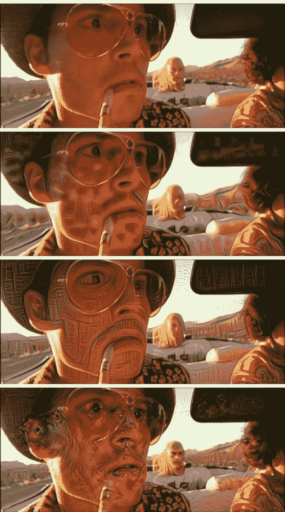](https://pyimagesearch.com/wp-content/uploads/2015/07/output_fal_01.jpg)[](https://pyimagesearch.com/wp-content/uploads/2015/07/output_fal_02.jpg)[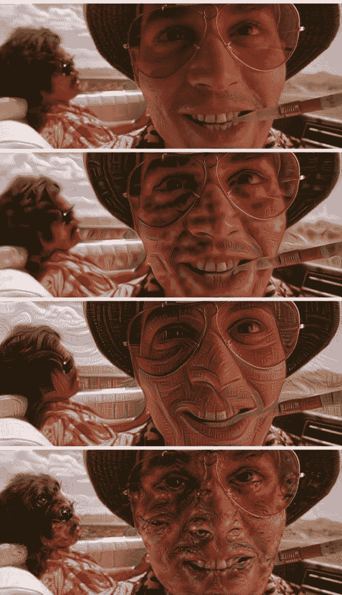](https://pyimagesearch.com/wp-content/uploads/2015/07/output_fal_03.jpg)[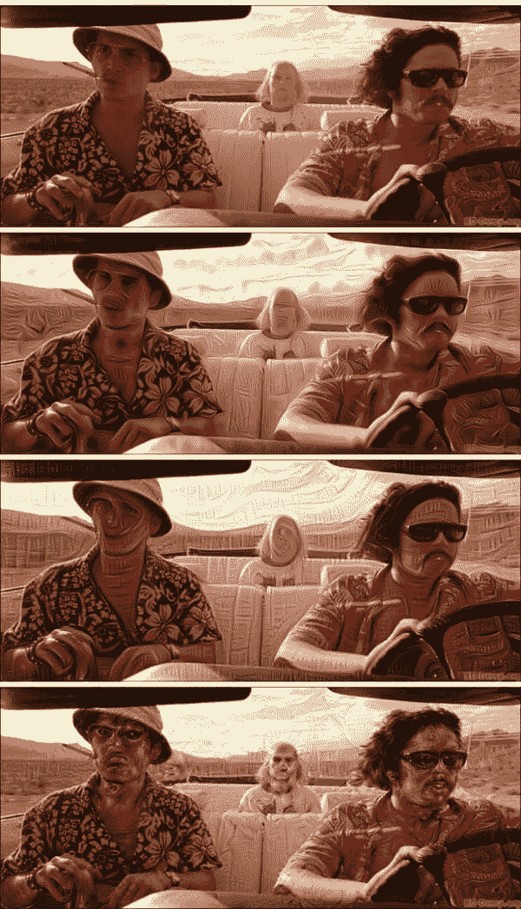](https://pyimagesearch.com/wp-content/uploads/2015/07/output_fal_04.jpg)

### [电影]侏罗纪公园

[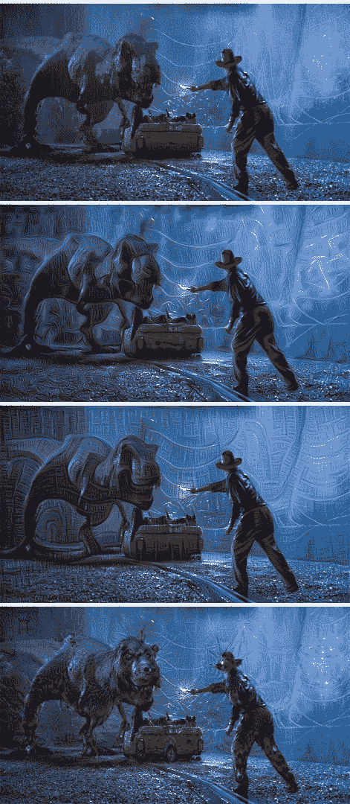](https://pyimagesearch.com/wp-content/uploads/2015/07/output_jp_06.jpg)

**This is DEFINITELY my personal favorite.**

[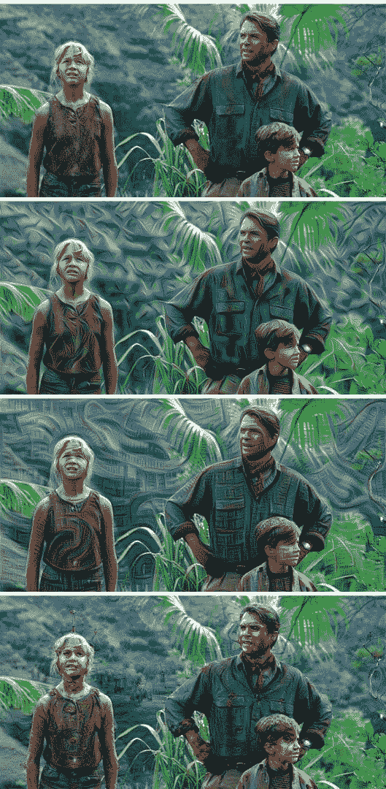](https://pyimagesearch.com/wp-content/uploads/2015/07/output_jp_01.jpg)[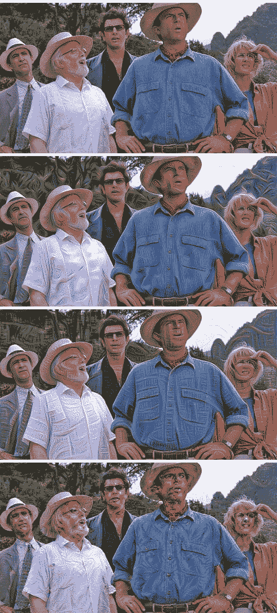](https://pyimagesearch.com/wp-content/uploads/2015/07/output_jp_02.jpg)[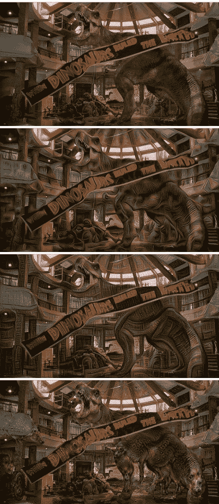](https://pyimagesearch.com/wp-content/uploads/2015/07/output_jp_03.jpg)[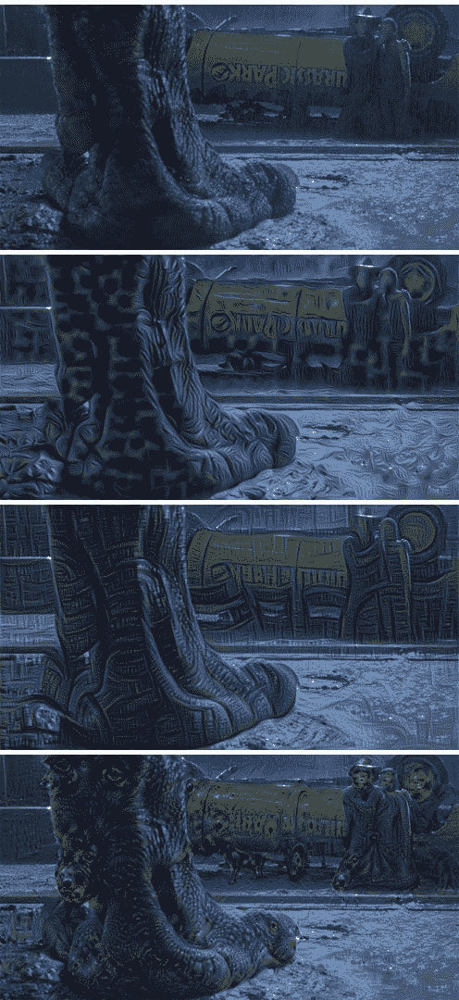](https://pyimagesearch.com/wp-content/uploads/2015/07/output_jp_04.jpg)[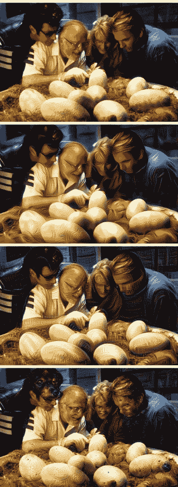](https://pyimagesearch.com/wp-content/uploads/2015/07/output_jp_05.jpg)

### 黑客帝国

[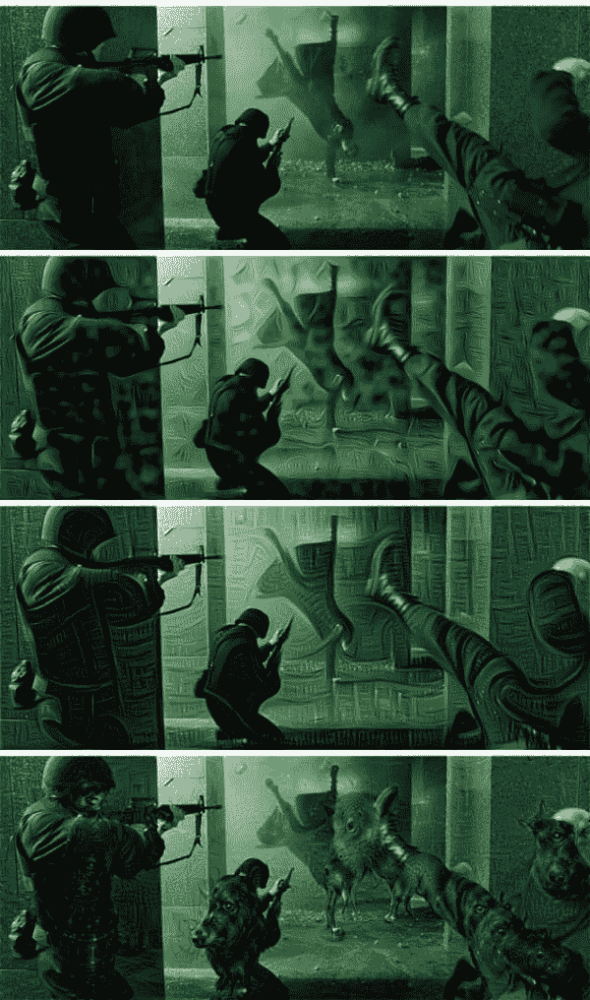](https://pyimagesearch.com/wp-content/uploads/2015/07/output_matrix_01.jpg)

[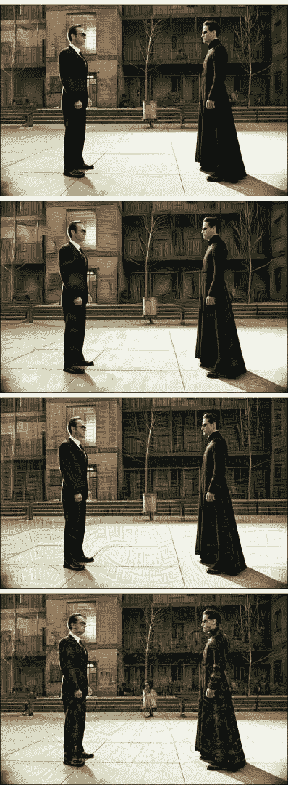](https://pyimagesearch.com/wp-content/uploads/2015/07/output_matrix_02.jpg)[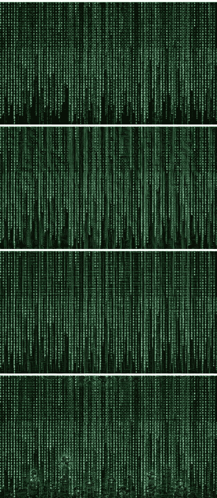](https://pyimagesearch.com/wp-content/uploads/2015/07/output_matrix_03.jpg)[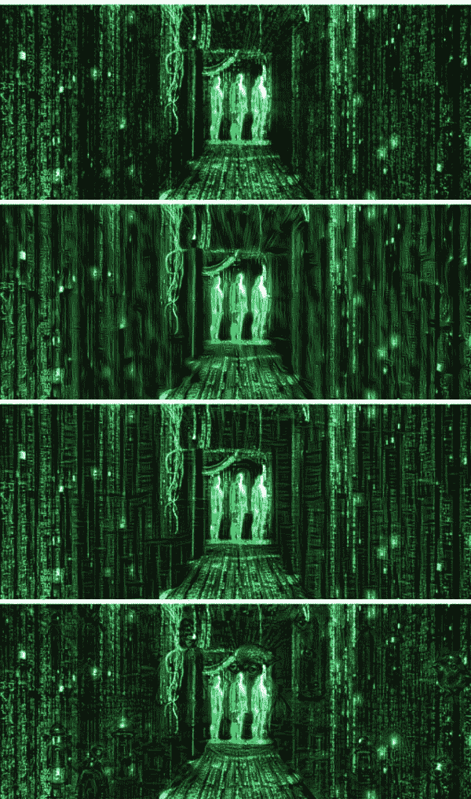](https://pyimagesearch.com/wp-content/uploads/2015/07/output_matrix_04.jpg)

### 羚羊峡谷(亚利桑那州佩奇)

[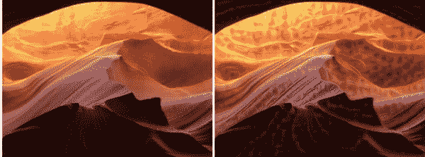](https://pyimagesearch.com/wp-content/uploads/2015/07/antelope_canyon_01.jpg)

[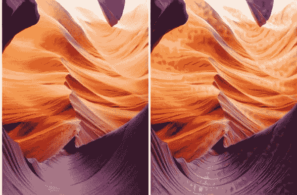](https://pyimagesearch.com/wp-content/uploads/2015/07/antelope_canyon_02.jpg)

### 天使登陆(锡安峡谷；犹他州斯普林代尔)

[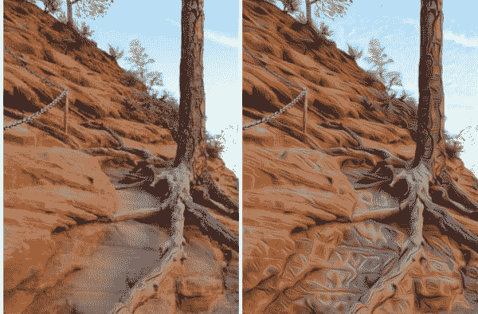](https://pyimagesearch.com/wp-content/uploads/2015/07/angels_landing_01.jpg)

[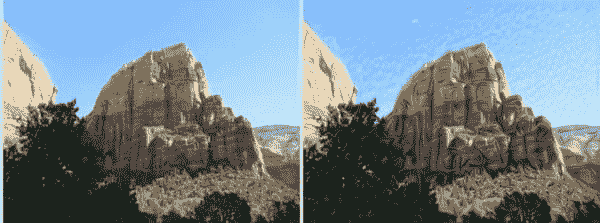](https://pyimagesearch.com/wp-content/uploads/2015/07/angels_landing_02.jpg)

### 动物园(亚利桑那州凤凰城)

[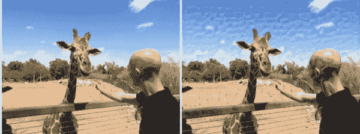](https://pyimagesearch.com/wp-content/uploads/2015/07/giraffe.jpg)

# 摘要

在这篇博文中，我介绍了 [bat-country](https://github.com/jrosebr1/bat-country) ，这是一个易于使用、高度可扩展的轻量级 Python 模块，通过卷积神经网络和 Caffe 实现无概念和深度做梦。

绝大部分代码基于由[谷歌研究博客](http://googleresearch.blogspot.com/2015/06/inceptionism-going-deeper-into-neural.html)发布的 [IPython 笔记本](http://nbviewer.ipython.org/github/google/deepdream/blob/master/dream.ipynb)。我自己的贡献并不太令人兴奋，我只是简单地(1)将代码包装在 Python 类中，(2)使其更容易扩展和定制，以及(3)将其推送到 PyPI，使其可通过 pip 安装。

如果你正在使用 Caffe 寻找一个更强大的深度做梦工具，我真的建议看看贾斯廷·约翰逊的 [cnn-vis](https://github.com/jcjohnson/cnn-vis) 。如果你想快速安装并运行你自己的 Caffe(更不用说，它有一个深度做梦的网络界面)，看看[托马斯的 docker 实例](https://github.com/VISIONAI/clouddream)。

无论如何，我希望你喜欢这个`bat-country`！请随意用你自己用这个包生成的图片来评论这篇文章。