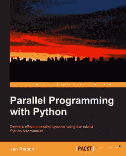
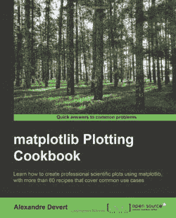
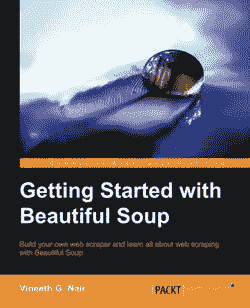
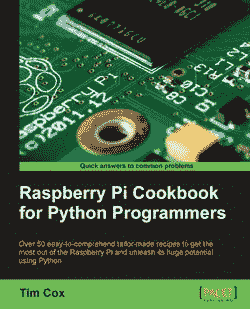
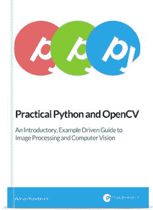

# 2014 年最佳 Python 书籍

> 原文：<https://pyimagesearch.com/2014/05/12/best-python-books-2014/>

更新:2022 年 12 月

距离我们第一次发表这个帖子已经过去很久了。

我们现在有两个 Python 教育产品可供选择。

1.  [计算机视觉与 Python 书籍](https://pyimagesearch.com/deep-learning-computer-vision-python-book/)
2.  全面[Python 程序介绍](https://pyimagesearch.com/intro-python-course/)

2014 年还没过半，但今年已经有一些非常棒的 Python 书籍发布了，它们并没有得到太多关注。

这些书有的与计算机视觉有关，有的与机器学习和统计分析有关，有的与并行计算有关。

虽然不是所有这些书都与构建基于内容的图像检索系统或图像搜索引擎直接相关，但它们在某种程度上是有关联的。

例如，您将如何部署图像搜索引擎？当然，是通过使用 Python web 框架。

你打算如何索引你的图像数据集？我希望你使用并行计算。

一定要花点时间来看看这些书。你不会失望的。

如果你认为我错过了一本特别重要的书，请留言或给我发信息。

# 2014 年最佳 Python 书籍

## #1。[用 Python 进行并行编程](http://www.amazon.com/Parallel-Programming-Python-Jan-Palach/dp/1783288396/ref=sr_1_2?s=books&ie=UTF8&qid=1399473296&sr=1-2&tag=trndingcom-20)

如果你是这个博客的读者，你会知道我喜欢动手操作、容易理解的教程和解决问题的指南。让我们面对现实吧，并行计算在理论和实践层面上都是有意义的。但最大的问题是，你实际上是如何做到的？

这本书回答了你所有的并行计算问题，讨论了管道和队列，使用我最喜欢的 Python 包之一的分布式任务，以及如何执行异步 I/O。

在计算机视觉和图像搜索引擎的背景下，并行计算实际上是必须的。假设我们的任务是从包含数百万张图像的数据集中提取特征。在单核机器上索引这个数据集需要几周甚至几个月的时间。

解决方案是将索引分布到多个进程甚至多台机器上。

为了跨多个进程和机器并行索引图像，您首先需要了解您如何*实际上*做到这一点。

我*高度*推荐这本书，建议你把它加入你的阅读清单。

## #2。 [Matplotlib 绘图食谱](http://www.amazon.com/Matplotlib-Plotting-Cookbook-Alexandre-Devert/dp/1849513260/ref=sr_1_1?s=books&ie=UTF8&qid=1399474196&sr=1-1&tag=trndingcom-20)

回想一下我的[帖子](https://pyimagesearch.com/2014/01/12/my-top-9-favorite-python-libraries-for-building-image-search-engines/ "My Top 9 Favorite Python Libraries for Building Image Search Engines")中最喜欢的 9 个构建图像搜索引擎的 Python 库。

您知道哪个 Python 包成功了吗？

没错。Matplotlib。

当我为我的论文运行实验和收集结果时，matplotlib 总是让绘图变得简单和容易。

无论你是发表研究成果的科研人员、从事项目的大学学生，还是朝九晚五的程序员或开发人员，在你的一生中，你都可能不得不制作一些图表和数字。

虽然 matplotlib 的文档非常棒，但是没有什么比 cookbook 方法更好的了——使用实际的 Python 脚本来解决实际的绘图问题。

看看这本书，让我知道你的想法。

## #3。[美汤入门](http://www.amazon.com/dp/1783289554/?tag=packtpubli-20&tag=trndingcom-20)

在你甚至可以*考虑*建立一个基于内容的图像检索系统或图像搜索引擎之前，有一个*非常重要，绝对关键的*步骤你必须首先采取。

这一步就是收集你的数据集。

有道理，对吧？

如果你没有任何可以搜索的东西，你就不能建立一个图片搜索引擎！

在某些情况下，您的数据集可能已经存在。如果您正在学术界进行研究，并且需要将您的结果与利用公共数据集的其他方法进行比较，这一点尤其正确。

但是在商业、企业和创业方面，情况并不总是这样。

这里有一个来自我个人经历的例子…

当我第一次构建 [Chic Engine](http://www.chicengine.com) 时，我不得不创建一个网络爬虫来抓取与时尚内容相关的网页和图像，如衬衫、鞋子、夹克等。

为了创建这个网络爬虫，我使用了 Beautiful Soup，它使得解析和导航 DOM(文档对象模型)树变得非常简单。

老实说，我花了不到 30 分钟的时间创建了一个爬虫来抓取亚马逊和商店风格的最新时尚发现。谢谢你，漂亮的汤。

一旦我编写了屏幕抓取器，我就利用多线程和多处理方法(类似于上面提到的 Python 中的*并行编程中讨论的)来快速抓取和抓取我的内容。*

在我收集了所有我需要的数据后，我使用(再次)并行方法索引我的数据集。

注意到并行计算的趋势了吗？

没有[美汤](http://www.crummy.com/software/BeautifulSoup/)套餐，这一切都不可能实现。

## #4。 [Flask Web 开发:用 Python 开发 Web 应用](http://www.amazon.com/Flask-Web-Development-Developing-Applications-ebook/dp/B00K00W9LI/ref=zg_bsnr_285856_1&tag=trndingcom-20)

如果它不在网络上，那么它可能不存在。

这不完全是真实的说法，但我想你明白我的感受。

例如，假设你刚刚建立了下一个大的创业公司。

或者更好的是，下一个谷歌图片搜索或 TinEye。

你打算怎么把它弄出去？用户将如何利用你的新技术？

你可能会创建一些网站，甚至是一个 API。

为了做到这一点，您可能需要一个 Python web 框架。

但是你选哪个呢？

当我坚定地站在 Django 阵营的时候，这本关于 T2 烧瓶微观框架的书将会让你立刻把你的新算法部署到网络上。

说到 Django，我*强烈推荐*拿起一本 *[两勺 Django 1.6](http://twoscoopspress.com/products/two-scoops-of-django-1-6)*——Daniel green feld 和 Audrey Roy 出色地完成了这本书的编写工作，是 Django 开发者的必备品。

## #5。[天文学中的统计学、数据挖掘和机器学习:调查数据分析的实用 Python 指南](http://www.amazon.com/Statistics-Mining-Machine-Learning-Astronomy/dp/0691151687/ref=sr_1_1?s=books&ie=UTF8&qid=1399475892&sr=1-1&tag=trndingcom-20)

“大数据”有多大？数据“大”意味着什么？

大数据就像蛋糕一样，只是一个谎言吗？

虽然我们可能对大数据有不同的定义，但有一点是肯定的:天文学家和天体物理学家交互的数据量正在达到*Pb*域。

告诉我，你的算法有多好？

他们能(有效地)处理 1pb 的数据吗？

如果您正在处理大量数据，那么与*统计、数据挖掘和机器学习*相关的 Python 代码和数据集非常值得一看。

## #6。[Python 程序员的树莓派食谱](http://www.amazon.com/Raspberry-Pi-Cookbook-Python-Programmers-ebook/dp/B00JQEJE12/ref=zg_bsnr_285856_20&tag=trndingcom-20)

就我个人而言，我发现当我把手弄脏的时候我学得最好——当我埋头于代码中，而我只是试着踩水的时候。

这就是我如此热衷于编程食谱的原因…

你可以直接跳到实际可行的例子中。你可以破解密码。然后让它再次工作，同时根据您的喜好进行调整。

如果你一直在考虑摆弄树莓派，一定要看看提姆考克斯的这本书。

## #7。[实用 Python 和 OpenCV](https://pyimagesearch.com/practical-python-opencv/)

好吧。我明显有偏见。但是…

如果你曾经对使用 OpenCV 和 Python 学习计算机视觉和图像处理的基础知识感到好奇，那么 ***这本书就是为你准备的*** 。

而且我可以在一个周末 教你基本的 ***。***

我知道，这听起来很疯狂。

参见，*实用 Python 和 OpenCV* 涵盖了计算机视觉和图像处理的基础知识。我已经包含了大量的代码示例，可以让您快速、轻松地上手。

说真的，这是你使用 Python 和 OpenCV 学习计算机视觉和图像处理基础知识的**保证快速入门指南**。不管你是开发人员、程序员还是学生，我都可以在一个周末教你基础知识。

因此，如果你对计算机视觉以及如何让机器看到并解释照片和图像有一点点兴趣，请花一点时间来看看我的书。

不会让人失望的，我保证。

# 摘要

所以你有它！

2014 年最好的 Python 书籍(目前为止)！

今年还没过半，我们已经有了一些惊人的 Python 内容需要消化。老实说，这只是表明 Python 社区是多么的专注和伟大。