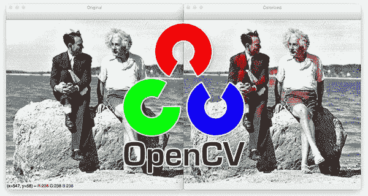
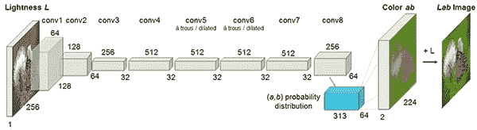
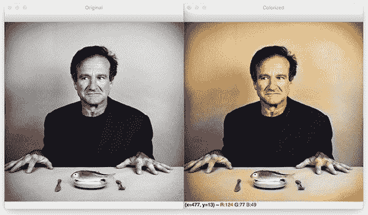
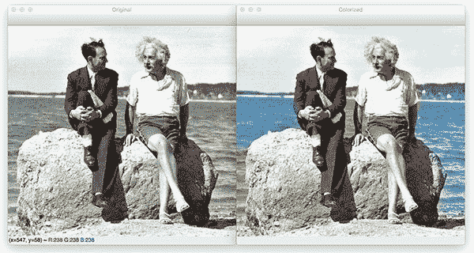
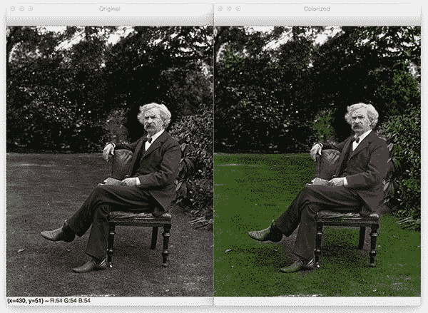
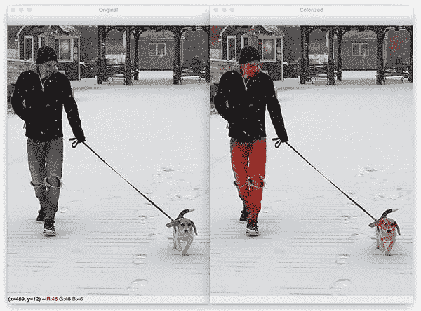

# 基于 OpenCV 和深度学习的黑白图像彩色化

> 原文：<https://pyimagesearch.com/2019/02/25/black-and-white-image-colorization-with-opencv-and-deep-learning/>

[](https://pyimagesearch.com/wp-content/uploads/2019/02/bw_colorization_opencv_header.jpg)

在本教程中，您将学习如何使用 OpenCV、深度学习和 Python 为黑白图像着色。

图像彩色化是获取**输入灰度(黑白)图像**然后生成**输出彩色图像**的过程，该图像表示输入的语义颜色和色调(例如，晴朗的晴天的海洋必须是貌似“蓝色”的——它不能被模型着色为“粉红”)。

以前的图像彩色化方法要么:

1.  依赖于重要的人类互动和注释
2.  产生的去饱和彩色化

相反，我们今天将在这里使用的新方法依赖于深度学习。我们将利用卷积神经网络能够彩色化黑白图像，其结果甚至可以“愚弄”人类！

**要学习如何用 OpenCV 执行黑白图像着色，*继续阅读！***

## 基于 OpenCV 和深度学习的黑白图像彩色化

在本教程的第一部分，我们将讨论如何利用深度学习来给黑白图像着色。

接下来，我们将利用 OpenCV 为两者的黑白图像着色:

1.  形象
2.  视频流

然后，我们将探索我们工作的一些例子和演示。

### 如何用深度学习将黑白图像彩色化？

[](https://pyimagesearch.com/wp-content/uploads/2019/02/bw_colorization_opencv_arch.png)

**Figure 1:** Zhang et al.’s architecture for colorization of black and white images with deep learning.

今天我们要介绍的技术来自张等人 2016 年的论文，[](http://richzhang.github.io/colorization/)*【彩色图像着色】。*

 *以前的黑白图像彩色化方法依赖于*人工注释*，并且经常产生不像真正彩色化那样“可信”的去饱和结果。

张等人决定通过使用卷积神经网络来解决图像彩色化的问题，以“幻觉”输入灰度图像在彩色化时的样子。

为了训练网络，张等人从 [ImageNet 数据集](http://image-net.org/)开始，并将所有图像从 RGB 色彩空间转换到 **Lab 色彩空间。**

类似于 RGB 颜色空间，Lab 颜色空间有三个通道。但是*与*RGB 颜色空间不同，Lab 对颜色信息的编码不同:

*   ***L* 通道**仅对亮度进行编码
*   ***a* 通道**编码绿-红。
*   并且 ***b* 通道**编码蓝黄色

对 Lab 色彩空间的全面回顾超出了本文的范围(参见[本指南](https://en.wikipedia.org/wiki/CIELAB_color_space)了解更多关于 Lab 的信息)，但这里的要点是 Lab 在表现人类如何看待颜色方面做得更好。

由于 *L* 通道只对强度、**进行编码，我们可以使用 *L* 通道作为网络的灰度输入。**

从那里，网络必须**学会预测 *a* 和 *b* 频道。**给定**输入 *L* 通道**和**预测 *ab* 通道**，我们就可以形成我们的**最终输出图像。**

**整个(简化)过程可以概括为:**

1.  将所有训练图像从 RGB 颜色空间转换到 Lab 颜色空间。
2.  将 ***L* 信道**作为网络的输入，训练网络预测 ***ab* 信道。**
3.  将输入的 ***L* 通道**与预测的 ***ab* 通道组合。**
4.  将实验室图像转换回 RGB。

为了产生更合理的黑白图像彩色化，作者还利用了一些额外的技术，包括均值退火和专门的颜色再平衡损失函数(这两者都超出了本文的范围)。

关于图像彩色化算法和深度学习模型的更多细节，[请务必参考张等人的官方出版物](http://richzhang.github.io/colorization/)

### 项目结构

使用本文的 ***“下载”*** 部分下载源代码、模型和示例图片。

解压 zip 文件后，您应该导航到项目目录。

从那里，让我们使用`tree`命令来检查项目结构:

```py
$ tree --dirsfirst
.
├── images
│   ├── adrian_and_janie.png
│   ├── albert_einstein.jpg
│   ├── mark_twain.jpg
│   └── robin_williams.jpg
├── model
│   ├── colorization_deploy_v2.prototxt
│   ├── colorization_release_v2.caffemodel
│   └── pts_in_hull.npy
├── bw2color_image.py
└── bw2color_video.py

2 directories, 9 files

```

在`images/`目录中，我们有四个黑白图像样本。

我们的 Caffe 模型和 prototxt 与 cluster points NumPy 文件一起位于`model/`目录中。

我们今天将复习两个剧本:

*   `bw2color_image.py`
*   `bw2color_video.py`

**图像**脚本可以处理你传入的任何黑白(也称为灰度)图像。

我们的**视频**脚本将使用您的网络摄像头或接受一个输入视频文件，然后执行着色。

### 用 OpenCV 给黑白图像着色

让我们继续用 OpenCV 实现黑白图像着色脚本。

打开`bw2color_image.py`文件并插入以下代码:

```py
# import the necessary packages
import numpy as np
import argparse
import cv2

# construct the argument parser and parse the arguments
ap = argparse.ArgumentParser()
ap.add_argument("-i", "--image", type=str, required=True,
	help="path to input black and white image")
ap.add_argument("-p", "--prototxt", type=str, required=True,
	help="path to Caffe prototxt file")
ap.add_argument("-m", "--model", type=str, required=True,
	help="path to Caffe pre-trained model")
ap.add_argument("-c", "--points", type=str, required=True,
	help="path to cluster center points")
args = vars(ap.parse_args())

```

我们的着色脚本只需要三个导入:NumPy、OpenCV 和`argparse`。

让我们继续，[使用`argparse`解析命令行参数](https://pyimagesearch.com/2018/03/12/python-argparse-command-line-arguments/)。该脚本要求将这四个参数直接从终端传递给脚本:

*   `--image`:输入黑白图像的路径。
*   我们到 Caffe prototxt 文件的路径。
*   `--model`。我们通向 Caffe 预训练模型的道路。
*   `--points`:NumPy 聚类中心点文件的路径。

有了上面的四个标志和相应的参数，脚本将能够在不改变任何代码的情况下运行不同的输入。

让我们继续将我们的模型和聚类中心加载到内存中:

```py
# load our serialized black and white colorizer model and cluster
# center points from disk
print("[INFO] loading model...")
net = cv2.dnn.readNetFromCaffe(args["prototxt"], args["model"])
pts = np.load(args["points"])

# add the cluster centers as 1x1 convolutions to the model
class8 = net.getLayerId("class8_ab")
conv8 = net.getLayerId("conv8_313_rh")
pts = pts.transpose().reshape(2, 313, 1, 1)
net.getLayer(class8).blobs = [pts.astype("float32")]
net.getLayer(conv8).blobs = [np.full([1, 313], 2.606, dtype="float32")]

```

第 21 行直接从命令行参数值加载我们的 Caffe 模型。OpenCV 可以通过`cv2.dnn.readNetFromCaffe`函数读取 Caffe 模型。

**第 22 行**然后直接从命令行参数路径加载聚类中心点到点文件。这个文件是 NumPy 格式的，所以我们使用`np.load`。

从那里，**第 25-29 行** **:**

*   用于再平衡的**负载中心 *ab* 通道**量化。
*   将每个点视为 *1×1* 卷积，并将它们添加到模型中。

现在让我们加载、缩放和转换我们的图像:

```py
# load the input image from disk, scale the pixel intensities to the
# range [0, 1], and then convert the image from the BGR to Lab color
# space
image = cv2.imread(args["image"])
scaled = image.astype("float32") / 255.0
lab = cv2.cvtColor(scaled, cv2.COLOR_BGR2LAB)

```

为了从文件路径加载我们的输入图像，我们在第 34 行的**上使用`cv2.imread`。**

预处理步骤包括:

*   将像素强度缩放到范围*【0，1】*(**第 35 行**)。
*   从 BGR 转换到 Lab 色彩空间(**第 36 行**)。

让我们继续我们的预处理:

```py
# resize the Lab image to 224x224 (the dimensions the colorization
# network accepts), split channels, extract the 'L' channel, and then
# perform mean centering
resized = cv2.resize(lab, (224, 224))
L = cv2.split(resized)[0]
L -= 50

```

接下来，我们将输入图像的尺寸调整为 22 *4×2* 24 ( **Line 41** )，这是网络所需的输入尺寸。

然后我们只抓取`L`通道(即输入)并执行均值减法(**第 42 行和第 43 行**)。

现在我们可以通过网络把**输入 *L* 通道**传给**预测 *ab* 通道:**

```py
# pass the L channel through the network which will *predict* the 'a'
# and 'b' channel values
'print("[INFO] colorizing image...")'
net.setInput(cv2.dnn.blobFromImage(L))
ab = net.forward()[0, :, :, :].transpose((1, 2, 0))

# resize the predicted 'ab' volume to the same dimensions as our
# input image
ab = cv2.resize(ab, (image.shape[1], image.shape[0]))

```

通过网络的`L`通道的前向传递发生在**48 和 49** 线上(如果你需要，这里是对 [OpenCV 的`blobFromImage`](https://pyimagesearch.com/2017/11/06/deep-learning-opencvs-blobfromimage-works/) 的复习)。

注意，在我们调用了`net.forward`之后，在同一行上，我们继续提取预测的`ab`量。我在这里让它看起来很简单，但是如果你想了解更多的细节，请参考[张等人在 GitHub](http://richzhang.github.io/colorization/) 上的文档和演示。

从那里，我们将预测的`ab`体积调整到与输入图像相同的尺寸(**第 53 行**)。

现在是后处理的时候了。请继续听我说，我们实际上是在反向执行之前的一些步骤:

```py
# grab the 'L' channel from the *original* input image (not the
# resized one) and concatenate the original 'L' channel with the
# predicted 'ab' channels
L = cv2.split(lab)[0]
colorized = np.concatenate((L[:, :, np.newaxis], ab), axis=2)

# convert the output image from the Lab color space to RGB, then
# clip any values that fall outside the range [0, 1]
colorized = cv2.cvtColor(colorized, cv2.COLOR_LAB2BGR)
colorized = np.clip(colorized, 0, 1)

# the current colorized image is represented as a floating point
# data type in the range [0, 1] -- let's convert to an unsigned
# 8-bit integer representation in the range [0, 255]
colorized = (255 * colorized).astype("uint8")

# show the original and output colorized images
cv2.imshow("Original", image)
cv2.imshow("Colorized", colorized)
cv2.waitKey(0)

```

后处理包括:

*   从 ***原始*** 输入图像中抓取`L`通道(**行 58** )并将原始`L`通道和 ***预测*** `ab`通道串联在一起形成`colorized` ( **行 59** )。
*   将`colorized`图像从 Lab 色彩空间转换为 RGB ( **第 63 行**)。
*   剪裁任何落在范围*【0，1】*(**行 64** )之外的像素强度。
*   使像素强度回到范围*【0，255】*(**行 69** )。在预处理步骤中(**第 35 行**)，我们除以`255`，现在我们乘以`255`。我还发现这种缩放和`"uint8"`转换并不是必需的，但它有助于代码在 **OpenCV 3.4.x** 和 **4.x** 版本之间工作。

最后，我们的原始`image`和`colorized`图像都显示在屏幕上！

### 图像彩色化结果

现在我们已经实现了我们的图像着色脚本，让我们试一试。

确保你已经使用了这篇博文的 ***【下载】*** 部分来下载源代码、着色模型和示例图像。

从那里，打开一个终端，导航到您下载源代码的位置，并执行以下命令:

```py
$ python bw2color_image.py \
	--prototxt model/colorization_deploy_v2.prototxt \
	--model model/colorization_release_v2.caffemodel \
	--points model/pts_in_hull.npy \
	--image images/robin_williams.jpg
[INFO] loading model...

```

[](https://pyimagesearch.com/wp-content/uploads/2019/02/bw_colorization_opencv_robin_williams.jpg)

**Figure 2:** Grayscale image colorization with OpenCV and deep learning. This is a picture of famous late actor, Robin Williams.

在*左边*可以看到罗宾·威廉姆斯(Robin Williams)的原始输入图像，这位著名的演员和喜剧演员于~5 年前去世。

在*右边*，你可以看到黑白彩色化模型的输出。

让我们试试另一张图片，这是阿尔伯特·爱因斯坦的:

```py
$ python bw2color_image.py \
	--prototxt model/colorization_deploy_v2.prototxt \
	--model model/colorization_release_v2.caffemodel \
	--points model/pts_in_hull.npy \
	--image images/albert_einstein.jpg
[INFO] loading model...

```

[](https://pyimagesearch.com/wp-content/uploads/2019/02/bw_colorization_opencv_albert_einstein.jpg)

**Figure 3:** Image colorization using deep learning and OpenCV. This is an image of Albert Einstein.

这个图像彩色化让我印象特别深刻。

注意，水是一种合适的蓝色，而爱因斯坦的衬衫是白色的，裤子是卡其色的——所有这些都是看似合理的颜色。

这是另一个例子，这是马克·吐温的作品，他是我一直以来最喜欢的作家之一:

```py
$ python bw2color_image.py \
	--prototxt model/colorization_deploy_v2.prototxt \
	--model model/colorization_release_v2.caffemodel \
	--points model/pts_in_hull.npy
	--image images/mark_twain.jpg
[INFO] loading model...

```

[](https://pyimagesearch.com/wp-content/uploads/2019/02/bw_colorization_opencv_mark_twain.jpg)

**Figure 4:** A black/white image of Mark Twain has undergone colorization via OpenCV and deep learning.

在这里，我们可以看到草和树叶被正确地染成了绿色，尽管你可以看到这些绿色融入了吐温的鞋子和手。

最终的图像展示了 OpenCV 不太好的黑白图像彩色化:

```py
$ python bw2color_image.py \
	--prototxt model/colorization_deploy_v2.prototxt \
	--model model/colorization_release_v2.caffemodel \
	--points model/pts_in_hull.npy
	--image images/adrian_and_janie.png
[INFO] loading model...

```

[](https://pyimagesearch.com/wp-content/uploads/2019/02/bw_colorization_opencv_adrian_janie.jpg)

**Figure 5:** Janie is the puppers we recently adopted into our family. This is her first snow day. Black and white cameras/images are great for snow, but I wanted to see how image colorization would turn out with OpenCV and deep learning.

这张照片是几周前的一场暴风雪中，我和我的小猎犬珍妮的合影。

在这里你可以看到，虽然雪，珍妮，我的夹克，甚至背景中的凉亭都是正确的颜色，但我的蓝色牛仔裤实际上是红色的。

并非所有的图像彩色化都是完美的，但是今天的结果确实证明了张等人的方法的合理性。

### 用 OpenCV 实现实时黑白视频彩色化

我们已经看到了如何将黑白图像彩色化应用到图像上——但是我们能对**视频流做同样的事情吗？**

你打赌我们能。

这个脚本遵循与上面相同的过程，除了我们将处理一个视频流的帧。我将更详细地回顾它，并把重点放在帧抓取+处理方面。

打开`bw2color_video.py`并插入以下代码:

```py
# import the necessary packages
from imutils.video import VideoStream
import numpy as np
import argparse
import imutils
import time
import cv2

# construct the argument parser and parse the arguments
ap = argparse.ArgumentParser()
ap.add_argument("-i", "--input", type=str,
	help="path to optional input video (webcam will be used otherwise)")
ap.add_argument("-p", "--prototxt", type=str, required=True,
	help="path to Caffe prototxt file")
ap.add_argument("-m", "--model", type=str, required=True,
	help="path to Caffe pre-trained model")
ap.add_argument("-c", "--points", type=str, required=True,
	help="path to cluster center points")
ap.add_argument("-w", "--width", type=int, default=500,
	help="input width dimension of frame")
args = vars(ap.parse_args())

```

我们的视频脚本需要两个额外的导入:

*   允许我们从网络摄像头或视频文件中抓取帧
*   `time`用于暂停，让网络摄像头预热

现在让我们初始化我们的`VideoStream`:

```py
# initialize a boolean used to indicate if either a webcam or input
# video is being used
webcam = not args.get("input", False)

# if a video path was not supplied, grab a reference to the webcam
if webcam:
	print("[INFO] starting video stream...")
	vs = VideoStream(src=0).start()
	time.sleep(2.0)

# otherwise, grab a reference to the video file
else:
	print("[INFO] opening video file...")
	vs = cv2.VideoCapture(args["input"])

```

根据我们使用的是`webcam`还是视频文件，我们将在这里创建我们的`vs`(即“视频流”)对象。

从那里，我们将加载彩色深度学习模型和聚类中心(与我们在之前的脚本中所做的方式相同):

```py
# load our serialized black and white colorizer model and cluster
# center points from disk
print("[INFO] loading model...")
net = cv2.dnn.readNetFromCaffe(args["prototxt"], args["model"])
pts = np.load(args["points"])

# add the cluster centers as 1x1 convolutions to the model
class8 = net.getLayerId("class8_ab")
conv8 = net.getLayerId("conv8_313_rh")
pts = pts.transpose().reshape(2, 313, 1, 1)
net.getLayer(class8).blobs = [pts.astype("float32")]
net.getLayer(conv8).blobs = [np.full([1, 313], 2.606, dtype="float32")]

```

现在我们将开始对输入帧进行无限循环。我们将在循环中直接处理帧:

```py
# loop over frames from the video stream
while True:
	# grab the next frame and handle if we are reading from either
	# VideoCapture or VideoStream
	frame = vs.read()
	frame = frame if webcam else frame[1]

	# if we are viewing a video and we did not grab a frame then we
	# have reached the end of the video
	if not webcam and frame is None:
		break

	# resize the input frame, scale the pixel intensities to the
	# range [0, 1], and then convert the frame from the BGR to Lab
	# color space
	frame = imutils.resize(frame, width=args["width"])
	scaled = frame.astype("float32") / 255.0
	lab = cv2.cvtColor(scaled, cv2.COLOR_BGR2LAB)

	# resize the Lab frame to 224x224 (the dimensions the colorization
	# network accepts), split channels, extract the 'L' channel, and
	# then perform mean centering
	resized = cv2.resize(lab, (224, 224))
	L = cv2.split(resized)[0]
	L -= 50

```

来自我们`vs`的每一帧在**线 55 和 56** 上被抓取。对一个`None`类型的`frame`进行检查——当这种情况发生时，我们已经到达了一个视频文件的末尾(如果我们正在处理一个视频文件)，我们可以从循环中`break`(**行 60 和 61** )。

预处理(如前)在**行 66-75** 上进行。这是我们调整大小、缩放和转换为实验室的地方。然后我们抓取`L`通道，并执行均值减法。

现在让我们应用深度学习着色并对结果进行后处理:

```py
	# pass the L channel through the network which will *predict* the
	# 'a' and 'b' channel values
	net.setInput(cv2.dnn.blobFromImage(L))
	ab = net.forward()[0, :, :, :].transpose((1, 2, 0))

	# resize the predicted 'ab' volume to the same dimensions as our
	# input frame, then grab the 'L' channel from the *original* input
	# frame (not the resized one) and concatenate the original 'L'
	# channel with the predicted 'ab' channels
	ab = cv2.resize(ab, (frame.shape[1], frame.shape[0]))
	L = cv2.split(lab)[0]
	colorized = np.concatenate((L[:, :, np.newaxis], ab), axis=2)

	# convert the output frame from the Lab color space to RGB, clip
	# any values that fall outside the range [0, 1], and then convert
	# to an 8-bit unsigned integer ([0, 255] range)
	colorized = cv2.cvtColor(colorized, cv2.COLOR_LAB2BGR)
	colorized = np.clip(colorized, 0, 1)
	colorized = (255 * colorized).astype("uint8")

```

我们通过网络对`L`的深度学习正向传递产生了预测的`ab`通道。

然后我们将对来自我们的`colorized`图像的结果进行后处理(**第 86-95 行**)。这是我们调整大小的地方，抓取我们的 ***原始*** `L`，并连接我们预测的`ab`。在那里，我们从 Lab 转换到 RGB、剪辑和缩放。

如果您仔细阅读了上面的内容，您会记得我们接下来要做的就是显示结果:

```py
	# show the original and final colorized frames
	cv2.imshow("Original", frame)
	cv2.imshow("Grayscale", cv2.cvtColor(frame, cv2.COLOR_BGR2GRAY))
	cv2.imshow("Colorized", colorized)
	key = cv2.waitKey(1) & 0xFF

	# if the `q` key was pressed, break from the loop
	if key == ord("q"):
		break

# if we are using a webcam, stop the camera video stream
if webcam:
	vs.stop()

# otherwise, release the video file pointer
else:
	vs.release()

# close any open windows
cv2.destroyAllWindows()

```

我们的原始网络摄像头`frame`与我们的灰度图像和`colorized`结果一起显示。

如果`"q"` `key`被按下，我们将`break`从循环中清除。

这就是全部了！

### 视频彩色化结果

让我们继续，给我们的视频黑白彩色脚本一个尝试。

确保使用本教程的 ***【下载】*** 部分下载源代码和着色模型。

从那里，打开一个终端，并执行以下命令，让彩色运行在您的网络摄像头:

```py
$ python bw2color_video.py \
	--prototxt model/colorization_deploy_v2.prototxt \
	--model model/colorization_release_v2.caffemodel \
	--points model/pts_in_hull.npy

```


**Figure 6:** Black and white image colorization in video with OpenCV and deep learning demo.

如果您想在视频文件上运行着色程序，您可以使用以下命令:

```py
$ python bw2color_video.py \
	--prototxt model/colorization_deploy_v2.prototxt \
	--model model/colorization_release_v2.caffemodel \
	--points model/pts_in_hull.npy
	--input video/jurassic_park_intro.mp4

```

<https://www.youtube.com/embed/r3Mmh_k2F0E?feature=oembed>*