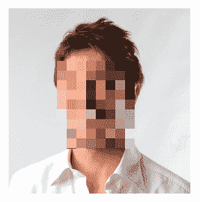
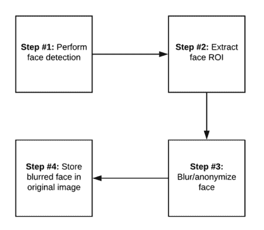
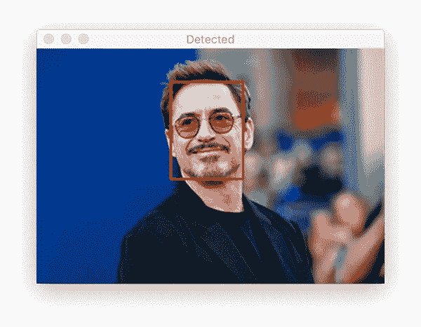
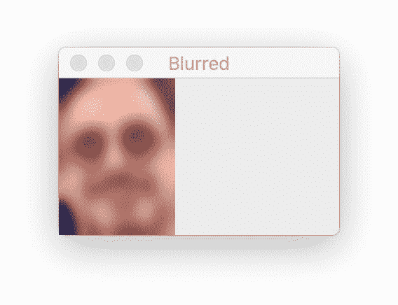
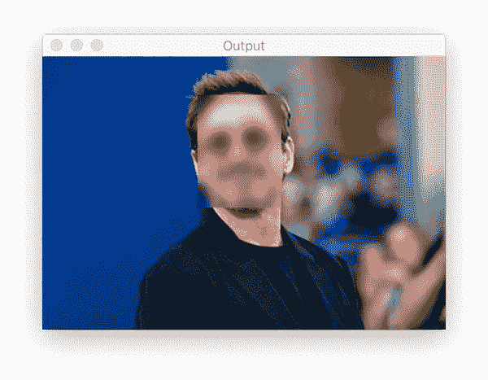
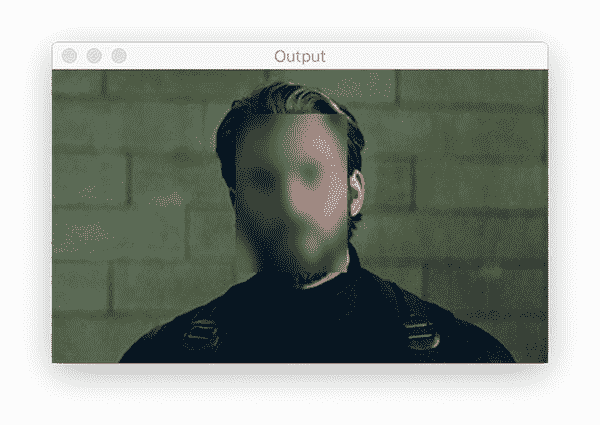
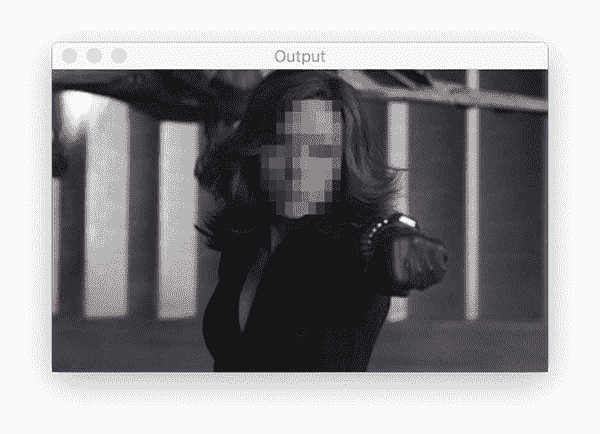
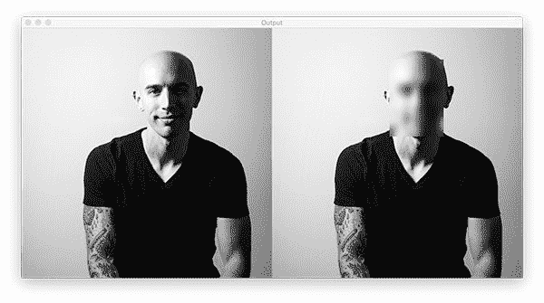

# 使用 OpenCV 和 Python 对人脸进行模糊和匿名处理

> 原文：<https://pyimagesearch.com/2020/04/06/blur-and-anonymize-faces-with-opencv-and-python/>

在本教程中，您将学习如何使用 OpenCV 和 Python 对人脸进行模糊和匿名处理。

今天这篇博文的灵感来自于上周我收到的一封来自 PyImageSearch 读者李伟的邮件:

> 嗨，阿德里安，我正在为我的大学做一个研究项目。
> 
> 我负责创建数据集，但我的教授要求我通过检测面部并模糊它们来“匿名化”每张图像，以确保隐私得到保护，并且没有面部被识别出来(显然这是我们机构在公开分发数据集之前的一项要求)。
> 
> **有没有人脸匿名化的教程？如何使用 OpenCV 模糊人脸？**
> 
> 谢谢，
> 
> 李伟

李提出了一个很好的问题——我们经常在项目中使用人脸检测，通常作为人脸识别流程的第一步。

但是如果我们想做人脸识别的“反面”呢？如果我们想通过模糊化来匿名化人脸，从而使*不可能*识别人脸呢？

面部模糊和匿名化的实际应用包括:

*   公共/私人区域的隐私和身份保护
*   在线保护儿童(例如，在上传的照片中模糊未成年人的面部)
*   新闻摄影和新闻报道(例如，模糊未签署弃权书的人的面孔)
*   数据集监管和分发(例如，匿名化数据集中的个人)
*   *…还有更多！*

**要学习如何用 OpenCV 和 Python 对人脸进行模糊化和匿名化，*继续阅读！***

## 使用 OpenCV 和 Python 对人脸进行模糊和匿名处理

在本教程的第一部分，我们将简要讨论什么是人脸模糊，以及我们如何使用 OpenCV 来匿名化图像和视频流中的人脸。

从那里，我们将讨论用 OpenCV 和 Python 模糊人脸的四步方法。

然后，我们将回顾我们的项目结构，并使用 OpenCV 实现两种面部模糊方法:

1.  使用高斯模糊来匿名化图像和视频流中的人脸
2.  应用“像素化模糊”效果来匿名化图像和视频中的人脸

给定我们的两个实现，我们将创建 Python 驱动程序脚本来将这些面部模糊方法应用于图像和视频。

然后，我们将回顾我们的面部模糊和匿名化方法的结果。

### 什么是人脸虚化，如何用于人脸匿名化？



**Figure 1:** In this tutorial, we will learn how to blur faces with OpenCV and Python, similar to the face in this example ([image source](https://www.facepixelizer.com/)).

**人脸模糊是一种计算机视觉方法，用于匿名化图像和视频中的人脸。**

面部模糊和匿名化的一个例子可以在上面的**图 1** 中看到——注意面部是如何模糊的，人的身份是无法辨认的。

我们使用面部模糊来帮助保护图像中人的身份。

### 执行面部模糊和匿名化的 4 个步骤



**Figure 2:** Face blurring with OpenCV and Python can be broken down into four steps.

使用 OpenCV 和计算机视觉应用面部模糊是一个四步过程。

**步骤#1 是执行面部检测。**



**Figure 3:** The **first step** for face blurring with OpenCV and Python is to detect all faces in an image/video ([image source](https://www.cheatsheet.com/entertainment/robert-downey-jr-is-willing-to-return-to-the-mcu-if-one-of-his-avengers-endgame-co-stars-does-too.html/)).

这里可以使用任何人脸检测器，只要它能够产生图像或视频流中人脸的边界框坐标。

您可以使用的典型人脸检测器包括

*   瀑布式头发
*   猪+线性 SVM
*   基于深度学习的人脸检测器。

有关如何在图像中检测人脸的更多信息，您可以参考本[人脸检测指南](https://pyimagesearch.com/2018/02/26/face-detection-with-opencv-and-deep-learning/)。

一旦检测到人脸，**第 2 步是提取感兴趣区域(ROI):**


**Figure 4:** The **second step** for blurring faces with Python and OpenCV is to extract the face region of interest (ROI).

你的人脸检测器会给你一个边界框 *(x，y)*——一张人脸在图像中的坐标。

这些坐标通常代表:

*   面部包围盒的起始 *x-* 捐赠
*   面的终点 *x-* 坐标
*   面部位置的起始 *y-*
*   终点 *y* 面的坐标

然后，您可以使用这些信息来提取面部 ROI 本身，如上面的**图 4** 所示。

给定面部 ROI，**步骤#3 实际上是模糊/匿名面部:**



**Figure 5:** The **third step** for our face blurring method using OpenCV is to apply your blurring algorithm. In this tutorial, we learn two such blurring algorithms — Gaussian blur and pixelation.

通常，您将应用高斯模糊来匿名化面部。如果你发现最终的结果更加美观，你也可以应用一些方法来像素化这张脸。

具体如何“模糊”图像由你决定——重要的是面部被匿名化了。

在脸部模糊和匿名的情况下，**步骤#4 是将模糊的脸部存储回原始图像:**



**Figure 6:** The **fourth and final step** for face blurring with Python and OpenCV is to replace the original face ROI with the blurred face ROI.

使用来自面部检测(即步骤#2)的原始 *(x，y)*-坐标，我们可以获取模糊/匿名的面部，然后将其存储回原始图像中(如果您使用 OpenCV 和 Python，此步骤使用 NumPy 数组切片来执行)。

原始图像中的人脸已经被模糊化和匿名化——此时，人脸匿名化管道已经完成。

在本教程的剩余部分，让我们看看如何用 OpenCV 实现面部模糊和匿名化。

### 如何安装 OpenCV 进行人脸虚化

按照我的面部模糊教程，你需要在你的系统上安装 OpenCV。我推荐使用我的教程之一安装 OpenCV 4:

*   [*pip 安装 opencv*](https://pyimagesearch.com/2018/09/19/pip-install-opencv/) —最简单快捷的方法
*   [*如何在 Ubuntu 上安装 OpenCV 4*](https://pyimagesearch.com/2018/08/15/how-to-install-opencv-4-on-ubuntu/)
*   [*在 macOS 上安装 OpenCV 4*](https://pyimagesearch.com/2018/08/17/install-opencv-4-on-macos/)

我向 99%的读者推荐 pip 安装方法——这也是我通常安装 OpenCV 用于面部模糊等快速项目的方法。

如果您认为您可能需要完整安装 OpenCV 和专利算法，您应该根据您的操作系统考虑第二个或第三个要点。这两个指南都需要从源代码编译，这也需要相当长的时间，但是可以(1)给你完整的 OpenCV 安装和(2)允许你为你的操作系统和系统架构优化 OpenCV。

一旦安装了 OpenCV，您就可以继续学习本教程的其余部分。

***注意:**我不支持 PyImageSearch 的 Windows 操作系统。见我的 [FAQ 页面](https://pyimagesearch.com/faqs/single-faq/can-you-help-me-do-___-on-windows/)。*

### 项目结构

继续使用本教程的 ***“下载”*** 部分下载源代码、示例图像和预训练的人脸检测器模型。从那里，让我们检查内容:

```py
$ tree --dirsfirst
.
├── examples
│   ├── adrian.jpg
│   ├── chris_evans.png
│   ├── robert_downey_jr.png
│   ├── scarlett_johansson.png
│   └── tom_king.jpg
├── face_detector
│   ├── deploy.prototxt
│   └── res10_300x300_ssd_iter_140000.caffemodel
├── pyimagesearch
│   ├── __init__.py
│   └── face_blurring.py
├── blur_face.py
└── blur_face_video.py

3 directories, 11 files
```

面部模糊第一步是执行面部检测以定位图像/帧中的面部。我们将使用基于深度学习的 Caffe 模型，如`face_detector/`目录中所示。

我们的两个 Python 驱动脚本，`blur_face.py`和`blur_face_video.py`，首先检测人脸，然后在图像和视频流中执行人脸模糊。我们将逐步介绍这两个脚本，以便您可以将它们用于自己的项目。

首先，我们将回顾一下`face_blurring.py`文件中的面部模糊辅助函数。

### 使用高斯模糊和 OpenCV 模糊面部



**Figure 7:** Gaussian face blurring with OpenCV and Python ([image source](https://www.denofgeek.com/movies/avengers-4-chris-evans-confirms-hes-done-with-captain-america/)).

我们将实现两个辅助函数来帮助我们实现面部模糊和匿名:

*   `anonymize_face_simple`:在脸部 ROI 上执行简单的高斯模糊(如上面的**图 7**
*   创建一个像素化的模糊效果(我们将在下一节讨论)

我们来看看`anonymize_face_simple`的实现——打开`pyimagesearch`模块中的`face_blurring.py`文件，插入下面的代码:

```py
# import the necessary packages
import numpy as np
import cv2

def anonymize_face_simple(image, factor=3.0):
	# automatically determine the size of the blurring kernel based
	# on the spatial dimensions of the input image
	(h, w) = image.shape[:2]
	kW = int(w / factor)
	kH = int(h / factor)

	# ensure the width of the kernel is odd
	if kW % 2 == 0:
		kW -= 1

	# ensure the height of the kernel is odd
	if kH % 2 == 0:
		kH -= 1

	# apply a Gaussian blur to the input image using our computed
	# kernel size
	return cv2.GaussianBlur(image, (kW, kH), 0)
```

我们的面部模糊工具需要 NumPy 和 OpenCV 导入，如第 2 行和第 3 行所示。

从第 5 行的**，**开始，我们定义了我们的`anonymize_face_simple`函数，它接受一个输入人脸`image`和模糊内核尺度`factor`。

**第 8-18 行**导出模糊内核的宽度和高度，作为输入图像尺寸的函数:

*   内核尺寸*越大，*越大，*输出面会越模糊*
*   内核尺寸*越小*，输出面的*越少*就会越模糊

因此，增加该因子会增加应用到面部的模糊量。

当应用模糊时，我们的内核尺寸必须是奇数整数，这样内核就可以放在输入图像的中心 T2 坐标(x，y)上(更多关于内核必须是奇数整数的信息，请参见我的关于 OpenCV 卷积的教程)。

一旦我们有了内核尺寸，`kW`和`kH`，**第 22 行**将高斯模糊内核应用到脸`image`上，并将模糊的脸返回给调用函数。

在下一节中，我们将介绍另一种匿名方法:像素化模糊。

### 用 OpenCV 创建像素化的人脸模糊



**Figure 8:** Creating a pixelated face effect on an image with OpenCV and Python ([image source](https://movies.mxdwn.com/news/scarlett-johansson-hints-at-franchise-potential-for-black-widow/)).

我们将为面部模糊和匿名化实现的第二种方法创建了像素化的模糊效果——这种方法的一个例子可以在**图 8 中看到。**

请注意我们是如何对图像进行像素化处理，并使人的身份变得难以辨认的。

这种像素化类型的面部模糊通常是大多数人听到“面部模糊”时想到的——这与你在晚间新闻中看到的面部模糊类型相同，主要是因为它比高斯模糊更“美观”(这确实有点“不和谐”)。

让我们学习如何用 OpenCV 实现这种像素化的面部模糊方法——打开`face_blurring.py`文件(我们在上一节中使用的同一个文件),并添加以下代码:

```py
def anonymize_face_pixelate(image, blocks=3):
	# divide the input image into NxN blocks
	(h, w) = image.shape[:2]
	xSteps = np.linspace(0, w, blocks + 1, dtype="int")
	ySteps = np.linspace(0, h, blocks + 1, dtype="int")

	# loop over the blocks in both the x and y direction
	for i in range(1, len(ySteps)):
		for j in range(1, len(xSteps)):
			# compute the starting and ending (x, y)-coordinates
			# for the current block
			startX = xSteps[j - 1]
			startY = ySteps[i - 1]
			endX = xSteps[j]
			endY = ySteps[i]

			# extract the ROI using NumPy array slicing, compute the
			# mean of the ROI, and then draw a rectangle with the
			# mean RGB values over the ROI in the original image
			roi = image[startY:endY, startX:endX]
			(B, G, R) = [int(x) for x in cv2.mean(roi)[:3]]
			cv2.rectangle(image, (startX, startY), (endX, endY),
				(B, G, R), -1)

	# return the pixelated blurred image
	return image
```

从第 24 行**，**开始，我们定义我们的`anonymize_face_pixilate`函数和参数。这个函数接受一张脸`image`和像素数`blocks`。

**第 26-28 行**抓取我们的人脸图像尺寸，并将其分成 *MxN* 个块。

从那里，我们继续在 *x* 和 *y* 两个方向上循环方块(**线 31 和 32** )。

为了计算当前块的开始和结束边界坐标，我们使用我们的步长索引，`i`和`j` ( **第 35-38 行**)。

随后，我们提取当前块 ROI 并计算 ROI 的平均 RGB 像素强度(**行 43 和 44** )。

然后，我们使用计算出的平均 RGB 值在块上标注一个`rectangle`，从而创建类似“像素化”的效果(**第 45 行和第 46 行**)。

***注:**要了解更多 OpenCV 绘图函数，一定要花点时间上我的 [OpenCV 教程](https://pyimagesearch.com/2018/07/19/opencv-tutorial-a-guide-to-learn-opencv/)。*

最后，**行 49** 将我们像素化的脸`image`返回给调用者。

### 用 OpenCV 实现图像中的人脸模糊

现在我们已经实现了两种面部模糊方法，让我们学习如何使用 OpenCV 和 Python 将它们应用于模糊图像中的面部。

打开项目结构中的`blur_face.py`文件，并插入以下代码:

```py
# import the necessary packages
from pyimagesearch.face_blurring import anonymize_face_pixelate
from pyimagesearch.face_blurring import anonymize_face_simple
import numpy as np
import argparse
import cv2
import os

# construct the argument parse and parse the arguments
ap = argparse.ArgumentParser()
ap.add_argument("-i", "--image", required=True,
	help="path to input image")
ap.add_argument("-f", "--face", required=True,
	help="path to face detector model directory")
ap.add_argument("-m", "--method", type=str, default="simple",
	choices=["simple", "pixelated"],
	help="face blurring/anonymizing method")
ap.add_argument("-b", "--blocks", type=int, default=20,
	help="# of blocks for the pixelated blurring method")
ap.add_argument("-c", "--confidence", type=float, default=0.5,
	help="minimum probability to filter weak detections")
args = vars(ap.parse_args())
```

我们最值得注意的导入是前面两个部分的面部像素化和面部模糊功能(**第 2 行和第 3 行**)。

我们的脚本接受五个[命令行参数](https://pyimagesearch.com/2018/03/12/python-argparse-command-line-arguments/)，其中前两个是必需的:

*   `--image`:包含人脸的输入图像的路径
*   `--face`:人脸检测器型号目录的路径
*   `--method`:使用此标志可以选择`simple`模糊或`pixelated`方法。默认方法是简单方法
*   `--blocks`:对于像素化人脸匿名，您必须提供想要使用的块数，或者您可以保留默认的`20`
*   `--confidence`:过滤弱脸检测的最小概率默认设置为 50%

给定我们的命令行参数，我们现在准备执行面部检测:

```py
# load our serialized face detector model from disk
print("[INFO] loading face detector model...")
prototxtPath = os.path.sep.join([args["face"], "deploy.prototxt"])
weightsPath = os.path.sep.join([args["face"],
	"res10_300x300_ssd_iter_140000.caffemodel"])
net = cv2.dnn.readNet(prototxtPath, weightsPath)

# load the input image from disk, clone it, and grab the image spatial
# dimensions
image = cv2.imread(args["image"])
orig = image.copy()
(h, w) = image.shape[:2]

# construct a blob from the image
blob = cv2.dnn.blobFromImage(image, 1.0, (300, 300),
	(104.0, 177.0, 123.0))

# pass the blob through the network and obtain the face detections
print("[INFO] computing face detections...")
net.setInput(blob)
detections = net.forward()
```

首先，我们加载基于 Caffe 的人脸检测器模型(**第 26-29 行**)。

然后，我们加载并预处理我们的输入`--image`，为推理生成一个`blob`(**第 33-39 行**)。阅读我的*[OpenCV 的 blobFromImage 如何工作](https://pyimagesearch.com/2017/11/06/deep-learning-opencvs-blobfromimage-works/)* 教程，了解**第 38 行和第 39 行**函数调用背后的“为什么”和“如何”。

深度学习人脸检测推理(**步骤#1** )发生在**第 43 和 44 行**。

接下来，我们将开始遍历`detections`:

```py
# loop over the detections
for i in range(0, detections.shape[2]):
	# extract the confidence (i.e., probability) associated with the
	# detection
	confidence = detections[0, 0, i, 2]

	# filter out weak detections by ensuring the confidence is greater
	# than the minimum confidence
	if confidence > args["confidence"]:
		# compute the (x, y)-coordinates of the bounding box for the
		# object
		box = detections[0, 0, i, 3:7] * np.array([w, h, w, h])
		(startX, startY, endX, endY) = box.astype("int")

		# extract the face ROI
		face = image[startY:endY, startX:endX]
```

这里，我们循环检测并检查置信度，确保它满足最小阈值(**第 47-54 行**)。

假设如此，我们然后通过**行 57-61** 提取脸部 ROI ( **步骤#2** )。

然后我们将匿名化这张脸(**步骤#3** ):

```py
		# check to see if we are applying the "simple" face blurring
		# method
		if args["method"] == "simple":
			face = anonymize_face_simple(face, factor=3.0)

		# otherwise, we must be applying the "pixelated" face
		# anonymization method
		else:
			face = anonymize_face_pixelate(face,
				blocks=args["blocks"])

		# store the blurred face in the output image
		image[startY:endY, startX:endX] = face
```

根据`--method`，我们将执行简单的模糊或像素化来匿名化`face` ( **第 65-72 行**)。

**第 4 步**需要用我们匿名的`face` ROI ( **第 75 行**)覆盖`image`中的原始人脸 ROI。

**然后对输入`--image`中的所有人脸重复步骤#2-#4** ，直到我们准备好显示结果:

```py
# display the original image and the output image with the blurred
# face(s) side by side
output = np.hstack([orig, image])
cv2.imshow("Output", output)
cv2.waitKey(0)
```

作为总结，原始图像和修改后的图像并排显示，直到按下一个键(**行 79-81** )。

### 图像中的面部模糊和匿名结果

让我们现在把我们的面部模糊和匿名化的方法工作。

继续使用本教程的 ***“下载”*** 部分下载源代码、示例图像和预训练的 OpenCV 人脸检测器。

从那里，打开一个终端，并执行以下命令:

```py
$ python blur_face.py --image examples/adrian.jpg --face face_detector
[INFO] loading face detector model...
[INFO] computing face detections...
```



**Figure 9:** *Left:* A photograph of me. *Right:* My face has been blurred with OpenCV and Python using a Gaussian approach.

在左边的*，*你可以看到原始的输入图像(即我)，而右边的*显示我的脸已经用**高斯模糊方法**模糊了——如果没有看到原始图像，你不会知道那是我(我猜除了纹身)。*

 *让我们尝试另一个图像，这一次应用**像素化模糊技术:**

```py
$ python blur_face.py --image examples/tom_king.jpg --face face_detector --method pixelated
[INFO] loading face detector model...
[INFO] computing face detections...
```


**Figure 10:** Tom King’s face has been pixelated with OpenCV and Python; you can adjust the block settings until you’re comfortable with the level of anonymity. ([image source](https://en.wikipedia.org/wiki/Tom_King_(writer)))

在左边的*，*我们有汤姆·金的原始输入图像，他是我最喜欢的漫画作家之一。

然后，在右边的*，我们有像素化模糊方法的输出——没有看到原始图像，你将不知道图像中是谁的脸。*

 *### 用 OpenCV 实现实时视频中的人脸模糊

我们之前的例子只处理了图像中人脸的模糊和匿名化— **但是如果我们想将人脸模糊和匿名化应用到实时视频流中呢？**

这可能吗？

当然是了！

打开项目结构中的`blur_face_video.py`文件，让我们学习如何使用 OpenCV 在实时视频中模糊人脸:

```py
# import the necessary packages
from pyimagesearch.face_blurring import anonymize_face_pixelate
from pyimagesearch.face_blurring import anonymize_face_simple
from imutils.video import VideoStream
import numpy as np
import argparse
import imutils
import time
import cv2
import os

# construct the argument parse and parse the arguments
ap = argparse.ArgumentParser()
ap.add_argument("-f", "--face", required=True,
	help="path to face detector model directory")
ap.add_argument("-m", "--method", type=str, default="simple",
	choices=["simple", "pixelated"],
	help="face blurring/anonymizing method")
ap.add_argument("-b", "--blocks", type=int, default=20,
	help="# of blocks for the pixelated blurring method")
ap.add_argument("-c", "--confidence", type=float, default=0.5,
	help="minimum probability to filter weak detections")
args = vars(ap.parse_args())
```

我们从 2-10 号线的**进口开始。对于视频中的人脸识别，我们将使用[我的 imutils 包](https://github.com/jrosebr1/imutils) ( **Line 4** )中的`VideoStream` API。**

我们的[命令行参数](https://pyimagesearch.com/2018/03/12/python-argparse-command-line-arguments/)与之前的相同(**第 13-23 行**)。

然后，我们将加载我们的面部检测器并初始化我们的视频流:

```py
# load our serialized face detector model from disk
print("[INFO] loading face detector model...")
prototxtPath = os.path.sep.join([args["face"], "deploy.prototxt"])
weightsPath = os.path.sep.join([args["face"],
	"res10_300x300_ssd_iter_140000.caffemodel"])
net = cv2.dnn.readNet(prototxtPath, weightsPath)

# initialize the video stream and allow the camera sensor to warm up
print("[INFO] starting video stream...")
vs = VideoStream(src=0).start()
time.sleep(2.0)
```

我们的视频流访问我们计算机的网络摄像头( **Line 34** )。

然后，我们将继续循环流中的帧，并执行**步骤#1** —面部检测:

```py
# loop over the frames from the video stream
while True:
	# grab the frame from the threaded video stream and resize it
	# to have a maximum width of 400 pixels
	frame = vs.read()
	frame = imutils.resize(frame, width=400)

	# grab the dimensions of the frame and then construct a blob
	# from it
	(h, w) = frame.shape[:2]
	blob = cv2.dnn.blobFromImage(frame, 1.0, (300, 300),
		(104.0, 177.0, 123.0))

	# pass the blob through the network and obtain the face detections
	net.setInput(blob)
	detections = net.forward()
```

一旦检测到人脸，我们将确保它们满足最低置信度阈值:

```py
	# loop over the detections
	for i in range(0, detections.shape[2]):
		# extract the confidence (i.e., probability) associated with
		# the detection
		confidence = detections[0, 0, i, 2]

		# filter out weak detections by ensuring the confidence is
		# greater than the minimum confidence
		if confidence > args["confidence"]:
			# compute the (x, y)-coordinates of the bounding box for
			# the object
			box = detections[0, 0, i, 3:7] * np.array([w, h, w, h])
			(startX, startY, endX, endY) = box.astype("int")

			# extract the face ROI
			face = frame[startY:endY, startX:endX]

			# check to see if we are applying the "simple" face
			# blurring method
			if args["method"] == "simple":
				face = anonymize_face_simple(face, factor=3.0)

			# otherwise, we must be applying the "pixelated" face
			# anonymization method
			else:
				face = anonymize_face_pixelate(face,
					blocks=args["blocks"])

			# store the blurred face in the output image
			frame[startY:endY, startX:endX] = face
```

在高置信度`detections`上循环，我们在**行 55-69** 上提取`face` ROI ( **步骤#2** )。

为了完成**步骤#3** ，我们通过**第 73-80 行**应用我们选择的匿名`--method`。

最后，对于**的第 4 步**，我们替换了摄像机的`frame` ( **第 83 行**)中的匿名`face`。

为了结束我们的面部模糊循环，我们在屏幕上显示`frame`(模糊的面部):

```py
	# show the output frame
	cv2.imshow("Frame", frame)
	key = cv2.waitKey(1) & 0xFF

	# if the `q` key was pressed, break from the loop
	if key == ord("q"):
		break

# do a bit of cleanup
cv2.destroyAllWindows()
vs.stop()
```

如果按下`q`键，我们`break`退出面部模糊循环并执行清理。

干得好——在下一部分，我们将分析结果！

### 实时人脸模糊 OpenCV 结果

我们现在准备将 OpenCV 的人脸模糊应用于实时视频流。

首先使用本教程的 ***【下载】*** 部分下载源代码和预训练的 OpenCV 人脸检测器。

然后，您可以使用以下命令启动`blur_face_video.py`:

```py
$ python blur_face_video.py --face face_detector --method simple
[INFO] loading face detector model...
[INFO] starting video stream...
```

注意我的脸在视频流中是如何使用高斯模糊方法模糊的。

我们可以通过提供`--method pixelated`标志来应用像素化脸部模糊方法:

```py
$ python blur_face_video.py --face face_detector --method pixelated
[INFO] loading face detector model...
[INFO] starting video stream...
```

同样，我的脸使用 OpenCV 匿名化/模糊化，但是使用更“美观”的像素化方法。

### 处理错过的面部检测和“检测闪烁”

我们在这里应用的面部模糊方法假设可以在输入视频流的每一帧中检测到面部。

但是，如果我们的人脸检测器*错过了*的检测，比如在本部分顶部的视频中，会发生什么呢？

如果我们的人脸检测器错过了一个人脸检测，那么人脸*就不能*模糊，从而违背了人脸模糊和匿名的目的。

那么在这种情况下我们该怎么办呢？

**通常，最简单的方法是取人脸的*最后已知位置(即之前的检测位置)，然后模糊该区域。***

人脸不会移动得很快，所以模糊最后一个已知位置将有助于确保人脸匿名，即使人脸检测器错过了人脸。

一个更高级的选择是使用专用的[物体追踪器](https://pyimagesearch.com/category/object-tracking/)，类似于我们在[人/脚步计数器指南](https://pyimagesearch.com/2018/08/13/opencv-people-counter/)中所做的。

使用这种方法，您可以:

1.  检测视频流中的人脸
2.  为每个面创建一个对象跟踪器
3.  使用对象跟踪器和面部检测器来关联面部的位置
4.  如果面部检测器错过了检测，则依靠跟踪器来提供面部的位置

这种方法在计算上比简单的“最后已知位置”更复杂，但也比“T2”更稳健。

我将把这些方法的实现留给您(尽管我想在以后的教程中介绍它们，因为它们是实现起来非常有趣的方法)。

## 摘要

在本教程中，您学习了如何使用 OpenCV 和 Python 对图像和实时视频流中的人脸进行模糊和匿名处理。

面部模糊和匿名化是一个四步过程:

1.  **步骤#1:** 应用面部检测器(即，哈尔级联、HOG +线性 SVM、基于深度学习的面部检测器)来检测图像中面部的存在
2.  **步骤#2:** 使用包围盒 *(x，y)*-坐标从输入图像中提取人脸 ROI
3.  **步骤#3:** 模糊图像中的面部，通常使用高斯模糊或像素化模糊，从而匿名化面部并保护图像中的人的身份
4.  **步骤#4:** 将模糊/匿名化的面部存储回原始图像中

然后我们只用 OpenCV 和 Python 实现了整个管道。

我希望这篇教程对你有所帮助！

**要下载这篇文章的源代码(包括示例图像和预先训练的人脸检测器)，*只需在下面的表格中输入您的电子邮件地址！*****