# 使用 OpenCV 进行模糊检测

> 原文：<https://pyimagesearch.com/2015/09/07/blur-detection-with-opencv/>

[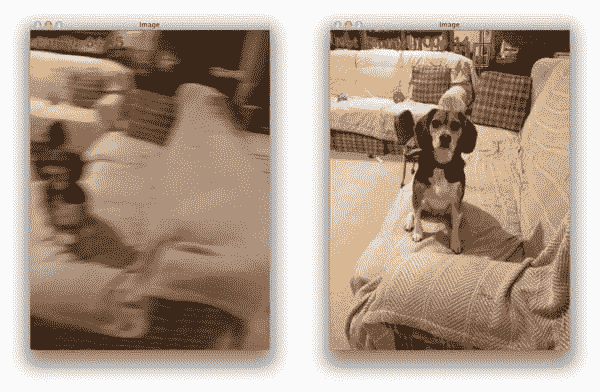](https://pyimagesearch.com/wp-content/uploads/2015/09/detecting_blur_header.jpg)

在我和我父亲杰玛之间，这只超级可爱、超级活跃、特别有爱心的家庭小猎犬可能是有史以来最受关注的狗狗。自从我们把她作为一只 8 周大的小狗，到现在，仅仅三年后，我们已经积累了超过 6000 张狗的 ***和*** 的照片。

过度？

也许吧。但是我喜欢狗。很多。尤其是小猎犬。所以毫不奇怪，作为一个养狗的人，我花很多时间和 Jemma 最喜欢的玩具玩拔河游戏，和她在厨房地板上打滚打闹，是的，用我的 iPhone 给她拍了很多照片。

在过去的这个周末，我坐下来试着整理 iPhoto 中的大量照片。这不仅是一项艰巨的任务，我开始很快注意到一种模式——***有许多照片模糊过度*** 。

无论是因为低于标准的摄影技巧，还是因为试图跟上超级活跃的 Jemma 在房间里跑来跑去，或者是因为她在我准备拍摄完美照片时的混乱，许多照片都包含了相当多的模糊。

现在，对于普通人来说，我想他们会删除这些模糊的照片(或者至少将它们移到一个单独的文件夹中)——但作为一名计算机视觉科学家，这是不可能的。

相反，我打开了一个编辑器，编写了一个快速的 Python 脚本来用 OpenCV 执行模糊检测。

在这篇博文的剩余部分，我将展示如何使用 OpenCV、Python 和拉普拉斯算子来计算图像中的模糊量。在这篇文章结束时，你将能够将拉普拉斯 *方法*的*方差应用于你自己的照片，以检测模糊量。*

## 拉普拉斯的方差

[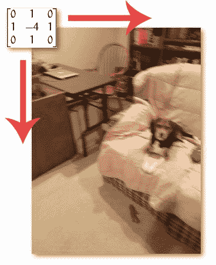](https://pyimagesearch.com/wp-content/uploads/2015/09/detecting_blur_convolution.jpg)

**Figure 1:** Convolving the input image with the Laplacian operator.

当我弄清楚如何检测图像中的模糊量时，我的第一站是通读优秀的调查工作， *[焦点形状的焦点测量算子分析](https://pdfs.semanticscholar.org/8c67/5bf5b542b98bf81dcf70bd869ab52ab8aae9.pdf)*【2013 佩尔图斯等人】。在他们的论文中，佩尔图斯等人回顾了近 36 种不同的方法来估算图像的焦距。

如果你有信号处理方面的背景知识，首先要考虑的方法是计算图像的[快速傅立叶变换](https://en.wikipedia.org/wiki/Fast_Fourier_transform)，然后检查低频和高频的分布——如果高频很少，则图像可能会模糊。然而，定义什么是*低*数量的高频，什么是*高*数量的高频可能会很成问题，经常导致低于标准的结果。

相反，如果我们可以计算一个单浮点值来表示给定图像的模糊程度，这不是很好吗？

佩尔图斯等人回顾了许多计算这种“模糊度度量”的方法，其中一些简单明了，只使用基本的灰度像素强度统计，另一些更先进，基于特征，评估图像的局部二进制模式。

在快速浏览了论文之后，我找到了我一直在寻找的实现:Pech-Pacheco 等人在他们 2000 年的 ICPR 论文 *[中的**拉普拉斯** 的变体](http://optica.csic.es/papers/icpr2k.pdf)* 。

方法简单。直白。有合理的推理。而可以在 ***中实现的只有一行代码*** :

```py
cv2.Laplacian(image, cv2.CV_64F).var()

```

您只需简单地获取图像的一个通道(大概是灰度)并用下面的 *3 x 3* 内核对其进行卷积:

[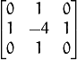](https://pyimagesearch.com/wp-content/uploads/2015/09/detecting_blur_laplacian.png)

**Figure 2:** The Laplacian kernel.

然后取响应的方差(即标准差的平方)。

如果方差低于预定义的阈值，则认为图像*模糊*；否则，图像是*不模糊*。

这种方法有效的原因是由于拉普拉斯算子本身的定义，该算子用于测量图像的二阶导数。拉普拉斯算子突出显示图像中包含快速亮度变化的区域，非常像 Sobel 和 Scharr 算子。就像这些算子一样，拉普拉斯算子通常用于边缘检测。这里的假设是，如果图像包含*高方差*，则存在广泛的响应，包括边缘状和非边缘状，代表正常的聚焦图像。但是，如果有*非常低的方差*，那么就有一个微小的反应扩散，表明在图像中有很少的边缘。我们知道，图像越模糊，*边缘越少*。

显然，这里的技巧是设置正确的阈值，这可能与域有关。过低的阈值会错误地将图像标记为模糊，而实际上它们并不模糊。阈值太高，那么实际上模糊的图像将不会被标记为模糊。这种方法在您可以计算可接受的焦点测量范围，然后检测异常值的环境中效果最好。

## 检测图像中的模糊量

现在，我们已经了解了我们将用来计算表示给定图像“模糊”程度的单一指标的方法，让我们来看看以下 12 张图像的数据集:

[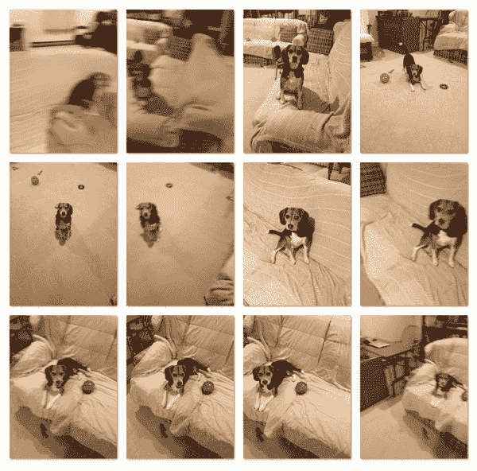](https://pyimagesearch.com/wp-content/uploads/2015/09/detecting_blur_dataset.png)

**Figure 3:** Our dataset of images. Some are blurry, some are not. Our goal is to perform blur detection with OpenCV and mark the images as such.

如你所见，有些图像模糊不清，有些则不然。我们这里的目标是*正确地*将每张图像标记为*模糊*或*非模糊*。

也就是说，打开一个新文件，命名为`detect_blur.py`，让我们开始编码:

```py
# import the necessary packages
from imutils import paths
import argparse
import cv2

def variance_of_laplacian(image):
	# compute the Laplacian of the image and then return the focus
	# measure, which is simply the variance of the Laplacian
	return cv2.Laplacian(image, cv2.CV_64F).var()

# construct the argument parse and parse the arguments
ap = argparse.ArgumentParser()
ap.add_argument("-i", "--images", required=True,
	help="path to input directory of images")
ap.add_argument("-t", "--threshold", type=float, default=100.0,
	help="focus measures that fall below this value will be considered 'blurry'")
args = vars(ap.parse_args())

```

我们从在第 2-4 行导入必要的包开始。如果你的机器上还没有我的 [imutils](https://github.com/jrosebr1/imutils) 包，你会想现在安装它:

```py
$ pip install imutils

```

从那里，我们将在第 6 行的**上定义我们的`variance_of_laplacian`函数。这个方法将只接受一个参数`image`(假设是一个单通道，比如一个灰度图像)，我们要为它计算焦点度量。从那里，**第 9 行**简单地将`image`与 *3 x 3* 拉普拉斯算子进行卷积，并返回方差。**

**第 12-17 行**处理解析我们的命令行参数。我们需要的第一个开关是`--images`，它是包含我们想要测试模糊度的图像数据集的目录的路径。

我们还将定义一个可选参数`--thresh`，它是我们将用于模糊测试的阈值。如果给定图像的焦距测量值低于这个阈值，我们会将该图像标记为*模糊*。需要注意的是，您可能需要为自己的图像数据集调整这个值。值`100`似乎很适合我的数据集，但是这个值对于图像的内容来说是相当主观的，所以你需要自己使用这个值来获得最佳结果。

信不信由你，最难的部分已经完成了！我们只需要写一点代码来从磁盘加载图像，计算拉普拉斯的方差，然后将图像标记为模糊或不模糊:

```py
# loop over the input images
for imagePath in paths.list_images(args["images"]):
	# load the image, convert it to grayscale, and compute the
	# focus measure of the image using the Variance of Laplacian
	# method
	image = cv2.imread(imagePath)
	gray = cv2.cvtColor(image, cv2.COLOR_BGR2GRAY)
	fm = variance_of_laplacian(gray)
	text = "Not Blurry"

	# if the focus measure is less than the supplied threshold,
	# then the image should be considered "blurry"
	if fm < args["threshold"]:
		text = "Blurry"

	# show the image
	cv2.putText(image, "{}: {:.2f}".format(text, fm), (10, 30),
		cv2.FONT_HERSHEY_SIMPLEX, 0.8, (0, 0, 255), 3)
	cv2.imshow("Image", image)
	key = cv2.waitKey(0)

```

我们在第 20 行**开始循环我们的图像目录。对于这些图像中的每一个，我们将从磁盘中加载它，将其转换为灰度，然后使用 OpenCV 应用模糊检测(**第 24-27 行**)。**

如果焦点度量超过了命令行参数提供的阈值，我们将把图像标记为*“模糊”*。

最后，**第 35-38 行**将`text`和计算出的焦距度量写入图像，并将结果显示到我们的屏幕上。

## 使用 OpenCV 应用模糊检测

现在我们已经编写好了`detect_blur.py`脚本，让我们试一试。打开一个 shell 并发出以下命令:

```py
$ python detect_blur.py --images images

```

[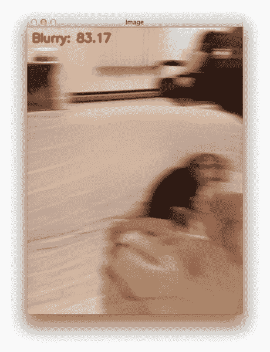](https://pyimagesearch.com/wp-content/uploads/2015/09/detecting_blur_result_001.jpg)

**Figure 4:** Correctly marking the image as “blurry”.

这张图的对焦度是 *83.17* ，低于我们的阈值*100*；因此，我们正确地将此图像标记为模糊。

[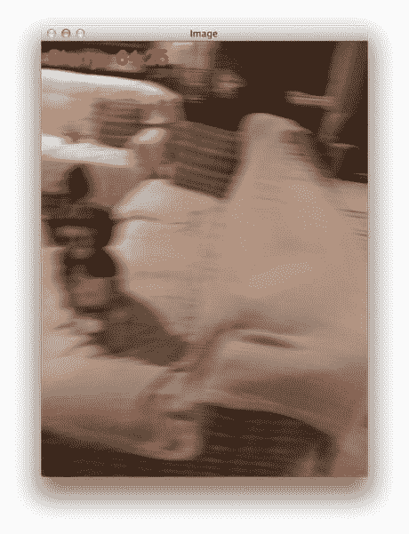](https://pyimagesearch.com/wp-content/uploads/2015/09/detecting_blur_result_002.jpg)

**Figure 5:** Performing blur detection with OpenCV. This image is marked as “blurry”.

这张图像的焦距为 64.25(T1)，这也导致我们将其标记为“模糊”。

[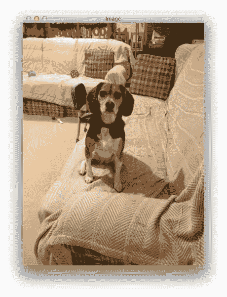](https://pyimagesearch.com/wp-content/uploads/2015/09/detecting_blur_result_003.jpg)

**Figure 6:** Marking an image as “non-blurry”.

**图 6** 在 *1004.14* 处具有非常高的焦距测量值——比前两个数字高几个数量级。这张图像清晰不模糊，焦点对准。

[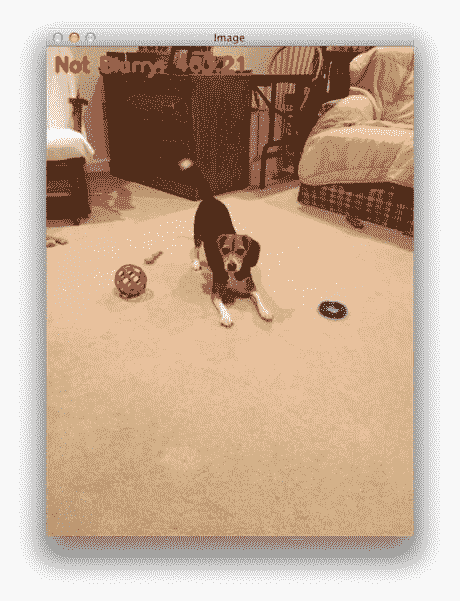](https://pyimagesearch.com/wp-content/uploads/2015/09/detecting_blur_result_004.jpg)

**Figure 7:** Applying blur detection with OpenCV and Python.

这张照片中唯一模糊的部分来自杰玛摇尾巴的动作。

[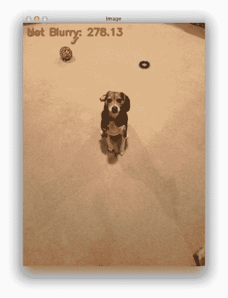](https://pyimagesearch.com/wp-content/uploads/2015/09/detecting_blur_result_005.jpg)

**Figure 8:** Basic blur detection with OpenCV and Python.

报告的焦距测量值低于**图 7** ，但我们仍然能够正确地将图像归类为“非模糊”。

[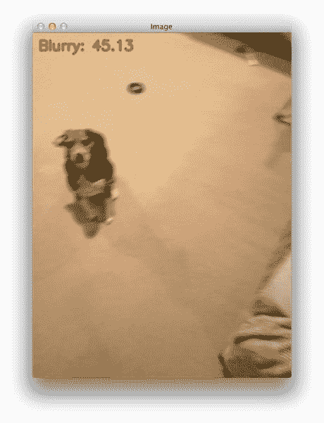](https://pyimagesearch.com/wp-content/uploads/2015/09/detecting_blur_result_006.jpg)

**Figure 9:** Computing the focus measure of an image.

然而，我们可以清楚地看到上面的图像是模糊的。

[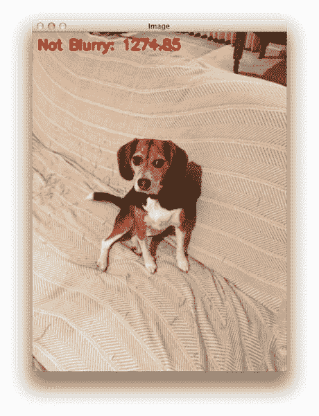](https://pyimagesearch.com/wp-content/uploads/2015/09/detecting_blur_result_007.jpg)

**Figure 10:** An example of computing the amount of blur in an image.

大的聚焦度量分数表示图像不模糊。

[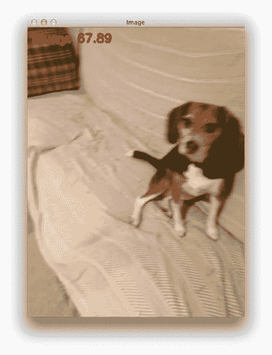](https://pyimagesearch.com/wp-content/uploads/2015/09/detecting_blur_result_008.jpg)

**Figure 11:** The subsequent image in the dataset is marked as “blurry”.

然而，这张图像包含大量的模糊。

[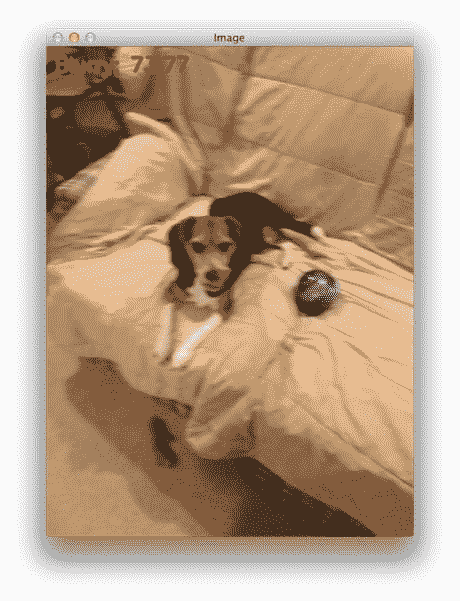](https://pyimagesearch.com/wp-content/uploads/2015/09/detecting_blur_result_009.jpg)

**Figure 12:** Detecting the amount of blur in an image using the variance of Laplacian.

[](https://pyimagesearch.com/wp-content/uploads/2015/09/detecting_blur_result_010.jpg)

**Figure 13:** Compared to Figure 12 above, the amount of blur in this image is substantially reduced.

[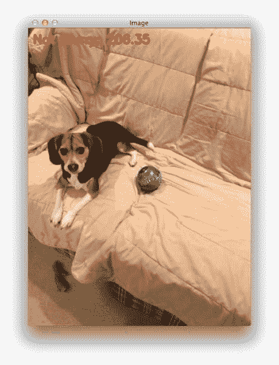](https://pyimagesearch.com/wp-content/uploads/2015/09/detecting_blur_result_011.jpg)

**Figure 14:** Again, this image is correctly marked as not being “blurred”.

[](https://pyimagesearch.com/wp-content/uploads/2015/09/detecting_blur_result_012.jpg)

**Figure 15:** Lastly, we end our example by using blur detection in OpenCV to mark this image as “blurry”.

## 摘要

在这篇博文中，我们学习了如何使用 OpenCV 和 Python 执行模糊检测。

我们实现了拉普拉斯方法的*方差，给我们一个浮点值来表示图像的“模糊度”。这种方法快速、简单且易于应用，我们只需将输入图像与拉普拉斯算子进行卷积，然后计算方差。如果方差低于预定义的阈值，我们将图像标记为“模糊”。*

值得注意的是，threshold 是正确调优的一个关键参数，您通常需要在每个数据集的基础上对其进行调优。太小的值，您会意外地将图像标记为模糊，而实际上它们并不模糊。如果阈值太大，您会将图像标记为不模糊，而实际上它们是模糊的。

请务必使用本文底部的表格下载代码，并尝试一下！