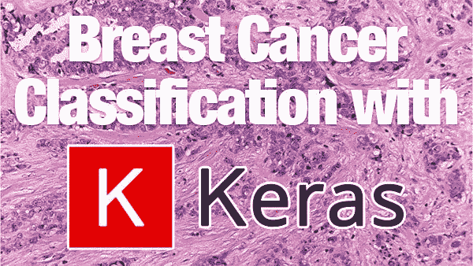
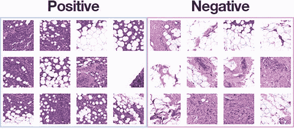
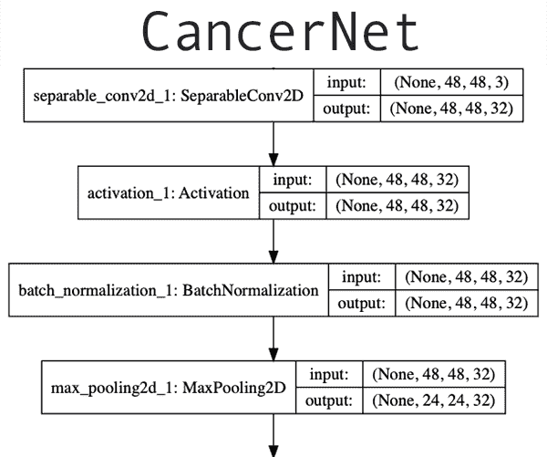
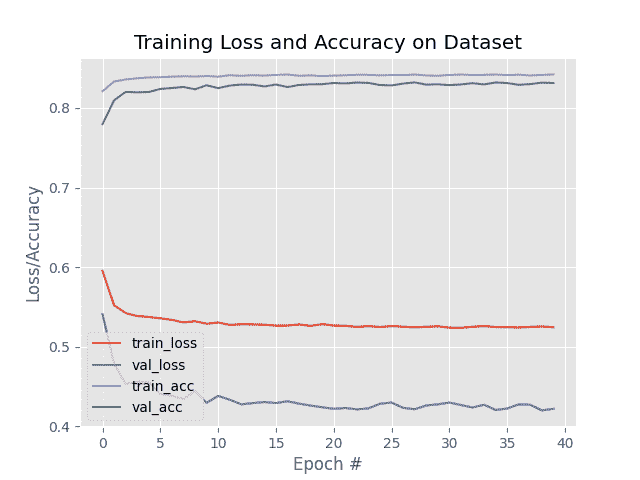

# 基于 Keras 和深度学习的乳腺癌分类

> 原文：<https://pyimagesearch.com/2019/02/18/breast-cancer-classification-with-keras-and-deep-learning/>

[](https://pyimagesearch.com/wp-content/uploads/2019/02/breast_cancer_classification_header.jpg)

在本教程中，您将学习如何训练 Keras 深度学习模型来预测乳腺组织学图像中的乳腺癌。

回到 2012-2013 年，我在美国国立卫生研究院(NIH)和美国国立癌症研究所(NCI)工作，开发一套图像处理和机器学习算法，以**自动分析乳腺组织学图像的癌症风险因素**，这项任务需要训练有素的病理学家*数小时*才能完成。我们的工作有助于促进乳腺癌危险因素预测的进一步发展

那时深度学习并不像现在这样流行和“主流”。例如，ImageNet 图像分类挑战赛于 2009 年才开始，直到 2012 年，Alex Krizhevsky、Ilya Sutskever 和 Geoffrey Hinton 才凭借臭名昭著的 AlexNet 架构赢得了比赛。

为了分析乳房组织学图像中的细胞结构，我们转而利用基本的计算机视觉和图像处理算法，但以一种新的方式将它们结合起来。这些算法运行得非常好——但也需要相当多的工作来整合。

今天我认为在乳腺癌分类的背景下探索深度学习是值得的。

就在去年，我的一位近亲被诊断出患有癌症。同样，我愿意打赌，这个博客的每一个读者都认识某个曾经患过癌症的人。

作为深度学习的研究人员、从业人员和工程师，我们必须获得将深度学习应用于医学和计算机视觉问题的实践经验，这一经验可以帮助我们开发深度学习算法，以更好地帮助病理学家预测癌症。

**要了解如何训练一个用于乳腺癌预测的 Keras 深度学习模型，*继续阅读！***

## 基于 Keras 和深度学习的乳腺癌分类

***2020-06-11 更新:**此博文现已兼容 TensorFlow 2+!*

在本教程的第一部分，我们将回顾我们的乳腺癌组织学图像数据集。

在此基础上，我们将创建一个 Python 脚本来将输入数据集分成三个集合:

1.  一套训练设备
2.  验证集
3.  测试设备

接下来，我们将使用 Keras 来定义一个卷积神经网络，我们将它恰当地命名为“CancerNet”。

最后，我们将创建一个 Python 脚本，在我们的乳腺组织学图像上训练 CancerNet。

我们将通过回顾我们的结果来结束这篇博文。

### 乳腺癌组织学图像数据集

[](https://pyimagesearch.com/wp-content/uploads/2019/02/breast_cancer_classification_dataset.jpg)

**Figure 1:** The [Kaggle Breast Histopathology Images](https://www.kaggle.com/paultimothymooney/breast-histopathology-images) dataset was curated by [Janowczyk and Madabhushi](https://www.ncbi.nlm.nih.gov/pubmed/27563488) and [Roa et al.](http://spie.org/Publications/Proceedings/Paper/10.1117/12.2043872) The most common form of breast cancer, Invasive Ductal Carcinoma (IDC), will be classified with deep learning and Keras.

我们在今天的帖子中使用的数据集是浸润性导管癌(IDC)，这是所有乳腺癌中最常见的一种。

该数据集最初由 [Janowczyk 和 Madabhushi](https://www.ncbi.nlm.nih.gov/pubmed/27563488) 和 [Roa 等人](http://spie.org/Publications/Proceedings/Paper/10.1117/12.2043872)策划，但在 [Kaggle 的网站](https://www.kaggle.com/paultimothymooney/breast-histopathology-images)上可以在公共领域获得。

原始数据集由 162 张 40 倍扫描的幻灯片图像组成。

幻灯片图像自然是巨大的(就空间维度而言)，所以为了使它们更容易处理，总共提取了 *50×50* 像素的 **277，524 个面片**，包括:

*   **198，738 例阴性病例**(即无乳腺癌)
*   **78786 个阳性病例**(即表明在该贴片中发现了乳腺癌)

在类别数据中明显存在**不平衡，其中 ***的负数据点数是正数据点数的 2 倍*** 。**

数据集中的每个图像都有特定的文件名结构。数据集中的图像文件名示例如下:

`10253_idx5_x1351_y1101_class0.png`

我们可以将这个文件名解释为:

*   **患者编号:** 10253_idx5
*   ***x*-作物坐标:**1351
*   ***y*-作物坐标:**1101
*   **分类标签:** 0 (0 表示无 IDC，1 表示 IDC)

**上面的图 1** 显示了正面和负面样本的例子——我们的目标是训练一个深度学习模型，能够辨别这两个类别之间的差异。

### 为癌症分类准备您的深度学习环境

要针对本教程配置您的系统，我首先建议您遵循以下任一教程:

*   [*如何在 Ubuntu 上安装 tensor flow 2.0*](https://pyimagesearch.com/2019/12/09/how-to-install-tensorflow-2-0-on-ubuntu/)
*   [*如何在 macOS 上安装 tensor flow 2.0*](https://pyimagesearch.com/2019/12/09/how-to-install-tensorflow-2-0-on-macos/)

这两个教程都将帮助您在一个方便的 Python 虚拟环境中，用这篇博文所需的所有软件来配置您的系统。

请注意 [PyImageSearch 不推荐或支持 CV/DL 项目的窗口](https://pyimagesearch.com/faqs/single-faq/can-you-help-me-do-___-on-windows/)。

### 项目结构

去抢今天博文的 ***【下载】*** 。

从那里，解压缩文件:

```py
$ cd path/to/downloaded/zip
$ unzip breast-cancer-classification.zip

```

现在您已经提取了文件，是时候将数据集放入目录结构中了。

继续创建以下目录:

```py
$ cd breast-cancer-classification
$ mkdir datasets
$ mkdir datasets/orig

```

然后，前往 Kaggle 的网站并登录。在那里，您可以单击以下链接将数据集下载到项目文件夹中:

**[点击这里下载 Kaggle](https://www.kaggle.com/paultimothymooney/breast-histopathology-images/download)T3 的数据**

***注意:**你需要在 Kaggle 的网站上创建一个账户(如果你还没有账户的话)来下载数据集。*

请务必保存。`breast-cancer-classification/datasets/orig`文件夹中的 zip 文件。

现在回到您的终端，导航到您刚刚创建的目录，并解压缩数据:

```py
$ cd path/to/breast-cancer-classification/datasets/orig
$ unzip archive.zip -x "IDC_regular_ps50_idx5/*"

```

从那里，让我们回到项目目录，使用`tree`命令检查我们的项目结构:

```py
$ cd ../..
$ tree --dirsfirst -L 4
.
├── datasets
│   └── orig
│       ├── 10253
│       │   ├── 0
│       │   └── 1
│       ├── 10254
│       │   ├── 0
│       │   └── 1
│       ├── 10255
│       │   ├── 0
│       │   └── 1
...[omitting similar folders]
│       ├── 9381
│       │   ├── 0
│       │   └── 1
│       ├── 9382
│       │   ├── 0
│       │   └── 1
│       ├── 9383
│       │   ├── 0
│       │   └── 1
│       └── 7415_10564_bundle_archive.zip
├── pyimagesearch
│   ├── __init__.py
│   ├── config.py
│   └── cancernet.py
├── build_dataset.py
├── train_model.py
└── plot.png

840 directories, 7 files

```

如您所见，我们的数据集在`datasets/orig`文件夹中，然后按假患者 ID 分类。这些图像被分为良性(`0/`)或恶性(`1/`)目录。

今天的`pyimagesearch/`模块包含了我们的配置和 CancerNet。

今天，我们将按顺序查看以下 Python 文件:

*   包含我们的数据集构建器和模型训练器都将使用的配置。
*   `build_dataset.py`:通过将图像分成训练集、验证集和测试集来构建我们的数据集。
*   `cancernet.py`:包含我们 CancerNet 乳腺癌分类 CNN。
*   负责培训和评估我们的 Keras 乳腺癌分类模型。

### 配置文件

在建立数据集和训练网络之前，让我们先来看看配置文件。

对于跨越多个 Python 文件的深度学习项目(比如这个)，我喜欢创建一个存储所有相关配置的单一 Python 配置文件。

让我们来看看`config.py`:

```py
# import the necessary packages
import os

# initialize the path to the *original* input directory of images
ORIG_INPUT_DATASET = "datasets/orig"

# initialize the base path to the *new* directory that will contain
# our images after computing the training and testing split
BASE_PATH = "datasets/idc"

# derive the training, validation, and testing directories
TRAIN_PATH = os.path.sep.join([BASE_PATH, "training"])
VAL_PATH = os.path.sep.join([BASE_PATH, "validation"])
TEST_PATH = os.path.sep.join([BASE_PATH, "testing"])

# define the amount of data that will be used training
TRAIN_SPLIT = 0.8

# the amount of validation data will be a percentage of the
# *training* data
VAL_SPLIT = 0.1

```

首先，我们的配置文件包含从 Kaggle 下载的原始输入数据集的路径( **Line 5** )。

在创建训练、测试和验证分割之后，我们从那里指定存储我们的图像文件的基本路径(**第 9 行**)。

使用`BASE_PATH`，我们得到训练、验证和测试输出目录的路径(**第 12-14 行**)。

我们的`TRAIN_SPLIT`是将用于*训练* ( **第 17 行**)的数据的百分比。这里我将其设置为 80%，剩下的 20%将用于*测试*。

在*训练*数据中，我们会保留一些图像用于*验证*。**第 21 行**规定*训练*数据的 10%(在我们拆分测试数据之后)将用于*验证*。

我们现在有了构建乳腺癌图像数据集所需的信息，所以让我们继续。

### 构建乳腺癌图像数据集

[](https://pyimagesearch.com/wp-content/uploads/2019/02/breast_cancer_classification_data_split.png)

**Figure 2:** We will split our deep learning breast cancer image dataset into training, validation, and testing sets. While this 5.8GB deep learning dataset isn’t large compared to most datasets, I’m going to treat it like it is so you can learn by example. Thus, we will use the opportunity to put the [Keras ImageDataGenerator](https://pyimagesearch.com/2018/12/24/how-to-use-keras-fit-and-fit_generator-a-hands-on-tutorial/) to work, yielding small batches of images. This eliminates the need to have the whole dataset in memory.

我们的乳腺癌图像数据集由 **198，783 张图像**组成，每张图像为 *50×50* 像素。

如果我们试图一次将整个数据集加载到内存中，我们将需要 5.8GB 多一点。

对于大多数现代机器，尤其是有 GPU 的机器，5.8GB 是一个合理的大小；然而，我将假设你的机器没有那么大的内存。

相反，我们将在磁盘上组织我们的数据集，这样我们就可以使用 **[Keras 的 ImageDataGenerator 类](https://pyimagesearch.com/2018/12/24/how-to-use-keras-fit-and-fit_generator-a-hands-on-tutorial/)从磁盘** *生成批量图像，而不必*将整个数据集保存在内存中。

但是首先我们需要组织我们的数据集。现在让我们构建一个脚本来实现这一点。

打开`build_dataset.py`文件并插入以下代码:

```py
# import the necessary packages
from pyimagesearch import config
from imutils import paths
import random
import shutil
import os

# grab the paths to all input images in the original input directory
# and shuffle them
imagePaths = list(paths.list_images(config.ORIG_INPUT_DATASET))
random.seed(42)
random.shuffle(imagePaths)

# compute the training and testing split
i = int(len(imagePaths) * config.TRAIN_SPLIT)
trainPaths = imagePaths[:i]
testPaths = imagePaths[i:]

# we'll be using part of the training data for validation
i = int(len(trainPaths) * config.VAL_SPLIT)
valPaths = trainPaths[:i]
trainPaths = trainPaths[i:]

# define the datasets that we'll be building
datasets = [
	("training", trainPaths, config.TRAIN_PATH),
	("validation", valPaths, config.VAL_PATH),
	("testing", testPaths, config.TEST_PATH)
]

```

这个脚本要求我们`import`我们的`config`设置和`paths`来收集所有的图像路径。我们还将使用`random`随机打乱路径，`shutil`复制图像，`os`连接路径并创建目录。这些进口中的每一项都列在第 2-6 行的**中。**

首先，我们将获取数据集的所有`imagePaths`和`shuffle`(**第 10-12 行**)。

然后我们计算训练/测试分割的指数(**第 15 行**)。使用那个索引，`i`，我们的`trainPaths`和`testPaths`是通过切片`imagePaths` ( **行 16 和 17** )构建的。

我们的`trainPaths`进一步拆分，这次保留一部分用于验证，`valPaths` ( **第 20-22 行**)。

**第 25-29 行**定义了一个名为`datasets`的列表。里面是三个元组，每个元组都包含将所有的`imagePaths`组织成训练、验证和测试数据所需的信息。

现在让我们开始循环查看`datasets`列表:

```py
# loop over the datasets
for (dType, imagePaths, baseOutput) in datasets:
	# show which data split we are creating
	print("[INFO] building '{}' split".format(dType))

	# if the output base output directory does not exist, create it
	if not os.path.exists(baseOutput):
		print("[INFO] 'creating {}' directory".format(baseOutput))
		os.makedirs(baseOutput)

	# loop over the input image paths
	for inputPath in imagePaths:
		# extract the filename of the input image and extract the
		# class label ("0" for "negative" and "1" for "positive")
		filename = inputPath.split(os.path.sep)[-1]
		label = filename[-5:-4]

		# build the path to the label directory
		labelPath = os.path.sep.join([baseOutput, label])

		# if the label output directory does not exist, create it
		if not os.path.exists(labelPath):
			print("[INFO] 'creating {}' directory".format(labelPath))
			os.makedirs(labelPath)

		# construct the path to the destination image and then copy
		# the image itself
		p = os.path.sep.join([labelPath, filename])
		shutil.copy2(inputPath, p)

```

在第 32 行的**上，我们定义了一个数据集分割的循环。在内部，我们:**

*   创建基本输出目录(**第 37-39 行**)。
*   对当前分割中的所有输入图像执行嵌套循环(**行 42** ):
    *   从输入路径中提取`filename`(**第 45 行**)，然后从文件名中提取类`label`(**第 46 行**)。
    *   构建我们的输出`labelPath`并创建标签输出目录(**第 49-54 行**)。
    *   最后，将每个文件复制到它的目的地(**行 58 和 59** )。

现在我们的脚本已经编写好了，接下来通过执行以下命令来创建培训、测试和验证分割目录结构:

```py
$ python build_dataset.py
[INFO] building 'training' split
[INFO] 'creating datasets/idc/training' directory
[INFO] 'creating datasets/idc/training/0' directory
[INFO] 'creating datasets/idc/training/1' directory
[INFO] building 'validation' split
[INFO] 'creating datasets/idc/validation' directory
[INFO] 'creating datasets/idc/validation/0' directory
[INFO] 'creating datasets/idc/validation/1' directory
[INFO] building 'testing' split
[INFO] 'creating datasets/idc/testing' directory
[INFO] 'creating datasets/idc/testing/0' directory
[INFO] 'creating datasets/idc/testing/1' directory
$ 
$ tree --dirsfirst --filelimit 10
.
├── datasets
│   ├── idc
│   │   ├── training
│   │   │   ├── 0 [143065 entries]
│   │   │   └── 1 [56753 entries]
│   │   ├── validation
│   │   |   ├── 0 [15962 entries]
│   │   |   └── 1 [6239 entries]
│   │   └── testing
│   │       ├── 0 [39711 entries]
│   │       └── 1 [15794 entries]
│   └── orig [280 entries]
├── pyimagesearch
│   ├── __init__.py
│   ├── config.py
│   └── cancernet.py
├── build_dataset.py
├── train_model.py
└── plot.png

14 directories, 8 files

```

我们脚本的输出显示在命令下面。

我还再次执行了`tree`命令，这样您就可以看到我们的数据集现在是如何构建成我们的训练、验证和测试集的。

***注意:**我没有费心扩展我们最初的`datasets/orig/`结构——如果你需要复习，可以向上滚动到“项目结构”部分。*

### 癌症网:我们的乳腺癌预测

[](https://pyimagesearch.com/wp-content/uploads/2019/02/cancernet_arch_raw.png)

**Figure 3:** Our Keras deep learning classification architecture for predicting breast cancer ([click](https://pyimagesearch.com/wp-content/uploads/2019/02/cancernet_arch_raw.png) to expand)

下一步是实现我们将用于这个项目的 CNN 架构。

为了实现该架构，我使用了 Keras 深度学习库，并设计了一个名为“CancerNet”的网络，该网络:

1.  专门使用 *3×3* CONV 滤波器，类似于 VGGNet
2.  在执行最大池化之前，将多个 *3×3* CONV 滤波器堆叠在彼此之上(同样，类似于 VGGNet)
3.  但与 VGGNet 不同，使用**深度方向可分离卷积**而不是标准卷积层

深度可分卷积在深度学习中并不是一个“新”的想法。

事实上，谷歌大脑实习生 Laurent Sifre 在 2013 年首次利用了它们。

安德鲁·霍华德在 2015 年与 MobileNet 合作时使用了它们。

也许最值得注意的是，Francois Chollet 在 2016-2017 年创作著名的 Xception 建筑时使用了它们。

**对标准卷积层和深度方向可分离卷积之间差异的详细解释超出了本教程的范围(关于这一点，[请参考本指南](https://towardsdatascience.com/a-basic-introduction-to-separable-convolutions-b99ec3102728)，但要点是深度方向可分离卷积:**

1.  效率更高。
2.  需要更少的内存。
3.  需要更少的计算。
4.  在某些情况下，可以比标准卷积执行得更好。

我还没有在 PyImageSearch 的任何教程中使用过深度方向可分离卷积，所以我想今天用它玩会很有趣。

话虽如此，让我们开始实施 CancerNet 吧！

打开`cancernet.py`文件并插入以下代码:

```py
# import the necessary packages
from tensorflow.keras.models import Sequential
from tensorflow.keras.layers import BatchNormalization
from tensorflow.keras.layers import SeparableConv2D
from tensorflow.keras.layers import MaxPooling2D
from tensorflow.keras.layers import Activation
from tensorflow.keras.layers import Flatten
from tensorflow.keras.layers import Dropout
from tensorflow.keras.layers import Dense
from tensorflow.keras import backend as K

class CancerNet:
	@staticmethod
	def build(width, height, depth, classes):
		# initialize the model along with the input shape to be
		# "channels last" and the channels dimension itself
		model = Sequential()
		inputShape = (height, width, depth)
		chanDim = -1

		# if we are using "channels first", update the input shape
		# and channels dimension
		if K.image_data_format() == "channels_first":
			inputShape = (depth, height, width)
			chanDim = 1

```

我们的 Keras 进口列在**2-10 线**。我们将使用 Keras 的`Sequential` API 来构建`CancerNet`。

你在 PyImageSearch 博客上没见过的一个导入是`SeparableConv2D`。这种卷积层类型允许深度方向的卷积。有关更多详情，[请参考文档](https://keras.io/layers/convolutional/#separableconv2d)。

其余的导入/图层类型都在我的入门教程 **[*Keras 教程*](https://pyimagesearch.com/2018/09/10/keras-tutorial-how-to-get-started-with-keras-deep-learning-and-python/)** 和用 Python 进行计算机视觉深度学习**[](https://pyimagesearch.com/deep-learning-computer-vision-python-book/)***中有更详细的讨论。*

 *让我们在**第 12** 行定义我们的`CancerNet`类，然后在**第 14** 行继续`build`它。

`build`方法需要四个参数:

*   `width`、`height`和`depth`:这里我们指定网络的输入图像体积形状，其中`depth`是每个图像包含的颜色通道的数量。
*   `classes`:我们的网络将预测的类的数量(对于`CancerNet`，将是`2`)。

我们继续在**行 17** 上初始化我们的`model`，随后，指定我们的`inputShape` ( **行 18** )。在使用 TensorFlow 作为后端的情况下，我们现在准备添加层。

其他指定`"channels_first"`的后端要求我们将`depth`放在`inputShape`的前面，图像尺寸跟在后面(**第 23-25 行**)。

让我们定义我们的`DEPTHWISE_CONV => RELU => POOL`层:

```py
		# CONV => RELU => POOL
		model.add(SeparableConv2D(32, (3, 3), padding="same",
			input_shape=inputShape))
		model.add(Activation("relu"))
		model.add(BatchNormalization(axis=chanDim))
		model.add(MaxPooling2D(pool_size=(2, 2)))
		model.add(Dropout(0.25))

		# (CONV => RELU => POOL) * 2
		model.add(SeparableConv2D(64, (3, 3), padding="same"))
		model.add(Activation("relu"))
		model.add(BatchNormalization(axis=chanDim))
		model.add(SeparableConv2D(64, (3, 3), padding="same"))
		model.add(Activation("relu"))
		model.add(BatchNormalization(axis=chanDim))
		model.add(MaxPooling2D(pool_size=(2, 2)))
		model.add(Dropout(0.25))

		# (CONV => RELU => POOL) * 3
		model.add(SeparableConv2D(128, (3, 3), padding="same"))
		model.add(Activation("relu"))
		model.add(BatchNormalization(axis=chanDim))
		model.add(SeparableConv2D(128, (3, 3), padding="same"))
		model.add(Activation("relu"))
		model.add(BatchNormalization(axis=chanDim))
		model.add(SeparableConv2D(128, (3, 3), padding="same"))
		model.add(Activation("relu"))
		model.add(BatchNormalization(axis=chanDim))
		model.add(MaxPooling2D(pool_size=(2, 2)))
		model.add(Dropout(0.25))

```

这里定义了三个`DEPTHWISE_CONV => RELU => POOL`块，增加了过滤器的堆叠和数量。我也申请了`BatchNormalization`和`Dropout`。

让我们添加完全连接的头部:

```py
		# first (and only) set of FC => RELU layers
		model.add(Flatten())
		model.add(Dense(256))
		model.add(Activation("relu"))
		model.add(BatchNormalization())
		model.add(Dropout(0.5))

		# softmax classifier
		model.add(Dense(classes))
		model.add(Activation("softmax"))

		# return the constructed network architecture
		return model

```

我们的`FC => RELU`层和 softmax 分类器构成了网络的头部。

softmax 分类器的输出将是我们的模型将预测的每个类别的预测百分比。

最后，我们的`model`返回到训练脚本。

### 我们的培训脚本

我们需要实现的最后一块拼图是我们实际的训练脚本。

创建一个名为`train_model.py`的新文件，打开它，并插入以下代码:

```py
# set the matplotlib backend so figures can be saved in the background
import matplotlib
matplotlib.use("Agg")

# import the necessary packages
from tensorflow.keras.preprocessing.image import ImageDataGenerator
from tensorflow.keras.callbacks import LearningRateScheduler
from tensorflow.keras.optimizers import Adagrad
from tensorflow.keras.utils import to_categorical
from sklearn.metrics import classification_report
from sklearn.metrics import confusion_matrix
from pyimagesearch.cancernet import CancerNet
from pyimagesearch import config
from imutils import paths
import matplotlib.pyplot as plt
import numpy as np
import argparse
import os

# construct the argument parser and parse the arguments
ap = argparse.ArgumentParser()
ap.add_argument("-p", "--plot", type=str, default="plot.png",
	help="path to output loss/accuracy plot")
args = vars(ap.parse_args())

```

我们的进口来自 7 个地方:

1.  一个科学绘图包，是 Python 事实上的标准。在**的第 3 行**上，我们设置 matplotlib 使用`"Agg"`后端，这样我们就可以将我们的训练图保存到磁盘上。
2.  `tensorflow.keras`:我们将利用`ImageDataGenerator`、`LearningRateScheduler`、`Adagrad`优化器和`utils`。
3.  从 scikit-learn 我们需要它的一个`classification_report`和一个`confusion_matrix`的实现。
4.  我们将使用我们新定义的 CancerNet(训练和评估它)。我们还需要配置来获取三个数据分割的路径。这个模块*不是*pip-installable；它收录了今天帖子的 ***【下载】*** 版块。
5.  我已经把我的便利功能作为一个可安装在 pip 上的包公开了。我们将使用`paths`模块获取每个图像的路径。
6.  `numpy`:数据科学家使用 Python 进行数值处理的典型工具。
7.  Python:`argparse`和`os`都内置于 Python 安装中。我们将[使用`argparse`解析命令行参数](https://pyimagesearch.com/2018/03/12/python-argparse-command-line-arguments/)。

让我们解析我们唯一的命令行参数，`--plot`。有了运行时在终端中提供的这个参数，我们的脚本将能够动态地接受不同的绘图文件名。如果不使用绘图文件名指定命令行参数，将使用默认值`plot.png`。

现在，我们已经导入了所需的库，并解析了命令行参数，让我们定义训练参数，包括我们的训练图像路径，并考虑类不平衡:

```py
# initialize our number of epochs, initial learning rate, and batch
# size
NUM_EPOCHS = 40
INIT_LR = 1e-2
BS = 32

# determine the total number of image paths in training, validation,
# and testing directories
trainPaths = list(paths.list_images(config.TRAIN_PATH))
totalTrain = len(trainPaths)
totalVal = len(list(paths.list_images(config.VAL_PATH)))
totalTest = len(list(paths.list_images(config.TEST_PATH)))

# calculate the total number of training images in each class and
# initialize a dictionary to store the class weights
trainLabels = [int(p.split(os.path.sep)[-2]) for p in trainPaths]
trainLabels = to_categorical(trainLabels)
classTotals = trainLabels.sum(axis=0)
classWeight = dict()

# loop over all classes and calculate the class weight
for i in range(0, len(classTotals)):
	classWeight[i] = classTotals.max() / classTotals[i]

```

**第 28-30 行**定义训练时期的数量、初始学习率和批量大小。

从那里，我们获取我们的训练图像路径，并确定每个分割中的图像总数(**行 34-37** )。

然后，我们将继续采取措施解决类不平衡/偏斜问题(**第 41-48 行**)。

让我们初始化我们的数据扩充对象:

```py
# initialize the training data augmentation object
trainAug = ImageDataGenerator(
	rescale=1 / 255.0,
	rotation_range=20,
	zoom_range=0.05,
	width_shift_range=0.1,
	height_shift_range=0.1,
	shear_range=0.05,
	horizontal_flip=True,
	vertical_flip=True,
	fill_mode="nearest")

# initialize the validation (and testing) data augmentation object
valAug = ImageDataGenerator(rescale=1 / 255.0)

```

数据扩充是一种正则化形式，对于几乎所有深度学习实验都很重要，以帮助模型泛化。该方法在将训练样本传递到网络中进行训练之前，有目的地扰动训练样本，稍微改变它们的外观。这部分缓解了收集更多训练数据的需要，尽管更多的训练数据很少会损害您的模型。

我们的数据扩充对象`trainAug`在**行 51-60** 被初始化。如您所见，随机旋转、移位、剪切和翻转将在数据生成时应用于数据。将我们的图像像素强度重新调整到范围*【0，1】*由`trainAug`发生器和**线 63** 上定义的`valAug`发生器处理。

现在让我们初始化每个生成器:

```py
# initialize the training generator
trainGen = trainAug.flow_from_directory(
	config.TRAIN_PATH,
	class_mode="categorical",
	target_size=(48, 48),
	color_mode="rgb",
	shuffle=True,
	batch_size=BS)

# initialize the validation generator
valGen = valAug.flow_from_directory(
	config.VAL_PATH,
	class_mode="categorical",
	target_size=(48, 48),
	color_mode="rgb",
	shuffle=False,
	batch_size=BS)

# initialize the testing generator
testGen = valAug.flow_from_directory(
	config.TEST_PATH,
	class_mode="categorical",
	target_size=(48, 48),
	color_mode="rgb",
	shuffle=False,
	batch_size=BS)

```

在这里，我们初始化训练、验证和测试生成器。每个生成器将按需提供一批图像，如参数`batch_size`所示。

让我们继续初始化我们的`model`并开始训练吧！

```py
# initialize our CancerNet model and compile it
model = CancerNet.build(width=48, height=48, depth=3,
	classes=2)
opt = Adagrad(lr=INIT_LR, decay=INIT_LR / NUM_EPOCHS)
model.compile(loss="binary_crossentropy", optimizer=opt,
	metrics=["accuracy"])

# fit the model
H = model.fit(
	x=trainGen,
	steps_per_epoch=totalTrain // BS,
	validation_data=valGen,
	validation_steps=totalVal // BS,
	class_weight=classWeight,
	epochs=NUM_EPOCHS)

```

***2020-06-11 更新:*** *以前，TensorFlow/Keras 需要使用一种叫做`.fit_generator`的方法来完成数据扩充。现在，`.fit`方法也可以处理数据扩充，使代码更加一致。这也适用于从`.predict_generator`到`.predict`(我们的下一个代码块)的迁移。请务必查看我关于 [fit 和 fit_generator](https://pyimagesearch.com/2018/12/24/how-to-use-keras-fit-and-fit_generator-a-hands-on-tutorial/) 以及[数据扩充](https://pyimagesearch.com/2019/07/08/keras-imagedatagenerator-and-data-augmentation/)的文章。*

我们的模型由第 93-95 行的**优化器初始化。**

然后我们用一个`"binary_crossentropy"` `loss`函数`compile`我们的模型(因为我们只有两类数据)，以及学习率衰减(**第 96 行和第 97 行**)。

**第 100-106 行**开始我们的培训过程。

训练完成后，我们将根据测试数据评估模型:

```py
# reset the testing generator and then use our trained model to
# make predictions on the data
print("[INFO] evaluating network...")
testGen.reset()
predIdxs = model.predict(x=testGen, steps=(totalTest // BS) + 1)

# for each image in the testing set we need to find the index of the
# label with corresponding largest predicted probability
predIdxs = np.argmax(predIdxs, axis=1)

# show a nicely formatted classification report
print(classification_report(testGen.classes, predIdxs,
	target_names=testGen.class_indices.keys()))

```

第 112 行对我们所有的测试数据进行预测(再次使用一个生成器对象)。

为每个样本抓取最高预测指数(**行 116** )，然后将`classification_report`方便地打印到终端(**行 119 和 120** )。

让我们收集其他评估指标:

```py
# compute the confusion matrix and and use it to derive the raw
# accuracy, sensitivity, and specificity
cm = confusion_matrix(testGen.classes, predIdxs)
total = sum(sum(cm))
acc = (cm[0, 0] + cm[1, 1]) / total
sensitivity = cm[0, 0] / (cm[0, 0] + cm[0, 1])
specificity = cm[1, 1] / (cm[1, 0] + cm[1, 1])

# show the confusion matrix, accuracy, sensitivity, and specificity
print(cm)
print("acc: {:.4f}".format(acc))
print("sensitivity: {:.4f}".format(sensitivity))
print("specificity: {:.4f}".format(specificity))

```

这里我们计算`confusion_matrix`，然后导出精度、`sensitivity`和`specificity` ( **第 124-128 行**)。矩阵和这些值中的每一个都打印在我们的终端中(**第 131-134 行**)。

最后，让我们生成并存储我们的训练图:

```py
# plot the training loss and accuracy
N = NUM_EPOCHS
plt.style.use("ggplot")
plt.figure()
plt.plot(np.arange(0, N), H.history["loss"], label="train_loss")
plt.plot(np.arange(0, N), H.history["val_loss"], label="val_loss")
plt.plot(np.arange(0, N), H.history["accuracy"], label="train_acc")
plt.plot(np.arange(0, N), H.history["val_accuracy"], label="val_acc")
plt.title("Training Loss and Accuracy on Dataset")
plt.xlabel("Epoch #")
plt.ylabel("Loss/Accuracy")
plt.legend(loc="lower left")
plt.savefig(args["plot"])

```

***2020-06-11 更新:*** *为了使这个绘图片段与 TensorFlow 2+兼容，更新了`H.history`字典键，以完全拼出“acc”而没有“ACC”(即`H.history["val_accuracy"]`和`H.history["accuracy"]`)。“val”没有拼成“validation”，这有点令人困惑；我们必须学会热爱 API 并与之共存，并永远记住这是一项正在进行的工作，世界各地的许多开发人员都为此做出了贡献。*

我们的训练历史图由训练/验证损失和训练/验证准确性组成。这些是随时间绘制的，这样我们可以发现过度拟合/欠拟合。

### 乳腺癌预测结果

我们现在已经实现了所有必要的 Python 脚本！

让我们继续在我们的乳腺癌数据集上训练 CancerNet。

继续之前，请确保您已经:

1.  使用*“为癌症分类准备深度学习环境”*部分中列出的必要库/包配置您的深度学习环境。
2.  使用本教程的 ***【下载】*** 部分下载源代码。
3.  从 Kaggle 的网站上下载了乳腺癌数据集。
4.  解压缩数据集并执行`build_dataset.py`脚本来创建必要的图像+目录结构。

在您勾选了以上四项之后，打开一个终端并执行以下命令:

```py
$ python train_model.py
Found 199818 images belonging to 2 classes.
Found 22201 images belonging to 2 classes.
Found 55505 images belonging to 2 classes.
Epoch 1/40
6244/6244 [==============================] - 142s 23ms/step - loss: 0.5954 - accuracy: 0.8211 - val_loss: 0.5407 - val_accuracy: 0.7796
Epoch 2/40
6244/6244 [==============================] - 135s 22ms/step - loss: 0.5520 - accuracy: 0.8333 - val_loss: 0.4786 - val_accuracy: 0.8097
Epoch 3/40
6244/6244 [==============================] - 133s 21ms/step - loss: 0.5423 - accuracy: 0.8358 - val_loss: 0.4532 - val_accuracy: 0.8202
...
Epoch 38/40
6244/6244 [==============================] - 133s 21ms/step - loss: 0.5248 - accuracy: 0.8408 - val_loss: 0.4269 - val_accuracy: 0.8300
Epoch 39/40
6244/6244 [==============================] - 133s 21ms/step - loss: 0.5254 - accuracy: 0.8415 - val_loss: 0.4199 - val_accuracy: 0.8318
Epoch 40/40
6244/6244 [==============================] - 133s 21ms/step - loss: 0.5244 - accuracy: 0.8422 - val_loss: 0.4219 - val_accuracy: 0.8314
[INFO] evaluating network...
              precision    recall  f1-score   support

           0       0.93      0.83      0.88     39853
           1       0.66      0.85      0.75     15652

    accuracy                           0.84     55505
   macro avg       0.80      0.84      0.81     55505
weighted avg       0.86      0.84      0.84     55505

[[33107  6746]
 [ 2303 13349]]
acc: 0.8370
sensitivity: 0.8307
specificity: 0.8529

```

[](https://pyimagesearch.com/wp-content/uploads/2019/02/breast_cancer_plot.png)

**Figure 4:** Our CancerNet classification model training plot generated with Keras.

查看我们的输出，您可以看到我们的模型达到了 **~83%的准确度**；然而，我们对*【良性/非癌症】*的正确分类率为 93%，这一事实严重影响了原始准确性。

为了在更深层次上理解我们模型的性能，我们计算了**灵敏度**和**特异性**。

我们的灵敏度测量了也预测为阳性的*真阳性*的比例(83.07%)。

相反，特异性衡量我们的*真阴性* (85.29%)。

在这里，我们需要非常小心我们的假阴性——**我们不想把某人归类为*“没有癌症”*，而事实上他们是*“癌症阳性”。***

我们的假阳性率也很重要——**我们不想错误地将某人归类为*“癌症阳性”*，然后让他们接受痛苦、昂贵和侵入性的治疗，而他们实际上并不需要。**

机器学习/深度学习工程师和从业者必须在敏感性和特异性之间保持平衡，但当涉及到深度学习和医疗保健/健康治疗时，这种平衡变得*极其重要*。

关于灵敏度、特异性、真阳性、假阴性、真阴性和假阳性的更多信息，请参考本指南。

## 摘要

在本教程中，您学习了如何使用 Keras 深度学习库来训练用于乳腺癌分类的卷积神经网络。

为了完成这项任务，我们利用了由 [Janowczyk 和 Madabhushi](https://www.ncbi.nlm.nih.gov/pubmed/27563488) 和 [Roa 等人](http://spie.org/Publications/Proceedings/Paper/10.1117/12.2043872)策划的乳腺癌组织学图像数据集

组织学图像本身是巨大的(就磁盘上的图像大小和加载到内存中时的空间尺寸而言)，因此为了使图像更易于我们使用，Kaggle 社区倡导团队的一部分 Paul Mooney 将数据集转换为 *50×50* 像素的图像补丁，然后将修改后的数据集直接上传到 [Kaggle 数据集存档](https://www.kaggle.com/paultimothymooney/breast-histopathology-images)。

属于两类的总共 **277，524 幅图像**被包括在数据集中:

1.  **阳性(+):**78786
2.  **阴性(-):** 198，738

这里我们可以看到数据中有一个**类不平衡**，负样本比正样本多 *2x* 多。

类别不平衡，以及数据集的挑战性，导致我们获得了 **~83%的分类准确度**、 **~83%的灵敏度**，以及 **~85%的特异性**。

我邀请你使用这个代码作为模板，开始你自己的乳腺癌分类实验。

**要下载这篇文章的源代码，并在 PyImageSearch 上发布未来教程时得到通知，*只需在下面的表格中输入您的电子邮件地址！****