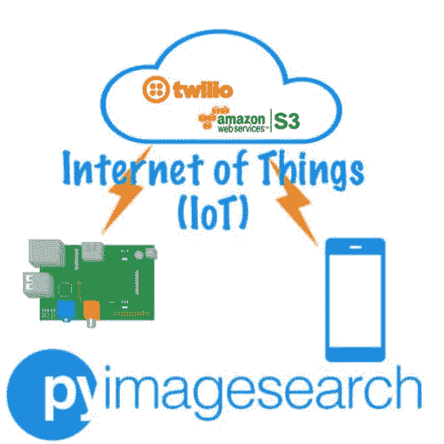
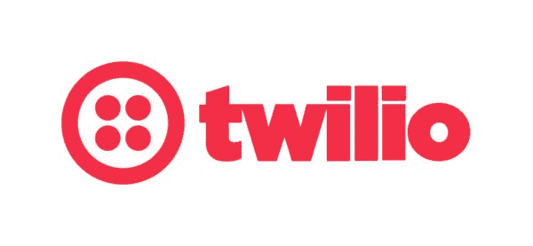
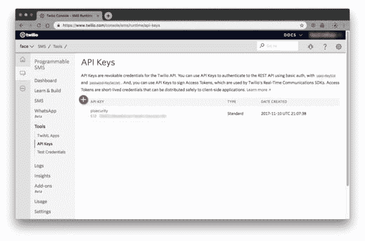
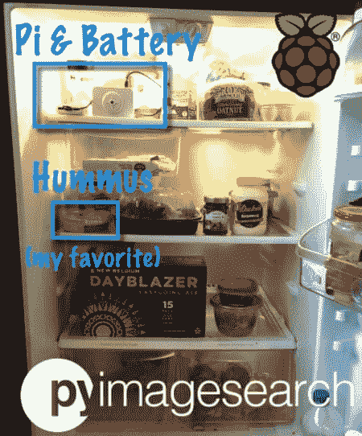

# 用 OpenCV 构建 Raspberry Pi 安全摄像机

> 原文：<https://pyimagesearch.com/2019/03/25/building-a-raspberry-pi-security-camera-with-opencv/>


在本教程中，您将学习如何使用 OpenCV 和计算机视觉构建一个 Raspberry Pi 安全摄像机。Pi 安全摄像头将支持物联网，使我们的 Raspberry Pi 能够在安全摄像头被触发时发送 TXT/MMS 消息通知、图像和视频剪辑。

早在我读大学的时候，我就对鹰嘴豆泥非常着迷。鹰嘴豆泥和皮塔饼/蔬菜是我午餐的选择。

我喜欢它

我靠它生活。

我非常保护我的鹰嘴豆泥——大学生们因为偷彼此的冰箱和食物而臭名昭著。没人能碰我的鹰嘴豆泥。

但是——我不止一次成为这种鹰嘴豆泥盗窃案的受害者，我永远不会忘记这件事！

我一直不知道是谁偷了我的鹰嘴豆泥，尽管我和妻子是我们家唯一的住户，我还是经常把鹰嘴豆泥藏在冰箱后面(没人会看到的地方)或者水果和蔬菜下面(大多数人都不想吃)。

当然，那时候我对计算机视觉和 OpenCV 还没有现在这么熟悉。如果我知道我现在在做什么，我会建一个 Raspberry Pi 安全摄像头来捕捉鹰嘴豆泥抢劫的过程！

今天，我正在引导我的内在大学生，让鹰嘴豆大盗安息。如果他再回来，小心，我的冰箱被监控了！

**要了解如何使用 Raspberry Pi 和 OpenCV 构建安全摄像头，*请继续阅读！***

## 用 OpenCV 构建 Raspberry Pi 安全摄像机

在本教程的第一部分，我们将简要回顾如何使用 Raspberry Pi 构建支持物联网的安全摄像头。

接下来，我们将检查我们的项目/目录结构，并安装库/包以成功构建项目。

我们还将简要回顾一下[亚马逊 AWS/S3](https://docs.aws.amazon.com/AmazonS3/latest/dev/Welcome.html) 和 [Twilio](https://www.twilio.com/) ，这两项服务在一起使用时将使我们能够:

1.  当安全摄像头被触发时，上传图像/视频剪辑。
2.  通过短信将图像/视频片段直接发送到我们的智能手机。

从那里，我们将实现该项目的源代码。

最后，我们将把所有的部件组合在一起，将我们的 Raspberry Pi 安全摄像机投入使用！

### 带有树莓 Pi 的物联网安全摄像头

[](https://pyimagesearch.com/wp-content/uploads/2019/03/pi_security_iot.jpg)

**Figure 1:** Raspberry Pi + Internet of Things (IoT). Our project today will use two cloud services: Twilio and AWS S3\. Twilio is an SMS/MMS messaging service. S3 is a file storage service to help facilitate the video messages.

我们将使用 Raspberry Pi 和 OpenCV 构建一个非常简单的物联网安全摄像头。

当摄像头被触发时，安全摄像头将能够记录视频剪辑，将视频剪辑上传到云，然后发送包含视频本身的 TXT/MMS 消息。

我们将构建这个项目*特别是*，目标是检测冰箱何时打开，何时关闭——其间的一切都将被捕获和记录。

**因此，在光线差异较大的相同“开放”和“封闭”环境中，这款安全摄像机的工作效果最佳。**例如，您也可以将它部署在一个可以打开/关闭的邮箱中。

您可以轻松地将这种方法扩展到其他形式的检测，包括[简单运动检测和家庭监控](https://pyimagesearch.com/2015/06/01/home-surveillance-and-motion-detection-with-the-raspberry-pi-python-and-opencv/)、[物体检测](https://pyimagesearch.com/2017/09/11/object-detection-with-deep-learning-and-opencv/)等等。我将把它作为一个练习留给读者去实现——在这种情况下，您可以使用这个项目作为实现任何附加计算机视觉功能的“模板”。

### 项目结构

去抢今天博文的 ***【下载】*** 。

解压文件后，您将看到以下目录结构:

```py
$ tree --dirsfirst
.
├── config
│   └── config.json
├── pyimagesearch
│   ├── notifications
│   │   ├── __init__.py
│   │   └── twilionotifier.py
│   ├── utils
│   │   ├── __init__.py
│   │   └── conf.py
│   └── __init__.py
└── detect.py

4 directories, 7 files

```

今天我们将回顾四个文件:

*   这个注释过的 JSON 文件保存了我们的配置。我给你提供了这个文件，**，但是你需要为 Twilio 和 S3 插入你的 API 密匙。**
*   `pyimagesearch/notifications/twilionotifier.py`:包含发送 SMS/MMS 消息的`TwilioNotifier`类。在我的[即将出版的《覆盆子 Pi》书](https://pyimagesearch.com/2019/03/18/im-writing-a-book-on-computer-vision-and-the-raspberry-pi-and-i-need-your-input/)中，我用 Python 发送文本、图片和视频消息时使用的就是这个类。
*   `pyimagesearch/utils/conf.py`:`Conf`类负责加载注释后的 JSON 配置。
*   今天项目的核心包含在这个驱动程序脚本中。它会观察显著的光线变化，开始录制视频，并在有人偷了我的鹰嘴豆泥或我藏在冰箱里的任何东西时提醒我。

现在我们已经了解了目录结构和其中的文件，让我们继续配置我们的机器，学习 S3 + Twilio。从那里，我们将开始回顾今天项目中的四个关键文件。

### 安装软件包/库先决条件

今天的项目要求你在你的 Raspberry Pi 上安装一些 Python 库。

在我即将出版的 **[本书](https://pyimagesearch.com/2019/03/18/im-writing-a-book-on-computer-vision-and-the-raspberry-pi-and-i-need-your-input/)** 中，所有这些软件包都将**预装**在一个**定制的 Raspbian 映像中。你所要做的就是下载 Raspbian。img 文件，闪存到你的 micro-SD 卡，开机！从那里开始，您将拥有一个预配置的开发环境，其中包含您需要的所有计算机视觉+深度学习库！**

***注意:**如果你现在就想要我的定制 Raspbian 图像****(带有*OpenCV 3 和 OpenCV 4 的*)，你应该获取一份包含 Raspbian 的[实用 Python 和 OpenCV +案例研究](https://pyimagesearch.com/practical-python-opencv/)的快速入门包或硬拷贝包。img 文件。***

 **这本入门书还会教你 OpenCV 基础知识，这样你就可以学习如何自信地构建自己的项目。如果你打算为计算机视觉书籍 抓住我的*即将到来的* **[树莓派，这些基础和概念将大有帮助。](https://pyimagesearch.com/2019/03/18/im-writing-a-book-on-computer-vision-and-the-raspberry-pi-and-i-need-your-input/)**

与此同时，您可以通过这个最小的软件包安装来复制今天的项目:

*   `opencv-contrib-python`:OpenCV 库。
*   我的便利函数和类包。
*   Twilio 软件包允许您发送文本/图片/视频信息。
*   `boto3`:`boto3`包将与亚马逊 S3 文件存储服务通信。我们的视频将存储在 S3。
*   允许注释 JSON 文件(因为我们都喜欢文档！)

要安装这些包，我建议你按照我的 [pip 安装 opencv 指南](https://pyimagesearch.com/2018/09/19/pip-install-opencv/)来设置一个 Python 虚拟环境。

然后，您可以 pip 安装所有需要的软件包:

```py
$ workon <env_name> # insert your environment name such as cv or py3cv4
$ pip install opencv-contrib-python
$ pip install imutils
$ pip install twilio
$ pip install boto3
$ pip install json-minify

```

现在我们的环境已经配置好了，每次您想要激活它时，只需使用`workon`命令。

让我们回顾一下 S3、博特欧和特维利奥！

### 什么是亚马逊 AWS 和 S3？

[](https://pyimagesearch.com/wp-content/uploads/2019/03/pi_security_s3.jpg)

**Figure 2:** Amazon’s Simple Storage Service (S3) will be used to store videos captured from our IoT Raspberry Pi. We will use the `boto3` Python package to work with S3.

亚马逊网络服务(AWS)有一项服务叫做[简单存储服务](https://aws.amazon.com/s3/)，俗称 S3。

S3 服务是一种非常流行的用于存储文件的服务。我实际上用它来存放一些更大的文件，比如这个博客上的 gif。

今天我们将使用 S3 来托管由 Raspberry Pi 安全摄像头生成的视频文件。

S3 是由“桶”组成的。一个桶包含文件和文件夹。它也可以用自定义权限和安全设置来设置。

一个名为`boto3`的包将帮助我们将文件从我们的物联网 Raspberry Pi 转移到 AWS S3。

在我们进入`boto3`之前，我们需要设置一个 S3 桶。

让我们继续创建一个存储桶、资源组和用户。我们将授予资源组访问 bucket 的权限，然后将用户添加到资源组。

**步骤#1:** 创建一个存储桶

亚马逊有很好的文档说明如何在这里创建一个 S3 桶。

**步骤#2:** 创建资源组+用户。将用户添加到资源组。

在创建您的 bucket 之后，您需要[创建一个 IAM 用户](https://docs.aws.amazon.com/IAM/latest/UserGuide/id_users_create.html) + [资源组](https://docs.aws.amazon.com/awsconsolehelpdocs/latest/gsg/creating-a-resource-group.html)并定义权限。

*   访问[资源组页面](https://console.aws.amazon.com/iam/home#/groups)创建一个组。我将我的例子命名为*“s3pi”*。
*   访问[用户页面](http://console.aws.amazon.com/iam/home#/users)创建用户。我将我的例子命名为*“raspberrypisecurity”*。

第三步:拿好你的钥匙。您需要将它们粘贴到今天的配置文件中。

观看这些幻灯片，引导您完成**步骤 1-3** ，但也要参考文档，因为幻灯片很快就会过时:

[](https://s3-us-west-2.amazonaws.com/static.pyimagesearch.com/pi-security-camera/pi_security_s3.gif)

**Figure 3:** The steps to gain API access to Amazon S3\. We’ll use boto3 along with the access keys in our Raspberry Pi IoT project.

### 获取您的 Twilio API 密钥

[](https://pyimagesearch.com/wp-content/uploads/2019/03/pi_security_twilio.jpg)

**Figure 4:** Twilio is a popular SMS/MMS platform with a great API.

Twilio(T1)，一个电话号码服务[和一个 API](https://www.twilio.com/docs/usage/api) ，允许语音、短信、彩信等等。

Twilio 将成为我们的树莓派和手机之间的桥梁。我想知道鹰嘴豆大盗打开我冰箱的确切时间，以便我采取应对措施。

让我们现在设置 Twilio。

**第一步:**创建一个账户，获得一个免费号码。

继续并[注册 Twilio](https://www.twilio.com/try-twilio) ，您将获得一个临时试用号。如果您愿意，您可以在以后购买一个号码+配额。

第二步:获取您的 API 密钥。

现在我们需要获得我们的 API 密钥。这里有一个屏幕截图，显示了在哪里创建并复制它:

[](https://pyimagesearch.com/wp-content/uploads/2019/03/pi_security_refrigerator_twilio_apikey.jpg)

**Figure 5:** The Twilio API keys are necessary to send text messages with Python.

关于 Twilio 的最后一点是，它确实支持流行的 What's App 消息平台。对 What's App 的支持受到国际社会的欢迎，然而，它目前正在**进行测试**。今天我们将只演示标准的 SMS/MMS。我就交给你了，和 What's App 一起探索 Twilio。

### 我们的 JSON 配置文件

这个项目需要指定许多变量，我决定不硬编码它们，而是将它们放在一个专用的 JSON 配置文件中，使我们的代码更加模块化和有组织。

由于 JSON 本身不支持注释，我们的`Conf`类将利用 **JSON-minify** 来解析注释。如果 JSON 不是您选择的配置文件，您也可以尝试 YAML 或 XML。

现在让我们来看看带注释的 JSON 文件:

```py
{
	// two constants, first threshold for detecting if the
	// refrigerator is open, and a second threshold for the number of
	// seconds the refrigerator is open
	"thresh": 50,
	"open_threshold_seconds": 60,

```

**第 5 行和第 6 行**包含两种设置。第一个是用于确定冰箱何时打开的光阈值。第二个是确定有人把门开着之前的秒数的阈值。

现在让我们来处理 AWS + S3 配置:

```py
	// variables to store your aws account credentials
	"aws_access_key_id": "YOUR_AWS_ACCESS_KEY_ID",
	"aws_secret_access_key": "YOUR_AWS_SECRET_ACCESS_KEY",
	"s3_bucket": "YOUR_AWS_S3_BUCKET",

```

第**行第 9-11** 行的每个值都可以在您的 AWS 控制台中获得(我们刚刚在*“什么是亚马逊 AWS 和 S3？”*上一节)。

最后是我们的 Twilio 配置:

```py
	// variables to store your twilio account credentials
	"twilio_sid": "YOUR_TWILIO_SID",
	"twilio_auth": "YOUR_TWILIO_AUTH_ID",
	"twilio_to": "YOUR_PHONE_NUMBER",
	"twilio_from": "YOUR_TWILIO_PHONE_NUMBER"
}

```

Twilio 安全设置在**第 14 行和第 15 行**。`"twilio_from"`值 ***必须与您的 Twilio 电话号码中的*** 相匹配。如果你使用试用版，你只有一个号码。如果你用错了号码，超出了配额，等等。，Twilio 可能会向您的电子邮件地址发送一条错误消息。

在美国，电话号码可以这样格式化:`"+1-555-555-5555"`。

### 加载 JSON 配置文件

我们的配置文件包含注释(用于文档目的)，不幸的是这意味着我们不能使用 Python 的内置`json`包，它不能加载带注释的文件。

相反，我们将使用 **JSON-minify** 和**自定义** `Conf` **类**的组合来加载我们的 JSON 文件作为 Python 字典。

现在让我们来看看如何实现`Conf`类:

```py
# import the necessary packages
from json_minify import json_minify
import json

class Conf:
	def __init__(self, confPath):
		# load and store the configuration and update the object's
		# dictionary
		conf = json.loads(json_minify(open(confPath).read()))
		self.__dict__.update(conf)

	def __getitem__(self, k):
		# return the value associated with the supplied key
		return self.__dict__.get(k, None)

```

这个类相对简单。注意，在构造函数中，我们使用`json_minify` ( **第 9 行**)解析出注释，然后将文件内容传递给`json.loads`。

`__getitem__`方法将使用字典语法从配置中获取任何值。换句话说，我们不会直接调用这个方法，而是简单地使用 Python 中的字典语法来获取与给定键相关联的值。

### 上传关键视频剪辑并通过短信发送

一旦我们的安全摄像头被触发，我们需要方法来:

*   将图像/视频上传到云(因为 Twilio API 不能直接提供“附件”)。
*   利用 Twilio API 实际发送文本消息。

为了保持代码整洁有序，我们将把这个功能封装在一个名为`TwilioNotifier`的类中——现在让我们回顾一下这个类:

```py
# import the necessary packages
from twilio.rest import Client
import boto3
from threading import Thread

class TwilioNotifier:
	def __init__(self, conf):
		# store the configuration object
		self.conf = conf

	def send(self, msg, tempVideo):
		# start a thread to upload the file and send it
		t = Thread(target=self._send, args=(msg, tempVideo,))
		t.start()

```

在**的第 2-4 行**，我们导入了 Twilio `Client`，亚马逊的`boto3`，以及 Python 的内置`Thread`。

从那里开始，我们的`TwilioNotifier`类和构造函数在**的第 6-9 行**中定义。我们的构造函数接受一个参数，即配置，我们假设它是通过`Conf`类从磁盘加载的。

这个项目只演示了发送消息。我们将在即将发布的博客文章以及《Raspberry Pi 计算机视觉》一书中演示如何用 Twilio 接收信息。

`send`方法在**第 11-14 行**中定义。该方法接受两个关键参数:

*   字符串文本`msg`
*   视频文件，`tempVideo`。一旦视频成功存储在 S3，它将从 Pi 中删除以节省空间。因此这是一个临时的 T2 视频。

`send`方法启动一个`Thread`来实际发送消息，确保执行的主线程不被阻塞。

因此，核心文本消息发送逻辑在下一个方法中，`_send`:

```py
	def _send(self, msg, tempVideo):
		# create a s3 client object
		s3 = boto3.client("s3",
			aws_access_key_id=self.conf["aws_access_key_id"],
			aws_secret_access_key=self.conf["aws_secret_access_key"],
		)

		# get the filename and upload the video in public read mode
		filename = tempVideo.path[tempVideo.path.rfind("/") + 1:]
		s3.upload_file(tempVideo.path, self.conf["s3_bucket"],
			filename, ExtraArgs={"ACL": "public-read",
			"ContentType": "video/mp4"})

```

`_send`方法在**行 16** 定义。它作为一个独立的线程运行，以便不影响驱动程序脚本流。

线程启动时会传入参数(`msg`和`tempVideo`)。

`_send`方法首先通过以下方式将视频上传到 S3 自动气象站:

*   用访问密钥和秘密访问密钥初始化`s3`客户端(**第 18-21 行**)。
*   上传文件(**第 25-27 行**)。

**第 24 行**简单地从视频路径中提取`filename`，因为我们以后会用到它。

让我们继续发送消息:

```py
		# get the bucket location and build the url
		location = s3.get_bucket_location(
			Bucket=self.conf["s3_bucket"])["LocationConstraint"]
		url = "https://s3-{}.amazonaws.com/{}/{}".format(location,
			self.conf["s3_bucket"], filename)

		# initialize the twilio client and send the message
		client = Client(self.conf["twilio_sid"],
			self.conf["twilio_auth"])
		client.messages.create(to=self.conf["twilio_to"], 
			from_=self.conf["twilio_from"], body=msg, media_url=url)

		# delete the temporary file
		tempVideo.cleanup()

```

要发送消息并让视频出现在手机消息应用程序中，我们需要发送实际的文本字符串以及 S3 视频文件的 URL。

***注意:**这个**必须是一个可以公开访问的网址，**所以要确保你的 S3 设置是正确的。*

URL 在第 30-33 行生成。

从那里，我们将在第 36 行和第 37 行的**上创建一个 Twilio `client`(不要与我们的 boto3 `s3`客户端混淆)。**

**第 38 行和第 39 行**实际上发送了消息。注意`to`、`from_`、`body`和`media_url`参数。

最后，我们将删除临时视频文件以节省一些宝贵的空间( **Line 42** )。如果我们不这样做，如果您的磁盘空间已经很低，您的 Pi 可能会用尽空间。

### Raspberry Pi 安全摄像机驱动程序脚本

现在我们有了(1)我们的配置文件，(2)一个加载配置的方法，以及(3)一个与 S3 和 Twilio APIs 交互的类，让我们为覆盆子 Pi 安全摄像机创建主驱动程序脚本。

这个脚本的工作方式相对简单:

*   它监控摄像机看到的平均光量。
*   当冰箱门打开时，灯亮了，Pi 检测到灯，Pi 开始记录。
*   冰箱门关上，灯灭，Pi 检测到无光，Pi 停止录制+给我或你发视频信息。
*   如果有人打开冰箱的时间超过了配置文件中指定的秒数，我会收到一条单独的文本消息，表明门是开着的。

让我们继续实现这些特性。

打开`detect.py`文件并插入以下代码:

```py
# import the necessary packages
from __future__ import print_function
from pyimagesearch.notifications import TwilioNotifier
from pyimagesearch.utils import Conf
from imutils.video import VideoStream
from imutils.io import TempFile
from datetime import datetime
from datetime import date
import numpy as np
import argparse
import imutils
import signal
import time
import cv2
import sys

```

**2-15 线**进口我们需要的包装。值得注意的是，我们将使用我们的`TwilioNotifier`、`Conf`类、`VideoStream`、`imutils`和 OpenCV。

让我们定义一个中断信号处理程序并解析我们的配置文件路径参数:

```py
# function to handle keyboard interrupt
def signal_handler(sig, frame):
	print("[INFO] You pressed `ctrl + c`! Closing refrigerator monitor" \
		" application...")
	sys.exit(0)

# construct the argument parser and parse the arguments
ap = argparse.ArgumentParser()
ap.add_argument("-c", "--conf", required=True, 
	help="Path to the input configuration file")
args = vars(ap.parse_args())

```

我们的脚本将无头运行，因为我们不需要冰箱里的 HDMI 屏幕。

在**的第 18-21 行**，我们定义了一个`signal_handler`类来优雅地从键盘上捕捉*“ctrl+c”*事件。这样做并不总是必要的，但是如果您需要在脚本退出之前执行一些事情(比如有人禁用了您的安全摄像头！)，可以放在这个函数里。

我们有一个命令行参数需要解析。`--conf`标志(配置文件的路径)可以直接在终端中提供，也可以在重启脚本中启动。你可以[在这里](https://pyimagesearch.com/2018/03/12/python-argparse-command-line-arguments/)了解更多关于命令行参数的信息。

让我们执行初始化:

```py
# load the configuration file and initialize the Twilio notifier
conf = Conf(args["conf"])
tn = TwilioNotifier(conf)

# initialize the flags for fridge open and notification sent
fridgeOpen = False
notifSent = False

# initialize the video stream and allow the camera sensor to warmup
print("[INFO] warming up camera...")
# vs = VideoStream(src=0).start()
vs = VideoStream(usePiCamera=True).start()
time.sleep(2.0)

# signal trap to handle keyboard interrupt
signal.signal(signal.SIGINT, signal_handler)
print("[INFO] Press `ctrl + c` to exit, or 'q' to quit if you have" \
	" the display option on...")

# initialize the video writer and the frame dimensions (we'll set
# them as soon as we read the first frame from the video)
writer = None
W = None
H = None

```

我们的初始化发生在第 30-52 行**。让我们回顾一下:**

*   **第 30 行和第 31 行**实例化我们的`Conf`和`TwilioNotifier`对象。
*   初始化两个状态变量以确定冰箱何时打开以及何时发送通知(**行 34 和 35** )。
*   我们将从第 39-41 行的**开始我们的`VideoStream`。我选择了使用摄像头，所以**线 39** (USB 摄像头)被注释掉了。如果您使用的是 USB 网络摄像头，您可以轻松地交换它们。**
*   第 44 行开始我们的`signal_handler`线程在后台运行。
*   我们的视频`writer`和帧尺寸在**第 50-52 行**初始化。

是时候开始循环帧了:

```py
# loop over the frames of the stream
while True:
	# grab both the next frame from the stream and the previous
	# refrigerator status
	frame = vs.read()
	fridgePrevOpen = fridgeOpen

	# quit if there was a problem grabbing a frame
	if frame is None:
		break

	# resize the frame and convert the frame to grayscale
	frame = imutils.resize(frame, width=200)
	gray = cv2.cvtColor(frame, cv2.COLOR_BGR2GRAY)

	# if the frame dimensions are empty, set them
	if W is None or H is None:
		(H, W) = frame.shape[:2]

```

我们的`while`循环从**线 55** 开始。我们从视频流(**第 58 行**)进入`read` a `frame`。`frame`在**第 62 行和第 63 行**上进行健全性检查，以确定我们是否拥有来自我们相机的合法图像。

**线 59** 设置我们的`fridgePrevOpen`旗。前一个值必须始终在循环开始时设置，并且它基于稍后将确定的当前值。

我们的`frame`被调整到一个在智能手机上看起来合理的尺寸，也有利于我们的 MMS 视频的更小的文件大小( **Line 66** )。

在**第 67 行**，我们从`frame`创建了一个灰度图像——我们很快就需要这个来确定帧中的平均光量。

在循环的第一次迭代中，我们的尺寸是通过第 70 行和第 71 行设置的。

现在让我们确定冰箱是否打开:

```py
	# calculate the average of all pixels where a higher mean
	# indicates that there is more light coming into the refrigerator
	mean = np.mean(gray)

	# determine if the refrigerator is currently open
	fridgeOpen = mean > conf["thresh"]

```

**确定冰箱是否打开是一个非常简单的两步过程:**

1.  平均灰度图像的所有像素强度(**第 75 行**)。
2.  将平均值与我们配置中的阈值进行比较(**第 78 行**)。我相信`50`(在`config.json`文件中)的值对于大多数冰箱来说是一个合适的阈值，这些冰箱的灯随着门的打开和关闭而打开和关闭。也就是说，您可能想自己尝试调整这个值。

`fridgeOpen`变量只是一个布尔值，表示冰箱是否打开。

现在让我们决定是否需要开始捕捉视频:

```py
	# if the fridge is open and previously it was closed, it means
	# the fridge has been just opened
	if fridgeOpen and not fridgePrevOpen:
		# record the start time
		startTime = datetime.now()

		# create a temporary video file and initialize the video
		# writer object
		tempVideo = TempFile(ext=".mp4")
		writer = cv2.VideoWriter(tempVideo.path, 0x21, 30, (W, H),
			True)

```

如**行 82** 的条件所示，只要冰箱刚刚打开(即之前没有打开过)，我们就会初始化我们的视频`writer`。

我们将继续抓取`startTime`，创建一个`tempVideo`，并用临时文件路径(**第 84-90 行**)初始化我们的视频`writer`。常量`0x21`用于 H264 视频编码。

现在我们将处理**冰箱先前打开的情况:**

```py
	# if the fridge is open then there are 2 possibilities,
	# 1) it's left open for more than the *threshold* seconds. 
	# 2) it's closed in less than or equal to the *threshold* seconds.
	elif fridgePrevOpen:
		# calculate the time different between the current time and
		# start time
		timeDiff = (datetime.now() - startTime).seconds

		# if the fridge is open and the time difference is greater
		# than threshold, then send a notification
		if fridgeOpen and timeDiff > conf["open_threshold_seconds"]:
			# if a notification has not been sent yet, then send a 
			# notification
			if not notifSent:
				# build the message and send a notification
				msg = "Intruder has left your fridge open!!!"

				# release the video writer pointer and reset the
				# writer object
				writer.release()
				writer = None

				# send the message and the video to the owner and
				# set the notification sent flag
				tn.send(msg, tempVideo)
				notifSent = True

```

如果冰箱以前是开着的，让我们检查一下，以确保它没有开得太久而触发*“入侵者让你的冰箱开着！”*警戒。

孩子们可能会不小心让冰箱开着，或者可能在假期后，你有很多食物阻止冰箱门一直关着。你不想你的食物变质，所以你可能需要这些警告！

要发送该消息，`timeDiff`必须大于配置中设置的阈值(**第 98-102 行**)。

这条消息将包括一个给你的`msg`和视频，如**第 107-117 行**所示。定义`msg`，释放`writer`，设置通知。

现在让我们来看看最常见的场景，即**冰箱以前是开着的，但现在是关着的**(例如，某个小偷偷了你的食物，或者当你饿了的时候可能是你):

```py
		# check to see if the fridge is closed
		elif not fridgeOpen:
			# if a notification has already been sent, then just set 
			# the notifSent to false for the next iteration
			if notifSent:
				notifSent = False

			# if a notification has not been sent, then send a 
			# notification
			else:
				# record the end time and calculate the total time in
				# seconds
				endTime = datetime.now()
				totalSeconds = (endTime - startTime).seconds
				dateOpened = date.today().strftime("%A, %B %d %Y")

				# build the message and send a notification
				msg = "Your fridge was opened on {} at {} " \
					"for {} seconds.".format(dateOpened
					startTime.strftime("%I:%M%p"), totalSeconds)

				# release the video writer pointer and reset the
				# writer object
				writer.release()
				writer = None

				# send the message and the video to the owner
				tn.send(msg, tempVideo)

```

从**行 120** 开始的案例将发送一条视频消息，指示“您的冰箱于 *{{ day }}* 在 *{{ time }}* 被打开 *{{ seconds }}* ”

在**行 123 和 124** 上，如果需要，我们的`notifSent`标志被重置。如果通知*已经被发送*，我们将这个值设置为`False`，有效地为循环的下一次迭代重置它。

否则，如果通知*没有被发送*，我们会计算出`totalSeconds`冰箱被打开(**行 131 和 132** )。我们还将记录开门的日期( **Line 133** )。

我们的`msg`字符串填充了这些值(**第 136-138 行**)。

然后释放视频`writer`并发送消息和视频(**行 142-147** )。

我们的最后一个块完成了循环并执行清理:

```py
	# check to see if we should write the frame to disk
	if writer is not None:
		writer.write(frame)

# check to see if we need to release the video writer pointer
if writer is not None:
	writer.release()

# cleanup the camera and close any open windows
cv2.destroyAllWindows()
vs.stop()

```

为了完成循环，我们将把`frame`写入视频`writer`对象，然后返回到顶部抓取下一帧。

当循环退出时，`writer`被释放，视频流停止。

**干得好！**您使用树莓派和摄像头完成了一个简单的物联网项目。

现在是放置诱饵的时候了。我知道我的小偷和我一样喜欢鹰嘴豆泥，所以我跑去商店，回来把它放在冰箱里。

### RPi 安全摄像机结果

[](https://pyimagesearch.com/wp-content/uploads/2019/03/pi_security_refrigerator.jpg)

**Figure 6:** My refrigerator is armed with an Internet of Things (IoT) Raspberry Pi, PiCamera, and Battery Pack. And of course, I’ve placed some hummus in there for me and the thief. I’ll also know if someone takes a New Belgium Dayblazer beer of mine.

当在你的冰箱中部署 Raspberry Pi 安全摄像头来捕捉鹰嘴豆泥强盗时，你需要确保它在没有无线连接到你的笔记本电脑的情况下继续运行。

有两个很好的部署选项:

1.  [重启时运行计算机视觉 Python 脚本](https://pyimagesearch.com/2016/05/16/running-a-python-opencv-script-on-reboot/)。
2.  让一个`screen`会话运行，Python 计算机视觉脚本在其中执行。

如果您只想让您的 Pi 在接通电源时运行脚本，请务必访问第一个链接。

虽然这篇博文不适合全屏演示，但这里有一些基本的东西:

*   通过`sudo apt-get install screen`安装屏幕
*   打开到您的 Pi 的 SSH 连接并运行它:`screen`
*   如果从你的笔记本电脑到你的 Pi 的连接消失或关闭， ***不要惊慌！*** 屏幕会话仍在运行。您可以通过再次进入 Pi 并运行`screen -r`来重新连接。你会回到你的虚拟窗口。
*   屏幕的键盘快捷键:
    *   *“ctrl+a，c”*:新建一个“窗口”。
    *   *ctrl*+a，p】*、 *ctrl + a，n】*:分别在“上一个”和“下一个”窗口中循环。*

**   关于`screen`的更深入的回顾，参见[文档](https://www.gnu.org/software/screen/manual/screen.html#toc-New-Window-1)。这里有一个[屏幕键盘快捷键小抄](http://www.pixelbeat.org/lkdb/screen.html)。*

 *一旦你习惯了在重启时启动一个脚本或者使用`screen`，拿一个可以提供足够电流的 USB 电池组。如图 4 中的**所示，我们使用的是连接到 Pi 电源输入的 [RavPower 2200mAh 电池组](https://amzn.to/2Wj7mAo)。产品规格声称可以给 iPhone 充电 6 次以上，它似乎也可以运行大约+/-10 小时(取决于算法)。**

继续插入电池组，连接并部署脚本(如果您没有设置为在引导时启动)。

这些命令是:

```py
$ screen
# wait for screen to start
$ source ~/.profile
$ workon <env_name> # insert the name of your virtual environment
$ python detect.py --conf config/config.json

```

如果你不熟悉命令行参数，请[阅读本教程](https://pyimagesearch.com/2018/03/12/python-argparse-command-line-arguments/)。如果在重新启动时部署脚本，命令行参数也是必需的。

让我们看看它的实际效果吧！


**Figure 7:** Me testing the Pi Security Camera notifications with my iPhone.

我在下面附上了树莓 Pi 安全摄像头的完整 dem0:

<https://www.youtube.com/embed/SZE8tdnMbfA?feature=oembed>***