# 用 VP-Trees 和 OpenCV 构建图像哈希搜索引擎

> 原文：<https://pyimagesearch.com/2019/08/26/building-an-image-hashing-search-engine-with-vp-trees-and-opencv/>

[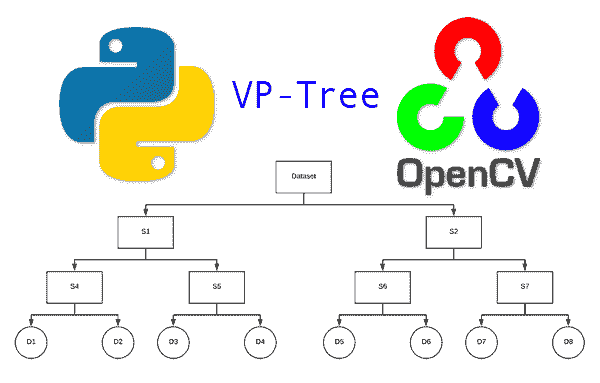](https://pyimagesearch.com/wp-content/uploads/2019/08/image_hashing_search_engine_header.png)

在本教程中，您将学习如何使用 OpenCV、Python 和 VP-tree 构建一个可伸缩的图像哈希搜索引擎。

**图像哈希算法用于:**

1.  仅使用一个*整数唯一量化图像的内容。*
2.  根据计算出的哈希在图像数据集中找到 ***重复的*** 或 ***近似重复的图像*** 。

早在 2017 年，我用 OpenCV 和 Python 写了一篇[图像哈希教程(这是本教程的 ***必读*** )。该指南向您展示了如何在给定的数据集中找到*相同/重复的*图像。](https://pyimagesearch.com/2017/11/27/image-hashing-opencv-python/)

然而，最初的教程— ***有一个可伸缩性问题，即它不能伸缩！***

为了找到*个近似重复的*个图像，我们最初的图像哈希方法需要我们执行*线性搜索*，将查询哈希与我们数据集中的每个单独的图像哈希进行比较。

在一个实际的、真实世界的应用程序中，速度太慢了——我们需要找到一种方法来将搜索减少到亚线性时间复杂度。

但是我们怎样才能如此显著地减少搜索时间呢？

答案是一种叫做 VP 树的特殊数据结构。

使用 VP-Tree，我们可以将搜索复杂度从 *O(n)* 降低到 *O(log n)* ，从而实现我们的次线性目标！

在本教程的剩余部分，你将学习如何:

1.  构建一个图像哈希搜索引擎，在数据集中找到*相同的*和*近似相同的*图像。
2.  利用一种专门的数据结构，称为 VP 树，可用于将图像哈希搜索引擎扩展到数百万张图像。

**要了解如何用 OpenCV 构建您的第一个图像哈希搜索引擎，*请继续阅读！***

## 用 VP-Trees 和 OpenCV 构建图像哈希搜索引擎

在本教程的第一部分，对于 PyImageSearch 的新手，我将回顾一下图像搜索引擎到底是什么。

然后，我们将讨论图像哈希和感知哈希的概念，包括如何使用它们来构建图像搜索引擎。

我们还将看看与图像哈希搜索引擎相关的问题，包括算法的复杂性。

***注意:**如果你还没有读过我的关于用 OpenCV 和 Python[图像散列的教程，**请务必现在就去读**。该指南是**在您继续此处之前的必读内容**。](https://pyimagesearch.com/2017/11/27/image-hashing-opencv-python/)*

从那里，我们将简要回顾有利点树(VP-Trees ),它可以用来*显著地*提高图像哈希搜索引擎的效率和性能。

利用我们的知识，我们将使用 VP-Trees 实现我们自己的定制图像哈希搜索引擎，然后检查结果。

### 什么是图像搜索引擎？

[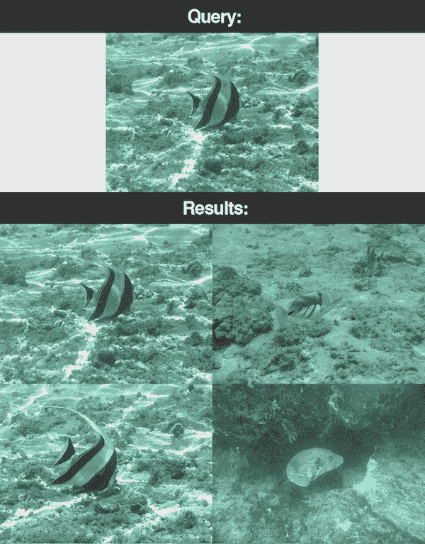](https://pyimagesearch.com/wp-content/uploads/2019/08/image_hashing_traditional_search_engine.png)

**Figure 1:** An example of an image search engine. A query image is presented and the search engine finds similar images in a dataset.

在这一部分，我们将回顾图像搜索引擎的概念，并引导您找到一些额外的资源。

PyImageSearch 植根于图片搜索引擎——这是我在 2014 年创建博客时的主要兴趣。这个教程对我来说是一个有趣的分享，因为我对作为计算机视觉主题的图像搜索引擎情有独钟。

图像搜索引擎很像文本搜索引擎，只是我们没有使用*文本*作为查询，而是使用*图像。*

当你使用 ***文字搜索引擎*** 时，如 Google、Bing 或 DuckDuckGo 等。，你输入你的搜索*查询*——一个单词或短语。感兴趣的索引网站作为*结果、*返回给你，理想情况下，你会找到你想要的。

类似地，对于一个 ***图像搜索引擎*** ，你呈现一个*查询*图像(不是文本单词/短语)。然后，图像搜索引擎仅基于图像的内容返回相似的图像结果。

当然，在任何类型的搜索引擎中都会发生很多事情——当我们今天构建图像搜索引擎时，请记住查询/结果这一关键概念。

**要了解更多关于图片搜索引擎的信息，我建议你参考以下资源:**

*   [*用 Python 和 OpenCV* 构建图像搜索引擎的完整指南](https://pyimagesearch.com/2014/12/01/complete-guide-building-image-search-engine-python-opencv/)
    *   一个伟大的指南，为那些想开始与足够的知识是危险的。
*   [图片搜索引擎博客类别](https://pyimagesearch.com/category/examples-of-image-search-engines/)
    *   这个类别链接返回我在 PyImageSearch 博客上的所有图片搜索引擎内容。
*   [PyImageSearch 大师](https://pyimagesearch.com/pyimagesearch-gurus/)
    *   我的旗舰计算机视觉课程有 13 个模块，其中一个模块致力于*基于内容的图像检索*(图像搜索引擎的一个好听的名字)。

阅读这些指南，对什么是图像搜索引擎有一个基本的了解，然后回到这篇文章来学习图像哈希搜索引擎。

### 什么是图像哈希/感知哈希？

[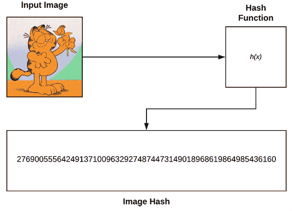](https://pyimagesearch.com/wp-content/uploads/2019/08/image_hashing_search_engine_hash_example.png)

**Figure 2:** An example of an image hashing function. *Top-left:* An input image. *Top-right:* An image hashing function. *Bottom:* The resulting hash value. We will build a basic image hashing search engine with VP-Trees and OpenCV in this tutorial.

**图像哈希**，也叫**感知哈希**，是这样的过程:

1.  检查图像的内容。
2.  构造散列值(即整数)，该散列值*仅基于图像的内容*唯一地量化输入图像*。*

 *使用图像哈希的一个好处是用于量化图像的存储空间非常小。

例如，假设我们有一个带有 3 个通道的 800x600px 的图像。如果我们使用 8 位无符号整数数据类型将整个图像存储在内存中，该图像将需要 1.44MB 的 RAM。

当然，在量化图像时，我们很少存储原始图像像素。

相反，我们将使用诸如关键点检测器和局部不变描述符(即 SIFT、SURF 等)的算法。).

应用这些方法通常可以为每幅图像产生 100 到 1000 个特征*。*

如果我们假设检测到 500 个关键点，每个关键点产生一个具有 32 位浮点数据类型的 128-d 的特征向量，我们将需要总共 0.256MB 来存储我们的数据集中每个单独图像的量化。

另一方面，图像哈希允许我们仅使用 32 位整数来量化图像，只需要 4 字节的内存！

[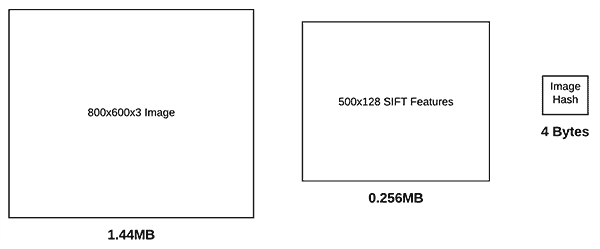](https://pyimagesearch.com/wp-content/uploads/2019/08/image_hashing_search_engine_sizes.png)

**Figure 3:** An image hash requires far less disk space in comparison to the original image bitmap size or image features (SIFT, etc.). We will use image hashes as a basis for an image search engine with VP-Trees and OpenCV.

再者，**图像哈希也应该是*可比的*** 。

假设我们计算三个输入图像的图像哈希，其中两个图像几乎相同:

[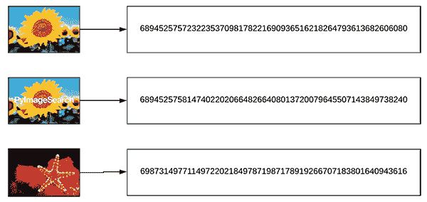](https://pyimagesearch.com/wp-content/uploads/2019/08/image_hashing_search_engine_hashes.png)

**Figure 4:** Three images with different hashes. The Hamming Distance between the top two hashes is closer than the Hamming distance to the third image. We will use a VP-Tree data structure to make an image hashing search engine.

为了比较我们的图像哈希，我们将使用汉明距离。在这种情况下，汉明距离用于比较两个整数之间的不同位数。

在实践中，这意味着我们在对两个整数进行异或运算时要计算 1 的个数。

因此，回到我们上面的三个输入图像，我们两个相似图像之间的汉明距离应该比第三个不太相似图像之间的汉明距离*小*(表示*更相似*):

[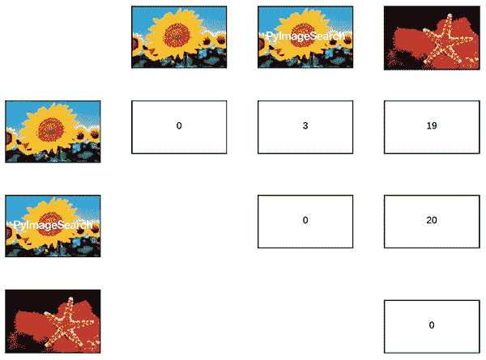](https://pyimagesearch.com/wp-content/uploads/2019/08/image_hashing_search_engine_distances.png)

**Figure 5:** The Hamming Distance between image hashes is shown. Take note that the Hamming Distance between the first two images is smaller than that of the first and third (or 2nd and 3rd). The Hamming Distance between image hashes will play a role in our image search engine using VP-Trees and OpenCV.

**再次注意，两幅图像之间的汉明距离*比第三幅图像之间的距离***小

*   两个哈希之间的*越小*，图像的*越相似*。
*   相反，两个哈希之间的海明距离越大，T2 越小，图像越相似。

还要注意相同图像之间的距离(即，沿着图 5 的**对角线)都是零——如果两个输入图像是*相同的*，则两个散列之间的汉明距离将是零，否则距离将是> 0，值越大表示相似性越小。**

有许多图像哈希算法，但最流行的一种算法叫做**差分哈希**，它包括四个步骤:

1.  **步骤#1:** 将输入图像转换为灰度。
2.  **步骤#2:** 将图像调整到固定尺寸， *N + 1 x N* ，忽略长宽比。通常我们设置 *N=8* 或 *N=16* 。我们使用 *N + 1* 作为行数，这样我们可以计算图像中相邻像素之间的差异(因此为*“差异散列”*)。
3.  第三步:计算差值。如果我们设置 *N=8* ，那么每行有 9 个像素，每列有 8 个像素。然后我们可以计算相邻列像素之间的差异，产生 *8* 差异。 *8 个差异的 8* 行(即 *8×8* )产生 *64 个*值。
4.  第四步:最后，我们可以建立散列。实际上，我们实际需要做的只是比较列的“大于”运算，产生二进制值。这些 *64* 二进制值被压缩成一个整数，形成我们最终的散列。

**通常，图像哈希算法用于在大型数据集中找到*个近似重复的图像*。**

**我已经在本教程** 中详细介绍了图像哈希技术[，所以如果这个概念对你来说是新的，我建议你在继续之前先阅读一下那个指南。](https://pyimagesearch.com/2017/11/27/image-hashing-opencv-python/)

### 什么是图像哈希搜索引擎？

[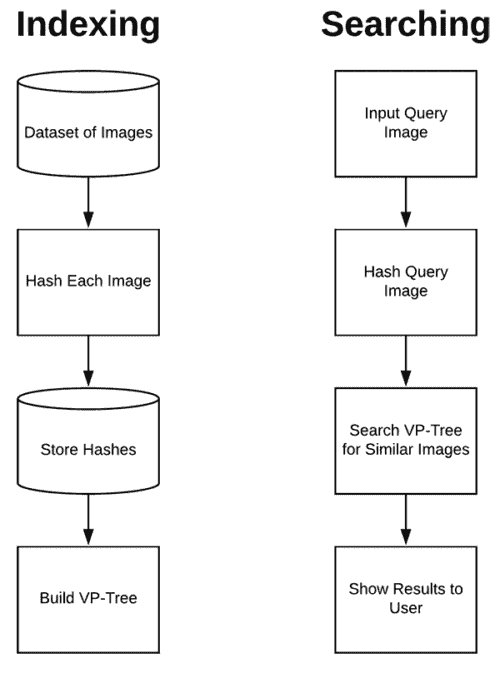](https://pyimagesearch.com/wp-content/uploads/2019/08/image_hashing_search_engine_steps.png)

**Figure 6:** Image search engines consist of images, an indexer, and a searcher. We’ll index all of our images by computing and storing their hashes. We’ll build a VP-Tree of the hashes. The searcher will compute the hash of the query image and search the VP tree for similar images and return the closest matches. Using Python, OpenCV, and [vptree](https://github.com/RickardSjogren/vptree), we can implement our image hashing search engine.

图像哈希搜索引擎由两个组件组成:

*   **索引:**获取图像的输入数据集，计算散列，并将它们存储在数据结构中，以便于快速、高效的搜索。
*   **搜索/查询:**接受来自用户的输入查询图像，计算散列，并在我们的索引数据集中找到所有近似相同的图像。

图像哈希搜索引擎的一个很好的例子是 [TinEye](https://tineye.com/) ，它实际上是一个**反向图像搜索引擎**。

反向图像搜索引擎:

1.  接受输入图像。
2.  在网络上查找该图像的所有近似副本，告诉您可以在哪里找到近似副本的网站/URL。

使用本教程，你将学会如何构建自己的 TinEye！

### 是什么让缩放图像哈希搜索引擎有问题？

构建图像哈希搜索引擎的最大问题之一是**可扩展性**——图像越多，执行搜索的时间就越长。

例如，假设我们有以下场景:

*   我们有一个 100 万张图片的数据集。
*   我们已经计算了这 1，000，000 幅图像的图像哈希。
*   一个用户走过来，给我们一张图片，然后让我们在数据集中找到所有几乎相同的图片。

你会如何着手进行搜索呢？

您会逐一遍历所有 1，000，000 个图像哈希，并将它们与查询图像的哈希进行比较吗？

不幸的是，这是行不通的。即使你假设每次汉明距离比较需要 0.00001 秒，总共有 1，000，000 张图片，**你也要用 *10 秒*来完成搜索——*对任何类型的搜索引擎来说都太慢了。***

相反，要构建一个可扩展的图像哈希搜索引擎，您需要利用专门的数据结构。

### 什么是 VP-tree，它们如何帮助扩展图像哈希搜索引擎？

[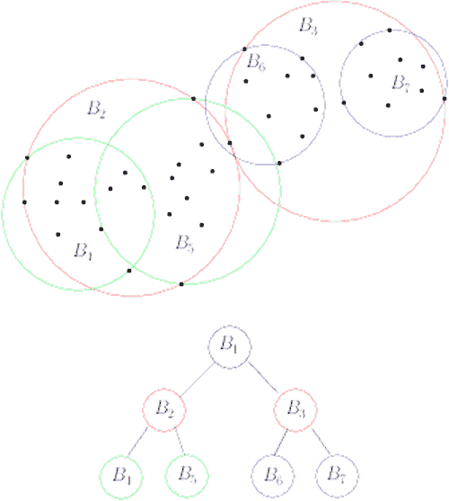](https://pyimagesearch.com/wp-content/uploads/2019/08/image_hashing_search_engine_vptrees.png)

**Figure 7:** We’ll use VP-Trees for our image hash search engine using Python and OpenCV. VP-Trees are based on a recursive algorithm that computes vantage points and medians until we reach child nodes containing an individual image hash. Child nodes that are closer together (i.e. smaller Hamming Distances in our case) are assumed to be more similar to each other. ([image source](https://www.lix.polytechnique.fr/~nielsen/BregmanProximity/))

为了扩展我们的图像哈希搜索引擎，我们需要使用一种特殊的数据结构:

*   减少我们的搜索从**线性复杂度**，`O(n)` …
*   …低至**子线性复杂度**，理想情况下为`O(log n)`。

为了完成这个任务，我们可以使用**优势点树(VP-Trees)** 。VP-Trees 是一种度量树，它通过选择空间中的给定位置(即“有利位置”)然后将数据点划分成两组来在度量空间中操作:

1.  在有利位置附近*的点*
2.  离有利位置*远*的点

然后，我们递归地应用这个过程，将这些点划分成越来越小的集合，从而创建一个树，其中树中的邻居具有*较小的距离*。

为了可视化构造 VP 树的过程，考虑下图:

[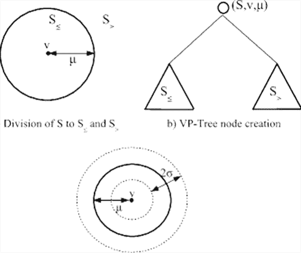](https://pyimagesearch.com/wp-content/uploads/2019/08/image_hashing_search_engine_vptree_steps.png)

**Figure 8:** A visual depiction of the process of building a VP-Tree (vantage point tree). We will use the [vptree](https://github.com/RickardSjogren/vptree) Python implementation by Richard Sjogren. ([image source](https://www.researchgate.net/figure/Illustration-of-the-VP- tree-partitioning-method-and-hierarchical- structure_fig2_220451935))

首先，我们选择空间中的一个点(表示为圆心的*v*)——我们称这个点为**有利点**。有利位置是树中离父有利位置最远的点*。*

然后，我们计算所有点的中位数， *X* 。

一旦有了μ，我们就把 *X* 分成两组， *S1* 和 *S2* :

*   所有距离为 *< = μ* 的点都属于 *S1* 。
*   所有距离为 *> μ* 的点都属于 *S2* 。

然后，我们递归地应用这个过程，构建一个树，直到我们剩下一个**子节点**。

子节点只包含一个数据点(在本例中，是一个单独的散列)。因此，树中距离较近的子节点具有:

1.  它们之间的距离越来越小。
2.  并且因此被假设为*比树中的其余数据点彼此更加相似*。

在递归地应用 VP-Tree 构造方法之后，我们最终得到一个数据结构，顾名思义，这是一个树:

[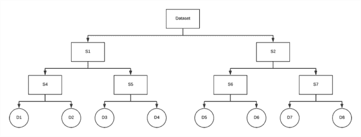](https://pyimagesearch.com/wp-content/uploads/2019/08/image_hashing_search_engine_built_vptree.png)

**Figure 9:** An example VP-Tree is depicted. We will use Python to build VP-Trees for use in an image hash search engine.

注意我们如何递归地将数据集的子集分成越来越小的子集，直到我们最终到达子节点。

VP-Trees 需要`O(n log n)`来构建，但是一旦我们构建了它，一个搜索只需要`O(log n)`，*，因此将我们的搜索时间减少到子线性复杂度！*

在本教程的后面，您将学习使用 Python 的 VP-Trees 来构建和扩展我们的图像哈希搜索引擎。

***注意:**这部分是对 VP-Trees 的一个温和的介绍。如果你有兴趣了解更多，我建议(1)查阅数据结构教科书，(2)遵循 Steve Hanov 的博客中的[指南，或者(3)阅读 Ivan Chen 的](http://stevehanov.ca/blog/?id=130)[文章](https://fribbels.github.io/vptree/writeup)。*

### 加州理工学院-101 数据集

[](https://pyimagesearch.com/wp-content/uploads/2019/08/image_hashing_search_engine_caltech101.jpg)

**Figure 10:** The [CALTECH-101 dataset](http://www.vision.caltech.edu/Image_Datasets/Caltech101/) consists of 101 object categories. Our image hash search engine using VP-Trees, Python, and OpenCV will use the CALTECH-101 dataset for our practical example.

我们今天要处理的数据集是 [CALTECH-101 数据集](http://www.vision.caltech.edu/Image_Datasets/Caltech101/)，它由 101 个类别的 9144 幅图像组成(每个类别有 40 到 800 幅图像)。

数据集*足够大*从图像哈希的介绍角度来看是有趣的，但*也足够小*以至于你可以运行本指南中的示例 Python 脚本，而不必等待你的系统完成对图像的咀嚼。

你可以从他们的[官方网页](http://www.vision.caltech.edu/Image_Datasets/Caltech101/)下载加州理工 101 数据集，或者你可以使用下面的`wget`命令:

```py
$ wget http://www.vision.caltech.edu/Image_Datasets/Caltech101/101_ObjectCategories.tar.gz
$ tar xvzf 101_ObjectCategories.tar.gz

```

### 项目结构

让我们检查一下我们的项目结构:

```py
$ tree --dirsfirst
.
├── pyimagesearch
│   ├── __init__.py
│   └── hashing.py
├── 101_ObjectCategories [9,144 images] 
├── queries
│   ├── accordion.jpg
│   ├── accordion_modified1.jpg
│   ├── accordion_modified2.jpg
│   ├── buddha.jpg
│   └── dalmation.jpg
├── index_images.py
└── search.py

```

`pyimagesearch`模块包含`hashing.py`，它包含三个散列函数。我们将在下面的*“实现我们的散列实用程序”*一节中回顾这些函数。

我们的数据集在`101_ObjectCategories/`文件夹(CALTECH-101)中，包含 101 个包含我们图像的子目录。请务必阅读上一节，了解如何下载数据集。

在`queries/`目录中有五个查询图像。我们将搜索与这些图像具有相似散列的图像。`accordion_modified1.jpg`和`accordion_modiied2.jpg`图像将对我们的 VP-Trees 图像哈希搜索引擎提出独特的挑战。

今天项目的核心在于两个 Python 脚本:`index_images.py`和`search.py`:

*   我们的**索引器**将计算所有 9144 张图片的哈希，并将哈希组织在一个 VP-Tree 中。这个索引将驻留在两个`.pickle`文件中:(1)所有计算散列的字典，和(2)VP-Tree。
*   **搜索器**将计算查询图像的散列，并通过汉明距离在 VP 树中搜索最近的图像。结果将返回给用户。

如果这听起来很多，不要担心！本教程将一步一步地分解每件事。

### 配置您的开发环境

对于这篇博文，您的开发环境需要安装以下软件包:

*   [OpenCV](https://pyimagesearch.com/2018/09/19/pip-install-opencv/)
*   [NumPy](https://www.numpy.org/)
*   [imutils](https://github.com/jrosebr1/imutils)
*   [VP Tree](https://github.com/RickardSjogren/vptree)(VP-Tree 数据结构的纯 Python 实现)

对我们来说幸运的是，一切都是 pip 可安装的。我给你的建议是跟随第一个 OpenCV 链接到[pip——在你系统的虚拟环境](https://pyimagesearch.com/2018/09/19/pip-install-opencv/)中安装 OpenCV。从这里开始，您只需在同一个环境中 pip-install 所有其他的东西。

它看起来会像这样:

```py
# setup pip, virtualenv, and virtualenvwrapper (using the "pip install OpenCV" instructions)
$ workon <env_name>
$ pip install numpy
$ pip install opencv-contrib-python
$ pip install imutils
$ pip install vptree

```

用虚拟环境的名称替换`<env_name>`。只有在您按照这些指令设置了`virtualenv`和`virtualenvwrapper` [后，`workon`命令才可用。](https://pyimagesearch.com/2018/09/19/pip-install-opencv/)

### 实现我们的图像哈希工具

在我们构建图像哈希搜索引擎之前，我们首先需要实现一些辅助工具。

打开项目结构中的`hashing.py`文件，插入以下代码:

```py
# import the necessary packages
import numpy as np
import cv2

def dhash(image, hashSize=8):
	# convert the image to grayscale
	gray = cv2.cvtColor(image, cv2.COLOR_BGR2GRAY)

	# resize the grayscale image, adding a single column (width) so we
	# can compute the horizontal gradient
	resized = cv2.resize(gray, (hashSize + 1, hashSize))

	# compute the (relative) horizontal gradient between adjacent
	# column pixels
	diff = resized[:, 1:] > resized[:, :-1]

	# convert the difference image to a hash
	return sum([2 ** i for (i, v) in enumerate(diff.flatten()) if v])

```

我们从导入 OpenCV 和 NumPy 开始(**第 2 行和第 3 行**)。

我们要看的第一个函数`dhash`，用于计算给定输入图像的差分散列。回想一下，我们的`dhash`需要四个步骤:(1)转换为灰度，(2)调整大小，(3)计算差异，(4)构建散列。让我们进一步分析一下:

1.  **第 7 行**将图像转换为 ***灰度*** 。
2.  **第 11 行** ***将*** 的图像调整为 *N + 1* 行乘 *N* 列，忽略纵横比。这确保了产生的图像散列将匹配相似的照片*，而不管它们的初始空间尺寸*。
3.  **第 15 行**计算相邻列像素间的 ***水平梯度差*** 。假设`hashSize=8`，将是 8 行 8 个差异(有 9 行允许 8 个比较)。因此，我们将得到 8×8=64 的 64 位散列。
4.  **第 18 行**将差分图像转换为 ***哈希*** 。

更多详情，请参考[这篇博文](https://pyimagesearch.com/2017/11/27/image-hashing-opencv-python/)。

接下来，我们来看看`convert_hash`函数:

```py
def convert_hash(h):
	# convert the hash to NumPy's 64-bit float and then back to
	# Python's built in int
	return int(np.array(h, dtype="float64"))

```

当我第一次为本教程编写代码时，我发现我们正在使用的 VP-Tree 实现在内部将点转换为 NumPy 64 位浮点。那没问题；然而，散列必须是整数，如果我们将它们转换成 64 位浮点数，它们就变成了不可散列的数据类型。为了克服 VP-Tree 实现的限制，我想到了`convert_hash` hack:

*   我们接受一个输入散列，`h`。
*   该散列然后被转换成 NumPy 64 位浮点数。
*   然后将 NumPy 浮点数转换回 Python 内置的整数数据类型。

这种方法确保了哈希在整个哈希、索引和搜索过程中得到一致的表示。

然后我们有了最后一个助手方法`hamming`，它用于计算两个整数之间的汉明距离:

```py
def hamming(a, b):
	# compute and return the Hamming distance between the integers
	return bin(int(a) ^ int(b)).count("1")

```

当在两个整数(**第 27 行**)之间进行异或运算(`^`)时，汉明距离只是 1 的数目的一个`count`。

### 实现我们的图像哈希索引器

在执行搜索之前，我们首先需要:

1.  循环我们的输入图像数据集。
2.  计算每个图像的差异散列。
3.  使用散列建立一棵 VP 树。

让我们现在就开始这个过程。

打开`index_images.py`文件并插入以下代码:

```py
# import the necessary packages
from pyimagesearch.hashing import convert_hash
from pyimagesearch.hashing import hamming
from pyimagesearch.hashing import dhash
from imutils import paths
import argparse
import pickle
import vptree
import cv2

# construct the argument parser and parse the arguments
ap = argparse.ArgumentParser()
ap.add_argument("-i", "--images", required=True, type=str,
	help="path to input directory of images")
ap.add_argument("-t", "--tree", required=True, type=str,
	help="path to output VP-Tree")
ap.add_argument("-a", "--hashes", required=True, type=str,
	help="path to output hashes dictionary")
args = vars(ap.parse_args())

```

**第 2-9 行**导入该脚本所需的包、函数和模块。特别是**的第 2-4 行**导入了我们的三个散列相关函数:`convert_hash`、`hamming`和`dhash`。**第 8 行**导入了我们将要使用的`vptree`实现。

接下来，**第 12-19 行**解析我们的命令行参数:

*   我们将要索引的图片的路径。
*   `--tree`:输出 VP-tree `.pickle`文件的路径，该文件将被序列化到磁盘。
*   `--hashes`:以`.pickle`格式存储的输出哈希字典的路径。

现在让我们计算所有图像的哈希:

```py
# grab the paths to the input images and initialize the dictionary
# of hashes
imagePaths = list(paths.list_images(args["images"]))
hashes = {}

# loop over the image paths
for (i, imagePath) in enumerate(imagePaths):
	# load the input image
	print("[INFO] processing image {}/{}".format(i + 1,
		len(imagePaths)))
	image = cv2.imread(imagePath)

	# compute the hash for the image and convert it
	h = dhash(image)
	h = convert_hash(h)

	# update the hashes dictionary
	l = hashes.get(h, [])
	l.append(imagePath)
	hashes[h] = l

```

**第 23 和 24 行**抓取图像路径并初始化我们的`hashes`字典。

**第 27 行**然后开始在所有`imagePaths`上循环。在循环内部，我们:

*   加载`image` ( **行 31** )。
*   计算并转换散列值，`h` ( **第 34 行和第 35 行**)。
*   获取所有图像路径的列表，`l`，具有相同的散列值(**第 38 行**)。
*   将此`imagePath`添加到列表中，`l` ( **第 39 行**)。
*   用 hash 作为键更新我们的字典，用相同的对应 hash 作为值更新我们的图像路径列表(**第 40 行**)。

从这里开始，我们构建我们的 VP 树:

```py
# build the VP-Tree
print("[INFO] building VP-Tree...")
points = list(hashes.keys())
tree = vptree.VPTree(points, hamming)

```

为了构建 VP-Tree，**第 44 行和第 45 行**向`VPTree`构造函数传递(1)一个数据点列表(即散列整数值本身)，以及(2)我们的距离函数(汉明距离方法)。

在内部，VP-Tree 计算所有输入`points`之间的汉明距离，然后构建 VP-Tree，使得具有较小距离的数据点(即，更相似的图像)在树空间中靠得更近。请务必参考*“什么是 VP-tree，它们如何帮助扩展图像哈希搜索引擎？”*剖面图和**图 7、8、9** 。

随着我们的`hashes`字典的填充和 VP-Tree 的构建，我们现在将它们作为`.pickle`文件序列化到磁盘:

```py
# serialize the VP-Tree to disk
print("[INFO] serializing VP-Tree...")
f = open(args["tree"], "wb")
f.write(pickle.dumps(tree))
f.close()

# serialize the hashes to dictionary
print("[INFO] serializing hashes...")
f = open(args["hashes"], "wb")
f.write(pickle.dumps(hashes))
f.close()

```

### 提取图像哈希并构建 VP 树

现在我们已经实现了索引脚本，让我们把它投入使用。确保您已经:

1.  使用上述说明下载了 CALTECH-101 数据集。
2.  使用本教程的 ***“下载”*** 部分下载源代码和示例查询图像。
3.  提取了。源代码的 zip 文件，并将目录更改为项目。

从那里，打开一个终端并发出以下命令:

```py
$ time python index_images.py --images 101_ObjectCategories \
	--tree vptree.pickle --hashes hashes.pickle
[INFO] processing image 1/9144
[INFO] processing image 2/9144
[INFO] processing image 3/9144
[INFO] processing image 4/9144
[INFO] processing image 5/9144
...
[INFO] processing image 9140/9144
[INFO] processing image 9141/9144
[INFO] processing image 9142/9144
[INFO] processing image 9143/9144
[INFO] processing image 9144/9144
[INFO] building VP-Tree...
[INFO] serializing VP-Tree...
[INFO] serializing hashes...

real	0m10.947s
user	0m9.096s
sys		0m1.386s

```

正如我们的输出所示，我们能够在 10 秒多一点的时间内散列所有 9，144 个图像。

运行脚本后检查项目目录，我们会发现两个`.pickle`文件:

```py
$ ls -l *.pickle
-rw-r--r--  1 adrianrosebrock  796620 Aug 22 07:53 hashes.pickle
-rw-r--r--  1 adrianrosebrock  707926 Aug 22 07:53 vptree.pickle

```

`hashes.pickle` (796.62KB)文件包含我们计算的散列，将散列整数值映射到具有相同散列的文件路径。`vptree.pickle` (707.926KB)是我们构建的 VP 树。

在下一节中，我们将使用这个 VP 树来执行查询和搜索。

### 实现我们的图像哈希搜索脚本

图像哈希搜索引擎的第二个组成部分是搜索脚本。搜索脚本将:

1.  接受输入查询图像。
2.  计算查询图像的哈希。
3.  使用查询散列搜索 VP 树，以找到所有重复/近似重复的图像。

现在让我们实现我们的图像哈希搜索器——打开`search.py`文件并插入以下代码:

```py
# import the necessary packages
from pyimagesearch.hashing import convert_hash
from pyimagesearch.hashing import dhash
import argparse
import pickle
import time
import cv2

# construct the argument parser and parse the arguments
ap = argparse.ArgumentParser()
ap.add_argument("-t", "--tree", required=True, type=str,
	help="path to pre-constructed VP-Tree")
ap.add_argument("-a", "--hashes", required=True, type=str,
	help="path to hashes dictionary")
ap.add_argument("-q", "--query", required=True, type=str,
	help="path to input query image")
ap.add_argument("-d", "--distance", type=int, default=10,
	help="maximum hamming distance")
args = vars(ap.parse_args())

```

**第 2-9 行**为我们的搜索脚本导入必要的组件。注意，我们再次需要`dhash`和`convert_hash`函数，因为我们必须为我们的`--query`图像计算散列。

**第 10-19 行**解析我们的命令行参数(前三行是必需的):

*   到我们在磁盘上预先构建的 VP 树的路径。
*   `--hashes`:我们在磁盘上预先计算的散列字典的路径。
*   `--query`:我们查询图像的路径。
*   `--distance`:用`10`的`default`设置哈希之间的最大汉明距离。如果您愿意，您可以覆盖它。

需要注意的是，`--distance`的*越大，*的*越多，VP-Tree 将进行比较，因此搜索器将会越慢。*在不影响结果质量的前提下，尽量让你的`--distance`尽可能的小*。*

 *接下来，我们将(1)加载我们的 VP-Tree + hashes 字典，以及(2)计算我们的`--query`图像的散列:

```py
# load the VP-Tree and hashes dictionary
print("[INFO] loading VP-Tree and hashes...")
tree = pickle.loads(open(args["tree"], "rb").read())
hashes = pickle.loads(open(args["hashes"], "rb").read())

# load the input query image
image = cv2.imread(args["query"])
cv2.imshow("Query", image)

# compute the hash for the query image, then convert it
queryHash = dhash(image)
queryHash = convert_hash(queryHash)

```

**第 23 行和第 24 行**加载预先计算的索引，包括 VP 树和`hashes`字典。

从那里，我们加载并显示`--query`图像(**第 27 行和第 28 行**)。

然后我们接受查询`image`并计算`queryHash` ( **第 31 行和第 32 行**)。

此时，是时候**使用我们的 VP 树:**执行搜索了

```py
# perform the search
print("[INFO] performing search...")
start = time.time()
results = tree.get_all_in_range(queryHash, args["distance"])
results = sorted(results)
end = time.time()
print("[INFO] search took {} seconds".format(end - start))

```

**第 37 行和第 38 行**通过向 VP 树查询相对于`queryHash`具有最小汉明距离的散列来执行搜索。`results`是`sorted`，所以“更相似的”散列在`results`列表的前面。

这两行都夹有时间戳，用于基准测试，其结果通过**行 40** 打印。

最后，我们将循环遍历`results`并显示它们中的每一个:

```py
# loop over the results
for (d, h) in results:
	# grab all image paths in our dataset with the same hash
	resultPaths = hashes.get(h, [])
	print("[INFO] {} total image(s) with d: {}, h: {}".format(
		len(resultPaths), d, h))

	# loop over the result paths
	for resultPath in resultPaths:
		# load the result image and display it to our screen
		result = cv2.imread(resultPath)
		cv2.imshow("Result", result)
		cv2.waitKey(0)

```

**线 43** 开始在`results`上循环:

*   当前散列值`h`的`resultPaths`取自散列字典(**第 45 行**)。
*   每个`result`图像在键盘上按键时显示(**第 50-54 行**)。

### 图像哈希搜索引擎结果

我们现在准备测试我们的图像搜索引擎！

但在此之前，请确保您已经:

1.  使用上述说明下载了 CALTECH-101 数据集。
2.  使用本教程的 ***“下载”*** 部分下载源代码和示例查询图像。
3.  提取了。源代码的 zip 文件，并将目录更改为项目。
4.  运行`index_images.py`文件以生成`hashes.pickle`和`vptree.pickle`文件。

完成上述所有步骤后，打开终端并执行以下命令:

```py
python search.py --tree vptree.pickle --hashes hashes.pickle \
	--query queries/buddha.jpg
[INFO] loading VP-Tree and hashes...
[INFO] performing search...
[INFO] search took 0.015203237533569336 seconds
[INFO] 1 total image(s) with d: 0, h: 8.162938100012111e+18

```

[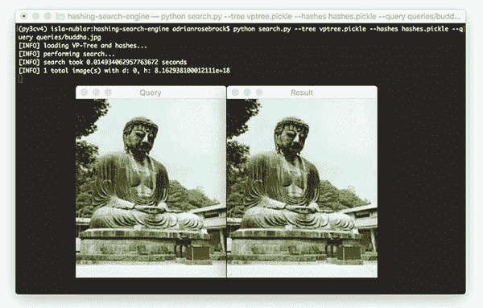](https://pyimagesearch.com/wp-content/uploads/2019/08/image_hashing_search_engine_result01.jpg)

**Figure 11:** Our Python + OpenCV image hashing search engine found a match in the VP-Tree in just 0.015 seconds!

在左边的*，*你可以看到我们输入的佛像查询图片。在右边的*，*你可以看到我们已经在索引数据集中找到了重复的图像。

搜索本身只用了 0.015 秒。

此外，注意输入查询图像和数据集中散列图像之间的距离为零，**表示两个图像是*相同的*。**

让我们再试一次，这次用一张斑点狗的图片:

```py
$ python search.py --tree vptree.pickle --hashes hashes.pickle \
	--query queries/dalmation.jpg 
[INFO] loading VP-Tree and hashes...
[INFO] performing search...
[INFO] search took 0.014827728271484375 seconds
[INFO] 1 total image(s) with d: 0, h: 6.445556196029652e+18

```

[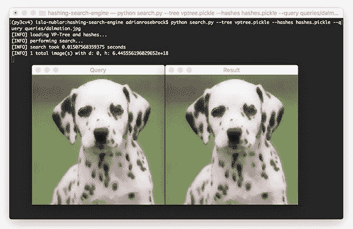](https://pyimagesearch.com/wp-content/uploads/2019/08/image_hashing_search_engine_result02.jpg)

**Figure 12:** With a Hamming Distance of 0, the Dalmation query image yielded an identical image in our dataset. We built an OpenCV + Python image hash search engine with VP-Trees successfully.

我们再次看到，我们的图像哈希搜索引擎在我们的索引数据集中找到了相同的斑点狗(由于汉明距离为零，我们知道这些图像是相同的)。

下一个例子是手风琴:

```py
$ python search.py --tree vptree.pickle --hashes hashes.pickle \
	--query queries/accordion.jpg 
[INFO] loading VP-Tree and hashes...
[INFO] performing search...
[INFO] search took 0.014187097549438477 seconds
[INFO] 1 total image(s) with d: 0, h: 3.380309217342405e+18

```

[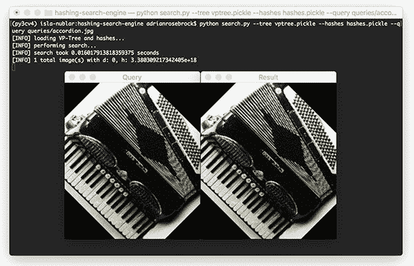](https://pyimagesearch.com/wp-content/uploads/2019/08/image_hashing_search_engine_result03.jpg)

**Figure 13:** An example of providing a query image and finding the best resulting image with an image hash search engine created with Python and OpenCV.

我们再次在索引数据集中找到了完全相同的匹配图像。

**我们知道我们的图像哈希搜索引擎非常适合相同的图像…**

***……但是稍微修改过的图像呢？***

我们的哈希搜索引擎性能还会好吗？

让我们试一试:

```py
$ python search.py --tree vptree.pickle --hashes hashes.pickle \
	--query queries/accordion_modified1.jpg 
[INFO] loading VP-Tree and hashes...
[INFO] performing search...
[INFO] search took 0.014217138290405273 seconds
[INFO] 1 total image(s) with d: 4, h: 3.380309217342405e+18

```

[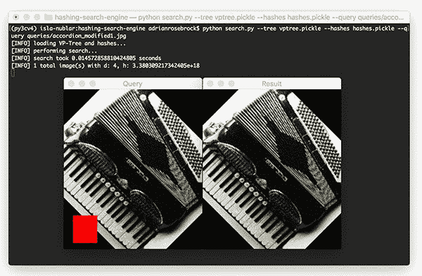](https://pyimagesearch.com/wp-content/uploads/2019/08/image_hashing_search_engine_result04-1.jpg)

**Figure 14:** Our image hash search engine was able to find the matching image despite a modification (red square) to the query image.

这里，我在手风琴式查询图像的左下角添加了一个红色小方块。这个加法会 ***改变差值哈希值！***

然而，如果你看一下输出结果，你会发现我们仍然能够检测到近似复制的图像。

通过比较哈希之间的汉明距离，我们能够找到近似重复的图像。哈希值的差异是 4，表示两个哈希值之间有 4 位不同。

接下来，让我们尝试第二个查询，**这个*比第一个***修改得更多

```py
$ python search.py --tree vptree.pickle --hashes hashes.pickle \
	--query queries/accordion_modified2.jpg 
[INFO] loading VP-Tree and hashes...
[INFO] performing search...
[INFO] search took 0.013727903366088867 seconds
[INFO] 1 total image(s) with d: 9, h: 3.380309217342405e+18

```

[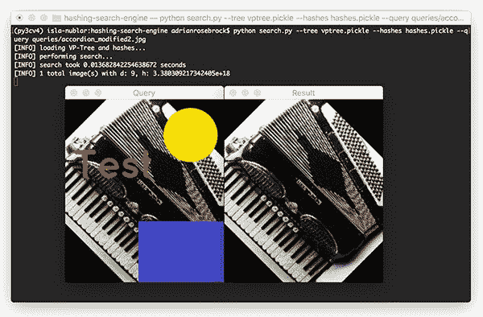](https://pyimagesearch.com/wp-content/uploads/2019/08/image_hashing_search_engine_result05.jpg)

**Figure 15:** On the *left* is the query image for our image hash search engine with VP-Trees. It has been modified with yellow and purple shapes as well as red text. The image hash search engine returns the correct resulting image (*right*) from an index of 9,144 in just 0.0137 seconds, proving the robustness of our search engine system.

尽管通过添加一个大的蓝色矩形、一个黄色圆圈和文本对查询进行了巨大的修改，但我们仍然能够在不到 0.014 秒的时间内找到数据集中几乎重复的图像！

每当您需要在数据集中查找重复或近似重复的图像时，一定要考虑使用图像哈希和图像搜索算法——如果使用正确，它们会非常强大！

## 摘要

在本教程中，您学习了如何使用 OpenCV 和 Python 构建一个基本的图像哈希搜索引擎。

为了构建一个可扩展的图像哈希搜索引擎，我们需要利用 VP- Trees，这是一种专门的度量树数据结构，它递归地划分点数据集，使得树中距离较近的节点比距离较远的节点更相似。

通过使用 VP-Trees，我们能够构建一个图像哈希搜索引擎，能够在 0.01 秒内找到数据集中的重复和近似重复的图像。

此外，我们证明了我们的哈希算法和 VP-Tree 搜索的组合能够在我们的数据集 ***中找到匹配，即使我们的查询图像被修改、损坏或更改！***

如果您正在构建一个计算机视觉应用程序，需要在大型数据集中快速找到重复或近似重复的图像，那么一定要尝试一下这种方法。

**要下载这篇文章的源代码，并在以后的文章在 PyImageSearch 上发表时得到通知，*只需在下面的表格中输入您的电子邮件地址！*****