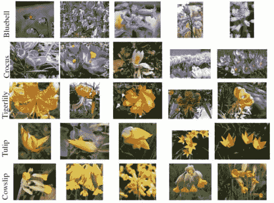

# 构建图像搜索引擎:索引数据集(第 2 步，共 4 步)

> 原文：<https://pyimagesearch.com/2014/02/10/building-an-image-search-engine-indexing-your-dataset-step-2-of-4/>

上周三的博文回顾了构建图像搜索引擎的第一步:[定义你的图像描述符](https://pyimagesearch.com/2014/01/29/building-an-image-search-engine-defining-your-image-descriptor-step-1-of-4/)。

然后，我们研究了图像的三个方面，这三个方面很容易描述:

*   **颜色:**表征图像颜色的图像描述符试图对图像每个通道中的像素强度分布进行建模。这些方法包括基本的颜色统计，如平均值、标准差和偏斜度，以及颜色直方图，包括[“平坦”和多维](https://pyimagesearch.com/2014/01/22/clever-girl-a-guide-to-utilizing-color-histograms-for-computer-vision-and-image-search-engines/ "Clever Girl: A Guide to Utilizing Color Histograms for Computer Vision and Image Search Engines")。
*   **纹理:**纹理描述符寻求对图像中对象的感觉、外观和整体触觉质量进行建模。一些(但不是全部)纹理描述符将图像转换成灰度，然后计算灰度共生矩阵(GLCM)并计算该矩阵上的统计，包括对比度、相关性和熵等。也存在更高级的纹理描述符，例如傅立叶和小波变换，但是仍然利用灰度图像。
*   **形状:**许多形状描述符方法依赖于提取图像中物体的轮廓(即轮廓)。一旦我们有了轮廓，我们就可以计算简单的统计来描述轮廓，这正是 OpenCV 的 Hu 矩所做的。这些统计可以用来表示图像中对象的形状(轮廓)。

***注:**如果你还没看过我的功能齐全的图片搜索引擎，那就来看看我的[如何使用《指环王》截图构建一个简单的图片搜索引擎](https://pyimagesearch.com/2014/01/27/hobbits-and-histograms-a-how-to-guide-to-building-your-first-image-search-engine-in-python/)。*

当选择一个描述符来从我们的数据集中提取特征时，我们必须问自己，我们对描述图像的哪些方面感兴趣？图像的颜色重要吗？外形呢？触觉质量(纹理)对返回相关结果重要吗？

让我们来看一下 17 种花的数据集的样本，这是一个包含 17 种花卉的数据集，例如:

[](https://pyimagesearch.com/wp-content/uploads/2014/01/flowers17sample.jpg)

**Figure 1** – A sample of the Flowers 17 Dataset. As we can see, some flowers might be indistinguishable using color or shape alone (i.e. Tulip and Cowslip have similar color distributions). Better results can be obtained by extracting both color and shape features.

如果我们想要描述这些图像，目的是构建一个图像搜索引擎，我会使用的第一个描述符是 **color** 。通过描述花瓣的颜色，我们的搜索引擎将能够返回相似色调的花。

然而，仅仅因为我们的图像搜索引擎将返回相似颜色的花，并不意味着所有的结果都是相关的。许多花可以有相同的颜色，但却是完全不同的种类。

为了确保从我们的花卉搜索引擎返回更多相似品种的花卉，我将探索描述花瓣的形状。

现在我们有两个描述符——**颜色**来描述花瓣的不同色调，以及**形状**来描述花瓣本身的轮廓。

结合使用这两个描述符，我们将能够为我们的 flowers 数据集构建一个简单的图像搜索引擎。

当然，我们需要知道如何索引我们的数据集。

现在，我们简单地知道我们将使用什么描述符来描述我们的图像。

但是我们如何将这些描述符应用到我们的整个数据集呢？

为了回答这个问题，今天我们将探索构建图像搜索引擎的第二步:**索引你的数据集**。

# 索引您的数据集

> **定义:**索引是通过应用图像描述符从数据集中的每个图像中提取特征来量化数据集的过程。通常，这些功能存储在磁盘上以备后用。

使用上面的 flowers 数据库示例，我们的目标是简单地遍历数据集中的每个图像，提取一些特征，并将这些特征存储在磁盘上。

原则上这是一个非常简单的概念，但实际上，它可能会变得非常复杂，具体取决于数据集的大小和规模。出于比较的目的，我们会说 Flowers 17 数据集是小的。它总共只有 1，360 幅图像(17 个类别 x 每个类别 80 幅图像)。相比之下，像 [TinEye](http://www.tineye.com/) 这样的图像搜索引擎拥有数十亿的图像数据集。

让我们从第一步开始:实例化您的描述符。

## 1.实例化您的描述符

在我的[如何构建图像搜索引擎指南](https://pyimagesearch.com/2014/01/27/hobbits-and-histograms-a-how-to-guide-to-building-your-first-image-search-engine-in-python/)中，我提到我喜欢将图像描述符抽象成类而不是函数。

此外，我喜欢在类的构造函数中放入相关的参数(比如直方图中的格数)。

我为什么要这么做呢？

使用类(在构造函数中带有描述符参数)而不是函数的原因是，它有助于确保将带有完全相同参数的完全相同的描述符应用于我的数据集中的每一幅图像。

如果我需要使用`cPickle`将我的描述符写入磁盘，并在以后再次加载它，比如当用户执行查询时，这就特别有用。

为了比较两个图像，您需要使用图像描述符以相同的方式表示它们。如果您的目的是比较两个图像的相似性，那么从一个图像中提取 32 个柱的直方图，然后从另一个图像中提取 128 个柱的直方图是没有意义的。

例如，让我们看看 Python 中通用图像描述符的框架代码:

```py
class GenericDescriptor:
	def __init__(self, paramA, paramB):
		# store the parameters for use in the 'describe' method
		self.paramA = paramA
		self.paramB = paramB

	def describe(self, image):
		# describe the image using self.paramA and self.paramB
		# as supplied in the constructor
		pass

```

你首先注意到的是`__init__ method`。这里我为描述符提供了相关的参数。

接下来，你看到了`describe method`。这个方法只有一个参数:我们想要描述的`image`。

每当我调用`describe`方法时，我知道在构造函数期间存储的参数将用于我的数据集中的每一幅图像。这确保了我的图像被一致地用相同的描述符参数描述。

虽然类与函数的争论现在看起来没什么大不了的，但是当你开始构建更大、更复杂的图像搜索引擎时，使用类有助于确保描述符的一致性。

## 2.串行还是并行？

这一步更好的标题可能是“单核还是多核？”

本质上，从数据集中的影像中提取要素是一项可以并行执行的任务。

根据数据集的大小和规模，利用多核处理技术在多个内核/处理器之间分割提取每个图像的特征向量可能是有意义的。

然而，对于使用计算简单的图像描述符(如颜色直方图)的小型数据集，使用多核处理不仅是多余的，还会增加代码的复杂性。

如果你刚刚开始使用计算机视觉和图像搜索引擎，这就特别麻烦。

为什么要增加额外的复杂性呢？调试具有多个线程/进程的程序比调试只有一个执行线程的程序困难得多。

除非您的数据集非常大，并且可以从多核处理中受益，否则我暂时不会将索引任务分成多个进程。现在还不值得头疼。不过，将来我肯定会写一篇博文，讨论让索引任务并行化的最佳实践方法。

## 3.写入磁盘

这一步似乎有点显而易见。但是，如果您要竭尽全力从数据集中提取要素，最好将索引写入磁盘以备后用。

对于小型数据集，使用简单的 Python 字典可能就足够了。关键字可以是图像文件名(假设您在数据集内有唯一的文件名)和使用图像描述符从该图像中提取的要素值。最后，您可以使用`cPickle`将索引转储到文件中。

如果您的数据集较大或者您计划进一步操作您的要素(即缩放、归一化、降维)，您最好使用 `[h5py](http://www.h5py.org/) 将您的要素写入磁盘。`

 `一种方法比另一种好吗？

老实说，这要看情况。

如果你刚刚开始使用计算机视觉和图像搜索引擎，并且你有一个小的数据集，我会暂时使用 Python 的内置字典类型和`cPickle`。

如果你有这个领域的经验，并且有 NumPy 的经验，那么我会建议尝试一下`h5py`，然后将其与上面提到的字典方法进行比较。

目前，我将在我的代码示例中使用`cPickle`;然而，在接下来的几个月里，我也将开始在我的例子中引入`h5py`。

# 摘要

今天，我们探讨了如何索引图像数据集。索引是从影像数据集中提取要素，然后将要素写入永久存储(如硬盘)的过程。

索引数据集的第一步是确定您将使用哪个图像描述符。你需要问你自己，你试图描述图像的哪一方面？颜色分布？质地和触感如何？图像中物体的形状？

在确定了要使用的描述符之后，需要遍历数据集，将描述符应用于数据集中的每一幅图像，提取特征向量。这可以通过利用多处理技术串行或并行完成。

最后，从数据集中提取要素后，需要将要素索引写入文件。简单的方法包括使用 Python 内置的字典类型和`cPickle`。更高级的选项包括使用`h5py`。

下周我们将进入构建图像搜索引擎的第三步:确定如何比较特征向量的相似性。`