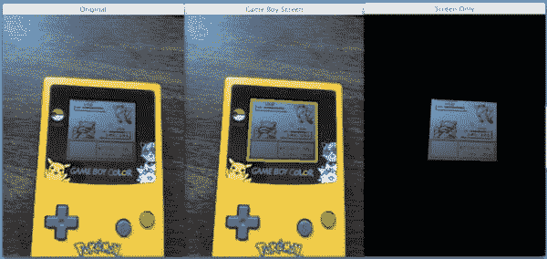
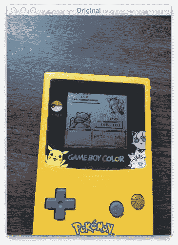
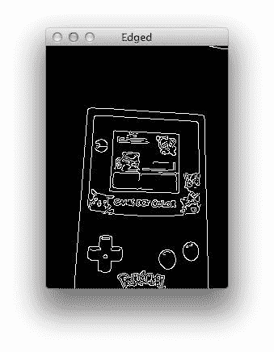

# 用 Python 构建 Pokedex:找到游戏男孩屏幕(第 4 步，共 6 步)

> 原文：<https://pyimagesearch.com/2014/04/21/building-pokedex-python-finding-game-boy-screen-step-4-6/>

[](https://pyimagesearch.com/wp-content/uploads/2014/03/finding-the-gameboy-screen.jpg)

**Figure 1:** Finding a Game Boy screen in an image using Python and OpenCV.

快速提问。

Pokedex 是如何工作的？

好吧，你只需简单地指出它是一个口袋妖怪，Pokedex 检查它的物理特征，口袋妖怪立即被识别出来。

在这种情况下，我们的智能手机摄像头就是我们的“Pokedex”。我们将智能手机对准我们的 Game Boy，拍下它的照片，我们的竞争对手 Pokemon 就被识别出来了(如果你不相信我，你可以通过观看[这个 YouTube 剪辑](https://www.youtube.com/watch?v=pDuBit0LWQ4)来看看我的 Pokedex 的运行情况)。

然而，我们的图像中有很多我们不需要的信息。

我们不需要游戏机的外壳。我们不需要 A、B、上、下、左、右、开始或选择按钮。我们当然不关心我们的图像是在什么背景上拍摄的。

我们只关心游戏机屏幕。

因为一旦我们找到游戏男孩屏幕，我们就可以裁剪出口袋妖怪，并进行识别。

在这篇文章中，我将向你展示如何使用 Python 和 OpenCV 自动**在图像中找到一个游戏机屏幕。具体来说，我们将使用 OpenCV 轮廓功能和`cv2`包中的`findContours`功能。**

 **准备好了吗？

开始了。

# 以前的帖子

这篇文章是正在进行的关于如何使用 Python、OpenCV、计算机视觉和图像处理技术构建现实生活中的 Pokedex 的系列博客文章的一部分。如果这是你正在阅读的系列文章中的第一篇，一定要花时间通读并检查一下。

能够在图像中找到 Game Boy 屏幕不仅仅是很酷，而且超级实用。我能想到 10-15 种不同的方法来建立一个小的移动应用程序业务，只需要使用游戏截图和移动技术，比如智能手机。

听起来有趣吗？不要害羞。给我发消息，我们可以多聊一会儿。

无论如何，在你读完这篇文章之后，回到这个系列的前几篇文章中去寻找一些额外的背景和信息。

*   **步骤 1:** [用 Python 构建 Pokedex:入门(第 1 步，共 6 步)](https://pyimagesearch.com/2014/03/10/building-pokedex-python-getting-started-step-1-6/)
*   **第二步:** [用 Python 构建 Pokedex:抓取口袋妖怪精灵(第二步，共六步)](https://pyimagesearch.com/2014/03/24/building-pokedex-python-scraping-pokemon-sprites-step-2-6/)
*   **第三步:** [用 Python 构建 Pokedex:使用形状描述符索引我们的精灵(第三步，共六步)](https://pyimagesearch.com/2014/04/07/building-pokedex-python-indexing-sprites-using-shape-descriptors-step-3-6/)

# 用 Python 构建 Pokedex:寻找游戏男孩屏幕

在我们能够*在图像中找到*游戏机屏幕之前，我们首先需要一个游戏机的图像:

[](https://pyimagesearch.com/wp-content/uploads/2014/03/gameboy-query.jpg)

**Figure 2:** Our original Game Boy query image. Our goal is to find the screen in this image.

顺便说一句，如果你想要原始的图像，请务必下载这篇文章底部的源代码。我已经附上了我的免费的 11 页图片搜索引擎资源指南 PDF，只是为了感谢你下载代码。

好了，现在我们有了我们的图像，我们的目标是找到我们的游戏男孩的屏幕并突出显示它，就像我们在这篇文章顶部的图 1 的中间截图中所做的那样。

启动您最喜欢的文本编辑器，创建一个名为`find_screen.py`的新文件。我们就要把手弄脏了:

```py
# import the necessary packages
from pyimagesearch import imutils
from skimage import exposure
import numpy as np
import argparse
import imutils
import cv2

# construct the argument parser and parse the arguments
ap = argparse.ArgumentParser()
ap.add_argument("-q", "--query", required = True,
	help = "Path to the query image")
args = vars(ap.parse_args())

```

**2-7 线**只处理我们包裹的进口。我们将利用`skimage`，但是在本系列的下一篇博客文章之前，我不会再讨论这个问题，所以现在不要担心这个问题。我们将像往常一样使用 NumPy，`argparse`解析我们的命令行参数，`cv2`包含我们的 OpenCV 绑定。

我们只需要一个命令行参数:`--query`指向我们的查询图像在磁盘上存储的路径。

接下来，让我们加载查询图像并开始处理图像:

```py
# load the query image, compute the ratio of the old height
# to the new height, clone it, and resize it
image = cv2.imread(args["query"])
ratio = image.shape[0] / 300.0
orig = image.copy()
image = imutils.resize(image, height = 300)

# convert the image to grayscale, blur it, and find edges
# in the image
gray = cv2.cvtColor(image, cv2.COLOR_BGR2GRAY)
gray = cv2.bilateralFilter(gray, 11, 17, 17)
edged = cv2.Canny(gray, 30, 200)

```

在第 17 行上，我们从磁盘上加载查询图像。我们使用`--query`命令行参数提供了查询图像的路径。

为了使我们的处理步骤更快，我们需要调整图像的大小。图像越小，处理速度越快。代价是，如果你把你的图像做得太小，那么你就会错过图像中有价值的细节。

在这种情况下，我们希望我们的新图像高度为 300 像素。在第 18 行的**上，我们计算旧高度到新高度的`ratio`，然后我们在第 19 行**的**上制作原始图像的克隆。最后，**第 20 行**处理将图像调整到 300 像素的高度。**

从那里，我们在第 24 行把我们的图像转换成灰度。然后，我们使用`cv2.bilateralFilter`功能稍微模糊图像。双边滤波具有去除图像中的噪声同时仍然保留实际边缘的良好特性。边缘很重要，因为我们需要它们来找到游戏男孩图像的屏幕。

最后，我们在第 26 行上应用 Canny 边缘检测。

顾名思义，Canny 边缘检测器可以在我们的图像中找到类似边缘的区域。看看下面的图片，明白我的意思:

[](https://pyimagesearch.com/wp-content/uploads/2014/03/edged.jpg)

**Figure 3:** Applying edge detection to our Game Boy image. Notice how we can clearly see the outline of the screen.

我们可以清楚地看到，有一个矩形边缘区域对应于我们的游戏男孩的屏幕。但是我们如何找到它呢？让我展示给你看:

```py
# find contours in the edged image, keep only the largest
# ones, and initialize our screen contour
cnts = cv2.findContours(edged.copy(), cv2.RETR_TREE, cv2.CHAIN_APPROX_SIMPLE)
cnts = imutils.grab_contours(cnts)
cnts = sorted(cnts, key = cv2.contourArea, reverse = True)[:10]
screenCnt = None

```

为了在我们的边缘图像中找到 Game Boy 屏幕，我们需要在图像中找到*轮廓*。轮廓是指物体的轮廓或剪影——在这种情况下，是指 Game Boy 屏幕的轮廓。

为了找到图像中的轮廓，我们需要第 30 行**的 OpenCV `cv2.findContours`函数。这个方法需要三个参数。第一个是我们想要找到边缘的图像。我们传递我们的边缘图像，确保首先克隆它。`cv2.findContours`方法是破坏性的(意味着它处理你传入的图像),所以如果你打算以后再次使用那个图像，一定要克隆它。第二个参数`cv2.RETR_TREE`告诉 OpenCV 计算轮廓之间的层次(关系)。我们也可以使用`cv2.RETR_LIST`选项。最后，我们告诉 OpenCV 使用`cv2.CV_CHAIN_APPROX_SIMPLE`压缩轮廓以节省空间。**

作为回报，`cv2.findContours`函数给我们一个已经找到的轮廓列表，但是由于不同版本的 OpenCV 处理轮廓的方式，我们必须在**第 31 行**解析它。

现在我们有了轮廓，我们将如何确定哪一个对应于游戏男孩屏幕呢？

[](https://pyimagesearch.com/practical-python-opencv/?src=in-post-finding-game-boy-screen)

嗯，我们应该做的第一件事是减少我们需要处理的轮廓的数量。我们知道，相对于图像中的其他区域，Game Boy 屏幕的面积相当大。**第 32 行**处理我们的轮廓排序，从最大到最小，通过使用`cv2.contourArea`计算轮廓的面积。我们现在只有 10 个最大的等高线。最后，我们初始化`screenCnt`，对应于**第 33 行**上的游戏男孩屏幕的轮廓。

我们现在准备确定哪个轮廓是 Game Boy 屏幕:

```py
# loop over our contours
for c in cnts:
	# approximate the contour
	peri = cv2.arcLength(c, True)
	approx = cv2.approxPolyDP(c, 0.015 * peri, True)

	# if our approximated contour has four points, then
	# we can assume that we have found our screen
	if len(approx) == 4:
		screenCnt = approx
		break

```

在**第 36 行**，我们开始遍历查询图像中的 10 个最大轮廓。然后，我们*使用`cv2.arcLength`和`cv2.approxPolyDP`来近似*轮廓。这些方法用于逼近轮廓的多边形曲线。为了逼近轮廓，您需要提供逼近精度等级。在这种情况下，我们使用轮廓周长的 1.5%。精度是一个需要考虑的重要值。如果您打算将这些代码应用到您自己的项目中，那么您可能不得不考虑精度值。

让我们停下来想想我们的游戏男孩屏幕的形状。

我们知道游戏机屏幕是长方形的。

我们知道矩形有四条边，因此有四个顶点。

在**行 43** 上，我们检查近似轮廓有多少个点。如果轮廓有四个点，它(可能)是我们的游戏机屏幕。假设轮廓有四个点，然后我们将近似轮廓存储在**线 44** 上。

我之所以能够进行这种四点检查，是因为我只需要研究非常少量的轮廓。我只保留了 10 个最大的轮廓，把其他的都扔掉了。另一个具有平方近似值的大轮廓的可能性非常低。

绘制我们的屏幕轮廓，我们可以清楚地看到，我们已经找到了游戏男孩屏幕:

如果你想自己画等高线，就用下面的代码:

 ```py`
cv2.drawContours(image, [screenCnt], -1, (0, 255, 0), 3) 
cv2.imshow("Game Boy Screen", image) 
cv2.waitKey(0)
```

这就是你找到游戏机屏幕的第一部分。

在这篇文章的第二步，我将向你展示如何在游戏机屏幕上进行透视变换，就像你从上面“俯视”你的游戏机一样。然后，我们将裁剪出真正的口袋妖怪。看看下面的截图就明白我的意思了:

# 摘要

在这篇文章中，我展示了如何使用 Python、OpenCV、计算机视觉和图像处理技术在图像中找到 Game Boy 屏幕。

我们对我们的图像执行边缘检测，使用 OpenCV 和`cv2.findContours`函数找到图像中最大的轮廓，并对它们进行近似以找到它们的基本形状。具有四个点的最大轮廓对应于我们的游戏男孩屏幕。

能够在图像中找到 Game Boy 屏幕不仅仅是很酷，而且超级实用。我可以想出 10-15 种不同的方法来建立一个小企业，只需要游戏截图和移动技术，比如智能手机。

听起来有趣吗？不要害羞。给我发消息，我们可以多聊一会儿。

在下一篇文章中，我将向你展示如何将透视变换应用到我们的 Game Boy 屏幕上，这样我们就可以鸟瞰图像了。从那里，我们可以很容易地裁剪出口袋妖怪。`**