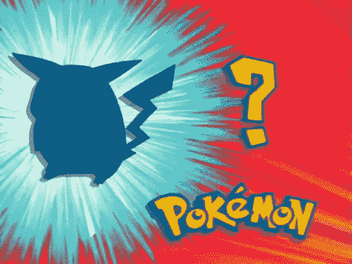
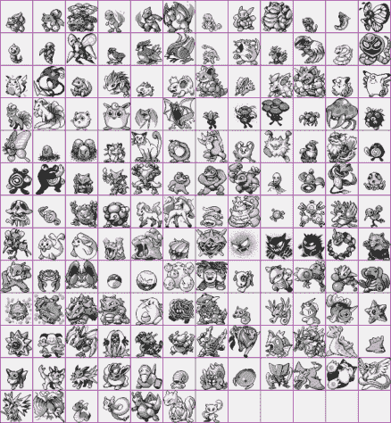
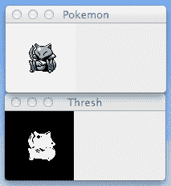
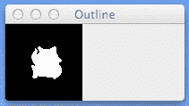

# 用 Python 构建 Pokedex:使用形状描述符索引我们的精灵(第 3 步，共 6 步)

> 原文：<https://pyimagesearch.com/2014/04/07/building-pokedex-python-indexing-sprites-using-shape-descriptors-step-3-6/>

[](https://pyimagesearch.com/wp-content/uploads/2014/03/whos-that-pokemon-pikachu.png)

Using shape descriptors to quantify an object is a lot like playing Who’s that Pokemon as a kid.

那么，我们的 Pokedex 将如何“知道”图像中的口袋妖怪是什么呢？我们将如何描述每一个口袋妖怪？我们要描述口袋妖怪的颜色吗？质地？还是外形？

你还记得小时候玩的那个口袋妖怪是谁吗？

你仅仅根据它的轮廓和轮廓就能识别出口袋妖怪。

我们将在这篇文章中应用同样的原则，并使用形状描述符量化口袋妖怪的轮廓。

你可能已经熟悉一些形状描述符，比如 Hu 矩。今天我要给大家介绍一个更强大的形状描述符——Zernike 矩，基于正交于单位圆的 Zernike 多项式。

听起来很复杂？

相信我，真的不是。只用几行代码，我将向您展示如何轻松计算 Zernike 矩。

# 以前的帖子

这篇文章是正在进行的关于如何使用 Python、OpenCV、计算机视觉和图像处理技术构建现实生活中的 Pokedex 的系列博客文章的一部分。如果这是你正在阅读的系列文章中的第一篇，请继续通读(这里有很多关于如何利用形状描述符的精彩内容)，然后返回到之前的文章中添加一些内容。

*   **步骤 1:** [用 Python 构建 Pokedex:入门(第 1 步，共 6 步)](https://pyimagesearch.com/2014/03/10/building-pokedex-python-getting-started-step-1-6/)
*   **第二步:** [用 Python 构建 Pokedex:抓取口袋妖怪精灵(第二步，共六步)](https://pyimagesearch.com/2014/03/24/building-pokedex-python-scraping-pokemon-sprites-step-2-6/)

# 用 Python 构建 Pokedex:使用形状描述符索引我们的精灵

[](https://pyimagesearch.com/wp-content/uploads/2014/03/pokemonsprites.png)

**Figure 1:** Our database of Pokemon Red, Blue, and Green sprites.

此时，我们已经有了口袋妖怪精灵图像数据库。我们收集、抓取并下载了我们的精灵，但是现在我们需要根据它们的轮廓(也就是它们的形状)来量化它们。

还记得玩“那个口袋妖怪是谁？”小时候？这就是我们的形状描述符将为我们做的。

对于那些没有看过口袋妖怪(或者可能需要他们的记忆慢跑)的人来说，这篇文章顶部的图像是口袋妖怪电视节目的截图。在进入广告时段之前，一个像这样的屏幕会弹出口袋妖怪的轮廓。目标是仅根据轮廓猜测口袋妖怪的名字。

这基本上就是我们的 Pokedex 将要做的——玩那个口袋妖怪是谁，但是是以一种自动化的方式。以及计算机视觉和图像处理技术。

## 泽尔尼克矩

在深入研究大量代码之前，让我们先快速回顾一下 Zernike moments。

图像矩用于描述图像中的对象。使用图像矩，您可以计算诸如对象的面积、质心(对象的中心，以 x、y 坐标表示)以及关于对象如何旋转的信息等值。通常，我们基于图像的轮廓或外形来计算图像矩，但这不是必需的。

OpenCV 提供了`[HuMoments](http://docs.opencv.org/modules/imgproc/doc/structural_analysis_and_shape_descriptors.html#humoments)`函数，可以用来描述物体的结构和形状。然而，一个更强大的形状描述符可以在`[mahotas](http://luispedro.org/software/mahotas)`包— `[zernike_moments](http://mahotas.readthedocs.org/en/latest/api.html#mahotas.features.zernike_moments)`中找到。与 Hu 矩类似，Zernike 矩用于描述物体的形状；然而，由于 Zernike 多项式彼此正交，所以矩之间没有冗余信息。

使用 Zernike 矩进行形状描述时，需要注意的一点是图像中对象的缩放和平移。根据图像在图像中的转换位置，您的 Zernike 时刻会有很大不同。同样，根据图像的大小(即物体的缩放比例)，Zernike 矩也不会相同。然而，Zernike 矩的大小与对象的旋转无关，这在处理形状描述符时是一个非常好的特性。

为了避免描述符基于图像的平移和缩放而具有不同的值，我们通常首先执行分割。也就是说，我们将前景(图像中我们感兴趣的对象)与背景(“噪声”，或图像中我们不想描述的部分)分割开来。一旦我们有了分割，我们就可以在对象周围形成一个紧密的包围盒并将其裁剪掉，从而获得平移不变性。

最后，我们可以将对象的大小调整为常数 *NxM* 像素，从而获得缩放不变性。

由此，直接应用 Zernike 矩来表征物体的形状。

正如我们将在这一系列博文的后面看到的，我将在应用 Zernike 矩之前利用缩放和平移不变性。

## 泽尼克描述符

好了，概述够了。让我们动手写一些代码。

```py
# import the necessary packages
import mahotas

class ZernikeMoments:
	def __init__(self, radius):
		# store the size of the radius that will be
		# used when computing moments
		self.radius = radius

	def describe(self, image):
		# return the Zernike moments for the image
		return mahotas.features.zernike_moments(image, self.radius)

```

正如你从[霍比特人和直方图](https://pyimagesearch.com/2014/01/27/hobbits-and-histograms-a-how-to-guide-to-building-your-first-image-search-engine-in-python/)的帖子中可能知道的，我倾向于将我的图像描述符定义为类而不是函数。这是因为你很少单独从一幅图像中提取特征。相反，您可以从影像数据集中提取要素。并且您很可能对不同图像的描述符使用完全相同的参数。

例如，如果您的目的是比较图像#1 和图像#2，那么从图像# 1 中提取 32 个面元的灰度直方图和从图像# 2 中提取 16 个面元的灰度直方图是没有意义的。相反，您利用相同的参数来确保在整个数据集上有一个*一致的表示*。

也就是说，让我们来看看这段代码:

*   **第 2 行:**这里我们导入的是`mahotas`包，里面包含了很多有用的图像处理功能。该包还包含我们的 Zernike moments 的实施。
*   **第 4 行:**让我们为描述符定义一个类。我们就叫它`ZernikeMoments`。
*   **第 5-8 行:**我们需要一个构造函数给我们的`ZernikeMoments`类。它只需要一个参数——以像素为单位的多项式的`radius`。半径越大，计算中包含的像素就越多。这是一个重要的参数，如果您在本系列博客帖子之外使用 Zernike moments，您可能需要对其进行调整和修改，以获得足够的性能结果。
*   **第 10-12 行:**这里我们定义了`describe`方法，它量化了我们的图像。这个方法需要描述一个图像，然后调用`zernike_moments`的`mahotas`实现，用**行 5** 中提供的指定`radius`计算矩。

总的来说，这段代码不多。它主要是对`zernike_moments`的`mahotas`实现的包装。但是正如我所说的，我喜欢将我的描述符定义为类而不是函数，以确保参数使用的一致性。

接下来，我们将通过量化每个口袋妖怪精灵的形状来索引我们的数据集。

## 索引我们的口袋妖怪精灵

现在我们已经定义了形状描述符，我们需要将它应用到数据库中的每个口袋妖怪精灵。这是一个相当简单的过程，所以我会让代码做大部分的解释。让我们打开我们最喜欢的编辑器，创建一个名为`index.py`的文件，然后开始工作:

```py
# import the necessary packages
from pyimagesearch.zernikemoments import ZernikeMoments
from imutils.paths import list_images
import numpy as np
import argparse
import pickle
import imutils
import cv2

# construct the argument parser and parse the arguments
ap = argparse.ArgumentParser()
ap.add_argument("-s", "--sprites", required = True,
	help = "Path where the sprites will be stored")
ap.add_argument("-i", "--index", required = True,
	help = "Path to where the index file will be stored")
args = vars(ap.parse_args())

# initialize our descriptor (Zernike Moments with a radius
# of 21 used to characterize the shape of our pokemon) and
# our index dictionary
desc = ZernikeMoments(21)
index = {}

```

第 2-8 行处理导入我们需要的包。为了便于组织，我将我们的`ZernikeMoments`类放在了`pyimagesearch`子模块中。在构造多维数组时，我们将使用`numpy`，`argparse`解析命令行参数，`pickle`将索引写入文件，`glob`获取 sprite 图像的路径，而`cv2`用于 OpenCV 函数。

然后，**第 11-16 行**解析我们的命令行参数。`--sprites`开关是我们收集的口袋妖怪精灵目录的路径，`--index`指向我们的索引文件将被存储的地方。

第 21 行处理初始化我们的`ZernikeMoments`描述符。我们将使用 21 像素的半径。经过几次实验，我确定了 21 个像素的值，并确定了哪个半径获得了最好的性能结果。

最后，我们在第 22 行的**上初始化我们的`index`。我们的索引是一个内置的 Python 字典，其中的键是 Pokemon sprite 的文件名，值是计算出的 Zernike 矩。在这种情况下，所有的文件名都是唯一的，所以字典是一个很好的选择，因为它很简单。**

量化我们口袋妖怪精灵的时间到了:

```py
# loop over the sprite images
for spritePath in list_images(args["sprites"]):
	# parse out the pokemon name, then load the image and
	# convert it to grayscale
	pokemon = spritePath[spritePath.rfind("/") + 1:].replace(".png", "")
	image = cv2.imread(spritePath)
	image = cv2.cvtColor(image, cv2.COLOR_BGR2GRAY)

	# pad the image with extra white pixels to ensure the
	# edges of the pokemon are not up against the borders
	# of the image
	image = cv2.copyMakeBorder(image, 15, 15, 15, 15,
		cv2.BORDER_CONSTANT, value = 255)

	# invert the image and threshold it
	thresh = cv2.bitwise_not(image)
	thresh[thresh > 0] = 255

```

现在我们准备从数据集中提取 Zernike 矩。让我们把这段代码拆开，并确保我们理解发生了什么:

*   **第 25 行:**我们使用`glob`来获取所有口袋妖怪精灵图像的路径。我们所有的精灵都有一个. png 的文件扩展名。如果你以前从未使用过`glob`,这是一个非常简单的方法来获取一组具有公共文件名或扩展名的图像的路径。现在我们有了图像的路径，我们一个接一个地循环它们。
*   **第 28 行:**我们首先要做的是从文件名中提取出口袋妖怪的名字。这将作为索引字典中的唯一键。
*   第 29 行和第 30 行:这段代码非常简单明了。我们从磁盘上加载当前图像，并将其转换为灰度。
*   **第 35 行和第 36 行:**就我个人而言，我发现`copyMakeBorder`函数的名字非常令人困惑。名字本身并不能真正描述它的功能。实际上，`copyMakeBorder`沿着图像的北、南、东、西方向“填充”图像。我们传入的第一个参数是口袋妖怪精灵。然后，我们用 15 个白色(255)像素在所有方向填充这个图像。这一步不是必须的，但它让你对第 39 行**的阈值有更好的理解。**
*   第 39 行和第 40 行:正如我提到的，在应用 Zernike 矩之前，我们需要口袋妖怪图像的轮廓(或遮罩)。为了找到轮廓，我们需要应用分割，丢弃图像的背景(白色)像素，只关注口袋妖怪本身。这实际上很简单——我们需要做的就是翻转像素值(黑色像素变成白色，白色像素变成黑色)。然后，任何值大于零(黑色)的像素被设置为 255(白色)。

看看我们下面的阈值图像:

[](https://pyimagesearch.com/wp-content/uploads/2014/03/pokemon-thresholded.png)

**Figure 2:** Our Abra sprite is pictured on the *top* and the thresholded image on the *bottom*.

这个过程给了我们口袋妖怪的面具。现在我们需要面具最外面的轮廓——口袋妖怪的实际轮廓。

```py
	# initialize the outline image, find the outermost
	# contours (the outline) of the pokemone, then draw
	# it
	outline = np.zeros(image.shape, dtype = "uint8")
	cnts = cv2.findContours(thresh.copy(), cv2.RETR_EXTERNAL,
		cv2.CHAIN_APPROX_SIMPLE)
	cnts = imutils.grab_contours(cnts)
	cnts = sorted(cnts, key = cv2.contourArea, reverse = True)[0]
	cv2.drawContours(outline, [cnts], -1, 255, -1)

```

首先，我们需要一个空白的图像来存储我们的轮廓——我们在第 45 行的**上添加了一个名为`outline`的变量，并用零填充它，其宽度和高度与我们的精灵图像相同。**

然后，我们在**线路 46 和 47** 上给`cv2.findContours`打电话。我们传入的第一个参数是我们的阈值图像，后面是一个标志`cv2.RETR_EXTERNAL`,告诉 OpenCV 只查找最外面的轮廓。最后，我们使用`cv2.CHAIN_APPROX_SIMPLE`标志告诉 OpenCV 压缩和逼近轮廓以节省内存。

**第 48 行**处理各种版本 OpenCV 的轮廓解析。

正如我提到的，我们只对最大的轮廓感兴趣，这对应于口袋妖怪的轮廓。因此，在第 49 行**上，我们根据面积对轮廓进行降序排序。我们只保留最大的轮廓，而丢弃其他轮廓。**

最后，我们使用`cv2.drawContours`功能在轮廓图像上绘制轮廓。轮廓被绘制为带有白色像素的填充蒙版:

[](https://pyimagesearch.com/wp-content/uploads/2014/03/pokemon-outline.png)

**Figure 3:** Outline of our Abra. We will be using this image to compute our Zernike moments.

我们将使用这个轮廓图像来计算我们的泽尼克时刻。

计算轮廓的 Zernike 矩实际上很容易:

```py
	# compute Zernike moments to characterize the shape
	# of pokemon outline, then update the index
	moments = desc.describe(outline)
	index[pokemon] = moments

```

在第 54 行的**上，我们调用了`ZernikeMoments`类中的`describe`方法。我们需要做的就是传入图像的轮廓，剩下的就交给`describe`方法了。作为回报，我们得到了用于表征和量化口袋妖怪形状的 Zernike 矩。**

那么我们如何量化和表现口袋妖怪的形状呢？

让我们来调查一下:

```py
>>> moments.shape
(25,)

```

这里我们可以看到我们的特征向量是 25 维的(意味着我们的列表中有 25 个值)。这 25 个值代表了口袋妖怪的轮廓。

我们可以像这样查看 Zernike 矩特征向量的值:

```py
>>> moments
[ 0.31830989  0.00137926  0.24653755  0.03015183  0.00321483  0.03953142
  0.10837637  0.00404093  0.09652134  0.005004    0.01573373  0.0197918
  0.04699774  0.03764576  0.04850296  0.03677655  0.00160505  0.02787968
  0.02815242  0.05123364  0.04502072  0.03710325  0.05971383  0.00891869
  0.02457978]

```

所以你有它！口袋妖怪大纲现在只使用 25 个浮点值进行量化！使用这 25 个数字，我们将能够区分所有最初的 151 个口袋妖怪。

最后在第 55 行的**上，我们用口袋妖怪的名字作为关键字，用我们计算的特征作为我们的值来更新我们的索引。**

我们需要做的最后一件事是将我们的索引转储到文件中，以便在执行搜索时使用:

```py
# write the index to file
f = open(args["index"], "wb")
f.write(pickle.dumps(index))
f.close()

```

要执行我们的脚本来索引我们所有的口袋妖怪精灵，发出以下命令:

```py
$ python index.py --sprites sprites --index index.cpickle

```

一旦脚本完成执行，我们所有的口袋妖怪将在形状方面量化。

在这一系列博客文章的后面，我将向您展示如何从 Game Boy 屏幕中自动提取一个口袋妖怪，然后将其与我们的索引进行比较。

# 摘要

在这篇博文中，我们探索了 Zernike 矩以及它们如何被用来描述和量化物体的形状。

在这种情况下，我们使用 Zernike 矩来量化最初 151 个口袋妖怪的轮廓。想到这个最简单的方法就是玩“那个口袋妖怪是谁？”小时候。给你一个口袋妖怪的轮廓，然后你必须只用轮廓猜口袋妖怪是什么。我们在做同样的事情——只不过我们是自动做的。

这个描述和量化一组图像的过程称为“索引”。

既然我们已经量化了口袋妖怪，我将在这一系列帖子的后面向你展示如何搜索和识别口袋妖怪。