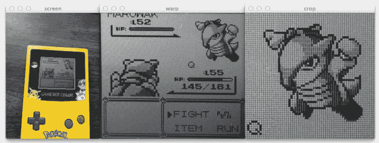
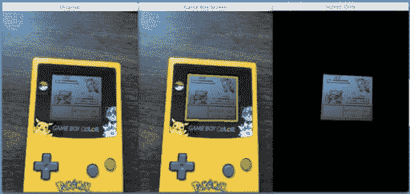
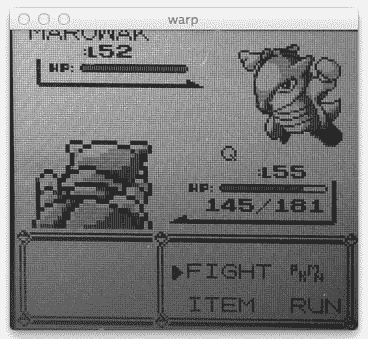
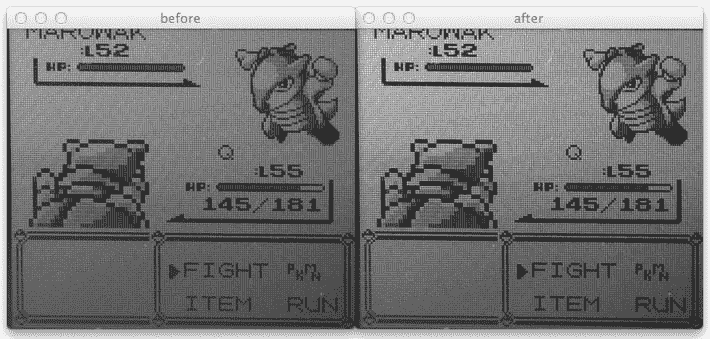
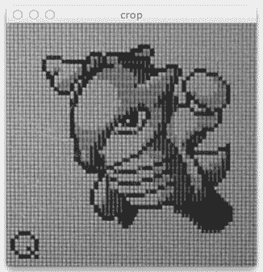

# 用 Python 构建 Pokedex:OpenCV 和透视变形(第 5 步，共 6 步)

> 原文：<https://pyimagesearch.com/2014/05/05/building-pokedex-python-opencv-perspective-warping-step-5-6/>

[](https://pyimagesearch.com/wp-content/uploads/2014/04/python-opencv-perspective-transform.jpg)

**Figure 1:** Performing a perspective transformation using Python and OpenCV on the Game Boy screen and cropping out the Pokemon.

我们离完成现实生活中的 Pokedex 越来越近了！

在我之前的博客文章中，我向你展示了如何使用 Python 和 OpenCV 在图像中找到一个游戏机屏幕。

这篇文章将向你展示如何应用扭曲变换来获得 Game Boy 屏幕的“鸟瞰图”。从那里，我们将能够裁剪出真正的口袋妖怪，并将其输入我们的口袋妖怪识别算法。

# 以前的帖子

这篇文章是正在进行的关于如何使用 Python、OpenCV、计算机视觉和图像处理技术构建现实生活中的 Pokedex 的系列博客文章的一部分。如果这是你正在阅读的系列文章中的第一篇，一定要看看！但是在你读完之后，一定要回去看看以前的帖子——那里有大量令人敬畏的计算机视觉和图像处理内容。

最后，如果你有任何问题，请随时给我发电子邮件。我很乐意聊天。

*   **步骤 1:** [用 Python 构建 Pokedex:入门(第 1 步，共 6 步)](https://pyimagesearch.com/2014/03/10/building-pokedex-python-getting-started-step-1-6/)
*   **第二步:** [用 Python 构建 Pokedex:抓取口袋妖怪精灵(第二步，共六步)](https://pyimagesearch.com/2014/03/24/building-pokedex-python-scraping-pokemon-sprites-step-2-6/)
*   **第三步:** [用 Python 构建 Pokedex:使用形状描述符索引我们的精灵(第三步，共六步)](https://pyimagesearch.com/2014/04/07/building-pokedex-python-indexing-sprites-using-shape-descriptors-step-3-6/)
*   **第 4 步:** [用 Python 构建 Pokedex:寻找游戏男孩屏幕(第 4 步，共 6 步)](https://pyimagesearch.com/2014/04/21/building-pokedex-python-finding-game-boy-screen-step-4-6/)

# 在 Python 中构建 Pokedex:OpenCV 透视转换示例

当我们结束了[上一篇关于用 Python 构建 Pokedex 的文章](https://pyimagesearch.com/2014/04/21/building-pokedex-python-finding-game-boy-screen-step-4-6/)时，我们能够通过应用边缘检测、找到轮廓、然后近似轮廓来找到我们的游戏男孩屏幕，就像这样:

[](https://pyimagesearch.com/wp-content/uploads/2014/03/finding-the-gameboy-screen.jpg)

**Figure 2:** Finding a Game Boy screen in an image using Python and OpenCV.

然而，你可能会注意到 Game Boy 的屏幕有点倾斜——屏幕肯定是向右倾斜的。

屏幕的视角也不对。理想情况下，我们希望 Game Boy 屏幕有一个自上而下的鸟瞰图，如图 1 所示。

我们将如何实现这一目标？

让我们跳到一些代码中。

我们将基于[前一篇文章](https://pyimagesearch.com/2014/04/21/building-pokedex-python-finding-game-boy-screen-step-4-6/)中的代码进行构建，所以如果我们看起来像是跳到了一个文件的中间，那是因为我们确实是这样。

```py
# now that we have our screen contour, we need to determine
# the top-left, top-right, bottom-right, and bottom-left
# points so that we can later warp the image -- we'll start
# by reshaping our contour to be our finals and initializing
# our output rectangle in top-left, top-right, bottom-right,
# and bottom-left order
pts = screenCnt.reshape(4, 2)
rect = np.zeros((4, 2), dtype = "float32")

# the top-left point has the smallest sum whereas the
# bottom-right has the largest sum
s = pts.sum(axis = 1)
rect[0] = pts[np.argmin(s)]
rect[2] = pts[np.argmax(s)]

# compute the difference between the points -- the top-right
# will have the minumum difference and the bottom-left will
# have the maximum difference
diff = np.diff(pts, axis = 1)
rect[1] = pts[np.argmin(diff)]
rect[3] = pts[np.argmax(diff)]

# multiply the rectangle by the original ratio
rect *= ratio

```

在第 53 行上，我们正在重塑与屏幕轮廓相对应的轮廓。轮廓有四个点，屏幕矩形区域的四个点。我们只是重塑了点的 NumPy 数组，使它们更容易处理。

为了应用透视变换，我们需要知道轮廓的左上角、右上角、右下角和左下角。然而，仅仅因为我们有对应于 Game Boy 屏幕的轮廓，我们就不能保证点的*顺序*。不能保证左上角的点是轮廓列表中的第一个点。这可能是第二点。还是第四点。

为了解决这个问题，我们必须对这些要点进行严格的排序。我们从第 54 行的**开始，初始化我们的矩形`(4, 2)`来存储有序的点。**

**第 58-60 行**处理抓取左上角和右下角的点。**第 58 行**通过指定`axis=1`将 *(x，y)* 坐标相加。左上角点的总和最小(**行 59** )，而右下角点的总和最大(**行 60** )。

现在我们需要通过取 *(x，y)* 坐标之间的差来抓取**线 65-67** 上的右上角和左下角的点。右上角的点将具有最小的差异(**线 66** )，而左下角的点将具有最大的差异(**线 67** )。

请注意我们的点现在是如何按照强加的顺序存储的:左上、右上、右下和左下。当我们应用视角转换时，保持一致的顺序是很重要的。

如果你还记得以前的帖子，我们调整了图像的大小，以使图像处理和边缘检测更快更准确。我们跟踪这个调整大小的`ratio`有一个很好的理由——当我们裁剪掉游戏男孩屏幕时，我们想要裁剪掉*原来的* 游戏男孩屏幕，*而不是*更小的、调整过大小的那个。

为了提取原始的、大的 Game Boy 屏幕，我们将我们的`rect`乘以`ratio`，从而将点转换为原始图像大小。

接下来，我们需要计算 Game Boy 屏幕的大小，以便我们可以分配内存来存储它:

```py
# now that we have our rectangle of points, let's compute
# the width of our new image
(tl, tr, br, bl) = rect
widthA = np.sqrt(((br[0] - bl[0]) ** 2) + ((br[1] - bl[1]) ** 2))
widthB = np.sqrt(((tr[0] - tl[0]) ** 2) + ((tr[1] - tl[1]) ** 2))

# ...and now for the height of our new image
heightA = np.sqrt(((tr[0] - br[0]) ** 2) + ((tr[1] - br[1]) ** 2))
heightB = np.sqrt(((tl[0] - bl[0]) ** 2) + ((tl[1] - bl[1]) ** 2))

# take the maximum of the width and height values to reach
# our final dimensions
maxWidth = max(int(widthA), int(widthB))
maxHeight = max(int(heightA), int(heightB))

# construct our destination points which will be used to
# map the screen to a top-down, "birds eye" view
dst = np.array([
	[0, 0],
	[maxWidth - 1, 0],
	[maxWidth - 1, maxHeight - 1],
	[0, maxHeight - 1]], dtype = "float32")

# calculate the perspective transform matrix and warp
# the perspective to grab the screen
M = cv2.getPerspectiveTransform(rect, dst)
warp = cv2.warpPerspective(orig, M, (maxWidth, maxHeight))

```

让我们拆开这段代码，看看发生了什么:

*   **第 74 行:**在这里我们打开我们的`rect`并分别抓取左上角、右上角、右下角和左下角的点。
*   **第 75 行:**为了确定图像的宽度，我们计算右下角和左下角点的 *x* 坐标之间的距离。
*   **第 76 行:**同样，我们计算右上角和左上角点的 *x* 坐标之间的距离。
*   **第 79 行和第 80 行:**就像我们计算了 *x* 坐标点之间的距离一样，我们现在需要为 *y* 坐标点做同样的事情。
*   **第 84 行和第 85 行:**现在我们有了距离，我们取`widthA`和`widthB`的最大值来确定我们转换后的图像的宽度。然后我们对`heightA`和`heightB`重复这个过程来确定新图像的尺寸。
*   **第 89-93 行:**还记得我说过要点的顺序很重要吗？为了计算 Game Boy 屏幕的鸟瞰图，我们需要构建一个矩阵`dst`来处理映射。dst 中的第一个条目是图像的原点—左上角。然后，我们根据计算出的宽度和高度指定右上、右下和左下的点。
*   **第 97 行:**为了计算透视变换，我们需要实际的变换矩阵。这个矩阵是通过调用`cv2.getPerspective` transformation 并传入原始图像中 Game Boy 屏幕的坐标来计算的，后面是我们为输出图像指定的四个点。作为回报，我们得到了我们的转换矩阵`M`。
*   最后，我们可以通过调用`cv2.warpPerspective`函数来应用我们的转换。第一个参数是我们想要扭曲的原始图像，第二个是我们从`cv2.getPerspective`获得的变换矩阵`M`，最后一个参数是一个元组，用来表示输出图像的宽度和高度。

如果一切顺利，我们现在应该有一个自上而下/鸟瞰我们的游戏男孩屏幕:

[](https://pyimagesearch.com/wp-content/uploads/2014/04/python-opencv-image-warp.jpg)

**Figure 2:** Obtaining a top-down/birds-eye-view of an image using Python, OpenCV, and perspective warping and transformations.

但是我们还没有完成！

我们仍然需要从屏幕的右上方裁剪出真正的口袋妖怪。

此外，你会注意到我们的 Marowak 似乎有点“模糊”, Game Boy 本身的屏幕比我们希望的要暗。我们需要看看我们是否可以重新缩放我们图像的强度，以帮助减轻这种阴影，并使提取 Marowak 的轮廓变得更容易，之后允许我们计算 Pokemon 轮廓的形状特征。

```py
# convert the warped image to grayscale and then adjust
# the intensity of the pixels to have minimum and maximum
# values of 0 and 255, respectively
warp = cv2.cvtColor(warp, cv2.COLOR_BGR2GRAY)
warp = exposure.rescale_intensity(warp, out_range = (0, 255))

# the pokemon we want to identify will be in the top-right
# corner of the warped image -- let's crop this region out
(h, w) = warp.shape
(dX, dY) = (int(w * 0.4), int(h * 0.45))
crop = warp[10:dY, w - dX:w - 10]

# save the cropped image to file
cv2.imwrite("cropped.png", crop)

# show our images
cv2.imshow("image", image)
cv2.imshow("edge", edged)
cv2.imshow("warp", imutils.resize(warp, height = 300))
cv2.imshow("crop", imutils.resize(crop, height = 300))
cv2.waitKey(0)

```

我们要做的第一件事是在**行 103** 将扭曲的图像转换成灰度。然后，我们利用 [`skimage`](http://scikit-image.org/) Python 库。我们调用了`exposure`子包中的`rescale_intensity`方法。该方法采用我们的扭曲图像，然后通过找到最小值和最大值来重新缩放灰度像素强度。然后，最小值变成黑色(值为 0)，最大值变成白色(值为 255)。落入该范围的所有像素都相应地缩放。

这种重新缩放的输出如下所示:

[](https://pyimagesearch.com/wp-content/uploads/2014/04/sklearn-pixel-intensity-rescaling.jpg)

**Figure 3:** Re-scaling the intensity of pixels using scikit-image.

请注意阴影区域是如何变得不明显的。

从这里开始，我们需要的只是一些简单的裁剪。

我们在**行 108** 上抓取扭曲的 Game Boy 屏幕的高度和宽度，然后在**行 109** 上确定一个宽度为 40%、高度为 45%的区域——我们要识别的口袋妖怪将位于图像的这个区域内:

[](https://pyimagesearch.com/wp-content/uploads/2014/04/marowak-cropped.jpg)

**Figure 4:** Cropping the Pokemon from our Game Boy screen using Python and OpenCV.

注意:我是通过反复试验来确定这些百分比的。没有什么奇特的计算机视觉魔术在上演。只是你的标准测试和调试，以找到正确的百分比。

我们从 Game Boy 屏幕的第 110 行的**中裁剪出口袋妖怪，并将其写入第 113** 行的**文件中。在这个系列的下一篇(也是最后一篇)博文中，我们将使用这个裁剪后的图像来执行口袋妖怪的实际识别。**

最后，**第 116-120 行**只是向我们展示了我们的劳动成果:

要在 Game Boy 屏幕中对口袋妖怪执行我们的脚本，只需执行以下命令:

```py
$ python find_screen.py --query queries/query_marowak.jpg

```

# 摘要

在这篇博文中，我们使用 Python 和 OpenCV 应用了透视和扭曲变换。我们利用`cv2.getPerspectiveTransform`和`cv2.warpPerspective`函数来完成这些转换。然后我们回顾了一个透视图转换 OpenCV 的例子。

我们应用这些技术来获得 Game Boy 屏幕的俯视图/鸟瞰图，从而可以裁剪出我们想要识别的口袋妖怪。这个例子演示了 OpenCV 透视转换。

最后，我们使用`scikit-image`来重新调整灰度裁剪图像的像素强度。

我的下一篇文章将总结这一系列的文章，并把所有的事情联系起来。我们会拿着我们的口袋妖怪，然后通过我们的识别算法运行它。

从那里，我们将有一个现实生活中的工作 Pokedex！