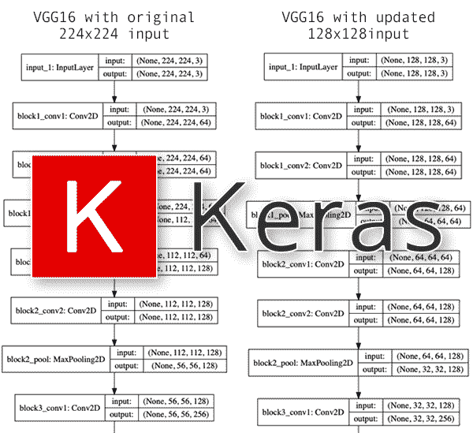
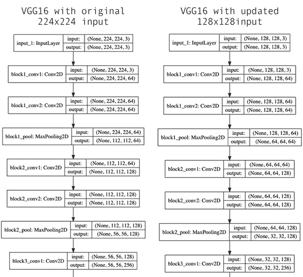
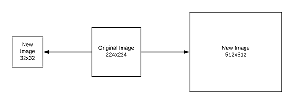
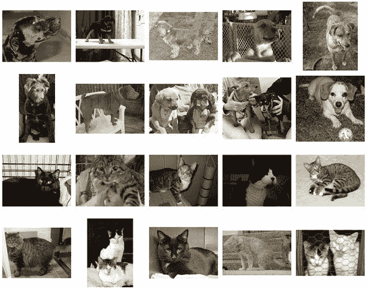

# 使用 Keras 更改输入形状尺寸以进行微调

> 原文：<https://pyimagesearch.com/2019/06/24/change-input-shape-dimensions-for-fine-tuning-with-keras/>

[](https://pyimagesearch.com/wp-content/uploads/2019/06/keras_input_shape_header.png)

在本教程中，您将学习如何使用 Keras 更改用于微调的输入形状张量维度。通读本指南后，你将理解如何将迁移学习应用于不同图像尺寸的图像，而不是 CNN 最初训练的图像尺寸。

几周前，我发表了一篇关于 Keras 迁移学习和深度学习的教程——在这篇教程发表后不久，我收到了 Francesca Maepa 的一个问题，她提出了以下问题:

> 你是否知道一个好的博客或教程，展示如何在一个比预训练模型更小的数据集上实现**迁移学习？**
> 
> 我创建了一个非常好的预训练模型，并希望将一些特征用于预训练模型，并将它们转移到缺少某些特征训练数据集的目标域，但我不确定这样做是否正确。

弗朗西丝卡问了一个很好的问题。

通常我们认为卷积神经网络接受固定大小的输入(即 *224×224* 、 *227×227* 、 *299×299* 等)。).

**但是如果你想:**

1.  利用预先培训的网络进行迁移学习…
2.  **…然后更新输入形状尺寸，以接受尺寸*不同于原始网络训练尺寸*的图像。**

为什么您可能想要利用不同的图像尺寸？

有两个常见的原因:

*   你的输入图像尺寸 ***比 CNN 训练的*** 小得多，增加它们的尺寸会引入太多的伪像，并极大地损害损失/准确性。
*   你的图像是 ***高分辨率*** 的，包含难以察觉的小物体。调整到 CNN 的原始输入尺寸会损害准确性，你假设增加分辨率将有助于改善你的模型。

在这些情况下，您可能希望更新 CNN 的输入形状维度，然后能够执行迁移学习。

那么问题就变成了，**这样的更新可能吗？**

是的，事实上，它是。

## 使用 Keras 更改输入形状尺寸以进行微调

***2020-06-04 更新:**此博文现已兼容 TensorFlow 2+!*

在本教程的第一部分，我们将讨论输入形状张量的概念，以及它在 CNN 输入图像维度中的作用。

从那里，我们将讨论我们将在这篇博文中使用的示例数据集。然后，我将向您展示如何:

1.  使用 Keras 将输入图像尺寸更新为预训练的 CNN。
2.  微调更新的 CNN。我们开始吧！

### 什么是输入形状张量？

[](https://pyimagesearch.com/wp-content/uploads/2019/06/keras_input_shape_networks.png)

**Figure 1:** Convolutional Neural Networks built with Keras for deep learning have different input shape expectations. In this blog post, you’ll learn how to change input shape dimensions for fine-tuning with Keras.

当使用 Keras 和深度学习时，您可能会利用或遇到通过以下方式加载预训练网络的代码:

```py
model = VGG16(weights="imagenet")

```

上面的代码初始化 VGG16 架构，然后加载模型的权重(在 ImageNet 上预先训练)。

**当我们的项目需要对 ImageNet** (本教程演示的)中有类别标签的输入图像进行分类时，我们通常会使用这个代码。

执行迁移学习或微调时，您可以使用以下代码来删除全连接(FC)层头:

```py
model = VGG16(weights="imagenet", include_top=False)

```

我们*仍然*指示应该使用预训练的 ImageNet 权重，但是现在我们设置`include_top=False`，指示不应该加载 FC 头。

**当你通过[特征提取](https://pyimagesearch.com/2019/05/27/keras-feature-extraction-on-large-datasets-with-deep-learning/)或[微调](https://pyimagesearch.com/2019/06/03/fine-tuning-with-keras-and-deep-learning/)进行迁移学习时，通常会用到这个代码。**

最后，我们可以更新我们的代码以包含一个 input_tensor 维度:

```py
model = VGG16(weights="imagenet", include_top=False,
	input_tensor=Input(shape=(224, 224, 3)))

```

我们*仍在*加载 VGG16，并在 ImageNet 上预先训练了权重，我们*仍在*忽略 FC 图层头……**但现在我们指定了一个输入形状 *224×224* x3** (这是 VGG16 最初训练的输入图像尺寸，如图**图 1** ，*左*)。

这一切都很好，但是如果我们现在想在 *128×128* 像素的图像上微调我们的模型呢？

这实际上只是对我们的模型初始化的简单更新:

```py
model = VGG16(weights="imagenet", include_top=False,
	input_tensor=Input(shape=(128, 128, 3)))

```

**图 1** ( *右*)提供了更新输入张量维度的网络的可视化——注意输入量现在是 *128x128x3* (我们更新后的更小维度)与之前的 *224x224x3* (原始的更大维度)的对比。

通过 Keras 更新 CNN 的输入形状尺寸就是这么简单！

但是有一些警告需要注意。

### 我能把输入尺寸做成我想要的吗？

[](https://pyimagesearch.com/wp-content/uploads/2019/06/keras_input_shape_sizes.png)

**Figure 2:** Updating a Keras CNN’s input shape is straightforward; however, there are a few caveats to take into consideration,

从*精确度/损失角度*和网络本身的*限制来看，你可以更新的图像尺寸是有限的。*

考虑 CNN 通过两种方法减少体积的事实:

1.  **池化**(如 VGG16 中的最大池化)
2.  **交错卷积**(例如在 ResNet 中)

如果您的输入图像尺寸太小，那么 CNN 将在向前传播期间自然减少体积尺寸，然后有效地“用完”数据。

在这种情况下，您的输入尺寸*太小。*

例如，当使用 *48×48* 输入图像时，我收到了以下错误消息:

```py
ValueError: Negative dimension size caused by subtracting 4 from 1 for 'average_pooling2d_1/AvgPool' (op: 'AvgPool') with input shapes: [?,1,1,512].

```

注意 Keras 是如何抱怨我们的体积太小的。对于其他预先训练的网络，您也会遇到类似的错误。当您看到这种类型的错误时，您知道您需要增加输入图像的尺寸。

**您也可以使您的输入尺寸*过大。***

您不会遇到任何错误*本身*，但是您可能会看到您的网络无法获得合理的准确性，因为网络中没有足够的层来:

1.  学习强健的、有辨别能力的过滤器。
2.  通过池化或步长卷积自然减少卷大小。

如果发生这种情况，你有几个选择:

*   探索在更大输入维度上训练的其他(预训练)网络架构。
*   彻底调整你的超参数，首先关注学习率。
*   向网络添加额外的层。对于 VGG16，您将使用 *3×3* CONV 层和最大池。对于 ResNet，您将包括具有步长卷积的残差图层。

最后的建议将要求您更新网络架构，然后在新初始化的层上执行[微调](https://pyimagesearch.com/2019/06/03/fine-tuning-with-keras-and-deep-learning/)。

要了解更多关于微调和转移学习的信息，以及我在训练网络时的技巧、建议和最佳实践，请务必参考我的书， [***用 Python 进行计算机视觉的深度学习***](https://pyimagesearch.com/deep-learning-computer-vision-python-book/) 。

### 我们的示例数据集

[](https://pyimagesearch.com/wp-content/uploads/2019/06/keras_input_shape_dataset.jpg)

**Figure 3:** A subset of the Kaggle Dogs vs. Cats dataset is used for this Keras input shape example. Using a smaller dataset not only proves the point more quickly, but also allows just about any computer hardware to be used (i.e. no expensive GPU machine/instance necessary).

我们今天将在这里使用的数据集是 Kaggle 的狗与猫数据集的一个子集。

我们还使用 Python 的计算机视觉深度学习 [*中的这个数据集来教授训练网络的基础知识，确保拥有 CPU 或 GPU 的读者可以在训练模型时跟随并学习最佳实践。*](https://pyimagesearch.com/deep-learning-computer-vision-python-book/)

数据集本身包含 2，000 幅图像，属于 2 个类别(“猫”和“狗”):

*   **Cat:**1000 张图片
*   **狗:**1000 张图片

数据集的可视化可以在上面的图 3 中看到。

在本教程的剩余部分，您将学习如何获取该数据集并:

1.  更新预训练 CNN 的输入形状尺寸。
2.  用较小的图像尺寸微调 CNN。

### 配置您的开发环境

要针对本教程配置您的系统，我首先建议您遵循以下任一教程:

*   [*如何在 Ubuntu 上安装 tensor flow 2.0*](https://pyimagesearch.com/2019/12/09/how-to-install-tensorflow-2-0-on-ubuntu/)
*   *[*如何在 macOS 上安装 tensor flow 2.0*](https://pyimagesearch.com/2019/12/09/how-to-install-tensorflow-2-0-on-macos/)*

 *这两个教程都将帮助您在一个方便的 Python 虚拟环境中，用这篇博文所需的所有软件来配置您的系统。

请注意 [PyImageSearch 不推荐也不支持 CV/DL 项目](https://pyimagesearch.com/faqs/single-faq/can-you-help-me-do-___-on-windows/)的窗口。

### 项目结构

继续从今天博文的 ***“下载*****部分获取代码+数据集。**

 **一旦你提取了。zip 存档，您可以使用`tree`命令检查项目结构:

```py
$ tree --dirsfirst --filelimit 10
.
├── dogs_vs_cats_small
│   ├── cats [1000 entries]
│   └── dogs [1000 entries]
├── plot.png
└── train.py

3 directories, 2 files

```

我们的数据集包含在`dogs_vs_cats_small/`目录中。这两个子目录包含我们的类的图像。如果您正在使用不同的数据集，请确保其结构是`<dataset>/<class_name>`。

今天我们将复习`train.py`剧本。训练脚本生成包含我们的准确度/损失曲线的`plot.png`。

### 使用 Keras 更新输入形状尺寸

现在是时候用 Keras 和预先训练好的 CNN 来更新我们的输入图像尺寸了。

打开项目结构中的`train.py`文件，插入以下代码:

```py
# import the necessary packages
from tensorflow.keras.preprocessing.image import ImageDataGenerator
from tensorflow.keras.layers import AveragePooling2D
from tensorflow.keras.applications import VGG16
from tensorflow.keras.layers import Dropout
from tensorflow.keras.layers import Flatten
from tensorflow.keras.layers import Dense
from tensorflow.keras.layers import Input
from tensorflow.keras.models import Model
from tensorflow.keras.optimizers import Adam
from tensorflow.keras.utils import to_categorical
from sklearn.preprocessing import LabelBinarizer
from sklearn.model_selection import train_test_split
from sklearn.metrics import classification_report
from imutils import paths
import matplotlib.pyplot as plt
import numpy as np
import argparse
import cv2
import os

```

**第 2-20 行**导入所需的包:

*   `tensorflow.keras`和`sklearn`是深度学习/机器学习。一定要参考我的泛深度学习的书， [*用 Python 进行计算机视觉的深度学习*](https://pyimagesearch.com/deep-learning-computer-vision-python-book/) ，从这些工具中更熟悉我们使用的类和函数。
*   `paths` from [imutils](https://github.com/jrosebr1/imutils/blob/master/imutils/paths.py) 遍历一个目录，使我们能够列出一个目录中的所有图像。
*   `matplotlib`将允许我们绘制我们的训练准确度/损失历史。
*   `numpy`是一个用于数值运算的 Python 包；我们将它付诸实施的方法之一是“均值减法”，一种缩放/归一化技术。
*   `cv2`是 OpenCV。
*   `argparse`将用于[读取和解析命令行参数](https://pyimagesearch.com/2018/03/12/python-argparse-command-line-arguments/)。

现在让我们继续解析命令行参数:

```py
# construct the argument parser and parse the arguments
ap = argparse.ArgumentParser()
ap.add_argument("-d", "--dataset", required=True,
	help="path to input dataset")
ap.add_argument("-e", "--epochs", type=int, default=25,
	help="# of epochs to train our network for")
ap.add_argument("-p", "--plot", type=str, default="plot.png",
	help="path to output loss/accuracy plot")
args = vars(ap.parse_args())

```

我们的脚本通过第 23-30 行的**接受三个命令行参数:**

*   `--dataset`:输入数据集的路径。我们使用的是狗和猫的精简版本，但您也可以使用其他二进制的 2 类数据集，只需很少或不需要修改(前提是它们遵循类似的结构)。
*   `--epochs`:我们在训练期间通过网络传递数据的次数；默认情况下，我们将训练`25`个时期，除非提供了不同的值。
*   `--plot`:输出精度/损耗图的路径。除非另有说明，否则该文件将被命名为`plot.png`并放在项目目录中。如果您正在进行多个实验，请确保每次为您的图指定不同的名称，以便将来进行比较。

接下来，我们将加载并预处理我们的图像:

```py
# grab the list of images in our dataset directory, then initialize
# the list of data (i.e., images) and class images
print("[INFO] loading images...")
imagePaths = list(paths.list_images(args["dataset"]))
data = []
labels = []

# loop over the image paths
for imagePath in imagePaths:
	# extract the class label from the filename
	label = imagePath.split(os.path.sep)[-2]

	# load the image, swap color channels, and resize it to be a fixed
	# 128x128 pixels while ignoring aspect ratio
	image = cv2.imread(imagePath)
	image = cv2.cvtColor(image, cv2.COLOR_BGR2RGB)
	image = cv2.resize(image, (128, 128))

	# update the data and labels lists, respectively
	data.append(image)
	labels.append(label)

```

首先，我们在**行 35** 上抓取我们的`imagePaths`，然后初始化我们的`data`和`labels` ( **行 36 和 37** )。

**第 40-52 行**在`imagePaths`上循环，同时首先提取标签。加载每个图像，交换颜色通道，并调整图像的大小。图像和标签分别添加到`data`和`labels`列表中。

VGG16 在 *224×224* px 图像上进行训练；不过，我想请**将您的注意力**转移到**的 48 号线**。请注意我们是如何将图像调整到 *128×128* px 的。这种调整大小是对不同维度的图像应用迁移学习的一个例子。

虽然第 48 行还没有完全回答弗朗西丝卡·梅帕的问题，但我们正在接近答案。

让我们继续一键编码我们的标签并拆分我们的数据:

```py
# convert the data and labels to NumPy arrays
data = np.array(data)
labels = np.array(labels)

# perform one-hot encoding on the labels
lb = LabelBinarizer()
labels = lb.fit_transform(labels)
labels = to_categorical(labels)

# partition the data into training and testing splits using 75% of
# the data for training and the remaining 25% for testing
(trainX, testX, trainY, testY) = train_test_split(data, labels,
	test_size=0.25, stratify=labels, random_state=42)

```

**第 55 行和第 56 行**将我们的`data`和`labels`转换成 NumPy 数组格式。

然后，**第 59-61 行**对我们的标签执行*一键编码*。本质上，这个过程将我们的两个标签(“猫”和“狗”)转换成数组，指示哪个标签是活动的/热的。如果训练图像代表一只狗，那么值将是`[0, 1]`，其中“狗”是热的。否则，对于“猫”，该值将是`[1, 0]`。

为了强调这一点，例如，如果我们有 5 类数据，一个热编码的数组可能看起来像`[0, 0, 0, 1, 0]`，其中第 4 个元素是热的，表示图像来自第 4 类。详细内容请参考 [*用 Python 进行计算机视觉的深度学习*](https://pyimagesearch.com/deep-learning-computer-vision-python-book/) 。

**第 65 行和第 66 行**标记了我们数据的 75%用于训练，剩下的 25%用于通过`train_test_split`函数进行测试。

现在让我们初始化我们的数据增强生成器。我们还将为均值减法建立我们的 ImageNet 均值:

```py
# initialize the training data augmentation object
trainAug = ImageDataGenerator(
	rotation_range=30,
	zoom_range=0.15,
	width_shift_range=0.2,
	height_shift_range=0.2,
	shear_range=0.15,
	horizontal_flip=True,
	fill_mode="nearest")

# initialize the validation/testing data augmentation object (which
# we'll be adding mean subtraction to)
valAug = ImageDataGenerator()

# define the ImageNet mean subtraction (in RGB order) and set the
# the mean subtraction value for each of the data augmentation
# objects
mean = np.array([123.68, 116.779, 103.939], dtype="float32")
trainAug.mean = mean
valAug.mean = mean

```

**第 69-76 行**初始化数据扩充对象，用于在训练期间对我们的输入图像执行随机操作。

**第 80 行**也利用了`ImageDataGenerator`类进行验证，但是没有任何参数——除了执行均值减法，我们不会操作验证图像。

训练和验证/测试生成器都将执行*均值减法*。均值减法是一种经证明可提高精确度的缩放/归一化技术。**行 85** 包含每个相应 RGB 通道的平均值，而**行 86 和 87** 则填充该值。稍后，我们的数据生成器将自动对我们的训练/验证数据执行均值减法。

***注意:**我已经在这篇[博客文章](https://pyimagesearch.com/2018/12/24/how-to-use-keras-fit-and-fit_generator-a-hands-on-tutorial/)以及用 Python 进行计算机视觉深度学习的[实践者包](https://pyimagesearch.com/deep-learning-computer-vision-python-book/)中详细介绍了数据增强。DL4CV 中还介绍了均值减法等缩放和归一化技术。*

我们正在用 **VGG16** 进行迁移学习。现在让我们初始化基本模型:

```py
# load VGG16, ensuring the head FC layer sets are left off, while at
# the same time adjusting the size of the input image tensor to the
# network
baseModel = VGG16(weights="imagenet", include_top=False,
	input_tensor=Input(shape=(128, 128, 3)))

# show a summary of the base model
print("[INFO] summary for base model...")
print(baseModel.summary())

```

**92 和 93 行**使用 3 个通道加载`VGG16`输入形状尺寸 *128×128* 。

*记住，VGG16 最初是在 224×224 图像* — **上训练的，现在我们正在更新*输入形状*尺寸以处理 *128×128* 图像。**

实际上，我们已经完全回答了弗朗西丝卡·梅帕的问题！我们通过两步完成了输入尺寸的更改:

1.  我们将所有输入图像的尺寸调整为 *128×128* 。
2.  然后我们设置输入`shape=(128, 128, 3)`。

第 97 行将在我们的终端打印一份模型摘要，以便我们检查。或者，你可以通过学习第 19 章*[*的【可视化网络架构】*用 Python](https://pyimagesearch.com/deep-learning-computer-vision-python-book/)* 进行计算机视觉的深度学习来图形化地可视化模型。

因为我们正在执行迁移学习，所以`include_top`参数被设置为`False` ( **第 92 行**)——我们砍掉了头！

现在我们将通过安装一个新的头部并缝合到 CNN 上来进行手术:

```py
# construct the head of the model that will be placed on top of the
# the base model
headModel = baseModel.output
headModel = AveragePooling2D(pool_size=(4, 4))(headModel)
headModel = Flatten(name="flatten")(headModel)
headModel = Dense(128, activation="relu")(headModel)
headModel = Dropout(0.5)(headModel)
headModel = Dense(2, activation="softmax")(headModel)

# place the head FC model on top of the base model (this will become
# the actual model we will train)
model = Model(inputs=baseModel.input, outputs=headModel)

# loop over all layers in the base model and freeze them so they will
# *not* be updated during the first training process
for layer in baseModel.layers:
	layer.trainable = False

```

**线 101** 从`baseModel`获取输出，并将其设置为`headModel`的输入。

从那里，**行 102-106** 构造头部的其余部分。

根据**行 92** ，已经用 ImageNet 权重初始化了`baseModel`。在**行 114 和 115** 上，我们将 VGG16 中的基础层设置为不可训练(即，它们在反向传播阶段不会被更新)。一定要看我之前的[微调教程](https://pyimagesearch.com/2019/06/03/fine-tuning-with-keras-and-deep-learning/)进一步解释。

我们现在准备用我们的数据来编译和训练模型:

```py
# compile our model (this needs to be done after our setting our
# layers to being non-trainable)
print("[INFO] compiling model...")
opt = Adam(lr=1e-4)
model.compile(loss="binary_crossentropy", optimizer=opt,
	metrics=["accuracy"])

# train the head of the network for a few epochs (all other layers
# are frozen) -- this will allow the new FC layers to start to become
# initialized with actual "learned" values versus pure random
print("[INFO] training head...")
H = model.fit(
	x=trainAug.flow(trainX, trainY, batch_size=32),
	steps_per_epoch=len(trainX) // 32,
	validation_data=valAug.flow(testX, testY),
	validation_steps=len(testX) // 32,
	epochs=args["epochs"])

```

***2020-06-04 更新:**以前，TensorFlow/Keras 需要使用一种叫做`.fit_generator`的方法来完成数据扩充。现在，`.fit`方法也可以处理数据扩充，使代码更加一致。这也适用于从`.predict_generator`到`.predict`的迁移。请务必查看我关于 [fit 和 fit_generator](https://pyimagesearch.com/2018/12/24/how-to-use-keras-fit-and-fit_generator-a-hands-on-tutorial/) 以及[数据扩充](https://pyimagesearch.com/2019/07/08/keras-imagedatagenerator-and-data-augmentation/)的文章。*

我们的`model`是用`Adam`优化器和一个`1e-4`学习率(**第 120-122 行**)编译的。

我们使用`"binary_crossentropy"`进行 2 级分类。如果有两类以上的数据，一定要用`"categorical_crossentropy"`。

**第 128-133 行**然后训练我们的转移学习网络。我们的培训和验证生成器将在此过程中投入使用。

培训完成后，我们将评估网络并绘制培训历史:

```py
# evaluate the network
print("[INFO] evaluating network...")
predictions = model.predict(x=testX.astype("float32"), batch_size=32)
print(classification_report(testY.argmax(axis=1),
	predictions.argmax(axis=1), target_names=lb.classes_))

# plot the training loss and accuracy
N = args["epochs"]
plt.style.use("ggplot")
plt.figure()
plt.plot(np.arange(0, N), H.history["loss"], label="train_loss")
plt.plot(np.arange(0, N), H.history["val_loss"], label="val_loss")
plt.plot(np.arange(0, N), H.history["accuracy"], label="train_acc")
plt.plot(np.arange(0, N), H.history["val_accuracy"], label="val_acc")
plt.title("Training Loss and Accuracy on Dataset")
plt.xlabel("Epoch #")
plt.ylabel("Loss/Accuracy")
plt.legend(loc="lower left")
plt.savefig(args["plot"])

```

***2020-06-04 更新:**为了使该绘图片段与 TensorFlow 2+兼容，更新了`H.history`字典键，以完全拼出“精度”而没有“acc”(即`H.history["val_accuracy"]`和`H.history["accuracy"]`)。“val”没有拼成“validation”，这有点令人困惑；我们必须学会热爱 API 并与之共存，并永远记住这是一项正在进行的工作，世界各地的许多开发人员都为此做出了贡献。*

**第 137-139 行**评估我们的`model`并打印分类报告用于统计分析。

然后，我们使用`matplotlib`来绘制我们在训练期间的准确度和损失历史(**第 142-152 行**)。绘图图形通过**线 153** 保存到磁盘。

### 使用更新的输入维度微调 CNN

[](https://pyimagesearch.com/wp-content/uploads/2019/06/keras_input_shape_plot.png)

**Figure 4:** Changing Keras input shape dimensions for fine-tuning produced the following accuracy/loss training plot.

要使用更新的输入维度**来微调我们的 CNN，首先确保您已经使用了本指南的*“下载”*部分来下载(1)源代码和(2)示例数据集。**

从那里，打开一个终端并执行以下命令:

```py
$ python train.py --dataset dogs_vs_cats_small --epochs 25
Using TensorFlow backend.
[INFO] loading images...
[INFO] summary for base model...
Model: "vgg16"
_________________________________________________________________
Layer (type)                 Output Shape              Param #   
=================================================================
input_1 (InputLayer)         [(None, 128, 128, 3)]     0         
_________________________________________________________________
block1_conv1 (Conv2D)        (None, 128, 128, 64)      1792      
_________________________________________________________________
block1_conv2 (Conv2D)        (None, 128, 128, 64)      36928     
_________________________________________________________________
block1_pool (MaxPooling2D)   (None, 64, 64, 64)        0         
_________________________________________________________________
block2_conv1 (Conv2D)        (None, 64, 64, 128)       73856     
_________________________________________________________________
block2_conv2 (Conv2D)        (None, 64, 64, 128)       147584    
_________________________________________________________________
block2_pool (MaxPooling2D)   (None, 32, 32, 128)       0         
_________________________________________________________________
block3_conv1 (Conv2D)        (None, 32, 32, 256)       295168    
_________________________________________________________________
block3_conv2 (Conv2D)        (None, 32, 32, 256)       590080    
_________________________________________________________________
block3_conv3 (Conv2D)        (None, 32, 32, 256)       590080    
_________________________________________________________________
block3_pool (MaxPooling2D)   (None, 16, 16, 256)       0         
_________________________________________________________________
block4_conv1 (Conv2D)        (None, 16, 16, 512)       1180160   
_________________________________________________________________
block4_conv2 (Conv2D)        (None, 16, 16, 512)       2359808   
_________________________________________________________________
block4_conv3 (Conv2D)        (None, 16, 16, 512)       2359808   
_________________________________________________________________
block4_pool (MaxPooling2D)   (None, 8, 8, 512)         0         
_________________________________________________________________
block5_conv1 (Conv2D)        (None, 8, 8, 512)         2359808   
_________________________________________________________________
block5_conv2 (Conv2D)        (None, 8, 8, 512)         2359808   
_________________________________________________________________
block5_conv3 (Conv2D)        (None, 8, 8, 512)         2359808   
_________________________________________________________________
block5_pool (MaxPooling2D)   (None, 4, 4, 512)         0         
=================================================================
Total params: 14,714,688
Trainable params: 14,714,688
Non-trainable params: 0

```

**我们的第一组输出显示了我们更新的输入形状尺寸。**

请注意我们的`input_1`(即`InputLayer`)的输入尺寸为 *128x128x3* ，而 VGG16 的输入尺寸为普通的 *224x224x3* 。

然后，输入图像将通过网络向前传播，直到最后的`MaxPooling2D`层(即`block5_pool).`

在这一点上，我们的输出体积具有尺寸 *4x4x512* (作为参考，具有 *224x224x3* 输入体积的 VGG16 在这一层之后将具有形状 *7x7x512* )。

*请参阅“我可以将输入尺寸设为我想要的任何尺寸吗？”一节了解更多细节。*

然后，我们展平该体积并应用来自`headModel`的 FC 层，最终导致我们的最终分类。

一旦我们的模型构建完成，我们就可以对其进行微调:

```py
_________________________________________________________________
None
[INFO] compiling model...
[INFO] training head...
Epoch 1/25
46/46 [==============================] - 4s 94ms/step - loss: 4.8791 - accuracy: 0.5334 - val_loss: 2.3190 - val_accuracy: 0.6854
Epoch 2/25
46/46 [==============================] - 3s 73ms/step - loss: 3.3768 - accuracy: 0.6274 - val_loss: 1.2106 - val_accuracy: 0.8167
Epoch 3/25
46/46 [==============================] - 3s 76ms/step - loss: 2.7036 - accuracy: 0.6887 - val_loss: 0.9802 - val_accuracy: 0.8333
Epoch 4/25
46/46 [==============================] - 3s 73ms/step - loss: 2.1932 - accuracy: 0.7105 - val_loss: 0.8585 - val_accuracy: 0.8583
Epoch 5/25
46/46 [==============================] - 3s 73ms/step - loss: 1.9197 - accuracy: 0.7425 - val_loss: 0.6756 - val_accuracy: 0.9021
...
46/46 [==============================] - 3s 76ms/step - loss: 0.6613 - accuracy: 0.8495 - val_loss: 0.4479 - val_accuracy: 0.9083
Epoch 21/25
46/46 [==============================] - 3s 74ms/step - loss: 0.6561 - accuracy: 0.8413 - val_loss: 0.4484 - val_accuracy: 0.9000
Epoch 22/25
46/46 [==============================] - 4s 95ms/step - loss: 0.5216 - accuracy: 0.8508 - val_loss: 0.4476 - val_accuracy: 0.9021
Epoch 23/25
46/46 [==============================] - 3s 70ms/step - loss: 0.5484 - accuracy: 0.8488 - val_loss: 0.4420 - val_accuracy: 0.9021
Epoch 24/25
46/46 [==============================] - 3s 70ms/step - loss: 0.5658 - accuracy: 0.8492 - val_loss: 0.4504 - val_accuracy: 0.8938
Epoch 25/25
46/46 [==============================] - 3s 70ms/step - loss: 0.5334 - accuracy: 0.8529 - val_loss: 0.4096 - val_accuracy: 0.8979
[INFO] evaluating network...
              precision    recall  f1-score   support

        cats       0.91      0.88      0.89       250
        dogs       0.89      0.91      0.90       250

    accuracy                           0.90       500
   macro avg       0.90      0.90      0.90       500
weighted avg       0.90      0.90      0.90       500

```

**在微调结束时，我们看到我们的模型已经获得了 *90%的准确度*，考虑到我们的小图像数据集，这是相当不错的。**

如**图 4** 所示，我们的训练也相当稳定，没有过度适应的迹象。

更重要的是，您现在知道如何更改预训练网络的输入图像形状尺寸，然后使用 Keras 应用特征提取/微调！

当您需要将迁移学习应用到预先训练的网络时，请务必使用本教程作为模板，该网络的图像尺寸与最初训练时不同。

## 摘要

在本教程中，您学习了如何更改输入形状尺寸，以便使用 Keras 进行微调。

当我们想要应用迁移学习时，我们通常会执行这样的操作，包括[特征提取](https://pyimagesearch.com/2019/05/27/keras-feature-extraction-on-large-datasets-with-deep-learning/)和[微调](https://pyimagesearch.com/2019/06/03/fine-tuning-with-keras-and-deep-learning/)。

使用本指南中的方法，您可以为预训练的 CNN 更新您的输入图像尺寸，然后执行迁移学习；但是，有两个警告需要注意:

1.  如果你的输入图像*太小*，Keras 就会出错。
2.  如果您的输入图像*太大*，您可能无法获得想要的精度。

请务必参考*“我可以随意输入尺寸吗？”关于这些警告的更多细节，包括如何解决它们的建议。*

我希望你喜欢这个教程！

**要下载这篇文章的源代码，并在 PyImageSearch 上发布未来教程时得到通知，*只需在下面的表格中输入您的电子邮件地址！******