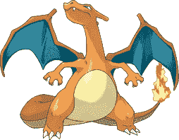

# Charizard 解释了如何使用特征向量来描述和量化图像

> 原文：<https://pyimagesearch.com/2014/03/03/charizard-explains-describe-quantify-image-using-feature-vectors/>

如果你没有注意到，术语“特征向量”在这个博客中经常使用。虽然我们已经看到了很多，但我想用一整篇文章来定义特征向量到底是什么。

# 什么是图像特征向量？

> **图像特征向量:**图像的一种抽象，用于表征和数字量化图像的内容。通常为实数、整数或二进制值。简单地说，特征向量是用来表示图像的一系列数字。

如你所知，构建任何图像搜索引擎的第一步是定义你将要使用的图像描述符的类型。你是在尝试表征一幅图像的颜色，提取颜色特征吗？质地？或者图像中物体的形状？

一旦选择了图像描述符，就需要将图像描述符应用于图像。这个图像描述符处理量化图像所需的逻辑，并将其表示为一系列数字。

图像描述符的输出是一个*特征向量*:用来描述图像特征的数字列表。有道理吗？

# 问自己两个问题

在定义图像描述符和预期输出时，您可以遵循以下通用模板。该模板将有助于确保您始终知道您所描述的内容以及描述符的输出所代表的内容。为了应用这个模板，您只需要问自己两个问题:

1.  我使用的是什么图像描述符？
2.  **我的图像描述符的预期输出是什么？**

让我们把这个解释更具体一点，并通过一些例子。

如果你是这个博客的常客，你应该知道我对《侏罗纪公园》和《指环王》都很着迷。下面介绍我的第三个执念:口袋妖怪。下面是我们将在这篇博文中使用的示例图像——一只沙里卡。

[](https://pyimagesearch.com/wp-content/uploads/2014/02/charizard.png)

**Figure 1:** Our example image – a Charizard.

现在，启动一个 Python shell 并跟随它:

```py
>>> import cv2
>>> image = cv2.imread("charizard.png")
>>> image.shape
(198, 254, 3)

```

这里我们只是导入`cv2`，我们的 Python 包与 OpenCV 接口。然后，我们从磁盘上加载我们的 Charizard 图像，并检查图像的尺寸。

查看图像的尺寸，我们看到它的高度为 198 像素，宽度为 254 像素，有 3 个通道，分别用于红色、绿色和蓝色通道。

## 原始像素特征向量

可以说，你可以使用的最基本的颜色特征向量是原始像素强度本身。虽然我们通常不会在图像搜索引擎中使用这种表示，但它有时会在机器学习和分类上下文中使用，值得一提。

让我们问自己上面模板中提到的两个问题:

1.  我使用的是什么图像描述符？我使用的是原始像素描述符。
2.  我的描述符的预期输出是什么？对应于我的图像的原始 RGB 像素强度的数字列表。

由于图像表示为 NumPy 数组，因此计算图像的原始像素表示非常简单:

```py
>>> raw = image.flatten()
>>> raw.shape
(150876,)
>>> raw
array([255, 255, 255, ..., 255, 255, 255], dtype=uint8)

```

我们现在可以看到，我们的图像已经通过 NumPy 的`flatten`方法被“展平”。图像的红色、绿色和蓝色分量已经被展平到单个列表(而不是多维数组)中来表示图像。我们的展平数组具有 *150，876* 的形状，因为图像中存在 *198 x 254 = 50，292* 个像素，每个像素有 3 个值，因此 *50，292 x 3 = 150，876* 。

## 颜色平均值

我们之前的例子不太有趣。

如果我们想量化我们的 Charizard 的颜色，而不必使用原始像素强度的整个图像呢？

量化图像颜色的一个简单方法是计算每个颜色通道的平均值。

同样，让我们填写模板:

1.  我使用的是什么图像描述符？一个颜色均值描述符。
2.  **我的图像描述符的预期输出是什么？**图像各通道的平均值。

现在让我们看看代码:

```py
>>> means = cv2.mean(image)
>>> means
(181.12238527002307, 199.18315040165433, 206.514296508391, 0.0)

```

我们可以使用`cv2.mean`方法计算每个颜色通道的平均值。这个方法返回一个有四个值的元组，我们的颜色特征。第一个值是蓝色通道的平均值，第二个值是绿色通道的平均值，第三个值是红色通道的平均值。记住，OpenCV 将 RGB 图像存储为一个 NumPy 数组，但是顺序相反。我们实际上是按照 BGR 顺序倒着读的，因此蓝色值先出现，然后是绿色，最后是红色。

第四个值可以忽略，它的存在只是为了 OpenCV 的内置`Scalar`类可以在内部使用。该值可以这样忽略:

```py
>>> means = means[:3]
>>> means
(181.12238527002307, 199.18315040165433, 206.514296508391)

```

现在我们可以看到我们的图像描述符(`cv2.mean`函数)的输出是一个包含三个数字的特征向量:分别是蓝色、绿色和红色通道的平均值。

## 颜色平均值和标准偏差

让我们计算每个通道的平均值和标准差。

同样，这是我们的模板:

1.  我使用的是什么图像描述符？颜色均值和标准差描述符。
2.  **我的图像描述符的预期输出是什么？**图像各通道的均值和标准差。

现在是代码:

```py
>>> (means, stds) = cv2.meanStdDev(image)
>>> means, stds
(array([[ 181.12238527],
       [ 199.1831504 ],
       [ 206.51429651]]), array([[ 80.67819854],
       [ 65.41130384],
       [ 77.77899992]]))

```

为了获取每个通道的均值和标准差，我们使用了`cv2.meanStdDev`函数，毫不奇怪，它返回一个元组——一个用于均值，一个用于标准差。同样，这个数字列表是我们的颜色特征。

让我们将平均值和标准偏差合并成一个单一的颜色特征向量:

```py
>>> import numpy as np
>>> stats = np.concatenate([means, stds]).flatten()
>>> stats
array([ 181.12238527,  199.1831504 ,  206.51429651,   80.67819854,
         65.41130384,   77.77899992])

```

现在我们的特征向量`stats`有六个条目，而不是三个。我们现在表示图像中每个通道的平均值以及每个通道的标准偏差。

## 颜色直方图

回到[聪明的女孩:计算机视觉和图像搜索引擎利用颜色直方图的指南](https://pyimagesearch.com/2014/01/22/clever-girl-a-guide-to-utilizing-color-histograms-for-computer-vision-and-image-search-engines/)和[霍比特人和直方图](https://pyimagesearch.com/2014/01/27/hobbits-and-histograms-a-how-to-guide-to-building-your-first-image-search-engine-in-python/ "Hobbits and Histograms – A How-To Guide to Building Your First Image Search Engine in Python")，我们也可以使用 3D 颜色直方图来描述我们的 Charizard。

1.  我使用的是什么图像描述符？一个 3D 颜色直方图。
2.  **我的图像描述符的预期输出是什么？**用来表征图像颜色分布的数字列表。

```py
>>> hist = cv2.calcHist([image], [0, 1, 2], None, [8, 8, 8], [0, 256, 0, 256, 0, 256])

```

这里我们有一个 3D 直方图，每个通道有 8 个面元。让我们检查一下直方图的形状:

```py
>>> hist.shape
(8, 8, 8)

```

我们的直方图有一个形状`(8, 8, 8)`。如果它是多维的，我们怎么用它作为特征向量呢？

我们简单地把它展平:

```py
>>> hist = hist.flatten()
>>> hist.shape
(512,)

```

通过将我们的图像描述符定义为 3D 颜色直方图，我们可以提取一系列数字(即我们的特征向量)来表示图像中的颜色分布。

# 摘要

在这篇博文中，我们提供了图像特征向量的正式定义。特征向量是图像本身的抽象，并且在最基本的层面上，仅仅是用于表示图像的数字列表。我们还回顾了一些如何提取颜色特征的例子。

构建任何图像搜索引擎的第一步都是定义图像描述符。一旦我们定义了我们的图像描述符，我们就可以将我们的描述符应用于图像。图像描述符的输出是我们的特征向量。

然后，我们定义了一个两步模板，您可以在定义图像描述符时使用它。你只需要问自己两个问题:

1.  我使用的是什么图像描述符？
2.  **我的图像描述符的预期输出是什么？**

第一个问题定义了你要描述的图像的哪个方面，是颜色、形状还是纹理。第二个问题定义了描述符应用于图像后的输出。

使用这个模板，你可以确保你总是知道*你在描述什么*以及*如何描述*。

最后，我们提供了三个简单的图像描述符和特征向量的例子，使我们的讨论更加具体。