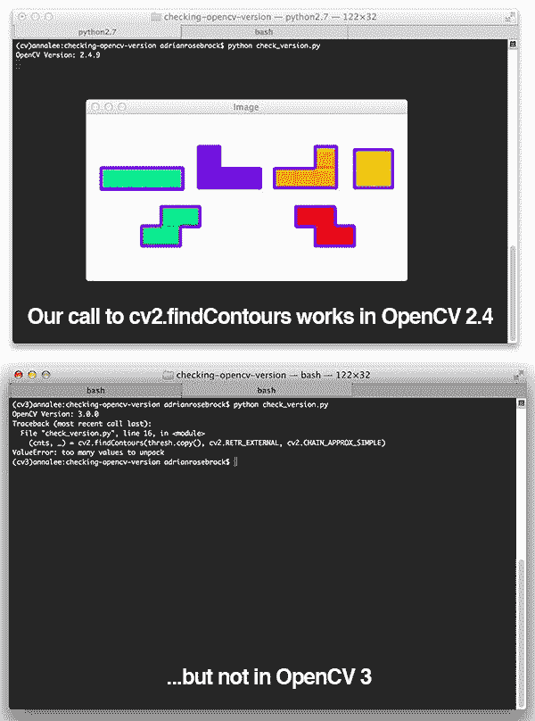
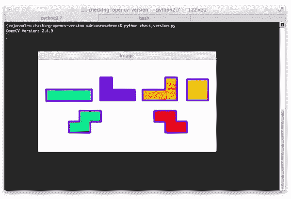
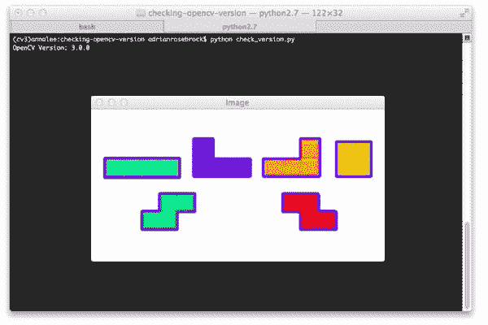

# 使用 Python 检查 OpenCV 版本

> 原文：<https://pyimagesearch.com/2015/08/10/checking-your-opencv-version-using-python/>

[](https://pyimagesearch.com/wp-content/uploads/2015/07/opencv_versions_header.jpg)

这是不可避免的——**OpenCV 3 的发布必然会打破与 OpenCV 2.4.X 函数的向后兼容性** : `cv2.findContours`和`cv2.normalize`马上浮现在我的脑海中。

那么，如何确保无论您的生产环境使用哪个版本的 OpenCV，您的代码都能工作呢？

简单的回答是，您需要围绕每个有问题的函数创建`if`语句(或者将函数抽象成一个单独的方法，该方法根据您的 OpenCV 版本处理调用适当的函数)。

为了做到这一点，您需要能够使用 Python 从内部检查您的 OpenCV 版本——这正是本博客的其余部分将向您展示的！

# 使用 Python 检查 OpenCV 版本

OpenCV 版本包含在一个特殊的`cv2.__version__`变量中，您可以这样访问它:

```py
$ python
>>> import cv2
>>> cv2.__version__
'3.0.0'

```

`cv2.__version__`变量只是一个字符串，你可以把它分成主要版本和次要版本:

```py
>>> (major, minor, _) = cv2.__version__.split(".")
>>> major
'3'
>>> minor
'0'

```

当然，每次你需要检查你的 OpenCV 版本的时候都必须执行这个操作*有点痛苦。为了解决这个问题，我在我的 **[imutils](https://github.com/jrosebr1/imutils)** 包中添加了三个新函数，这是一系列方便的函数，使 OpenCV 和 Python 的基本图像处理功能变得更容易。*

下面可以看到我的`is_cv2`、`is_cv3`、`check_opencv_version`功能:

```py
def is_cv2():
    # if we are using OpenCV 2, then our cv2.__version__ will start
    # with '2.'
    return check_opencv_version("2.")

def is_cv3():
    # if we are using OpenCV 3.X, then our cv2.__version__ will start
    # with '3.'
    return check_opencv_version("3.")

def is_cv4():
    # if we are using OpenCV 3.X, then our cv2.__version__ will start
    # with '4.'
    return check_opencv_version("4.")

def check_opencv_version(major, lib=None):
    # if the supplied library is None, import OpenCV
    if lib is None:
        import cv2 as lib

    # return whether or not the current OpenCV version matches the
    # major version number
    return lib.__version__.startswith(major)

```

这里的代码相当简单——我只是检查`cv2.__version__`字符串是否以`2`开头，这表明我们使用的是 OpenCV 2。x，一个`3`，表示我们用的是 OpenCV 3，或者一个`4`，表示我们用的是 OpenCV 4。

同样，这些函数已经包含在 [imutils](https://github.com/jrosebr1/imutils) 包中，您可以使用 pip 来安装:

```py
$ pip install imutils

```

如果您已经安装了`imutils`，您可以通过以下方式升级到最新版本:

```py
$ pip install --upgrade imutils

```

# 检查您的 OpenCV 版本:一个真实的例子

既然我们已经知道了如何使用 Python 检查 OpenCV 版本，并定义了几个方便的函数来简化版本检查，那么让我们看看如何在实际例子中使用这些函数。

我们的目标是检测下图中的轮廓:

[](https://pyimagesearch.com/wp-content/uploads/2015/07/tetris_blocks.png)

**Figure 1:** We are going to utilize OpenCV 2.4.X and OpenCV 3 to detect the contours (i.e. outlines) of the Tetris blocks.

为了检测图像中的轮廓，我们需要使用`cv2.findContours`功能。然而，正如我们所知，`cv2.findContours`的返回签名在 OpenCV 的版本 3 和 2.4 之间略有变化(`cv2.findContours`的 OpenCV 3 版本在元组中返回一个额外的值)，因此我们需要在调用`cv2.findContours`之前对 OpenCV 版本进行检查，以确保我们的脚本不会出错。让我们来看看如何进行这项检查:

```py
# import the necessary packages
from __future__ import print_function
import imutils
import cv2

# load the Tetris block image, convert it to grayscale, and threshold
# the image
print("OpenCV Version: {}".format(cv2.__version__))
image = cv2.imread("tetris_blocks.png")
gray = cv2.cvtColor(image, cv2.COLOR_BGR2GRAY)
thresh = cv2.threshold(gray, 225, 255, cv2.THRESH_BINARY_INV)[1]

# check to see if we are using OpenCV 2.X or OpenCV 4
if imutils.is_cv2() or imutils.is_cv4():
	(cnts, _) = cv2.findContours(thresh.copy(), cv2.RETR_EXTERNAL,
		cv2.CHAIN_APPROX_SIMPLE)

# check to see if we are using OpenCV 3
elif imutils.is_cv3():
	(_, cnts, _) = cv2.findContours(thresh.copy(), cv2.RETR_EXTERNAL,
		cv2.CHAIN_APPROX_SIMPLE)

# draw the contours on the image
cv2.drawContours(image, cnts, -1, (240, 0, 159), 3)
cv2.imshow("Image", image)
cv2.waitKey(0)

```

正如你所看到的，我们需要做的就是调用`is_cv2`、`is_cv4`和`is_cv3`，然后将我们的**版本特定的**代码包装在`if`语句块中——就这样！

现在，当我使用 OpenCV 2.4 执行我的脚本时，它工作起来没有任何问题:

[](https://pyimagesearch.com/wp-content/uploads/2015/07/opencv_versions_contours_working.jpg)

**Figure 2:** Our call to cv2.findContours is working in OpenCV 2.4.X.

OpenCV 3 也是如此:

[](https://pyimagesearch.com/wp-content/uploads/2015/07/opencv_versions_contours_working_cv3.jpg)

**Figure 3:** And the same is true for OpenCV 3 since we are using the is_cv2 and is_cv3 functions to detect OpenCV versions with Python.

# 摘要

在这篇博文中，我们学习了如何使用 Python 检查 OpenCV 版本。OpenCV 版本包含在一个名为`cv2.__version__`的特殊字符串变量中。我们需要做的就是检查这个变量，然后我们就能确定我们的 OpenCV 版本。

最后，我在 [imutils 包](https://github.com/jrosebr1/imutils)中定义了一些方便的方法，使检查 OpenCV 版本变得更容易和更 Pythonic 化。如果您发现自己需要始终如一地检查 OpenCV 版本，请考虑检查库。