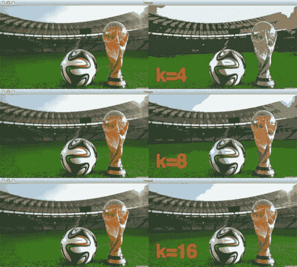
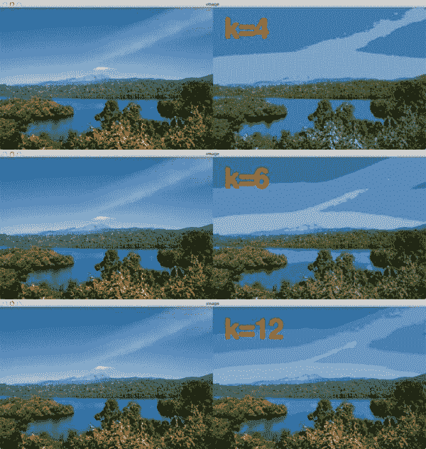
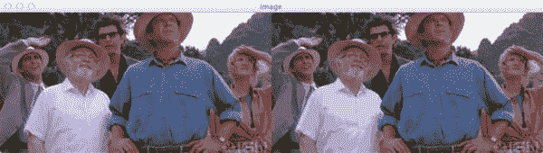

# 基于 K 均值聚类的 OpenCV 颜色量化

> 原文：<https://pyimagesearch.com/2014/07/07/color-quantization-opencv-using-k-means-clustering/>

[](https://pyimagesearch.com/wp-content/uploads/2014/07/quant_kmeans_worldcup.jpg)

有没有看过 *[一台扫描仪黑黑的](http://www.imdb.com/title/tt0405296/)？*

这部电影是数码拍摄的，但后来在后期处理步骤中赋予了动画效果——但这是一个艰苦的过程。对于电影中的每一帧，动画师一帧一帧地追踪原始镜头。

请花一秒钟考虑一下一部电影中的帧数…每一帧都必须用手描摹。

的确是一项艰巨的任务。

那么，如果有一种方法可以利用计算机视觉创造出一种黑暗的扫描仪动画效果呢？

这可能吗？

你打赌。

在这篇博文中，我将向你展示如何使用 k-means 聚类和颜色量化在图像中创建一个黑暗的扫描仪类型的效果。

要了解我是如何做到的，请继续阅读。

**OpenCV 和 Python 版本:**
这个例子将运行在 **Python 2.7/Python 3.4+** 和 **OpenCV 2.4.X/OpenCV 3.0+** 上。

# 那么，什么是颜色量化呢？

颜色量化是减少图像中不同颜色数量的过程。

通常，目的是尽可能保留图像的颜色外观，同时减少颜色的数量，无论是出于内存限制还是压缩。

在我自己的工作中，我发现颜色量化最适用于构建基于内容的图像检索(CBIR)系统。

如果你对这个术语不熟悉，CBIR 只是“图片搜索引擎”的一种花哨的学术说法。

不过，请花点时间考虑一下 CBIR 背景下的颜色量化。

任何给定的 24 位 RGB 图像都有 *256 x 256 x 256* 种可能的颜色。当然，我们可以基于这些强度值构建标准的[颜色直方图](https://pyimagesearch.com/2014/01/22/clever-girl-a-guide-to-utilizing-color-histograms-for-computer-vision-and-image-search-engines/ "Clever Girl: A Guide to Utilizing Color Histograms for Computer Vision and Image Search Engines")。

但是另一种方法是显式量化图像，然后*减少*颜色的数量，比如 16 或 64。这产生了显著更小的空间和(理想地)更小的噪声和变化。

在实践中，您可以使用这种技术来构建更严格的颜色直方图。

事实上，著名的[QBIC·CBIR](http://courses.cs.washington.edu/courses/cse576/07sp/notes/CBIR_white.pdf)系统(证明图像搜索引擎是可能的原始 CBIR 系统之一)利用二次距离中的量化颜色直方图来计算相似性。

现在我们已经了解了什么是颜色量化，让我们来探索如何利用它来创建图像中的*扫描仪深色*类型的效果。

# 用 OpenCV 进行颜色量化

让我们把手弄脏吧。

打开一个新文件，命名为`quant.py`，开始编码:

```py
# import the necessary packages
from sklearn.cluster import MiniBatchKMeans
import numpy as np
import argparse
import cv2

# construct the argument parser and parse the arguments
ap = argparse.ArgumentParser()
ap.add_argument("-i", "--image", required = True, help = "Path to the image")
ap.add_argument("-c", "--clusters", required = True, type = int,
	help = "# of clusters")
args = vars(ap.parse_args())

```

我们要做的第一件事是在**2-5 号线**导入我们需要的包。我们将使用 NumPy 进行数值处理，`arparse`用于解析命令行参数，而`cv2`用于 OpenCV 绑定。我们的 k-means 实现将由 scikit-learn 处理；具体来说， [`MiniBatchKMeans`](http://scikit-learn.org/stable/modules/generated/sklearn.cluster.MiniBatchKMeans.html) 类。

你会发现`MiniBatchKMeans`比普通的 K-Means 要快得多，尽管质心可能不那么稳定。

这是因为`MiniBatchKMeans`在数据集的小“批”上操作，而 K-Means 在数据集的群体上操作，因此使得每个质心的均值计算以及质心更新循环慢得多。

一般来说，我通常喜欢从`MiniBatchKMeans`开始，如果(且仅如果)我的结果很差，我会切换到正常的 K 均值。

**第 7-12 行**然后处理解析我们的命令行参数。我们需要两个开关:`--image`，这是我们想要应用颜色量化的图像的路径，和`--clusters`，这是我们的输出图像将具有的颜色数量。

现在真正有趣的代码开始了:

```py
# load the image and grab its width and height
image = cv2.imread(args["image"])
(h, w) = image.shape[:2]

# convert the image from the RGB color space to the L*a*b*
# color space -- since we will be clustering using k-means
# which is based on the euclidean distance, we'll use the
# L*a*b* color space where the euclidean distance implies
# perceptual meaning
image = cv2.cvtColor(image, cv2.COLOR_BGR2LAB)

# reshape the image into a feature vector so that k-means
# can be applied
image = image.reshape((image.shape[0] * image.shape[1], 3))

# apply k-means using the specified number of clusters and
# then create the quantized image based on the predictions
clt = MiniBatchKMeans(n_clusters = args["clusters"])
labels = clt.fit_predict(image)
quant = clt.cluster_centers_.astype("uint8")[labels]

# reshape the feature vectors to images
quant = quant.reshape((h, w, 3))
image = image.reshape((h, w, 3))

# convert from L*a*b* to RGB
quant = cv2.cvtColor(quant, cv2.COLOR_LAB2BGR)
image = cv2.cvtColor(image, cv2.COLOR_LAB2BGR)

# display the images and wait for a keypress
cv2.imshow("image", np.hstack([image, quant]))
cv2.waitKey(0)

```

首先，我们在第 15 行的**处加载我们的图像，并在第 16** 行的**处分别获取它的高度和宽度。**

**第 23 行**处理将我们的图像从 RGB 颜色空间转换到 L*a*b*颜色空间。

为什么我们要费心做这种转换呢？

因为在 L*a*b*颜色空间中，颜色之间的欧几里德距离具有实际的感知意义——这不是 RGB 颜色空间的情况。

假设 k-means 聚类也假设欧几里得空间，我们最好使用 L*a*b*而不是 RGB。

为了聚集我们的像素强度，我们需要在第 27 行上重塑我们的图像。这一行代码简单地获取了一个 *(M，N，3)*(*M x N*像素，每个像素有三个分量)并将其重塑为一个 *(M x N，3)* 特征向量。这种整形很重要，因为 k-means 采用二维数组，而不是三维图像。

从那里，我们可以在第 31-33 行上应用我们实际的小批量 K 均值聚类。

**第 31 行**使用我们在命令行参数中指定的集群数量来实例化我们的`MiniBatchKMeans`类，而**第 32 行**执行实际的集群。

除了实际的聚类，**行 32** 处理一些极其重要的事情——“预测”原始图像中每个像素*的*量化颜色*将会是什么。通过确定输入像素最接近哪个质心来处理该预测。*

从那里，我们可以使用一些花哨的数字索引，在第 33 行的**处获得这些预测的标签并创建我们的量化图像。这一行所做的就是使用预测标签在质心数组中查找 L*a*b*颜色。**

**第 36 行和第 37 行**然后处理将我们的 *(M x N，3)* 特征向量整形回一个 *(M，N，3)* 维度图像，接着将我们的图像从 L*a*b*颜色空间转换回 RGB。

最后，**行 44 和 45** 显示我们的原始和量化图像。

现在编码完成了，让我们看看结果。

# 使用计算机视觉创造出一种黑暗的扫描仪效果

因为现在是世界杯赛季，所以让我们从一个足球图像开始。

[](https://pyimagesearch.com/wp-content/uploads/2014/07/quant_kmeans_worldcup.jpg)

**Figure 1:** Applying color quantization with OpenCV using k-means clustering.

在这里，我们可以在左边的*看到我们的原始图像，在右边的*看到我们的量化图像。**

我们可以清楚地看到，当仅使用 *k=4* 颜色时，我们失去了原始图像的许多颜色细节，尽管尝试对图像的原始颜色空间进行建模——草地仍然是绿色的，足球仍然是白色的，天空仍然带有一丝蓝色。

但是当我们增加 k=8 和 *k=16* 的颜色时，我们肯定会开始看到改进的结果。

非常有趣的是，只需要 16 种颜色就可以很好地再现原始图像，因此我们的*扫描仪产生了暗*效果。

让我们尝试另一个图像:

[](https://pyimagesearch.com/wp-content/uploads/2014/07/quant_kmeans_nature.jpg)

**Figure 2:** Apply color quantization using OpenCV to a nature scene.

同样，原始自然场景图像在左边的*处，量化输出在右边的*处。**

就像世界杯图像一样，请注意，随着量化集群数量的增加，我们能够更好地模拟原始颜色空间。

[](https://pyimagesearch.com/wp-content/uploads/2014/07/quant_kmeans_jpcrew_24_colors.jpg)

**Figure 3:** Applying color quantization using OpenCV to Jurassic Park.

最后，看一下**图 3** 看一个来自*侏罗纪公园*的截屏。注意颜色的数量是如何减少的——这在哈蒙德的白衬衫中显而易见。

在聚类的数量和量化图像的质量之间存在明显的折衷。

第一个权衡是，随着聚类数量的增加，执行聚类所需的时间也会增加。

第二个权衡是，随着聚类数量的增加，存储输出图像所需的内存量也会增加；但是，在这两种情况下，内存占用仍然比原始图像小，因为您使用的调色板要小得多。

# 摘要

在这篇博文中，我向你展示了如何使用 OpenCV 和 k-means 聚类来执行颜色量化，以在图像中创建一种扫描仪深色类型的效果。

虽然颜色量化不能完美地模仿电影效果，但它确实证明了通过减少图像中的颜色数量，您可以为图像创建更具色调分离、更生动的感觉。

当然，颜色量化有更多的实际应用，而不仅仅是视觉上的吸引力。

色彩量化通常用于内存有限或需要压缩的系统中。

在我个人的工作中，我发现在构建 CBIR 系统时最好使用颜色量化。事实上， [QBIC](http://courses.cs.washington.edu/courses/cse576/07sp/notes/CBIR_white.pdf) ，一个开创性的图像搜索引擎，证明了通过使用量化的颜色直方图和二次距离，图像搜索引擎确实是可能的。

因此，请花一点时间使用下面的表格下载代码。然后创建一些你自己的量化图像，发给我。我很期待看到你的结果！