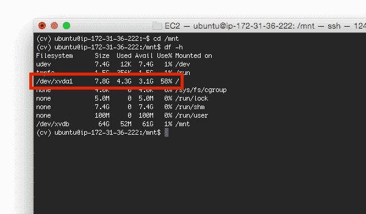
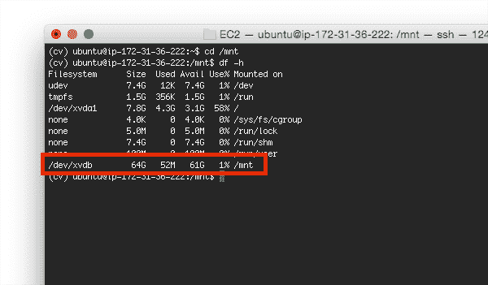
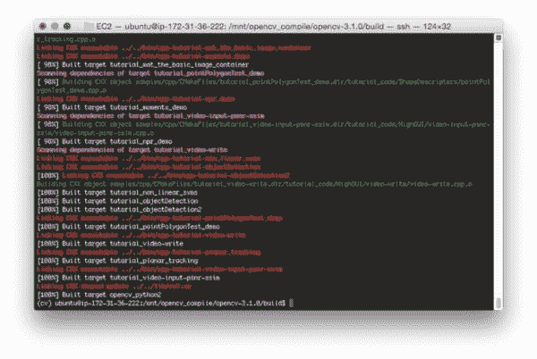

# 支持 CUDA 的 OpenCV 编译

> 原文：<https://pyimagesearch.com/2016/07/11/compiling-opencv-with-cuda-support/>


light，这样你就在支持 GPU 的系统上安装了 NVIDIA CUDA Toolkit 和 cuDNN 库。

接下来呢？

让我们也安装支持 CUDA 的 OpenCV。

虽然 OpenCV *本身*在深度学习中并不发挥关键作用，但它*被*其他*深度学习库如 Caffe 使用，特别是在“实用”程序中(如建立图像数据集)。简而言之，安装 OpenCV 使得编写代码变得更加容易，从而简化了在将图像输入深度神经网络之前对图像进行预处理的过程。*

*正因为如此，我们应该将 OpenCV 安装到与我们的深度学习库相同的环境中，至少让我们的生活更加轻松。*

此外，在支持 GPU 的 CUDA 环境中，我们可以对 OpenCV 进行许多编译时优化，允许它利用 GPU 来加快计算速度(但主要是针对 C++应用程序，对 Python 来说没那么多，至少目前是这样)。

我将假设你将把 OpenCV 安装到与[上周的博文](https://pyimagesearch.com/2016/07/04/how-to-install-cuda-toolkit-and-cudnn-for-deep-learning/)相同的*环境*中——在这种情况下，我将继续我在 Amazon EC2 上使用 Ubuntu 14.04 g2.2xlarge 实例的例子。

说实话，我已经在 [*的许多*以前的博客文章](https://pyimagesearch.com/opencv-tutorials-resources-guides/)中介绍过在 Ubuntu 上安装 OpenCV，但是我也将在这里解释这个过程。总的来说，指令*几乎相同，但是**在`cmake`命令中有一些重要的变化*** ，允许我们编译支持 CUDA 的 OpenCV。

当你读完这篇博文的时候，你已经在你的深度学习开发环境中编译并安装了支持 CUDA 的 OpenCV。

## 安装支持 CUDA 的 OpenCV

在我们可以用 CUDA 支持编译 OpenCV 之前，我们首先需要安装一些先决条件:

```py
$ sudo apt-get install libjpeg8-dev libtiff5-dev libjasper-dev libpng12-dev
$ sudo apt-get install libgtk2.0-dev
$ sudo apt-get install libavcodec-dev libavformat-dev libswscale-dev libv4l-dev
$ sudo apt-get install libatlas-base-dev gfortran
$ sudo apt-get install libhdf5-serial-dev
$ sudo apt-get install python2.7-dev

```

如果你是 PyImageSearch 博客的追随者，那么你也会知道我是使用`pip`、`virtualenv`和`virtualenvwrapper`为我们的每个项目创建隔离的、独立的 Python 虚拟环境的*大粉丝*。您可以使用下面列出的命令安装虚拟环境包(或者，如果您的计算机上已经安装了 Python 虚拟环境，您可以跳过此步骤):

```py
$ wget https://bootstrap.pypa.io/get-pip.py
$ sudo python get-pip.py
$ sudo pip install virtualenv virtualenvwrapper
$ sudo rm -rf get-pip.py ~/.cache/pip

```

如果这是你第一次使用 Python 虚拟环境，我建议你阅读[这篇博文](https://pyimagesearch.com/2016/05/02/accessing-rpi-gpio-and-gpio-zero-with-opencv-python/)的*前半部分*来熟悉它们。RealPython.com 博客也有一篇[关于 Python 虚拟环境](https://realpython.com/blog/python/python-virtual-environments-a-primer/)的优秀文章，供外行参考。

接下来，让我们使用 update 我们的`~/.bashrc`文件。使用您喜欢的命令行文本编辑器(如`nano`、`vi`或`emacs`)打开该文件:

```py
$ nano ~/.bashrc

```

然后，向下滚动到文件的底部，添加以下几行，保存并退出编辑器:

```py
# virtualenv and virtualenvwrapper
export WORKON_HOME=$HOME/.virtualenvs
source /usr/local/bin/virtualenvwrapper.sh

```

此时，我们可以创建我们的`cv`虚拟环境:

```py
$ source ~/.bashrc
$ mkvirtualenv cv
$ pip install numpy

```

***注意:**同样，如果你是第一次使用 Python 虚拟环境，你会想读一下[这篇博文的前半部分](https://pyimagesearch.com/2016/05/02/accessing-rpi-gpio-and-gpio-zero-with-opencv-python/)，以便更好地理解 Python 虚拟环境。我还在本网站的[其他 OpenCV 安装指南](https://pyimagesearch.com/opencv-tutorials-resources-guides/)中更详细地解释了它们以及如何正确使用它们。*

现在，让我们下载并解压 OpenCV。如果你使用默认的 Amazon EC2 g2.2xlarge 实例，那么 ***我强烈建议*** 下载 OpenCV 源代码并在`/mnt`进行编译。

默认的 g2.2xlarge 实例只有大约 8GB 的空间，一旦考虑到系统文件、NVIDIA 驱动程序等因素。，没有足够的空间从源代码编译 OpenCV:



**Figure 1:** The default disk size for the g2.2xlarge instance is only 8GB, which doesn’t leave enough space to compile OpenCV from source.

*然而，*`/mnt`卷有 64GB 的空间，对于我们的编译来说*绰绰有余*:



**Figure 2:** However, if we use the ‘/mnt’ volume instead, we have 64GB — far more than what is required to compile OpenCV.

如果您确实在 Amazon EC2 实例上，请确保将目录更改为`/mnt`,并在下载源代码之前专门为您的 OpenCV 编译器创建一个目录:

```py
$ cd /mnt
$ sudo mkdir opencv_compile
$ sudo chown -R ubuntu opencv_compile
$ cd opencv_compile

```

上面的命令将在`/mnt`卷中创建一个名为`opencv_compile`的新目录，然后授予`ubuntu`用户随意修改它的权限。

***注:**`/mnt`卷就是亚马逊所说的“短暂存储”。当系统停止/重新启动时，放在这个卷上的所有数据都将丢失。你不想使用`/mnt`来存储长期数据，但是使用`/mnt`来编译 OpenCV 是完全可以的。一旦 OpenCV 被编译，它将被安装到系统驱动器中——您的 OpenCV 安装*不会在重启之间消失。

对于本教程，我将使用 OpenCV 3.1。但是你也可以使用 OpenCV 2.4.X 或者 OpenCV 3.0。使用以下命令下载源代码:

```py
$ wget -O opencv.zip https://github.com/Itseez/opencv/archive/3.1.0.zip
$ wget -O opencv_contrib.zip https://github.com/Itseez/opencv_contrib/archive/3.1.0.zip
$ unzip opencv.zip
$ unzip opencv_contrib.zip

```

为了防止`.zip`档案的网址被切断，我把它们包括在下面:

*   [https://github . com/itseez/opencv/archive/3 . 1 . 0 . zip](https://github.com/Itseez/opencv/archive/3.1.0.zip)
*   [https://github.com/Itseez/opencv_contrib/archive/3.1.0.zip](https://github.com/Itseez/opencv_contrib/archive/3.1.0.zip)

我们现在准备使用`cmake`来配置我们的构建。运行这个命令时要特别小心，因为我将介绍一些您可能不熟悉的配置变量:

```py
$ cd opencv-3.1.0
$ mkdir build
$ cd build
$ cmake -D CMAKE_BUILD_TYPE=RELEASE \
    -D CMAKE_INSTALL_PREFIX=/usr/local \
    -D WITH_CUDA=ON \
    -D ENABLE_FAST_MATH=1 \
    -D CUDA_FAST_MATH=1 \
    -D WITH_CUBLAS=1 \
    -D INSTALL_PYTHON_EXAMPLES=ON \
    -D OPENCV_EXTRA_MODULES_PATH=../../opencv_contrib-3.1.0/modules \
    -D BUILD_EXAMPLES=ON ..

```

首先，请注意`WITH_CUDA=ON`标志。从技术上讲，这个标志将被默认设置为`ON`，因为 CMake 足够智能，可以检测到 CUDA 工具包已经安装。但是，为了以防万一，我们将手动设置变量为`WITH_CUDA=ON`,以确保编译了 CUDA 支持。

在此基础上，我们添加了一些优化，主要是围绕使用 [cuBLAS](http://docs.nvidia.com/cuda/cublas/#axzz4ASmGLst1) ，这是 CUDA 运行时中 BLAS(基本线性代数子程序)库的一个实现。

我们还指出，我们希望利用“快速数学”优化，这是一系列针对速度进行了优化的*极快的*数学例程(它们是用汇编语言编写的)，本质上几乎不执行错误检查。再说一遍，FastMath 库只追求速度，没有其他目的。

运行完`cmake`之后，看一下*“NVIDIA CUDA”*部分——它看起来应该和我的相似，我已经在下面包括了:


**Figure 3:** Examining the output of CMake to ensure OpenCV will be compiled with CUDA support.

请注意 CUDA 支持将如何使用 cuBLAS 和“快速数学”优化来编译。

假设您自己的 CMake 命令已正确退出，现在您可以编译并安装 OpenCV:

```py
$ make -j8
$ sudo make install
$ sudo ldconfig

```

如果一切顺利，`make`命令应该会成功运行:



Figure 4: OpenCV with CUDA support has successfully compiled.

同样，假设您的编译没有错误地完成，OpenCV 现在应该安装在`/usr/local/lib/python2.7/site-packages`中。您可以使用`ls`命令来验证这一点:

```py
$ ls -l /usr/local/lib/python2.7/site-packages
total 2092
-rw-r--r-- 1 root staff 2138812 Jun  2 14:11 cv2.so

```

***注意:**你要找到并记下你的`cv2.so`文件在你系统的什么地方！每当我们创建一个虚拟环境时(我们会做很多来探索各种深度学习库)，你会想要将`cv2.so`文件符号链接到你的 Python 虚拟环境的`site-packages`目录中，这样你就可以访问 OpenCV。*

最后一步是将`cv2.so`文件(我们的 Python 绑定)符号链接到`cv`虚拟环境中:

```py
$ cd ~/.virtualenvs/cv/lib/python2.7/site-packages/
$ ln -s /usr/local/lib/python2.7/site-packages/cv2.so cv2.so

```

为了验证我们的安装，打开一个新的终端，使用`workon`命令访问`cv`虚拟环境，启动一个 Python shell，然后导入 OpenCV:

```py
$ cd ~
$ workon cv
$ python
>>> import cv2
>>> cv2.__version__
'3.1.0'
>>>

```

最后，既然已经安装了 OpenCV，让我们执行一点清理并删除用于安装的源文件:

```py
$ cd /mnt
$ sudo rm -rf opencv_compile

```

我再一次强调这一点——你 ***需要*** 来熟悉 Python 虚拟环境、`site-packages`目录以及如何使用符号链接。我推荐以下教程来帮助理解它们:

*   **Python 虚拟环境:**[https://real Python . com/blog/Python/Python-Virtual-Environments-a-primer/](https://realpython.com/blog/python/python-virtual-environments-a-primer/)
*   **关于 site-packages:**[https://python 4 天文学家. github . io/installation/packages . html](https://python4astronomers.github.io/installation/packages.html)
*   **符号链接:**【https://kb.iu.edu/d/abbe】T2

## 摘要

在今天的博文中，我详细介绍了如何在 CUDA 支持下将 OpenCV 安装到我们的深度学习环境中。虽然 OpenCV 本身并不*直接*用于深度学习，但其他深度学习库(例如 Caffe) *间接*使用 OpenCV。

此外，通过安装支持 CUDA 的 OpenCV，我们可以利用 GPU 来进一步优化操作(至少在 C++应用程序中——目前还没有太多对 Python + OpenCV + GPU 的支持)。

下周，我将详细介绍如何安装用于深度学习和卷积神经网络的 Keras Python 包——从那里开始，真正的乐趣将开始！