# 使用 TensorFlow 和 Keras 的 NeRF 的计算机图形和深度学习:第 1 部分

> 原文：<https://pyimagesearch.com/2021/11/10/computer-graphics-and-deep-learning-with-nerf-using-tensorflow-and-keras-part-1/>

几天前，在浏览我的图片库时，我看到了三张图片，如图 1 所示。

我们可以看到，这些照片是一个楼梯，但从不同的角度。我拍了三张照片，因为我不确定仅凭一张照片就能捕捉到这美丽的一幕。我担心我会错过正确的视角。

这让我想到，“如果有一种方法可以从这些照片中捕捉整个 3D 场景，会怎么样？”

这样，你(我的观众)就能确切地看到我那天所看到的。

在 [NeRF:将场景表示为用于视图合成的神经辐射场中，Mildenhall 等人(2020)](https://arxiv.org/abs/2003.08934) 提出了一种方法，事实证明这正是我所需要的。

让我们看看通过复制论文的方法我们取得了什么，如图**图 2** 所示。例如，给算法一些不同视角的一盘热狗的图片(*上*)就可以精确地生成整个 3D 场景(*下*)。

神经辐射场(NeRF)汇集了**深度学习**和**计算机图形学**。虽然我们 PyImageSearch 已经写了很多关于深度学习的文章，但这将是我们第一次谈论计算机图形学。这个系列的结构将最适合初学者。 ***我们期望没有计算机图形学知识的人*** 。

***注:*** *一个更简单的 NeRF 实现为我们赢得了* [*TensorFlow 社区聚焦奖*](https://twitter.com/TensorFlow/status/1466150113814929413) *。*

**要了解计算机图形学和图像渲染，*继续阅读。***

* * *

## **[使用 TensorFlow 和 Keras 的 NeRF 的计算机图形学和深度学习:第 1 部分](#TOC)**

计算机图形学是现代技术的奇迹之一。渲染真实 3D 场景的应用范围从电影、太空导航到医学。

本课是关于使用 TensorFlow 和 Keras 的 NeRF 的计算机图形和深度学习的 3 部分系列的第 1 部分:

*   使用 TensorFlow 和 Keras 的 NeRF 的计算机图形学和深度学习:第 1 部分(本教程)
*   使用 TensorFlow 和 Keras 的 NeRF 的计算机图形学和深度学习:第二部分(下周教程)
*   *使用 TensorFlow 和 Keras 的 NeRF 的计算机图形学和深度学习:第 3 部分*

在本教程中，我们将涵盖计算机图形世界中的相机工作。我们还将向您介绍我们将要工作的数据集。

我们将本教程分为以下几个小节:

*   **世界坐标框架:**表示物理的 3D 世界
*   **摄像机坐标框架:**表示虚拟 3D 摄像机世界
*   **坐标变换:**从一个坐标系映射到另一个坐标系
*   **投影变换:**在 2D 平面(相机传感器)上形成图像
*   **数据集:**了解 NeRF 的数据集

想象一下。你带着相机出去，发现了一朵美丽的花。你想想你想捕捉它的方式。现在是时候调整相机方向，校准设置，并点击图片。

将世界场景转换为图像的整个过程被封装在一个通常称为**前向成像模型的数学模型中。**我们可以将模型可视化在**图 3** 中。

前向成像模型从**世界坐标框架**中的一点开始。然后我们使用**坐标转换**将它转换到**摄像机坐标框架**。之后，我们使用**投影变换**将摄像机坐标变换到**图像平面**上。

* * *

### **[世界坐标框架](#TOC)**

我们在现实世界中看到的所有形状和物体都存在于 3D 参照系中。我们称这个参考系为世界坐标系统。使用这个框架，我们可以很容易地定位三维空间中的任何点或物体。

让我们来点

in the 3D space as shown in **Figure 4**.

在这里，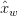

, 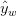, and 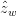represent the three axes in the world coordinate frame. The location of the point is expressed through the vector .

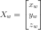

* * *

### **[摄像机坐标框](#TOC)**

和世界坐标系一样，我们有另一个参照系，叫做相机坐标系，如图**图 5** 所示。

***这一帧位于摄像机*** 的中心。与世界坐标框架不同，这不是一个静态的参考框架。我们可以像移动相机拍照一样移动这个框架。

同一点

from **Figure 4** can now be located with both frames of reference, as shown in **Figure 6**.

而在世界坐标框架中，该点由定位

vector, in the camera coordinate frame, it is located by the vector as shown in **Figure 6**.

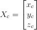

***注:*** *点的位置不变。只是看待这个点的方式随着参照系的变化而变化。*

* * *

### **[坐标变换](#TOC)**

我们建立了两个坐标框架:世界和相机。现在让我们定义两者之间的映射。

让我们来点

from **Figure 6**. Our goal is to build a bridge between the camera coordinates 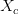and world coordinates .

From **Figure 5**, we can say that

")

在哪里

*   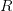表示摄像机坐标框架相对于世界坐标框架的方向。方向由矩阵表示。

    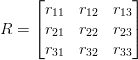

    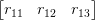→世界坐标系中的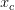方向。

    →世界坐标系中的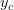方向。

    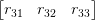→世界坐标系中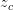的方向。

*   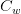代表摄像机坐标框架相对于世界坐标框架的位置。位置由向量表示。

我们可以将上面的等式展开如下

 \\ \Rightarrow X_{c} = R \times X_w - R \times C_w \\ \Rightarrow X_{c} = R \times X_w + t ")

其中

represents the translation matrix  "). The mapping between the two coordinate systems has been devised but is not yet complete. In the above equation, we have a matrix multiplication along with a matrix addition. It is always preferable to compress things to a single matrix multiplication if we can. To do so we will use a concept called [homogeneous coordinates](https://en.wikipedia.org/wiki/Homogeneous_coordinates).

The homogeneous coordinate system allows us to represent an dimensional point ![x = [x_0, x_1, \dots, x_n]](img/37c282989d37059c7e32664a10e715bd.png "x = [x_0, x_1, \dots, x_n]")in an 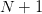dimensional space ![\tilde{x} = [\tilde{x}_0, \tilde{x}_1, \dots, \tilde{x}_n, w]](img/7034faeccb017d1c8887949d74b61369.png "\tilde{x} = [\tilde{x}_0, \tilde{x}_1, \dots, \tilde{x}_n, w]")with a fictitious variable 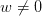such that

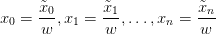

使用齐次坐标系我们可以转换

(3D) to 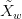(4D).

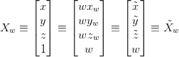

有了齐次坐标，我们可以把方程压缩成矩阵乘法。


其中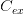

is the matrix that holds the orientation and position of the camera coordinate frame. We can call this matrix the **Camera Extrinsic** since it represents values like rotation and translation, both of which are external properties of the camera.

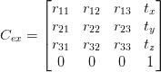

* * *

### **[射影变换](#TOC)**

我们从一个点开始

and its (homogeneous) world coordinates . With the help of the camera extrinsic matrix , was transformed into its (homogeneous) camera coordinates 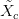.

Now we come to the final stage of actually materializing an image from the 3D camera coordinates as shown in **Figure 7**.

要理解射影变换，我们唯一需要的就是相似三角形。我们来做一个类似三角形的入门。

我们已经在图 8 和图 9 中看到了类似的三角形。具有相似的三角形

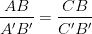

是的，你猜对了，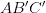

and 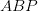are similar triangles in **Figure 10**.

从相似三角形的性质，我们可以推导出

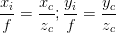

因此，它遵循:

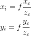

现在，重要的是要记住，实际的图像平面不是虚拟平面，而是图像传感器阵列。3D 场景落在该传感器上，这导致图像的形成。因此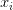

and 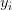in the image plane can be substituted with pixel values 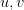.

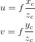

图像平面中的像素从左上角`(0, 0)`开始，因此也需要相对于图像平面的中心移动像素。


在这里，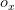

and 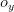are the center points of the image plane.

现在我们有一个来自 3D 摄像机空间的点，用来表示

in the image plane. Again to make matrices agree, we have to express the pixel values using homogeneous representation.

的齐次表示

, where 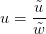and 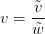

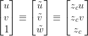

这可以进一步表示为:

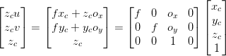

最后，我们有:

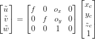

这可以简单地表达为

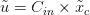

其中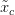

is the set of vectors containing the location of the point in camera coordinate space and 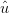is the set of values containing the location of the point on the image plane. Respectively, 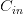represents the set of values needed to map a point from the 3D camera space to the 2D space.

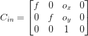

我们可以叫

the **camera intrinsic** since it represents values like focal length and center of the image plane along and 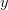axes, both of which are internal properties of the camera.

* * *

### **[数据集](#TOC)**

理论够了！给我看一些代码。

在本节中，我们将讨论我们将要处理的数据。作者开源了他们的数据集，你可以在这里找到它。数据集的链接发表在 [NeRF](https://github.com/bmild/nerf) 的官方知识库中。数据集的结构如图**图 11** 所示。

有两个文件夹，`nerf_synthetic`和`nerf_llff_data`。接下来，我们将使用这个系列的合成数据集。

让我们看看`nerf_synthetic`文件夹里有什么。`nerf_synthetic`文件夹中的数据如图**图 12** 所示。

这里有很多人造物体。让我们下载其中一个，看看里面有什么。我们选择了“ship”数据集，但是可以随意下载其中的任何一个。

解压缩数据集后，您会发现包含图像的三个文件夹:

*   `train`
*   `val`
*   `test`

以及包含照相机的方向和位置的三个文件。

*   `transforms_train.json`
*   `transforms_val.json`
*   `transforms_test.json`

为了更好地理解 json 文件，我们可以打开一个[空白的 Colab 笔记本](https://research.google.com/colaboratory/)，上传`transforms_train.json`。我们现在可以对它进行探索性的数据分析。

```py
# import the necessary packages
import json
import numpy as np

# define the json training file
jsonTrainFile = "transforms_train.json"

# open the file and read the contents of the file
with open(jsonTrainFile, "r") as fp:
    jsonTrainData = json.load(fp)

# print the content of the json file
print(f"[INFO] Focal length train: {jsonTrainData['camera_angle_x']}")
print(f"[INFO] Number of frames train: {len(jsonTrainData['frames'])}")

# OUTPUT
# [INFO] Focal length train: 0.6911112070083618
# [INFO] Number of frames train: 100
```

我们从在**线 2 和 3** 上导入必要的包`json`和`numpy`开始。

然后我们加载 json 并在**第 6-10 行**读取它的值。

JSON 文件有两个父键，分别叫做`camera_angle_x`和`frames`。我们看到`camera_angle_x`对应于相机的视野，`frames`是每个图像(帧)的元数据集合。

在**第 13 行和第 14 行，**我们打印 json 键的值。**第 17 行和第 18 行**显示输出。

让我们再深入调查一下`frames`。

```py
# grab the first frame
firstFrame = jsonTrainData["frames"][0]

# grab the transform matrix and file name
tMat = np.array(firstFrame["transform_matrix"])
fName = firstFrame["file_path"]

# print the data
print(tMat)
print(fName)

# OUTPUT
# array([[-0.92501402,  0.27488998, -0.26226836, -1.05723763],
#       [-0.37993318, -0.66926789,  0.63853836,  2.5740304 ],
#       [ 0\.        ,  0.6903013 ,  0.72352195,  2.91661024],
#       [ 0\.        ,  0\.        ,  0\.        ,  1\.        ]])
# ./train/r_0
```

我们在第 20 行抓取第一帧**。每一帧都是一个字典，包含两个键`transform_matrix`和`file_path`，如**第 23 行和第 24 行**所示。`file_path`是考虑中的图像(帧)的路径，`transform_matrix`是该图像的摄像机到世界矩阵。

在**第 27 行和第 28 行，**我们打印了`transform_matrix`和`file_path`。**第 31-35 行**显示输出。**

* * *

## **[汇总](#TOC)**

在本教程中，我们研究了计算机图形学中的一些基本主题。这对于理解 NeRF 至关重要。虽然这是基本的，但仍然是向前迈进的重要一步。

我们可以回忆一下我们在**三个简单步骤**中学到的内容:

1.  正向成像模式(拍照)
2.  世界到相机(3D 到 3D)转换
3.  相机到图像(3D 到 2D)转换

此时，我们也熟悉了所需的数据集。这涵盖了所有的先决条件。

下周我们将看看这篇论文的各种基本概念: [NeRF:将场景表示为用于视图合成的神经辐射场](https://arxiv.org/abs/2003.08934)。我们还将学习如何使用 TensorFlow 和 Python 实现这些概念。

我们希望你喜欢这个教程，一定要下载数据集并尝试一下。

### **[引用信息](#TOC)**

**gothipaty，A. R .，和 Raha， **R.**** “使用 TensorFlow 和 Keras 的 NeRF 的计算机图形学和深度学习:第 1 部分”， *PyImageSearch* ，2021，[https://PyImageSearch . com/2021/11/10/Computer-Graphics-and-Deep-Learning-with-NeRF-using-tensor flow-and-Keras-Part-1/](https://pyimagesearch.com/2021/11/10/computer-graphics-and-deep-learning-with-nerf-using-tensorflow-and-keras-part-1/)

```py
@article{Gosthipaty_Raha_2021_pt1,
    author = {Aritra Roy Gosthipaty and Ritwik Raha},
    title = {Computer Graphics and Deep Learning with {NeRF} using {TensorFlow} and {Keras}: Part 1},
    journal = {PyImageSearch},
    year = {2021},
    note = {https://pyimagesearch.com/2021/11/10/computer-graphics-and-deep-learning-with-nerf-using-tensorflow-and-keras-part-1/},   
}
```

**要下载这篇文章的源代码(并在未来教程在 PyImageSearch 上发布时得到通知)，*只需在下面的表格中输入您的电子邮件地址！***