# 使用 TensorFlow 和 Keras 的 NeRF 的计算机图形和深度学习:第 2 部分

> 原文：<https://pyimagesearch.com/2021/11/17/computer-graphics-and-deep-learning-with-nerf-using-tensorflow-and-keras-part-2/>

NeRF 的独特性，从它在计算机图形学和深度学习领域打开的门的数量就可以证明。这些领域从医学成像、3D 场景重建、动画产业、场景的重新照明到深度估计。

在我们上周的教程中，我们熟悉了 NeRF 的先决条件。我们还探索了将要使用的数据集。现在，最好提醒我们自己最初的问题陈述。

> 如果有一种方法可以从一组稀疏的 2D 图片中捕捉到整个 3D 场景，会怎么样？

在本教程中，我们将重点介绍 NeRF 从稀疏图像集中捕捉 3D 场景的算法。

本课是关于使用 TensorFlow 和 Keras 的 NeRF 的计算机图形和深度学习的 3 部分系列的第 2 部分:

*   [*计算机图形学与使用 TensorFlow 和 Keras 的 NeRF 深度学习:第一部分*](https://pyimagesearch.com/2021/11/10/computer-graphics-and-deep-learning-with-nerf-using-tensorflow-and-keras-part-1/) (上周教程)
*   使用 TensorFlow 和 Keras 的 NeRF 的计算机图形学和深度学习:第二部分(本周教程)
*   使用 TensorFlow 和 Keras 的 NeRF 的计算机图形学和深度学习:第 3 部分(下周教程)

**要了解神经辐射场或 NeRF，** ***只要继续阅读。***

* * *

## **[使用 TensorFlow 和 Keras 的 NeRF 的计算机图形学和深度学习:第二部分](#TOC)**

在本教程中，我们直接进入 NeRF 的概念。我们将本教程分为以下几个部分:

*   **NeRF 简介:**NeRF 概述
*   **输入数据管道:**`tf.data`输入数据管道
    *   **公用事业和图像:**为图像建立`tf.data`管道
    *   **生成光线:**为光线建立`tf.data`管道
    *   **采样点:**来自射线的采样点
*   **NeRF 多层感知器:**NeRF 多层感知器(MLP)架构
*   **体绘制:**了解体绘制过程
*   **光度损失:**了解 NeRF 中使用的损失
*   **增强 NeRF:** 增强 NeRF 的技术
    *   **位置编码:**了解位置编码
    *   **分层抽样:**了解分层抽样

在本教程结束时，我们将能够理解 NeRF 中提出的概念。

* * *

### **[配置您的开发环境](#TOC)**

要遵循本指南，您需要在系统上安装 TensorFlow 库。

幸运的是，TensorFlow 可以在 pip 上安装:

```py
$ pip install tensorflow
```

* * *

### **[在配置开发环境时遇到了问题？](#TOC)**

说了这么多，你是:

*   时间紧迫？
*   了解你雇主的行政锁定系统？
*   想要跳过与命令行、包管理器和虚拟环境斗争的麻烦吗？
*   **准备好在您的 Windows、macOS 或 Linux 系统上运行代码*****？***

 *那今天就加入 [PyImageSearch 大学](https://pyimagesearch.com/pyimagesearch-university/)吧！

**获得本教程的 Jupyter 笔记本和其他 PyImageSearch 指南，这些指南是** ***预先配置的*** **，可以在您的网络浏览器中运行在 Google Colab 的生态系统上！**无需安装。

最棒的是，这些 Jupyter 笔记本可以在 Windows、macOS 和 Linux 上运行！

* * *

### **[项目结构](#TOC)**

我们首先需要回顾我们的项目目录结构。

首先访问本教程的 ***“下载”*** 部分，检索源代码和示例图像。

让我们来看看目录结构:

```py
$ tree --dirsfirst
.
├── dataset
│   ├── test
│   │   ├── r_0_depth_0000.png
│   │   ├── r_0_normal_0000.png
│   │   ├── r_0.png
│   │   ├── ..
│   │   └── ..
│   ├── train
│   │   ├── r_0.png
│   │   ├── r_10.png
│   │   ├── ..
│   │   └── ..
│   ├── val
│   │   ├── r_0.png
│   │   ├── r_10.png
│   │   ├── ..
│   │   └── ..
│   ├── transforms_test.json
│   ├── transforms_train.json
│   └── transforms_val.json
├── pyimagesearch
│   ├── config.py
│   ├── data.py
│   ├── encoder.py
│   ├── __init__.py
│   ├── nerf.py
│   ├── nerf_trainer.py
│   ├── train_monitor.py
│   └── utils.py
├── inference.py
└── train.py
```

父目录有两个 python 脚本和两个文件夹。

*   `dataset`文件夹包含三个子文件夹:`train`、`test`和`val`，用于训练、测试和验证图像。
*   `pyimagesearch`文件夹包含我们将用于训练的所有 python 脚本。
*   最后，我们有两个驱动脚本:`train.py`和`inference.py`。我们将在下周的教程中学习训练和推理。

***注:*** *出于时间的考虑，我们将 NeRF 的实现分为两部分。这篇博客介绍了这些概念，而下周的博客将涵盖训练和推理脚本。*

* * *

### **[NeRF](#TOC)简介**

先说论文的前提。你可以从几个特定的角度看到特定场景的图像。现在，您希望从一个全新的视图生成场景的图像。这个问题属于新颖的图像合成，如图**图 2** 所示。

我们想到的新颖视图合成的直接解决方案是在训练数据集上使用[生成对抗网络](https://pyimagesearch.com/2021/09/13/intro-to-generative-adversarial-networks-gans/) (GAN)。对于甘斯，我们把自己限制在图像的 2D 空间。

[米尔登霍尔等人(2020)](https://arxiv.org/abs/2003.08934) 另一方面，问一个简单的问题。

> 为什么不从图像本身获取全部的 3d 能量呢？

让我们花点时间试着理解这个想法。

我们现在正在看一个转换的问题陈述。从*新颖的视图合成*，我们已经从一组稀疏的 2D 图像过渡到了 *3D 场景捕捉。

这个新的问题陈述也将作为小说观点综合问题的解决方案。如果我们手头有 3D 场景，生成一个新颖的视图有多困难？*

注意，NeRF 不是第一个解决这个问题的人。它的前辈已经使用了各种方法，包括卷积神经网络( [CNN](http://yann.lecun.com/exdb/publis/pdf/lecun-99.pdf) )和[基于梯度的网格优化](https://www.gcc.tu-darmstadt.de/media/gcc/papers/Waechter-2014-LTB.pdf)。然而，根据该论文，由于更高的空间和时间复杂性，这些方法不能扩展到更好的分辨率。NeRF 旨在优化底层的**连续体场景函数**。

如果您第一眼看不到所有这些术语，请不要担心。博客的其余部分致力于将这些主题细分为最细微的细节，并逐一解释。

我们从一组稀疏的图像及其对应的相机元数据(方向和位置)开始。接下来，我们想要实现整个场景的 3D 表现，如图**图 3** 所示。

下图显示了 NeRF 的步骤:

*   **生成光线:**在这一步，我们让光线穿过图像的每个像素。光线(光线 A 和光线 B)是与图像相交并穿过 3D 框(场景)的红线(**图 4** )。

*   **采样点:**在这一步我们在如图**图 5** 所示的射线上采样点")。我们必须注意，这些点位于射线上，使它们成为盒子内部的 3D 点。

每个点都有唯一的位置")

and a direction component ")linked as shown (**Figure 6**). The direction of each point is the same as the direction of the ray.

*   **深度学习:**我们将这些点传入一个 MLP ( **图 7** ，预测该点对应的颜色和密度。

*   **体绘制:**我们考虑单条光线(此处为光线 A)，将所有采样点发送到 MLP，得到相应的颜色和密度，如图**图 8** 。在我们获得每个点的颜色和密度之后，我们可以应用经典的体绘制(在后面的部分中定义)来预测光线穿过的图像像素(这里是像素 P)的颜色。

*   **光度损失:**像素的预测颜色(如图**图 9)** 与像素的实际颜色之差，造成光度损失。这最终允许我们在 MLP 上执行反向传播，并使损失最小化。

* * *

### **[输入数据管道](#TOC)**

至此，我们对 NeRF 有了一个鸟瞰。然而，在进一步描述该算法之前，我们需要首先定义一个**输入数据管道**。

我们从[上周的教程](https://pyimagesearch.com/2021/11/10/computer-graphics-and-deep-learning-with-nerf-using-tensorflow-and-keras-part-1/)中得知，我们的[数据集](https://drive.google.com/drive/folders/128yBriW1IG_3NJ5Rp7APSTZsJqdJdfc1)包含*图像*和相应的*摄像机方位*。所以现在，我们需要建立一个产生*图像*和相应的*光线*的数据管道。

在本节中，我们将使用`tf.data` API 逐步构建这个数据管道。`tf.data`确保以高效的方式构建和使用数据集。如果你想对`tf.data`有个初步了解，可以参考[这篇教程](https://pyimagesearch.com/2021/06/21/data-pipelines-with-tf-data-and-tensorflow/)。

整个数据管道被写入`pyimagesearch/data.py`文件。所以，让我们打开文件，开始挖掘吧！

* * *

#### **[效用和图像](#TOC)**

```py
# import the necessary packages
from tensorflow.io import read_file
from tensorflow.image import decode_jpeg
from tensorflow.image import convert_image_dtype
from tensorflow.image import resize
from tensorflow import reshape
import tensorflow as tf
import json
```

我们从在**2-8 行**导入必要的包开始

*   `tensorflow`构建数据管道
*   `json`用于读取和处理 json 数据

```py
def read_json(jsonPath):
	# open the json file
	with open(jsonPath, "r") as fp:
		# read the json data
		data = json.load(fp)

	# return the data
	return data
```

在**的第 10-17 行**，我们定义了`read_json`函数。该函数获取`json`文件(`jsonPath`)的路径，并返回解析后的`data`。

我们用**行 12** 上的`open`函数打开`json`文件。然后，有了文件指针，我们读取内容并用第 14 行**的`json.load`函数解析它。最后，**第 17 行**返回解析后的 json 数据。**

```py
def get_image_c2w(jsonData, datasetPath):
	# define a list to store the image paths
	imagePaths = []

	# define a list to store the camera2world matrices
	c2ws = []

	# iterate over each frame of the data
	for frame in jsonData["frames"]:
		# grab the image file name
		imagePath = frame["file_path"]
		imagePath = imagePath.replace(".", datasetPath)
		imagePaths.append(f"{imagePath}.png")

		# grab the camera2world matrix
		c2ws.append(frame["transform_matrix"])

	# return the image file names and the camera2world matrices
	return (imagePaths, c2ws)
```

在**第 19-37 行**上，我们定义了`get_image_c2w`函数。该函数获取解析后的 json 数据(`jsonData`)和数据集的路径(`datasetPath`)，并返回图像的路径(`imagePaths`)及其对应的摄像机到世界(`c2ws`)矩阵。

在**的第 21-24 行，**我们定义了两个空列表:`imagePaths`和`c2ws`。在**的第 27-34 行**，我们迭代经过解析的 json 数据，并将图像路径和摄像机到世界矩阵添加到空列表中。在迭代了整个数据之后，我们返回两个列表(**第 37 行**)。

使用`tf.data.Dataset`实例，我们将需要一种方法来转换数据集，同时将它提供给模型。为了有效地做到这一点，我们使用了 [`map`](https://www.tensorflow.org/api_docs/python/tf/data/Dataset#map) 功能。`map`函数接受`tf.data.Dataset`实例和一个应用于数据集每个元素的函数。

`pyimagesearch/data.py`的后半部分定义了与`map`函数一起使用来转换数据集的函数。

```py
class GetImages():
	def __init__(self, imageWidth, imageHeight):
		# define the image width and height
		self.imageWidth = imageWidth
		self.imageHeight = imageHeight

	def __call__(self, imagePath):
		# read the image file
		image = read_file(imagePath)

		# decode the image string
		image = decode_jpeg(image, 3)

		# convert the image dtype from uint8 to float32
		image = convert_image_dtype(image, dtype=tf.float32)

		# resize the image to the height and width in config
		image = resize(image, (self.imageWidth, self.imageHeight))
		image = reshape(image, (self.imageWidth, self.imageHeight, 3))

		# return the image
		return image
```

在继续之前，让我们讨论一下为什么我们选择用 `__call__` **方法**构建一个**类，而不是构建一个可以用`map`函数应用的**函数**。**

问题是传递给`map`函数的函数除了数据集的元素之外不能接受任何东西。这是一个强加的限制，我们需要绕过它。

为了克服这个问题，我们创建了一个类，可以保存一些在函数调用中使用的属性(这里是`imageWidth`和`imageHeight`)。

在第 39-60 行的**中，我们用一个自定义的`__call__`和`__init__`函数构建了`GetImages`类。**

`__init__`:我们将使用这个函数来初始化参数`imageWidth`和`imageHeight` ( **第 40-43 行**)

`__call__`:这个方法使得对象可调用。我们将使用这个函数来读取来自`imagePaths` ( **行 47** )的图像。接下来，它现在被解码成可用的 jpeg 格式(**第 50 行**)。然后，我们将图像从`uint8`转换为`float32`，并对其进行整形(**第 53-57 行**)。

* * *

#### **[生成射线](#TOC)**

计算机图形中的光线可以参数化为

=\vec{o}+t\vec{d}")

在哪里

*   ")是雷
*   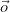是雷的起源
*   是光线方向的单位矢量
*   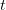是参数(如时间)

为了建立射线方程，我们需要原点和方向。在 NeRF 的上下文中，我们通过将光线的原点作为图像平面的像素位置，并将方向作为连接像素和相机光圈的直线来生成光线。这在**图 10** 中进行了说明。

我们可以使用下面的等式容易地设计出 2D 图像相对于照相机坐标框架的像素位置。

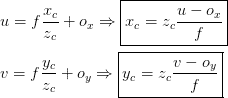

定位像素点的原点很容易，但是获取光线的方向有点困难。在上一节中，我们有

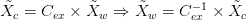

来自数据集的相机到世界矩阵是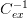

that we need.

![C_{ex}^{-1} = \left[\begin{matrix} r_{11}^\prime & r_{12}^\prime & r_{13}^\prime & t_x^\prime\\ r_{21}^\prime & r_{22}^\prime & r_{23}^\prime & t_y^\prime\\ r_{31}^\prime & r_{32}^\prime & r_{33}^\prime & t_z^\prime\\ 0 & 0 & 0 & 1\\ \end{matrix}\right]](img/82264ac2f8ccffa9c00d3166b7c687d2.png "C_{ex}^{-1} = \left[\begin{matrix} r_{11}^\prime & r_{12}^\prime & r_{13}^\prime & t_x^\prime\\ r_{21}^\prime & r_{22}^\prime & r_{23}^\prime & t_y^\prime\\ r_{31}^\prime & r_{32}^\prime & r_{33}^\prime & t_z^\prime\\ 0 & 0 & 0 & 1\\ \end{matrix}\right]")

为了定义方向向量，我们不需要整个摄像机到世界矩阵；相反，我们使用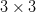

upper matrix that defines the camera’s orientation.

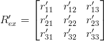

有了旋转矩阵，我们可以通过下面的等式得到单位方向向量。


艰难的计算现在已经结束。对于简单的部分，光线的原点将是相机到世界矩阵的平移向量。

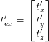

让我们看看如何将它翻译成代码。我们将继续处理`pyimagesearch/data.py`文件。

```py
class GetRays:
	def __init__(self, focalLength, imageWidth, imageHeight, near, 
		far, nC):
		# define the focal length, image width, and image height
		self.focalLength = focalLength
		self.imageWidth = imageWidth
		self.imageHeight = imageHeight

		# define the near and far bounding values
		self.near = near
		self.far = far

		# define the number of samples for coarse model
		self.nC = nC
```

在第 62-75 行的**，上，我们创建了带有自定义`__call__`和`__init__`函数的类`GetRays`。**

 **`__init__`:我们初始化**行 66-68** 上的`focalLength`、`imageWidth`和`imageHeight`，以及摄像机视场的`near`和`far`边界(**行 71 和 72** )。我们将需要它来构造进入场景的光线，如图 8 所示。

```py
	def __call__(self, camera2world):
		# create a meshgrid of image dimensions
		(x, y) = tf.meshgrid(
			tf.range(self.imageWidth, dtype=tf.float32),
			tf.range(self.imageHeight, dtype=tf.float32),
			indexing="xy",
		)

		# define the camera coordinates
		xCamera = (x - self.imageWidth * 0.5) / self.focalLength
		yCamera = (y - self.imageHeight * 0.5) / self.focalLength

		# define the camera vector
		xCyCzC = tf.stack([xCamera, -yCamera, -tf.ones_like(x)],
			axis=-1)

		# slice the camera2world matrix to obtain the rotation and
		# translation matrix
		rotation = camera2world[:3, :3]
		translation = camera2world[:3, -1]
```

`__call__`:我们将`camera2world`矩阵输入到这个方法中，然后这个方法返回

*   `rayO`:原点
*   `rayD`:方向点的集合
*   `tVals`:采样点

在第 79-83 行上，我们创建了一个图像尺寸的网格。这与**图 10 所示的图像平面相同。**

接下来，我们使用从我们的[以前的博客](https://pyimagesearch.com/2021/11/10/computer-graphics-and-deep-learning-with-nerf-using-tensorflow-and-keras-part-1/)中得到的公式获得相机坐标(**第 86 和 87 行**)。

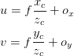

我们通过堆叠摄像机坐标来定义摄像机向量`xCyCzC`的齐次表示(**行 90 和 91** )。

在第 95 和 96 行上，我们从摄像机到世界矩阵中提取旋转矩阵和平移向量。

```py
		# expand the camera coordinates to 
		xCyCzC = xCyCzC[..., None, :]

		# get the world coordinates
		xWyWzW = xCyCzC * rotation

		# calculate the direction vector of the ray
		rayD = tf.reduce_sum(xWyWzW, axis=-1)
		rayD = rayD / tf.norm(rayD, axis=-1, keepdims=True)

		# calculate the origin vector of the ray
		rayO = tf.broadcast_to(translation, tf.shape(rayD))

		# get the sample points from the ray
		tVals = tf.linspace(self.near, self.far, self.nC)
		noiseShape = list(rayO.shape[:-1]) + [self.nC]
		noise = (tf.random.uniform(shape=noiseShape) * 
			(self.far - self.near) / self.nC)
		tVals = tVals + noise

		# return ray origin, direction, and the sample points
		return (rayO, rayD, tVals)
```

然后我们使用旋转矩阵将摄像机坐标转换为世界坐标(**行 99-102** )。

接下来，我们计算方向`rayD`(**105 和 106 线**)和原点向量`rayO`(**109 线**)。

在**行 112-116** 上，我们从光线中采样点。

***注:*** *我们将在下一节学习射线上的采样点。*

最后我们在第 119 的**行返回`rayO`、`rayD`和`tVals`。**

* * *

#### **[样点](#TOC)**

生成光线后，我们需要从光线中绘制样本 3D 点。为此，我们建议两种方法。

*   **定期采样点**:方法名称不言自明。这里，我们以固定的间隔对射线上的点进行采样，如图 11 中的**所示。**

采样公式如下:

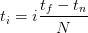

其中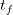

and are the farthest and nearest points on the ray, respectively. We divide the entire ray into 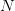equidistant parts, and the divisions serve as the sample points.

*   **随机采样点:**在这种方法中，我们在采样点的过程中加入了随机性。这里的想法是，如果样本点来自射线的随机位置，模型将暴露于新数据。这将使它正规化，以产生更好的结果。该策略如图**图 12** 所示。

这由下面的等式证明:

![t_i = U \left[t_n\displaystyle\frac{i-1}{N}(t_f-t_n),t_n+\displaystyle\frac{i}{N}(t_f-t_n)\right]](img/9d746a59390eaf4391db20cbca786738.png "t_i = U \left[t_n\displaystyle\frac{i-1}{N}(t_f-t_n),t_n+\displaystyle\frac{i}{N}(t_f-t_n)\right]")

其中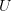

refers to uniform sampling. Here, we take a random point from the space between two adjacent points.

* * *

### **[NeRF 多层感知器](#TOC)**

每个样本点是 5 维的。点的空间位置是一个三维矢量(

), and the direction of the point is a 2D vector (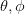). [Mildenhall et al. (2020)](https://arxiv.org/abs/2003.08934) advocate expressing the viewing direction as a 3D Cartesian unit vector 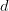.

这些 5D 点作为 MLP 的输入。**这个具有 5D 点的射线场在论文**中被称为神经辐射场。

MLP 网络预测每个输入点的颜色

and volume density 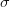. Color refers to the (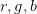) content of the point. The volume density can be interpreted as the differential probability of a ray terminating at an infinitesimal particle at that point.

MLP 架构如图 13 所示。

这里需要注意的重要一点是:

> 我们通过限制网络来预测体积密度,从而鼓励表示具有多视图一致性
> 
> as a function of only the location 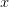while allowing the RGB color to be predicted as a function of both locations and viewing direction.

有了这些理论，我们就可以开始在 TensorFlow 中构建 NeRF 架构了。所以，我们打开文件`pyimagesearch/nerf.py`开始挖吧。

```py
# import the necessary packages
from tensorflow.keras.layers import Dense
from tensorflow.keras.layers import concatenate
from tensorflow.keras import Input
from tensorflow.keras import Model
```

我们从在**2-5 号线**进口必要的包装开始。

```py
def get_model(lxyz, lDir, batchSize, denseUnits, skipLayer):
	# build input layer for rays
	rayInput = Input(shape=(None, None, None, 2 * 3 * lxyz + 3),
		batch_size=batchSize)

	# build input layer for direction of the rays
	dirInput = Input(shape=(None, None, None, 2 * 3 * lDir + 3),
		batch_size=batchSize)

	# creating an input for the MLP
	x = rayInput
	for i in range(8):
		# build a dense layer
		x = Dense(units=denseUnits, activation="relu")(x)

		# check if we have to include residual connection
		if i % skipLayer == 0 and i > 0:
			# inject the residual connection
			x = concatenate([x, rayInput], axis=-1)

	# get the sigma value
	sigma = Dense(units=1, activation="relu")(x)

	# create the feature vector
	feature = Dense(units=denseUnits)(x)

	# concatenate the feature vector with the direction input and put
	# it through a dense layer
	feature = concatenate([feature, dirInput], axis=-1)
	x = Dense(units=denseUnits//2, activation="relu")(feature)

	# get the rgb value
	rgb = Dense(units=3, activation="sigmoid")(x)

	# create the nerf model
	nerfModel = Model(inputs=[rayInput, dirInput],
		outputs=[rgb, sigma])

	# return the nerf model
	return nerfModel
```

接下来，在**第 7-46 行，**我们在函数`get_model`中创建我们的 MLP 模型。该方法接受以下输入:

*   `lxyz`:用于 xyz 坐标位置编码的维数
*   `lDir`:用于方向向量的位置编码的维数
*   `batchSize`:数据的批量
*   `denseUnits`:MLP 每层的单元数
*   `skipLayer`:我们希望跳过连接的层

在**的第 9-14 行，**我们定义了`rayInput`和`dirInput`层。接下来，我们用跳过连接创建 MLP(**第 17-25 行**)。

为了与纸张(*多视图一致性*)对齐，只有`rayInput`通过模型产生`sigma`(体积密度)和第 28-31 行上的一个特征向量。最后，将特征向量与`dirInput` ( **第 35 行**)串接，产生颜色(**第 39 行**)。

在**的第 42 和 43 行**、**和**上，我们使用 Keras 功能 API 构建了`nerfModel`。最后，我们返回第 46 行**上的`nerfModel`。**

* * *

### **[体绘制](#TOC)**

在这一节中，我们研究如何实现体绘制。我们使用从 MLP 预测的颜色和体积密度来渲染 3D 场景。

来自网络的预测被插入到[经典体绘制](https://en.wikipedia.org/wiki/Volume_rendering)方程中，以导出一个特定点的颜色。例如，下面给出了相同的等式:

= \displaystyle\int_{tn}^{tf}T(t)\sigma(r(t))c(r(t),d)dt")

听起来很复杂？

让我们把这个等式分解成几个简单的部分。

*   ")是物体的颜色点。
*    = o+ td")是馈入网络的射线，其中变量代表以下内容:
    *   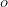为射线的原点
    *   是射线的方向
    *   是用于积分的近点和远点之间的均匀样本的集合
*   )")是体积密度，也可以解释为光线终止于点的微分概率。
*   )")是光线在点上的颜色

这些是等式的组成部分。除了这些，还有一个术语")

 = \exp{(- \displaystyle\int_{tn}^t\sigma(r(s))ds)}")

这代表从近点沿光线的透射率

to the current point . Think of this as a measure of how much the ray can penetrate the 3D space to a certain point.

现在，当我们把所有的项放在一起时，我们终于可以理解这个等式了。

=  \displaystyle\int_{tn}^{tf}T(t)\sigma(r(t))c(r(t),d)dt ")

3D 空间中对象的颜色被定义为(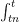

) the transmittance (")), volume density (}")), the color of the current point ()")) and the direction of the ray sampled for all points existing between the near (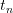) and far () of the viewing plane.

Let’s look at how to express this in code. First, we will look at the `render_image_depth` in the `pyimagesearch/utils.py` file.

```py
def render_image_depth(rgb, sigma, tVals):
	# squeeze the last dimension of sigma
	sigma = sigma[..., 0]

	# calculate the delta between adjacent tVals
	delta = tVals[..., 1:] - tVals[..., :-1]
	deltaShape = [BATCH_SIZE, IMAGE_HEIGHT, IMAGE_WIDTH, 1]
	delta = tf.concat(
		[delta, tf.broadcast_to([1e10], shape=deltaShape)], axis=-1)

	# calculate alpha from sigma and delta values
	alpha = 1.0 - tf.exp(-sigma * delta)

	# calculate the exponential term for easier calculations
	expTerm = 1.0 - alpha
	epsilon = 1e-10

	# calculate the transmittance and weights of the ray points
	transmittance = tf.math.cumprod(expTerm + epsilon, axis=-1,
		exclusive=True)
	weights = alpha * transmittance

	# build the image and depth map from the points of the rays
	image = tf.reduce_sum(weights[..., None] * rgb, axis=-2)
	depth = tf.reduce_sum(weights * tVals, axis=-1)

	# return rgb, depth map and weights
	return (image, depth, weights)
```

在**第 15-42 行**上，我们正在构建一个`render_image_depth`函数，它接受以下输入:

*   `rgb`:光线点的红绿蓝颜色矩阵
*   `sigma`:采样点的体积密度
*   `tVals`:采样点

它产生体绘制图像(`image`)、深度图(`depth`)和权重(分层采样所需)。

*   在第 17 行的**上，为了便于计算，我们对`sigma`进行了整形。接下来，我们计算相邻`tVals` ( **行 20-23** )之间的间距(`delta`)。**
*   接下来我们使用`sigma`和`delta` ( **第 26 行)创建`alpha`。**
*   我们创建透射比和权重向量(**第 33-35 行** ) **。**
*   在**行** **38 和 39** ，我们创建图像和深度图。

最后，我们在第 42 的**行返回`image`、`depth`和`weights`。**

* * *

### 光度损失

我们将 NeRF 使用的损失函数称为光度损失。这是通过将合成图像的颜色与真实图像进行比较来计算的。数学上，这可以表示为:

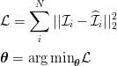

其中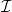

is the real image and 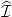is the synthesized image. This function, when applied to the entire pipeline, is still fully differentiable. This allows us to train the model parameters (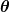) using backpropagation.

* * *

### **[喘息者](#TOC)**

让我们花一点时间来意识到我们已经走了多远。像我们图 14 中的朋友一样深呼吸。

在我们博客系列的第一部分[中，我们已经学习了计算机图形学及其基础知识。在本教程中，我们将这些概念应用到 3D 场景表现中。我们这里有:](https://pyimagesearch.com/2021/11/10/computer-graphics-and-deep-learning-with-nerf-using-tensorflow-and-keras-part-1/) 

1.  从给定的`json`文件中构建了一个**图像**和一个**光线数据集**。
2.  **使用随机采样策略从光线中采样点**。
3.  将这些观点传递给了 MLP。
4.  **使用 MLP 预测的颜色和体积密度渲染一幅新图像**。
5.  建立了一个损失函数(**光度损失**)，我们将使用它来优化 MLP 的参数。

这些步骤足以训练一个 NeRF 模型并呈现新颖的视图。然而，这种香草架构最终会产生低质量的渲染。为了缓解这些问题，[米尔登霍尔等人(2020)](https://arxiv.org/abs/2003.08934) 提出了额外的增强措施。

在下一节中，我们将了解这些增强功能及其使用 TensorFlow 的实现。

* * *

### **[增强 NeRF](#TOC)**

[米尔登霍尔等人(2020)](https://arxiv.org/abs/2003.08934) 提出了两种方法来增强来自 NeRF 的渲染。

*   位置编码
*   分层抽样

* * *

#### **[位置编码](#TOC)**

位置编码是一种流行的编码格式，用于像[变形金刚](https://arxiv.org/abs/1706.03762)这样的架构中。[米尔登霍尔等人(2020)](https://arxiv.org/abs/2003.08934) 证明使用这种方法可以更好地渲染高频特征，如*纹理*和*细节*。

[Rahaman et al. (2019)](https://arxiv.org/abs/1806.08734) 提出深度网络偏向于学习低频函数。为了解决这个问题，NeRF 建议映射输入向量")

to a higher dimensional representation. Since the 5D input space is the position of the points, we are essentially encoding the positions from which it gets the name.

假设我们有 10 个位置索引为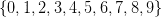

. The indices are in the decimal system. If we encode the digits in the binary system, we will get something, as shown in **Figure 15**.

二进制是一种简单的编码系统。这里我们面临的唯一问题是，二进制系统填充了**个零**，使其成为一种稀疏表示。我们想让这个系统*连续*和*紧凑*。

NeRF 中使用的编码函数如下:

 = (\sin(2^0{\pi}p),\cos(2^0{\pi}p),\dots,\sin(2^{L-1}{\pi}p),\cos(2^{L-1}{\pi}p))")

为了比较二进制和 NeRF 编码，让我们看一下图 16 。

正弦和余弦函数使编码连续，而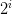

term makes it similar to the binary system.

位置编码功能的可视化")

is given in **Figure 17**. The blue line depicts the cosine component, while the red line is the sine component.

我们可以在`pyimagesearch/encode.py`文件中一个名为`encoder_fn`的函数中非常简单地创建它。

```py
# import the necessary packages
import tensorflow as tf

def encoder_fn(p, L):
	# build the list of positional encodings
	gamma = [p]

	# iterate over the number of dimensions in time
	for i in range(L):
		# insert sine and cosine of the product of current dimension
		# and the position vector
		gamma.append(tf.sin((2.0 ** i) * p))
		gamma.append(tf.cos((2.0 ** i) * p))

	# concatenate the positional encodings into a positional vector
	gamma = tf.concat(gamma, axis=-1)

	# return the positional encoding vector
	return gamma
```

我们从导入`tensorflow` ( **线 2** )开始。在**第 4-19 行**中，我们定义了编码器函数，它接受以下参数:

*   `p`:每个待编码元素的位置
*   `L`:编码将发生的维度

在第 6 行的**上，我们定义了一个保存位置编码的列表。接下来，我们遍历维度，并将编码后的值添加到列表中(**第 9-13 行**)。**第 16-19 行**用于将同一个列表转换成张量并最终返回。**

* * *

#### **[分层抽样](#TOC)**

[米尔登霍尔等人(2020)](https://arxiv.org/abs/2003.08934) 发现了原始结构的另一个问题。随机采样方法将沿着每条相机光线对`N`点进行采样。这意味着我们不知道应该在哪里采样。这最终导致低效的渲染。

他们提出以下解决方案来补救这种情况:

*   建立两个相同的 NeRF MLP 模型，粗略的网络和精细的网络。

*   使用随机采样策略沿相机光线采样一组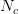点，如图**图 12** 所示。这些点将用于查询粗略网络。

*   粗略网络的输出用于产生沿每条射线的点的更有根据的采样。这些样本偏向于 3D 场景中更相关的部分。

    为此，我们重写颜色方程:

    =  \displaystyle\int_{tn}^{tf}T(t)\sigma(r(t))c(r(t),d)dt")

    作为所有样本颜色的加权和。

     = \displaystyle\sum_1^{N_{c}}(w_i c_i) ")

    这里的术语是)")。

*   当归一化时，权重产生分段常数概率密度函数。

    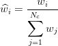

    将权重转化为概率密度函数的整个过程在图 18 中可视化。

*   从概率密度函数中，我们使用[逆变换采样](https://en.wikipedia.org/wiki/Inverse_transform_sampling)方法对第二组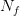位置进行采样，如图**图 19** 所示。

*   现在我们既有和组采样点。我们将这些点发送到**精细网络**来产生光线的最终渲染颜色。

将权重转换为一组新的样本点的过程可以通过一个名为`sample_pdf`的函数来表示。首先，让我们参考一下`pyimagesearch`文件夹中的`utils.py`文件。

```py
def sample_pdf(tValsMid, weights, nF):
	# add a small value to the weights to prevent it from nan
	weights += 1e-5

	# normalize the weights to get the pdf
	pdf = weights / tf.reduce_sum(weights, axis=-1, keepdims=True)

	# from pdf to cdf transformation
	cdf = tf.cumsum(pdf, axis=-1)

	# start the cdf with 0s
	cdf = tf.concat([tf.zeros_like(cdf[..., :1]), cdf], axis=-1)

	# get the sample points
	uShape = [BATCH_SIZE, IMAGE_HEIGHT, IMAGE_WIDTH, nF]
	u = tf.random.uniform(shape=uShape)

	# get the indices of the points of u when u is inserted into cdf in a
	# sorted manner
	indices = tf.searchsorted(cdf, u, side="right")

	# define the boundaries
	below = tf.maximum(0, indices-1)
	above = tf.minimum(cdf.shape[-1]-1, indices)
	indicesG = tf.stack([below, above], axis=-1)

	# gather the cdf according to the indices
	cdfG = tf.gather(cdf, indicesG, axis=-1,
		batch_dims=len(indicesG.shape)-2)

	# gather the tVals according to the indices
	tValsMidG = tf.gather(tValsMid, indicesG, axis=-1,
		batch_dims=len(indicesG.shape)-2)

	# create the samples by inverting the cdf
	denom = cdfG[..., 1] - cdfG[..., 0]
	denom = tf.where(denom < 1e-5, tf.ones_like(denom), denom)
	t = (u - cdfG[..., 0]) / denom
	samples = (tValsMidG[..., 0] + t * 
		(tValsMidG[..., 1] - tValsMidG[..., 0]))

	# return the samples
	return samples
```

这段代码片段受到了官方 NeRF [实现](https://github.com/bmild/nerf/blob/20a91e764a28816ee2234fcadb73bd59a613a44c/run_nerf_helpers.py#L183)的启发。在**第 44-86 行**，我们创建了一个名为`sample_pdf`的函数，它接受以下参数:

*   `tValsMid`:两个相邻`tVals`的中点
*   `weights`:体绘制功能中使用的权重
*   `nF`:精细模型使用的点数

在**第 46-49 行**，我们根据权重定义概率密度函数，然后将其转换为累积分布函数(cdf)。然后使用逆变换采样将其转换回精细模型的采样点(**第 52-86 行**)。

我们推荐这本[补充阅读材料](https://en.wikipedia.org/wiki/Inverse_transform_sampling)，更好地理解分层抽样。

* * *

### **[信用点](#TOC)**

本教程的灵感来自于[米尔登霍尔等人(2020)](https://arxiv.org/abs/2003.08934) 的工作。

* * *

## **[汇总](#TOC)**

我们已经研究了 NeRF 论文中提出的核心概念，并且使用 TensorFlow 实现了它们。

我们可以通过以下步骤回忆到目前为止所学的内容:

1.  为 5D 场景表示构建图像和光线数据集
2.  使用任何采样策略从光线中采样点
3.  通过纳夫 MLP 模型传递这些点
4.  基于 MLP 模型输出的体绘制
5.  计算光度损失
6.  使用位置编码和分层采样来提高渲染质量

在下周的教程中，我们将讲述如何利用所有这些概念来训练 NeRF 模型。此外，我们还将渲染来自 2D 图像的 3D 场景的 360 度视频。我们希望你喜欢本周的教程，一如既往，你可以下载源代码并亲自试用。

* * *

### **[引用信息](#TOC)**

**gothipaty，A. R .和 Raha，R.** “使用 TensorFlow 和 Keras 的 NeRF 的计算机图形学和深度学习:第二部分”， *PyImageSearch* ，2021 年，[https://PyImageSearch . com/2021/11/17/Computer-Graphics-and-Deep-Learning-with-NeRF-using-tensor flow-and-Keras-Part-2/](https://pyimagesearch.com/2021/11/17/computer-graphics-and-deep-learning-with-nerf-using-tensorflow-and-keras-part-2/)

```py
@article{Gosthipaty_Raha_2021_pt2,
  author = {Aritra Roy Gosthipaty and Ritwik Raha},
  title = {Computer Graphics and Deep Learning with {NeRF} using {TensorFlow} and {Keras}: Part 2},
  journal = {PyImageSearch},
  year = {2021},
  note = {https://pyimagesearch.com/2021/11/17/computer-graphics-and-deep-learning-with-nerf-using-tensorflow-and-keras-part-2/},
}
```

**要下载这篇文章的源代码(并在未来教程在 PyImageSearch 上发布时得到通知)，*只需在下面的表格中输入您的电子邮件地址！******