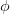

# 使用 TensorFlow 和 Keras 的 NeRF 的计算机图形和深度学习:第 3 部分

> 原文：<https://pyimagesearch.com/2021/11/24/computer-graphics-and-deep-learning-with-nerf-using-tensorflow-and-keras-part-3/>

让我们把时钟拨回一两个星期。在[第一篇教程](https://pyimagesearch.com/2021/11/10/computer-graphics-and-deep-learning-with-nerf-using-tensorflow-and-keras-part-1/)中，我们学习了计算机图形学和图像渲染的基础知识。在[第二篇教程](https://pyimagesearch.com/2021/11/17/computer-graphics-and-deep-learning-with-nerf-using-tensorflow-and-keras-part-2/)中，我们更深入的研究了 [NeRF](https://arxiv.org/abs/2003.08934) 提出的核心思想，并用 TensorFlow 和 Keras 实现了它们。

我们首先提醒自己我们要解决的原始问题:

> 如果有一种方法可以从一组稀疏的 2D 图片中捕捉到整个 3D 场景，会怎么样？

为了解决这个问题，我们已经走了很长的路。我们已经创建了构建 NeRF 所需的架构和组件。但是我们还不知道每一部分是如何融入更大的画面中的。

在本教程中，我们*集合*所有细节来训练 NeRF 模型。

本课是关于使用 TensorFlow 和 Keras 的 NeRF 的计算机图形和深度学习的 3 部分系列的最后一部分:

*   [*计算机图形学与使用 TensorFlow 和 Keras 的 NeRF 深度学习:第 1 部分*](https://pyimagesearch.com/2021/11/10/computer-graphics-and-deep-learning-with-nerf-using-tensorflow-and-keras-part-1/) (第一周教程)
*   [*计算机图形学与使用 TensorFlow 和 Keras 的 NeRF 深度学习:第二部分*](https://pyimagesearch.com/2021/11/17/computer-graphics-and-deep-learning-with-nerf-using-tensorflow-and-keras-part-2/) (上周教程)
*   使用 TensorFlow 和 Keras 的 NeRF 的计算机图形学和深度学习:第 3 部分(本周教程)

**要了解使用神经辐射场或 NeRF 的体绘制，** ***继续阅读。***

* * *

## **[使用 TensorFlow 和 Keras 的 NeRF 的计算机图形学和深度学习:第三部分](#TOC)**

在本周的教程中，我们将明确地着眼于训练我们上周建立的 NeRF 多层感知器(MLP)。我们将本教程分为以下几个部分:

*   NeRF 集合:如何训练一个 NeRF
    *   **NeRF 训练师:**一个助手模型，训练粗糙的和*精细的* NeRF 模型
    *   **自定义回调:**帮助我们可视化培训过程的自定义回调
    *   **把所有的东西绑在一起:**把所有的组件绑在一起
*   **推理:**从训练好的 NeRF 模型建立 3D 场景

* * *

### **[配置您的开发环境](#TOC)**

要遵循本指南，您需要在系统上安装 TensorFlow 库。

幸运的是，TensorFlow 可以在 pip 上安装:

```py
$ pip install tensorflow
```

* * *

### **[在配置开发环境时遇到了问题？](#TOC)**

说了这么多，你是:

*   时间紧迫？
*   了解你雇主的行政锁定系统？
*   想要跳过与命令行、包管理器和虚拟环境斗争的麻烦吗？
*   **准备好在您的 Windows、macOS 或 Linux 系统上运行代码*****？***

 *那今天就加入 [PyImageSearch 大学](https://pyimagesearch.com/pyimagesearch-university/)吧！

**获得本教程的 Jupyter 笔记本和其他 PyImageSearch 指南，这些指南是** ***预先配置的*** **，可以在您的网络浏览器中运行在 Google Colab 的生态系统上！**无需安装。

最棒的是，这些 Jupyter 笔记本可以在 Windows、macOS 和 Linux 上运行！

* * *

### **[项目结构](#TOC)**

让我们回忆一下[上周教程](https://pyimagesearch.com/2021/11/17/computer-graphics-and-deep-learning-with-nerf-using-tensorflow-and-keras-part-2/)中的项目目录结构。

通过访问本教程的 ***【下载】*** 部分来检索源代码。我们还希望你下载数据集，并把它放在手边。你可以在[第一教程](https://pyimagesearch.com/2021/11/10/computer-graphics-and-deep-learning-with-nerf-using-tensorflow-and-keras-part-1/)中找到关于数据集的细节。

接下来，让我们来看看目录结构:

```py
$ tree --dirsfirst
.
├── dataset
│   ├── test
│   │   ├── r_0_depth_0000.png
│   │   ├── r_0_normal_0000.png
│   │   ├── r_0.png
│   │   ├── ..
│   │   └── ..
│   ├── train
│   │   ├── r_0.png
│   │   ├── r_10.png
│   │   ├── ..
│   │   └── ..
│   ├── val
│   │   ├── r_0.png
│   │   ├── r_10.png
│   │   ├── ..
│   │   └── ..
│   ├── transforms_test.json
│   ├── transforms_train.json
│   └── transforms_val.json
├── pyimagesearch
│   ├── config.py
│   ├── data.py
│   ├── encoder.py
│   ├── __init__.py
│   ├── nerf.py
│   ├── nerf_trainer.py
│   ├── train_monitor.py
│   └── utils.py
├── inference.py
└── train.py
```

`dataset`文件夹包含三个子文件夹，`train`、`test`和`val`，用于训练、测试和验证图像。

`pyimagesearch`文件夹包含我们将用于训练的所有 python 脚本。这些已经在[上周的教程](https://pyimagesearch.com/2021/11/17/computer-graphics-and-deep-learning-with-nerf-using-tensorflow-and-keras-part-2/)中讨论和解释过了。

接下来，我们有两个驱动脚本:`train.py`和`inference.py`。我们用`train.py`脚本训练我们的 NeRF 模型。使用`inference.py`，我们从经过训练的 NeRF 模型生成一个 360 度全景视频。

* * *

### **[NeRF 调集](#TOC)**

在这一节中，我们组装(*双关语为*)在[之前的博客文章](https://pyimagesearch.com/2021/11/17/computer-graphics-and-deep-learning-with-nerf-using-tensorflow-and-keras-part-2/)中解释的所有组件，并开始训练 NeRF 模型。本节将介绍三个 python 脚本。

1.  `nerf_trainer.py` **:** 定制 keras 车型训练出**粗**和**细**车型
2.  `train_monitor.py` **:** 一个定制的回调，用于可视化并从培训过程中获得洞察力
3.  `train.py` **:** 最终的剧本把一切都集合在一起

把这一段当做像**图 2** 一样的终极战斗口号。当我们完成这一部分时，我们将准备好训练好的 NeRF 模型。

* * *

#### **[NeRF 训练师](#TOC)**

`tf.keras`有一个漂亮的 [`fit`](https://www.tensorflow.org/api_docs/python/tf/keras/Model#fit) API 被调用来训练一个模型。当培训管道变得复杂时，我们建立一个定制的`tf.keras.Model`和一个定制的`train_step`。这样，我们仍然可以利用`fit`功能。我们向任何想要深入了解的人推荐关于定制 fit 呼叫的官方 keras 教程。

在 NeRF 培训管道中，MLP 很简单。我们面临的唯一复杂问题是*体绘制*和*分层采样*。

请注意，我们用分层抽样训练两个模型(**粗**和**细**)，而不是一个。为了封装`fit`调用中的所有内容，我们构建了一个定制的`NeRF_Trainer`模型。

`NeRF_Trainer`写在`pyimagesearch/nerf_trainer.py`中。让我们打开文件，仔细阅读脚本，以便更好地理解它。

```py
# import the necessary packages
from tensorflow.keras.metrics import Mean
import tensorflow as tf
```

我们从第 2-3 行中的必要导入开始。

```py
class Nerf_Trainer(tf.keras.Model):
	def __init__(self, coarseModel, fineModel, lxyz, lDir, 
		encoderFn, renderImageDepth, samplePdf, nF):
		super().__init__()
		# define the coarse model and fine model
		self.coarseModel = coarseModel
		self.fineModel = fineModel

		# define the dimensions for positional encoding for spatial
		# coordinates and direction
		self.lxyz = lxyz
		self.lDir = lDir

		# define the positional encoder
		self.encoderFn = encoderFn

		# define the volume rendering function
		self.renderImageDepth = renderImageDepth

		# define the hierarchical sampling function and the number of
		# samples for the fine model
		self.samplePdf = samplePdf
		self.nF = nF
```

在**的第 6-27 行**中，`__init__`方法作为`Nerf_Trainer`模型构造器。该方法接受以下参数:

*   `coarseModel`:粗 NeRF 模型
*   `fineModel`:精细的 NeRF 模型
*   `lxyz`:用于`xyz`坐标位置编码的维数
*   `lDir`:用于方向向量的位置编码的维数
*   `encoderFn`:模型的位置编码功能
*   `renderImageDepth`:体绘制功能
*   `samplePdf`:分级采样的效用函数
*   `nF`:精细模型样本数

```py
	def compile(self, optimizerCoarse, optimizerFine, lossFn):
		super().compile()
		# define the optimizer for the coarse and fine model
		self.optimizerCoarse = optimizerCoarse
		self.optimizerFine = optimizerFine

		# define the photometric loss function
		self.lossFn = lossFn

		# define the loss and psnr tracker
		self.lossTracker = Mean(name="loss")
		self.psnrMetric = Mean(name="psnr")
```

在**的第 29-40 行**中，我们定义了`compile`方法，在编译`Nerf_Trainer`模型时会调用这个方法。该方法接受以下参数:

*   `optimizerCoarse`:粗模型的优化器
*   `optimizerFine`:精细模型的优化器
*   `lossFn`:NeRF 模型的损失函数

在**的第 39 和 40 行，**我们定义了两个跟踪器，即`lossTracker`和`psnrTracker`。我们使用这些跟踪器来跟踪原始图像和预测图像之间的模型损失和 PSNR。

```py
	def train_step(self, inputs):
		# get the images and the rays
		(elements, images) = inputs
		(raysOriCoarse, raysDirCoarse, tValsCoarse) = elements

		# generate the coarse rays
		raysCoarse = (raysOriCoarse[..., None, :] + 
			(raysDirCoarse[..., None, :] * tValsCoarse[..., None]))

		# positional encode the rays and dirs
		raysCoarse = self.encoderFn(raysCoarse, self.lxyz)
		dirCoarseShape = tf.shape(raysCoarse[..., :3])
		dirsCoarse = tf.broadcast_to(raysDirCoarse[..., None, :],
			shape=dirCoarseShape)
		dirsCoarse = self.encoderFn(dirsCoarse, self.lDir)
```

现在我们从`train_step`方法开始(**第 42-127 行**)。当我们在`Nerf_Trainer`定制模型上做`model.fit()`时，这个方法被调用。以下几点解释了`train_step`方法:

*   **第 44 行和第 45 行**解包输入。
*   **第 48 行和第 49 行**为粗略模型生成光线。
*   **第 52-56 行**使用位置编码功能对光线和方向进行编码。

```py
		# keep track of our gradients
		with tf.GradientTape() as coarseTape:
			# compute the predictions from the coarse model
			(rgbCoarse, sigmaCoarse) = self.coarseModel([raysCoarse, 
				dirsCoarse])

			# render the image from the predictions
			renderCoarse = self.renderImageDepth(rgb=rgbCoarse,
				sigma=sigmaCoarse, tVals=tValsCoarse)
			(imagesCoarse, _, weightsCoarse) = renderCoarse

			# compute the photometric loss
			lossCoarse = self.lossFn(images, imagesCoarse)
```

*   在**第 59-70 行**上，我们定义了粗模型的正向通道。在**第 61 和 62 行**、**、**上，模型接受光线和方向作为输入，并产生`rgb`(颜色)和`sigma`(体积密度)。
*   这些输出(`rgb`和`sigma`)然后通过`renderImageDepth`函数(用于体绘制)并产生图像深度图和权重(**第 65-67 行**)。
*   在**行 70** 上，我们计算粗略模型的目标图像和渲染图像之间的均方误差。

```py
		# compute the middle values of t vals
		tValsCoarseMid = (0.5 * 
			(tValsCoarse[..., 1:] + tValsCoarse[..., :-1]))

		# apply hierarchical sampling and get the t vals for the fine
		# model
		tValsFine = self.samplePdf(tValsMid=tValsCoarseMid,
			weights=weightsCoarse, nF=self.nF)
		tValsFine = tf.sort(
			tf.concat([tValsCoarse, tValsFine], axis=-1), axis=-1)

		# build the fine rays and positional encode it
		raysFine = (raysOriCoarse[..., None, :] + 
			(raysDirCoarse[..., None, :] * tValsFine[..., None]))
		raysFine = self.encoderFn(raysFine, self.lxyz)

		# build the fine directions and positional encode it
		dirsFineShape = tf.shape(raysFine[..., :3])
		dirsFine = tf.broadcast_to(raysDirCoarse[..., None, :],
			shape=dirsFineShape)
		dirsFine = self.encoderFn(dirsFine, self.lDir)
```

*   在**第 73-81 行**，我们使用`sample_pdf`函数计算精细模型的`tValsFine`
*   接下来，我们为精细模型建立光线和方向(**行 84-92** )。

```py
		# keep track of our gradients
		with tf.GradientTape() as fineTape:
			# compute the predictions from the fine model
			rgbFine, sigmaFine = self.fineModel([raysFine, dirsFine])

			# render the image from the predictions
			renderFine = self.renderImageDepth(rgb=rgbFine,
				sigma=sigmaFine, tVals=tValsFine)
			(imageFine, _, _) = renderFine

			# compute the photometric loss
			lossFine = self.lossFn(images, imageFine)
```

*   **第 94-105 行**用于定义精细模型的正向传递。这与粗略模型的正向传递相同。

```py
		# get the trainable variables from the coarse model and
		# apply back propagation
		tvCoarse = self.coarseModel.trainable_variables
		gradsCoarse = coarseTape.gradient(lossCoarse, tvCoarse)
		self.optimizerCoarse.apply_gradients(zip(gradsCoarse, 
			tvCoarse))

		# get the trainable variables from the coarse model and
		# apply back propagation
		tvFine = self.fineModel.trainable_variables
		gradsFine = fineTape.gradient(lossFine, tvFine)
		self.optimizerFine.apply_gradients(zip(gradsFine, tvFine))
		psnr = tf.image.psnr(images, imageFine, max_val=1.0)

		# compute the loss and psnr metrics
		self.lossTracker.update_state(lossFine)
		self.psnrMetric.update_state(psnr)

		# return the loss and psnr metrics
		return {"loss": self.lossTracker.result(),
			"psnr": self.psnrMetric.result()}
```

*   在**行 109，**上，我们获得粗略模型的可训练参数。计算这些参数的梯度(**行 110** )。我们使用优化器将计算的梯度应用到这些参数上(**行 111 和 112**
*   然后对精细模型的参数重复相同的操作(**行 116-119** )。
*   **线 122 和 123** 用于更新损耗和峰值信噪比(PSNR)跟踪器，然后通过**线 126 和 127** 返回。

```py
	def test_step(self, inputs):
		# get the images and the rays
		(elements, images) = inputs
		(raysOriCoarse, raysDirCoarse, tValsCoarse) = elements

		# generate the coarse rays
		raysCoarse = (raysOriCoarse[..., None, :] + 
			(raysDirCoarse[..., None, :] * tValsCoarse[..., None]))

		# positional encode the rays and dirs
		raysCoarse = self.encoderFn(raysCoarse, self.lxyz)
		dirCoarseShape = tf.shape(raysCoarse[..., :3])
		dirsCoarse = tf.broadcast_to(raysDirCoarse[..., None, :],
			shape=dirCoarseShape)
		dirsCoarse = self.encoderFn(dirsCoarse, self.lDir)

		# compute the predictions from the coarse model
		(rgbCoarse, sigmaCoarse) = self.coarseModel([raysCoarse,
			dirsCoarse])

		# render the image from the predictions
		renderCoarse = self.renderImageDepth(rgb=rgbCoarse,
			sigma=sigmaCoarse, tVals=tValsCoarse)
		(_, _, weightsCoarse) = renderCoarse

		# compute the middle values of t vals
		tValsCoarseMid = (0.5 * 
			(tValsCoarse[..., 1:] + tValsCoarse[..., :-1]))

		# apply hierarchical sampling and get the t vals for the fine
		# model
		tValsFine = self.samplePdf(tValsMid=tValsCoarseMid,
			weights=weightsCoarse, nF=self.nF)
		tValsFine = tf.sort(
			tf.concat([tValsCoarse, tValsFine], axis=-1), axis=-1)

		# build the fine rays and positional encode it
		raysFine = (raysOriCoarse[..., None, :] + 
			(raysDirCoarse[..., None, :] * tValsFine[..., None]))
		raysFine = self.encoderFn(raysFine, self.lxyz)

		# build the fine directions and positional encode it
		dirsFineShape = tf.shape(raysFine[..., :3])
		dirsFine = tf.broadcast_to(raysDirCoarse[..., None, :],
			shape=dirsFineShape)
		dirsFine = self.encoderFn(dirsFine, self.lDir)

		# compute the predictions from the fine model
		rgbFine, sigmaFine = self.fineModel([raysFine, dirsFine])

		# render the image from the predictions
		renderFine = self.renderImageDepth(rgb=rgbFine,
			sigma=sigmaFine, tVals=tValsFine)
		(imageFine, _, _) = renderFine

		# compute the photometric loss and psnr
		lossFine = self.lossFn(images, imageFine)
		psnr = tf.image.psnr(images, imageFine, max_val=1.0)

		# compute the loss and psnr metrics
		self.lossTracker.update_state(lossFine)
		self.psnrMetric.update_state(psnr)

		# return the loss and psnr metrics
		return {"loss": self.lossTracker.result(),
			"psnr": self.psnrMetric.result()}

	@property
	def metrics(self):
		# return the loss and psnr tracker
		return [self.lossTracker, self.psnrMetric]
```

现在我们定义`test_step` ( **第 129-194 行**)。`test_step`和`train_step`是一样的。唯一的区别是我们没有计算`test_step`中的梯度。

最后，我们将损失跟踪器和 PSNR 跟踪器定义为类属性(**第 196-199 行**)。

* * *

#### **[自定义回调](#TOC)**

这里需要注意的重要一点是，NeRF 模型非常占用内存。因此，虽然看到结果很酷，但同样重要的是将每个训练过程可视化。

为了可视化每个步骤，我们创建了一个自定义回调。我们建议阅读本教程，以便更好地理解 Keras 中的自定义回调。

我们打开`pyimagesearch/train_monitor.py`开始挖吧。

```py
# import the necessary packages
from tensorflow.keras.preprocessing.image import array_to_img
from tensorflow.keras.callbacks import Callback
import matplotlib.pyplot as plt
import tensorflow as tf
```

我们首先为这个脚本导入必要的包(**第 2-5 行**)。

```py
def get_train_monitor(testDs, encoderFn, lxyz, lDir, imagePath):
	# grab images and rays from the testing dataset
	(tElements, tImages) = next(iter(testDs))
	(tRaysOriCoarse, tRaysDirCoarse, tTvalsCoarse) = tElements

	# build the test coarse ray
	tRaysCoarse = (tRaysOriCoarse[..., None, :] + 
		(tRaysDirCoarse[..., None, :] * tTvalsCoarse[..., None]))

	# positional encode the rays and direction vectors for the coarse
	# ray
	tRaysCoarse = encoderFn(tRaysCoarse, lxyz)
	tDirsCoarseShape = tf.shape(tRaysCoarse[..., :3])
	tDirsCoarse = tf.broadcast_to(tRaysDirCoarse[..., None, :],
		shape=tDirsCoarseShape)
	tDirsCoarse = encoderFn(tDirsCoarse, lDir)
```

*   在第 7 行的**上，我们定义了`get_train_monitor`方法，该方法构建并返回一个自定义回调。**
*   在**第 9 行和第 10 行**、**、**上，我们对来自`testDs`(测试数据集)的输入进行解包。
*   接下来在**第 13 行和第 14 行**、**、**我们为粗略模型生成光线。
*   在第**行第 18-22** 、**和**行，我们使用位置编码对粗略模型的光线和方向进行编码。

```py
	class TrainMonitor(Callback):
		def on_epoch_end(self, epoch, logs=None):
			# compute the coarse model prediction
			(tRgbCoarse, tSigmaCoarse) = self.model.coarseModel.predict(
				[tRaysCoarse, tDirsCoarse])

			# render the image from the model prediction
			tRenderCoarse = self.model.renderImageDepth(rgb=tRgbCoarse,
				sigma=tSigmaCoarse, tVals=tTvalsCoarse)
			(tImageCoarse, _, tWeightsCoarse) = tRenderCoarse

			# compute the middle values of t vals
			tTvalsCoarseMid = (0.5 * 
				(tTvalsCoarse[..., 1:] + tTvalsCoarse[..., :-1]))

			# apply hierarchical sampling and get the t vals for the 
			# fine model
			tTvalsFine = self.model.samplePdf(
				tValsMid=tTvalsCoarseMid, weights=tWeightsCoarse,
				nF=self.model.nF)
			tTvalsFine = tf.sort(
				tf.concat([tTvalsCoarse, tTvalsFine], axis=-1),
				axis=-1)

			# build the fine rays and positional encode it
			tRaysFine = (tRaysOriCoarse[..., None, :] + 
				(tRaysDirCoarse[..., None, :] * tTvalsFine[..., None])
			)
			tRaysFine = self.model.encoderFn(tRaysFine, lxyz)

			# build the fine directions and positional encode it
			tDirsFineShape = tf.shape(tRaysFine[..., :3])
			tDirsFine = tf.broadcast_to(tRaysDirCoarse[..., None, :],
				shape=tDirsFineShape)
			tDirsFine = self.model.encoderFn(tDirsFine, lDir)

			# compute the fine model prediction
			tRgbFine, tSigmaFine = self.model.fineModel.predict(
				[tRaysFine, tDirsFine])

			# render the image from the model prediction
			tRenderFine = self.model.renderImageDepth(rgb=tRgbFine,
				sigma=tSigmaFine, tVals=tTvalsFine)
			(tImageFine, tDepthFine, _) = tRenderFine

			# plot the coarse image, fine image, fine depth map and
			# target image
			(_, ax) = plt.subplots(nrows=1, ncols=4, figsize=(10, 10))
			ax[0].imshow(array_to_img(tImageCoarse[0]))
			ax[0].set_title(f"Corase Image")

			ax[1].imshow(array_to_img(tImageFine[0]))
			ax[1].set_title(f"Fine Image")

			ax[2].imshow(array_to_img(tDepthFine[0, ..., None]), 
				cmap="inferno")
			ax[2].set_title(f"Fine Depth Image")

			ax[3].imshow(array_to_img(tImages[0]))
			ax[3].set_title(f"Real Image")

			plt.savefig(f"{imagePath}/{epoch:03d}.png")
			plt.close()

	# instantiate a train monitor callback
	trainMonitor = TrainMonitor()

	# return the train monitor
	return trainMonitor
```

我们在自定义回调类中定义了`on_epoch_end`函数，以帮助可视化训练日志和数据(**第 25 行**)。顾名思义，该功能仅在模型训练的每个时期结束时触发

*   在第 27 和 28 行，的**上，我们使用粗略模型预测颜色和体积密度。接下来，在**第 31-33 行**上，我们使用体积渲染函数`renderImageDepth`来渲染粗糙图像。**
*   然后，我们使用分层采样生成精细采样点(**第 36-46 行**)。
*   在**第 49-51 行**上，我们使用精细采样点，并通过将精细采样点与粗糙光线相乘来生成精细光线。
*   在**行 52** 上，我们使用位置编码对精细光线进行编码。
*   然后我们从光线中提取方向分量(**行 55** ) 并对其进行整形(**行 56 和 57** )，最后使用位置编码(**行 58** )对方向进行编码。
*   然后使用精细光线、方向和模型来预测细化的颜色和体积密度(**行 61 和 62** )。我们用这些在第 65-67 行的**上渲染图像和深度图。**
*   然后在**行 71-86** 上显现粗略图像、精细图像和深度图。
*   在**行 89** 上，我们实例化列车监视器回调，然后在**行 92** 上将其返回。

* * *

#### ****

有了所有的组件，我们将最终能够使用下面给出的脚本来训练我们的 NeRF 模型。我们打开`train.py`开始翻吧。

```py
# USAGE
# python train.py

# setting seed for reproducibility
import tensorflow as tf
tf.random.set_seed(42)

# import the necessary packages
from pyimagesearch.data import read_json
from pyimagesearch.data import get_image_c2w
from pyimagesearch.data import GetImages
from pyimagesearch.data import GetRays
from pyimagesearch.utils import get_focal_from_fov, render_image_depth, sample_pdf
from pyimagesearch.encoder import encoder_fn
from pyimagesearch.nerf import get_model
from pyimagesearch.nerf_trainer import Nerf_Trainer
from pyimagesearch.train_monitor import get_train_monitor
from pyimagesearch import config
from tensorflow.keras.optimizers import Adam
from tensorflow.keras.losses import MeanSquaredError
import os
```

在第 6 行的**上，我们设置了用于再现性的随机种子。接下来，我们开始导入必要的包(**第 5-21 行**)。**

```py
# get the train validation and test data
print("[INFO] grabbing the data from json files...")
jsonTrainData = read_json(config.TRAIN_JSON)
jsonValData = read_json(config.VAL_JSON)
jsonTestData = read_json(config.TEST_JSON)

focalLength = get_focal_from_fov(
	fieldOfView=jsonTrainData["camera_angle_x"],
	width=config.IMAGE_WIDTH)

# print the focal length of the camera
print(f"[INFO] focal length of the camera: {focalLength}...")
```

在**第 25-27 行**，我们从各自的`json`文件中提取训练、测试和验证数据。然后我们计算相机的焦距(**第 29-34 行**)并打印出来。

```py
# get the train, validation, and test image paths and camera2world
# matrices
print("[INFO] grabbing the image paths and camera2world matrices...")
trainImagePaths, trainC2Ws = get_image_c2w(jsonData=jsonTrainData,
	datasetPath=config.DATASET_PATH)
valImagePaths, valC2Ws = get_image_c2w(jsonData=jsonValData,
	datasetPath=config.DATASET_PATH)
testImagePaths, testC2Ws = get_image_c2w(jsonData=jsonTestData,
	datasetPath=config.DATASET_PATH)

# instantiate a object of our class used to load images from disk
getImages = GetImages(imageHeight=config.IMAGE_HEIGHT,
	imageWidth=config.IMAGE_WIDTH)

# get the train, validation, and test image dataset
print("[INFO] building the image dataset pipeline...")
trainImageDs = (
	tf.data.Dataset.from_tensor_slices(trainImagePaths)
	.map(getImages, num_parallel_calls=config.AUTO)
)
valImageDs = (
	tf.data.Dataset.from_tensor_slices(valImagePaths)
	.map(getImages, num_parallel_calls=config.AUTO)
)
testImageDs = (
	tf.data.Dataset.from_tensor_slices(testImagePaths)
	.map(getImages, num_parallel_calls=config.AUTO)
)
```

我们从之前提取的 json 数据中构建图像路径和摄像机到世界矩阵(**第 39-44 行**)。

接下来，我们构建`tf.data`图像数据集(**第 52-63 行**)。这些分别包括训练、测试和验证数据集。

```py
# instantiate the GetRays object
getRays = GetRays(focalLength=focalLength, imageWidth=config.IMAGE_WIDTH,
	imageHeight=config.IMAGE_HEIGHT, near=config.NEAR, far=config.FAR,
	nC=config.N_C)

# get the train validation and test rays dataset
print("[INFO] building the rays dataset pipeline...")
trainRayDs = (
	tf.data.Dataset.from_tensor_slices(trainC2Ws)
	.map(getRays, num_parallel_calls=config.AUTO)
)
valRayDs = (
	tf.data.Dataset.from_tensor_slices(valC2Ws)
	.map(getRays, num_parallel_calls=config.AUTO)
)
testRayDs = (
	tf.data.Dataset.from_tensor_slices(testC2Ws)
	.map(getRays, num_parallel_calls=config.AUTO)
)
```

在**的第 66-68 行**，我们实例化了一个`GetRays`类的对象。然后我们创建`tf.data`训练、验证和测试射线数据集(**第 72-83 行**)。

```py
# zip the images and rays dataset together
trainDs = tf.data.Dataset.zip((trainRayDs, trainImageDs))
valDs = tf.data.Dataset.zip((valRayDs, valImageDs))
testDs = tf.data.Dataset.zip((testRayDs, testImageDs))

# build data input pipeline for train, val, and test datasets
trainDs = (
	trainDs
	.shuffle(config.BATCH_SIZE)
	.batch(config.BATCH_SIZE)
	.repeat()
	.prefetch(config.AUTO)
)
valDs = (
	valDs
	.shuffle(config.BATCH_SIZE)
	.batch(config.BATCH_SIZE)
	.repeat()
	.prefetch(config.AUTO)
)
testDs = (
	testDs
	.batch(config.BATCH_SIZE)
	.prefetch(config.AUTO)
)
```

然后将图像和光线数据集压缩在一起(**第 86-88 行**)。所有的数据集(训练、验证和测试)然后被混洗、分批、重复和预取(**第 91-109 行**)。

```py
# instantiate the coarse model
coarseModel = get_model(lxyz=config.L_XYZ, lDir=config.L_DIR,
	batchSize=config.BATCH_SIZE, denseUnits=config.DENSE_UNITS,
	skipLayer=config.SKIP_LAYER)

# instantiate the fine model
fineModel = get_model(lxyz=config.L_XYZ, lDir=config.L_DIR,
	batchSize=config.BATCH_SIZE, denseUnits=config.DENSE_UNITS,
	skipLayer=config.SKIP_LAYER)

# instantiate the nerf trainer model
nerfTrainerModel = Nerf_Trainer(coarseModel=coarseModel, fineModel=fineModel,
	lxyz=config.L_XYZ, lDir=config.L_DIR, encoderFn=encoder_fn,
	renderImageDepth=render_image_depth, samplePdf=sample_pdf,
	nF=config.N_F)

# compile the nerf trainer model with Adam optimizer and MSE loss
nerfTrainerModel.compile(optimizerCoarse=Adam(),optimizerFine=Adam(),
	lossFn=MeanSquaredError())
```

现在我们在(**第 112-119 行**)中定义粗略和精细模型。接下来，我们定义`nerfTrainerModel`，这是一个定制的 keras 模型，它将粗略和精细模型训练在一起(**第 122-125 行**)。

在**的第 128 行和第 129 行**，我们用合适的优化器(这里是`Adam`)和损失函数(这里是均方误差)编译`nerfTrainerModel`。

```py
# check if the output image directory already exists, if it doesn't,
# then create it
if not os.path.exists(config.IMAGE_PATH):
	os.makedirs(config.IMAGE_PATH)

# get the train monitor callback
trainMonitorCallback = get_train_monitor(testDs=testDs,
	encoderFn=encoder_fn, lxyz=config.L_XYZ, lDir=config.L_DIR,
	imagePath=config.IMAGE_PATH)

# train the NeRF model
print("[INFO] training the nerf model...")
nerfTrainerModel.fit(trainDs, steps_per_epoch=config.STEPS_PER_EPOCH,
	validation_data=valDs, validation_steps=config.VALIDATION_STEPS,
	epochs=config.EPOCHS, callbacks=[trainMonitorCallback],
)

# save the coarse and fine model
nerfTrainerModel.coarseModel.save(config.COARSE_PATH)
nerfTrainerModel.fineModel.save(config.FINE_PATH)
```

**第 133-139 行**创建输出目录并初始化`trainMonitorCallback`。最后，我们用训练数据集训练`nerfTrainerModel`，并用验证数据集进行验证(**第 143-146 行**)。

我们通过将训练好的粗略和精细模型存储到磁盘来结束训练过程(**行 149 和 150** )。

* * *

### **[推论](#TOC)**

花一分钟时间祝贺自己，如图 3 。我们从基础做起，现在已经成功训练了 NeRF。这是一个漫长的旅程，我很高兴我们一起做到了这一点。

努力了这么多，还有什么比看到结果更好的。

我们已经模拟了 MLP 的整个三维场景，对吗？为什么不围绕整个场景旋转相机并点击图片呢？

在这一节中，我们将要求我们的模型从它刚刚建模的 3D 场景中合成新的视图。我们将在中综合 360 度的新颖观点

axis.

如果你不熟悉

and axes in the 3D coordinate system, you can quickly revise your concepts with **Figures 4 and 5**.

让我们打开`inference.py`来想象绕θ轴的完整旋转。

```py
# import the necessary packages
from pyimagesearch import config
from pyimagesearch.utils import pose_spherical
from pyimagesearch.data import GetRays
from pyimagesearch.utils import get_focal_from_fov
from pyimagesearch.data import read_json
from pyimagesearch.encoder import encoder_fn
from pyimagesearch.utils import render_image_depth
from pyimagesearch.utils import sample_pdf
from tensorflow.keras.models import load_model
from tqdm import tqdm
import tensorflow as tf
import numpy as np
import imageio
import os
```

我们从通常必需的进口商品开始(**第 2-15 行**)。

```py
# create a camera2world matrix list to store the novel view
# camera2world matrices
c2wList = []

# iterate over theta and generate novel view camera2world matrices
for theta in np.linspace(0.0, 360.0, config.SAMPLE_THETA_POINTS, 
	endpoint=False):
	# generate camera2world matrix
	c2w = pose_spherical(theta, -30.0, 4.0)

	# append the new camera2world matrix into the collection
	c2wList.append(c2w)

# get the train validation and test data
print("[INFO] grabbing the data from json files...")
jsonTrainData = read_json(config.TRAIN_JSON)

focalLength = get_focal_from_fov(
	fieldOfView=jsonTrainData["camera_angle_x"],
	width=config.IMAGE_WIDTH)

# instantiate the GetRays object
getRays = GetRays(focalLength=focalLength, imageWidth=config.IMAGE_WIDTH,
	imageHeight=config.IMAGE_HEIGHT, near=config.NEAR, far=config.FAR,
	nC=config.N_C)

# create a dataset from the novel view camera2world matrices
ds = (
	tf.data.Dataset.from_tensor_slices(c2wList)
	.map(getRays)
	.batch(config.BATCH_SIZE)
)

# load the coarse and the fine model
coarseModel = load_model(config.COARSE_PATH, compile=False)
fineModel = load_model(config.FINE_PATH, compile=False)
```

接下来，在**第 19 行，**我们建立一个空的摄像机到世界矩阵列表`c2w`。在第 22 行的**上，我们迭代了从`0`到`360`的范围。该范围对应于我们将使用的`theta`值。我们保持`phi`为`-30`，距离为`4`。这些值`theta`、`phi`和`distance`被传递到函数`pose_spherical`中，以获得我们的摄像机到世界矩阵(**第 25-28 行**)。**

在**第 31-48 行，**我们获取训练 json 数据并提取光线和焦距。然后，我们创建一个数据集，并根据需要对其进行批处理。

在**第 51 行和第 52 行，**我们加载预训练的粗略和精细模型。

```py
# create a list to hold all the novel view from the nerf model
print("[INFO] grabbing the novel views...")
frameList = []
for element in tqdm(ds):
	(raysOriCoarse, raysDirCoarse, tValsCoarse) = element

	# generate the coarse rays
	raysCoarse = (raysOriCoarse[..., None, :] + 
		(raysDirCoarse[..., None, :] * tValsCoarse[..., None]))

	# positional encode the rays and dirs
	raysCoarse = encoder_fn(raysCoarse, config.L_XYZ)
	dirCoarseShape = tf.shape(raysCoarse[..., :3])
	dirsCoarse = tf.broadcast_to(raysDirCoarse[..., None, :],
		shape=dirCoarseShape)
	dirsCoarse = encoder_fn(dirsCoarse, config.L_DIR)

	# compute the predictions from the coarse model
	(rgbCoarse, sigmaCoarse) = coarseModel.predict(
		[raysCoarse, dirsCoarse])

	# render the image from the predictions
	renderCoarse = render_image_depth(rgb=rgbCoarse,
		sigma=sigmaCoarse, tVals=tValsCoarse)
	(_, _, weightsCoarse) = renderCoarse

	# compute the middle values of t vals
	tValsCoarseMid = (0.5 * 
		(tValsCoarse[..., 1:] + tValsCoarse[..., :-1]))

	# apply hierarchical sampling and get the t vals for the fine
	# model
	tValsFine = sample_pdf(tValsMid=tValsCoarseMid,
		weights=weightsCoarse, nF=config.N_F)
	tValsFine = tf.sort(
		tf.concat([tValsCoarse, tValsFine], axis=-1), axis=-1)

	# build the fine rays and positional encode it
	raysFine = (raysOriCoarse[..., None, :] + 
		(raysDirCoarse[..., None, :] * tValsFine[..., None]))
	raysFine = encoder_fn(raysFine, config.L_XYZ)

	# build the fine directions and positional encode it
	dirsFineShape = tf.shape(raysFine[..., :3])
	dirsFine = tf.broadcast_to(raysDirCoarse[..., None, :],
		shape=dirsFineShape)
	dirsFine = encoder_fn(dirsFine, config.L_DIR)

	# compute the predictions from the fine model
	(rgbFine, sigmaFine) = fineModel.predict([raysFine, dirsFine])

	# render the image from the predictions
	renderFine = render_image_depth(rgb=rgbFine, sigma=sigmaFine,
		tVals=tValsFine)
	(imageFine, _, _) = renderFine

	# insert the rendered fine image to the collection
	frameList.append(imageFine.numpy()[0])
```

我们遍历我们创建的数据集，并解开数据集中每个元素的射线原点、射线方向和采样点(**行 57 和 58** )。我们使用这些渲染我们的粗糙和精细场景，就像我们在训练中做的一样。这可以从以下几点来解释:

*   然后输入被广播到合适的形状，通过编码器功能，最后进入粗略模型以预测`rgbCoarse`和`sigmaCoarse` ( **第 61-73 行**)。
*   在**第 76-78 行**，获得的颜色和体积密度通过`render_image_depth`函数生成渲染图像。
*   在**的第 81-89 行**，我们使用这些样本的中间值和从渲染图像中得到的权重，通过`sample_pdf`函数来计算`tValsFine`。
*   在**行 92-100** 上，我们构建精细模型光线并对其进行位置编码，然后对精细光线的方向重复同样的操作。
*   我们使用来自精细模型的预测来渲染精细图像。新的视图然后被附加到`frameList` ( **第 103-111 行**)。

```py
# check if the output video directory exists, if it does not, then
# create it
if not os.path.exists(config.VIDEO_PATH):
	os.makedirs(config.VIDEO_PATH)

# build the video from the frames and save it to disk
print("[INFO] creating the video from the frames...")
imageio.mimwrite(config.OUTPUT_VIDEO_PATH, frameList, fps=config.FPS,
	quality=config.QUALITY, macro_block_size=config.MACRO_BLOCK_SIZE)
```

最后，我们使用这些帧来渲染对象的 360 度视频(**行 115-121** )。

让我们看看我们努力工作的成果，好吗？渲染热狗物体的 360 度视频如图**图 6 所示。**

* * *

## **[汇总](#TOC)**

在本教程中，我们已经成功地实现了一个可扩展的紧凑的训练和推理脚本。在本教程的最后阶段，我们已经从稀疏的静态图像中合成了新颖的视图，并渲染出一个视频。

NeRF 是深度学习和计算机图形学领域开创性研究的典范。它取得了迄今为止很少有方法能够取得的成果，从而极大地推进了这一领域。在未来几年中，许多变体和改进也将取得成功。

告诉我们您希望我们接下来涵盖这些变体中的哪些？

发推文给我们 [@PyImageSearch](https://twitter.com/pyimagesearch/) 我们希望你喜欢这个 3 部分的教程，和往常一样，你可以下载源代码并亲自尝试。

* * *

### **[引用信息](#TOC)**

**gothipaty，A. R .和 Raha，R.** “使用 TensorFlow 和 Keras 的 NeRF 的计算机图形学和深度学习:第 3 部分”， *PyImageSearch* ，2021 年，[https://PyImageSearch . com/2021/11/24/Computer-Graphics-and-Deep-Learning-with-NeRF-using-tensor flow-and-Keras-Part-3/](https://pyimagesearch.com/2021/11/24/computer-graphics-and-deep-learning-with-nerf-using-tensorflow-and-keras-part-3/)

```py
@article{Gosthipaty_Raha_2021_pt3,
  author = {Aritra Roy Gosthipaty and Ritwik Raha},
  title = {Computer Graphics and Deep Learning with {NeRF} using {TensorFlow} and {Keras}: Part 3},
  journal = {PyImageSearch},
  year = {2021},
  note = {https://pyimagesearch.com/2021/11/24/computer-graphics-and-deep-learning-with-nerf-using-tensorflow-and-keras-part-3/},
}
```

**要下载这篇文章的源代码(并在未来教程在 PyImageSearch 上发布时得到通知)，*只需在下面的表格中输入您的电子邮件地址！****