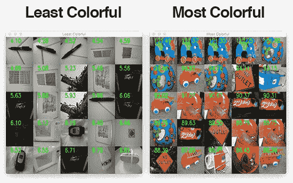
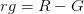
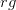
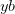
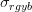
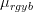
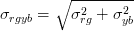
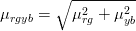
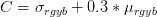

# 用 OpenCV 和 Python 计算图像的“丰富度”

> 原文：<https://pyimagesearch.com/2017/06/05/computing-image-colorfulness-with-opencv-and-python/>



今天这篇博文的灵感来自于我在 Twitter 上收到的一个 PyImageSearch 读者的问题， [@makingyouthink](https://twitter.com/makinguthinkcom) 。

转述一下我自己和@makingyouthink 交换的[推文，问题是:](https://twitter.com/makinguthinkcom/status/847979814472605698)

> 你见过测量自然图像色彩的 Python 实现吗(Hasler 和 Süsstrunk，2003)？
> 
> 我想用它作为一个图像/产品搜索引擎。通过给每张图片一个“色彩量”,我可以根据图片的颜色对它们进行分类。

图像色彩有许多实际用途，包括评估压缩算法、评估给定相机传感器模块对颜色的敏感度、计算图像的“美学质量”，或者简单地创建大量图像可视化，以显示按色彩排列的数据集中的图像光谱。

今天我们将学习如何计算图像的色彩，正如哈斯勒和苏斯特朗克在 2003 年的论文 [*测量自然图像的色彩*中所描述的那样。](https://infoscience.epfl.ch/record/33994/files/HaslerS03.pdf)然后，我们将使用 OpenCV 和 Python 实现我们的色彩度量。

在实现了色彩度量之后，我们将根据颜色对给定的数据集进行排序，并使用我们上周创建的[图像蒙太奇工具](https://pyimagesearch.com/2017/05/29/montages-with-opencv/)显示结果。

**要了解用 OpenCV 计算图像“色彩度”，请继续阅读。**

## 用 OpenCV 和 Python 计算图像的“丰富度”

今天的博文有三个核心部分。

首先，我们将介绍在 Hasler 和 Süsstrunk 的论文中描述的色彩度量方法。

然后，我们将在 Python 和 OpenCV 中实现图像色彩计算。

最后，我将演示如何将色彩度量应用于一组图像，并根据图像的“色彩”程度对其进行排序。我们将利用我们方便的[图像蒙太奇程序](https://pyimagesearch.com/2017/05/29/montages-with-opencv/)进行可视化。

要下载这篇博文的源代码+示例图片，请务必使用下面的 ***“下载”*** 部分。

### 测量图像的色彩

在他们的论文中，Hasler 和 Süsstrunk 首先让 20 名非专业参与者按照 1-7 的颜色等级给图片打分。这项调查是在一组 84 张图片上进行的。标度值为:

1.  不丰富多彩
2.  略带色彩
3.  色彩适中
4.  色彩一般
5.  相当丰富多彩
6.  非常丰富多彩
7.  极其丰富多彩

为了设置基线，作者向参与者提供了 4 幅示例图像以及它们对应的从 1 到 7 的色彩值。

通过一系列的实验计算，他们得出了一个简单的度量标准，即*将*与观众的结果相关联。

他们通过这些实验发现，简单的[对立色彩空间表示](https://engineering.purdue.edu/~bouman/ece637/notes/pdf/Opponent.pdf)以及这些值的平均值和标准偏差与 95.3%的调查数据相关。

我们现在导出它们的图像色彩度量:



 - B")

以上两个等式显示了对手颜色空间表示，其中 R 是红色，G 是绿色，B 是蓝色。在第一个等式中，

is the difference of the Red channel and the Green channel. In the second equation, is represents half of the sum of the Red and Green channels minus the Blue channel.

接下来，标准差(

) and mean () are computed before calculating the final colorfulness metric, .







正如我们将会发现的，这是一种非常有效和实用的计算图像色彩的方法。

在下一节中，我们将使用 Python 和 OpenCV 代码实现这个算法。

### 在 OpenCV 中实现图像色彩度量

现在我们对色彩度有了基本的了解，让我们用 OpenCV 和 NumPy 来计算一下。

在本节中，我们将:

*   导入我们必需的 Python 包。
*   解析我们的命令行参数。
*   遍历数据集中的所有图像，并计算相应的色彩度量。
*   根据图像的色彩对其进行分类。
*   在[蒙太奇](https://pyimagesearch.com/2017/05/29/montages-with-opencv/)中显示“最丰富多彩”和“最不丰富多彩”的图像。

首先打开您最喜欢的文本编辑器或 IDE，创建一个名为`colorfulness.py`的新文件，并插入以下代码:

```py
# import the necessary packages
from imutils import build_montages
from imutils import paths
import numpy as np
import argparse
import imutils
import cv2

```

**第 2-7 行**导入我们需要的 Python 包。

如果您的系统上没有安装`imutils`(在撰写本文时， *v0.4.3* ，那么请确保您通过`pip`安装/升级它:

```py
$ pip install --upgrade imutils

```

***注意:**如果你正在使用 Python 虚拟环境(正如我所有的 [OpenCV 安装教程](https://pyimagesearch.com/opencv-tutorials-resources-guides/)所做的)，确保你首先使用`workon`命令访问你的虚拟环境，然后安装/升级* `imutils` *。*

接下来，我们将定义一个新函数，`image_colorfullness`:

```py
def image_colorfulness(image):
	# split the image into its respective RGB components
	(B, G, R) = cv2.split(image.astype("float"))

	# compute rg = R - G
	rg = np.absolute(R - G)

	# compute yb = 0.5 * (R + G) - B
	yb = np.absolute(0.5 * (R + G) - B)

	# compute the mean and standard deviation of both `rg` and `yb`
	(rbMean, rbStd) = (np.mean(rg), np.std(rg))
	(ybMean, ybStd) = (np.mean(yb), np.std(yb))

	# combine the mean and standard deviations
	stdRoot = np.sqrt((rbStd ** 2) + (ybStd ** 2))
	meanRoot = np.sqrt((rbMean ** 2) + (ybMean ** 2))

	# derive the "colorfulness" metric and return it
	return stdRoot + (0.3 * meanRoot)

```

**第 9 行**定义了`image_colorfulness`函数，该函数将一个`image`作为唯一的参数，并返回上一节中描述的颜色度量。

***注意:第 11 行**、**第 14 行**和**第 17 行**使用的色彩空间超出了本文的范围。如果你有兴趣学习更多关于色彩空间的知识，一定要参考* [实用 Python 和 OpenCV](https://pyimagesearch.com/practical-python-opencv/) *以及 [PyImageSearch 大师课程](https://pyimagesearch.com/pyimagesearch-gurus/)。*

为了将图像分解成红色、绿色和蓝色(RGB)通道，我们调用了第 11 行的**上的`cv2.split`。该函数以 BGR 顺序返回一个元组，因为这是图像在 OpenCV 中的表示方式。**

接下来我们使用一个非常简单的对手颜色空间。

在参考文献中，我们在第 14 行的**上计算红绿对手`rg`。这是红色通道减去蓝色通道的简单差值。**

类似地，我们计算在**线 17** 的黄蓝对手。在这个计算中，我们取红色+绿色通道总和的一半，然后减去蓝色通道。这就产生了我们想要的对手，`yb`。

从那里，在**第 20 行和第 21 行**上，我们计算`rg`和`yb`的平均值和标准偏差，并将它们存储在各自的元组中。

接下来，我们将第 24 行的**上的`rbStd`(红蓝标准差)与`ybStd`(黄蓝标准差)结合起来。我们将每个的平方相加，然后求平方根，将其存储为`stdRoot`。**

类似地，我们通过平方`rbMean`和`ybMean`来组合它们，将它们相加，并在**行 25** 上求平方根。我们将这个值存储为`meanRoot`。

计算图像色彩的最后一步是将`stdRoot`和 1/3 `meanRoot`相加，然后将值返回给调用函数。

既然我们的 image `image_colorfulness`度量已经定义，我们可以解析我们的命令行参数:

```py
# construct the argument parse and parse the arguments
ap = argparse.ArgumentParser()
ap.add_argument("-i", "--images", required=True,
	help="path to input directory of images")
args = vars(ap.parse_args())

```

这里我们只需要一个命令行参数，`--images`，它是驻留在您机器上的图像目录的路径。

现在，让我们遍历数据集中的每个图像，并计算相应的色彩度度量:

```py
# initialize the results list
print("[INFO] computing colorfulness metric for dataset...")
results = []

# loop over the image paths
for imagePath in paths.list_images(args["images"]):
	# load the image, resize it (to speed up computation), and
	# compute the colorfulness metric for the image
	image = cv2.imread(imagePath)
	image = imutils.resize(image, width=250)
	C = image_colorfulness(image)

	# display the colorfulness score on the image
	cv2.putText(image, "{:.2f}".format(C), (40, 40), 
		cv2.FONT_HERSHEY_SIMPLEX, 1.4, (0, 255, 0), 3)

	# add the image and colorfulness metric to the results list
	results.append((image, C))

```

**第 38 行**初始化一个列表`results`，它将保存一个包含图像路径和图像的相应色彩的 2 元组。

我们开始遍历由命令行参数指定的数据集中的图像，第 41 行上的`--images`。

在这个循环中，我们首先在**行 44** 上加载图像，然后我们在**行 45** 、*上将`image`调整为一个`width=250`像素，保持纵横比*。

我们的`image_colorfulness`函数调用是在**第 46 行**上进行的，这里我们提供了唯一的参数`image`，在`C`中存储了相应的颜色度量。

在**第 49 和 50 行**，我们使用`cv2.putText`在图像上绘制色彩度。要了解关于该函数参数的更多信息，请参见 OpenCV 文档( [2.4](http://docs.opencv.org/2.4/modules/core/doc/drawing_functions.html#puttext) 、 [3.0](http://docs.opencv.org/3.0-beta/modules/imgproc/doc/drawing_functions.html#puttext) )。

在`for`循环的最后一行，我们将元组`(imagePath, C)`添加到`results`列表中(**第 53 行**)。

***注意:**通常，对于一个大型数据集，您不会希望将每个图像都存储在内存中。为了方便起见，我们在这里这样做。在实践中，您将加载图像，计算色彩度量，然后维护图像 ID/文件名和相应色彩度量的列表。这是一种更有效的方法；然而，为了这个例子，我们将图像存储在内存中，这样我们就可以在教程的后面轻松地构建我们的“最多彩”和“最不多彩”图像的蒙太奇。*

***至此，我们已经回答了我们 PyImageSearch 读者的问题。已经为所有图像计算了色彩度度量。***

如果您像@makingyouthinkcom 一样将它用于图像搜索引擎，您可能希望显示您的结果。

这正是我们接下来要做的，我们将:

*   根据相应的色彩度量对图像进行分类。
*   确定 25 幅色彩最丰富的图片和 25 幅色彩最不丰富的图片。
*   以蒙太奇的方式展示我们的结果。

现在让我们着手处理这三项任务:

```py
# sort the results with more colorful images at the front of the
# list, then build the lists of the *most colorful* and *least
# colorful* images
print("[INFO] displaying results...")
results = sorted(results, key=lambda x: x[1], reverse=True)
mostColor = [r[0] for r in results[:25]]
leastColor = [r[0] for r in results[-25:]][::-1]

```

在第 59 行的**上，我们利用 [Python Lambda 表达式](https://docs.python.org/3/tutorial/controlflow.html#lambda-expressions)对`results`进行逆序排序(根据它们的颜色度量)。**

然后在第 60 行的**上，我们将 25 幅最丰富多彩的图像存储到一个列表中，`mostColor`。**

类似地，在第 61 行的**上，我们加载了最不鲜艳的图像，也就是结果列表中的最后 25 幅图像。我们颠倒这个列表，以便图像按升序显示。我们将这些图像存储为`leastColor`。**

现在，我们可以使用我们上周学过的的`build_montages`函数来可视化`mostColor`和`leastColor`图像。

```py
# construct the montages for the two sets of images
mostColorMontage = build_montages(mostColor, (128, 128), (5, 5))
leastColorMontage = build_montages(leastColor, (128, 128), (5, 5))

```

最丰富多彩和最不丰富多彩的蒙太奇分别建立在第 64 行和第 65 行上。这里我们指出蒙太奇中的所有图像将被调整到 128 x 128，并且将有 5 列 5 行的图像。

现在我们已经组装好了蒙太奇，我们将在屏幕上显示每个蒙太奇。

```py
# display the images
cv2.imshow("Most Colorful", mostColorMontage[0])
cv2.imshow("Least Colorful", leastColorMontage[0])
cv2.waitKey(0)

```

在第 68 行和第 69 行，我们在一个单独的窗口中显示每个剪辑。

第 70 行**上的`cv2.waitKey`调用暂停了我们脚本的执行，直到我们选择了一个当前活动的窗口。当按键时，窗口关闭，脚本退出。**

### 图像色彩结果

现在让我们使用这个脚本，看看结果。今天我们将使用流行的 [UKBench 数据集](http://vis.uky.edu/~stewe/ukbench/)的一个样本(1000 张图片)，这是一个包含日常物品的图片集。

我们的目标是按照最丰富多彩和最不丰富多彩对图像进行排序。

要运行该脚本，启动终端并执行以下命令:

```py
$ python colorfulness.py --images ukbench_sample

```


**Figure 1:** *(Left)* Least colorful images. *(Right)* Most colorful images.

请注意，我们的图像色彩度量已经很好地将本质上是黑白的非彩色图像*(左)*与充满活力的“彩色”图像*(右)*分离开来。

## 摘要

在今天的博文中，我们学习了如何使用 Hasler 和 Süsstrunk 在他们 2003 年的论文*测量自然图像的色彩中详述的方法来计算图像的“色彩”。*

他们的方法是基于对手色彩空间中像素亮度值的平均值和标准偏差。这一指标是通过检查实验指标和参与者在研究中赋予图像的色彩之间的*相关性*得出的。

然后，我们实现了图像色彩度量，并将其应用于 UKBench 数据集。正如我们的结果所表明的，Hasler 和 Süsstrunk 方法是一种快速简便的量化图像色彩内容的方法。

享受使用这种方法在你自己的数据集中试验图像色彩的乐趣吧！

在您离开之前，请务必在下面的表格中输入您的电子邮件地址，以便在 PyImageSearch 博客上发布新教程时得到通知。