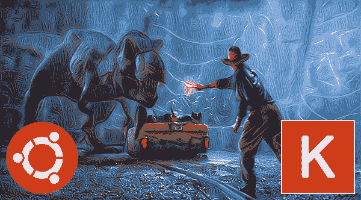
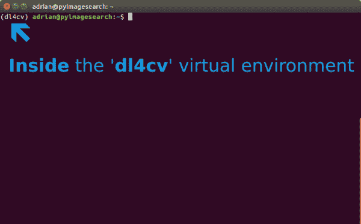
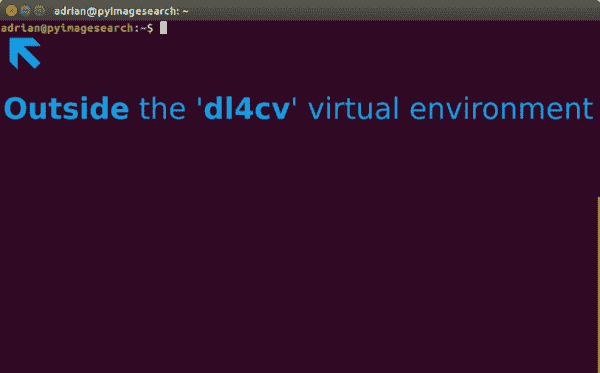
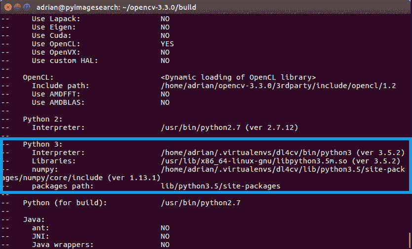

# 使用 Python 为深度学习配置 Ubuntu

> 原文：<https://pyimagesearch.com/2017/09/25/configuring-ubuntu-for-deep-learning-with-python/>



当涉及到学习深度学习等新技术时，配置您的开发环境往往是成功的一半。在你开始学习深度学习之前，不同的操作系统、硬件、依赖性和实际的库本身可能会导致许多令人头疼的问题。

深度学习库更新和发布的速度进一步加剧了这些问题——新功能推动了创新，但经常会打破以前的版本。您的环境可能会很快过时，因此必须成为安装和配置深度学习环境的专家。

既然用 Python 进行计算机视觉深度学习的 [*已经正式发布，我将在本周发布三篇帖子，在这些帖子中，我将演示如何建立自己的深度学习环境，以便你可以在投入阅读之前有一个良好的开端。*](https://pyimagesearch.com/deep-learning-computer-vision-python-book/)

我将演示如何为以下操作系统和外围设备配置您自己的本地开发环境:

*   用 Python 为深度学习配置 Ubuntu(即你目前正在阅读的帖子)
*   使用 Python 为深度学习设置 Ubuntu(有 GPU 支持)
*   使用 Python 为深度学习配置 macOS

当你开始走上深度学习和计算机视觉掌握的道路时，我会一直陪在你身边。

**要开始用 Python 配置你的 Ubuntu 机器进行深度学习，*继续阅读。***

## 使用 Python 为深度学习配置 Ubuntu

伴随[我的深度学习新书](https://pyimagesearch.com/deep-learning-computer-vision-python-book/)的是一个可下载的[预配置的 Ubuntu VirtualBox 虚拟机](https://pyimagesearch.com/2017/09/22/deep-learning-python-ubuntu-virtual-machine/)，预装了 Keras、TensorFlow、OpenCV 等计算机视觉/机器学习库。到目前为止，这是使用 Python 进行计算机视觉的*深度学习的最快方式。*

也就是说，通常希望在裸机上安装您的环境*，这样您就可以利用您的物理硬件。对于本系列的 GPU 安装教程部分，这是一个*要求*,你必须在金属上——虚拟机只是不会削减它，因为它无法访问你的物理 GPU。*

今天，我们的博客分为四个相对简单的步骤:

1.  步骤 1:安装 Ubuntu 系统依赖项
2.  步骤 2:创建您的 Python 3 虚拟环境
3.  步骤 3:编译并安装 OpenCV
4.  Step #4: Install Keras

记下这些步骤，你会看到用 Python 的计算机视觉深度学习支持 T2 Python 3。

Python 3 将成为 PyImageSearch 的标准，因为它很稳定，坦率地说是未来的标准。许多组织一开始对采用 Python 3 犹豫不决(包括我在内，因为在 OpenCV 3 之前没有 Python 3 对 OpenCV 的支持)，但是此时如果你不采用 Python 3，你将被远远甩在后面。预计 [PyImageSearch 大师的课程内容](https://pyimagesearch.com/pyimagesearch-gurus/)也将在不久的将来与 Python 3 兼容。

请注意，我们选择了 Keras 作为我们的深度学习库。Keras 因其易用性以及与 Tensorflow 和 Theano 的兼容性而“脱颖而出”。

我的深度学习书籍专注于基础知识和轻松进入该领域，而不是向你介绍一堆库——所以对于*初学者包*和*实践者包*，我用 Keras 演示了各种任务和练习(以及手动实现一些基本的神经网络概念)。 *ImageNet 包*也利用了 mxnet。

虽然我们将在我的书中主要使用 Keras，但是有许多 Python 的深度学习库，我鼓励你熟悉[我最喜欢的 9 个 Python 深度学习库](https://pyimagesearch.com/2016/06/27/my-top-9-favorite-python-deep-learning-libraries/)。

首先，你需要一些空闲时间来访问 Ubuntu 机器的终端——如果你的机器在云中或其他地方，SSH 是非常合适的。我们开始吧！

### 步骤 1:安装 Ubuntu 系统依赖项

这一步的目的是为您的系统准备 OpenCV 所必需的依赖项。

本教程中的所有步骤都将通过使用您的终端来完成。首先，打开你的命令行并更新`apt-get`包管理器来刷新和升级预安装的包/库:

```py
$ sudo apt-get update
$ sudo apt-get upgrade

```

我们还需要安装一些开发工具，以及图像和视频 I/O、优化和创建绘图/可视化所需的先决条件:

```py
$ sudo apt-get install build-essential cmake git unzip pkg-config
$ sudo apt-get install libjpeg-dev libtiff5-dev libjasper-dev libpng12-dev
$ sudo apt-get install libavcodec-dev libavformat-dev libswscale-dev libv4l-dev
$ sudo apt-get install libxvidcore-dev libx264-dev
$ sudo apt-get install libgtk-3-dev
$ sudo apt-get install libhdf5-serial-dev graphviz
$ sudo apt-get install libopenblas-dev libatlas-base-dev gfortran
$ sudo apt-get install python-tk python3-tk python-imaging-tk

```

我们将通过为 Python 2.7 和 Python 3.5 安装 Python 开发头文件和库来结束步骤#1(这样您就可以同时拥有这两个版本)。

```py
$ sudo apt-get install python2.7-dev python3-dev

```

***注意:*** *如果你没有安装 Python 开发头文件和静态库，你会在**步骤#3** 中遇到问题，在那里我们运行`cmake`来配置我们的构建。如果没有安装这些头文件，那么`cmake`命令将无法自动确定 Python 解释器和 Python 库的正确值。简而言之，这一部分的输出看起来是“空的”,您将无法构建 Python 绑定。当您到达**步骤#3** 时，花时间将您的命令输出与我的进行比较。*

让我们继续创建一个虚拟环境来存放 OpenCV 和 Keras。

### 步骤 2:创建您的 Python 虚拟环境

在本节中，我们将在您的系统上设置一个 Python 虚拟环境。

#### 安装 pip

我们现在准备开始为构建配置我们的 Python 开发环境。第一步是安装`pip`，一个 Python 包管理器:

```py
$ wget https://bootstrap.pypa.io/get-pip.py
$ sudo python get-pip.py
$ sudo python3 get-pip.py

```

#### 安装 virtualenv 和 virtualenvwrapper

我在我做过的每一个安装教程中都提到过这一点，但是今天我要在这里再说一遍:我是和的超级粉丝。**这些 Python 包允许你为你正在进行的*每个*项目创建*独立的* Python 环境。**

简而言之，使用这些包可以让你解决*“项目 X 依赖于 1.x 版本，但项目 Y 需要 4.x* 的困境。使用 Python 虚拟环境的一个奇妙的副作用是，您可以让您的系统保持整洁，没有混乱。

虽然你当然可以在没有 Python 虚拟环境的情况下使用 Python 绑定来安装 OpenCV， ***我强烈推荐你使用它们*** ，因为其他 PyImageSearch 教程利用了 Python 虚拟环境。在本指南的剩余部分，我还假设您已经安装了`virtualenv`和`virtualenvwrapper`。

如果你想要一个完整、详细的解释，为什么 Python 虚拟环境是一个最佳实践，你绝对应该[读一读这篇在 RealPython 上的精彩博文。在本教程的前半部分](https://realpython.com/blog/python/python-virtual-environments-a-primer/)，我也提供了一些关于为什么我个人更喜欢 Python 虚拟环境[的评论。](https://pyimagesearch.com/2016/05/02/accessing-rpi-gpio-and-gpio-zero-with-opencv-python/)

让我再次重申，在 Python 社区中，利用某种虚拟环境是**的标准做法，所以我建议你也这样做:**

```py
$ sudo pip install virtualenv virtualenvwrapper
$ sudo rm -rf ~/.cache/pip get-pip.py

```

一旦我们安装了`virtualenv`和`virtualenvwrapper`，我们需要更新我们的`~/.bashrc`文件，在文件的*底部*包含以下行:

```py
# virtualenv and virtualenvwrapper
export WORKON_HOME=$HOME/.virtualenvs
export VIRTUALENVWRAPPER_PYTHON=/usr/bin/python3
source /usr/local/bin/virtualenvwrapper.sh

```

`~/.bashrc`文件只是一个 shell 脚本，每当您启动一个新的终端时，Bash 都会运行它。您通常使用该文件来设置各种配置。在本例中，我们设置了一个名为`WORKON_HOME`的环境变量，指向 Python 虚拟环境所在的目录。然后我们从`virtualenvwrapper`加载任何必要的配置。

要更新您的`~/.bashrc`文件，只需使用标准的文本编辑器。我会推荐使用`nano`、`vim`或`emacs`。你也可以使用图形编辑器，但是如果你刚刚开始使用，`nano`可能是最容易操作的。

一个更简单的解决方案是使用`cat`命令，完全避免编辑器:

```py
$ echo -e "\n# virtualenv and virtualenvwrapper" >> ~/.bashrc
$ echo "export WORKON_HOME=$HOME/.virtualenvs" >> ~/.bashrc
$ echo "export VIRTUALENVWRAPPER_PYTHON=/usr/bin/python3" >> ~/.bashrc
$ echo "source /usr/local/bin/virtualenvwrapper.sh" >> ~/.bashrc

```

编辑完我们的`~/.bashrc`文件后，我们需要重新加载修改:

```py
$ source ~/.bashrc

```

***注意:*** *在`~/.bashrc`上调用`source`对于我们当前的 shell 会话来说，只需要**一次**。每当我们打开一个新的终端，`~/.bashrc`的内容就会自动**执行**(包括我们的更新)。*

#### 为深度学习和计算机视觉创建虚拟环境

现在我们已经安装了`virtualenv`和`virtualenvwrapper`，下一步是实际上*创建*Python 虚拟环境——我们使用`mkvirtualenv`命令来完成。

在过去的安装教程中，我介绍了 Python 2.7 或 Python 3 的选择。在 Python 3 开发周期的这一点上，我认为它是稳定和正确的选择。如果你有特定的兼容性需求，你可以选择使用 Python 2.7，**但是为了我的新深度学习书的目的，我们将使用 Python 3** 。

也就是说，对于下面的命令，确保您的 Python ( `-p`)标志设置为`python3`:

```py
$ mkvirtualenv dl4cv -p python3

```

无论你决定使用哪个 Python 版本，最终结果都是我们创建了一个名为`dl4cv`(计算机视觉深度学习的简称)的 Python 虚拟环境。

您可以随意命名这个虚拟环境(并创建任意数量的 Python 虚拟环境)，但目前，我建议坚持使用`dl4cv`名称，因为这是我将在本教程剩余部分以及本系列剩余安装指南中使用的名称。

#### 验证您是否处于“dl4cv”虚拟环境中

如果你重启了你的 Ubuntu 系统；注销并重新登录；或者打开一个新的终端，您需要使用`workon`命令来重新访问您的`dl4cv`虚拟环境。下面是一个`workon`命令的例子:

```py
$ workon dl4cv

```

要验证您是否在`dl4cv`虚拟环境中，只需检查您的命令行— *如果您在提示前看到文本`(dl4cv)`，那么您**在`dl4cv`虚拟环境中是****:*

[](https://pyimagesearch.com/wp-content/uploads/2017/09/in_dl4cv.png_edited.png)

**Figure 1:** Inside the *dl4cv* virtual environment denoted by *‘(dl4cv)’* in the prompt.

否则如果你 ***没有*** 看到`dl4cv`文本，那么你 ***在`dl4cv`虚拟环境中就不是*** :

[](https://pyimagesearch.com/wp-content/uploads/2017/09/not_in_dl4cv-1.png_edited-1.png)

**Figure 2:** Outside of the *dl4cv* virtual environment. Simply execute the *‘workon dl4cv’* command to get into the environment.

#### 安装 NumPy

在我们编译 OpenCV 之前的最后一步是安装 [NumPy](http://www.numpy.org/) ，一个用于数值处理的 Python 包。要安装 NumPy，请确保您处于`dl4cv`虚拟环境中(否则 NumPy 将被安装到 Python 的*系统*版本中，而不是`dl4cv`环境中)。

从那里执行以下命令:

```py
$ pip install numpy

```

### 步骤 3:编译并安装 OpenCV

在这一节中，我们将安装和编译 OpenCV。我们将从下载和解压缩 OpenCV 3.3 开始。然后我们将从源代码构建和编译 OpenCV。最后，我们将测试 OpenCV 是否已经安装。

#### 下载 OpenCV

首先让我们将 [opencv](https://github.com/Itseez/opencv) 和 [opencv_contrib](https://github.com/itseez/opencv_contrib) 下载到您的主目录中:

```py
$ cd ~
$ wget -O opencv.zip https://github.com/Itseez/opencv/archive/3.3.0.zip
$ wget -O opencv_contrib.zip https://github.com/Itseez/opencv_contrib/archive/3.3.0.zip

```

您可能需要扩展上面的命令来复制并通过*完整路径*到`opencv_contrib`文件。

然后，让我们解压缩这两个文件:

```py
$ unzip opencv.zip
$ unzip opencv_contrib.zip

```

#### 运行 CMake

让我们创建一个`build`目录并运行 CMake:

```py
$ cd ~/opencv-3.3.0/
$ mkdir build
$ cd build
$ cmake -D CMAKE_BUILD_TYPE=RELEASE \
    -D CMAKE_INSTALL_PREFIX=/usr/local \
    -D WITH_CUDA=OFF \
    -D INSTALL_PYTHON_EXAMPLES=ON \
    -D OPENCV_EXTRA_MODULES_PATH=~/opencv_contrib-3.3.0/modules \
    -D BUILD_EXAMPLES=ON ..

```

对于 CMake，为了兼容性，您的标志与我的标志匹配是很重要的。此外，确保您的`opencv_contrib`版本与您下载的 OpenCV 版本完全相同(在本例中是版本`3.3.0`)。

在我们进入实际的编译步骤之前，请确保您检查了 CMake 的输出！

首先滚动到标题为`Python 3`的部分。

确保您的 Python 3 部分如下图所示:

[](https://pyimagesearch.com/wp-content/uploads/2017/09/python3_cmake_edited.png)

**Figure 3:** Checking that Python 3 will be used when compiling OpenCV 3 for Ubuntu.

注意解释器指向我们位于虚拟环境中的二进制文件，而 T2 指向我们的 NumPy 安装。

在任何一种情况下，如果您 ***没有*** 看到这些变量路径中的`dl4cv`虚拟环境，那么 ***几乎肯定是因为您在运行 CMake 之前不在`dl4cv`虚拟环境中！***

如果是这种情况，使用`workon dl4cv`访问`dl4cv`虚拟环境，并重新运行上面概述的命令(我还建议删除`build`目录并重新创建它)。

#### 编译 OpenCV

现在，我们已经准备好用 4 个内核编译 OpenCV:

```py
$ make -j4

```

***注意:*** *你可以尝试一个版本的`-j4`标志对应你的 CPU 的核心数来实现编译时加速。在这种情况下，我使用了`-j4`,因为我的机器有四个内核。如果遇到编译错误，您可以运行命令`make clean`，然后在没有并行标志`make`的情况下编译。*

从那里，你需要做的就是安装 OpenCV 3.3，然后如果你愿意的话，释放一些磁盘空间:

```py
$ sudo make install
$ sudo ldconfig
$ cd ~
$ rm -rf opencv-3.3.0 opencv.zip
$ rm -rf opencv_contrib-3.3.0 opencv_contrib.zip

```

编译完成后，您应该会看到类似如下的输出:

[](https://pyimagesearch.com/wp-content/uploads/2017/09/dl4cv_compiled.png)

**Figure 4:** OpenCV compilation is complete.

#### 将 OpenCV 符号链接到您的虚拟环境

要将 OpenCV 绑定符号链接到`dl4cv`虚拟环境中，发出以下命令:

```py
$ cd ~/.virtualenvs/dl4cv/lib/python3.5/site-packages/
$ ln -s /usr/local/lib/python3.5/site-packages/cv2.cpython-35m-x86_64-linux-gnu.so cv2.so
$ cd ~

```

注意，在这个例子中，我使用的是 *Python 3.5* 。如果您使用的是 *Python 3.6* (或更新版本)，您将需要更新路径以使用您的 Python 版本。

其次，您的`.so`文件(也就是实际的 OpenCV 绑定)可能是上面显示的一些变体，所以一定要通过仔细检查路径来使用合适的文件。

#### 测试您的 OpenCV 3.3 安装

现在我们已经安装并链接了 OpenCV 3.3，让我们做一个快速的健全性测试来看看事情是否正常:

```py
$ python
>>> import cv2
>>> cv2.__version__
'3.3.0'

```

在启动 Python ( `workon dl4cv`)之前，确保您处于`dl4cv`虚拟环境中。当您打印出版本时，它应该与您安装的 OpenCV 版本相匹配(在我们的例子中，OpenCV `3.3.0`)。

就这样——假设您没有遇到导入错误，您就可以继续进行**步骤#4** 了，我们将在这里安装 Keras。

### Step #4: Install Keras

对于这一步，通过发出`workon dl4cv`命令，确保您处于`dl4cv`环境中。然后安装我们的各种 Python 计算机视觉、图像处理和机器学习库:

```py
$ pip install scipy matplotlib pillow
$ pip install imutils h5py requests progressbar2
$ pip install scikit-learn scikit-image

```

Next, install Tensorflow:

```py
$ pip install tensorflow

```

注意我们是如何使用 TensorFlow 的 ***CPU 版本*** 的。我将在单独的教程中介绍 ***GPU 版本*** 。

安装 Keras 非常简单，这要归功于`pip`:

```py
$ pip install keras

```

同样，在`dl4cv`虚拟环境中执行此操作。

您可以从 Python shell 测试我们的 Keras 安装:

```py
$ python
>>> import keras
Using TensorFlow backend.
>>>

```

您应该看到 Keras 已经被正确导入 ***和***tensor flow 后端正在被使用。

在您结束安装教程之前，花点时间熟悉一下`~/.keras/keras.json`文件:

```py
{
    "image_data_format": "channels_last",
    "backend": "tensorflow",
    "epsilon": 1e-07,
    "floatx": "float32"
}

```

确保`image_data_format`设置为`channels_last`并且`backend`为`tensorflow`。

**恭喜你！**你现在已经准备好用 Python 开始你的 [*计算机视觉深度学习*](https://pyimagesearch.com/deep-learning-computer-vision-python-book/) 之旅了。

## 摘要

在今天的博客文章中，我演示了如何在 Ubuntu 机器上仅使用 CPU 来设置深度学习环境。在学习新技术、算法和库时，配置开发环境是成功的一半。

如果你有兴趣更详细地研究深度学习，一定要看看我的新书， *[用 Python 进行计算机视觉的深度学习](https://pyimagesearch.com/deep-learning-computer-vision-python-book/)* 。

本系列接下来的几篇博客文章将涵盖包括 macOS 和 Ubuntu(有 GPU 支持)在内的替代环境。

当然，如果你对*预配置的*深度学习开发环境感兴趣，看看我的 [Ubuntu 虚拟机](https://pyimagesearch.com/2017/09/22/deep-learning-python-ubuntu-virtual-machine/)和[亚马逊 EC2 实例](https://pyimagesearch.com/2017/09/20/pre-configured-amazon-aws-deep-learning-ami-with-python/)。

如果您有兴趣了解更多关于计算机视觉和深度学习的知识， ***请务必在下面的表格中输入您的电子邮件地址，以便在新的博客帖子+教程发布时收到通知！*****