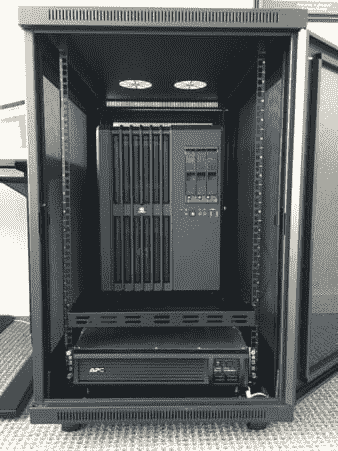
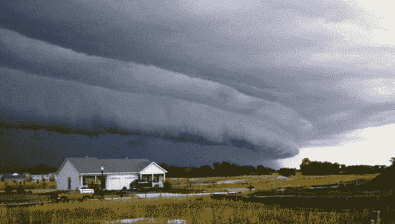
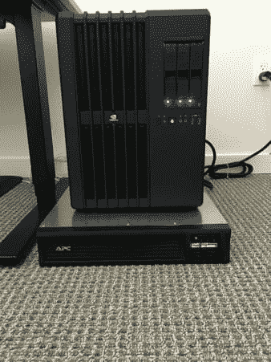
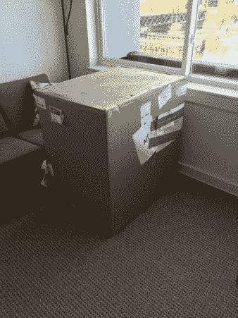
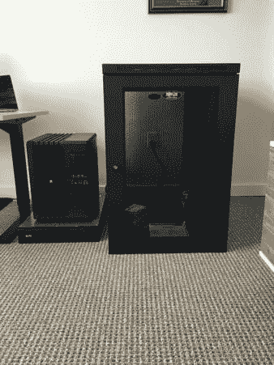
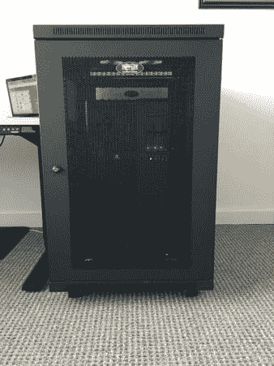
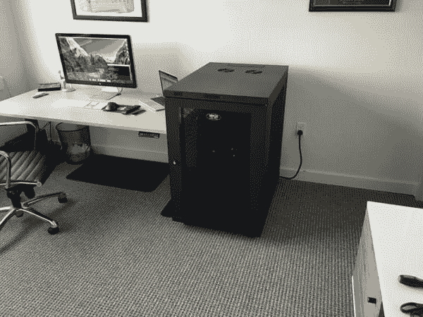

# 设置深度学习硬件时的注意事项

> 原文：<https://pyimagesearch.com/2016/06/13/considerations-when-setting-up-deep-learning-hardware/>

在上周的博客文章中，我讨论了我对用于深度学习的 NVIDIA DIGITS DevBox 的投资。

这是一笔不小的投资，高达惊人的 15，000 美元*——比我想象中花在办公室电脑上的钱还要多(我通常喜欢云中的硬件，在那里我不需要与它进行物理交互)。*

 *也就是说，这项投资将在未来几个月推动 PyImageSearch 博客的发展。我已经做出了*承诺*做更多*更多深度学习教程*——特别是涉及*卷积神经网络*和*图像分类*的教程。

事实上，在阵亡将士纪念日的周末，我花了两个小时在 Trello 头脑风暴，计划下一年在 PyImageSearch 博客上的教程。

**大部分涉及深度学习。**

所以，说了这么多，让我们来看看如果你决定购买自己的 DevBox 或构建自己的深度学习系统，你应该记住的一些考虑因素。

## 设置深度学习硬件时的注意事项

NVIDIA DevBox 不是像笔记本电脑或台式机那样的“普通”硬件。虽然你可以简单地把它插在墙上启动，但你真的不应该这样做,*。*

在你第一次启动你的系统之前，你需要考虑你将如何处理电涌，电池备份，以及盒子将在你的家里或办公室的什么地方“活动”(这对于保持系统冷却是至关重要的)。

当我在 NVIDIA DIGITS DevBox 的背景下写这篇博文时，*如果你决定从头开始构建自己的深度学习系统，这些建议也将适用于你*。

### 买一个 UPS——但不是随便什么 UPS

首先你需要弄一个[不间断电源](https://en.wikipedia.org/wiki/Uninterruptible_power_supply) (UPS)。顾名思义，当您的主电源出现故障时，UPS 会为您的系统提供应急电源—您可以将 UPS 想象成一个大型(非常)重型电池组，以便在断电时保持系统运行。一旦备用电池电量严重不足，UPS 甚至可以启动关机程序。

但是，在你跑到当地的电器商店或跳上 Amazon.com 之前，你需要问自己一个关键问题— ***我的系统将消耗多少功率？***

#### 微波测试

在最大负载下，NVIDIA DevBox [功耗可以达到 1350W](http://docs.nvidia.com/deeplearning/digits-devbox-user-guide/index.html#power) (这是由于系统中的 4 个 Titan X GPUs)。

在美国，1350W 相当于更高端的微波，所以你应该进行我喜欢称之为*“微波测试”。*

检查你的微波炉的瓦数，如果它与你想要建立的深度学习系统的瓦数相近，就把微波炉拖到你计划连接深度学习系统的房间，打开它，让它运行几分钟。

如果几分钟后你没有让电路过载，那么你可能状态很好。

我强调术语*可能是*，因为这不是一个完美的测试。运行一个瓦数相似的微波炉几分钟(T2)和运行一个系统几天(T4)甚至几周(T7)高负荷是不一样的。当运行你的深度学习系统时，你将在更长的时间内消耗更多的能量。

因此，做进一步的研究并确保你的家/办公室为这种持续的电力消耗正确布线是至关重要的。在某些情况下，您可能需要咨询电工。

#### 突袭致死

你知道当你有一个 RAID 阵列(独立磁盘冗余阵列)运行时，突然断电，你的系统立即关闭会发生什么吗？

**坏事。坏事会发生。**

您的数据可能会处于不一致的“脏”状态，您的系统可能需要创建整个数组(如果可能的话)。正如这篇 *[为什么停电对你的数据不利](http://www.halfgaar.net/why-power-failures-are-bad-for-your-data)* 的文章建议，RAID 0 可以(潜在地)被*在一次停电中完成销毁*。

幸运的是，大多数现代 Unix 内核和 RAID 工具都有内置的预防措施，有助于防止电源故障期间的灾难性损失。

但是为什么要冒这个险呢？

购买一台 UPS，它可以在断电和电池电量极低的情况下启动安全、干净的关机。

***注:**我为什么要说突袭？因为 NVIDIA DIGITS DevBox 配有 3 个 3TB RAID5 磁盘，带有独立的 SSD 缓存。我最不希望发生的事情就是(1)重建阵列，或者(2)由于断电而丢失数据。*

#### 陆地飓风

**图 1:** 一个 derecho，也被称为“陆地飓风”，在 2012 年几乎摧毁了我拥有的每一台电脑和硬盘[ [来源](http://www.spc.noaa.gov/misc/AbtDerechos/derechofacts.htm)。

每一个听说过 ***这个名词的人？***

它被定义为*“一场广泛、长期、直线的风暴，与一群陆基、快速移动的雷暴相关联”* [ [维基百科](https://en.wikipedia.org/wiki/Derecho)。

飓风是极具破坏性的雷暴，能够产生飓风、龙卷风、暴雨和山洪暴发。有些人甚至把飓风称为**。这些类型的风暴主要发生在北美，但在世界其他地方发生的频率要低得多。**

 **理解这些风暴迅速发展是很重要的。在某些情况下，当暴风雨来临的时候，你甚至可能听不到雷声——它正在快速移动*。请记住，*风暴本身*正以每小时 60 英里或更高的速度移动——大多数雷暴甚至没有达到每小时 60 英里的*阵风*。*

我在 UMBC 大学读研究生的第一年，我的家乡马里兰州在 2012 年 6 月 29 日星期五遭到了历史性的袭击。这场风暴是北美历史上最具破坏性的*、*致命*和*快速移动*风暴之一。*

 *我独自一人呆在公寓里。说实话，这是我一生中最可怕的经历之一。

几分钟内，极高的风速(> 60 英里/小时，阵风接近 100 英里/小时)刮倒了电线和大树。

道路被淹。

残酷的地面闪电划过黑暗不祥的天空，紧接着几乎是瞬间的震耳欲聋的雷声，无情地从晚上 10 点持续到第二天凌晨 4 点。

28 人在风暴中死亡，因为大树倒在他们的房屋上，把他们压在下面。

当风暴结束时，我的家乡马里兰州卡顿斯维尔的大部分地区已经停电超过 6 天了。马里兰州的部分地区连续几周没有电力供应，这在现代美国是前所未闻的。

我为什么要告诉你这些？

在暴风雨中，我公寓外面的一条电线被闪电击中。电涌穿过电线，到达公寓，进入我的 UPS。

**那天晚上我的 APC UPS 没电了……**

***……但是我的电子产品没有。***

我的笔记本电脑和硬盘是安全的。

从那天晚上开始，我总是*总是* [买了 APC](http://www.apc.com/us/en/)——我他妈的确定任何类型的敏感设备或重要数据都在 UPS 后面。

当然，如果电涌足够强，没有电涌保护器可以救你。但是你最好尽你最大的努力来确保你不会在雷雨期间(或者任何其他反常的自然行为)丢失你的设备(或者更重要的是，数据)。

在这种情况下，我只是失去了我的 UPS——我可能会失去更多。

#### 但不是任何 UPS 都可以

因此，正如我上面提到的，您应该使用具有以下功能的 UPS:

1.  电池备用
2.  过电压保护

这一切都很好，但你也需要考虑你画的瓦特数。

大多数消费级 UPS 的最大功率为 900 瓦(T1)，事实上，我有[这款完全一样的 UPS(T3 ),我将其用于笔记本电脑和外部硬盘，最大功率为 865 瓦。](http://amzn.to/1O6xVna)

考虑到我需要在最大负载下消耗高达 1350W 的功率，我显然需要一个工业级的服务器级 UPS。

在做了大量的研究后，我发现了一些能够轻松应对更高瓦数和更大电流的 UPS。我最终选择了 [APC SMT2200RM2U UPS](http://amzn.to/1UiY6Dr) ，它的价格实际上是我正在考虑的其他 UPS 的两倍，但正如我所说的，我对 APC 有一种信任和亲和力，所以我决定花更多的钱。

这款机架式 UPS 可以处理 1980W 和 2200VA，对于我的 NVIDIA DevBox 来说绰绰有余。

### 绞尽脑汁

在我收到我的 UPS 后，我进行了一个快速测试，以确保 NVIDIA DevBox 可以与它一起工作。果不其然，确实如此(虽然这张图片贴出来几乎让人尴尬):

**Figure 2:** Testing my NVIDIA DevBox with UPS backup.

当我和其他几位企业家同事在 Slack 频道上发布这张照片时，我在 SysDoc.io 的朋友尼克·库克(Nick Cook)差点砸了一块砖。

Nick 很快指出了将 UPS 直接放在地毯上，然后将 DevBox 放在 UPS 上的问题。他说的完全正确——我需要把它们都架起来，以帮助冷却并保证设备的安全。

所以，我再次去做了我的研究，并最终购买了 [Tripp Lite 18U SmartRack](http://www.newegg.com/Product/Product.aspx?Item=N82E16816228139) 。我本来可以选择较小的机架，但我决定:

1.  如果我愿意，允许我自己在未来扩展并包含新的系统。
2.  给 NVIDIA DevBox 多一点冷却的“喘息空间”。

***注:**NVIDIA DIGITS DevBox 是*而不是*制造的可机架安装的。而是买了[一个重型架子](http://amzn.to/1RQhohL)，把架子架起来，然后把 DevBox 放在架子上面。*

机架本身装在一个相当大的纸板容器中交付:

**Figure 3:** My rack, still in the box.

与我的 UPS 和 DevBox 相比，该机架可以轻松包含这两者，从而留出了增长空间:

**Figure 4:** The rack itself is more than large enough to house both the UPS and DevBox.

然后，我花了一下午的时间安装 UPS 和 DevBox:

**Figure 5:** Fitting the UPS and DevBox into the rack.

在这个空间里看起来很不错:

**Figure 6:** The rack, all locked up.

在冬季，DevBox 还可以作为一个不错的加热器:

**Figure 7:** My office, now that the NVIDIA DIGTS DevBox, UPS, and rack have been fully installed.

## 摘要

在这篇博客文章中，我详细介绍了在设置深度学习硬件时应该记住的注意事项和建议。无论您是使用 NVIDIA DIGITS DevBox，还是构建自定义解决方案，请确保您:

1.  确定你的房子、公寓或办公室是否正确布线，以获得所需的安培数/瓦特数。
2.  投资 UPS 来保护您的投资，*尤其是*如果您使用 RAID 配置的驱动器。
3.  如果有必要，把它们都架起来。

既然深度学习环境已经准备就绪，我将在下周详细介绍如何安装用于深度学习的 CUDA 工具包和 cuDNN，以便您可以利用 GPU 进行快速训练。

***注意:****NVIDIA dev box 已经安装了 CUDA 和 cuDNN，所以我将从头开始设置一个亚马逊 EC2 实例。你将能够使用这些说明来建立你自己的深度学习机器，以便你可以跟随未来的教程。*

请务必使用下面的表格注册 PyImageSearch 时事通讯，以便在将来发布博文时得到通知！****