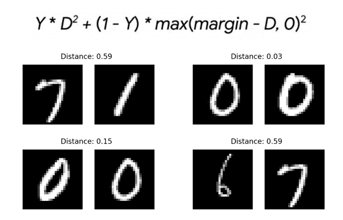
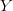
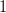
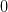
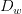

# 具有 Keras 和 TensorFlow 的暹罗网络的对比损耗

> 原文：<https://pyimagesearch.com/2021/01/18/contrastive-loss-for-siamese-networks-with-keras-and-tensorflow/>

在本教程中，您将了解对比损失，以及如何使用它来训练更准确的暹罗神经网络。我们将使用 Keras 和 TensorFlow 实现对比损失。



之前，我撰写了一个关于连体神经网络基础的三部分系列:

1.  *[用 Python 为连体网络构建图像对](https://pyimagesearch.com/2020/11/23/building-image-pairs-for-siamese-networks-with-python/)*
2.  *[与 Keras、TensorFlow、深度学习的连体网络](https://pyimagesearch.com/2020/11/30/siamese-networks-with-keras-tensorflow-and-deep-learning/)*
3.  *[使用暹罗网络、Keras 和 TenorFlow](https://pyimagesearch.com/2020/12/07/comparing-images-for-similarity-using-siamese-networks-keras-and-tensorflow/)* 比较图像的相似性

本系列涵盖了 siamese 网络的基础知识，包括:

*   生成图像对
*   实现暹罗神经网络架构
*   使用二进制交叉条目训练暹罗网络

尽管二元交叉熵肯定是损失函数的一个有效选择，但它不是唯一的 T2 选择(甚至不是 T4 最佳选择)。

**最先进的暹罗网络在训练时倾向于使用某种形式的对比损失或三重损失** —这些损失函数更适合暹罗网络，并有助于提高精度。

本指南结束时，你将了解如何实现暹罗网络，然后用对比损失来训练它们。

**要学习如何训练一个有对比损失的连体神经网络，*只要继续阅读。***

## **具有 Keras 和 TensorFlow 的暹罗网络的对比损耗**

在本教程的第一部分，我们将讨论什么是对比损失，更重要的是，如何使用它来更准确和有效地训练暹罗神经网络。

然后，我们将配置我们的开发环境，并检查我们的项目目录结构。

我们今天要实现许多 Python 脚本，包括:

*   配置文件
*   用于生成图像对、绘制培训历史和实施自定义图层的辅助工具
*   我们的对比损失实现
*   训练脚本
*   测试/推理脚本

我们将逐一回顾这些脚本；然而，其中一些已经在我之前的关于暹罗神经网络的指南中涉及到了[，所以在适当的时候，我会让你参考我的其他教程以获得更多的细节。](https://pyimagesearch.com/2020/11/23/building-image-pairs-for-siamese-networks-with-python/)

我们还将花大量时间讨论我们的对比损失实现，确保您理解它在做什么，它如何工作，以及我们为什么要利用它。

在本教程结束时，您将拥有一个全功能的对比损失实现，能够训练一个连体神经网络。

### **什么是对比损失？对比损失如何用于训练连体网络？**

[在我们之前关于连体神经网络的系列教程](https://pyimagesearch.com/2020/11/23/building-image-pairs-for-siamese-networks-with-python/)中，我们学习了如何使用二进制交叉熵损失函数来训练连体网络:

二元交叉熵在这里是一个有效的选择，因为我们本质上做的是两类分类:

1.  呈现给网络的两个图像属于同一类别
2.  或者两幅图像属于*不同的类别*

以这种方式，我们有一个分类问题。因为我们只有两个类，二进制交叉熵是有意义的。

然而，实际上有一个损失函数*更适合用于暹罗网络的*称为*对比损失:*

解释一下 [Harshvardhan Gupta](https://hackernoon.com/one-shot-learning-with-siamese-networks-in-pytorch-8ddaab10340e) ，我们需要记住，暹罗网络的目标不是*将*一组图像对分类，而是*将它们区分开来。*本质上，对比损失是评估暹罗网络区分图像对的工作有多好。这种差别很微妙，但却非常重要。

要打破这个等式:

*   值是我们的标签。如果图像对属于同一类，则为，如果图像对属于不同类，则为。
*   变量是姐妹网络嵌入的输出之间的欧几里德距离。
*   *max* 函数取和边距、的最大值，减去距离。

在本教程的后面，我们将使用 Keras 和 TensorFlow 实现这个损失函数。

如果你想了解更多关于对比损失的数学动机的细节，一定要参考 Hadsell 等人的论文， *[通过学习不变映射来降维。](http://yann.lecun.com/exdb/publis/pdf/hadsell-chopra-lecun-06.pdf)*

### **配置您的开发环境**

这一系列关于暹罗网络的教程利用了 Keras 和 TensorFlow。如果您打算继续学习本系列前两部分的教程，我建议您现在花时间配置您的深度学习开发环境。

您可以利用这两个指南中的任何一个在您的系统上安装 TensorFlow 和 Keras:

*   *[如何在 Ubuntu 上安装 tensor flow 2.0](https://pyimagesearch.com/2019/12/09/how-to-install-tensorflow-2-0-on-ubuntu/)*
*   *[如何在 macOS 上安装 tensor flow 2.0](https://pyimagesearch.com/2019/12/09/how-to-install-tensorflow-2-0-on-macos/)*

这两个教程都将帮助您在一个方便的 Python 虚拟环境中，用这篇博文所需的所有软件来配置您的系统。

### **在配置开发环境时遇到了问题？**

说了这么多，你是:

*   时间紧迫？
*   了解你雇主的行政锁定系统？
*   想要跳过与命令行、包管理器和虚拟环境斗争的麻烦吗？
*   **准备好在你的 Windows、macOS 或 Linux 系统上运行代码*了吗？***

那今天就加入 [PyImageSearch 加](https://pyimagesearch.com/pyimagesearch-plus/)吧！

**获得本教程的 Jupyter 笔记本和其他 PyImageSearch 指南，这些指南已经过*预配置*，可以在您的网络浏览器中运行在 Google Colab 的生态系统上！**无需安装。

最棒的是，这些 Jupyter 笔记本可以在 Windows、macOS 和 Linux 上运行！

### **项目结构**

今天关于连体网络对比损失的教程建立在我之前的三个教程的基础上，这三个教程涵盖了构建图像对、实现和训练连体网络以及使用连体网络进行推理的基础知识:

1.  *[用 Python 为连体网络构建图像对](https://pyimagesearch.com/2020/11/23/building-image-pairs-for-siamese-networks-with-python/)*
2.  *[与 Keras、TensorFlow、深度学习的连体网络](https://pyimagesearch.com/2020/11/30/siamese-networks-with-keras-tensorflow-and-deep-learning/)*
3.  *[使用暹罗网络、Keras 和 TensorFlow](https://pyimagesearch.com/2020/12/07/comparing-images-for-similarity-using-siamese-networks-keras-and-tensorflow/)* 比较图像的相似性

今天，我们将从这些指南(包括项目目录结构本身)中获取知识，因此，在今天继续之前，请考虑之前的指南*必读材料*。

一旦您跟上了进度，我们就可以继续审查我们的项目目录结构:

```py
$ tree . --dirsfirst
.
├── examples
│   ├── image_01.png
│   ├── image_02.png
│   ├── image_03.png
...
│   └── image_13.png
├── output
│   ├── contrastive_siamese_model
│   │   ├── assets
│   │   ├── variables
│   │   │   ├── variables.data-00000-of-00001
│   │   │   └── variables.index
│   │   └── saved_model.pb
│   └── contrastive_plot.png
├── pyimagesearch
│   ├── config.py
│   ├── metrics.py
│   ├── siamese_network.py
│   └── utils.py
├── test_contrastive_siamese_network.py
└── train_contrastive_siamese_network.py

6 directories, 23 files
```

我再一次强调回顾我之前关于暹罗网络系列教程的重要性。在今天继续之前，这样做是*的一个绝对要求*。

### **实现我们的配置文件**

我们的配置文件保存了用于训练我们的暹罗网络的重要变量。

打开项目目录结构中的``config.py`` 文件，让我们看看里面的内容:

```py
# import the necessary packages
import os

# specify the shape of the inputs for our network
IMG_SHAPE = (28, 28, 1)

# specify the batch size and number of epochs
BATCH_SIZE = 64
EPOCHS = 100

# define the path to the base output directory
BASE_OUTPUT = "output"

# use the base output path to derive the path to the serialized
# model along with training history plot
MODEL_PATH = os.path.sep.join([BASE_OUTPUT,
	"contrastive_siamese_model"])
PLOT_PATH = os.path.sep.join([BASE_OUTPUT,
	"contrastive_plot.png"])
```

**第 16-19 行**定义了序列化模型和训练历史的输出文件路径。

关于配置文件的更多细节，请参考我的教程 *[带有 Keras、TensorFlow 和深度学习的暹罗网络。](https://pyimagesearch.com/2020/11/30/siamese-networks-with-keras-tensorflow-and-deep-learning/)*

### **创建我们的助手实用函数**

```py
# import the necessary packages
import tensorflow.keras.backend as K
import matplotlib.pyplot as plt
import numpy as np
```

然后我们有了我们的`make_pairs`函数，我在我的 [*用 Python 为暹罗网络构建图像对*教程](https://pyimagesearch.com/2020/11/23/building-image-pairs-for-siamese-networks-with-python/)中详细讨论了这个函数(确保你在继续之前阅读了该指南):

```py
def make_pairs(images, labels):
	# initialize two empty lists to hold the (image, image) pairs and
	# labels to indicate if a pair is positive or negative
	pairImages = []
	pairLabels = []

	# calculate the total number of classes present in the dataset
	# and then build a list of indexes for each class label that
	# provides the indexes for all examples with a given label
	numClasses = len(np.unique(labels))
	idx = [np.where(labels == i)[0] for i in range(0, numClasses)]

	# loop over all images
	for idxA in range(len(images)):
		# grab the current image and label belonging to the current
		# iteration
		currentImage = images[idxA]
		label = labels[idxA]

		# randomly pick an image that belongs to the *same* class
		# label
		idxB = np.random.choice(idx[label])
		posImage = images[idxB]

		# prepare a positive pair and update the images and labels
		# lists, respectively
		pairImages.append([currentImage, posImage])
		pairLabels.append([1])

		# grab the indices for each of the class labels *not* equal to
		# the current label and randomly pick an image corresponding
		# to a label *not* equal to the current label
		negIdx = np.where(labels != label)[0]
		negImage = images[np.random.choice(negIdx)]

		# prepare a negative pair of images and update our lists
		pairImages.append([currentImage, negImage])
		pairLabels.append([0])

	# return a 2-tuple of our image pairs and labels
	return (np.array(pairImages), np.array(pairLabels))
```

```py
def euclidean_distance(vectors):
	# unpack the vectors into separate lists
	(featsA, featsB) = vectors

	# compute the sum of squared distances between the vectors
	sumSquared = K.sum(K.square(featsA - featsB), axis=1,
		keepdims=True)

	# return the euclidean distance between the vectors
	return K.sqrt(K.maximum(sumSquared, K.epsilon()))
```

最后，我们有一个助手实用程序`plot_training`，它接受一个`plotPath`，绘制我们在训练过程中的训练和验证对比损失，然后将该图保存到磁盘:

```py
def plot_training(H, plotPath):
	# construct a plot that plots and saves the training history
	plt.style.use("ggplot")
	plt.figure()
	plt.plot(H.history["loss"], label="train_loss")
	plt.plot(H.history["val_loss"], label="val_loss")
	plt.title("Training Loss")
	plt.xlabel("Epoch #")
	plt.ylabel("Loss")
	plt.legend(loc="lower left")
	plt.savefig(plotPath)
```

让我们继续实现暹罗网络架构本身。

### **实施我们的暹罗网络架构**

我们的连体神经网络架构本质上是一个基本的 CNN:

```py
# import the necessary packages
from tensorflow.keras.models import Model
from tensorflow.keras.layers import Input
from tensorflow.keras.layers import Conv2D
from tensorflow.keras.layers import Dense
from tensorflow.keras.layers import Dropout
from tensorflow.keras.layers import GlobalAveragePooling2D
from tensorflow.keras.layers import MaxPooling2D

def build_siamese_model(inputShape, embeddingDim=48):
	# specify the inputs for the feature extractor network
	inputs = Input(inputShape)

	# define the first set of CONV => RELU => POOL => DROPOUT layers
	x = Conv2D(64, (2, 2), padding="same", activation="relu")(inputs)
	x = MaxPooling2D(pool_size=(2, 2))(x)
	x = Dropout(0.3)(x)

	# second set of CONV => RELU => POOL => DROPOUT layers
	x = Conv2D(64, (2, 2), padding="same", activation="relu")(x)
	x = MaxPooling2D(pool_size=2)(x)
	x = Dropout(0.3)(x)

	# prepare the final outputs
	pooledOutput = GlobalAveragePooling2D()(x)
	outputs = Dense(embeddingDim)(pooledOutput)

	# build the model
	model = Model(inputs, outputs)

	# return the model to the calling function
	return model
```

关于模型架构和实现的更多细节，可以参考我的教程 *[暹罗网络与 Keras、TensorFlow、深度学习](https://pyimagesearch.com/2020/11/30/siamese-networks-with-keras-tensorflow-and-deep-learning/)* 。

### **用 Keras 和 TensorFlow 实现对比损失**

对比损失的完整实现非常简洁，只有 18 行，包括注释:

```py
# import the necessary packages
import tensorflow.keras.backend as K
import tensorflow as tf

def contrastive_loss(y, preds, margin=1):
	# explicitly cast the true class label data type to the predicted
	# class label data type (otherwise we run the risk of having two
	# separate data types, causing TensorFlow to error out)
	y = tf.cast(y, preds.dtype)

	# calculate the contrastive loss between the true labels and
	# the predicted labels
	squaredPreds = K.square(preds)
	squaredMargin = K.square(K.maximum(margin - preds, 0))
	loss = K.mean(y * squaredPreds + (1 - y) * squaredMargin)

	# return the computed contrastive loss to the calling function
	return loss
```

建议大家复习一下*“什么是对比损失？对比损失如何用于训练连体网络？”*部分，并将我们的实现与等式进行比较，这样您可以更好地理解对比损耗是如何实现的。

### **创建我们的对比损失训练脚本**

我们现在准备实施我们的培训脚本！该脚本负责:

1.  从磁盘加载 MNIST 数字数据集
2.  对其进行预处理并构建图像对
3.  实例化暹罗神经网络架构
4.  用对比损失训练连体网络
5.  将训练网络和训练历史图序列化到磁盘

这段代码的大部分与我们之前关于 Keras、TensorFlow 和 Deep Learning 的 *[暹罗网络的帖子相同，所以虽然我仍然打算完整地介绍我们的实现，但我会将详细的讨论推迟到之前的帖子(当然，还要指出沿途的细节)。](https://pyimagesearch.com/2020/11/30/siamese-networks-with-keras-tensorflow-and-deep-learning/)*

在你的项目目录结构中打开``train_contrastive_siamese_network.py`` 文件，让我们开始工作:

```py
# import the necessary packages
from pyimagesearch.siamese_network import build_siamese_model
from pyimagesearch import metrics
from pyimagesearch import config
from pyimagesearch import utils
from tensorflow.keras.models import Model
from tensorflow.keras.layers import Dense
from tensorflow.keras.layers import Input
from tensorflow.keras.layers import Lambda
from tensorflow.keras.datasets import mnist
import numpy as np
```

```py
# load MNIST dataset and scale the pixel values to the range of [0, 1]
print("[INFO] loading MNIST dataset...")
(trainX, trainY), (testX, testY) = mnist.load_data()
trainX = trainX / 255.0
testX = testX / 255.0

# add a channel dimension to the images
trainX = np.expand_dims(trainX, axis=-1)
testX = np.expand_dims(testX, axis=-1)

# prepare the positive and negative pairs
print("[INFO] preparing positive and negative pairs...")
(pairTrain, labelTrain) = utils.make_pairs(trainX, trainY)
(pairTest, labelTest) = utils.make_pairs(testX, testY)
```

**第 15 行**用预先提供的训练和测试分割加载 MNIST 数据集。

然后，我们通过以下方式预处理数据集:

1.  将图像中的输入像素亮度从范围*【0，255】*缩放到*【0，1】*(**第 16 行和第 17 行**)
2.  添加通道尺寸(**第 20 行和第 21 行**)
3.  构建我们的图像对(**第 25 行和第 26 行**

接下来，我们可以实例化暹罗网络架构:

```py
# configure the siamese network
print("[INFO] building siamese network...")
imgA = Input(shape=config.IMG_SHAPE)
imgB = Input(shape=config.IMG_SHAPE)
featureExtractor = build_siamese_model(config.IMG_SHAPE)
featsA = featureExtractor(imgA)
featsB = featureExtractor(imgB)

# finally, construct the siamese network
distance = Lambda(utils.euclidean_distance)([featsA, featsB])
model = Model(inputs=[imgA, imgB], outputs=distance)
```

**第 30-34 行**创建我们的姐妹网络:

*   我们首先创建两个输入，图像对中的每个图像一个输入(**行 30 和 31** )。
*   然后，我们构建姐妹网络架构，它充当我们的特征提取器( **Line 32** )。
*   该对中的每个图像将通过我们的特征提取器，产生一个量化每个图像的向量(**行 33 和 34** )。

```py
# compile the model
print("[INFO] compiling model...")
model.compile(loss=metrics.contrastive_loss, optimizer="adam")

# train the model
print("[INFO] training model...")
history = model.fit(
	[pairTrain[:, 0], pairTrain[:, 1]], labelTrain[:],
	validation_data=([pairTest[:, 0], pairTest[:, 1]], labelTest[:]),
	batch_size=config.BATCH_SIZE,
	epochs=config.EPOCHS)

# serialize the model to disk
print("[INFO] saving siamese model...")
model.save(config.MODEL_PATH)

# plot the training history
print("[INFO] plotting training history...")
utils.plot_training(history, config.PLOT_PATH)
```

**第 42 行**使用``contrastive_loss`` 函数编译我们的模型架构。

然后，我们继续使用我们的训练/验证图像对来训练模型(**行 46-50** )，然后将模型序列化到磁盘(**行 54** )并绘制训练历史(**行 58** )。

### **用对比损失训练一个连体网络**

我们现在准备使用 Keras 和 TensorFlow 来训练我们的具有对比损失的暹罗神经网络。

确保您使用本指南的 ***“下载”*** 部分下载源代码、助手实用程序和对比损失实现。

从那里，您可以执行以下命令:

```py
$ python train_contrastive_siamese_network.py
[INFO] loading MNIST dataset...
[INFO] preparing positive and negative pairs...
[INFO] building siamese network...
[INFO] compiling model...
[INFO] training model...
Epoch 1/100
1875/1875 [==============================] - 81s 43ms/step - loss: 0.2038 - val_loss: 0.1755
Epoch 2/100
1875/1875 [==============================] - 80s 43ms/step - loss: 0.1756 - val_loss: 0.1571
Epoch 3/100
1875/1875 [==============================] - 80s 43ms/step - loss: 0.1619 - val_loss: 0.1394
Epoch 4/100
1875/1875 [==============================] - 81s 43ms/step - loss: 0.1548 - val_loss: 0.1356
Epoch 5/100
1875/1875 [==============================] - 81s 43ms/step - loss: 0.1501 - val_loss: 0.1262
...
Epoch 96/100
1875/1875 [==============================] - 81s 43ms/step - loss: 0.1264 - val_loss: 0.1066
Epoch 97/100
1875/1875 [==============================] - 80s 43ms/step - loss: 0.1262 - val_loss: 0.1100
Epoch 98/100
1875/1875 [==============================] - 82s 44ms/step - loss: 0.1262 - val_loss: 0.1078
Epoch 99/100
1875/1875 [==============================] - 81s 43ms/step - loss: 0.1268 - val_loss: 0.1067
Epoch 100/100
1875/1875 [==============================] - 80s 43ms/step - loss: 0.1261 - val_loss: 0.1107
[INFO] saving siamese model...
[INFO] plotting training history...
```

在我的 3 GHz 英特尔至强 W 处理器上，每个周期花费了大约 80 秒。有了 GPU，训练会更快。

我们的培训历史可以在**图 7 中看到。**请注意，我们的验证损失实际上*比我们的培训损失[低](https://pyimagesearch.com/2019/10/14/why-is-my-validation-loss-lower-than-my-training-loss/)*，这是我在本教程中讨论的一个现象。

使我们的验证损失低于我们的训练损失意味着我们可以“更努力地训练”以提高我们的暹罗网络准确性，通常是通过放松正则化约束、深化模型和使用更积极的学习速率。

但是现在，我们的训练模式已经足够了。

### **实施我们的对比损失测试脚本**

```py
# import the necessary packages
from pyimagesearch import config
from pyimagesearch import utils
from tensorflow.keras.models import load_model
from imutils.paths import list_images
import matplotlib.pyplot as plt
import numpy as np
import argparse
import cv2
```

```py
# construct the argument parser and parse the arguments
ap = argparse.ArgumentParser()
ap.add_argument("-i", "--input", required=True,
	help="path to input directory of testing images")
args = vars(ap.parse_args())
```

```py
# grab the test dataset image paths and then randomly generate a
# total of 10 image pairs
print("[INFO] loading test dataset...")
testImagePaths = list(list_images(args["input"]))
np.random.seed(42)
pairs = np.random.choice(testImagePaths, size=(10, 2))

# load the model from disk
print("[INFO] loading siamese model...")
model = load_model(config.MODEL_PATH, compile=False)
```

```py
# loop over all image pairs
for (i, (pathA, pathB)) in enumerate(pairs):
	# load both the images and convert them to grayscale
	imageA = cv2.imread(pathA, 0)
	imageB = cv2.imread(pathB, 0)

	# create a copy of both the images for visualization purpose
	origA = imageA.copy()
	origB = imageB.copy()

	# add channel a dimension to both the images
	imageA = np.expand_dims(imageA, axis=-1)
	imageB = np.expand_dims(imageB, axis=-1)

	# add a batch dimension to both images
	imageA = np.expand_dims(imageA, axis=0)
	imageB = np.expand_dims(imageB, axis=0)

	# scale the pixel values to the range of [0, 1]
	imageA = imageA / 255.0
	imageB = imageB / 255.0

	# use our siamese model to make predictions on the image pair,
	# indicating whether or not the images belong to the same class
	preds = model.predict([imageA, imageB])
	proba = preds[0][0]
```

1.  从磁盘加载两个图像(**行 31 和 32** )
2.  克隆图像，以便我们可以在其上可视化/绘图(**第 35 行和第 36 行**)
3.  为两幅图像添加一个通道维度，这是推理的要求(**第 39 行和第 40 行**)
4.  向图像添加一个批次维度，这也是推理的一个要求(**第 43 行和第 44 行**)
5.  将像素强度从范围*【0，255】*缩放到*【0，1】*，就像我们在训练中所做的那样

然后，图像对在第 52 和 53 条线上通过我们的连体网络，从而计算出姐妹网络生成的向量之间的欧几里德距离。

**再次提醒，请记住，*距离越小，*距离越近，*距离越近，*距离越近。相反，距离越大，图像越不相似。**

最后一个代码块处理图像对中两个图像的可视化以及它们的计算距离:

```py
	# initialize the figure
	fig = plt.figure("Pair #{}".format(i + 1), figsize=(4, 2))
	plt.suptitle("Distance: {:.2f}".format(proba))

	# show first image
	ax = fig.add_subplot(1, 2, 1)
	plt.imshow(origA, cmap=plt.cm.gray)
	plt.axis("off")

	# show the second image
	ax = fig.add_subplot(1, 2, 2)
	plt.imshow(origB, cmap=plt.cm.gray)
	plt.axis("off")

	# show the plot
	plt.show()
```

恭喜你实现了一个暹罗网络的推理脚本！关于这个实现的更多细节，请参考我以前的教程， *[使用 siamese 网络、Keras 和 TensorFlow 比较图像的相似性。](https://pyimagesearch.com/2020/12/07/comparing-images-for-similarity-using-siamese-networks-keras-and-tensorflow/)*

### **使用我们的暹罗网络和对比损耗模型进行预测**

```py
$ python test_contrastive_siamese_network.py --input examples
[INFO] loading test dataset...
[INFO] loading siamese model...
```

查看**图 8** ，您将会看到我们向我们的暹罗网络呈现了多组示例图像对，这些图像对经过了对比损失训练。

**相同类别*的图像*具有*较小的距离*，而不同类别*的图像*具有*较大的类别。***

因此，您可以设置一个阈值 *T* ，作为距离的截止值。如果计算的距离 *D* 是*T*，则图像对必须属于同一类。否则，如果 *D > = T* ，则图像是*不同的*类。

阈值 *T* 的设定应通过实验根据经验进行:

*   训练网络。
*   计算图像对的距离。
*   手动可视化配对及其相应的差异。
*   找到一个最大化正确分类并最小化错误分类的临界值。

在这种情况下，设置 *T=0.16* 将是一个合适的阈值，因为它允许我们正确地标记属于同一类别的所有图像对，而不同类别的所有图像对都被如此对待。

## **总结**

在本教程中，您了解了对比损失，包括对于训练暹罗网络来说，它是一个比二元交叉熵更好的损失函数。

这里你需要记住的是，一个连体网络并不是专门为*分类而设计的。*相反，它被用于*区分*，这意味着它不仅应该能够区分一个图像对是否属于同一类，还应该能够区分两个图像是否*相同/相似*。

对比损失在这种情况下效果更好。

我建议你在训练自己的暹罗神经网络时，尝试二进制交叉熵和对比损失，但我认为你会发现总体而言，对比损失做得更好。

**要下载这篇文章的源代码(并在未来教程在 PyImageSearch 上发布时得到通知)，*只需在下面的表格中输入您的电子邮件地址！***