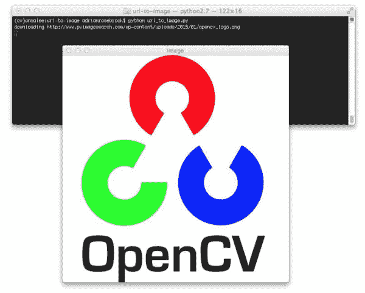
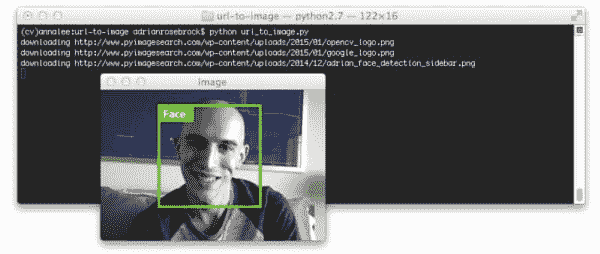

# 用 Python 和 OpenCV 将 URL 转换成图像

> 原文：<https://pyimagesearch.com/2015/03/02/convert-url-to-image-with-python-and-opencv/>

[](https://pyimagesearch.com/wp-content/uploads/2015/01/url_to_image_opencv.jpg)

今天的博文直接来自我个人的效用函数库。

在过去的一个月里，我收到了一些 PyImageSearch 读者发来的电子邮件，询问如何从 URL 下载图像，然后将其转换为 OpenCV 格式(不需要将其写入磁盘，然后读取回来)——在本文中，我将向您展示具体的操作方法。

此外，我们还将看到如何利用 [scikit-image](http://scikit-image.org/) 从 URL 下载图像，以及一个常见的“陷阱”,它可能会让您一路出错。

继续阅读，了解如何使用 Python 和 OpenCV 将 URL 转换为图像。

**OpenCV 和 Python 版本:**
为了运行这个例子，你需要 **Python 2.7** 和 **OpenCV 2.4.X** 。

# 方法 1: OpenCV、NumPy 和 urllib

我们将探索的第一种方法是使用 OpenCV、NumPy 和 urllib 库将 URL 转换成图像。打开一个新文件，命名为`url_to_image.py`，让我们开始吧:

```py
# import the necessary packages
import numpy as np
import urllib
import cv2

# METHOD #1: OpenCV, NumPy, and urllib
def url_to_image(url):
	# download the image, convert it to a NumPy array, and then read
	# it into OpenCV format
	resp = urllib.urlopen(url)
	image = np.asarray(bytearray(resp.read()), dtype="uint8")
	image = cv2.imdecode(image, cv2.IMREAD_COLOR)

	# return the image
	return image

```

我们要做的第一件事是导入我们需要的包。我们将使用 NumPy 将下载的字节序列转换为 NumPy 数组，`urllib`用于执行实际的请求，而`cv2`用于 OpenCV 绑定。

然后我们在第 7 行的**上定义我们的`url_to_image`函数。这个函数需要一个参数`url`，它是我们想要下载的图片的 URL。**

接下来，我们利用`urllib`库打开一个到**第 10 行**上提供的 URL 的连接。来自请求的原始字节序列然后在**行 11** 上被转换成一个 NumPy 数组。

此时，NumPy 数组是一维数组(即一长列像素)。为了将数组重新整形为 2D 格式，假设每个像素有 3 个分量(即，分别是红色、绿色和蓝色分量)，我们调用**行 12** 上的`cv2.imdecode`。最后，我们将解码后的图像返回给第 15 行的调用函数。

好了，是时候让这个函数发挥作用了:

```py
# initialize the list of image URLs to download
urls = [
	"https://pyimagesearch.com/wp-content/uploads/2015/01/opencv_logo.png",
	"https://pyimagesearch.com/wp-content/uploads/2015/01/google_logo.png",
	"https://pyimagesearch.com/wp-content/uploads/2014/12/adrian_face_detection_sidebar.png",
]

# loop over the image URLs
for url in urls:
	# download the image URL and display it
	print "downloading %s" % (url)
	image = url_to_image(url)
	cv2.imshow("Image", image)
	cv2.waitKey(0)

```

**第 18-21 行**定义了我们将要下载并转换成 OpenCV 格式的图像 URL 列表。

我们开始在第 25 行的**上循环这些 URL，在第 28** 行的**上调用我们的`url_to_image`函数，然后最后在第 29 和 30** 行的**上将我们下载的图像显示到我们的屏幕上。此时，我们的图像可以像平常一样用任何其他 OpenCV 函数进行操作。**

要查看我们的工作，打开一个终端并执行以下命令:

```py
$ python url_to_image.py

```

如果一切顺利，您应该首先看到 OpenCV 徽标:

[](https://pyimagesearch.com/wp-content/uploads/2015/01/url_to_image_opencv.jpg)

**Figure 1:** Downloading the OpenCV logo from a URL and converting it to OpenCV format.

接下来是谷歌标志:

[](https://pyimagesearch.com/wp-content/uploads/2015/01/url_to_image_google.jpg)

**Figure 2:** Downloading the Google logo from a URL and converting it to OpenCV format.

这里有一个我在我的书《实用 Python 和 OpenCV 中演示人脸检测的例子:

[](https://pyimagesearch.com/wp-content/uploads/2015/01/url_to_image_face.jpg)

**Figure 3:** Converting an image URL to OpenCV format with Python.

现在，让我们转到下载图像并将其转换为 OpenCV 格式的替代方法。

# 方法 2: scikit-image

第二种方法假设您的系统上安装了 [scikit-image](http://scikit-image.org/) 库。让我们看看如何利用 scikit-image 从 URL 下载图像并将其转换为 OpenCV 格式:

```py
# METHOD #2: scikit-image
from skimage import io

# loop over the image URLs
for url in urls:
	# download the image using scikit-image
	print "downloading %s" % (url)
	image = io.imread(url)
	cv2.imshow("Incorrect", image)
	cv2.imshow("Correct", cv2.cvtColor(image, cv2.COLOR_BGR2RGB))
	cv2.waitKey(0)

```

scikit-image 库的一个优点是，`io`子包中的`imread`函数可以区分磁盘上图像的路径和 URL ( **第 39 行**)。

然而，有一个重要的问题会让你犯错误！

OpenCV 以 BGR 顺序表示图像，而 scikit-image 以 RGB 顺序表示图像。如果您使用 scikit-image `imread`功能，并希望在下载图像后使用 OpenCV 功能，您需要特别注意将图像从 RGB 转换为 BGR ( **Line 41** )。

如果不采取这一额外步骤，您可能会获得不正确的结果:

[](https://pyimagesearch.com/wp-content/uploads/2015/01/url_to_image_opencv_skimage.jpg)

**Figure 4:** Special care needs to be taken to convert from RGB to BGR when using scikit-image to convert a URL to an image. The image on the *left* is incorrectly specified in the RGB order. The image on the *right* correctly displays the image after it is converted from RGB to BGR order.

看看下面的谷歌标志，让这一点更加清楚:

[](https://pyimagesearch.com/wp-content/uploads/2015/01/url_to_image_google_skimage.jpg)

**Figure 5:** Order matters. Be sure to convert from RGB to BGR order or you might be tracking down a hard-to-find bug.

所以你有它！使用 Python、OpenCV、urllib 和 scikit-image 将 URL 转换为图像的两种方法。

# 摘要

在这篇博文中，我们了解了两种从 URL 下载图像并使用 Python 和 OpenCV 将其转换为 OpenCV 格式的方法。

第一种方法是使用`urllib` Python 包下载图像，使用 NumPy 将其转换为数组，最后使用 OpenCV 重塑数组来构造我们的图像。

第二种方法是使用 [scikit-image](http://scikit-image.org/) 的`io.imread`函数。

那么哪种方法更好呢？

这完全取决于你的设置。

如果你已经安装了 scikit-image，我会使用`io.imread`函数(如果你使用 OpenCV 函数，别忘了从 RGB 转换到 BGR)。如果您没有安装 scikit-image，我会手工滚动本文开头详述的`url_to_image`函数。

我很快也会把这个功能添加到 GitHub 的 [imutils](https://github.com/jrosebr1/imutils) 包中。