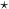

# 神经网络中的卷积和互相关

> 原文：<https://pyimagesearch.com/2021/05/14/convolution-and-cross-correlation-in-neural-networks/>

到目前为止，我们对机器学习和神经网络的整个回顾一直指向这一点: ***了解卷积神经网络(CNN)****以及它们在深度学习中扮演的角色。*

 *在传统的前馈神经网络中，输入层的每个神经元都连接到下一层的每个输出神经元——我们称之为*全连接* (FC)层。然而，在 CNN 中，我们直到网络中的*最后一层*才使用 FC 层。因此，我们可以将 CNN 定义为一个神经网络，它用一个专门的“卷积”层代替网络中至少一个层的*([古德费勒、本吉奥和库维尔，2016](http://www.deeplearningbook.org/) )。*

然后将非线性激活函数(如 ReLU)应用于这些卷积的输出，卷积= >激活的过程继续进行(以及其他层类型的混合，以帮助减少输入体积的宽度和高度，并帮助减少过拟合)，直到我们最终到达网络的末端，并应用一个或两个 FC 层，在那里我们可以获得最终的输出分类。

CNN 的每一层都使用一组不同的过滤器，通常是成百上千的过滤器，然后将结果组合起来，将输出送入网络的下一层。在训练期间，**CNN 自动学习这些滤波器的值**。

在图像分类的背景下，我们的 CNN 可以学习:

*   从第一层的原始像素数据中检测边缘。
*   使用这些边缘来检测第二层中的形状(即“斑点”)。
*   使用这些形状来检测更高层次的特征，如面部结构、汽车零件等。在网络的最高层。

CNN 的最后一层使用这些高级特征来预测图像的内容。实际上，CNN 给了我们两个关键的好处:*局部不变性*和*合成性*。*局部不变性*的概念允许我们将图像分类为包含特定对象*，而不管该对象出现在图像中的什么位置*。我们通过使用“池层”来获得这种局部不变性，池层识别对特定滤波器具有高响应的输入体积的区域。

第二个好处是组合性。每个过滤器将较低级别特征的局部补丁组成较高级别表示，类似于我们如何能够在先前函数的输出的基础上组成一组数学函数:*f*(*g*(*h*(*x*))——这种组成允许我们的网络在网络的更深处学习更丰富的特征。例如，我们的网络可以从像素构建边缘，从边缘构建形状，然后从形状构建复杂的对象——所有这些都是在训练过程中以自动方式自然发生的。从低级特征构建高级特征的概念正是 CNN 在计算机视觉中如此强大的原因。

## **理解卷积**

在这一部分，我们将解决一些问题，包括:

*   什么是图像卷积？
*   他们做什么？
*   为什么我们要使用它们？
*   我们如何将它们应用到图像中？
*   **而卷积在深度学习中起到什么作用？**

“卷积”这个词听起来像是一个奇特而复杂的术语，但事实并非如此。如果你以前有过计算机视觉、图像处理或 OpenCV 的经验，不管你是否意识到，你已经*应用了*卷积、 ***！***

曾经对图像应用过*模糊*或*平滑*吗？是的，这是一个卷积。*边缘检测*怎么样？是的，卷积。有没有打开 Photoshop 或者 GIMP 来*锐化*一张图片？你猜对了——卷积。卷积是计算机视觉和图像处理中最关键、最基本的构件之一。

但是这个词本身往往会把人吓跑——事实上，从表面上看，这个词甚至似乎有负面的含义(为什么会有人想“弄复杂”一些东西？相信我，回旋一点也不可怕。它们其实很容易理解。

在深度学习方面，an (image) ***卷积是两个矩阵的逐元素乘法，后跟一个和*** 。

说真的。就是这样。*你刚刚学习了什么是卷积:*

1.  取两个矩阵(都有相同的维数)。
2.  将它们逐个元素相乘(即*不是*的点积，只是一个简单的乘法)。
3.  将元素加在一起。

### **卷积与互相关**

具有计算机视觉和图像处理背景的读者可能已经将我上面对*卷积*的描述识别为*互相关*运算。用互相关代替卷积，其实是故意的。卷积(由表示)

operator) over a two-dimensional input image *I* and two-dimensional kernel *K* is defined as:

**【①**

 **然而，几乎所有的机器学习和深度学习库都使用简化的*互相关*函数

**② = (I \star K)(i, j) = \sum\limits_{m}\sum\limits_{n} I(i + m, j + n)K(m, n)")**

 **所有这些数学都意味着我们如何访问图像的坐标 *I* 的符号变化(即，当应用互相关时，我们不必相对于输入“翻转”内核)。

同样，许多深度学习库使用简化的互相关运算，并将其称为卷积— **我们在这里将使用相同的术语**。对于有兴趣了解更多卷积与互相关背后的数学知识的读者，请参考 [Szeliski (2011)](https://www.springer.com/gp/book/9781848829343) 的*计算机视觉:算法与应用*第三章。

### **“大矩阵”与“小矩阵**”**比喻**

一幅图像是一个多维矩阵。我们的图像有一个宽度(列数)和高度(行数)，就像一个矩阵。但是与你在小学时使用的传统矩阵不同，图像也有一个*深度*——图像中*通道的数量*。

对于标准 RGB 图像，我们的深度为 3——红色、绿色和蓝色通道的每个对应一个通道*。有了这些知识，我们可以将图像想象成*大矩阵*，将*核*或*卷积矩阵*想象成*小矩阵*，用于模糊、锐化、边缘检测和其他处理功能。本质上，这个*小*内核位于*大*图像的顶部，并从*从左到右*和*从上到下*滑动，在原始图像的每个( *x，y* )坐标处应用数学运算(即*卷积*)。*

手工定义内核来获得各种图像处理功能是很正常的。事实上，你可能已经熟悉模糊(平均平滑，高斯平滑等)。)、边缘检测(拉普拉斯、索贝尔、沙尔、普鲁伊特等。)，以及锐化— *所有这些操作*都是手工定义内核的形式，是*专门设计的*来执行特定的功能。

这样就引出了一个问题:*有没有办法让***自动学习这些类型的滤镜？*甚至使用这些滤镜进行*图像分类*和*物体检测？* **肯定有。但是在我们到达那里之前，我们需要多理解一些内核和卷积。***

 *### **内核**

同样，让我们把一个图像想象成一个*大矩阵*，把一个内核想象成一个*小矩阵*(至少相对于原始的“大矩阵”图像而言)，如图 1**所示。如图所示，我们沿着原始图像从左到右和从上到下滑动内核(红色区域)。在原始图像的每个( *x，y* )坐标处，我们停下来检查位于图像核心的*中心*的像素邻域。然后，我们获取这个像素邻域，*将它们与内核*进行卷积，并获得单个输出值。输出值存储在与内核中心相同的( *x，y* )坐标的输出图像中。**

在我们深入一个例子之前，让我们看一下内核是什么样子的(**等式(3)** ):

**(3)** ![K = \displaystyle\frac{1}{9} \left[\begin{tabular}{ccc}1 & 1 & 1 \\ 1 & 1 & 1 \\ 1 & 1 & 1\end{tabular}\right]](img/0e5a37c58a74211b66b7c8686427f85d.png "K = \displaystyle\frac{1}{9} \left[\begin{tabular}{ccc}1 & 1 & 1 \\ 1 & 1 & 1 \\ 1 & 1 & 1\end{tabular}\right]")

上面，我们已经定义了一个 square 3 *×* 3 内核(有没有人猜到这个内核是用来做什么的？).内核可以是任意的矩形大小 *M×N* ，前提是**的两个** *M* 和 *N* 都是奇数*。*

 ****备注:*** 大多数应用于深度学习和 CNN 的内核都是 *N×N 平方*矩阵，允许我们利用优化的线性代数库，这些库对平方矩阵的操作效率最高。

我们使用一个奇数的内核大小来确保在图像中心有一个有效的整数( *x，y*)-坐标(**图 2** )。在*左边*，我们有一个 3 *×* 3 矩阵。矩阵的*中心*位于 *x* = 1 *，y* = 1，这里矩阵的*左上角*作为原点，我们的坐标是零索引。但是在右边的*，*我们有一个 2 *×* 2 矩阵。该矩阵的*中心*将位于 *x* = 0 *。* 5 *，y* = 0 *。* 5。

但我们知道，不应用插值，就没有像素位置(0 *)这一说。* 5 *，* 0 *。* 5) —我们的像素坐标必须是整数！这就是为什么我们使用奇数内核大小的原因:确保在内核的中心有一个有效的( *x，y* )坐标。

### **卷积的手算实例**

现在我们已经讨论了内核的基础知识，让我们来讨论实际的卷积运算，看看它实际上是如何帮助我们巩固知识的。在图像处理中，卷积需要三个分量:

1.  输入图像。
2.  我们将应用于输入图像的核矩阵。
3.  输出图像，用于存储与内核卷积的图像的输出。

卷积(或互相关)其实很简单。我们需要做的就是:

1.  从原始图像中选择一个( *x，y*)-坐标。
2.  将内核的*中心*放在这个( *x，y* )坐标上。
3.  对输入图像区域和内核进行逐元素乘法运算，然后将这些乘法运算的值相加为单个值。这些乘法的总和被称为**内核输出**。
4.  使用来自**步骤#1** 的相同的( *x，y*)-坐标，但是这次，将内核输出存储在与输出图像相同的( *x，y*)-位置。

下面，你可以找到一个卷积的例子(数学上表示为

operator) a 3*×*3 region of an image with a 3*×*3 kernel used for blurring:

**(4)** ![O_{i,j} = \displaystyle\frac{1}{9} \left[\begin{tabular}{ccc}1 & 1 & 1 \\ 1 & 1 & 1 \\ 1 & 1 & 1\end{tabular}\right] \star \left[\begin{tabular}{ccc}93 & 139 & 101 \\ 26 & 252 & 196 \\ 135 & 230 & 18\end{tabular}\right]  =  \left[\begin{tabular}{ccc} 1/9 \text{x} 93 & 1/9 \text{x} 139 & 1/9 \text{x} 101 \\ 1/9 \text{x} 26 & 1/9 \text{x} 252 & 1/9 \text{x} 196 \\ 1/9 \text{x} 135 & 1/9 \text{x} 230 & 1/9 \text{x} 18\end{tabular}\right]](img/8b6d6538e03e118ad9d0beccad7f1a87.png "O_{i,j} = \displaystyle\frac{1}{9} \left[\begin{tabular}{ccc}1 & 1 & 1 \\ 1 & 1 & 1 \\ 1 & 1 & 1\end{tabular}\right] \star \left[\begin{tabular}{ccc}93 & 139 & 101 \\ 26 & 252 & 196 \\ 135 & 230 & 18\end{tabular}\right]  =  \left[\begin{tabular}{ccc} 1/9 \text{x} 93 & 1/9 \text{x} 139 & 1/9 \text{x} 101 \\ 1/9 \text{x} 26 & 1/9 \text{x} 252 & 1/9 \text{x} 196 \\ 1/9 \text{x} 135 & 1/9 \text{x} 230 & 1/9 \text{x} 18\end{tabular}\right]")

因此，

**(5)** ![O_{i,j} =\sum\left[\begin{tabular}{ccc}10.3 & 15.4 & 11.2 \\ 2.8 & 28.0 & 21.7 \\ 15.0 & 25.5 & 2.0\end{tabular}\right] \approx 132](img/79d634b9d034d894c60a4a55fafd4a75.png "O_{i,j} =\sum\left[\begin{tabular}{ccc}10.3 & 15.4 & 11.2 \\ 2.8 & 28.0 & 21.7 \\ 15.0 & 25.5 & 2.0\end{tabular}\right] \approx 132")

在应用这个卷积之后，我们将把位于输出图像 *O* 的坐标( *i，j* )处的像素设置为 *O [i，j]* = 132。

这就是全部了！卷积是内核和内核覆盖的输入图像的邻域之间的元素矩阵乘法的总和。

### **用 Python 实现卷积**

为了帮助我们进一步理解卷积的概念，让我们看一些真实的代码，它们将揭示内核和卷积是如何实现的。这个源代码不仅能帮助你理解*如何*对图像应用卷积，还能让你理解*在训练 CNN 的时候到底发生了什么。*

打开一个新文件，命名为`convolutions.py`，让我们开始工作:

```py
# import the necessary packages
from skimage.exposure import rescale_intensity
import numpy as np
import argparse
import cv2
```

我们从第 2-5 行开始，导入我们需要的 Python 包。我们将使用 NumPy 和 OpenCV 来实现我们的标准数值数组处理和计算机视觉功能，以及 scikit-image 库来帮助我们实现我们自己的自定义卷积功能。

接下来，我们可以开始定义这个`convolve`方法:

```py
def convolve(image, K):
	# grab the spatial dimensions of the image and kernel
	(iH, iW) = image.shape[:2]
	(kH, kW) = K.shape[:2]

	# allocate memory for the output image, taking care to "pad"
	# the borders of the input image so the spatial size (i.e.,
	# width and height) are not reduced
	pad = (kW - 1) // 2
	image = cv2.copyMakeBorder(image, pad, pad, pad, pad,
		cv2.BORDER_REPLICATE)
	output = np.zeros((iH, iW), dtype="float")
```

`convolve`函数需要两个参数:我们希望与`kernel`卷积的(灰度)`image`。给定我们的`image`和`kernel`(我们假设它们是 NumPy 数组)，然后我们确定每个(**第 9 行和第 10 行**)的空间维度(即宽度和高度)。

在我们继续之前，重要的是要理解卷积矩阵在图像上“滑动”的过程，应用卷积，然后存储输出，这实际上会*减少*输入图像的空间维度。这是为什么呢？

回想一下，我们将计算“集中”在输入图像的中心( *x，y*)-坐标上，内核当前位于该坐标上。*这种定位意味着对于落在图像边缘的像素来说没有“中心”像素这种东西*(因为内核的角会“悬挂”在值未定义的图像上)，如图 3**所示。**

空间维度的减少仅仅是对图像应用卷积的副作用。有时这种效果是可取的，而其他时候不是，这只是取决于您的应用程序。

然而，在大多数情况下，我们希望我们的*输出图像*具有与我们的输入图像相同的*尺寸。为了确保尺寸相同，我们应用 ***填充*** ( **行 15-18** )。在这里，我们只是沿着图像的边界复制像素，这样输出图像将与输入图像的尺寸相匹配。*

还存在其他填充方法，包括*零填充*(用零填充边界——在构建卷积神经网络时非常常见)和*环绕*(通过检查图像的反面来确定边界像素)。在大多数情况下，您会看到复制或零填充。考虑到美观，重复填充更常用，而零填充最有利于提高效率。

我们现在准备将实际卷积应用于我们的图像:

```py
	# loop over the input image, "sliding" the kernel across
	# each (x, y)-coordinate from left-to-right and top-to-bottom
	for y in np.arange(pad, iH + pad):
		for x in np.arange(pad, iW + pad):
			# extract the ROI of the image by extracting the
			# *center* region of the current (x, y)-coordinates
			# dimensions
			roi = image[y - pad:y + pad + 1, x - pad:x + pad + 1]

			# perform the actual convolution by taking the
			# element-wise multiplication between the ROI and
			# the kernel, then summing the matrix
			k = (roi * K).sum()

			# store the convolved value in the output (x, y)-
			# coordinate of the output image
			output[y - pad, x - pad] = k
```

**第 22 行和第 23 行**在我们的`image`上循环，从*从左到右*和*从上到下*滑动内核，一次一个像素。**第 27 行**使用 NumPy 数组切片从`image`中提取感兴趣区域(ROI)。`roi`将以`image`的当前( *x，y* )坐标为中心。`roi`也将与我们的`kernel`大小相同，这对下一步至关重要。

通过在`roi`和`kernel`之间进行逐元素乘法，接着对矩阵中的条目求和，在**行 32** 上执行卷积。然后，输出值`k`存储在`output`数组中相同的( *x，y*)-坐标(相对于输入图像)。

我们现在可以完成我们的`convolve`方法了:

```py
	# rescale the output image to be in the range [0, 255]
	output = rescale_intensity(output, in_range=(0, 255))
	output = (output * 255).astype("uint8")

	# return the output image
	return output
```

当处理图像时，我们通常处理范围在[0 *，* 255]内的像素值。然而，当应用卷积时，我们可以很容易地获得*在*这个范围之外的值。为了将我们的`output`图像带回到范围[0 *，* 255]，我们应用了 scikit-image 的`rescale_intensity`函数( **Line 39** )。

我们还在**第 40 行**将我们的图像转换回无符号的 8 位整数数据类型(以前，`output`图像是浮点类型，以便处理范围[0 *，* 255]之外的像素值)。最后，`output`图像返回到**线 43** 上的调用函数。

现在我们已经定义了我们的`convolve`函数，让我们继续脚本的驱动程序部分。本课的这一部分将处理解析命令行参数，定义一系列要应用于图像的内核，然后显示输出结果:

```py
# construct the argument parse and parse the arguments
ap = argparse.ArgumentParser()
ap.add_argument("-i", "--image", required=True,
	help="path to the input image")
args = vars(ap.parse_args())
```

我们的脚本只需要一个命令行参数`--image`，它是输入图像的路径。然后，我们可以定义两个用于模糊和平滑图像的内核:

```py
# construct average blurring kernels used to smooth an image
smallBlur = np.ones((7, 7), dtype="float") * (1.0 / (7 * 7))
largeBlur = np.ones((21, 21), dtype="float") * (1.0 / (21 * 21))
```

为了说服自己这个内核正在执行模糊，请注意内核中的每个条目如何是 1 个 */S 的*平均值*，*，其中 *S* 是矩阵中条目的总数。因此，这个内核将把每个输入像素乘以一个小分数，然后求和——这就是平均值的定义。

然后我们有一个负责锐化图像的内核:

```py
# construct a sharpening filter
sharpen = np.array((
	[0, -1, 0],
	[-1, 5, -1],
	[0, -1, 0]), dtype="int")
```

然后使用拉普拉斯核来检测边缘状区域:

```py
# construct the Laplacian kernel used to detect edge-like
# regions of an image
laplacian = np.array((
	[0, 1, 0],
	[1, -4, 1],
	[0, 1, 0]), dtype="int")
```

索贝尔核可用于分别检测沿 *x* 和 *y* 轴的边缘状区域:

```py
# construct the Sobel x-axis kernel
sobelX = np.array((
	[-1, 0, 1],
	[-2, 0, 2],
	[-1, 0, 1]), dtype="int")

# construct the Sobel y-axis kernel
sobelY = np.array((
	[-1, -2, -1],
	[0, 0, 0],
	[1, 2, 1]), dtype="int")
```

最后，我们定义了浮雕内核:

```py
# construct an emboss kernel
emboss = np.array((
	[-2, -1, 0],
	[-1, 1, 1],
	[0, 1, 2]), dtype="int")
```

解释这些内核是如何形成的超出了本教程的范围，所以暂时简单地理解这些内核是*手动构建的*来执行给定的操作。

关于内核如何在数学上构造并被证明执行给定图像处理操作的完整处理，请参考 [Szeliski(第 3 章)](https://www.springer.com/gp/book/9781848829343)。我还推荐使用这个来自 [Setosa.io](http://setosa.io/ev/image-kernels/) 的优秀内核可视化工具。

给定所有这些内核，我们可以将它们集合成一组称为“内核库”的元组:

```py
# construct the kernel bank, a list of kernels we're going to apply
# using both our custom 'convolve' function and OpenCV's 'filter2D'
# function
kernelBank = (
	("small_blur", smallBlur),
	("large_blur", largeBlur),
	("sharpen", sharpen),
	("laplacian", laplacian),
	("sobel_x", sobelX),
	("sobel_y", sobelY),
	("emboss", emboss))
```

构建这个内核列表使我们能够循环遍历它们，并以有效的方式可视化它们的输出，如下面的代码块所示:

```py
# load the input image and convert it to grayscale
image = cv2.imread(args["image"])
gray = cv2.cvtColor(image, cv2.COLOR_BGR2GRAY)

# loop over the kernels
for (kernelName, K) in kernelBank:
	# apply the kernel to the grayscale image using both our custom
	# 'convolve' function and OpenCV's 'filter2D' function
	print("[INFO] applying {} kernel".format(kernelName))
	convolveOutput = convolve(gray, K)
	opencvOutput = cv2.filter2D(gray, -1, K)

	# show the output images
	cv2.imshow("Original", gray)
	cv2.imshow("{} - convolve".format(kernelName), convolveOutput)
	cv2.imshow("{} - opencv".format(kernelName), opencvOutput)
	cv2.waitKey(0)
	cv2.destroyAllWindows()
```

第 99 行和第 100 行从磁盘加载我们的图像并将其转换成灰度。卷积运算符可以应用于 RGB 或其他多通道体积，但为了简单起见，我们将只对灰度图像应用我们的过滤器。

我们开始在第**行第 103** 行的`kernelBank`中循环我们的内核集，然后通过调用我们的函数`convolve`方法，将当前的`kernel`应用到第**行第 107** 行的`gray`图像，该方法在脚本的前面定义。

作为检查，我们还调用了`cv2.filter2D`，这也将我们的`kernel`应用于`gray`图像。`cv2.filter2D`函数是 OpenCV 的`convolve`函数的优化版本。我在这里包括这两者的主要原因是为了让我们对我们的定制实现进行健全的检查。

最后，**行 111-115** 在屏幕上显示每种内核类型的输出图像。

**卷积结果**

要运行我们的脚本(并可视化各种卷积运算的输出)，只需发出以下命令:

```py
$ python convolutions.py --image jemma.png
```

然后你会在图 4 的**中看到将`smallBlur`内核应用到输入图像的结果。在*左边*，我们有我们的原始图像。然后，在*中心*，我们得到了来自`convolve`函数的结果。而在*右边的*，则是来自`cv2.filter2D`的结果。快速的视觉检查将揭示我们的输出与`cv2.filter2D`匹配，这表明我们的`convolve`功能工作正常。此外，由于平滑内核，我们的图像现在看起来“模糊”和“平滑”。**

让我们应用一个更大的模糊，结果可以在**图 5** ( *左上*)中看到。这次我省略了`cv2.filter2D`结果以节省空间。比较图 5**和图 4**的结果，注意随着平均内核*的大小增加*，输出图像*中的模糊量也增加*。****

我们还可以锐化我们的图像(**图 5** 、*中上*)，并通过拉普拉斯算子(*右上*)检测边缘状区域。

`sobelX`内核用于寻找图像中的垂直边缘(**图 5** 、*左下*)，而`sobelY`内核揭示水平边缘(*中下*)。最后，我们可以在右下方的*中看到浮雕内核的结果。*

### **卷积在深度学习中的作用**

我们必须*手动定义*各种图像处理操作的内核，比如平滑、锐化和边缘检测。这一切都很好，**但是如果有办法用** ***学*** **这些滤镜来代替呢？**

有没有可能定义一种机器学习算法，它可以查看我们的输入图像，并最终*学习*这些类型的运算符？其实是有的——这类算法有:**【卷积神经网络(CNN)**。

通过应用卷积过滤器、非线性激活函数、池化和反向传播，CNN 能够学习能够检测网络低层中的边缘和斑点状结构的过滤器，然后使用边缘和结构作为“构建块”，最终检测高层对象(例如，脸、猫、狗、杯子等)。)在网络的更深层。

这种使用较低级别的层来学习高级特征的过程正是我们之前提到的 CNN 的*组成性*。但是 CNN 到底是怎么做的呢*？答案是通过有目的地堆叠一组特定的层。我们将在单独的课程中讨论这些类型的图层，然后研究在许多影像分类任务中广泛使用的常见图层堆叠模式。********