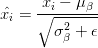

# 卷积神经网络(CNN)和层类型

> 原文：<https://pyimagesearch.com/2021/05/14/convolutional-neural-networks-cnns-and-layer-types/>

## **CNN 积木**

神经网络接受输入图像/特征向量(每个条目一个输入节点)，并通过一系列隐藏层对其进行变换，通常使用非线性激活函数。每个隐藏层也由一组神经元组成，其中每个神经元都与前一层中的所有神经元完全连接。神经网络的最后一层(即“输出层”)也是完全连接的，并代表网络的最终输出分类。

然而，神经网络直接对原始像素强度进行操作:

1.  随着图像尺寸的增加，缩放效果不佳。
2.  精度有待提高(即 CIFAR-10 上的标准前馈神经网络仅获得 52%的精度)。

为了证明标准神经网络如何不能随着图像大小的增加而很好地扩展，让我们再次考虑 CIFAR-10 数据集。CIFAR-10 中的每个图像是 32 *×* 32，具有红色、绿色和蓝色通道，总共产生 32 *×* 32 *×* 3 = 3 *，* 072 个输入到我们的网络。

总共 3 个*，* 072 个输入看起来不算多，但是考虑一下如果我们使用 250 个 *×* 250 像素的图像——输入和权重的总数将跳到 250 个 *×* 250 个 *×* 3 = 187 个*，* 500 个——并且这个数字仅针对输入层！当然，我们会希望添加多个隐藏层，每层的节点数各不相同——这些参数可以很快累加起来，鉴于标准神经网络在原始像素强度上的较差性能，这种膨胀几乎不值得。

相反，我们可以使用*卷积神经网络(CNN)*来利用输入图像结构，并以更明智的方式定义网络架构。与标准的神经网络不同，CNN 的层以三维方式排列在 *3D 体积*中:**宽度**、**高度**和**深度**(其中*深度*是指体积的第三维，例如图像中的通道数量或层中的过滤器数量)。

为了使这个例子更具体，再次考虑 CIFAR-10 数据集:输入体积将具有维度 32 *×* 32 *×* 3(分别是宽度、高度和深度)。后续层中的神经元将只连接到其前一层的*小区域*(而不是标准神经网络的完全连接结构)——我们称之为 ***局部连接*** 、，这使我们能够在我们的网络中保存*大量*参数。最后，输出层将是一个 1 *×* 1 *×N* 的体积，它表示提取到类分数的单个向量中的图像。在 CIFAR-10 的情况下，给定十个等级， *N* = 10，产生 1 *×* 1 *×* 10 的体积。

### **图层类型**

有许多类型的层用于构建卷积神经网络，但您最有可能遇到的层包括:

*   卷积(`CONV`)
*   激活(`ACT`或`RELU`，我们使用相同或实际的激活功能)
*   合用(`POOL`)
*   完全连接(`FC`)
*   批量标准化(`BN`)
*   辍学(`DO`)

以特定的方式堆叠一系列这些层会产生 CNN。我们经常用简单的文字图来描述一个 CNN: `INPUT => CONV => RELU => FC => SOFTMAX`。

这里，我们定义了一个简单的 CNN，它接受输入，应用卷积层，然后是激活层，然后是全连接层，最后是 softmax 分类器，以获得输出分类概率。网络图中经常省略`SOFTMAX`激活层，因为它被认为直接跟在最后的`FC`之后。

在这些层类型中，`CONV`和`FC`(在较小程度上，`BN`)是唯一包含在训练过程中*学习到的*参数的层。激活层和脱落层本身并不被认为是真正的“层”，但通常被包含在网络图中，以使体系结构*显式*清晰。与`CONV`和`FC`同等重要的汇集层(`POOL`)也被包含在网络图中，因为它们在图像通过 CNN 时对图像的空间维度有着*重大影响*。

在定义您的实际网络架构时，**、`POOL`、`RELU`和`FC`是最重要的。**这并不是说其他层不重要，而是让位于这四个关键层，因为它们定义了*实际架构本身*。

***备注:*** 激活函数本身实际上**假设**是架构的一部分，当定义 CNN 架构时，我们经常*从表格/图表中省略*激活层以节省空间；然而，激活层被*隐含地*假定为架构的一部分。

在本教程中，我们将详细回顾每一种层类型，并讨论与每一层相关的参数(以及如何设置它们)。在以后的教程中，我将更详细地讨论如何正确地堆叠这些层来构建您自己的 CNN 架构。

### **卷积层**

`CONV`层是卷积神经网络的核心构建模块。`CONV`层参数由一组 *K* 可学习过滤器(即“内核”)组成，其中每个过滤器都有一个宽度和一个高度，并且几乎总是正方形。这些过滤器很小(就它们的空间尺寸而言),但是在体积的整个深度上延伸。

对于 CNN 的输入，深度是图像中通道的数量(即，当处理 RGB 图像时，深度为三，每个通道一个)。对于网络中较深的卷，深度将是在*之前的*层中应用的过滤器数量。

为了使这个概念更清楚，让我们考虑 CNN 的前向传递，其中我们在输入体积的宽度和高度上卷积每个 *K* 滤波器。更简单地说，我们可以想象我们的每个 *K* 内核滑过输入区域，计算元素级乘法、求和，然后将输出值存储在一个二维*激活图*中，比如图 1 中的**。**

在将所有的 *K* 过滤器应用到输入体积之后，我们现在有了 *K* ，二维激活图。然后，我们沿着数组的深度维度堆叠我们的 *K* 激活图，以形成最终的输出体积**(图 2** )。

因此，输出体积中的每一个条目都是一个神经元的输出，该神经元只“看”输入的一小部分。以这种方式，网络“学习”过滤器，当它们在输入体积中的给定空间位置处看到特定类型的特征时，过滤器被激活。在网络的较低层，当过滤器看到边缘状或角状区域时，它们可能会激活。

然后，在网络的更深层，过滤器可以在出现高级特征时激活，例如面部的部分、狗的爪子、汽车的引擎盖等。这种激活概念就好像这些神经元在看到输入图像中的特定模式时变得“兴奋”和“激活”。

将小滤波器与大(r)输入量进行卷积的概念在卷积神经网络中具有特殊的意义——具体来说，就是神经元的**局部连通性**和**感受域**。当处理图像时，将当前体积中的神经元连接到前一体积中的*所有*神经元通常是不切实际的——连接太多，权重太大，使得不可能在具有大空间维度的图像上训练深度网络。相反，当利用 CNN 时，我们选择将每个神经元仅连接到输入体积的一个*局部区域*——我们将这个局部区域的大小称为神经元的**感受野**(或简称为变量 *F* )。

为了明确这一点，让我们回到我们的 CIFAR-10 数据集，其中输入卷的输入大小为 32 *×* 32 *×* 3。因此，每个图像的宽度为 32 像素，高度为 32 像素，深度为 3(每个 RGB 通道一个像素)。如果我们的感受野大小为 3 *×* 3，那么`CONV`层中的每个神经元将连接到图像的 3 *×* 3 局部区域，总共 3 *×* 3 *×* 3 = 27 个权重(记住，滤波器的深度为 3，因为它们延伸通过输入图像的整个深度，在这种情况下，为 3 个通道)。

现在，让我们假设我们的输入体积的空间维度已经被减小到更小的尺寸，但是我们的深度现在更大了，这是由于在网络中使用了更多更深的过滤器，因此体积尺寸现在是 16 *×* 16 *×* 94。同样，如果我们假设感受野的大小为 3 *×* 3，那么`CONV`层中的每个神经元将总共有 3 个 *×* 3 *×* 94 = 846 个连接到输入体积。简单地说，感受野 *F* 是滤波器的 ***大小*** ，产生一个 *F×F* 核，该核与输入体积卷积。

至此，我们已经解释了输入体积中神经元的连接性，但没有解释输出体积的排列或大小。有三个参数控制输出音量的大小:深度、**步幅**和**补零**大小，下面我们将逐一介绍。

**深度**

输出体积的*深度*控制连接到输入体积局部区域的`CONV`层中神经元(即过滤器)的数量。每个过滤器产生一个激活图，该激活图在存在定向边缘或斑点或颜色时“激活”。

对于给定的`CONV`层，激活图的深度将是 *K* ，或者简单地说是我们在当前层中学习的过滤器的数量。“查看”输入的相同( *x，y* )位置的一组过滤器被称为**深度列**。

**步幅**

考虑一下我们将卷积运算描述为将一个小矩阵“滑过”一个大矩阵，在每个坐标处停止，计算一个逐元素的乘法和求和，然后存储输出。这个描述类似于一个从*从左到右*和*从上到下*滑过图像的*滑动窗口*(【http://pyimg.co/0yizo】的)。

在上面卷积的上下文中，我们每次只采取一个像素的步长。在 CNN 的上下文中，可以应用相同的原理——对于每一步，我们在图像的局部区域周围创建一个新的深度列，其中我们将每个 *K* 滤波器与该区域进行卷积，并将输出存储在 3D 体积中。当创建我们的`CONV`层时，我们通常使用步长 *S* 或者 *S* = 1 或者 *S* = 2。

较小的步幅将导致感受野重叠和较大的输出量。相反，较大的步幅将导致较少的感受野重叠和较小的输出量。为了使卷积步幅的概念更具体，考虑**表 1** ，其中我们有一个 5 *×* 5 输入图像(*左*)以及一个 3 *×* 3 拉普拉斯核(右)。

使用 *S* = 1，我们的内核从*从左到右*和*从上到下*滑动，一次一个像素，产生下面的输出(**表 2** ，*左*)。然而，如果我们应用相同的操作，只是这次的步幅为 *S* = 2，我们一次跳过*两个像素*(沿 *x* 轴两个像素，沿 *y* 轴两个像素)，产生较小的输出音量(*右*)。

因此，我们可以看到卷积层如何通过简单地改变核的步幅来减少输入体积的空间维度。卷积图层和池化图层是减少空间输入大小的主要方法。

**补零**

当应用卷积时，我们需要“填充”图像的边界，以保持*原始图像大小*——CNN 内部的过滤器也是如此。使用零填充，我们可以沿着边界“填充”我们的输入，以便我们的输出音量大小与我们的输入音量大小相匹配。我们应用的填充量由参数 *P* 控制。

当我们开始研究在彼此之上应用多个过滤器的深度 CNN 架构时，这种技术*尤其关键*。为了可视化零填充，再次参考**表 1** ，其中我们将 3 *×* 3 拉普拉斯核应用于步长为 *S* = 1 的 5 *×* 5 输入图像。

我们可以在**表 3** ( *左*)中看到，由于卷积运算的性质，输出音量如何比输入音量 (3 *×* 3)小*。如果我们改为设置 *P* = 1，我们可以用零(*右*)填充我们的输入音量，以创建 7 *×* 7 的音量，然后应用卷积运算，得到与原始输入音量大小 5 *×* 5 ( *下*)匹配的输出音量大小。*

如果没有零填充，输入量的空间维度会下降得太快，我们将无法训练深层网络(因为输入量太小，无法从中学习任何有用的模式)。

将所有这些参数放在一起，我们可以计算输出音量的大小，作为输入音量大小( *W* ，假设输入图像是正方形的，它们几乎总是正方形)，感受野大小 *F* ，步幅 *S* ，以及零填充量 *P* 的函数。为了构建一个有效的`CONV`层，我们需要确保下面的等式是一个整数:

**(1)**((*W*-*F*+2*P*)/*S*)+1

如果*不是*整数，则步幅设置不正确，并且神经元不能平铺以使它们以对称的方式适合输入体积。

作为一个例子，考虑 AlexNet 架构的第一层，它赢得了 2012 年 ImageNet 分类挑战赛，并对当前应用于图像分类的深度学习热潮做出了巨大贡献。在他们的论文中， [Krizhevsky 等人(2012)](http://papers.nips.cc/paper/4824-imagenet-classification-with-deepconvolutional- neural-networks.pdf) 根据**图 3** 记录了他们的 CNN 架构。

注意第一层是如何宣称输入图像尺寸为 224*×224*像素的。然而，如果我们使用 11 个 *×* 11 个过滤器、4 个步幅并且没有填充来应用上面的等式，这不可能是正确的:

**(2)**((224*-*11+2(0))*/*4)+1 = 54*。*25****

这当然不是一个整数。

对于刚刚开始学习深度学习和 CNN 的新手读者来说，这样一篇开创性论文中的这个小错误已经导致了无数困惑和沮丧的错误。不知道为什么会出现这种打字错误，但很可能 Krizhevsky 等人使用了 227 *×* 227 张输入图像，因为:

**(3)**((227*-*11+2(0))*/*4)+1 = 55

像这样的错误比你想象的更常见，所以当从出版物中实现 CNN 时，一定要*亲自检查参数*，而不是简单地假设列出的参数是正确的。由于 CNN 中的大量参数，在记录架构时很容易犯印刷错误(我自己也犯过很多次)。

总而言之，`CONV`层以与[卡帕西](http://cs231n.github.io/convolutional-networks/)相同的优雅方式:

*   接受大小为*W[input]×H[input]×D[input]*的输入量(输入大小一般为方形，所以常见的有*W[input]*=*H[input]*)。
*   需要四个参数:
    *   滤镜数量 *K* (控制输出量的*深度*)。
    *   感受野大小 *F* (用于卷积的 *K* 核的大小，并且早期总是*平方*，产生 *F×F* 核)。
    *   步幅 *S* 。
    *   补零量 *P* 。

*   然后`CONV`层的输出为 *W [输出] ×H [输出] ×D [输出]* ，其中:
    *   *W [输出]=((*W[输入]—F*+2*P*)*/S*)+1*
    *   *H [输出]=((*H[输入]—F*+2*P*)*/S*)+1*
    *   *D [输出]=*K**

### **激活层**

在 CNN 的每一个`CONV`层之后，我们应用一个非线性激活函数，比如 ReLU，eLU，或者任何其他的泄漏 ReLU 变体。在网络图中，我们通常将激活层表示为`RELU`,因为 ReLU 激活是最常用的，我们也可以简单地表示为`ACT`——在这两种情况下，我们都清楚地表明激活功能应用于网络架构内部。

激活层在技术上不是“层”(由于在激活层内部不学习参数/权重的事实)，并且有时从网络架构图中省略，因为*假设*激活*紧接着*卷积。

在这种情况下，出版物的作者将在他们论文的某个地方的每个`CONV`层后提到他们正在使用的激活函数。例如，考虑以下网络架构:`INPUT => CONV => RELU => FC`。

为了使这个图更简洁，我们可以简单地删除`RELU`组件，因为它假设激活总是遵循卷积:`INPUT => CONV => FC`。我个人不喜欢这样，选择*明确*将激活层包含在网络图中，以明确*何时*和*我在网络中应用什么*激活功能。

激活层接受大小为*W[input]×H[input]×D[input]*的输入量，然后应用给定的激活函数(**图 4** )。由于激活函数是以元素方式应用的，所以激活层的输出总是与输入维度相同， *W [输入]* = *W [输出]* ， *H [输入]* = *H [输出]* ， *D [输入]* = *D*

### **汇集层**

有两种方法可以减小输入体积的大小——步长为 *>* 1 的`CONV`层(我们已经见过)和`POOL`层。在 CNN 架构中，通常在连续的`CONV`层之间插入`POOL`层:

`INPUT => CONV => RELU => POOL => CONV => RELU => POOL => FC`

`POOL`层的主要功能是逐渐减小输入体积的空间尺寸(即宽度和高度)。这样做可以让我们减少网络中的参数和计算量——池化也有助于我们控制过度拟合。

`POOL`层使用*最大值*或*平均值*功能独立地对输入*的每个深度切片进行操作*。最大池通常在 CNN 架构的中间完成，以减少空间大小，而平均池通常用作网络的最后一层(例如，GoogLeNet、SqueezeNet、ResNet)，我们希望完全避免使用`FC`层。最常见的`POOL`层类型是 max pooling，尽管这种趋势正在随着更奇特的微架构的引入而改变。

通常我们将使用 2 *×* 2 的池大小，尽管在网络架构的早期，使用更大输入图像( *>* 200 像素)的更深 CNN 可能使用 3 *×* 3 的池大小。我们通常也将步幅设置为 *S* = 1 或 *S* = 2。**图 5** (很大程度上受 [Karpathy 等人](http://cs231n.github.io/convolutional-networks/)的启发)给出了一个应用最大池的示例，池大小为 2 *×* 2，步长为 *S* = 1。请注意，对于每 2 个 *×* 2 块，我们只保留最大值，单步执行(像滑动窗口一样)，并再次应用该操作，从而产生 3 个 *×* 3 的输出音量大小。

我们可以通过增加步幅来进一步减小输出音量——这里我们将 *S* = 2 应用于相同的输入(**图 5** ，*底部*)。对于输入中的每 2 个 *×* 2 块，我们只保留最大值，然后采取*两个像素*的步长，再次应用运算。这种池允许我们将宽度和高度减少一半，有效地丢弃了前一层中 75%的激活。

总之，`POOL`层接受大小为 *W [输入] ×H [输入] ×D [输入]* 的输入量。它们需要两个参数:

*   感受野大小 *F* (也称为“池大小”)。
*   步幅 *S* 。

应用`POOL`操作产生大小为 *W [输出] ×H [输出] ×D [输出]* 的输出体积，其中:

*   *W [输出]=((*W[输入]—F*)*/S*)+1*
*   *H [输出]=((*H[输入]—F*)*/S*)+1*
*   *D [输出]=*D[输入]**

在实践中，我们倾向于看到两种类型的最大池变化:

*   **Type #1:** *F* = 3 *，S* = 2，称为*重叠池*，通常应用于空间维度较大的图像/输入体。
*   **Type #2:** *F* = 2 *，S* = 2，称为*非重叠池*。这是最常见的池类型，适用于空间尺寸较小的图像。

对于接受较小输入图像(在 32*-*64 像素范围内)的网络架构，您也可能会看到 *F* = 2 *，S* = 1。

**去潭州还是 CONV？**

在他们的 [2014 年论文中， ***力求简单:全卷积网*，Springenberg 等人**](http://arxiv.org/abs/1412.6806) 建议完全丢弃`POOL`层*，而简单地依靠具有较大跨距的`CONV`层来处理体积的空间维度的下采样。他们的工作表明，这种方法在各种数据集上工作得非常好，包括 CIFAR-10(小图像，低类别数)和 ImageNet(大输入图像，1000 个类别)。这种趋势随着 **[ResNet 架构](http://arxiv.org/abs/1512.03385)** 而延续，该架构也使用`CONV`层进行下采样。*

 *越来越常见的是，*不*在网络架构中间使用`POOL`层，而*如果要避免使用`FC`层，只有*在网络末端使用平均池。也许在未来，卷积神经网络中不会有池层，但与此同时，我们必须研究它们，了解它们的工作原理，并将它们应用到我们自己的架构中。

### **完全连接的层**

`FC`层中的神经元完全连接到前一层中的所有激活，这是前馈神经网络的标准。`FC`层是*总是*放置在网络的末端(即，我们不应用`CONV`层，然后是`FC`层，接着是另一个`CONV`层)。

在应用 softmax 分类器之前，通常使用一个或两个`FC`层，如下(简化)架构所示:

```py
INPUT => CONV => RELU => POOL => CONV => RELU => POOL => FC => FC
```

这里，我们在(隐含的)softmax 分类器之前应用两个完全连接的层，该分类器将计算每个类的最终输出概率。

### **批量归一化**

由 [Ioffe 和 Szegedy 在他们 2015 年的论文*中首次介绍，批量标准化:通过减少内部协变量移位*](http://arxiv.org/abs/1502.03167) 加速深度网络训练，顾名思义，批量标准化层(或简称为`BN`)用于在给定输入量传递到网络的下一层之前对其激活进行标准化。

如果我们考虑

to be our mini-batch of activations, then we can compute the normalized via the following equation:

**(4)** 

在*训练*期间，我们计算每个小批量 *β* 的*[β]* 和 *σ* *[β]* ，其中:

**(5)** ^{2}")

我们设置 *ε* 等于一个小的正值，比如 1e-7，以避免被零除。应用该等式意味着离开批量归一化层的激活将具有近似为零的平均值和单位方差(即，以零为中心)。

在*测试*时间，我们将小批量和 *σ [β]* 替换为训练过程中计算的*[【β】]*和 *σ [β]* 的*移动平均值。这确保了我们可以通过我们的网络传递图像，并且仍然获得准确的预测，而不会受到来自在训练时通过网络传递的最终小批量的 *[β]* 和 *σ [β]* 的偏差。*

在减少训练一个神经网络所需的历元数方面，批量标准化已经被证明是非常有效的。批量规范化还有助于“稳定”训练，允许更大范围的学习速率和规范化强度。使用批量规范化当然不会减轻调整这些参数的需要，但是它*将*通过使学习率和规范化不那么不稳定并且更容易调整来使你的生活更容易。在网络中使用批量标准化时，您还会注意到*更低的最终损耗*和*更稳定的损耗曲线*。

批量归一化的最大缺点是，由于每批统计数据和归一化的计算，它实际上会将训练网络所需的时间减少 2-3 倍(即使您需要更少的历元来获得合理的精度)。

也就是说，我建议在*的几乎所有情况下*都使用批处理规范化，因为它确实会产生显著的差异。对我们的网络架构应用批量标准化可以帮助我们防止过度拟合，并且与没有批量标准化的相同网络架构*相比，允许我们在更少的时期内获得显著更高的分类准确度。*

**那么，批量归一化图层去哪里了呢？**

你可能已经注意到，在我关于批处理规范化的讨论中，我完全忽略了*在网络架构中*放置批处理规范化层的位置。根据 **[Ioffe 和 Szegedy](http://arxiv.org/abs/1502.03167)** 的原始论文，他们将批处理规范化(`BN` ) *放在*激活之前:

> *我们通过归一化 x* = *吴* + *b.* ，在非线性之前立即添加 BN 变换

使用这种方案，利用批处理规范化的网络体系结构将如下所示:

```py
INPUT => CONV => BN => RELU ...
```

然而，从统计学的角度来看，这种批处理规范化的观点没有意义。在这种情况下，`BN`层对来自`CONV`层的特征分布进行标准化。这些特征中的一些可以是负的，其中它们将被诸如 ReLU 的非线性激活函数箝位(即，设置为零)。

如果我们在激活之前对*进行归一化，我们实际上是在归一化中包含了负值。然后，我们以零为中心的特征通过 ReLU，在 ReLU 中，我们删除任何小于零的激活(包括在*归一化之前*可能不是负值的特征)，这种层排序完全违背了首先应用批量归一化的目的。*

相反，如果我们将批量归一化*放在*ReLU 之后，我们将归一化正值特征，而不会使它们在统计上偏向那些本来不会到达下一个`CONV`层的特征。事实上，Keras 的创建者和维护者 Franç ois Chollet 证实了这一点，他指出`BN`应该在激活之后出现:

> 我可以保证 Christian [Szegedy，来自 BN 论文]最近写的代码在 BN 之前应用 relu。尽管如此，它仍然偶尔成为争论的话题。
> 
> *[Szegedy](https://github.com/keras-team/keras/issues/1802#issuecomment-187966878)*

目前还不清楚为什么 Ioffe 和 Szegedy 在他们的论文中建议在激活之前放置`BN`层，但进一步的[实验](https://github.com/ducha-aiki/caffenet-benchmark/blob/master/batchnorm.md) 以及来自其他[深度学习研究人员](https://www.reddit.com/r/MachineLearning/comments/67gonq/d_batch_normalization_before_or_after_relu/) 的轶事证据证实，在非线性激活之后放置批量归一化层*几乎在所有情况下都会产生更高的准确性和更低的损失。*

将激活后的`BN`放置在网络架构中，看起来像这样:

```py
INPUT => CONV => RELU => BN ...
```

我可以确认，在我用 CNN 进行的几乎所有实验中，将`BN`放在`RELU`之后会产生稍高的精确度和较低的损耗。也就是说，请注意单词*“几乎”——*有极少数*情况下，在激活前放置`BN`效果更好，这意味着您应该默认在激活后放置`BN`，但可能希望专门(最多)进行一次实验，在激活前放置`BN`并记录结果。*

在运行了一些这样的实验后，你会很快意识到激活后的`BN`表现得更好，并且你的网络有更多重要的参数需要调整以获得更高的分类精度。

### **辍学**

我们要讨论的最后一种层类型是辍学。退出实际上是*正则化*的一种形式，旨在通过提高测试精度来帮助防止过度拟合，这可能是以训练精度为代价的。对于我们训练集中的每个小批量，丢弃层以概率 *p* 随机断开网络架构中前一层到下一层的输入。

**图 6** 形象化了这个概念，我们以概率 *p* = 0 *随机断开连接。* 5 给定小批量的两个`FC`层之间的连接。同样，请注意这个小批量的一半连接是如何被切断的。在为小批量计算了向前和向后传递之后，我们重新连接丢弃的连接，然后对另一组要丢弃的连接进行采样。

我们应用 dropout 的原因是通过在训练时*显式*改变网络架构来减少过拟合。随机丢弃连接确保网络中没有单个节点在面对给定模式时负责“激活”。相反，dropout 确保了有*多个冗余节点*在出现类似输入时会被激活——这反过来帮助我们的模型*推广*。

最常见的是放置 *p* = 0 *的辍学层。* 5 ***在架构的*** `FC`层之间，其中最后的`FC`层被假定为我们的 softmax 分类器:

```py
... CONV => RELU => POOL => FC => DO => FC => DO => FC
```

然而，我们也可以应用具有较小概率的退出(即， *p* = 0 *)。*10*—*0*。* 25)在网络的早期层中也是如此(通常在下采样操作之后，通过最大池或卷积)。

## **通用架构和培训模式**

正如我们所见，卷积神经网络由四个主要层组成:`CONV`、`POOL`、`RELU`和`FC`。将这些层按照特定的模式堆叠在一起，就产生了一个 *CNN 架构*。

`CONV`和`FC`层(以及`BN`层)是网络中唯一实际学习参数的层，其他层只是负责执行给定的操作。激活层，(`ACT`)如`RELU`和 dropout 在技术上不是层，但经常包含在 CNN 架构图中，以使操作顺序*明确明确*——我们将采用相同的约定。

### **图层模式**

到目前为止，CNN 架构最常见的形式是堆叠几个`CONV`和`RELU`层，在它们之后是一个`POOL`操作。我们重复这个顺序，直到体积的宽度和高度变小，此时我们应用一个或多个`FC`层。因此，我们可以使用以下[模式](http://cs231n.github.io/convolutional-networks/)推导出最常见的 CNN 架构:

```py
INPUT => [[CONV => RELU]*N => POOL?]*M => [FC => RELU]*K => FC
```

这里的`*`操作符表示一个或多个操作，而`?`表示可选操作。

每次重复的常见选择包括:

*   0*<*=*<*= 3
*   *M >* = 0
*   0*<*=*K<= 2*

下面，我们可以看到遵循这种模式的 CNN 架构的一些例子:

*   `INPUT => FC`
*   `INPUT => [CONV => RELU => POOL] * 2 => FC => RELU => FC`
*   `INPUT => [CONV => RELU => CONV => RELU => POOL] * 3 => [FC => RELU] * 2 => FC`

下面是一个非常浅的 CNN 的例子，只有一个`CONV`层( *N* = *M* = *K* = 0):

```py
INPUT => CONV => RELU => FC
```

下面是一个类似于 [AlexNet 的](http://papers.nips.cc/paper/4824-imagenet-classification-with-deepconvolutional- neural-networks.pdf) CNN 架构的例子，它有多个`CONV => RELU => POOL`层集，后面是`FC`层:

```py
INPUT => [CONV => RELU => POOL] * 2 => [CONV => RELU] * 3 => POOL =>
	[FC => RELU => DO] * 2 => SOFTMAX
```

对于更深层次的网络架构，例如 **[VGGNet](http://arxiv.org/ abs/1409.1556)** ，我们将在每个`POOL`层之前堆叠两个(或更多)层:

```py
INPUT => [CONV => RELU] * 2 => POOL => [CONV => RELU] * 2 => POOL =>
	[CONV => RELU] * 3 => POOL => [CONV => RELU] * 3 => POOL =>
	[FC => RELU => DO] * 2 => SOFTMAX
```

一般来说，当我们(1)有大量标记的训练数据并且(2)分类问题足够具有挑战性时，我们应用更深的网络架构。在应用`POOL`层之前堆叠多个`CONV`层允许`CONV`层在破坏性汇集操作执行之前开发更复杂的特征。

有更多的“外来”网络架构偏离了这些模式，反过来也创造了自己的模式。一些架构完全移除了`POOL`操作，依靠`CONV`层对体积进行下采样，然后，在网络的末端，应用平均池而不是`FC`层来获得 softmax 分类器的输入。

GoogLeNet、ResNet 和 SqueezeNet ( [何等人](https://arxiv.org/abs/1512.03385)、[赛格迪等人](http://arxiv.org/abs/1409.4842)、[伊恩多拉等人](https://arxiv.org/abs/1602.07360))等网络架构就是这种模式的典型例子，它们展示了移除`FC`层如何减少参数并加快训练时间。

这些类型的网络架构还跨通道维度“堆叠”和连接过滤器:GoogLeNet 应用 1 个 *×* 1、3 个 *×* 3 和 5 个 *×* 5 过滤器，然后跨通道维度将它们连接在一起，以学习多级特征。同样，这些架构被认为是更“奇特”的，被认为是先进的技术。

### **经验法则**

在构建自己的 CNN 时，我将回顾一些常见的经验法则。首先，呈现给**输入层**的图像应该是*正方形*。使用平方输入允许我们利用线性代数优化库。常见的输入层大小包括 32×32、64×64、96×96、224×224、227×227 和 229×229(为方便标注，省略了通道数)。

其次，在应用第一个`CONV`操作之后，输入层也应该是可被两个倍数整除的*。你可以通过调整过滤器的大小和步幅来做到这一点。“除以 2 规则”使我们的网络中的空间输入能够通过`POOL`操作以有效的方式方便地进行下采样。*

一般来说，你的`CONV`图层应该使用较小的滤镜尺寸，比如 3 *×* 3 和 5 *×* 5。微型 1 *×* 1 过滤器用于学习本地特性，但仅在更高级的网络架构中使用。更大的过滤器尺寸，例如 7 *×* 7 和 11 *×* 11，可以用作网络中的第*`CONV`层(为了减小空间输入尺寸，假设您的图像足够大于*>*200*×*200 像素)；然而，在这个最初的`CONV`层之后，过滤器的尺寸应该会急剧下降，否则你会过快地减少体积的空间尺寸。*

 *对于`CONV`图层，您通常还会使用步幅为 *S* = 1 的步幅，至少对于较小的空间输入量(接受较大输入量的网络在第一个`CONV`图层中使用步幅 *S >* = 2 的步幅，以帮助减少空间维度)。使用 *S* = 1 的步幅使我们的`CONV`层能够学习滤镜，而`POOL`层负责下采样。但是，请记住，并不是所有的网络体系结构都遵循这种模式，有些体系结构完全跳过最大池，依靠 T4 来减少卷的大小。

我个人的偏好是将**零填充**应用到我的`CONV`层，以确保输出维度大小与输入维度大小相匹配——这个规则的唯一例外是，如果我想要*故意*通过卷积减少空间维度。当*将*多个`CONV`层堆叠在彼此之上时应用零填充也已经证明在实践中增加了分类精度。像 Keras 这样的库可以自动为您计算零填充，使得构建 CNN 架构更加容易。

第二个个人建议是使用`POOL`层(而不是`CONV`层)来减少输入的空间维度，至少在你更有经验构建自己的 CNN 架构之前。一旦达到这一点，您应该开始尝试使用`CONV`层来减少空间输入大小，并尝试从您的架构中删除最大池层。

最常见的是，你会看到最大池应用于 2 *×* 2 感受野大小和 *S* = 2 的步幅。在网络架构的早期，你可能还会看到一个 3 *×* 3 感受域，以帮助减小图像尺寸。看到感受野大于 3 是非常罕见的，因为这些操作对它们的输入是非常有害的。

批量标准化是一个昂贵的操作，它会使训练 CNN 的时间增加一倍(T2)或三倍(T4)；不过，我推荐在 ***中使用`BN`几乎所有的情况*** 。虽然 BN 确实降低了训练时间，但它也倾向于“稳定”训练，从而更容易调整其他超参数(当然，也有一些例外)。

我还将批处理规范化*放在激活*之后，这在深度学习社区中已经变得司空见惯，尽管它违背了最初的 **[Ioffe 和 Szegedy paper](http://arxiv.org/abs/1502.03167)** 。

将`BN`插入到上面的通用层架构中，它们变成:

*   `INPUT => CONV => RELU => BN => FC`
*   `INPUT => [CONV => RELU => BN => POOL] * 2 => FC => RELU => BN => FC`
*   `INPUT => [CONV => RELU => BN => CONV => RELU => BN => POOL] * 3 => [FC RELU => BN] * 2 => FC`

您*没有*在 softmax 分类器之前应用批量标准化，因为在这一点上，我们假设我们的网络已经在架构的早期学习了它的区别特征。

Dropout ( `DO`)通常应用于`FC`层之间，丢失概率为 50% —您应该考虑在您构建的几乎每个架构中应用 Dropout。虽然并不总是执行，但我也喜欢在`POOL`和`CONV`层之间包含脱落层(概率很小，10-25%)。由于`CONV`层的局部连通性，这里的辍学效果不太好，但我经常发现它有助于对抗过度拟合。

记住这些经验法则，您将能够减少构建 CNN 架构时的麻烦，因为您的`CONV`层将保持输入大小，而`POOL`层负责减少卷的空间维度，最终导致`FC`层和最终的输出分类。

一旦你掌握了这种构建卷积神经网络的“传统”方法，你就应该开始探索将最大汇集运算完全排除在*之外*，并且仅使用*的*层来降低空间维度，最终导致*平均汇集*层而不是`FC`层。

**要下载这篇文章的源代码(并在未来教程在 PyImageSearch 上发布时得到通知)，*只需在下面的表格中输入您的电子邮件地址！*****