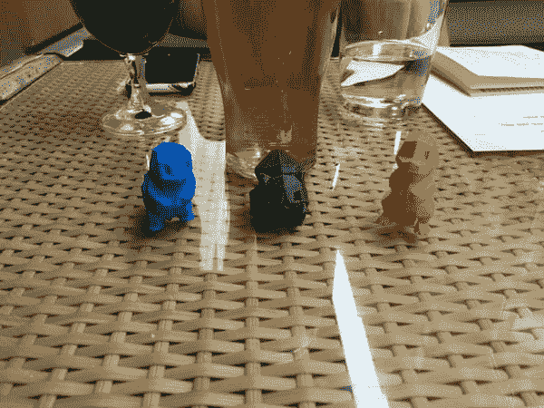
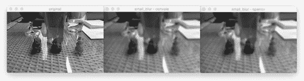
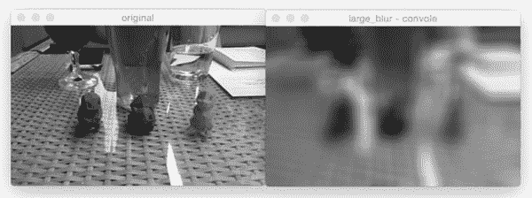
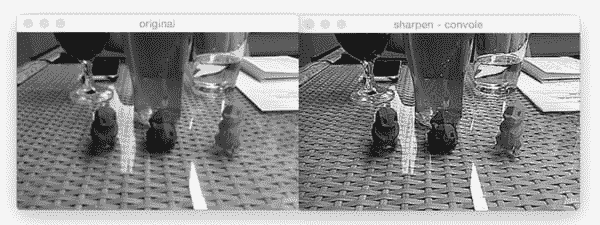
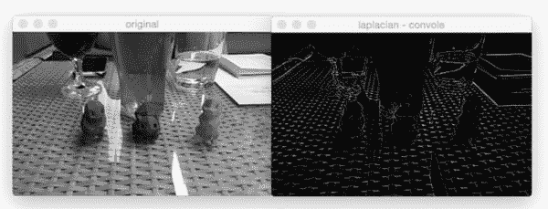
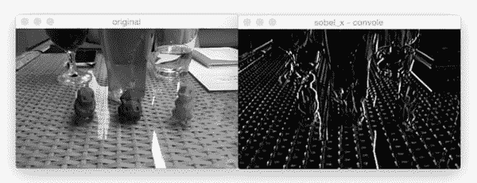

# OpenCV 和 Python 的卷积

> 原文：<https://pyimagesearch.com/2016/07/25/convolutions-with-opencv-and-python/>

我将通过问一系列问题来开始今天的博文，这些问题将在本教程的后面部分讨论:

*   什么是图像卷积？
*   他们做什么？
*   为什么我们要使用它们？
*   我们如何应用它们？
*   **而卷积在深度学习中起到什么作用？**


“卷积”这个词听起来像是一个奇特而复杂的术语，但事实并非如此。事实上，如果你以前曾经使用过计算机视觉、图像处理或 OpenCV，无论你是否意识到，你都已经*应用过*卷积、*应用过**！***

曾经应用过*模糊*或者*平滑吗？*是的，这是一个卷积。

*边缘检测呢？*没错，卷积。

有没有打开 Photoshop 或者 GIMP 来*锐化图像？*你猜对了——卷积。

卷积是计算机视觉和图像处理中最关键、最基本的构建模块之一。但这个词本身往往会吓跑人们——事实上，从表面上看，这个词甚至似乎有负面的含义。

相信我，回旋一点也不可怕。它们其实很容易理解。

实际上，一个(image) ***卷积就是两个矩阵按元素相乘，然后求和。***

说真的。就是这样。*你刚刚学了什么是卷积:*

1.  取两个矩阵(都有相同的维数)。
2.  将它们逐个元素相乘(即，*不是*的点积，只是一个简单的乘法)。
3.  将元素加在一起。

要了解更多关于卷积的知识，我们为什么使用它们，如何应用它们，以及它们在深度学习中发挥的 ***整体作用+图像分类*** ，一定要继续阅读这篇帖子。

## OpenCV 和 Python 的卷积

可以这样想——图像只是一个*多维矩阵*。我们的图像有一个宽度(列数)和一个高度(行数)，就像一个矩阵。

但与你在小学时可能接触过的传统矩阵不同，图像也有深度(T1)——图像中 T2 通道的数量(T3)。对于标准的 RGB 图像，我们有一个深度为 *3* 的通道，分别对应红色、绿色和蓝色通道的*和*。

有了这些知识，我们可以将图像想象成一个 ***大矩阵*** 和*内核*或*卷积矩阵*作为一个 ***小矩阵*** ，用于模糊、锐化、边缘检测和其他图像处理功能。

本质上，这个*小*内核位于*大*图像的顶部，从左到右和从上到下滑动，在原始图像的每个 *(x，y)*-坐标处应用数学运算(即*卷积*)。

手工定义内核来获得各种图像处理功能是很正常的。事实上，你可能已经熟悉模糊(平均平滑，高斯平滑，中值平滑等)。)、边缘检测(拉普拉斯、索贝尔、沙尔、普鲁伊特等。)，以及锐化— *所有这些操作*都是手工定义内核的形式，是*专门设计的*来执行特定的功能。

这就提出了一个问题，*有没有办法让**自动学习这些类型的过滤器？*****甚至使用这些滤镜进行*图像分类*和*物体检测？***

 **当然有。

但是在我们到达那里之前，我们需要多理解一些内核和卷积。

### 核心

同样，让我们把一个图像想象成一个 ***大矩阵*** ，一个内核想象成 ***小矩阵*** (至少相对于原始的“大矩阵”图像而言):

如上图所示，我们沿着原始图像从左到右和从上到下滑动内核。

在原始图像的每个 *(x，y)*-坐标处，我们停下来检查位于图像核的 ***中心*** 的像素邻域。然后我们取这个像素邻域，用内核对它们进行卷积，并获得一个输出值。然后，该输出值存储在输出图像中与内核中心相同的 *(x，y)*-坐标处。

如果这听起来令人困惑，不要担心，我们将在这篇博文的*“理解图像卷积”*部分回顾一个例子。

但是在我们深入一个例子之前，让我们先来看看内核是什么样子的:

上面我们定义了一个正方形的 *3 x 3* 内核(猜猜这个内核是做什么用的？)

内核可以是任意大小的 *M x N* 像素，前提是**两个** *M* 和 *N* 都是 ***奇数。***

***注意:**你通常看到的大多数内核实际上是 N×N 的方阵。*

我们使用一个奇数的内核大小来确保在图像的中心有一个有效的整数 *(x，y)*-坐标:

在*左边*，我们有一个*3×3*矩阵。矩阵的中心显然位于 *x=1，y=1* ，这里矩阵的左上角作为原点，我们的坐标是零索引的。

但是在右边的*上*，我们有一个*2×2*矩阵。这个矩阵的中心将位于 *x=0.5，y=0.5* 。但是我们知道，没有应用插值，就没有像素位置 *(0.5，0.5)*——我们的像素坐标必须是整数！这就是为什么我们使用奇数*内核大小的原因——以确保在内核的中心有一个有效的 *(x，y)* 坐标。*

 *### 理解图像卷积

现在我们已经讨论了内核的基础知识，让我们来谈谈一个叫做*卷积的数学术语。*

在图像处理中，卷积需要三个分量:

1.  输入图像。
2.  我们将应用于输入图像的核矩阵。
3.  输出图像，用于存储与内核卷积的输入图像的输出。

卷积本身其实很容易。我们需要做的就是:

1.  从原始图像中选择一个 *(x，y)*-坐标。
2.  将内核的**中心**放在这个 *(x，y)* 坐标上。
3.  对输入图像区域和内核进行逐元素乘法运算，然后将这些乘法运算的值相加为单个值。这些乘法的总和被称为**内核输出**。
4.  使用相同的 *(x，y)*-来自**步骤#1** 的坐标，但是这次，将内核输出存储在与输出图像相同的 *(x，y)*-位置。

下面你可以找到一个卷积(数学上表示为 *"*"* 运算符)图像的 *3 x 3* 区域的例子，其中 *3 x 3* 内核用于模糊:

因此，

在应用这个卷积之后，我们将把位于输出图像 *O* 的坐标 *(i，j)* 处的像素设置为 *O_i，j = 126。*

这就是全部了！

卷积是内核和内核覆盖的输入图像的邻域之间的元素矩阵乘法的总和。

### 用 OpenCV 和 Python 实现卷积

讨论内核和卷积很有趣——但是现在让我们继续看一些实际的代码，以确保您*理解*内核和卷积是如何实现的。这个源代码也将帮助你理解如何*应用图像卷积。*

打开一个新文件，命名为`convolutions.py`，让我们开始工作:

```py
# import the necessary packages
from skimage.exposure import rescale_intensity
import numpy as np
import argparse
import cv2

```

我们从第 2-5 行的**开始，导入我们需要的 Python 包。你应该已经在你的系统上安装了 NumPy 和 OpenCV，但是你可能没有安装 [scikit-image](http://scikit-image.org/) 。要安装 scikit-image，只需使用`pip`:**

```py
$ pip install -U scikit-image

```

接下来，我们可以开始定义我们的自定义`convolve`方法:

```py
def convolve(image, kernel):
	# grab the spatial dimensions of the image, along with
	# the spatial dimensions of the kernel
	(iH, iW) = image.shape[:2]
	(kH, kW) = kernel.shape[:2]

	# allocate memory for the output image, taking care to
	# "pad" the borders of the input image so the spatial
	# size (i.e., width and height) are not reduced
	pad = (kW - 1) // 2
	image = cv2.copyMakeBorder(image, pad, pad, pad, pad,
		cv2.BORDER_REPLICATE)
	output = np.zeros((iH, iW), dtype="float32")

```

`convolve`函数需要两个参数:我们希望与`kernel`卷积的(灰度)`image`。

给定我们的`image`和`kernel`(我们假设它们是 NumPy 数组)，然后我们确定每个(**第 10 行和第 11 行**)的空间维度(即宽度和高度)。

在我们继续之前，重要的是要理解在图像上“滑动”卷积矩阵、应用卷积、然后存储输出的过程实际上会*减少*我们输出图像的空间维度。

这是为什么呢？

回想一下，我们将计算“集中”在中心 *(x，y)*-内核当前所在的输入图像的坐标。*这意味着对于落在图像边缘的像素来说，没有所谓的“中心”像素。*空间维度的减少只是对图像应用卷积的副作用。有时这种效果是理想的，有时不是，这完全取决于你的应用。

然而，在大多数情况下，我们希望我们的*输出图像*具有与我们的*输入图像*相同的*尺寸*。为了确保这一点，我们应用了****(**第 16-19 行**)。在这里，我们只是沿着图像的边界复制像素，这样输出图像将匹配输入图像的尺寸。****

 ****还存在其他填充方法，包括*零填充*(用零填充边界——在构建卷积神经网络时非常常见)和*环绕*(通过检查图像的另一端来确定边界像素)。在大多数情况下，您会看到复制或零填充。

我们现在准备将实际卷积应用于我们的图像:

```py
	# loop over the input image, "sliding" the kernel across
	# each (x, y)-coordinate from left-to-right and top to
	# bottom
	for y in np.arange(pad, iH + pad):
		for x in np.arange(pad, iW + pad):
			# extract the ROI of the image by extracting the
			# *center* region of the current (x, y)-coordinates
			# dimensions
			roi = image[y - pad:y + pad + 1, x - pad:x + pad + 1]

			# perform the actual convolution by taking the
			# element-wise multiplicate between the ROI and
			# the kernel, then summing the matrix
			k = (roi * kernel).sum()

			# store the convolved value in the output (x,y)-
			# coordinate of the output image
			output[y - pad, x - pad] = k

```

**第 24 行和第 25 行**在我们的`image`上循环，从左到右和从上到下一次“滑动”内核一个像素。

**第 29 行**使用 NumPy 数组切片从`image`中提取感兴趣区域(ROI)。`roi`将以`image`的当前 *(x，y)* 坐标为中心。`roi`也将和我们的`kernel`一样大，这对下一步至关重要。

通过在`roi`和`kernel`之间进行逐元素乘法，接着对矩阵中的条目求和，在**行 34** 上执行卷积。

输出值`k`然后被存储在`output`数组中相同的 *(x，y)*-坐标(相对于输入图像)。

我们现在可以完成我们的`convolve`方法了:

```py
	# rescale the output image to be in the range [0, 255]
	output = rescale_intensity(output, in_range=(0, 255))
	output = (output * 255).astype("uint8")

	# return the output image
	return output

```

当处理图像时，我们通常处理落在范围*【0，255】*内的像素值。然而，当应用卷积时，我们可以很容易地获得*在*这个范围之外的值。

为了将我们的`output`图像带回到*【0，255】*范围内，我们应用了 scikit-image 的`rescale_intensity`函数( **Line 41** )。我们还在第 42 行将我们的图像转换回无符号的 8 位整数数据类型(以前，`output`图像是浮点类型，以便处理范围*【0，255】*之外的像素值)。

最后，`output`图像返回到**线 45** 上的调用函数。

现在我们已经定义了我们的`convolve`函数，让我们继续脚本的驱动程序部分。我们程序的这一部分将处理命令行参数的解析，定义一系列我们将应用于图像的内核，然后显示输出结果:

```py
# construct the argument parse and parse the arguments
ap = argparse.ArgumentParser()
ap.add_argument("-i", "--image", required=True,
	help="path to the input image")
args = vars(ap.parse_args())

# construct average blurring kernels used to smooth an image
smallBlur = np.ones((7, 7), dtype="float") * (1.0 / (7 * 7))
largeBlur = np.ones((21, 21), dtype="float") * (1.0 / (21 * 21))

# construct a sharpening filter
sharpen = np.array((
	[0, -1, 0],
	[-1, 5, -1],
	[0, -1, 0]), dtype="int")

```

**第 48-51 行**处理解析我们的命令行参数。这里我们只需要一个参数，`--image`，它是我们输入路径的路径。

然后我们继续到第 54 行和第 55 行，它们定义了一个用于模糊/平滑图像的 T2 7×7 内核和 T4 21×21 内核。内核越大，图像越模糊。检查这个内核，您可以看到将内核应用到 ROI 的输出就是输入区域的平均*。*

 *我们在**线 58-61** 上定义了一个*锐化内核*，用来增强图像的线条结构和其他细节。详细解释这些内核超出了本教程的范围，所以如果你有兴趣学习更多关于内核构造的知识，我建议[从这里](https://en.wikipedia.org/wiki/Kernel_(image_processing))开始，然后在 Setosa.io 上使用[优秀的内核可视化工具。](http://setosa.io/ev/image-kernels/)

让我们再定义几个内核:

```py
# construct the Laplacian kernel used to detect edge-like
# regions of an image
laplacian = np.array((
	[0, 1, 0],
	[1, -4, 1],
	[0, 1, 0]), dtype="int")

# construct the Sobel x-axis kernel
sobelX = np.array((
	[-1, 0, 1],
	[-2, 0, 2],
	[-1, 0, 1]), dtype="int")

# construct the Sobel y-axis kernel
sobelY = np.array((
	[-1, -2, -1],
	[0, 0, 0],
	[1, 2, 1]), dtype="int")

```

**第 65-68 行**定义了一个[拉普拉斯算子](http://docs.opencv.org/2.4/doc/tutorials/imgproc/imgtrans/laplace_operator/laplace_operator.html)，其可以用作边缘检测的一种形式。

***注:**拉普拉斯算子对于[检测图像中的模糊](https://pyimagesearch.com/2015/09/07/blur-detection-with-opencv/)也非常有用。*

最后，我们将在第 71-80 行的**上定义两个[索贝尔滤波器](https://en.wikipedia.org/wiki/Sobel_operator)。第一个(**线 71-74** )用于检测图像梯度中的*垂直变化*。类似地，**行 77-80** 构造了一个用于检测渐变中*水平变化* 的滤波器。**

给定所有这些内核，我们将它们集合成一组元组，称为“内核库”:

```py
# construct the kernel bank, a list of kernels we're going
# to apply using both our custom `convole` function and
# OpenCV's `filter2D` function
kernelBank = (
	("small_blur", smallBlur),
	("large_blur", largeBlur),
	("sharpen", sharpen),
	("laplacian", laplacian),
	("sobel_x", sobelX),
	("sobel_y", sobelY)
)

```

最后，我们准备将我们的`kernelBank`应用到我们的`--input`图像:

```py
# load the input image and convert it to grayscale
image = cv2.imread(args["image"])
gray = cv2.cvtColor(image, cv2.COLOR_BGR2GRAY)

# loop over the kernels
for (kernelName, kernel) in kernelBank:
	# apply the kernel to the grayscale image using both
	# our custom `convole` function and OpenCV's `filter2D`
	# function
	print("[INFO] applying {} kernel".format(kernelName))
	convoleOutput = convolve(gray, kernel)
	opencvOutput = cv2.filter2D(gray, -1, kernel)

	# show the output images
	cv2.imshow("original", gray)
	cv2.imshow("{} - convole".format(kernelName), convoleOutput)
	cv2.imshow("{} - opencv".format(kernelName), opencvOutput)
	cv2.waitKey(0)
	cv2.destroyAllWindows()

```

第 95 行和第 96 行从磁盘加载我们的图像，并将其转换为灰度。卷积运算符当然可以应用于 RGB(或其他多通道图像)，但为了本文的简单起见，我们将只对灰度图像应用滤镜。

我们开始在第 99 行**的`kernelBank`中循环我们的内核集，然后通过调用我们之前定义的自定义`convolve`方法，将当前的`kernel`应用到第**行 104** 的`gray`图像。**

作为健全性检查，我们也调用`cv2.filter2D`，它也将我们的`kernel`应用到`gray`图像。`cv2.filter2D`函数是我们的`convolve`函数的一个*更加*优化的版本。我在这篇博文中包含了`convolve`的实现，主要是为了让你更好地理解卷积是如何工作的。

最后，**行 108-112** 向我们的屏幕显示输出图像。

### OpenCV 和 Python 的卷积示例

今天的例子图片来自我几周前在康涅狄格州南诺沃克我最喜欢的酒吧拍摄的一张照片。在这张图片中，你会看到一杯我最喜欢的啤酒(Smuttynose Findest Kind IPA)和三个 3D 打印的口袋妖怪(不幸的是，现在已经关门了):



**Figure 6:** The example image we are going to apply our convolutions to.

要运行我们的脚本，只需发出以下命令:

```py
$ python convolutions.py --image 3d_pokemon.png

```

然后你会看到将我们的`smallBlur`内核应用到输入图像的结果:



**Figure 7:** Applying a small blur convolution with our *“convolve”* function and then validating it against the results of OpenCV’s *“cv2.filter2D”* function.

左边的*，*是我们最初的图像。然后在*中心*我们得到了来自`convolve`函数的结果。而在*右边的*，则是来自`cv2.filter2D`的结果。如结果所示，我们的输出与`cv2.filter2D`匹配，这表明我们的`convolve`功能工作正常。此外，由于平滑内核，我们的原始图像现在显得“模糊”和“平滑”。

接下来，让我们应用一个更大的模糊:



**Figure 8:** As we convolve our image with a larger smoothing kernel, our image becomes more blurred.

比较**图 7** 和**图 8** ，注意当平均内核*的大小增加*时，输出图像*中的模糊量也增加*。

我们也可以提升我们的形象:



**Figure 9:** Using a sharpening kernel enhances edge-like structures and other details in our image.

让我们使用拉普拉斯算子来计算边:



**Figure 10:** Applying the Laplacian operator via convolution with OpenCV and Python.

使用 Sobel 算子查找垂直边:



**Figure 11:** Utilizing the Sobel-x kernel to find vertical images.

并使用 Sobel 找到水平边缘:


**Figure 12:** Finding horizontal gradients in an image using the Sobel-y operator and convolutions.

### 卷积在深度学习中的作用

正如你从这篇博客文章中收集到的，我们必须*手动定义*我们的每个内核来应用各种操作，比如平滑、锐化和边缘检测。

这一切都很好，**但是如果有一种方法可以让*学习*这些过滤器呢？**有没有可能定义一种机器学习算法，可以看图像，最终学习这些类型的算子？

事实上，有——这些类型的算法是*神经网络*的一个子类型，称为*卷积神经网络*(CNN)。通过应用卷积滤波器、非线性激活函数、池化和反向传播，CNN 能够学习能够在网络的较低层中检测边缘和斑点状结构的滤波器——然后使用边缘和结构作为构建块，最终检测较高层的对象(例如，脸、猫、狗、杯子等)。)在网络的更深层。

CNN 是如何做到这一点的？

我会展示给你看——但是要等到我们介绍了足够多的基础知识之后，再看另外几篇博文。

## 摘要

在今天的博文中，我们讨论了*图像内核*和*卷积*。如果我们把图像想象成一个*大矩阵*，那么图像内核就是位于图像顶部的一个*小矩阵*。

然后这个内核从左到右和从上到下滑动，计算输入图像和内核之间的元素乘法之和——我们把这个值称为*内核输出*。然后将内核输出存储在与输入图像相同的 *(x，y)*-坐标处的输出图像中(在考虑任何填充以确保输出图像与输入图像具有相同的尺寸之后)。

鉴于我们新发现的卷积知识，我们定义了一个 OpenCV 和 Python 函数来将一系列内核应用于图像。这些运算符允许我们模糊图像、锐化图像并检测边缘。

最后，我们简要讨论了内核/卷积在深度学习中扮演的角色，特别是*卷积神经网络*，以及这些过滤器如何能够自动*学习*而不是需要*手动*首先定义它们。

在下周的博文中，**我将向您展示如何使用 Python 从头开始训练您的第一个*T2 卷积神经网络— *请务必使用下面的表格注册 PyImageSearch 时事通讯，以便在博文发布时得到通知！************