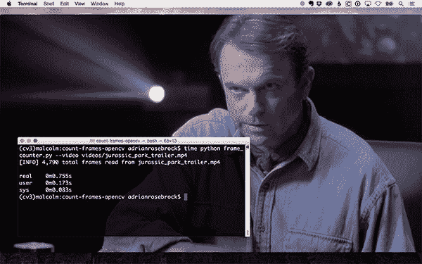

# 用 OpenCV 和 Python 统计一个视频的总帧数

> 原文：<https://pyimagesearch.com/2017/01/09/count-the-total-number-of-frames-in-a-video-with-opencv-and-python/>



今天的博客文章是关于使用 OpenCV 和 Python 处理视频文件的两部分系列文章的一部分。

本系列的第一部分将关注 PyImageSearch 读者 Alex 发来的一个问题。

亚历克斯问道:

> 我需要用 OpenCV 计算一个视频文件的总帧数。我发现做到这一点的唯一方法是单独循环视频文件中的每一帧，并递增一个计数器。有更快的方法吗？

问得好，亚历克斯。

请放心，你不是第一个问我这个问题的人。

在这篇博文的剩余部分，我将向你展示如何定义一个函数，它可以*快速确定一个视频文件中的总帧数。*

 *下周我们将使用这个函数来帮助我们完成一个有趣的可视化任务，我将演示如何创建“电影条形码”。为了生成这些电影条形码，我们首先需要知道在我们的输入电影文件中有多少帧。

**要了解更多关于 OpenCV 和 Python 快速高效的帧计数，*请继续阅读。***

## 用 OpenCV 和 Python 统计一个视频的总帧数

使用 OpenCV 和 Python 有两种方法可以确定视频文件中的总帧数:

1.  **方法#1:** 利用 OpenCV 的内置属性，我们可以快速、高效地访问视频文件的元信息，并返回总帧数。
2.  **方法#2:** 这种缓慢、低效的技术需要我们手动*循环每一帧，并为我们读取的每一帧递增一个计数器。*

 *方法#1 显然是理想的。

我们所需要做的就是打开一个指向视频文件的指针，告诉 OpenCV 我们对哪个元属性感兴趣，并获得返回值。

没有手动循环帧。

没有浪费 CPU 周期解码帧。

…但是，我相信你已经意识到这里面有一个圈套。

这里的问题是，基于你的 OpenCV 版本和安装的视频编解码器，方法#1 是错误的。

你会发现有些情况下，视频指针*上的`.get`和`.set`方法中的*超过一半*根本不起作用*。在这种情况下，我们不可避免地要回到方法 2。

那么，有没有办法把这些方法的两个封装成一个函数呢？

你打赌有。

我已经在 imutils 库中实现了 [count_frames 函数，但是为了确保您理解幕后发生的事情，我们今天将在这里回顾整个函数。](https://github.com/jrosebr1/imutils/blob/master/imutils/video/count_frames.py)

### 用 OpenCV 和 Python 计算帧数的简单方法

使用 Python 在 OpenCV 中计数视频帧的第一种方法非常快——它只是使用 OpenCV 提供的内置属性来访问视频文件并读取视频的元信息。

现在让我们来看看这个函数是如何在 imutils 中实现的:

```py
# import the necessary packages
from ..convenience import is_cv3
import cv2

def count_frames(path, override=False):
	# grab a pointer to the video file and initialize the total
	# number of frames read
	video = cv2.VideoCapture(path)
	total = 0

	# if the override flag is passed in, revert to the manual
	# method of counting frames
	if override:
		total = count_frames_manual(video)

```

首先，我们在**第 2 行和第 3 行**导入必要的 Python 包。我们将需要`is_cv3`函数来检查我们正在使用哪个版本的 OpenCV，以及用于实际 OpenCV 绑定的`cv2`。

我们在第 5 条线上的**定义`count_frames`函数。此方法需要一个参数，后跟第二个可选参数:**

*   这是我们的视频文件在磁盘上的路径。
*   `override`:一个布尔标志，用于确定我们是否应该跳过方法#1，直接进入较慢(但保证准确/无错误)的方法#2。

我们调用**行 8** 上的`cv2.VideoCapture`来获得指向实际视频文件的指针，然后初始化视频中的帧数`total`。

然后我们在**第 13 行**做一个检查，看看我们是否应该`override`。如果是这样，我们调用`count_frames_manual`(我们将在下一节定义它)。

否则，让我们看看方法#1 实际上是如何实现的:

```py
	# otherwise, let's try the fast way first
	else:
		# lets try to determine the number of frames in a video
		# via video properties; this method can be very buggy
		# and might throw an error based on your OpenCV version
		# or may fail entirely based on your which video codecs
		# you have installed
		try:
			# check if we are using OpenCV 3
			if is_cv3():
				total = int(video.get(cv2.CAP_PROP_FRAME_COUNT))

			# otherwise, we are using OpenCV 2.4
			else:
				total = int(video.get(cv2.cv.CV_CAP_PROP_FRAME_COUNT))

		# uh-oh, we got an error -- revert to counting manually
		except:
			total = count_frames_manual(video)

	# release the video file pointer
	video.release()

	# return the total number of frames in the video
	return total

```

为了通过 OpenCV 提供的 API 来确定视频文件中的帧数，我们需要利用所谓的**属性*，或者 OpenCV 所谓的`CAP_PROP`——任何时候你看到一个以`CAP_PROP_*`开头的常数，你都应该知道它与视频处理有关。*

 *在 ***OpenCV 3*** 中，帧数属性名为`cv2.CAP_PROP_FRAME_COUNT`，而在 ***OpenCV 2.4*** 中，该属性名为`cv2.cv.CV_CAP_PROP_FRAME_COUNT`。

理想情况下，将各自的属性名传递给`video`指针的`.get`方法将允许我们获得视频中的总帧数(**第 25-30 行**)。

但是，根据您的特定 OpenCV 安装和视频编解码器，在某些情况下这种方法会失败。

如果是这种情况，我们已经用一个`try/except`块包装了我们的关键代码段。如果出现异常，我们只需恢复手动计数帧数(**第 33 行和第 34 行**)。

最后，我们释放视频文件指针(**行 37** )并将总帧数返回给调用函数(**行 40** )。

### 用 OpenCV 和 Python 计算帧数的慢方法

我们已经看到了在视频中计算帧数的快速有效的方法——现在让我们来看看称为`count_frames_manual`的较慢的方法。

```py
# import the necessary packages
from ..convenience import is_cv3
import cv2

def count_frames(path, override=False):
	# grab a pointer to the video file and initialize the total
	# number of frames read
	video = cv2.VideoCapture(path)
	total = 0

	# if the override flag is passed in, revert to the manual
	# method of counting frames
	if override:
		total = count_frames_manual(video)

	# otherwise, let's try the fast way first
	else:
		# lets try to determine the number of frames in a video
		# via video properties; this method can be very buggy
		# and might throw an error based on your OpenCV version
		# or may fail entirely based on your which video codecs
		# you have installed
		try:
			# check if we are using OpenCV 3
			if is_cv3():
				total = int(video.get(cv2.CAP_PROP_FRAME_COUNT))

			# otherwise, we are using OpenCV 2.4
			else:
				total = int(video.get(cv2.cv.CV_CAP_PROP_FRAME_COUNT))

		# uh-oh, we got an error -- revert to counting manually
		except:
			total = count_frames_manual(video)

	# release the video file pointer
	video.release()

	# return the total number of frames in the video
	return total

def count_frames_manual(video):
	# initialize the total number of frames read
	total = 0

	# loop over the frames of the video
	while True:
		# grab the current frame
		(grabbed, frame) = video.read()

		# check to see if we have reached the end of the
		# video
		if not grabbed:
			break

		# increment the total number of frames read
		total += 1

	# return the total number of frames in the video file
	return total

```

正如我们所见，`count_frames_manual`只需要一个参数，`video`，我们假设它是一个由`cv2.VideoCapture`实例化的指针。

然后，我们初始化从`video`文件中读取的总帧数，循环遍历这些帧，直到我们到达视频的末尾，并在此过程中递增`total`计数器。

然后将`total`返回给调用函数。

值得一提的是，这种方法完全准确无误。如果您*确实*得到一个错误，它几乎肯定与您的视频编解码器的问题或视频文件的无效路径有关。

使用该函数时，也可能会返回总共*零*帧。当这种情况发生时，99%的可能性是:

1.  您为`cv2.VideoCapture`提供了无效的路径。
2.  您没有安装正确的视频编解码器，因此 OpenCV 无法读取该文件。如果是这种情况，您需要安装合适的视频编解码器，然后重新编译和安装 OpenCV。

### 用 OpenCV 计算视频文件中的帧数

让我们继续使用我们的`count_frames`方法进行测试。

首先，确保您已经安装了 [imutils 库](https://github.com/jrosebr1/imutils):

```py
$ pip install imutils

```

否则，如果您已经安装了`imutils`，您应该更新到最新版本( *> v0.3.9* ):

```py
$ pip install --upgrade imutils

```

从这里，让我们创建名为`frame_counter.py`的驱动程序脚本:

```py
# import the necessary packages
from imutils.video import count_frames
import argparse
import os

# construct the argument parse and parse the arguments
ap = argparse.ArgumentParser()
ap.add_argument("-v", "--video", required=True,
	help="path to input video file")
ap.add_argument("-o", "--override", type=int, default=-1,
	help="whether to force manual frame count")
args = vars(ap.parse_args())

```

我们从导入所需的 Python 包并解析命令行参数开始。我们需要一个开关，然后是第二个可选开关:

*   `--video`:我们输入视频文件的路径。
*   `--override`:是否强制手动帧数。默认情况下，我们将尝试使用更快的方法#1。

然后我们调用`count_frames`并将结果显示在屏幕上:

```py
# count the total number of frames in the video file
override = False if args["override"] < 0 else True
total = count_frames(args["video"], override=override)

# display the frame count to the terminal
print("[INFO] {:,} total frames read from {}".format(total,
	args["video"][args["video"].rfind(os.path.sep) + 1:]))

```

为了测试这个 Python 脚本，我决定使用我最喜欢的电影*侏罗纪公园的预告片:*

<https://www.youtube.com/embed/lc0UehYemQA?feature=oembed>***