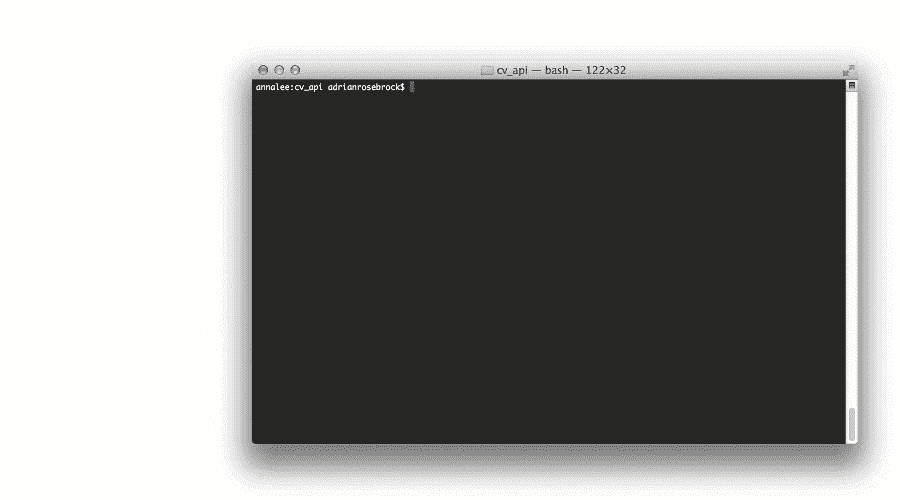
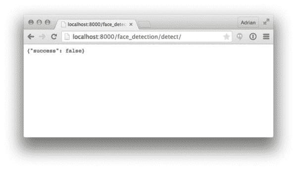
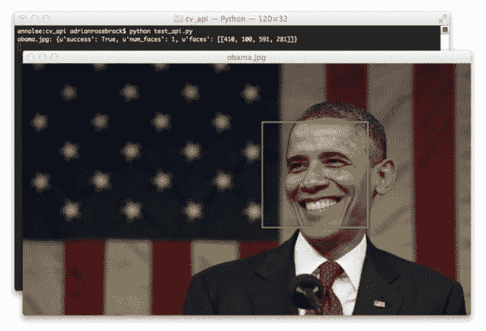
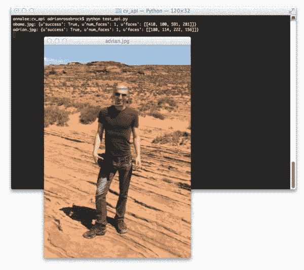
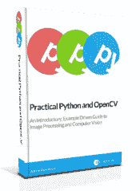

# 用 Python 和 OpenCV 创建人脸检测 API(只需 5 分钟)

> 原文：<https://pyimagesearch.com/2015/05/11/creating-a-face-detection-api-with-python-and-opencv-in-just-5-minutes/>

[](https://pyimagesearch.com/wp-content/uploads/2015/05/face_api_live_example.gif)

所以你刚刚建立了你的第一个了不起的计算机视觉应用程序。

也许它可以检测图像中的人脸。或者你的应用程序可以识别照片中的处方药。或者，也许你的计算机视觉应用程序可以识别畅销书的封面，同时显示最新的读者评论和最便宜的在线购买网站。

所以大问题是… ***你如何把你的计算机视觉 app 包装成一个易于使用的 web API？***

随着越来越多的服务走向云，您的用户、客户和开发伙伴可能希望有一个易于使用的 web API(可能是 JSON 格式)。

创建一个计算机视觉 web API 实际上没有你想象的那么难——我甚至可以说，使用一个 Python web 框架，如 [Django](https://www.djangoproject.com/) 或 [Flask](http://flask.pocoo.org/) ，将你的应用程序包装在一个可消费的 API 中，是一件令人难以置信的简单事情。

就我个人而言，我是姜戈的超级粉丝。过去我和姜戈一起做了大量的工作，我喜欢其中的每一分钟。虽然对于这样一个小的示例项目来说有点大材小用(尤其是与 Flask 这样的微框架相比)，但我仍然认为这是一个极好的选择。当然，您可以随意将这个实现移植到最适合您个人需求和偏好的框架中。

无论如何，在本教程的其余部分，我将演示如何创建自己的**人脸检测 API** 在 ***只有*** ***5 分钟！***

作为本文最后的奖励，我将让您先睹为快下周即将发布的内容——免费的 PyImageSearch web API。

设置你的定时器——准备好。设置。*走！*

**OpenCV 和 Python 版本:**
为了运行这个例子，你需要 **Python 2.7** 和 **OpenCV 2.4.X** 。

# 用 Python 和 OpenCV 创建人脸检测 API(只需 5 分钟)

在关于在你的 Raspberry Pi 2/B+ 上安装 OpenCV 的一步一步的教程上获得了大量令人敬畏的读者反馈后，我决定对本教程采取同样的方法——我已经创建了 8 个简单的、一口大小的步骤来建立和运行你自己的人脸检测 API。

**这里的目标是，如果您要运行下面每个步骤中出现的命令，并将代码片段复制并粘贴到适当的 Django 项目文件中，那么您的人脸检测 API 将在 5 分钟内在您的本地系统上启动并运行。**

然而，我将从假设您已经安装了 [OpenCV](http://opencv.org) 开始。如果没有，那么您需要在继续之前安装它(这将打破这篇文章的 5 分钟目标)。

***免责声明:**在读完博士之前，我曾经做过*很多 web 应用开发的*。但是在过去的三年里，我的注意力完全集中在计算机视觉、科学和研究方面。如果我的 Django 代码不完美，我会第一个道歉。然而，也要意识到本教程的目的并不是使用所有最新的 Django 花里胡哨的东西来构建一个“防弹”API。相反，它旨在简单明了地演示如何轻松地将计算机视觉应用程序(特别是人脸检测器)转化为 web API。*

## 步骤 1:设置您的环境

第一步是安装并运行我们的开发环境。我们只需要三个必需的包:

```py
$ pip install numpy django requests

```

我们需要 [NumPy](http://numpy.org) ，因为 OpenCV 将图像表示为多维 NumPy 数组。从技术上讲，如果你已经安装了 OpenCV，NumPy 应该已经安装了。

`django`包显然包含了 Django web 框架。

我们还将包括使用[请求](http://docs.python-requests.org/en/latest/)包来使与我们的 web API 的接口更加容易。

## 步骤 2:创建我们的 Django 项目

既然安装了先决条件，让我们设置 Django 项目:

```py
$ django-admin startproject cv_api
$ cd cv_api

```

这些命令创建了一个新的 Django 项目，命名为`cv_api`。

`cv_api`目录现在包含了运行 Django 项目所需的所有代码和配置——这些代码是自动生成的，包括基本的数据库配置、基于项目的选项和应用程序设置。它还包括运行内置 web 服务器进行测试的能力(我们将在本教程的后面讨论)。

下面是我们新项目的目录结构:

```py
|--- cv_api
|    |--- cv_api
|        |--- __init__.py
|        |--- settings.py
|        |--- urls.py
|        |--- wsgi.py
|    |--- manage.py

```

在我们继续之前，让我们简单地讨论一下 Django 项目的结构。

Django 项目由多个*应用*组成。Django 框架的核心范例之一是，每个*应用*在任何项目中都应该是*可重用的*(理论上是这样的)——因此，我们(通常)不会将任何特定于应用的代码放在`cv_api`目录中。相反，我们在`cv_api`项目中显式地创建单独的“应用程序”。

记住这一点，让我们创建一个名为`face_detector`的新应用程序，它将包含我们构建人脸检测 API 的代码:

```py
$ python manage.py startapp face_detector

```

注意我们现在在`cv_api`目录中有一个`face_detector`目录。同样，Django 已经为我们的`face_detector`应用程序自动生成了一些样板代码和配置，我们可以看到下面的内容:

```py
|--- cv_api
|    |--- cv_api
|        |--- __init__.py
|        |--- settings.py
|        |--- urls.py
|        |--- wsgi.py
|    |--- face_detector
|        |--- __init__.py
|        |--- admin.py
|        |--- migrations
|        |--- models.py
|        |--- tests.py
|        |--- views.py
|    |--- manage.py

```

现在我们的 Django 项目已经设置好了，我们可以开始编码了。

## 步骤 3:我的个人计算机视觉 API 模板

这一步是我们的计算机视觉项目实际“包装”的地方，也是我们将要插入面部检测代码的地方。

Django 框架是一种[模型-视图-模板](https://docs.djangoproject.com/en/1.8/faq/general/#django-appears-to-be-a-mvc-framework-but-you-call-the-controller-the-view-and-the-view-the-template-how-come-you-don-t-use-the-standard-names) (MVT)框架，类似于[模型-视图-控制器](http://en.wikipedia.org/wiki/Model%E2%80%93view%E2%80%93controller)，其中“视图”可以被认为是一种网页。在视图中，您放置了与模型交互的所有必要代码，比如从数据库中提取数据，并对其进行处理。视图还负责在将模板发送给用户之前填充模板。

在我们的例子中，我们需要的只是框架的视图部分。我们不会与数据库进行交互，因此模型与我们无关。我们将把 API 的结果作为 JSON 对象发送给最终用户，因此我们不需要模板来呈现任何 HTML。

同样，我们的 API 只是接受来自 URL/流的图像，对其进行处理，并返回一个 JSON 响应。

### 步骤 3a:构建 Python + OpenCV API 时我的个人样板模板

在我们深入代码执行实际的人脸检测之前，我想与您分享我在构建 Python + OpenCV 时的*个人*样板模板。当您构建自己的计算机视觉 API 时，可以使用此代码作为起点。

```py
# import the necessary packages
from django.views.decorators.csrf import csrf_exempt
from django.http import JsonResponse
import numpy as np
import urllib
import json
import cv2

@csrf_exempt
def detect(request):
	# initialize the data dictionary to be returned by the request
	data = {"success": False}

	# check to see if this is a post request
	if request.method == "POST":
		# check to see if an image was uploaded
		if request.FILES.get("image", None) is not None:
			# grab the uploaded image
			image = _grab_image(stream=request.FILES["image"])

		# otherwise, assume that a URL was passed in
		else:
			# grab the URL from the request
			url = request.POST.get("url", None)

			# if the URL is None, then return an error
			if url is None:
				data["error"] = "No URL provided."
				return JsonResponse(data)

			# load the image and convert
			image = _grab_image(url=url)

		### START WRAPPING OF COMPUTER VISION APP
		# Insert code here to process the image and update
		# the `data` dictionary with your results
		### END WRAPPING OF COMPUTER VISION APP

		# update the data dictionary
		data["success"] = True

	# return a JSON response
	return JsonResponse(data)

def _grab_image(path=None, stream=None, url=None):
	# if the path is not None, then load the image from disk
	if path is not None:
		image = cv2.imread(path)

	# otherwise, the image does not reside on disk
	else:	
		# if the URL is not None, then download the image
		if url is not None:
			resp = urllib.urlopen(url)
			data = resp.read()

		# if the stream is not None, then the image has been uploaded
		elif stream is not None:
			data = stream.read()

		# convert the image to a NumPy array and then read it into
		# OpenCV format
		image = np.asarray(bytearray(data), dtype="uint8")
		image = cv2.imdecode(image, cv2.IMREAD_COLOR)

	# return the image
	return image

```

这个样板 API 代码定义了两个函数:`detect`，这是我们的实际视图，和`_grab_image`，这是一个很好的小函数，用于将图像从磁盘、URL 或流中读入 OpenCV 格式。从代码组织和可重用性的角度来看，您可能希望将*_grab_image*函数放在一个“utilities”模块中，该模块在整个 Django 项目中是全局可访问的。但是为了完整起见，我在`views.py`文件中包含了`_grab_image`函数——至于您想在哪里存储这个函数，我将由个人决定。

我们的大部分时间应该花在检查`detect`方法上。实际上，您可以随意调用这个方法，但是您可能希望这个名称与函数要实现的目标相关。在人脸检测的背景下，在`face_detection` Django 应用中将主 API 端点命名为`detect`似乎是合适的。

`detect`方法接受一个参数，一个`request`，它是一个 Django 对象，包含与 web 请求密切相关的属性。

在实际视图中，我喜欢定义一个`data`字典。这个字典表示所有将被 JSON 化并返回给用户的数据。最起码，这本字典应该包括一个成功/失败标志。

从那里，我们需要处理实际的`request`,并确定图像是如何发送到我们的 API 的。

如果我们的图像是通过多部分表单数据上传的，我们可以简单地直接处理数据流并将其读入 OpenCV 格式(**第 17-19 行**)。

否则，我们将假设不是上传原始图像，而是将指向图像的 URL 传递到我们的 API 中。在这种情况下，我们将从 URL 读取图像并转换成 OpenCV 格式(**第 22-32 行**)。

**第 34-37 行**是你实际“包装”你的计算机视觉应用的地方。在这里，您可以插入任何与处理、操作、分类等相关的代码。你的形象。您还需要用任何与图像处理结果相关的信息来更新您的`data`字典。

最后，在所有的图像处理完成后，我们在第 43 行的**上向用户发送一个`data`的 JSON 响应。**

## 步骤 4:将人脸检测器插入我的模板 API

既然我们已经检查了 Python + OpenCV web API 的样板代码，让我们把它插入人脸检测器。打开`cv_api/face_detector/views.py`文件并插入以下代码:

```py
# import the necessary packages
from django.views.decorators.csrf import csrf_exempt
from django.http import JsonResponse
import numpy as np
import urllib
import json
import cv2
import os

# define the path to the face detector
FACE_DETECTOR_PATH = "{base_path}/cascades/haarcascade_frontalface_default.xml".format(
	base_path=os.path.abspath(os.path.dirname(__file__)))

@csrf_exempt
def detect(request):
	# initialize the data dictionary to be returned by the request
	data = {"success": False}

	# check to see if this is a post request
	if request.method == "POST":
		# check to see if an image was uploaded
		if request.FILES.get("image", None) is not None:
			# grab the uploaded image
			image = _grab_image(stream=request.FILES["image"])

		# otherwise, assume that a URL was passed in
		else:
			# grab the URL from the request
			url = request.POST.get("url", None)

			# if the URL is None, then return an error
			if url is None:
				data["error"] = "No URL provided."
				return JsonResponse(data)

			# load the image and convert
			image = _grab_image(url=url)

		# convert the image to grayscale, load the face cascade detector,
		# and detect faces in the image
		image = cv2.cvtColor(image, cv2.COLOR_BGR2GRAY)
		detector = cv2.CascadeClassifier(FACE_DETECTOR_PATH)
		rects = detector.detectMultiScale(image, scaleFactor=1.1, minNeighbors=5,
			minSize=(30, 30), flags=cv2.cv.CV_HAAR_SCALE_IMAGE)

		# construct a list of bounding boxes from the detection
		rects = [(int(x), int(y), int(x + w), int(y + h)) for (x, y, w, h) in rects]

		# update the data dictionary with the faces detected
		data.update({"num_faces": len(rects), "faces": rects, "success": True})

	# return a JSON response
	return JsonResponse(data)

def _grab_image(path=None, stream=None, url=None):
	# if the path is not None, then load the image from disk
	if path is not None:
		image = cv2.imread(path)

	# otherwise, the image does not reside on disk
	else:	
		# if the URL is not None, then download the image
		if url is not None:
			resp = urllib.urlopen(url)
			data = resp.read()

		# if the stream is not None, then the image has been uploaded
		elif stream is not None:
			data = stream.read()

		# convert the image to a NumPy array and then read it into
		# OpenCV format
		image = np.asarray(bytearray(data), dtype="uint8")
		image = cv2.imdecode(image, cv2.IMREAD_COLOR)

	# return the image
	return image

```

如您所见，除了标准的样板 OpenCV API 模板，我们没有插入太多代码。

您会注意到的第一件事是，我正在定义`FACE_DETECTOR_PATH` ( **第 11 行和第 12 行**)，它只是预训练的 OpenCV 人脸检测器所在的路径——在本例中，我已经将预训练的人脸检测器包含在了`face_detector/cascades`应用程序中。

真正的人脸检测魔术发生在第 41-44 行的**处。**

现在我们已经有了 OpenCV 格式的图像(无论它是通过多部分表单编码数据还是通过 URL 上传的)，我们开始将输入图像转换为灰度。我们丢弃任何颜色信息，因为颜色对人脸检测准确性增加很少。

从那里，我们在**线 42** 上加载我们的面部`detector`，为我们预先训练的面部检测器提供路径。既然我们的人脸检测器已经加载，我们可以应用`detectMultiScale`方法来检测实际的人脸。

我不打算对`detectMultiScale`的参数进行详尽的回顾，因为我在我的书《实用 Python 和 OpenCV +案例研究、中对它们进行了深入的讨论，但是这里重要的一点是，这些参数影响速度、效率和图像中人脸的误报检测率。

`detectMultiScale`函数返回边界框列表，或者简单地返回图像中人脸的 *(x，y)* 坐标、宽度和高度。给定这个边界框列表，我们将它们打包到我们的`data`字典中，并在**的第 47-53 行**将它们发送给用户。

不算太坏，对吧？

如您所见，大部分代码仍然与计算机视觉 API 样板相关——人脸的实际检测只需要几行代码。

## 步骤 5:更新 URL 以包含 API 的端点

但是在我们可以访问我们的人脸检测 API 之前，我们首先需要更新项目 URL 以包含我们的人脸检测端点。

只需打开`cv_api/cv_api/urls.py`文件，并将其更新为包含一个指向我们的人脸检测视图的 URL 端点:

```py
from django.conf.urls import patterns, include, url
from django.contrib import admin

urlpatterns = patterns('',
    # Examples:

    url(r'^face_detection/detect/$', 'face_detector.views.detect'),

    # url(r'^$', 'cv_api.views.home', name='home'),
    # url(r'^blog/', include('blog.urls')),

    url(r'^admin/', include(admin.site.urls)),
)

```

## 步骤 6:运行 Django 测试服务器

好了，现在我们准备好测试我们的面部检测 API 了！

只需使用您的终端导航回`cv_api`项目根目录并启动测试服务器:

```py
$ python manage.py runserver

```

我们的网络服务器现在在`http://localhost:8000`可用

如果你打开你的网络浏览器并指向`http://localhost:8000/face_detection/detect/`，你应该会看到来自我们的人脸检测 API 的 JSON 响应:

[](https://pyimagesearch.com/wp-content/uploads/2015/05/face_api_browser.jpg)

**Figure 1:** Navigating our browser to the face detection API endpoint.

显然，由于我们没有上传图像到我们的 API，我们得到了一个 JSON 响应`{success: false}`，这意味着在(不存在的)图像中检测不到人脸。

## 步骤 7:通过 cURL 测试人脸检测 API

在我们做任何疯狂的事情之前，让我们用 cURL 测试一下我们的人脸检测。我们首先将巴拉克·奥巴马的这张图片的 URL([https://pyimagesearch . com/WP-content/uploads/2015/05/Obama . jpg](https://pyimagesearch.com/wp-content/uploads/2015/05/obama.jpg))传递到我们的面部检测 API 中:

[](https://pyimagesearch.com/wp-content/uploads/2015/05/obama.jpg)

**Figure 2:** Passing the URL of this Barack Obama image into our face detector API.

让我们构造一个命令，通过 cURL 与我们的人脸检测 API 进行交互:

```py
$ curl -X POST 'http://localhost:8000/face_detection/detect/' -d 'url=https://pyimagesearch.com/wp-content/uploads/2015/05/obama.jpg' ; echo ""
{"num_faces": 1, "success": true, "faces": [[410, 100, 591, 281]]}

```

果然，基于输出，我们能够检测到奥巴马的脸(虽然我们还不能可视化的边界框，我们将在下面的部分)。

让我们试试另一张图片，这次是通过*文件*上传，而不是通过*网址*:

[](https://pyimagesearch.com/wp-content/uploads/2015/05/adrian.jpg)

**Figure 3:** A picture of myself outside Horseshoe Bend, AZ. Will the face detector API be able to detect my face in the image?

同样，我们需要构造 cURL 命令，假设上述文件的名称是`adrian.jpg`:

```py
$ curl -X POST -F image=@adrian.jpg 'http://localhost:8000/face_detection/detect/' ; echo ""
{"num_faces": 1, "success": true, "faces": [[180, 114, 222, 156]]}

```

根据 JSON 的响应，我们确实要检测图像中的人脸。

## 步骤 8:编写一些 Python 代码来与人脸检测 API 进行交互

使用 cURL 测试我们的人脸检测 API 非常简单——但是让我们编写一些实际的 Python 代码，这些代码可以*上传*和*与发送到我们 API 的图像进行交互*。通过这种方式，我们实际上可以*接收 JSON 响应*并*绘制图像中人脸周围的边界框*。

打开一个新文件，将其命名为`test_api.py`，并包含以下代码:

```py
# import the necessary packages
import requests
import cv2

# define the URL to our face detection API
url = "http://localhost:8000/face_detection/detect/"

# use our face detection API to find faces in images via image URL
image = cv2.imread("obama.jpg")
payload = {"url": "https://pyimagesearch.com/wp-content/uploads/2015/05/obama.jpg"}
r = requests.post(url, data=payload).json()
print "obama.jpg: {}".format(r)

# loop over the faces and draw them on the image
for (startX, startY, endX, endY) in r["faces"]:
	cv2.rectangle(image, (startX, startY), (endX, endY), (0, 255, 0), 2)

# show the output image
cv2.imshow("obama.jpg", image)
cv2.waitKey(0)

# load our image and now use the face detection API to find faces in
# images by uploading an image directly
image = cv2.imread("adrian.jpg")
payload = {"image": open("adrian.jpg", "rb")}
r = requests.post(url, files=payload).json()
print "adrian.jpg: {}".format(r)

# loop over the faces and draw them on the image
for (startX, startY, endX, endY) in r["faces"]:
	cv2.rectangle(image, (startX, startY), (endX, endY), (0, 255, 0), 2)

# show the output image
cv2.imshow("adrian.jpg", image)
cv2.waitKey(0)

```

我们将从导入`requests`包开始，以处理从我们的 API 发送和接收数据。我们还将为 OpenCV 绑定导入`cv2`。

从那里，**行 6-20** 处理通过 URL 将图像*上传到我们的人脸检测 API。*

我们所需要做的就是定义一个包含一个`url`键的`payload`字典，对应的值就是上面巴拉克·奥巴马的图片 URL。然后，我们将这个有效负载字典发送到人脸检测端点(**第 6-11 行**)，在这里，我们的 API 用图像中检测到的人脸数量以及人脸的边界框进行响应。最后，我们将边界框画在实际的图像上(**第 15-20 行**)。

我们还将从磁盘上传一张图像到我们的面部检测 API，在**第 24-35 行**。就像通过 URL 上传图像一样，从磁盘上传图像也很简单——我们只需要在调用`requests.post`时指定`files`参数，而不是`data`参数。

要查看我们的脚本运行情况，只需执行以下命令:

```py
$ python test_api.py

```

首先，我们将看到围绕奥巴马的脸绘制的边界框的图像:

[](https://pyimagesearch.com/wp-content/uploads/2015/05/face_detection_requests_obama.jpg)

**Figure 4:** Taking the JSON response from our face detection API and drawing the bounding box around Obama’s face.

接着是成功的检测和包围我的脸的包围盒:

[](https://pyimagesearch.com/wp-content/uploads/2015/05/face_detection_requests_adrian.jpg)

**Figure 5:** Uploading an image from disk to our face detection API — once again, we are able to detect the face and draw the bounding box surrounding it.

显然，我们的人脸检测 API 正在工作！我们能够通过图像文件上传和图像 URL 来利用它。

# 我的图像中没有检测到人脸。怎么回事？

如果你下载了这篇文章的代码，并用你自己的图像试了一下，你可能会遇到在你的图像中检测不到人脸的情况——即使人脸清晰可见。

那么是什么原因呢？

虽然哈尔级联相当快，并且可以获得相当好的精度，但是它们有两个突出的缺点。

第一个是参数调整——你需要调整`detectMultiScale`的参数来获得对许多图像的检测*恰到好处的*。这可能是一种真正的痛苦，尤其是如果您希望批量处理许多图像，并且无法直观地检查每个人脸检测的输出。

哈尔级联的第二个缺点是，它们非常容易出现*假阳性*，这意味着当实际上没有任何人脸时，却检测到了人脸！同样，这个问题可以通过根据具体情况调整`detectMultiScale`的参数来解决。

事实上，哈尔·卡斯卡德和维奥拉·琼斯探测器虽然有效，但已经在计算机视觉史上走完了它们的旅程。对于高度精确的对象检测器，我们现在依赖于 [HOG +线性支持向量机](https://pyimagesearch.com/2014/11/10/histogram-oriented-gradients-object-detection/)和基于深度学习的方法，特别是卷积神经网络。

尽管如此，很难击败哈尔瀑布的纯速度，即使它们的准确性和假阳性率有点低于标准，至少与今天的最先进的技术相比。

# 额外收获:人脸检测 API 的一个实例

想试试人脸检测 API 吗？没问题。

我已经有一个面部检测 API 实例开始运行。您可以在此处找到人脸检测 API 端点:

`http://api.pyimagesearch.com/face_detection/detect/`

这是另一个在图像中检测人脸的例子。只是这次我们使用的是实时 API 端点:

```py
$ curl -X POST 'http://api.pyimagesearch.com/face_detection/detect/' -d 'url=https://pyimagesearch.com/wp-content/uploads/2015/05/obama.jpg' ; echo ""
{"num_faces": 1, "success": true, "faces": [[410, 100, 591, 281]]}

```

所以给定网址[http://api.pyimagesearch.com](http://api.pyimagesearch.com)，我打赌你能猜到下周的公告是什么…但是我会把剩下的留到下周一。

# 摘要

在这篇博文中，我们学习了如何将我们的计算机视觉应用程序包装成一个易于使用和消费的 JSON web API。我们利用 Django web 框架来构建我们的 API，但是我们可以使用任何其他 Python web 框架，比如 Flask——这实际上取决于您的个人偏好以及您希望您的 API 有多简单或高级。

我还分享了我的个人样板 API 代码，你可以用它来包装你自己的计算机视觉应用程序，并使它们适合网络。

最后，我先睹为快下周的大发布——(免费)PyImageSearch API。

# 那么，下一步是什么？

[](https://pyimagesearch.com/wp-content/uploads/2014/02/practicalpythonandopencv_cover.png)

如果你喜欢这篇博文，并且想了解更多关于计算机视觉和 OpenCV 的知识，我肯定会推荐你看一下我的书，《实用 Python 和 OpenCV +案例研究 》。

在我的书中，你将继续学习所有关于图像和视频中的**人脸检测**(包括我在这篇文章前面提到的`detectMultiScale`参数的解释)；**跟踪视频中的物体**；**识别手写数字**，甚至**如何在智能手机的快照中识别图书封面**。

如果你对这些话题感兴趣， ***[一定要看看](https://pyimagesearch.com/practical-python-opencv/?src=sidebar-face-detection)*** 并考虑抓取一个免费的样本章节。