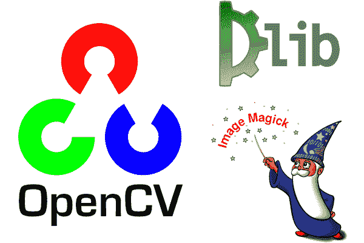
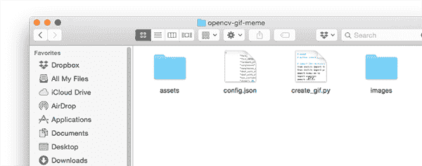
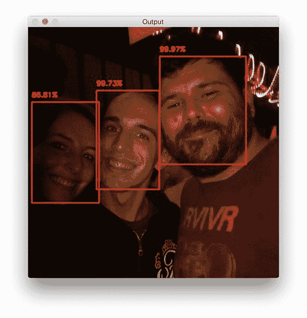

# 用 OpenCV 创建 gif

> 原文：<https://pyimagesearch.com/2018/11/05/creating-gifs-with-opencv/>

在本教程中，您将学习如何使用 OpenCV、Python 和 ImageMagick 创建动画 gif。

然后，您将结合所有这些技术，用 OpenCV 构建一个热图生成器！

我们都需要不时开怀大笑。也许从迷因中找到 LOLs 是最好的方法。

我最喜欢的一些空前的迷因包括:

*   科米蛙的*“但那不关我的事”*
*   暴躁猫
*   严重失败
*   好人格雷格

**但对我个人来说，这些模因都比不上*“处理它”*模因(本文顶部有一个例子)，通常:**

1.  用来回应或反驳某人不同意你做的/说的事情
2.  比如在你离开的时候戴上太阳镜，让他们自己“处理”

几年前，我看到一篇轻松的博文，作者是一个我现在不记得的人，他讲述了如何用计算机视觉生成这些迷因。上周，我在任何地方都找不到这个教程，所以，作为一个博客作者、计算机视觉专家和迷因鉴赏家，我决定创建自己的教程！(顺便说一句，如果你碰巧知道这个想法的原始来源，请告诉我，以便我可以信任作者**更新:**我刚刚发现我想到的原始文章来自柯克·凯撒的博客， [MakeArtWithPython](https://www.makeartwithpython.com/blog/deal-with-it-generator-face-recognition/) )。

使用 OpenCV 与 It 热图生成器建立交易可以教会我们许多在实践中使用的有价值的技术，包括:

1.  如何**进行基于深度学习的人脸检测**
2.  如何使用 dlib 库**应用面部标志检测并提取眼睛区域**
3.  如何取这两个区域并**计算两眼之间的旋转角度**
4.  最后，如何用 OpenCV 生成动画 gif(在 ImageMagick 的帮助下)

今天的教程旨在变得有趣、愉快和有娱乐性——同时教会你在现实世界中使用的有价值的计算机视觉技能。

**要学习如何用 OpenCV 生成 gif 和 memes，*继续阅读！***

## 用 OpenCV 创建 gif

在今天的博文中，我们将使用 OpenCV、dlib 和 ImageMagick 工具箱创建动画 gif。

在教程的第一部分，我们将讨论这个项目的先决条件和依赖项，包括如何正确配置您的开发环境。

从这里我们将回顾 OpenCV GIF 创建器的项目/目录结构。

一旦我们理解了项目结构，我们将回顾(1)我们的配置文件，和(2)我们负责用 OpenCV 创建 gif 的 Python 脚本。

最后，我们将通过为流行的“处理它”模因构建一个热图生成器来看看我们的 OpenCV GIF 创建器的结果。

### 先决条件和依赖项

[](https://pyimagesearch.com/wp-content/uploads/2018/10/opencv_gif_libs.png)

**Figure 1:** To create GIFs with OpenCV we’ll be taking advantage of OpenCV, dlib, and ImageMagick.

#### OpenCV 和 dlib

OpenCV 将用于人脸检测和基本的图像处理。如果您的系统上没有安装 OpenCV，请务必遵循我的 [OpenCV 安装指南](https://pyimagesearch.com/opencv-tutorials-resources-guides/)。

Dlib 将用于检测面部标志，使我们能够找到一张脸的两只眼睛，并降低它们上面的太阳镜。你可以用这个指南来[安装 dlib。](https://pyimagesearch.com/2018/01/22/install-dlib-easy-complete-guide/)

#### 图像魔术

如果你不熟悉 [ImageMagick](https://www.imagemagick.org/script/index.php) ，你应该熟悉。ImageMagick 是一个基于跨平台命令行的工具，提供了相当多的图像处理功能。

想用一个命令把 PNG/JPG 文件转换成 PDF 文件吗？没问题。

有多张图像想转换成 PDF 幻灯片？那很简单。

你需要画多边形、线条和其他形状吗？去吧。

如何在一个命令中批量调整颜色或调整整个图像数据集的空间尺寸？为此编写多行 Python 代码来使用 OpenCV 是没有意义的。

使用 ImageMagick，我们也可以通过一组输入图像生成 GIF 图像。

要在 Ubuntu(或 Raspbian)上安装 ImageMagick，只需使用 apt:

```py
$ sudo apt-get install imagemagick

```

或者，如果你在 macOS 上，你可以使用自制软件:

```py
$ brew install imagemagick

```

#### imutils

我的许多博客文章和书籍/课程内容都利用了我的图像处理便利功能包 [imutils](https://github.com/jrosebr1/imutils) 。您可以使用 pip 在您的系统或虚拟环境中安装 imutils:

```py
$ pip install imutils

```

### 项目结构

[](https://pyimagesearch.com/wp-content/uploads/2018/10/opencv_gif_project_structure.png)

**Figure 2:** Our OpenCV GIF generator project structure consists of two directories, a config file, and a single Python script.

我们的项目有两个目录:

*   `images/`:我们的例子输入我们希望为其创建动画“处理它”GIF 的图像。我提供了一些我的照片，但你可以随意添加自己的照片。
*   `assets/`:该文件夹包含我们的人脸检测器、面部标志检测器和所有图像+关联的遮罩。我们将用这些资产在输入图像上叠加“太阳镜”和“处理它”文本。

由于可配置参数的数量，我决定创建一个 JSON 配置文件(1)使编辑参数更容易，以及(2)需要更少的命令行参数。这个项目需要的所有配置参数都包含在`config.json`中。

今天我们将复习`config.json`和`create_gif.py`。

在今天教程的 ***【下载】*** 部分，你可以破解整个项目！

### 用 OpenCV 生成 gif

让我们开始实现我们的 OpenCV GIF 生成器吧！

#### 理解我们的 JSON 配置文件

我们将首先从 JSON 配置文件开始，然后进入 Python 脚本。

继续打开一个名为`config.json`的新文件，然后插入以下键/值对:

```py
{
	"face_detector_prototxt": "assets/deploy.prototxt",
	"face_detector_weights": "assets/res10_300x300_ssd_iter_140000.caffemodel",
	"landmark_predictor": "assets/shape_predictor_68_face_landmarks.dat",

```

**第 2 行和第 3 行**是 [OpenCV 的深度学习人脸检测器](https://pyimagesearch.com/2018/02/26/face-detection-with-opencv-and-deep-learning/)模型文件。

**第 4 行**是到 [dlib 的面部标志预测器](https://pyimagesearch.com/2017/04/03/facial-landmarks-dlib-opencv-python/)的路径。

现在我们有了一些图像文件路径:

```py
	"sunglasses": "assets/sunglasses.png",
	"sunglasses_mask": "assets/sunglasses_mask.png",
	"deal_with_it": "assets/deal_with_it.png",
	"deal_with_it_mask": "assets/deal_with_it_mask.png",

```

**第 5-8 行**分别是我们与 It 打交道的途径太阳镜、文字和两者相关的面具——如下图所示。

首先是我们精美的太阳镜和面具:

[](https://pyimagesearch.com/wp-content/uploads/2018/10/sunglasses.png)

**Figure 3:** Do you dislike pixelated sunglasses? Deal with it.

[](https://pyimagesearch.com/wp-content/uploads/2018/10/sunglasses_mask.png)

**Figure 4:** Are you wondering WTH this sunglasses mask is for? Deal with it — or just read the rest of the blog post for the answer.

而现在我们的*【对付它】*文字和蒙版:

[](https://pyimagesearch.com/wp-content/uploads/2018/10/deal_with_it.png)

**Figure 5:** Do you loathe Helvetica Neue Condensed? Deal with it.

[](https://pyimagesearch.com/wp-content/uploads/2018/10/deal_with_it_mask.png)

**Figure 6:** This mask will allow for a border. Oh, I’m guessing you don’t want a border around your text. Deal with it.

我们需要蒙版来覆盖照片上相应的图像，这个过程我会在今天的教程中向你展示。

现在让我们为热图生成器设置一些参数:

```py
	"min_confidence": 0.5,
	"steps": 20,
	"delay": 5,
	"final_delay": 250,
	"loop": 0,
	"temp_dir": "temp"
}

```

以下是每个参数的定义:

*   `min_confidence`:正面人脸检测所需的最小概率。
*   `steps`:我们将为输出 GIF 生成的帧数。每“一步”都会将太阳镜从镜架顶部向目标(即眼睛)移动更远。
*   `delay`:每帧之间百分之一秒的延迟数。
*   `final_delay`:最后一帧的百分之一秒延迟(在这种情况下很有用，因为我们希望“处理它”文本比其余帧更长时间可见)。
*   `loop`:GIF 是否循环(零值表示 GIF 将永远循环，否则提供一个正整数表示 GIF 允许循环的次数)。
*   `temp_dir`:临时输出目录，在构建最终的 GIF 图像之前，每个帧都将存储在这个目录中。

#### 迷因、gif 和 OpenCV

现在我们已经创建了 JSON 配置文件，让我们进入实际的代码。

打开一个新文件，将其命名为`create_gif.py`，并插入以下代码:

```py
# import the necessary packages
from imutils import face_utils
from imutils import paths
import numpy as np
import argparse
import imutils
import shutil
import json
import dlib
import cv2
import sys
import os

```

在第 2-12 行,我们导入必要的包。值得注意的是，我们将使用 imutils、dlib 和 OpenCV。要安装这些依赖项，请参见上面的*“先决条件和依赖项”*部分。

现在我们的脚本已经有了我们需要的包，让我们定义`overlay_image`函数:

```py
def overlay_image(bg, fg, fgMask, coords):
	# grab the foreground spatial dimensions (width and height),
	# then unpack the coordinates tuple (i.e., where in the image
	# the foreground will be placed)
	(sH, sW) = fg.shape[:2]
	(x, y) = coords

	# the overlay should be the same width and height as the input
	# image and be totally blank *except* for the foreground which
	# we add to the overlay via array slicing
	overlay = np.zeros(bg.shape, dtype="uint8")
	overlay[y:y + sH, x:x + sW] = fg

	# the alpha channel, which controls *where* and *how much*
	# transparency a given region has, should also be the same
	# width and height as our input image, but will contain only
	# our foreground mask
	alpha = np.zeros(bg.shape[:2], dtype="uint8")
	alpha[y:y + sH, x:x + sW] = fgMask
	alpha = np.dstack([alpha] * 3)

	# perform alpha blending to merge the foreground, background,
	# and alpha channel together
	output = alpha_blend(overlay, bg, alpha)

	# return the output image
	return output

```

`overlay_image`功能在位置`coords`(即 *(x，y)*-坐标)将前景图像(`fg`)叠加在背景图像(`bg`)之上，允许通过前景蒙版`fgMask`实现 alpha 透明。

为了复习 OpenCV 的基础知识，比如使用遮罩，请务必阅读一下本教程。

为了完成叠加过程，我们需要应用阿尔法混合:

```py
def alpha_blend(fg, bg, alpha):
	# convert the foreground, background, and alpha layers from
	# unsigned 8-bit integers to floats, making sure to scale the
	# alpha layer to the range [0, 1]
	fg = fg.astype("float")
	bg = bg.astype("float")
	alpha = alpha.astype("float") / 255

	# perform alpha blending
	fg = cv2.multiply(alpha, fg)
	bg = cv2.multiply(1 - alpha, bg)

	# add the foreground and background to obtain the final output
	# image
	output = cv2.add(fg, bg)

	# return the output image
	return output.astype("uint8")

```

alpha 混合的实现在 LearnOpenCV 博客中也有介绍。

本质上，我们将在*【0，1】*(**第 46-48 行**)的范围内将前景、背景和 alpha 层转换为浮动。然后我们将执行实际的阿尔法混合(**第 51 行和第 52 行**)。最后，我们将添加前景和背景，以获得我们的输出，然后返回到调用函数(**第 56-59 行**)。

让我们也创建一个助手函数，它将使我们能够使用 ImageMagick 和`convert`命令从一组图像路径生成 GIF:

```py
def create_gif(inputPath, outputPath, delay, finalDelay, loop):
	# grab all image paths in the input directory
	imagePaths = sorted(list(paths.list_images(inputPath)))

	# remove the last image path in the list
	lastPath = imagePaths[-1]
	imagePaths = imagePaths[:-1]

	# construct the image magick 'convert' command that will be used
	# generate our output GIF, giving a larger delay to the final
	# frame (if so desired)
	cmd = "convert -delay {} {} -delay {} {} -loop {} {}".format(
		delay, " ".join(imagePaths), finalDelay, lastPath, loop,
		outputPath)
	os.system(cmd)

```

`create_gif`函数获取一组图像，并在必要时利用帧和循环之间的指定延迟将它们组合成 GIF 动画。所有这些都由 ImageMagick 处理——我们只是用一个动态处理不同参数的函数来包装命令行`convert`命令。

要查看`convert`命令的可用命令行参数，[请参考文档](https://imagemagick.org/script/convert.php)。从文档中可以看出，`convert`内置了很多功能！

具体来说，在此功能中，我们:

*   抢`imagePaths` ( **第 63 行**)。
*   抓取最后一个图像路径，因为它将有单独的延迟(**行 66** )。
*   重新分配`imagePaths`以排除最后一个图像路径(**第 67 行**)。
*   用命令行参数组装命令字符串，然后指示操作系统执行`convert`来创建 GIF ( **第 72-75 行**)。

让我们构造我们自己的脚本的命令行参数:

```py
# construct the argument parser and parse the arguments
ap = argparse.ArgumentParser()
ap.add_argument("-c", "--config", required=True,
	help="path to configuration file")
ap.add_argument("-i", "--image", required=True,
	help="path to input image")
ap.add_argument("-o", "--output", required=True,
	help="path to output GIF")
args = vars(ap.parse_args())

```

我们有三个在运行时处理的[命令行参数](https://pyimagesearch.com/2018/03/12/python-argparse-command-line-arguments/):

*   `--config`:我们的 JSON 配置文件的路径。我们在上一节中回顾了配置文件。
*   `--image`:我们输入图像的路径。我们将用这个图像创建我们的动画(即找到脸+添加太阳镜，然后添加“处理它”文本)。
*   `--output`:我们输出 GIF 的目标路径。

当您在命令行/终端中执行脚本时，这些参数都是必需的。

让我们加载配置文件以及我们的太阳镜+相关面具:

```py
# load the JSON configuration file and the "Deal With It" sunglasses
# and associated mask
config = json.loads(open(args["config"]).read())
sg = cv2.imread(config["sunglasses"])
sgMask = cv2.imread(config["sunglasses_mask"])

# delete any existing temporary directory (if it exists) and then
# create a new, empty directory where we'll store each individual
# frame in the GIF
shutil.rmtree(config["temp_dir"], ignore_errors=True)
os.makedirs(config["temp_dir"])

```

在这里，我们在第 89 行的**上加载配置文件(从这里开始可以像 Python 字典一样访问它)。然后，我们加载太阳镜图像和太阳镜面具(**行 90 和 91** )。**

如果有先前运行脚本的任何残余，我们从磁盘中删除临时目录，然后重新创建一个空的临时目录(**行 96 和 97** )。临时文件夹将保存 GIF 中的每个单独的帧。

现在让我们将 [OpenCV 的深度学习人脸检测器](https://pyimagesearch.com/2018/02/26/face-detection-with-opencv-and-deep-learning/)加载到内存中:

```py
# load our OpenCV face detector and dlib facial landmark predictor
print("[INFO] loading models...")
detector = cv2.dnn.readNetFromCaffe(config["face_detector_prototxt"],
	config["face_detector_weights"])
predictor = dlib.shape_predictor(config["landmark_predictor"])

```

为了加载 OpenCV 的深度学习人脸检测器，我们调用`cv2.dnn.readNetFromCaffe` ( **第 101 行和第 102 行**)。`dnn`模块只能在 OpenCV 3.3 或更高版本中访问。人脸检测器将使我们能够检测图像中是否存在人脸:

[](https://pyimagesearch.com/wp-content/uploads/2018/02/deep_learning_face_detection_example_02.jpg)

**Figure 7:** The OpenCV DNN face detector finds faces in images.

然后，在**第 103** 行，我们加载 [dlib 的面部标志预测器](https://pyimagesearch.com/2017/04/03/facial-landmarks-dlib-opencv-python/)。另一方面，面部标志预测器将使我们能够定位面部的结构，例如眼睛、眉毛、鼻子、嘴和下颌线:

[](https://pyimagesearch.com/wp-content/uploads/2017/03/detect_face_parts_visualize_landmarks.jpg)

**Figure 8:** Shown on my face are overlays of the facial landmarks detected by dlib.

在这个脚本的后面，我们将只提取眼睛区域。

继续，让我们来看看这张脸:

```py
# load the input image and construct an input blob from the image
image = cv2.imread(args["image"])
(H, W) = image.shape[:2]
blob = cv2.dnn.blobFromImage(cv2.resize(image, (300, 300)), 1.0,
	(300, 300), (104.0, 177.0, 123.0))

# pass the blob through the network and obtain the detections
print("[INFO] computing object detections...")
detector.setInput(blob)
detections = detector.forward()

# we'll assume there is only one face we'll be applying the "Deal
# With It" sunglasses to so let's find the detection with the largest
# probability
i = np.argmax(detections[0, 0, :, 2])
confidence = detections[0, 0, i, 2]

# filter out weak detections
if confidence < config["min_confidence"]:
	print("[INFO] no reliable faces found")
	sys.exit(0)

```

在这一部分中，我们:

*   负载输入`image` ( **线 106** )。
*   构建一个`blob`发送通过人脸检测器的神经网络(**行 108 和 109** )。你可以在[这篇博文](https://pyimagesearch.com/2017/11/06/deep-learning-opencvs-blobfromimage-works/)中了解 OpenCV 的`blobFromImage`是如何工作的。
*   执行面部检测(**行 113 和 114** )。
*   确定具有最大概率的面部检测，并对照置信度阈值进行检查(**第 119-124 行**)。如果不满足标准，我们简单地退出脚本(**第 125 行**)。否则，我们将继续下去。

让我们提取面部并计算面部标志:

```py
# compute the (x, y)-coordinates of the bounding box for the face
box = detections[0, 0, i, 3:7] * np.array([W, H, W, H])
(startX, startY, endX, endY) = box.astype("int")

# construct a dlib rectangle object from our bounding box coordinates
# and then determine the facial landmarks for the face region
rect = dlib.rectangle(int(startX), int(startY), int(endX), int(endY))
shape = predictor(image, rect)
shape = face_utils.shape_to_np(shape)

# grab the indexes of the facial landmarks for the left and right
# eye, respectively, then extract (x, y)-coordinates for each eye
(lStart, lEnd) = face_utils.FACIAL_LANDMARKS_IDXS["left_eye"]
(rStart, rEnd) = face_utils.FACIAL_LANDMARKS_IDXS["right_eye"]
leftEyePts = shape[lStart:lEnd]
rightEyePts = shape[rStart:rEnd]

```

为了提取面部并找到面部标志，我们:

*   提取脸部的边界框坐标(**行 128 和 129** )。
*   构造一个 dlib `rectangle`对象(**行 133** )和**应用面部标志定位** ( **行 134 和 135** )。
*   分别为`leftEyePts`和`rightEyePts`(**行 139-142** )提取【T2(x，y)】-坐标。

给定眼睛的坐标，我们可以计算出需要放置太阳镜的位置*和位置*:**

```py
# compute the center of mass for each eye
leftEyeCenter = leftEyePts.mean(axis=0).astype("int")
rightEyeCenter = rightEyePts.mean(axis=0).astype("int")

# compute the angle between the eye centroids
dY = rightEyeCenter[1] - leftEyeCenter[1]
dX = rightEyeCenter[0] - leftEyeCenter[0]
angle = np.degrees(np.arctan2(dY, dX)) - 180

# rotate the sunglasses image by our computed angle, ensuring the
# sunglasses will align with how the head is tilted
sg = imutils.rotate_bound(sg, angle)

# the sunglasses shouldn't be the *entire* width of the face and
# ideally should just cover the eyes -- here we'll do a quick
# approximation and use 90% of the face width for the sunglasses
# width
sgW = int((endX - startX) * 0.9)
sg = imutils.resize(sg, width=sgW)

# our sunglasses contain transparency (the bottom parts, underneath
# the lenses and nose) so in order to achieve that transparency in
# the output image we need a mask which we'll use in conjunction with
# alpha blending to obtain the desired result -- here we're binarizing
# our mask and performing the same image processing operations as
# above
sgMask = cv2.cvtColor(sgMask, cv2.COLOR_BGR2GRAY)
sgMask = cv2.threshold(sgMask, 0, 255, cv2.THRESH_BINARY)[1]
sgMask = imutils.rotate_bound(sgMask, angle)
sgMask = imutils.resize(sgMask, width=sgW, inter=cv2.INTER_NEAREST)

```

首先，我们计算每只眼睛的中心，然后计算眼睛质心之间的角度(**行 145-151** )，就像我们正在执行[面部对齐](https://pyimagesearch.com/2017/05/22/face-alignment-with-opencv-and-python/)。

从那里我们可以旋转(**行 155** )和调整(**行 161 和 162** )太阳镜的大小。注意，我们正在使用 [rotate_bound 函数](https://pyimagesearch.com/2017/01/02/rotate-images-correctly-with-opencv-and-python/)。我们在这里使用`rotate_bound`而不仅仅是`rotate`来确保 OpenCV 不会在仿射变换后裁剪掉图像中不可见的部分。

我们应用于太阳镜本身的相同操作需要应用于面具。但是首先，我们需要将蒙版转换成灰度并将其二值化(**行 170 和 171** )，因为蒙版总是*二值化*。然后我们继续旋转和调整面具的大小，就像我们在**第 172 和 173 行**对太阳镜所做的那样。

***注意:*** *注意，我们在调整蒙版大小时使用的是最近邻插值。这是因为我们的掩码应该只有两个值(0 和 255)。其他插值方法可能更美观悦目，但实际上对我们的面具有害。你可以[在这里](https://www.cambridgeincolour.com/tutorials/image-interpolation.htm)阅读更多关于最近邻插值的内容。*

剩下的三个代码块将创建我们的 GIF 框架:

```py
# our sunglasses will drop down from the top of the frame so let's
# define N equally spaced steps between the top of the frame and the
# desired end location
steps = np.linspace(0, rightEyeCenter[1], config["steps"],
	dtype="int")

# start looping over the steps
for (i, y) in enumerate(steps):
	# compute our translation values to move the sunglasses both
	# slighty to the left and slightly up -- the reason why we are
	# doing this is so the sunglasses don't *start* directly at
	# the center of our eye, translation helps us shift the
	# sunglasses to adequately cover our entire eyes (otherwise
	# what good are sunglasses!)
	shiftX = int(sg.shape[1] * 0.25)
	shiftY = int(sg.shape[0] * 0.35)
	y = max(0, y - shiftY)

	# add the sunglasses to the image
	output = overlay_image(image, sg, sgMask,
		(rightEyeCenter[0] - shiftX, y))

```

我们的太阳镜会从图像的顶部掉下来。每一帧依次显示太阳镜逐渐靠近脸部，直到遮住眼睛。使用我们的 JSON 配置变量`"steps"`(`steps`的数量)，让我们生成均匀间隔的*y*-值，以将太阳镜放置在每个相应的框架上。这是在第 178 行和第 179 行上处理的，在那里我们毫不费力地利用了 NumPy 的`linspace`函数。

给定`steps`，我们将迭代它们(它们只是 *y* 值)来计算太阳镜的平移。

瞥一眼第 189 行和第 190 行，你可能会想，“WTH？”

参考我的代码文档对前面几行的注释，我简单地解释说，我们确保太阳镜覆盖每只眼睛，而不仅仅是到达眼睛中心的点。我确定了百分比值，以根据经验计算第 189 和 190 行上的 *x* -shift 和 *y* -shift。**第 191 行**用于确保我们没有负值。

利用我们的`overlay_image`函数，我们在**行 194 和 195** 上生成我们的`output`帧。

我们的最终输出帧是一个特例，因为它是*“处理它”*文本，我们将通过另一个遮罩操作在该帧上绘制:

```py
	# if this is the final step then we need to add the "DEAL WITH
	# IT" text to the bottom of the frame
	if i == len(steps) - 1:
		# load both the "DEAL WITH IT" image and mask from disk,
		# ensuring we threshold the mask as we did for the sunglasses
		dwi = cv2.imread(config["deal_with_it"])
		dwiMask = cv2.imread(config["deal_with_it_mask"])
		dwiMask = cv2.cvtColor(dwiMask, cv2.COLOR_BGR2GRAY)
		dwiMask = cv2.threshold(dwiMask, 0, 255,
			cv2.THRESH_BINARY)[1]

		# resize both the text image and mask to be 80% the width of
		# the output image
		oW = int(W * 0.8)
		dwi = imutils.resize(dwi, width=oW)
		dwiMask = imutils.resize(dwiMask, width=oW,
			inter=cv2.INTER_NEAREST)

		# compute the coordinates of where the text will go on the
		# output image and then add the text to the image
		oX = int(W * 0.1)
		oY = int(H * 0.8)
		output = overlay_image(output, dwi, dwiMask, (oX, oY))

```

如果我们在最后一步(**第 199 行**)，我们需要覆盖我们的*“处理它”*图像(**图 5**)——这又是一个特例。

这里的“文本”实际上是另一个“图像”。

我选择使用图像，因为 OpenCV 的字体渲染能力非常有限，此外，我想给文本添加阴影和边框，这也是 OpenCV 做不到的。

上述代码块的其余部分加载图像和遮罩，然后继续执行 alpha 混合，以生成最终的帧输出。

现在我们只需要将每一帧输出到磁盘，然后创建我们的 GIF:

```py
	# write the output image to our temporary directory
	p = os.path.sep.join([config["temp_dir"], "{}.jpg".format(
		str(i).zfill(8))])
	cv2.imwrite(p, output)

# now that all of our frames have been written to disk we can finally
# create our output GIF image
print("[INFO] creating GIF...")
create_gif(config["temp_dir"], args["output"], config["delay"],
	config["final_delay"], config["loop"])

# cleanup by deleting our temporary directory
print("[INFO] cleaning up...")
shutil.rmtree(config["temp_dir"], ignore_errors=True)

```

在第 222-224 行上，我们将循环的`output`帧写入磁盘。

一旦所有的帧都生成了，我们调用我们的`create_gif`函数来生成 GIF 动画文件(**第 229 和 230 行**)。记住，`create_gif`函数是一个包装器，它将参数传递给 ImageMagick 的`convert`命令行工具。

最后，我们通过删除临时输出目录+单个图像文件来进行清理。

### OpenCV GIF 结果

现在是有趣的部分——让我们看看我们的热图生成器创造了什么！

确保你使用这篇博客文章的 ***“下载”*** 部分来下载源代码、示例图像和深度学习模型。从那里，打开您的终端并执行以下命令:

```py
$ python create_gif.py --config config.json --image images/adrian.jpg \
	--output adrian_out.gif
[INFO] loading models...
[INFO] computing object detections...
[INFO] creating GIF...
[INFO] cleaning up...

```


**Figure 9:** Generating GIFs with OpenCV and ImageMagick is easy with today’s Python script.

在这里，您可以看到用 OpenCV 和 ImageMagick 创建的 GIF，显示:

1.  我的脸被正确地检测到了。
2.  我的眼睛已经被定位，它们的中心也被计算出来了。
3.  太阳镜正好垂到我的脸上。

你们中的许多人都知道我是一个《侏罗纪公园》的超级书呆子，经常在我的书、课程和教程中提到《T2》和《侏罗纪公园》。

不喜欢*侏罗纪公园*？

好吧，这是我的回应:

```py
$ python create_gif.py --config config.json --image images/adrian_jp.jpg \
	--output adrian_jp_out.gif
[INFO] loading models...
[INFO] computing object detections...
[INFO] creating GIF...
[INFO] cleaning up...

```


**Figure 10:** A GIF made with OpenCV of me at the recent Jurassic *Park: Fallen Kingdom* movie showing.

这是我在《侏罗纪公园:堕落王国》的开幕式上，展示我的特殊的*侏罗纪公园*衬衫、品脱玻璃杯和收藏版书。

有趣的故事:

五六年前，我现在的妻子和我参观了佛罗里达州奥兰多华特·迪士尼世界的 EPCOT 中心。

我们决定去旅行，远离康涅狄格州的严冬——我们迫切需要阳光。

不幸的是，我们在佛罗里达的整个时间都在下雨，天气几乎没有超过 50 华氏度。

Trisha 在 Epcot 的“加拿大花园”外面给我拍了以下照片——她说我看起来像吸血鬼，皮肤苍白，穿着深色衣服，戴着兜帽，与我身后郁郁葱葱的花园形成鲜明对比:

```py
$ python create_gif.py --config config.json --image images/vampire.jpg \
	--output vampire_out.gif
[INFO] loading models...
[INFO] computing object detections...
[INFO] creating GIF...
[INFO] cleaning up...

```


**Figure 11:** You can create a “Deal with it” GIF or another type of GIF using OpenCV and Python.

Trisha 决定当晚晚些时候在社交媒体上发布这张照片——我被留下来处理这件事。

对于那些参加 PyImageConf 2018 的人([阅读这里的摘要](https://pyimagesearch.com/2018/10/01/pyimageconf-2018-recap/))，你知道我总是一个笑话。这里有一个有趣的笑话:

> 问:公鸡为什么要过马路？

```py
$ python create_gif.py --config config.json --image images/rooster.jpg \
	--output rooster_out.gif
[INFO] loading models...
[INFO] computing object detections...
[INFO] creating GIF...
[INFO] cleaning up...

```


**Figure 12:** Even in low contrast, my face is detected and my sunglasses are put on by OpenCV, making for an excellent “Deal With It” meme/GIF.

> 我不会告诉你答案的——面对现实吧。

最后，我们用一个好心的 meme 来总结一下今天用 OpenCV 制作 gif 的教程。

大约六年前，我和爸爸收养了一只名叫杰玛的家庭猎犬。

在这里你可以看到小小的杰玛小狗坐在我的肩膀上:

```py
$ python create_gif.py --config config.json --image images/pupper.jpg \
	--output pupper_out.gif
[INFO] loading models...
[INFO] computing object detections...
[INFO] creating GIF...
[INFO] cleaning up...

```


**Figure 13:** Jemma is adorable. Don’t think so? Then “Deal With It!” This GIF was made with OpenCV and Python.

不觉得她是只可爱的小狗吗？处理好它。

#### 是否遇到了 AttributeError？

不要担心！

如果您看到以下错误:

```py
$ python create_gif.py --config config.json --image images/adrian.jpg \
	--output adrian_out.gif
...
Traceback (most recent call last):
  File "create_gif.py", line 142, in <module>
    (lStart, lEnd) = face_utils.FACIAL_LANDMARKS_IDXS["left_eye"]
AttributeError: module 'imutils.face_utils' has no attribute 'FACIAL_LANDMARKS_IDXS'

```

然后你只需要升级 imutils 包:

```py
$ pip install --upgrade imutils
Collecting imutils
...
Successfully installed imutils-0.5.1

```

你会问为什么？

默认情况下`imutils.face_utils`将使用 dlib 内置的 68 点标志检测器(这篇博文也是如此)。还有一个更快的 dlib 五点地标探测器，现在也可以与 imutils 一起工作。我最近更新了 imutils 以支持这两者(这就是你可能会看到错误的原因)。

## 摘要

在今天的教程中，您学习了如何使用 OpenCV 创建 gif。

为了保持帖子的轻松和有趣，我们学会了如何使用 OpenCV 来生成“处理它”的 gif，这是一种流行的模因(也是我个人最喜欢的)，几乎在每个社交媒体网站上都可以找到。

为了构建我们的热图生成器，我们以多种实用的方式利用了计算机视觉和深度学习，包括:

*   人脸检测
*   面部标志预测
*   提取面部区域(在这种情况下，是眼睛)
*   计算两眼之间的角度，这是面部对齐的一个要求
*   通过阿尔法混合生成透明覆盖

最后，我们使用生成的图像集，然后使用 OpenCV 和 ImageMagick 创建了一个动画 GIF。

我希望你喜欢今天用 OpenCV 创建 GIF 的教程！

如果你喜欢它，请留下评论让我知道。

如果你不喜欢这个教程，不管怎样，解决它😉

**要下载今天帖子的源代码，并在 PyImageSearch 上发布未来教程时得到通知，*只需在下表中输入您的电子邮件地址！*****