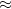

# CycleGAN:不成对的图像到图像的翻译(第 1 部分)

> 原文：<https://pyimagesearch.com/2022/09/12/cyclegan-unpaired-image-to-image-translation-part-1/>

* * *

## **目录**

* * *

## [**【cycle gan:不成对图像到图像的翻译(第一部分)**](#TOC)

在本教程中，您将了解图像到图像的转换，以及在我们有不成对的图像数据的情况下如何实现它。此外，我们将了解 CycleGAN(非成对图像翻译的最著名成果之一)是如何工作的，并深入探讨它用于在不需要成对图像数据的情况下将图像从一个域无缝翻译到另一个域的机制。

具体来说，我们将在本教程中详细讨论以下内容。

*   不成对意象翻译的范式
*   CycleGAN(不成对图像翻译最成功的方法之一)背后的思想和直觉
*   CycleGAN 使用的损失函数背后的细节和直觉，尤其是循环一致性损失
*   关于用于不成对图像翻译的 CycleGAN 的流水线和训练过程的细节

本课是关于 **GANs 301** 的三部分系列的第一部分:

1.  [***【cycle gan:不成对图像到图像的翻译(上)***](https://pyimg.co/7vh0s) **(本教程)**
2.  *CycleGAN:不成对的图像到图像翻译(第二部分)*
3.  *CycleGAN:不成对的图像到图像翻译(第三部分)*

在本系列的第一部分(本教程)，我们将了解 CycleGAN 背后的思想，并理解它用于执行图像翻译的机制。此外，我们将理解循环一致性的概念，它允许 CycleGAN 在不需要成对数据的情况下执行图像转换。

接下来，在本系列的第 2 部分中，我们将开始使用 TensorFlow 和 Keras 实现 CycleGAN 模型，并深入研究模型架构和[苹果到橙子数据集](https://www.kaggle.com/datasets/balraj98/apple2orange-dataset)的细节，我们将使用它来完成不成对图像翻译任务。

最后，在最后一部分，我们将研究训练细节并生成图像，以查看我们的实时 CycleGAN 模型的运行情况。

**要了解 CycleGAN 如何从不成对的图像执行图像到图像的翻译，** ***继续阅读。***

* * *

## [**【cycle gan:不成对图像到图像的翻译(第一部分)**](#TOC)

* * *

### [**简介**](#TOC)

高质量图像生成过程中的一个关键点是 2014 年生成性对抗网络的出现。在之前的教程中，我们已经看到了 GAN 如何从任意分布中生成图像。此外，在[的另一个教程](https://pyimagesearch.com/2022/01/10/torch-hub-series-4-pgan-model-on-gan/)中，我们已经看到了如何转变 GANs 的训练范式，并生成适合实际应用的高分辨率图像。

这主要是可能的，由于优雅的对抗训练范式，形成了甘训练的基础。值得注意的是，通过将其公式化为生成器和鉴别器之间的竞争，潜在的基于 2 个玩家的对抗范例可以用于匹配任意分布。

这就提出了一个问题，如此强大的 GAN 框架是否可以不仅仅用于图像生成。在我们之前的教程中，我们详细探讨了如何重新利用这些网络将图像从一个领域转换到另一个领域:这是一项名为图像转换的任务。

然而，pix-to-pix 模型依赖于两个域中成对数据的存在，必须在这两个域上执行图像转换。**图 1** 显示了成对和不成对数据的示例。

这产生了瓶颈并阻碍了在实际情况中的利用，在实际情况中，由于可用性、实际可行性限制或高注释成本，这种定制的成对图像数据集可能不存在。因此，人们很自然地会问，我们是否还能在不需要成对图像的情况下利用 GANs 的能力进行图像翻译。

* * *

### [**不成对图像翻译**](#TOC)

CycleGAN 模型标志着解决不成对图像到图像转换问题的第一个也是最优雅的解决方案之一。代替使用需要在数据集图像中一对一映射的传统监督范例，它提出使用循环一致性损失来实现来自不成对数据集的图像翻译。

形式上，给定源域 *X* 和目标域 *Y* ，CycleGAN 旨在学习映射 *G* : *X* → *Y* ，使得 *G* ( *X* )是图像从域 *X* 到域 *Y* 的转换。此外，它还旨在学习反向映射*F*:*Y*→*X*，使得 *F* ( *Y* )是图像从域 *Y* 到域 *X* 的平移。**图 2** 显示了 CycleGAN 组件的概述。

例如，这可能意味着将斑马图像翻译成相应的马图像(改变类语义)，将风格差异从夏季视图转移到冬季视图，或者预测图像场景的分割遮罩，如图**图 3** 所示。

但是，值得注意的是，对抗性损失仅确保分布级别的对应性。因此，它可以确保属于来自域 A 的图像分布的图像被转换成来自域 b 的图像分布的图像。它不保证样本级别的图像的一致性。

让我们通过一个例子来理解这一点，在这个例子中，我们想把斑马(域 A)翻译成马(域 B)。如图**图 4** 所示，我们看到第一张是属于斑马图像分布的图像，第二张和第三张是属于马图像分布的图像。

然而，注意，只有第二图像是第一图像的对应样本，而第三图像(即使来自域 B 的图像)不是第一图像的对应样本。应用对抗性损失可以确保翻译图像属于来自域 B 的图像的分布，但不能保证我们在域 B 中得到精确的对应样本。

在 pix-to-pix 的情况下，将域 A 中的图像转换成域 B 中的相应图像是很容易的，因为我们有来自两个域的成对样本。因此，简单的监督损失，如发生器输出的平均绝对误差和域 B 中的地面实况图像，足以确保域 A 中图像的平移产生域 B 中的相应图像。

然而，由于我们在不成对图像翻译的任务中无法访问相应的成对样本，因此我们无法使用监督损失，这使得难以确保两个域中样本级别的对应性。

为了解决这个问题，CycleGAN 框架提出使用循环一致性丢失，我们将在后面详细讨论。循环一致性损失确保了所学习的两个函数是彼此的反函数。因为对具有逆的函数的要求是它们必须是双射的(即，一对一和到上)，所以在不成对的图像平移的情况下，它隐含地确保了样本水平上的一对一对应。

* * *

### [**CycleGAN 管道和训练**](#TOC)

现在我们已经理解了 CycleGAN 背后的直觉，让我们更深入地探究它执行不成对图像翻译的机制。

因为我们将在后面的教程中使用苹果到橙子数据集来实现，所以让我们考虑这样一种情况:我们必须将域 A(即苹果)中的图像 *x* 转换为域 B(即橙子)中的图像 *y* 。

图 5 显示了一个 CycleGAN 的整体管道。

首先，我们从域 A 中取出图像 *x* ，它属于描绘苹果(*顶端*)的图像分布。这个图像通过生成器 *G* (如图所示)，它试图输出一个属于域 b 中图像分布的图像

鉴别器 *D* 是一个对手，它对生成器 *G* 生成的样本(即*y*′)和来自域 B 的实际样本(即 *y* )进行区分。使用对抗训练范例来针对该对手训练生成器。这允许生成器在输出端生成属于域 B 的分布的图像(即橙子)。

类似地，我们从域 B 获取一个图像 *y* ，它属于描绘橙子的图像分布(*底部*)。这个图像通过一个生成器 *F* (如图所示)，它试图输出一个属于域 a 中图像分布的图像

鉴别器 *D* 是一个对手，它对生成器 *F* 生成的样本(即*x*′)和来自域 A 的实际样本(即 *x* )进行区分。使用对抗训练范例来针对该对手训练生成器。这允许生成器在输出端生成属于域 A 的分布的图像(即苹果)。

最后，我们注意到，除了两个对抗性损失之外，我们还有前向和后向循环一致性损失。这确保了:

*   对于来自域 A 的每个图像 *x* ，图像平移周期应该能够将 *x* 带回原始图像
*   对于来自域 B 的每个图像 *y* ，图像平移周期应该能够将 *y* 带回原始图像

* * *

#### [**损失公式化**](#TOC)

最后，为了完成我们对训练过程的理解，让我们看一下 CysleGAN 在训练期间使用的损失函数的数学公式。

如前所述，CycleGAN 基本上使用两种损失函数(即对抗性损失和循环一致性损失)。现在让我们来看看这些损失的公式。

* * *

#### [](#TOC)

 **对抗性损失的数学公式由**等式 1** 定义。

这里，生成器试图生成看起来属于来自域 B 的图像分布的图像。另一方面，对手或鉴别者试图区分生成器的输出(即， *G* ( *x* ))和来自域 B 的真实样本(即， *Y* )。

因此，在每次训练迭代中:

*   鉴别器被更新以使损耗最大化(发电机被冻结)
*   更新发生器以最小化损耗(鉴频器冻结)

遵循对抗性训练范例，最终，生成器从域 B 的分布中学习并能够生成图像(其与原始样本 *y* 不可区分)。

类似地，如前所述，对于从域 *Y* 到域 *X* 的反向映射，施加了另一个不利损失。这里，生成器 *F* 试图生成类似于域 A 的分布的图像。此外，鉴别器 *D* *[X]* 试图区分生成器的输出(即 *F* ( *x* ))和来自域 A 的真实样本(即 *X* )。

* * *

#### [**周期一致性**](#TOC)

正如我们前面所看到的，对抗性损失只能确保分布水平的一致性。然而，为了确保在执行图像转换时生成相应的样本，CycleGAN 在样本级利用循环一致性损失。

如**等式 4** 所示，循环一致性损失由两项组成:

*   正向循环一致性
*   反向循环一致性

具体来说，第一项确保当域 A(比如说 *x* )中的样本通过生成器 *G* (从域 A 转换到 B)然后通过生成器 *F* (当它将其转换回域 A)时，输出为 *F* ( *G* ( *x* ))与原始输入样本 *x.* ( *x* →)相同

*x*).

类似地，第二项确保当域 B(比如说 *y* )中的样本通过发生器 *F* (从域 B 转换到域 A)然后通过发生器 *G* (将其转换回域 B)时，输出为 *G* ( *F* ( *x* ))与原始输入样本 *y* 相同。(*y*→*F*(*y*)→*G*(*F*(*y*)

*y*).

换句话说，这两个术语都旨在学习函数 *F* ()和 *G* ()使得它们互为逆函数。因此，循环一致性损失确保了来自域 A 的样本 *x* 和来自域 b 的样本 *y* 之间在样本水平上的对应性

* * *

* * *

## [**汇总**](#TOC)

在本教程中，我们学习了图像转换的任务，以及当两个域中的成对输入图像不可用时如何实现。

具体来说，我们详细讨论了 CycleGAN 背后的思想，并理解了循环一致性的范例，这允许 CycleGAN 无缝地从不配对数据执行图像转换。

此外，我们讨论了 CycleGAN 在训练中使用的各种损失，并了解了它们的数学公式以及它们在不成对图像翻译任务中所起的作用。

最后，我们讨论了 CycleGAN 的端到端流水线，以解码来自不成对数据的图像翻译过程。

* * *

### [**引用信息**](#TOC)

**Chandhok，s .**“cycle gan:不成对的图像到图像的翻译(第一部分)， *PyImageSearch* ，P. Chugh，A. R. Gosthipaty，S. Huot，K. Kidriavsteva，R. Raha 和 A. Thanki 编辑。，2022 年，【https://pyimg.co/7vh0s 

```py
@incollection{Chandhok_2022_CycleGAN,
  author = {Shivam Chandhok},
  title = {{CycleGAN}: Unpaired Image-to-Image Translation (Part 1)},
  booktitle = {PyImageSearch},
  editor = {Puneet Chugh and Aritra Roy Gosthipaty and Susan Huot and Kseniia Kidriavsteva and Ritwik Raha and Abhishek Thanki},
  year = {2022},
  note = {https://pyimg.co/7vh0s},
}
```

* * ***