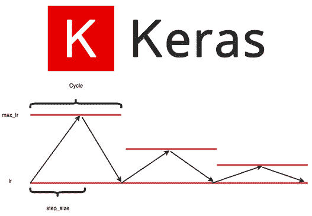
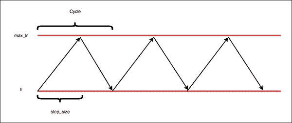
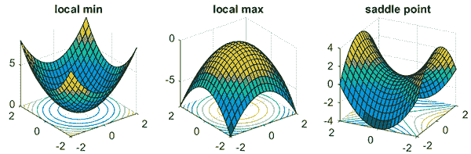
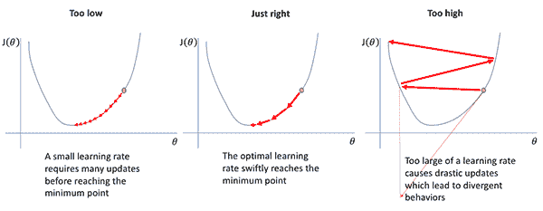
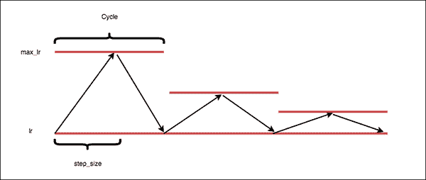
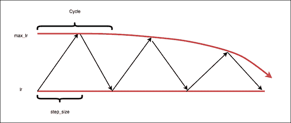
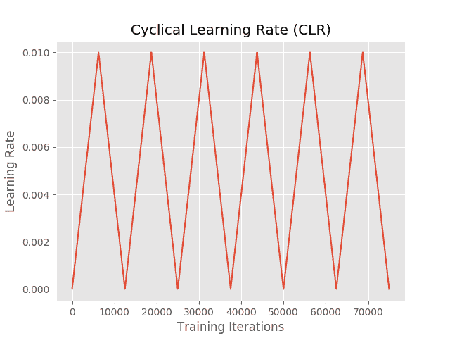
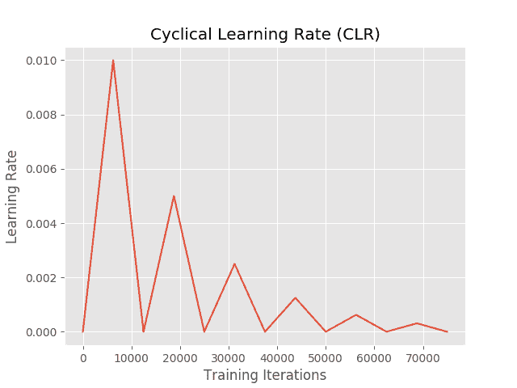

# Keras 和深度学习的循环学习率

> 原文：<https://pyimagesearch.com/2019/07/29/cyclical-learning-rates-with-keras-and-deep-learning/>

[](https://pyimagesearch.com/wp-content/uploads/2019/07/keras_clr_header.png)

在本教程中，您将学习如何使用循环学习率(CLR)和 Keras 来训练您自己的神经网络。使用循环学习率，您可以大大减少调整和找到模型的最佳学习率所需的实验次数。

今天是我们关于调整深度神经网络学习速率的三部分系列的第二部分:

1.  **Part #1:** [*Keras 学习进度和衰变*](https://pyimagesearch.com/2019/07/22/keras-learning-rate-schedules-and-decay/) (上周的帖子)
2.  **Part #2:** *循环学习率与 Keras 和深度学习* **(今日帖)**
3.  **第三部分:** *自动寻找最佳学习率*(下周帖子)

上周，我们讨论了**学习速率表**的概念，以及我们如何根据设定的函数(即线性、多项式或阶跃下降)随时间衰减和降低我们的学习速率。

**然而，基本学习率计划有两个问题:**

1.  我们不知道最优的*初始*学习率是多少。
2.  单调地降低我们的学习率可能会导致我们的网络陷入“停滞”状态。

循环学习率采取了不同的方法。使用 clr，我们现在可以:

1.  定义一个 ***最小*学习率**
2.  定义一个 ***最大*学习率**
3.  允许**学习率在两个界限**之间循环振荡

实际上，使用循环学习率会导致**更快的收敛**和**更少的实验/超参数更新。**

当我们将 CLRs 与下周的自动寻找最佳学习率的技术结合起来时，你可能再也不需要调整你的学习率了！(或者至少运行*少得多的*实验来调整它们)。

**要了解如何使用 Keras 的循环学习率，*继续阅读！***

## Keras 和深度学习的循环学习率

***2020-06-11 更新:**此博文现已兼容 TensorFlow 2+!*

在本教程的第一部分，我们将讨论循环学习率，包括:

*   什么是循环学习率？
*   为什么要使用循环学习率？
*   我们如何在 Keras 中使用循环学习率？

在此基础上，我们将实现 CLRs，并在 CIFAR-10 数据集上训练一个 GoogLeNet 变体— **我甚至会指出如何在您自己的定制数据集上使用循环学习率。**

最后，我们将回顾我们的实验结果，您将直接看到 CLRs 如何减少您需要执行的学习率试验次数，以找到最佳学习率范围。

### 什么是循环学习率？

[](https://pyimagesearch.com/wp-content/uploads/2019/07/keras_clr_triangular.png)

**Figure 1:** Cyclical learning rates oscillate back and forth between two bounds when training, slowly increasing the learning rate after every batch update. To implement cyclical learning rates with Keras, you simply need a callback.

正如我们在上周的文章中讨论的那样，我们可以定义学习率计划，在每个时期后单调地降低我们的学习率。

随着时间的推移，通过降低我们的学习率，我们可以允许我们的模型(理想地)下降到损失景观的较低区域。

在实践中；然而，单调递减的学习速率存在一些问题:

*   首先，我们的模型和优化器仍然对我们最初选择的学习速率敏感。
*   第二，**我们不知道初始学习速率应该是多少** —我们可能需要进行 10 秒到 100 秒的实验，只是为了找到我们的初始学习速率。
*   最后，当降低学习率时，不能保证我们的模型会下降到低损失区域。

为了解决这些问题，NRL 的 Leslie Smith 在他 2015 年的论文 [*中引入了**循环学习率**用于训练神经网络*](https://arxiv.org/abs/1506.01186) 的循环学习率。

现在，我们不再单调递减我们的学习速率，而是:

1.  定义我们学习率(称为*“base _ lr”*)的**下限。**
2.  定义学习率的**上限(称为*“max _ lr”*)。**
3.  训练时允许**学习率在这两个界限**之间来回振荡，在每批更新后缓慢增加和减少学习率*。*

在**图 1** 中可以看到一个循环学习率的例子。

注意我们的学习速度是如何遵循一个三角形模式的。第一，学习率很小。然后，随着时间的推移，学习率继续增长，直到达到最大值。然后学习率下降回到基础值。这种循环模式贯穿整个训练。

### 为什么要使用循环学习率？

[](https://pyimagesearch.com/wp-content/uploads/2019/07/keras_clr_saddle_points.png)

**Figure 2:** Monotonically decreasing learning rates could lead to a model that is stuck in saddle points or a local minima. By oscillating learning rates cyclically, we have more freedom in our initial learning rate, can break out of saddle points and local minima, and reduce learning rate tuning experimentation. ([image source](https://www.offconvex.org/2016/03/22/saddlepoints/))

如上所述，循环学习率使我们的学习率在下限和上限之间来回振荡。

所以，为什么要费这么大劲呢？

为什么不像我们一直做的那样，单调地降低我们的学习速度呢？

**第一个原因是，我们的网络可能会陷入*鞍点*或*局部最小值*、**中，并且低学习率可能不足以突破该区域并下降到损失较低的损失区域。

**其次，我们的模型和优化器可能对我们的初始学习率选择非常*敏感*。**如果我们在学习速率上做了一个糟糕的初始选择，我们的模型可能会从一开始就停滞不前。

**相反，我们可以使用循环学习率在上限和下限之间摆动我们的学习率，使我们能够:**

1.  在最初的学习速度选择上有更多的自由。
2.  突破鞍点和局部极小值。

在实践中，使用 CLRs 导致*更少的*学习率调整实验，以及与穷举超参数调整几乎相同的精度。

### 我们如何使用循环学习率？

[](https://pyimagesearch.com/wp-content/uploads/2019/07/keras_clr_learning_rate_variations.png)

**Figure 3:** Brad Kenstler’s implementation of deep learning [Cyclical Learning Rates for Keras](https://github.com/bckenstler/CLR) includes three modes — “triangular”, “triangular2”, and “exp_range”. Cyclical learning rates seek to handle training issues when your learning rate is too high or too low shown in this figure. ([image source](https://www.jeremyjordan.me/nn-learning-rate/))

我们将使用 Brad Kenstler 对 Keras 的[循环学习率的实现。](https://github.com/bckenstler/CLR)

为了使用这个实现，我们需要首先定义几个值:

*   **批量:**在训练期间网络的单次向前和向后传递中使用的训练样本的数量。
*   **批次/迭代:**每个时期的权重更新次数(即，总训练样本数除以批次大小)。
*   **循环:**我们的学习率从下界到上界，再到下界，再下降回到下界所需要的迭代次数。
*   **步长:**半个周期的迭代次数。CLRs 的创造者 Leslie Smith 推荐 step_size 应该是`(2-8) * training_iterations_in_epoch`。**在实践中，我发现步长为 4 或 8 在大多数情况下都很有效。**

定义了这些术语后，让我们看看它们是如何一起定义循环学习率策略的。

#### “三角”政策

[](https://pyimagesearch.com/wp-content/uploads/2019/07/keras_clr_triangular.png)

**Figure 4**: The “triangular” policy mode for deep learning cyclical learning rates with Keras.

“三角”循环学习率政策是一个简单的三角循环。

我们的学习率从基础值开始，然后开始增加。

我们在周期的中途达到最大学习率值(即步长，或半个周期中的迭代次数)。一旦达到最大学习率，我们就将学习率降低回基础值。同样，需要半个周期才能回到基础学习率。

整个过程重复(即循环)直到训练结束。

#### “三角 2”政策

[](https://pyimagesearch.com/wp-content/uploads/2019/07/keras_clr_triangular2.png)

**Figure 5:** The deep learning cyclical learning rate “triangular2” policy mode is similar to “triangular” but cuts the max learning rate bound in half after every cycle.

“triangular 2”CLR 策略类似于标准的“triangular”策略，但在每个周期后，它会将我们的最大学习速率限制减半。

这里的论点是我们得到了两个世界的最好的东西:

我们可以调整我们的学习速度来突破鞍点/局部最小值…

…同时降低我们的学习速度，使我们能够下降到损失范围的较低损失区域。

此外，随着时间的推移降低我们的最大学习速度有助于稳定我们的训练。采用“三角形”策略的后期可能会在损失和准确性方面表现出较大的跳跃——“三角形 2”策略将有助于稳定这些跳跃。

#### “exp_range”策略

[](https://pyimagesearch.com/wp-content/uploads/2019/07/keras_clr_exp_range.png)

**Figure 6:** The “exp_range” cyclical learning rate policy undergoes exponential decay for the max learning rate bound while still exhibiting the “triangular” policy characteristics.

“exp_range”循环学习率策略类似于“triangular2”策略，但是，顾名思义，它遵循指数衰减，从而对最大学习率的下降速率进行更精细的控制。

***注意:**在实践中，我不使用“exp_range”策略——“triangular”和“triangular2”策略在绝大多数项目中已经足够了。*

### 如何在我的系统上安装循环学习率？

我们正在使用的循环学习率实现不是 pip 可安装的。

相反，您可以:

1.  使用 ***“下载”*** 部分获取本教程的文件和相关代码/数据。
2.  从 GitHub repo(上面的链接)下载`clr_callback.py`文件，并将其插入到您的项目中。

从那里，让我们继续使用循环学习率来训练我们的第一个 CNN。

### 配置您的开发环境

要针对本教程配置您的系统，我首先建议您遵循以下任一教程:

*   [*如何在 Ubuntu 上安装 tensor flow 2.0*](https://pyimagesearch.com/2019/12/09/how-to-install-tensorflow-2-0-on-ubuntu/)
*   [*如何在 macOS 上安装 tensor flow 2.0*](https://pyimagesearch.com/2019/12/09/how-to-install-tensorflow-2-0-on-macos/)

这两个教程都将帮助您在一个方便的 Python 虚拟环境中，用这篇博文所需的所有软件来配置您的系统。

请注意 [PyImageSearch 不推荐也不支持 CV/DL 项目](https://pyimagesearch.com/faqs/single-faq/can-you-help-me-do-___-on-windows/)的窗口。

### 项目结构

继续从`keras-cyclical-learning-rates/`目录中运行`tree`命令来打印我们的项目结构:

```py
$ tree --dirsfirst
.
├── output
│   ├── triangular2_clr_plot.png
│   ├── triangular2_training_plot.png
│   ├── triangular_clr_plot.png
│   └── triangular_training_plot.png
├── pyimagesearch
│   ├── __init__.py
│   ├── clr_callback.py
│   ├── config.py
│   └── minigooglenet.py
└── train_cifar10.py

2 directories, 9 files

```

`output/`目录将包含我们的 CLR 和精度/损耗图。

`pyimagesearch`模块包含我们的循环学习率回调类、MiniGoogLeNet CNN 和配置文件:

*   `clr_callback.py`文件包含循环学习率回调，它将在每次批量更新结束时自动更新我们的学习率。
*   `minigooglenet.py`文件保存了`MiniGoogLeNet` CNN，我们将使用 CIFAR-10 数据对其进行训练。我们今天不回顾 MiniGoogLeNet 请参考 [*用 Python 进行计算机视觉的深度学习*](https://pyimagesearch.com/deep-learning-computer-vision-python-book/) 来了解这个 CNN 架构的更多信息。
*   我们的`config.py`只是一个包含配置变量的 Python 文件——我们将在下一节回顾它。

我们的训练脚本`train_cifar10.py`，使用 CIFAR-10 数据集训练 MiniGoogLeNet。培训脚本利用了我们的 CLR 回调和配置。

### 我们的配置文件

在实现我们的培训脚本之前，让我们先来回顾一下我们的配置文件:

```py
# import the necessary packages
import os

# initialize the list of class label names
CLASSES = ["airplane", "automobile", "bird", "cat", "deer", "dog",
	"frog", "horse", "ship", "truck"]

```

我们将在配置中使用`os`模块，这样我们就可以直接构造与操作系统无关的路径( **Line 2** )。

从那里，我们的 CIFAR-10 `CLASSES`被定义(**第 5 行和第 6 行**)。

让我们定义我们的**循环学习率参数:**

```py
# define the minimum learning rate, maximum learning rate, batch size,
# step size, CLR method, and number of epochs
MIN_LR = 1e-7
MAX_LR = 1e-2
BATCH_SIZE = 64
STEP_SIZE = 8
CLR_METHOD = "triangular"
NUM_EPOCHS = 96

```

`MIN_LR`和`MAX_LR`分别定义我们的基本学习率和最大学习率(**第 10 行和第 11 行**)。我知道这些学习率在按照我已经用 Python 为计算机视觉的 [*深度学习*](https://pyimagesearch.com/deep-learning-computer-vision-python-book/) 运行的实验训练 MiniGoogLeNet 时会很好地工作——下周我将向你展示如何自动找到这些值。

`BATCH_SIZE` ( **第 12 行**)是每次批量更新的训练样本数。

然后我们有了`STEP_SIZE`，它是半个周期中批量更新的次数(**第 13 行**)。

`CLR_METHOD`控制着我们的周期性学习率政策(**第 14 行**)。这里我们使用的是`”triangular”`策略，正如上一节所讨论的。

我们可以通过下式计算给定历元数中的**完整 CLR 周期数**:

`NUM_CLR_CYCLES = NUM_EPOCHS / STEP_SIZE / 2`

比如用`NUM_EPOCHS = 96`和`STEP_SIZE = 8`，总共会有 6 个完整周期:`96 / 8 / 2 = 6`。

最后，我们定义输出绘图路径/文件名:

```py
# define the path to the output training history plot and cyclical
# learning rate plot
TRAINING_PLOT_PATH = os.path.sep.join(["output", "training_plot.png"])
CLR_PLOT_PATH = os.path.sep.join(["output", "clr_plot.png"])

```

我们将绘制一个训练历史准确性/损失图以及一个循环学习率图。您可以在第 19 行和第 20 行指定图形的路径+文件名。

### 实施我们的循环学习率培训脚本

定义好配置后，我们可以继续实施我们的培训脚本。

打开`train_cifar10.py`并插入以下代码:

```py
# set the matplotlib backend so figures can be saved in the background
import matplotlib
matplotlib.use("Agg")

# import the necessary packages
from pyimagesearch.minigooglenet import MiniGoogLeNet
from pyimagesearch.clr_callback import CyclicLR
from pyimagesearch import config
from sklearn.preprocessing import LabelBinarizer
from sklearn.metrics import classification_report
from tensorflow.keras.preprocessing.image import ImageDataGenerator
from tensorflow.keras.optimizers import SGD
from tensorflow.keras.datasets import cifar10
import matplotlib.pyplot as plt
import numpy as np

```

**2-15 线**进口我们需要的包装。最值得注意的是我们的`CyclicLR`(来自`clr_callback`文件)是通过**行 7** 导入的。`matplotlib`后端被设置在**行 3** 上，这样我们的图可以在训练过程结束时被写入磁盘。

接下来，让我们加载我们的 CIFAR-10 数据:

```py
# load the training and testing data, converting the images from
# integers to floats
print("[INFO] loading CIFAR-10 data...")
((trainX, trainY), (testX, testY)) = cifar10.load_data()
trainX = trainX.astype("float")
testX = testX.astype("float")

# apply mean subtraction to the data
mean = np.mean(trainX, axis=0)
trainX -= mean
testX -= mean

# convert the labels from integers to vectors
lb = LabelBinarizer()
trainY = lb.fit_transform(trainY)
testY = lb.transform(testY)

# construct the image generator for data augmentation
aug = ImageDataGenerator(width_shift_range=0.1,
	height_shift_range=0.1, horizontal_flip=True,
	fill_mode="nearest")

```

**第 20-22 行**加载 CIFAR-10 图像数据集。数据被预先分成训练集和测试集。

从那里，我们计算`mean`并应用均值减法(**第 25-27 行**)。均值减法是一种归一化/缩放技术，可提高模型精度。更多详情请参考 [*用 Python 进行计算机视觉深度学习的*练习者捆绑**。](https://pyimagesearch.com/deep-learning-computer-vision-python-book/)

然后标签被二进制化(**第 30-32 行**)。

接下来，我们初始化我们的数据扩充对象(**第 35-37 行**)。数据扩充通过在训练过程中从数据集生成随机变异的图像来提高模型的泛化能力。我在《用 Python 进行计算机视觉的深度学习》 **[*和两篇博客文章【如何使用 Keras fit 和 fit _ generator*](https://pyimagesearch.com/deep-learning-computer-vision-python-book/)**[【实用教程】](https://pyimagesearch.com/2018/12/24/how-to-use-keras-fit-and-fit_generator-a-hands-on-tutorial/)* 和[*Keras imagedata generator 和数据增强*](https://pyimagesearch.com/2019/07/08/keras-imagedatagenerator-and-data-augmentation/) )中深入讨论了数据增强。***

让我们初始化(1)我们的模型，以及(2)我们的周期性学习率回调:

```py
# initialize the optimizer and model
print("[INFO] compiling model...")
opt = SGD(lr=config.MIN_LR, momentum=0.9)
model = MiniGoogLeNet.build(width=32, height=32, depth=3, classes=10)
model.compile(loss="categorical_crossentropy", optimizer=opt,
	metrics=["accuracy"])

# initialize the cyclical learning rate callback
print("[INFO] using '{}' method".format(config.CLR_METHOD))
clr = CyclicLR(
	mode=config.CLR_METHOD,
	base_lr=config.MIN_LR,
	max_lr=config.MAX_LR,
	step_size= config.STEP_SIZE * (trainX.shape[0] // config.BATCH_SIZE))

```

我们的`model`用随机梯度下降(`SGD`)优化和`"categorical_crossentropy"`损失(**第 41-44 行**)初始化。如果数据集中只有两个类，一定要设置`loss="binary_crossentropy"`。

接下来，我们**通过**线路 48-52** 初始化循环学习率回调**。CLR 参数被提供给构造函数。现在是在*“我们如何使用循环学习率？”顶部回顾它们的好时机*上一节。Leslie Smith 建议将其设置为每个时期批量更新次数的倍数。

现在让我们使用 CLR 来训练和评估我们的模型:

```py
# train the network
print("[INFO] training network...")
H = model.fit(
	x=aug.flow(trainX, trainY, batch_size=config.BATCH_SIZE),
	validation_data=(testX, testY),
	steps_per_epoch=trainX.shape[0] // config.BATCH_SIZE,
	epochs=config.NUM_EPOCHS,
	callbacks=[clr],
	verbose=1)

# evaluate the network and show a classification report
print("[INFO] evaluating network...")
predictions = model.predict(x=testX, batch_size=config.BATCH_SIZE)
print(classification_report(testY.argmax(axis=1),
	predictions.argmax(axis=1), target_names=config.CLASSES))

```

***2020-06-11 更新:**以前，TensorFlow/Keras 需要使用一种叫做`.fit_generator`的方法来完成数据扩充。现在，`.fit`方法也可以处理数据扩充，使代码更加一致。这也适用于从`.predict_generator`到`.predict`的迁移。请务必查看我关于 [fit 和 fit_generator](https://pyimagesearch.com/2018/12/24/how-to-use-keras-fit-and-fit_generator-a-hands-on-tutorial/) 以及[数据扩充](https://pyimagesearch.com/2019/07/08/keras-imagedatagenerator-and-data-augmentation/)的文章。*

**56-62 行**使用`clr`回调和数据增强启动培训。

然后**行 66-68** 在测试集上评估网络并打印一个`classification_report`。

最后，我们将生成两个图:

```py
# plot the training loss and accuracy
N = np.arange(0, config.NUM_EPOCHS)
plt.style.use("ggplot")
plt.figure()
plt.plot(N, H.history["loss"], label="train_loss")
plt.plot(N, H.history["val_loss"], label="val_loss")
plt.plot(N, H.history["accuracy"], label="train_acc")
plt.plot(N, H.history["val_accuracy"], label="val_acc")
plt.title("Training Loss and Accuracy")
plt.xlabel("Epoch #")
plt.ylabel("Loss/Accuracy")
plt.legend(loc="lower left")
plt.savefig(config.TRAINING_PLOT_PATH)

# plot the learning rate history
N = np.arange(0, len(clr.history["lr"]))
plt.figure()
plt.plot(N, clr.history["lr"])
plt.title("Cyclical Learning Rate (CLR)")
plt.xlabel("Training Iterations")
plt.ylabel("Learning Rate")
plt.savefig(config.CLR_PLOT_PATH)

```

***2020-06-11 更新:*** *为了使这个绘图片段与 TensorFlow 2+兼容，更新了`H.history`字典键，以完全拼出“acc”而没有“ACC”(即`H.history["val_accuracy"]`和`H.history["accuracy"]`)。“val”没有拼成“validation”，这有点令人困惑；我们必须学会热爱 API 并与之共存，并永远记住这是一项正在进行的工作，世界各地的许多开发人员都为此做出了贡献。*

生成了两个图:

*   训练准确性/损失历史(**第 71-82 行**)。标准的情节格式包括在我的大部分教程和我的深度学习书的每个实验中。
*   学习率历史(**第 86-91 行**)。这个图将帮助我们直观地验证我们的学习速度是根据我们的意图振荡的。

### 以循环学习率进行培训

我们现在准备使用 Keras 的循环学习率来训练我们的 CNN！

确保你已经使用了这篇文章的 ***“下载”*** 部分来下载源代码——从那里，打开一个终端并执行以下命令:

```py
$ python train_cifar10.py
[INFO] loading CIFAR-10 data...
[INFO] compiling model...
[INFO] using 'triangular' method
[INFO] training network...
Epoch 1/96
781/781 [==============================] - 21s 27ms/step - loss: 1.9768 - accuracy: 0.2762 - val_loss: 1.6559 - val_accuracy: 0.4040
Epoch 2/96
781/781 [==============================] - 20s 26ms/step - loss: 1.4149 - accuracy: 0.4827 - val_loss: 1.5753 - val_accuracy: 0.4895
Epoch 3/96
781/781 [==============================] - 20s 26ms/step - loss: 1.1499 - accuracy: 0.5902 - val_loss: 1.6790 - val_accuracy: 0.5242
Epoch 4/96
781/781 [==============================] - 20s 26ms/step - loss: 0.9762 - accuracy: 0.6563 - val_loss: 1.1674 - val_accuracy: 0.6079
Epoch 5/96
781/781 [==============================] - 20s 26ms/step - loss: 0.8552 - accuracy: 0.7057 - val_loss: 1.1270 - val_accuracy: 0.6545
...
Epoch 92/96
781/781 [==============================] - 20s 25ms/step - loss: 0.0625 - accuracy: 0.9790 - val_loss: 0.4958 - val_accuracy: 0.8852
Epoch 93/96
781/781 [==============================] - 20s 26ms/step - loss: 0.0472 - accuracy: 0.9842 - val_loss: 0.3810 - val_accuracy: 0.9059
Epoch 94/96
781/781 [==============================] - 20s 26ms/step - loss: 0.0377 - accuracy: 0.9882 - val_loss: 0.3733 - val_accuracy: 0.9092
Epoch 95/96
781/781 [==============================] - 20s 26ms/step - loss: 0.0323 - accuracy: 0.9901 - val_loss: 0.3609 - val_accuracy: 0.9124
Epoch 96/96
781/781 [==============================] - 20s 26ms/step - loss: 0.0277 - accuracy: 0.9919 - val_loss: 0.3516 - val_accuracy: 0.9146
[INFO] evaluating network...
              precision    recall  f1-score   support

    airplane       0.91      0.94      0.92      1000
  automobile       0.95      0.96      0.96      1000
        bird       0.89      0.89      0.89      1000
         cat       0.83      0.82      0.83      1000
        deer       0.91      0.91      0.91      1000
         dog       0.88      0.85      0.86      1000
        frog       0.92      0.95      0.93      1000
       horse       0.95      0.93      0.94      1000
        ship       0.96      0.95      0.95      1000
       truck       0.95      0.95      0.95      1000

    accuracy                           0.91     10000
   macro avg       0.91      0.91      0.91     10000
weighted avg       0.91      0.91      0.91     10000

```

如您所见，通过使用“三角形”CLR 策略，我们在 CIFAR-10 测试集上获得了 91%的准确率。

下图显示了学习率图，演示了它如何循环地从学习率下限开始，在半个周期时增加到最大值，然后再次降低到下限，从而完成循环:

[](https://pyimagesearch.com/wp-content/uploads/2019/07/triangular_clr_plot.png)

**Figure 7:** Our first experiment of deep learning cyclical learning rates with Keras uses the “triangular” policy.

检查我们的培训历史，您可以看到学习率的周期性行为:

[](https://pyimagesearch.com/wp-content/uploads/2019/07/triangular_training_plot.png)

**Figure 8:** Our first experiment training history plot shows the effects of the “triangular” policy on the accuracy/loss curves.

请注意训练准确性和验证准确性中的“波浪”——波浪的底部是我们的基础学习率，波浪的顶部是学习率的上限，波浪的底部，就在下一个开始之前，是较低的学习率。

只是为了好玩，回到`config.py`文件的**第 14 行**，将`CLR_METHOD`从`”triangular”`更新为`”triangular2”`:

```py
# define the minimum learning rate, maximum learning rate, batch size,
# step size, CLR method, and number of epochs
MIN_LR = 1e-7
MAX_LR = 1e-2
BATCH_SIZE = 64
STEP_SIZE = 8
CLR_METHOD = "triangular2"
NUM_EPOCHS = 96

```

从那里，训练网络:

```py
$ python train_cifar10.py
[INFO] loading CIFAR-10 data...
[INFO] compiling model...
[INFO] using 'triangular2' method
[INFO] training network...
Epoch 1/96
781/781 [==============================] - 21s 26ms/step - loss: 1.9612 - accuracy: 0.2816 - val_loss: 1.8604 - val_accuracy: 0.3650
Epoch 2/96
781/781 [==============================] - 20s 26ms/step - loss: 1.4167 - accuracy: 0.4832 - val_loss: 1.5907 - val_accuracy: 0.4916
Epoch 3/96
781/781 [==============================] - 21s 26ms/step - loss: 1.1566 - accuracy: 0.5889 - val_loss: 1.2650 - val_accuracy: 0.5667
Epoch 4/96
781/781 [==============================] - 20s 26ms/step - loss: 0.9837 - accuracy: 0.6547 - val_loss: 1.1343 - val_accuracy: 0.6207
Epoch 5/96
781/781 [==============================] - 20s 26ms/step - loss: 0.8690 - accuracy: 0.6940 - val_loss: 1.1572 - val_accuracy: 0.6128
...
Epoch 92/96
781/781 [==============================] - 20s 26ms/step - loss: 0.0711 - accuracy: 0.9765 - val_loss: 0.3636 - val_accuracy: 0.9021
Epoch 93/96
781/781 [==============================] - 20s 26ms/step - loss: 0.0699 - accuracy: 0.9775 - val_loss: 0.3693 - val_accuracy: 0.8995
Epoch 94/96
781/781 [==============================] - 20s 26ms/step - loss: 0.0702 - accuracy: 0.9773 - val_loss: 0.3660 - val_accuracy: 0.9013
Epoch 95/96
781/781 [==============================] - 20s 26ms/step - loss: 0.0682 - accuracy: 0.9782 - val_loss: 0.3644 - val_accuracy: 0.9005
Epoch 96/96
781/781 [==============================] - 20s 26ms/step - loss: 0.0661 - accuracy: 0.9789 - val_loss: 0.3649 - val_accuracy: 0.9007
[INFO] evaluating network...
              precision    recall  f1-score   support

    airplane       0.90      0.91      0.91      1000
  automobile       0.95      0.97      0.96      1000
        bird       0.85      0.86      0.86      1000
         cat       0.83      0.79      0.81      1000
        deer       0.90      0.88      0.89      1000
         dog       0.84      0.84      0.84      1000
        frog       0.90      0.94      0.92      1000
       horse       0.94      0.93      0.93      1000
        ship       0.96      0.94      0.95      1000
       truck       0.94      0.95      0.94      1000

    accuracy                           0.90     10000
   macro avg       0.90      0.90      0.90     10000
weighted avg       0.90      0.90      0.90     10000

```

这一次，我们获得了 90%的准确率，比使用“三角”策略略低。

我们的学习率图直观地显示了我们的学习率是如何循环更新的:

[](https://pyimagesearch.com/wp-content/uploads/2019/07/triangular2_clr_plot.png)

**Figure 9:** Our second experiment uses the “triangular2” cyclical learning rate policy mode. The actual learning rates throughout training are shown in the plot.

请注意，在每个完整周期后，最大学习率减半。由于我们的最大学习率在每个周期后都在下降，因此我们在训练和验证准确性方面的“波动”将变得不那么明显:

[](https://pyimagesearch.com/wp-content/uploads/2019/07/triangular2_training_plot.png)

**Figure 10:** Our second experiment training history plot shows the effects of the “triangular2” policy on the accuracy/loss curves.

虽然“三角”周期学习率策略获得了稍好的准确性，但它也表现出大得多的波动，并且具有更大的过度拟合风险。

相比之下，“三角 2”策略虽然不太准确，但在训练中更稳定。

当你用循环学习率进行自己的实验时，我建议你测试*两个*策略，并选择一个平衡了**准确性**和**稳定性**的策略(即，具有较小过度拟合风险的稳定训练)。

在下周的教程中，我将向你展示如何用循环学习率自动定义你的最小和最大学习率界限。

## 摘要

在本教程中，您学习了如何对 Keras 使用循环学习率(clr)。

与单调降低我们学习速率的标准学习速率衰减时间表不同，CLRs:

*   定义一个 ***最小*学习率**
*   定义一个 ***最大*学习率**
*   允许**学习率在两个界限**之间循环振荡

循环学习率通常导致**更快的收敛**和**更少的实验和超参数调整。**

但是还有一个问题…

*我们怎么知道学习率的最优上下界是？*

这是一个很好的问题——我将在下周的帖子中回答这个问题，我将向你展示如何**自动找到最佳学习率值。**

 **我希望你喜欢今天的帖子！

**要下载这篇文章的源代码(并在 PyImageSearch 上发布以后的教程时得到通知)，*只需在下面的表格中输入您的电子邮件地址。*****