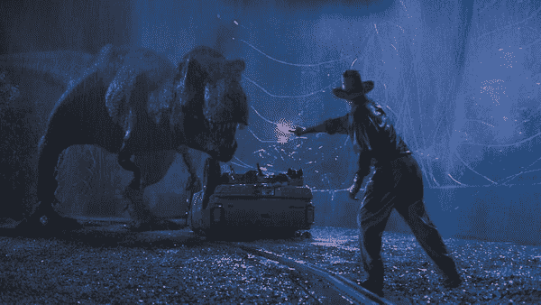
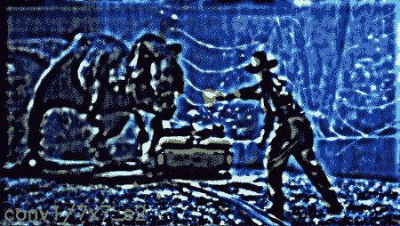
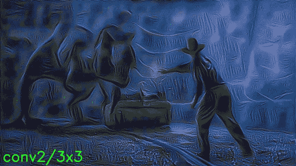
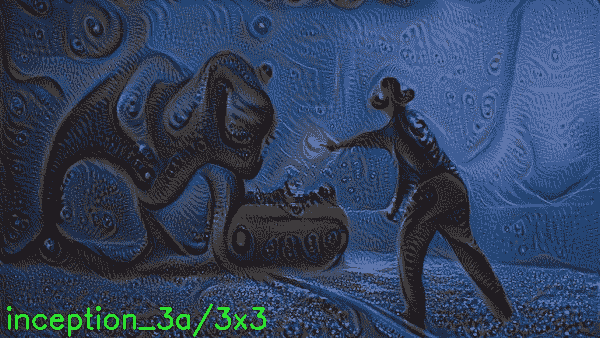
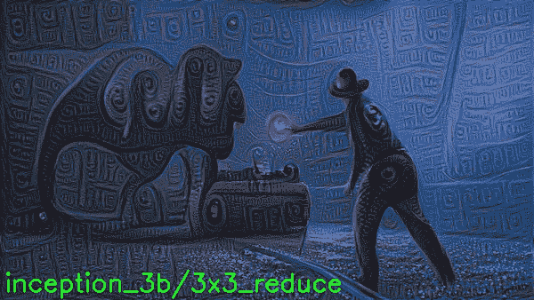
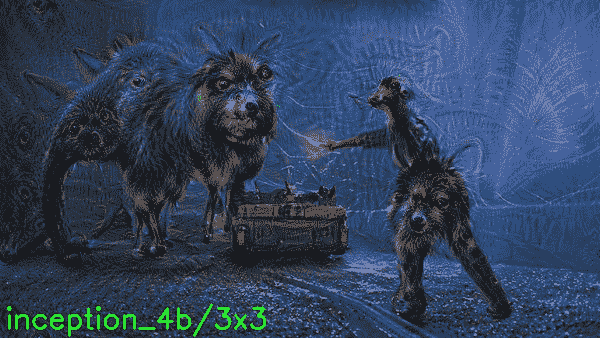
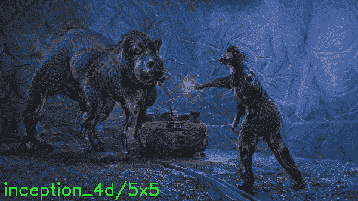

# 深度梦境:可视化谷歌网络的每一层

> 原文：<https://pyimagesearch.com/2015/08/03/deep-dream-visualizing-every-layer-of-googlenet/>

几周前我介绍了 [bat-country](https://pyimagesearch.com/2015/07/06/bat-country-an-extendible-lightweight-python-package-for-deep-dreaming-with-caffe-and-convolutional-neural-networks/) ，这是我实现的一个**轻量级、可扩展、易于使用的 Python 包，用于深度做梦和灵感**。

图书馆的接收效果非常好，所以我决定做一个后续的帖子会很有趣——但与其像在 [Twitter #deepdream stream](https://twitter.com/search?q=%23deepdream&src=tyah) 上那样生成一些真正迷幻的图像，我认为使用 bat-country 来可视化 GoogLeNet 的每一层会更有吸引力。

# 用 Python 可视化 GoogLeNet 的每一层

下面是我加载图像的 Python 脚本，循环遍历网络的每一层，然后将每个输出图像写入文件:

```py
# import the necessary packages
from __future__ import print_function
from batcountry import BatCountry
from PIL import Image
import numpy as np
import argparse
import warnings
import cv2

# construct the argument parser and parse the arguments
ap = argparse.ArgumentParser()
ap.add_argument("-b", "--base-model", required=True, help="base model path")
ap.add_argument("-i", "--image", help="path to image file")
ap.add_argument("-o", "--output", help="path to output directory")
args = ap.parse_args()

# filter warnings, initialize bat country, and grab the layer names of
# the CNN
warnings.filterwarnings("ignore")
bc = BatCountry(args.base_model)
layers = bc.layers()

# extract the filename and extension of the input image
filename = args.image[args.image.rfind("/") + 1:]
(filename, ext) = filename.split(".")

# loop over the layers
for (i, layer) in enumerate(layers):
	# perform visualizing using the current layer
	print("[INFO] processing layer `{}` {}/{}".format(layer, i + 1, len(layers)))

	try:
		# pass the image through the network
		image = bc.dream(np.float32(Image.open(args.image)), end=layer,
			verbose=False)

		# draw the layer name on the image
		image = cv2.cvtColor(image, cv2.COLOR_RGB2BGR)
		cv2.putText(image, layer, (5, image.shape[0] - 10),
			cv2.FONT_HERSHEY_SIMPLEX, 0.95, (0, 255, 0), 2)

		# construct the output path and write the image to file
		p = "{}/{}_{}.{}".format(args.output, filename, str(i + 1).zfill(4), ext)
		cv2.imwrite(p, image)

	except KeyError, e:
		# the current layer can not be used
		print("[ERROR] cannot use layer `{}`".format(layer))

# perform housekeeping
bc.cleanup()

```

这个脚本需要三个命令行参数:我们的 Caffe 模型所在的`--base-model`目录，我们的输入路径`--image`，以及最后的`--output`目录，我们的图像在通过网络后将存储在这个目录中。

正如你也会看到的，我使用了一个`try/except`块来捕捉任何不能用于可视化的层。

下面是我输入网络的图像:

[](https://pyimagesearch.com/wp-content/uploads/2015/07/jp.jpg)

**Figure 1:** The iconic input image of Dr. Grant and the T-Rex from Jurassic Park.

然后，我使用以下命令执行 Python 脚本:

```py
$ python visualize_layers.py \
 	--base-model $CAFFE_ROOT/caffe/models/bvlc_googlenet \
 	--image images/jp.jpg --output output/jp

```

可视化过程将会开始。我在一个启用了 GPU 支持的 [Amazon EC2 g2.2xlarge 实例](https://pyimagesearch.com/2014/10/13/deep-learning-amazon-ec2-gpu-python-nolearn/)上生成了我的结果，因此脚本在 30 分钟内完成。

下面可以看到一张 ***所有图层可视化*** 的. gif:

[](https://pyimagesearch.com/wp-content/uploads/2015/06/visualizing-all-googlenet-layers.gif)

**Figure 2:** Visualizing every layer of GoogLeNet using bat-country.

的。gif 文件相当大，有 9.6 MB，所以给它几秒钟加载时间，尤其是如果你的网速很慢的话。

同时，这里有一些我最喜欢的图层:

[](https://pyimagesearch.com/wp-content/uploads/2015/07/jp_0007.jpg)

**Figure 3:** This is my far my favorite one of the bunch. The lower layers of the network reflect edge-like regions in the input image.

[](https://pyimagesearch.com/wp-content/uploads/2015/07/jp_0016.jpg)

**Figure 4:** The inception_3a/3×3 layer also products a nice effect.

[](https://pyimagesearch.com/wp-content/uploads/2015/07/jp_0029.jpg)

**Figure 5:** The same goes for the inception_3b/3x3_reduce layer.

[](https://pyimagesearch.com/wp-content/uploads/2015/07/jp_0062.jpg)

**Figure 6:** This one I found amusing — it seems that Dr. Grant has developed a severe case of dog-ass.

[](https://pyimagesearch.com/wp-content/uploads/2015/07/jp_0096.jpg)

**Figure 7:** Eventually, our Dr. Grant and T-Rex have morphed into something else entirely.

# 摘要

这篇博文是一个快速的“只是为了好玩”的教程，介绍如何使用[蝙蝠国](https://pyimagesearch.com/2015/07/06/bat-country-an-extendible-lightweight-python-package-for-deep-dreaming-with-caffe-and-convolutional-neural-networks/)图书馆可视化 CNN 的每一层。它还很好地演示了如何使用`bat-country`库。

如果你还没有机会玩转深度梦境或幻觉，那么[一定要读一读 bat-country 上的原始帖子](https://pyimagesearch.com/2015/07/06/bat-country-an-extendible-lightweight-python-package-for-deep-dreaming-with-caffe-and-convolutional-neural-networks/)——我想你会发现它很有趣，令人愉快。

下周见！