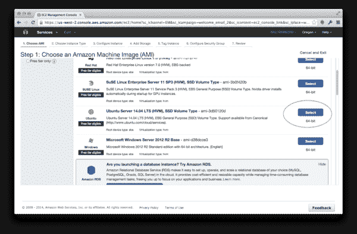
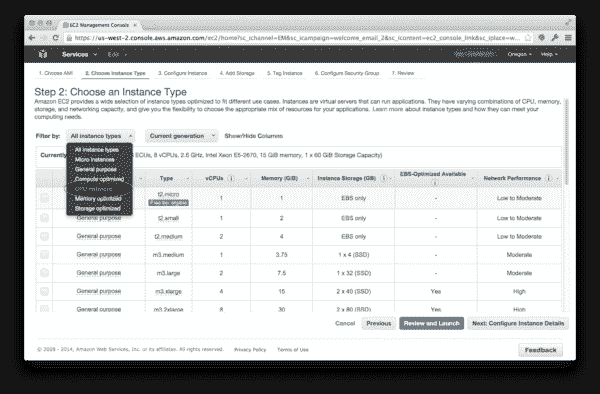
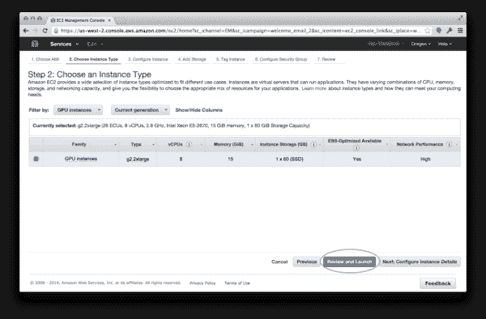
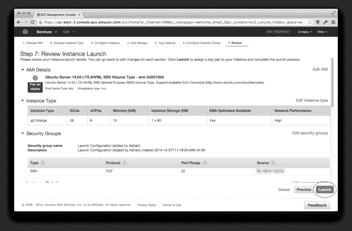
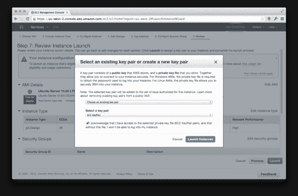
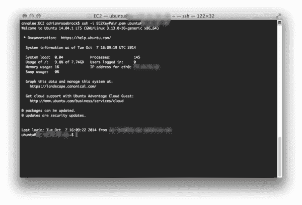
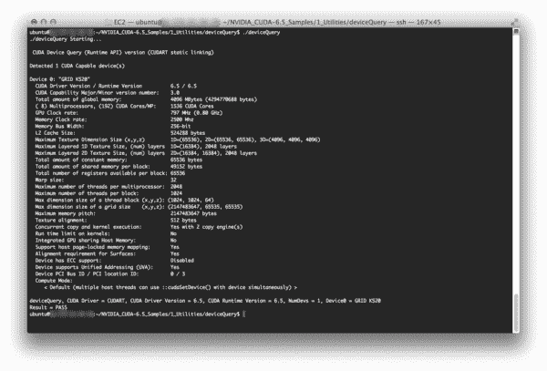

# 用 Python 和 nolearn 在亚马逊 EC2 GPU 上进行深度学习

> 原文：<https://pyimagesearch.com/2014/10/13/deep-learning-amazon-ec2-gpu-python-nolearn/>

[](https://pyimagesearch.com/wp-content/uploads/2014/10/gpu_amazon_ec2_logo.png) 上周我写了一篇文章[，详细介绍了我在 MacBook Pro 上使用 CUDAMat、Deep Belief Networks 和 Python 的体验](https://pyimagesearch.com/2014/10/06/experience-cudamat-deep-belief-networks-python/ "My Experience with CUDAMat, Deep Belief Networks, and Python")。

这篇文章相当长，并且有很多截图来记录我的经历。

**但它的要旨是这样的:**即使在安装了 NVIDIA Cuda SDK 并配置了 CUDAMat 之后，我的 ***CPU*** 在训练我的深度信念网络(由 [nolearn](https://pythonhosted.org/nolearn/) 实现)的速度比我的 ***GPU*** 还要快。你可以想象，我被留在那里挠头。

然而，自从这个帖子上周发布以来，我得到了大量有价值的反馈。

有人告诉我，我的网络不够大，无法完全实现 GPU 加速。我还被告知*我应该使用 [Theano](http://deeplearning.net/software/theano/) 而不是 nolearn* ，因为他们的 GPU 支持更先进。甚至有人建议我应该探索 CUDAMat 的一些编译时选项。最后，我被告知*我不应该使用我的 MacBook Pro 的 GPU* 。

所有这些都是很好的反馈，对我帮助很大——但我并不满意。

在阅读了 Markus Beissinger 关于在 Amazon EC2 GPU 实例上安装 Theano 的精彩帖子后，我决定亲自尝试一下。

但我没有使用 Theano，而是想使用 no learn——主要是想看看我能否在亚马逊云上重现我的 MacBook Pro 遇到的问题。如果我可以复制我的结果，那么我可以得出结论，问题在于 nolearn 库，而不是我的 MacBook Pro 的 GPU。

所以，无论如何，就像上一篇文章一样，这篇文章充满了截图，因为我记录了我通过设置 Amazon EC2 GPU 实例来使用 Python 和 nolearn 训练深度信仰网络的方法。

# 使用 Python 和 nolearn 在 Amazon EC2 GPU 上进行深度学习

如果您还不知道，Amazon 提供了一个 EC2 实例，它提供了对 GPU 的访问以进行计算。

这个实例的名称是 **g2.2xlarge** ，成本大约是每小时 0.65 美元。然而，正如 [Markus 指出的](http://markus.com/install-theano-on-aws/)，通过使用 Spot 实例，你可以将这一成本降低到大约每小时 0.07 美元(当然，前提是你可以处理计算中的中断)。

受 Markus 帖子的启发，我决定建一个自己的 g 2.2x 大操场，找点乐子。

如果你一直关注这篇文章，我会假设你已经有了一个 Amazon AWS 帐户，并且可以设置一个 EC2 实例:

[](https://pyimagesearch.com/wp-content/uploads/2014/10/gpu_select_amazon_os.png)

您需要做的第一件事是为您的实例选择一个操作系统。我选择了 Ubuntu 14.04 LTS (64 位)(ami-3d50120d)。

从那里，您需要选择您需要的实例。Amazon 提供了许多不同层次的实例，每一层都面向您希望执行的计算类型。您有非常适合 web 服务器的通用实例，有适合处理大量数据的高内存服务器，还有可以提高吞吐量的高 CPU 可用性。

在我们的例子中，我们对利用 GPU 感兴趣:

[](https://pyimagesearch.com/wp-content/uploads/2014/10/gpu_gpu_instances.png)

一定要选择“GPU 实例”，只过滤 Amazon 提供的可用 GPU 实例。

您的下一个屏幕应该如下所示:

[](https://pyimagesearch.com/wp-content/uploads/2014/10/gpu_select_gpu_instance.png)这里我要选择 **g2.2xlarge** 实例。需要注意的是，这个实例 ***不是免费的*** ，如果你启动它 ***你将被收费*** 。

启动并运行 g2.2xlarge 实例的下一步是配置您的*安全组*以防止外部访问:

[](https://pyimagesearch.com/wp-content/uploads/2014/10/gpu_launch_instance.png)

点击“启动”按钮，等待您的实例启动。

系统会提示您下载您的*密钥对*，这样您就可以 SSH 到您的服务器。下载密钥对并将其存储在安全的位置:

[](https://pyimagesearch.com/wp-content/uploads/2014/10/gpu_key_pair.png)

等待几分钟，让您的实例启动。

一旦它打开了，你就可以嘘它了。您的 SSH 命令应该如下所示:

```py
$ ssh -i EC2KeyPair.pem ubuntu@<your instance ip address>

```

如果一切顺利，您现在应该登录到您的 g2.2xlarge 实例。下面是我的实例的一个例子:

[](https://pyimagesearch.com/wp-content/uploads/2014/10/gpu_ssh_working.png)到目前为止这是一个极其无痛的过程。幸运的是，在接下来的教程中，它仍然没有痛苦。

为了让您的系统准备好使用 GPU，您需要安装一些包和库。下面我只是简单地重现了马库斯的步骤，并加入了一些我自己的:

**更新默认包:**

```py
$ sudo apt-get update

```

**安装任何 Ubuntu 更新:**

```py
$ sudo apt-get -y dist-upgrade

```

**安装依赖项:**

```py
$ sudo apt-get install -y gcc g++ gfortran build-essential git wget linux-image-generic libopenblas-dev python-dev python-pip python-nose python-numpy python-scipy

```

**安装 LAPACK:**

```py
$ sudo apt-get install -y liblapack-dev

```

**安装 BLAS:**

```py
$ sudo apt-get install -y libblas-dev

```

**获取最新版本的 CUDA 工具包:**

```py
$ wget http://developer.download.nvidia.com/compute/cuda/repos/ubuntu1404/x86_64/cuda-repo-ubuntu1404_6.5-14_amd64.deb

```

**解包工具包:**

```py
$ sudo dpkg -i cuda-repo-ubuntu1404_6.5-14_amd64.deb

```

**添加 CUDA 工具包:**

```py
$ sudo apt-get update

```

**安装 CUDA 工具包:**

```py
$ sudo apt-get install -y cuda

```

**更新你的** `PATH` **:**

```py
$ echo "export PATH=/usr/local/cuda-6.5/bin:$PATH" >> .bashrc
$ echo "export LD_LIBRARY_PATH=/usr/local/cuda-6.5/lib64:$LD_LIBRARY_PATH" >> .bashrc
$ source ~/.bashrc

```

**安装 virtualenv 和 virtualenvwrapper:**

```py
$ pip install virtualenv virtualenvwrapper

```

**配置 virtualenv 和 virtualenvwrapper:**

```py
$ mkdir ~/.virtualenvs
$ export WORKON_HOME=~/.virtualenvs
$ echo ". /usr/local/bin/virtualenvwrapper.sh" >> ~/.bashrc
$ source ~/.bashrc

```

**打造你的深度学习环境:**

```py
$ mkvirtualenv deeplearning

```

**安装 Python 包:**

```py
$ pip install numpy scipy scikit-learn nolearn

```

**编译 CUDAMat:**

```py
$ git clone https://github.com/cudamat/cudamat
$ cd cudamat
$ make

```

我知道。看起来有很多步骤。但老实说，这并不坏，而且我花的时间不超过 10 分钟。

作为一项健康检查，我决定运行`deviceQuery`来确保我的 GPU 正在被拾取:

[](https://pyimagesearch.com/wp-content/uploads/2014/10/gpu_device_query.png)

果然是！

所以现在让我们来训练一个深度的信念网络。打开一个新文件，将其命名为`dbn.py`，并添加以下代码:

```py
# import the necessary packages
from sklearn.cross_validation import train_test_split
from sklearn.metrics import classification_report
from sklearn import datasets
from nolearn.dbn import DBN
import numpy as np

# grab the MNIST dataset (if this is the first time you are running
# this script, this make take a minute -- the 55mb MNIST digit dataset
# will be downloaded)
print "[X] downloading data..."
dataset = datasets.fetch_mldata("MNIST Original")

# scale the data to the range [0, 1] and then construct the training
# and testing splits
(trainX, testX, trainY, testY) = train_test_split(
	dataset.data / 255.0, dataset.target.astype("int0"), test_size = 0.33)

# train the Deep Belief Network with 784 input units (the flattened,
#  28x28 grayscale image), 800 hidden units in the 1st hidden layer,
# 800 hidden nodes in the 2nd hidden layer, and 10 output units (one
# for each possible output classification, which are the digits 1-10)
dbn = DBN(
	[trainX.shape[1], 800, 800, 10],
	learn_rates = 0.3,
	learn_rate_decays = 0.9,
	epochs = 10,
	verbose = 1)
dbn.fit(trainX, trainY)

# compute the predictions for the test data and show a classification
# report
preds = dbn.predict(testX)
print classification_report(testY, preds)

```

注意**第 12 行**。这一行将用于手写数字识别的 MNIST 数据集下载并缓存到您的 EC2 实例中。对这个函数的后续调用会快得多(因为您不必再次下载数据)。我提到这一点是因为如果您正在监控您的训练时间，并且您还没有缓存 MNIST 数据集，您将得到不可靠的结果。

我在深度信念网络上的前一篇文章使用了一个非常小的 DBN——一个 784 个输入的输入层，一个 300 个节点的隐藏层，和一个 10 个节点的输出层，每个节点对应一个可能的数字 1-9。

我注意到，在**更大的网络得到训练**之前，GPU 训练相对于 CPU 训练的加速并没有完全实现。

因此，我不是训练一个小网络，而是训练一个大得多的网络(但与我们今天看到的最先进的网络相比仍然“小”)。

这次我将使用 784 个输入的输入层，800 个节点的隐藏层，800 个节点的第二个隐藏层，最后是 10 个节点的输出层。我将允许我的网络训练 10 个纪元。

当我在我的 CPU 上训练我的深度信念网络时，我得到了以下结果:

```py
(deeplearning)ubuntu@ip-xxx:~/deep-belief-network-gpu$ time python dbn.py
gnumpy: failed to import cudamat. Using npmat instead. No GPU will be used.
[X] downloading data...
[DBN] fitting X.shape=(46900, 784)
[DBN] layers [784, 800, 800, 10]
[DBN] Fine-tune...
100%
Epoch 1:
  loss 0.554249416375
  err  0.139429644809
  (0:00:25)
100%
Epoch 2:
  loss 0.285018297291
  err  0.071956113388
  (0:00:25)
100%
Epoch 3:
  loss 0.216535961656
  err  0.0562884221311
  (0:00:25)
100%
Epoch 4:
  loss 0.1733764816
  err  0.0465975068306
  (0:00:25)
100%
Epoch 5:
  loss 0.145248167361
  err  0.0397242144809
  (0:00:25)
100%
Epoch 6:
  loss 0.118301114211
  err  0.0330430327869
  (0:00:24)
100%
Epoch 7:
  loss 0.0983925512707
  err  0.0277279713115
  (0:00:24)
100%
Epoch 8:
  loss 0.0761229886239
  err  0.0223702185792
  (0:00:24)
100%
Epoch 9:
  loss 0.0661320222977
  err  0.0195099043716
  (0:00:24)
100%
Epoch 10:
  loss 0.0540665843727
  err  0.0165215163934
  (0:00:24)
             precision    recall  f1-score   support

          0       0.99      0.98      0.99      2274
          1       0.98      0.99      0.99      2587
          2       0.97      0.96      0.97      2408
          3       0.96      0.95      0.96      2337
          4       0.95      0.97      0.96      2220
          5       0.97      0.95      0.96      2132
          6       0.96      0.99      0.97      2204
          7       0.97      0.98      0.98      2382
          8       0.96      0.96      0.96      2271
          9       0.96      0.95      0.96      2285

avg / total       0.97      0.97      0.97     23100

real	4m48.487s
user	9m51.390s
sys	28m24.093s

```

差不多 **5 分钟**在 CPU 上进行训练和评估——这是一个很好的起点。

现在，为了训练深度信念网络，我将我编译的`cudamat`目录移动到与`dbn.py`相同的目录中。或者，您可以将`cudamat`目录添加到您的`PATH`中。

```py
(deeplearning)ubuntu@ip-xxx:~/deep-belief-network-gpu$ time python dbn.py[X] downloading data...
[DBN] fitting X.shape=(46900, 784)
[DBN] layers [784, 800, 800, 10]
gnumpy: failed to use gpu_lock. Using board #0 without knowing whether it is in use or not.
[DBN] Fine-tune...
100%
Epoch 1:
  loss 0.37499609756
  err  0.102971311475
  (0:00:08)
100%
Epoch 2:
  loss 0.223706473163
  err  0.0572703210383
  (0:00:08)
100%
Epoch 3:
  loss 0.176561286027
  err  0.0470671106557
  (0:00:08)
100%
Epoch 4:
  loss 0.131326457655
  err  0.036031420765
  (0:00:08)
100%
Epoch 5:
  loss 0.095808146489
  err  0.0266606898907
  (0:00:08)
100%
Epoch 6:
  loss 0.075324679088
  err  0.0217511953552
  (0:00:08)
100%
Epoch 7:
  loss 0.0538377553038
  err  0.0162653688525
  (0:00:08)
100%
Epoch 8:
  loss 0.0431808142149
  err  0.0129567964481
  (0:00:08)
100%
Epoch 9:
  loss 0.0353603169236
  err  0.010843579235
  (0:00:08)
100%
Epoch 10:
  loss 0.0275717724744
  err  0.00823941256831
  (0:00:08)
             precision    recall  f1-score   support

          0       0.99      0.98      0.98      2223
          1       0.99      0.99      0.99      2639
          2       0.96      0.98      0.97      2285
          3       0.97      0.97      0.97      2354
          4       0.99      0.97      0.98      2234
          5       0.98      0.97      0.97      2085
          6       0.98      0.99      0.99      2248
          7       0.99      0.97      0.98      2467
          8       0.97      0.97      0.97      2217
          9       0.96      0.97      0.96      2348

avg / total       0.98      0.98      0.98     23100

real	2m20.350s
user	2m5.786s
sys	0m15.155s

```

在 g2.2xlarge GPU 上进行训练，我能够将训练和评估时间从 **4 分 48 秒**缩短到 **2 分 20 秒**。

这是一个巨大的进步。当然比我在 MacBook Pro 上得到的结果要好。

此外，随着网络规模的增加，GPU 和 CPU 训练时间之间的差异将变得更加显著。

# 摘要

受 [Markus Beissinger 关于使用 Theano 安装用于深度学习的 Amazon EC2 g 2.2x 大型实例的帖子](http://markus.com/install-theano-on-aws/)的启发，我决定对 [nolearn](https://pythonhosted.org/nolearn/) Python 包做同样的事情。

此外，在我试图在我的 MacBook Pro 的 GPU 上训练一个深度信念网络并获得糟糕的结果后，这篇文章也算是一种“救赎”。

总的来说，我发现以下几点很重要:

*   你的 GPU 很重要。很多。大多数笔记本电脑中包含的 GPU 针对能效进行了优化，但不一定针对计算效率。
*   更重要的是: *你的人际网络的规模很重要。*如果您的网络不够大，您不会注意到 CPU 和 GPU 之间的训练时间有显著的改善。
*   将数据传输到 GPU 会产生开销。如果传输的数据量太小，那么 CPU 的运行效率会更高(因为你会把所有的时间都浪费在传输上，而不是计算上)。
*   亚马逊的 g2.2xlarge 实例非常有趣。这确实需要钱(用一下午的快乐换取不到一杯咖啡，这是显而易见的)，但如果你不想花这笔钱购买一个专门用于深度学习的新系统，这是非常值得的。