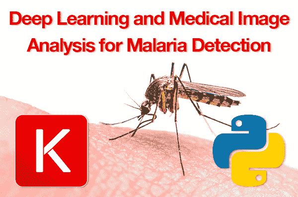
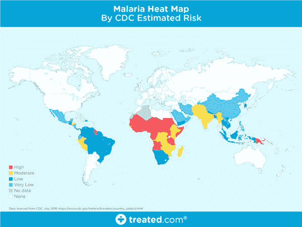
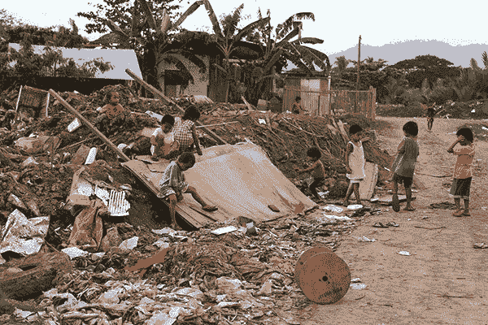
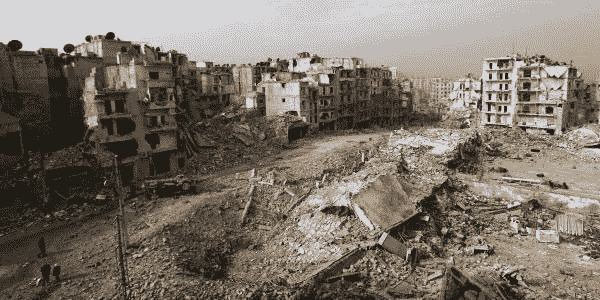
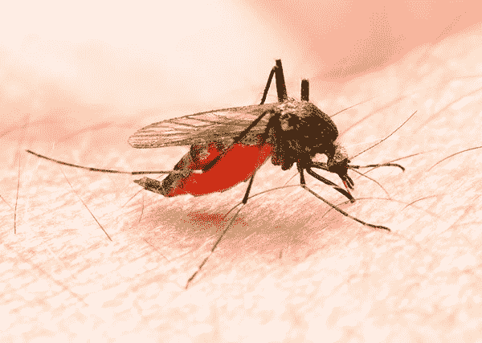
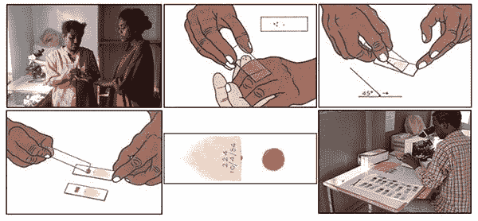
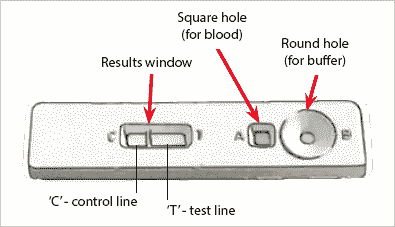
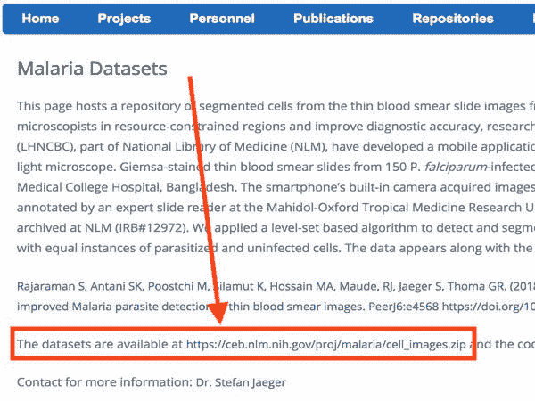
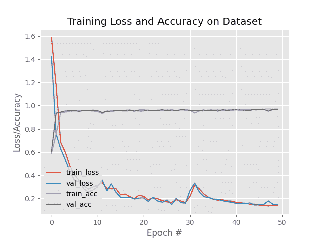

# 基于 Keras 的深度学习和医学图像分析

> 原文：<https://pyimagesearch.com/2018/12/03/deep-learning-and-medical-image-analysis-with-keras/>

[](https://pyimagesearch.com/wp-content/uploads/2018/12/dl_medical_imaging_header.png)

在本教程中，您将学习如何应用深度学习来执行医学图像分析。具体来说，您将发现如何使用 Keras 深度学习库来自动分析用于疟疾测试的医学图像。

**这样的深度学习+医学影像系统可以帮助减少疟疾每年造成的 40 万+死亡。**

今天的教程受到了两个来源的启发。第一条来自 PyImageSearch 的读者 Kali，她在两周前写道:

> 嗨，阿德里安，非常感谢你的教程。在我研究深度学习的时候，他们帮助了我。
> 
> 我生活在非洲的一个疾病多发地区，尤其是疟疾。我希望能够应用计算机视觉来帮助减少疟疾的爆发。
> 
> 有医学影像方面的教程吗？如果你能写一本，我会非常感激。你的知识可以帮助我，也可以帮助我帮助别人。

在我看到 Kali 的电子邮件后不久，我偶然发现了 Johnson Thomas 博士的一篇非常有趣的文章，他是一位执业内分泌学家，他提供了一个很好的基准，总结了美国国家卫生研究院(NIH)使用深度学习建立自动疟疾分类系统的工作。

约翰逊将 NIH 的方法(准确率约为 95.9%)与他在同一疟疾数据集上亲自训练的两个模型(准确率分别为 94.23%和 97.1%)进行了比较。

这让我开始思考——我该如何为深度学习和医学图像分析做出贡献？我如何帮助抗击疟疾？我怎样才能帮助像 Kali 这样的读者开始医学图像分析呢？

为了让这个项目更加有趣，**我决定尽量减少我要写的自定义代码的数量。**

在疾病爆发时，时间是至关重要的——如果我们能够利用预先训练的模型或现有的代码，那就太棒了。我们将能够更快地帮助在该领域工作的医生和临床医生。

**因此，我决定:**

1.  利用我已经为我的书 [*创建的模型和代码示例，用 Python*](https://pyimagesearch.com/deep-learning-computer-vision-python-book/) 进行计算机视觉的深度学习。
2.  并演示如何将这些知识轻松应用到自己的项目中(包括深度学习和医学成像)。

今天超过 75%的代码直接来自我的书，只做了一些修改，使我们能够快速训练一个深度学习模型，能够以(1)训练时间和(2)模型大小的*分之一*复制 NIH 的工作。

**要了解如何将深度学习应用于医学图像分析(更不用说，帮助对抗疟疾流行)，*继续阅读*。**

## 基于 Keras 的深度学习和医学图像分析

***2020-06-16 更新:**此博文现已兼容 TensorFlow 2+!*

在本教程的第一部分，我们将讨论如何将深度学习和医学成像应用于疟疾流行。

从那里，我们将探索我们的疟疾数据库，该数据库包含分为两类的血液涂片图像:疟疾的*阳性*或疟疾的*阴性*。

探索完数据库后，我们将简要回顾一下今天项目的目录结构。

然后，我们将在我们的医学图像上训练一个深度学习模型，以预测给定患者的血液涂片是否对疟疾呈阳性。

最后，我们将回顾我们的结果。

### 深度学习、医学成像和疟疾流行

[](https://pyimagesearch.com/wp-content/uploads/2018/12/dl_medical_imaging_malaria_map.jpg)

**Figure 1:** A world map of areas currently affected by malaria ([source](https://www.treated.com/malaria/world-map-risk)).

疟疾是一种传染病，每年导致超过 40 万人死亡。

疟疾在世界上的一些地区是真正的地方病，这意味着这种疾病在这些地区很常见。

在世界的其他地区，疟疾是一种流行病——它在该地区广泛传播，但还没有达到地方病的程度。

然而，在世界其他地区，即使有，也很少发现疟疾。

那么，是什么让世界上一些地区更容易感染疟疾，而另一些地区却完全没有疟疾呢？

有许多因素使一个地区易受传染病爆发的影响。我们将主要成分介绍如下。

#### 贫困水平

[](https://pyimagesearch.com/wp-content/uploads/2018/12/dl_medical_imaging_poverty.jpg)

**Figure 2:** There is a correlation between areas of poverty and areas affected by malaria.

在评估传染病爆发的风险时，我们通常会检查人口中有多少人处于或低于贫困线。

贫困程度越高，传染病的风险就越高，尽管一些研究人员会说相反的话——疟疾导致贫困。

无论我们都同意的原因是什么，这两者之间都有关联。

#### 获得适当的医疗保健

[](https://pyimagesearch.com/wp-content/uploads/2018/12/dl_medical_imaging_healthcare.jpg)

**Figure 3:** Areas lacking access to proper and modern healthcare can be affected by infectious disease.

世界上低于贫困线的地区很可能无法获得适当的医疗保健。

如果没有良好的医疗保健、适当的治疗以及必要的隔离，传染病会迅速传播。

#### 战争与政府

[](https://pyimagesearch.com/wp-content/uploads/2018/12/dl_medical_imaging_wartorn.jpg)

**Figure 4:** Areas of the world experiencing war have higher poverty levels and lower access to proper healthcare; thus, infectious disease outbreaks are common in these areas ([source](http://www.newindianexpress.com/world/2017/ mar/15/european-union-unveils-reconstruction-plan-for-war-torn-syria-1581395.html)).

这个地区饱受战争蹂躏吗？

政府腐败吗？

一个国家的各个州或地区之间有内讧吗？

不足为奇的是，世界上一个地区，要么有腐败的政府，要么正在经历内战，也将有更高的贫困水平和更低的医疗保障。

此外，腐败的政府不可能在大规模疫情爆发时提供紧急医疗救治或发布适当的隔离令。

#### 疾病传播媒介

[](https://pyimagesearch.com/wp-content/uploads/2018/12/dl_medical_imaging_vectors.jpg)

**Figure 5:** Disease vectors such as mosquitos can carry infectious diseases like malaria.

病媒是携带疾病并将其传播给其他生物的媒介。蚊子因携带疟疾而臭名昭著。

一旦被感染，人也可以成为带菌者，通过输血、器官移植、共用针头/注射器等传播疟疾。

此外，全球气候变暖让蚊子大量繁殖，进一步传播疾病。

如果没有适当的医疗保健，这些传染病可能会导致地方病。

#### 我们如何检测疟疾？

[](https://pyimagesearch.com/wp-content/uploads/2018/12/dl_medical_imaging_malaria_testing.jpg)

**Figure 6:** Two methods of testing for malaria include (1) blood smears, and (2) antigen testing (i.e. rapid tests). These are the two common means of testing for malaria that are most often discussed and used ([source](https://blog.insightdatascience.com/https-blog-insightdatascience-com-malaria-hero-a47d3d5fc4bb)).

我想以我不是临床医生也不是传染病专家来开始这一部分。

我将尽我所能提供一个极其简短的疟疾检测回顾。

如果你想更详细地了解疟疾是如何被检测和诊断的，请参考卡洛斯·阿蒂科·阿里扎的精彩文章。

检测疟疾的方法有很多，但我最常读到的两种方法包括:

1.  血涂片
2.  抗原测试(即快速测试

血液涂片过程可以在上面的**图 6** 中看到:

1.  首先，从病人身上抽取血液样本，然后放在载玻片上。
2.  样本被一种对比剂染色，以帮助突出红细胞中的疟原虫
3.  然后，临床医生在显微镜下检查载玻片，*手动计数*被感染的红细胞数量。

根据世卫组织官方的疟原虫计数协议，*临床医生可能需要手动计数多达 5，000 个细胞，*这是一个极其繁琐和耗时的过程。

为了帮助在实地更快地进行疟疾检测，科学家和研究人员开发了用于快速诊断检测的抗原检测(RDT)。

用于疟疾检测的 RDT 设备示例如下:

[](https://pyimagesearch.com/wp-content/uploads/2018/12/dl_medical_imaging_rdt.png)

**Figure 7:** An antigen test classified as Rapid Diagnosis Testing (RDT) involves a small device that allows a blood sample and buffer to be added. The device performs the test and provides the results. These devices are fast to report a result, but they are also significantly less accurate ([source](https://www.who.int/malaria/areas/diagnosis/rapid-diagnostic-tests/about-rdt/en/)).

在这里，您可以看到一个小装置，可以添加血样和缓冲液。

在内部，设备执行测试并提供结果。

虽然 RDT 比细胞计数快得多，但它们的准确性也差得多。

**因此，理想的解决方案需要将 RDT 的*速度*与显微镜的*精度*结合起来。**

***注:**非常感谢 Carlos Atico Ariza 博士的精彩文章。请参考他的文章，了解更多关于他如何实现机器学习来创建[疟疾英雄](https://github.com/caticoa3/malaria_hero)的信息，这是一个用于筛查和诊断疟疾的开源 web 应用程序。*

#### NIH 提出的深度学习解决方案

2018 年，Rajaraman 等人发表了一篇题为 [*的论文，将预训练的卷积神经网络作为特征提取器，用于改进薄血涂片图像中的寄生虫检测*](https://lhncbc.nlm.nih.gov/system/files/pub9752.pdf) 。

在他们的工作中，Rajaraman 等人利用了六个预训练的卷积神经网络，包括:

*   AlexNet
*   VGG-16
*   ResNet-50
*   Xception
*   DenseNet-121
*   他们创造的定制模型

特征提取和随后的训练花了 24 小时多一点，获得了令人印象深刻的 95.9%的准确率。

**这里的问题是使用的模型数量— *效率低下*。**

想象一下，作为一名身处偏远地区的现场工作人员，拥有一台预装了这些疟疾分类模型的设备。

这样的模型必须是某种组合:

1.  电池供电的
2.  需要电源(即插在墙上)
3.  连接到云(需要互联网连接)

让我们进一步分解这个问题:

1.  在世界上偏远、贫困的地区，可能无法找到可靠的电源 —电池供电会更好，只要有电就可以充电。
2.  但是，如果你使用电池供电的设备，你的计算能力会更低——尝试运行所有六种型号会更快地耗尽你的电池。
3.  **所以，如果电池寿命是一个问题，我们应该利用云**——但如果你使用云，你依赖于一个可靠的互联网连接，你可能有也可能没有。

很明显，我强调了每一项的最坏情况。你当然可以运用一点工程技术，创建一个智能手机应用程序，如果互联网连接可用，它会将医学图像推送到云端，然后退回到使用手机上本地存储的模型，但我想你明白我的意思。

**总的来说，最好是:**

1.  获得与 NIH 相同的准确度
2.  一个更小，计算效率更高的模型
3.  可以轻松部署到边缘和物联网(IoT)设备

在今天余下的教程中，我将向你展示如何做到这一点。

### 我们的疟疾数据库

[](https://pyimagesearch.com/wp-content/uploads/2018/12/dl_medical_imaging_malaria_dataset.jpg)

**Figure 8:** A subset of the Malaria Dataset provided by the National Institute of Health (NIH). We will use this dataset to develop a deep learning medical imaging classification model with Python, OpenCV, and Keras.

我们将在今天的深度学习和医学图像分析教程中使用的疟疾数据集与 Rajaraman 等人在 2018 年的出版物中使用的数据集完全相同。

数据集本身可以在[NIH 官方网页上找到:](https://ceb.nlm.nih.gov/repositories/malaria-datasets/)

[](https://pyimagesearch.com/wp-content/uploads/2018/12/dl_medical_imaging_nih_dataset.jpg)

**Figure 9:** The National Institute of Health (NIH) has made their Malaria Dataset available to the public [on their website](https://ceb.nlm.nih.gov/repositories/malaria-datasets/).

**如果您按照教程进行操作，您会想要将`cell_images.zip`文件下载到您的本地机器上。**

该数据集由 27，588 幅图像组成，属于两个独立的类别:

1.  **寄生:**暗示该地区有疟疾。
2.  **未感染:**表示该地区没有疟疾的迹象。

每个类别的图像数量平均分布，每个相应类别有 13，794 个图像。

### 配置您的开发环境

要针对本教程配置您的系统，我建议您遵循以下任一教程:

*   [*如何在 Ubuntu 上安装 tensor flow 2.0*](https://pyimagesearch.com/2019/12/09/how-to-install-tensorflow-2-0-on-ubuntu/)
*   [*如何在 macOS 上安装 tensor flow 2.0*](https://pyimagesearch.com/2019/12/09/how-to-install-tensorflow-2-0-on-macos/)

这两个教程都将帮助您在一个方便的 Python 虚拟环境中，用这篇博文所需的所有软件来配置您的系统。

请注意 [PyImageSearch 不推荐也不支持 CV/DL 项目](https://pyimagesearch.com/faqs/single-faq/can-you-help-me-do-___-on-windows/)的窗口。

### 项目结构

一定要抢到 ***【下载】*** 的帖子。没有包括数据集，但是本节中的说明也将向您展示如何下载它。

首先，更改目录并解压缩文件:

```py
$ cd /path/where/you/downloaded/the/files
$ unzip dl-medical-imaging.zip

```

然后将目录切换到项目文件夹中，并在其中创建一个`malaria/`目录+ `cd`:

```py
$ cd dl-medical-imaging
$ mkdir malaria
$ cd malaria

```

接下来，下载数据集(到您当前应该“在”的`dl-medical-imaging/malaria/`目录中):

```py
$ wget https://ceb.nlm.nih.gov/proj/malaria/cell_images.zip
$ unzip cell_images.zip

```

如果您没有`tree`包，您将需要它:

```py
$ sudo apt-get install tree # for Ubuntu
$ brew install tree # for macOS

```

现在让我们切换回父目录:

```py
$ cd ..

```

最后，现在让我们使用 tree 命令来检查我们的项目结构:

```py
$ tree --dirsfirst --filelimit 10
.
├── malaria
│   ├── cell_images.zip
│   └── cell_images
│   │   ├── Parasitized [13780 entries]
│   │   └── Uninfected [13780 entries]
├── pyimagesearch
│   ├── __init__.py
│   ├── config.py
│   └── resnet.py
├── build_dataset.py
├── train_model.py
└── plot.png

5 directories, 7 files

```

NIH 疟疾数据集位于`malaria/`文件夹中。里面的东西已经被解压了。用于培训和测试的`cell_images/`分为`Parasitized/`或`Uninfected/`。

`pyimagesearch`模块就是`pyimagesearch/`目录。经常有人问我如何 pip-install pyimagesearch。不可以！它简单地包含在博文 ***【下载】*** 中。今天的`pyimagesearch`模块包括:

*   `config.py`:配置文件。我选择直接使用 Python，而不是 YAML/JSON/XML/等等。阅读下一节，在我们查看配置文件时找出原因。
*   `resnet.py`:这个文件包含了用 Python 进行计算机视觉深度学习的 [*中包含的精确 ResNet 模型类。在我的深度学习一书中，我演示了如何复制 2015 年 ResNet 学术出版物中的 ResNet 模型，何等人的*](https://pyimagesearch.com/deep-learning-computer-vision-python-book/) *[*用于图像识别的深度残差学习*](https://arxiv.org/abs/1512.03385)；我还展示了如何在 [CIFAR-10](https://www.cs.toronto.edu/~kriz/cifar.html) 、Tiny ImageNet 和 [ImageNet](http://image-net.org/) 上训练 ResNet，向您介绍我的每个实验以及我更改了哪些参数及其原因。*

今天我们将回顾两个 Python 脚本:

*   这个文件将把我们的疟疾细胞图像数据集分割成训练集、验证集和测试集。
*   在这个脚本中，我们将使用 Keras 和我们的 ResNet 模型来训练一个疟疾分类器。

但是首先，让我们从查看两个脚本都需要的配置文件开始！

### 我们的配置文件

当从事更大的深度学习项目时，我喜欢创建一个`config.py`文件来存储我所有的常量变量。

我也可以使用 JSON、YAML 或等效文件，但是能够将 Python 代码直接引入到您的配置中也不错。

现在让我们回顾一下`config.py`文件:

```py
# import the necessary packages
import os

# initialize the path to the *original* input directory of images
ORIG_INPUT_DATASET = "malaria/cell_images"

# initialize the base path to the *new* directory that will contain
# our images after computing the training and testing split
BASE_PATH = "malaria"

# derive the training, validation, and testing directories
TRAIN_PATH = os.path.sep.join([BASE_PATH, "training"])
VAL_PATH = os.path.sep.join([BASE_PATH, "validation"])
TEST_PATH = os.path.sep.join([BASE_PATH, "testing"])

# define the amount of data that will be used training
TRAIN_SPLIT = 0.8

# the amount of validation data will be a percentage of the
# *training* data
VAL_SPLIT = 0.1

```

让我们简要回顾一下配置，我们:

*   定义细胞图像原始数据集的路径(**第 5 行**)。
*   设置我们的数据集基本路径(**第 9 行**)。
*   建立输出训练、验证和测试目录的路径(**第 12-14 行**)。`build_dataset.py`文件将负责在您的文件系统中创建路径。
*   定义我们的培训/测试划分，其中 80%的数据用于培训，其余 20%用于测试(**第 17 行**)。
*   设置我们的验证分割，其中 80%用于培训，我们将拿出 10%用于验证(**第 21 行**)。

现在让我们建立我们的数据集！

### 构建我们的深度学习+医学图像数据集

我们的疟疾数据集没有用于训练、验证和测试的预分割数据，因此我们需要自己执行分割。

为了创建我们的数据分割，我们将使用`build_dataset.py`脚本—该脚本将:

1.  获取所有示例图像的路径，并随机洗牌。
2.  将映像路径分为培训、验证和测试。
3.  在`malaria/`目录下新建三个子目录，分别是`training/`、`validation/`和`testing/`。
4.  自动将图像复制到相应的目录中。

要查看数据分割过程是如何执行的，打开`build_dataset.py`并插入以下代码:

```py
# import the necessary packages
from pyimagesearch import config
from imutils import paths
import random
import shutil
import os

# grab the paths to all input images in the original input directory
# and shuffle them
imagePaths = list(paths.list_images(config.ORIG_INPUT_DATASET))
random.seed(42)
random.shuffle(imagePaths)

```

我们的包装是在**2-6 线**进口的。请注意，我们正在从`pyimagesearch`导入`config`，从`imutils`导入`paths`。

在第**行第 10-12** 行，来自疟疾数据集的图像被抓取并混洗。

现在，让我们拆分数据:

```py
# compute the training and testing split
i = int(len(imagePaths) * config.TRAIN_SPLIT)
trainPaths = imagePaths[:i]
testPaths = imagePaths[i:]

# we'll be using part of the training data for validation
i = int(len(trainPaths) * config.VAL_SPLIT)
valPaths = trainPaths[:i]
trainPaths = trainPaths[i:]

```

上面代码块中的行计算训练和测试拆分。

首先，我们计算列车/测试分流的指标(**15 号线**)。然后使用索引和一点数组切片，我们将数据分成`trainPaths`和`testPaths` ( **第 16 行和第 17 行**)。

同样，我们从`trainPaths` ( **第 20 行**)计算训练/验证分割的指数。然后我们把图像路径分成`valPaths`和`trainPaths` ( **第 21 行和第 22 行**)。是的，`trainPaths`被重新分配，因为正如我在上一节中所述，*“…在这 80%的培训中，我们将拿出 10%用于验证”。*

现在，我们已经将图像路径组织到各自的分割中，让我们定义将要构建的数据集:

```py
# define the datasets that we'll be building
datasets = [
	("training", trainPaths, config.TRAIN_PATH),
	("validation", valPaths, config.VAL_PATH),
	("testing", testPaths, config.TEST_PATH)
]

```

在这里，我创建了一个三元组列表(称为`datasets`)，包含:

1.  拆分的名称
2.  分割的图像路径
3.  拆分的输出目录的路径

有了这些信息，我们可以开始循环每个`datasets`:

```py
# loop over the datasets
for (dType, imagePaths, baseOutput) in datasets:
	# show which data split we are creating
	print("[INFO] building '{}' split".format(dType))

	# if the output base output directory does not exist, create it
	if not os.path.exists(baseOutput):
		print("[INFO] 'creating {}' directory".format(baseOutput))
		os.makedirs(baseOutput)

	# loop over the input image paths
	for inputPath in imagePaths:
		# extract the filename of the input image along with its
		# corresponding class label
		filename = inputPath.split(os.path.sep)[-1]
		label = inputPath.split(os.path.sep)[-2]

		# build the path to the label directory
		labelPath = os.path.sep.join([baseOutput, label])

		# if the label output directory does not exist, create it
		if not os.path.exists(labelPath):
			print("[INFO] 'creating {}' directory".format(labelPath))
			os.makedirs(labelPath)

		# construct the path to the destination image and then copy
		# the image itself
		p = os.path.sep.join([labelPath, filename])
		shutil.copy2(inputPath, p)

```

在第 32 行**上，我们开始遍历数据集类型、图像路径和输出目录。**

如果输出目录不存在，我们创建它(**第 37-39 行**)。

然后我们从第**行第 42** 开始遍历路径本身。在循环中，我们:

*   提取`filename` + `label` ( **第 45 行和第 46 行**)。
*   如有必要，创建子目录(**第 49-54 行**)。
*   将实际图像文件本身复制到子目录中(**第 58 行和第 59 行**)。

* * *

为了构建您的疟疾数据集，请确保您已经(1)使用本指南的 ***【下载】*** 部分下载了源代码+项目结构，并且(2)已经从 NIH 的网站正确下载了`cell_images.zip`文件。

从那里，打开一个终端并执行以下命令:

```py
$ python build_dataset.py
[INFO] building 'training' split
[INFO] 'creating malaria/training' directory
[INFO] 'creating malaria/training/Uninfected' directory
[INFO] 'creating malaria/training/Parasitized' directory
[INFO] building 'validation' split
[INFO] 'creating malaria/validation' directory
[INFO] 'creating malaria/validation/Uninfected' directory
[INFO] 'creating malaria/validation/Parasitized' directory
[INFO] building 'testing' split
[INFO] 'creating malaria/testing' directory
[INFO] 'creating malaria/testing/Uninfected' directory
[INFO] 'creating malaria/testing/Parasitized' directory

```

脚本本身应该只需要几秒钟就可以创建目录和复制映像，即使是在一台功率适中的机器上。

检查`build_dataset.py`的输出，您可以看到我们的数据分割已经成功创建。

让我们再看一下我们的项目结构，只是为了好玩:

```py
$ tree --dirsfirst --filelimit 10
.
├── malaria
│   ├── cell_images
│   │   ├── Parasitized [13780 entries]
│   │   └── Uninfected [13780 entries]
│   ├── testing
│   │   ├── Parasitized [2726 entries]
│   │   └── Uninfected [2786 entries]
│   ├── training
│   │   ├── Parasitized [9955 entries]
│   │   └── Uninfected [9887 entries]
│   ├── validation
│   │   ├── Parasitized [1098 entries]
│   │   └── Uninfected [1106 entries]
│   └── cell_images.zip
├── pyimagesearch
│   ├── __init__.py
│   ├── config.py
│   └── resnet.py
├── build_dataset.py
├── train_model.py
└── plot.png

15 directories, 9 files

```

请注意，新目录已经在`malaria/`文件夹中创建，图像已经复制到其中。

### 训练用于医学图像分析的深度学习模型

现在，我们已经创建了我们的数据拆分，让我们继续为医学图像分析训练我们的深度学习模型。

正如我在本教程前面提到的，我的目标是尽可能多地重用我的书《用 Python 进行计算机视觉的深度学习[](https://pyimagesearch.com/deep-learning-computer-vision-python-book/)*中章节的代码。事实上， ***以上的代码*** 的 75%+都是直接来自文本和代码示例。*

 *对于医学图像分析来说，时间是至关重要的，因此我们越依赖可靠、稳定的代码就越好。

正如我们将看到的，我们将能够使用这个代码获得 97%的准确率。

让我们开始吧。

打开`train_model.py`脚本并插入以下代码:

```py
# set the matplotlib backend so figures can be saved in the background
import matplotlib
matplotlib.use("Agg")

# import the necessary packages
from tensorflow.keras.preprocessing.image import ImageDataGenerator
from tensorflow.keras.callbacks import LearningRateScheduler
from tensorflow.keras.optimizers import SGD
from pyimagesearch.resnet import ResNet
from pyimagesearch import config
from sklearn.metrics import classification_report
from imutils import paths
import matplotlib.pyplot as plt
import numpy as np
import argparse

# construct the argument parser and parse the arguments
ap = argparse.ArgumentParser()
ap.add_argument("-p", "--plot", type=str, default="plot.png",
	help="path to output loss/accuracy plot")
args = vars(ap.parse_args())
```

既然您遵循了我在*“安装必要的软件”*部分的指示，那么您应该准备好使用**行 2-15** 上的导入。

我们使用`keras`来训练我们的医学图像深度学习模型，使用`sklearn`来打印`classification_report`，从我们的数据集中抓取`paths`，使用`numpy`进行数值处理，使用`argparse`进行命令行参数解析。

棘手的是`matplotlib`。因为我们要将我们的绘图保存到磁盘上(在我的例子中，是在一台无头机器上)，我们需要使用`"Agg"`后端(**行 3** )。

**第 9 行**导入我的`ResNet`架构实现。

我们不会在本教程中涉及 ResNet 架构，但如果你有兴趣了解更多，请务必参考[官方 ResNet 出版物](https://arxiv.org/abs/1512.03385)以及 [*使用 Python 进行计算机视觉的深度学习*](https://pyimagesearch.com/deep-learning-computer-vision-python-book/) ，在那里我详细回顾了 ResNet。

我们有一个单独的[命令行参数](https://pyimagesearch.com/2018/03/12/python-argparse-command-line-arguments/)，它在**的第 18-21 行**、`--plot`被解析。默认情况下，我们的绘图将放在当前工作目录中，并命名为`plot.png`。或者，当您执行程序时，可以在命令行提供不同的文件名/路径。

现在让我们设置我们的训练参数，并定义我们的学习率衰减函数:

```py
# define the total number of epochs to train for along with the
# initial learning rate and batch size
NUM_EPOCHS = 50
INIT_LR = 1e-1
BS = 32

def poly_decay(epoch):
	# initialize the maximum number of epochs, base learning rate,
	# and power of the polynomial
	maxEpochs = NUM_EPOCHS
	baseLR = INIT_LR
	power = 1.0

	# compute the new learning rate based on polynomial decay
	alpha = baseLR * (1 - (epoch / float(maxEpochs))) ** power

	# return the new learning rate
	return alpha

```

在第 25-26 行上，我们定义了时期数、初始学习率和批量大小。

我发现针对`NUM_EPOCHS = 50`(训练迭代)的训练效果很好。对于大多数系统(CPU)来说，`BS = 32`(批处理大小)已经足够了，但是如果您使用 GPU，您可以将该值增加到 64 或更高。我们的`INIT_LR = 1e-1`(初始学习率)会根据`poly_decay`函数衰减。

我们的`poly_dcay`功能在**第 29-40 行**中定义。这个函数将帮助我们在每个时期后衰减我们的学习率。我们正在设置`power = 1.0`，它有效地将我们的多项式衰减变成了*线性衰减。*魔术发生在**线 37** 上的衰减方程中，其结果返回到**线 40** 上。

接下来，我们来看看训练集、验证集和测试集中图像路径的数量:

```py
# determine the total number of image paths in training, validation,
# and testing directories
totalTrain = len(list(paths.list_images(config.TRAIN_PATH)))
totalVal = len(list(paths.list_images(config.VAL_PATH)))
totalTest = len(list(paths.list_images(config.TEST_PATH)))

```

我们将需要这些量值来确定验证/测试过程中每个时期的总步骤数。

让我们应用数据扩充(我几乎总是为每个深度学习数据集推荐这个过程):

```py
# initialize the training training data augmentation object
trainAug = ImageDataGenerator(
	rescale=1 / 255.0,
	rotation_range=20,
	zoom_range=0.05,
	width_shift_range=0.05,
	height_shift_range=0.05,
	shear_range=0.05,
	horizontal_flip=True,
	fill_mode="nearest")

# initialize the validation (and testing) data augmentation object
valAug = ImageDataGenerator(rescale=1 / 255.0)
```

在**第 49-57 行**上，我们初始化我们的`ImageDataGenerator`，它将被用于通过随机移动、翻译和翻转每个训练样本来应用数据扩充。我在使用 Python 进行计算机视觉深度学习的 [*的*实践者包*中介绍了数据增强的概念。*](https://pyimagesearch.com/deep-learning-computer-vision-python-book/)

验证图像数据生成器将*而不是*执行任何数据扩充( **行 60** )。相反，它会简单地将我们的像素值重新调整到范围*【0，1】*，就像我们对训练生成器所做的那样。请注意，我们将使用`valAug`进行验证和测试。

让我们初始化我们的训练、验证和测试生成器:

```py
# initialize the training generator
trainGen = trainAug.flow_from_directory(
	config.TRAIN_PATH,
	class_mode="categorical",
	target_size=(64, 64),
	color_mode="rgb",
	shuffle=True,
	batch_size=BS)

# initialize the validation generator
valGen = valAug.flow_from_directory(
	config.VAL_PATH,
	class_mode="categorical",
	target_size=(64, 64),
	color_mode="rgb",
	shuffle=False,
	batch_size=BS)

# initialize the testing generator
testGen = valAug.flow_from_directory(
	config.TEST_PATH,
	class_mode="categorical",
	target_size=(64, 64),
	color_mode="rgb",
	shuffle=False,
	batch_size=BS)
```

在这个块中，我们创建了用于从输入目录加载图像的 Keras 生成器。

`flow_from_directory`功能假设:

1.  数据分割有一个基本输入目录。
2.  在基本输入目录中，有 *N* 个子目录，每个子目录对应一个类标签。

请务必[查看 Keras 预处理文档](https://keras.io/preprocessing/image/)以及我们提供给上面每个生成器的参数。值得注意的是，我们:

*   将`class_mode`设置为等于`categorical`,以确保 Keras 对类标签执行一键编码。
*   将所有图像的大小调整为`64 x 64`像素。
*   设置我们的`color_mode`到`"rgb"`频道排序。
*   仅为训练发生器打乱图像路径。
*   使用批量大小`BS = 32`。

让我们初始化`ResNet`并编译模型:

```py
# initialize our ResNet model and compile it
model = ResNet.build(64, 64, 3, 2, (3, 4, 6),
	(64, 128, 256, 512), reg=0.0005)
opt = SGD(lr=INIT_LR, momentum=0.9)
model.compile(loss="binary_crossentropy", optimizer=opt,
	metrics=["accuracy"])
```

在**第 90 行**上，我们初始化 ResNet:

*   图像为`64 x 64 x 3` (3 通道 RGB 图像)。
*   我们总共有`2`门课。
*   ResNet 将使用`(64, 128, 256, 512)` CONV 层执行`(3, 4, 6)`堆叠，这意味着:
    *   在减少空间维度之前，ResNet 中的第一个 CONV 图层将有`64`个总过滤器。
    *   然后我们会堆叠`3`组剩余模块。每个残差模块中的三个 CONV 层将分别学习 32、32 和`128` CONV 滤波器。然后我们降低空间维度。
*   接下来，我们堆叠 4 组剩余模块，其中三个 CONV 层中的每一个都将 64、64 和`256`过滤。同样，空间维度也随之减少
*   最后，我们堆叠 6 组残差模块，其中每个 CONV 层学习 128、128 和`512`滤波器。在执行平均汇集和应用 softmax 分类器之前，最后一次降低空间维度。

同样，如果您有兴趣了解 ResNet 的更多信息，包括如何从头开始实现它，请参考使用 Python 进行计算机视觉深度学习的[](https://pyimagesearch.com/deep-learning-computer-vision-python-book/)*。*

 ***第 92 行**用默认初始学习`1e-1`和动量项`0.9`初始化 SGD 优化器。

**第 93 行和第 94 行**使用`binary_crossentropy`作为我们的损失函数来编译实际的模型(因为我们正在执行二元 2 类分类)。对于两个以上的类，我们将使用`categorical_crossentropy`。

我们现在准备训练我们的模型:

```py
# define our set of callbacks and fit the model
callbacks = [LearningRateScheduler(poly_decay)]
H = model.fit(
	x=trainGen,
	steps_per_epoch=totalTrain // BS,
	validation_data=valGen,
	validation_steps=totalVal // BS,
	epochs=NUM_EPOCHS,
	callbacks=callbacks)
```

***2020-06-16 更新:*** *以前，TensorFlow/Keras 需要使用一种叫做`.fit_generator`的方法来完成数据扩充。现在，`.fit`方法也可以处理数据扩充，使代码更加一致。这也适用于从`.predict_generator`到`.predict`的迁移(在下一个代码块中)。请务必查看我关于 [fit 和 fit_generator](https://pyimagesearch.com/2018/12/24/how-to-use-keras-fit-and-fit_generator-a-hands-on-tutorial/) 以及[数据扩充](https://pyimagesearch.com/2019/07/08/keras-imagedatagenerator-and-data-augmentation/)的文章。*

在第 97 行的**上，我们创建了我们的`callbacks`集合。回调在每个时期结束时执行。在我们的例子中，我们应用我们的[基于多项式衰减的学习速率调度器](https://pyimagesearch.com/2019/07/22/keras-learning-rate-schedules-and-decay/)在每个时期后衰减我们的学习速率。**

我们在第 98-104 行**上的`model.fit`调用**指示我们的脚本开始我们的训练过程。

`trainGen`生成器将自动(1)从磁盘加载我们的图像,( 2)从图像路径解析类标签。

同样，`valGen`将做同样的过程，只针对验证数据。

让我们评估一下测试数据集的结果:

```py
# reset the testing generator and then use our trained model to
# make predictions on the data
print("[INFO] evaluating network...")
testGen.reset()
predIdxs = model.predict(x=testGen, steps=(totalTest // BS) + 1)

# for each image in the testing set we need to find the index of the
# label with corresponding largest predicted probability
predIdxs = np.argmax(predIdxs, axis=1)

# show a nicely formatted classification report
print(classification_report(testGen.classes, predIdxs,
	target_names=testGen.class_indices.keys()))
```

现在模型已经训练好了，我们可以在测试集上进行评估。

**第 109 行**在技术上可以删除，但无论何时使用 Keras 数据发生器，您都应该养成在评估前重置它的习惯。

为了评估我们的模型，我们将对测试数据进行预测，并随后为测试集中的每个图像找到具有最大概率的标签(**行 110-114** )。

然后我们将`print`我们的`classification_report`在终端中以可读的格式(**第 117 行和第 118 行**)。

最后，我们将绘制我们的训练数据:

```py
# plot the training loss and accuracy
N = NUM_EPOCHS
plt.style.use("ggplot")
plt.figure()
plt.plot(np.arange(0, N), H.history["loss"], label="train_loss")
plt.plot(np.arange(0, N), H.history["val_loss"], label="val_loss")
plt.plot(np.arange(0, N), H.history["accuracy"], label="train_acc")
plt.plot(np.arange(0, N), H.history["val_accuracy"], label="val_acc")
plt.title("Training Loss and Accuracy on Dataset")
plt.xlabel("Epoch #")
plt.ylabel("Loss/Accuracy")
plt.legend(loc="lower left")
plt.savefig(args["plot"])
```

***2020-06-16 更新:*** *为了使这个绘图片段与 TensorFlow 2+兼容，更新了`H.history`字典键，以完全拼出“acc”而没有“ACC”(即`H.history["val_accuracy"]`和`H.history["accuracy"]`)。“val”没有拼成“validation”，这有点令人困惑；我们必须学会热爱 API 并与之共存，并永远记住这是一项正在进行的工作，世界各地的许多开发人员都为此做出了贡献。*

**第 121-131 行**生成用于训练和验证的准确度/损失图。

为了将我们的绘图保存到磁盘，我们调用`.savefig` ( **第 132 行**)。

### 医学图像分析结果

现在，我们已经编写了我们的训练脚本，让我们继续为医学图像分析训练我们的 Keras 深度学习模型。

如果您还没有，请确保您(1)使用今天教程的 ***【下载】*** 部分获取源代码+项目结构，并且(2)从[官方 NIH 疟疾数据集](https://ceb.nlm.nih.gov/repositories/malaria-datasets/)页面下载`cell_images.zip`文件。我建议遵循我上面的项目结构。

在那里，您可以使用以下命令开始训练:

```py
$ python train_model.py
Found 19842 images belonging to 2 classes.
Found 2204 images belonging to 2 classes.
Found 5512 images belonging to 2 classes.
Epoch 1/50
620/620 [==============================] - 29s 47ms/step - loss: 1.5878 - accuracy: 0.5893 - val_loss: 1.4247 - val_accuracy: 0.6075 - lr: 0.1000
Epoch 2/50
620/620 [==============================] - 24s 39ms/step - loss: 1.1723 - accuracy: 0.7534 - val_loss: 0.7597 - val_accuracy: 0.9334 - lr: 0.0980
Epoch 3/50
620/620 [==============================] - 24s 38ms/step - loss: 0.6843 - accuracy: 0.9387 - val_loss: 0.6271 - val_accuracy: 0.9430 - lr: 0.0960
...
Epoch 48/50
620/620 [==============================] - 24s 39ms/step - loss: 0.1354 - accuracy: 0.9691 - val_loss: 0.1791 - val_accuracy: 0.9508 - lr: 0.0060
Epoch 49/50
620/620 [==============================] - 24s 39ms/step - loss: 0.1414 - accuracy: 0.9669 - val_loss: 0.1487 - val_accuracy: 0.9660 - lr: 0.0040
Epoch 50/50
620/620 [==============================] - 24s 38ms/step - loss: 0.1383 - accuracy: 0.9683 - val_loss: 0.1474 - val_accuracy: 0.9642 - lr: 0.0020
[INFO] evaluating network...
              precision    recall  f1-score   support

 Parasitized       0.97      0.95      0.96      2786
  Uninfected       0.95      0.97      0.96      2726

    accuracy                           0.96      5512
   macro avg       0.96      0.96      0.96      5512
weighted avg       0.96      0.96      0.96      5512

```

[](https://pyimagesearch.com/wp-content/uploads/2018/12/dl_medical_imaging_plot.png)

**Figure 10:** Our malaria classifier model training/testing accuracy and loss plot shows that we’ve achieved high accuracy and low loss. The model isn’t exhibiting signs of over/underfitting. This deep learning medical imaging “malaria classifier” model was created with ResNet architecture using Keras/TensorFlow.

这里我们可以看到我们的模型总共被训练了 50 个时期。

在一个 Titan X GPU 上，每个纪元大约需要 65 秒。

**总的来说，整个训练过程只花了*54 分钟*** ( *明显比 NIH 的方法 24 小时的训练过程快*)。在第 50 个纪元结束时，我们在*训练、* *验证、*和*测试*数据上获得了 **96%的准确度**。

使用我们今天在这里培训的基于 ResNet 的模型进行医学图像分析有很多好处。

首先，**我们的模型是一个完整的端到端疟疾分类系统。**

与 NIH 的方法不同，NIH 的方法利用了(1)从多个模型中提取特征和(2)分类的多步骤过程，相反，我们可以仅利用*单个紧凑模型*并获得可比较的结果。

说到紧凑性，我们的序列化模型文件只有 **17.7MB** 。量化模型中的权重本身将允许我们获得一个模型 **< 10MB** (或者甚至更小，取决于量化方法)，如果有的话，精确度只有轻微的降低。

我们的方法在两个方面也更快。

首先，与 NIH 的方法相比，训练我们的模型需要更少的时间。

我们的模型只花了 **54 分钟来训练**，而 NIH 的模型花了大约 24 小时。

第二，我们的模型在(1)前向传递推理时间和(2)明显更少的参数和存储器/硬件需求方面更快。

考虑到 NIH 的方法需要预先训练的网络来进行特征提取。

每个模型都接受输入图像空间尺寸在 224×244、227×227 和 299×299 像素范围内的输入图像。

我们的模型只需要 64×64 的输入图像，并且获得了几乎相同的精度。

尽管如此，我已经*而不是*进行了全面的准确性、敏感性和特异性测试，但根据我们的结果，我们可以看到，我们正在创建一个自动疟疾分类器，它不仅*更准确*，而且*明显更小*，需要*更少的处理能力*。

我的希望是，你将使用今天关于深度学习和医学成像分析的教程中的知识，并将其应用于自己的医学成像问题。

## 摘要

在今天的博文中，你学习了如何将深度学习应用于医学图像分析；特别是疟疾预测。

疟疾是一种传染病，通常通过蚊子传播。鉴于蚊子的快速繁殖周期，疟疾在世界一些地区已经成为真正的地方病，而在另一些地区则成为流行病。总之，每年有 40 多万人死于疟疾。

NIH 开发了一种移动应用程序，当与智能手机上的特殊显微镜附件镜头结合时，现场临床医生可以自动预测接受血液涂片检查的患者的疟疾风险因素。NIH 的模型结合了六个独立的最先进的深度学习模型，花了大约 24 小时进行训练。

总的来说，他们获得了 **~95.9%的准确率**。

使用今天的教程中讨论的模型，ResNet 的一个较小的变体，其模型大小仅为 **17.7MB** ，我们能够在仅 **54 分钟**内获得 **96%的准确性**。

**此外，今天教程中使用的 75%以上的代码来自我的书 [*用 Python 进行计算机视觉的深度学习*](https://pyimagesearch.com/deep-learning-computer-vision-python-book/) 。**

只需*很少的努力*就可以从书中获得代码示例和技术，然后将其应用于一个定制的医学图像分析问题。

在疾病爆发期间，时间是至关重要的，能够利用现有的代码和模型可以减少工程师/培训时间，确保模型更快地投入使用，并最终帮助医生和临床医生更好地治疗患者(最好还能挽救生命)。

我希望你喜欢今天关于医学图像分析深度学习的帖子！

**要下载今天帖子的源代码，并在以后的帖子在 PyImageSearch 上发布时得到通知，*只需在下面的表格中输入您的电子邮件地址！*****