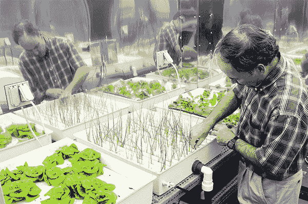
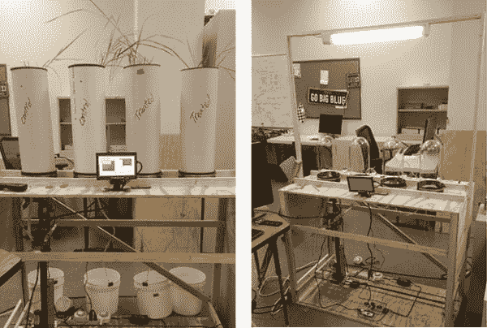
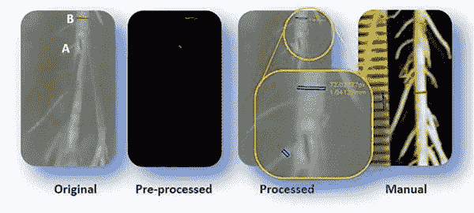
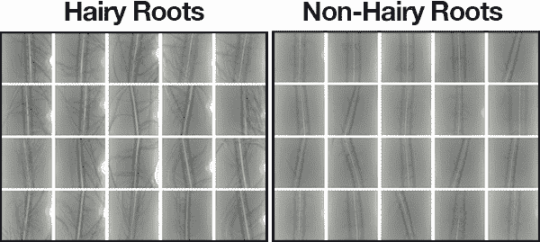
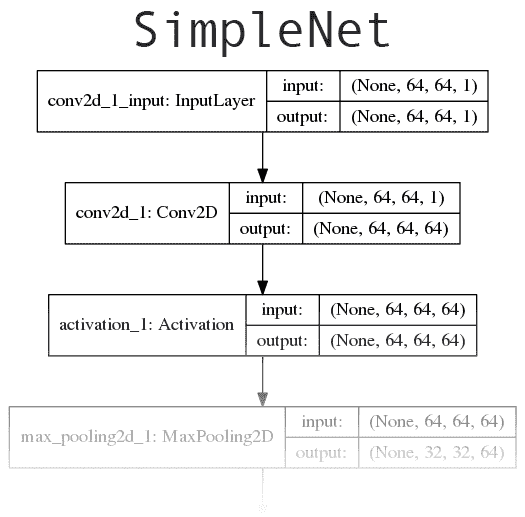
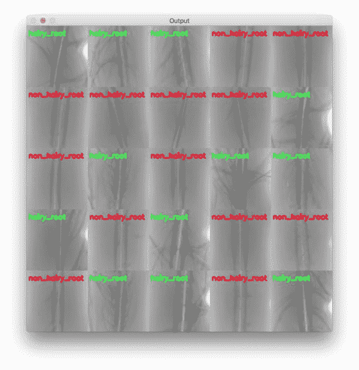

# 深度学习、水培和医用大麻

> 原文：<https://pyimagesearch.com/2018/10/15/deep-learning-hydroponics-and-medical-marijuana/>


在今天的博文中，我们将调查一个将深度学习应用于水培的实际使用案例，这是一种使用富含矿物质的水溶剂营养液在无土栽培中种植植物的方法。

**具体来说，你将学习如何使用 Keras 训练一个卷积神经网络(CNN)来*自动*对根部健康状况*进行分类，而*不必实际接触植物。**

本教程的实际实验设计是由 Darrah 等人在他们 2017 年的论文*中提出的:水培作物植物的实时根系监测:新图像分析系统的概念证明。*

这样的系统可以提高现有水培农场的产量，使农场的运营更加高效和可持续。当然，水培法的成功应用对医用大麻产业有着巨大的影响。

虽然可能会有争议，而且我很清楚我会收到一些关于这篇博文的愤怒/不安的电子邮件，但我还是决定发布今天的教程。

对于作为学生、研究人员和工程师的我们来说，看到深度学习*如何能够*和*如何在现实世界中应用*的实际例子是重要的、有用的和 ***高度教育性的*** 。

此外，今天的教程*不是*旨在讨论大麻的合法性、道德性或使用——这是*而不是*一个分享“合法化”或反毒品运动的平台，或者只是讨论大麻的娱乐性使用。互联网上已经有足够多的网站可以这样做，如果你觉得有必要进行这样的讨论，请这样做，只是要明白 PyImageSearch 不是那个平台。

我还想敦促您记住，我们都是这里的研究人员、学生和开发人员，最重要的是，我们都是来学习实际的、真实的例子的。文明一点，不管你是否同意水培的一些下游影响。

**说了这么多，要了解更多关于深度学习如何应用于水培法(是的，医用大麻)，*继续阅读！***

## 深度学习、水培和医用大麻

***2020-06-15 更新:**此博文现已兼容 TensorFlow 2+!*

在今天博客文章的前半部分，我们将简要讨论水培农场的概念，它们与大麻的关系，以及深度学习如何将它们两者结合起来。

在此基础上，我们将使用 Keras 实现一个卷积神经网络，自动对水培系统中生长的植物的根部健康状况进行分类*，而*无需物理接触或干扰植物。

最后，我们将回顾我们的实验结果。

### 什么是水培？

[](https://pyimagesearch.com/wp-content/uploads/2018/10/dl_mm_hydroponics.jpg)

**Figure 1:** Hydroponic farming is useful to grow and yield more plants within confined spaces. Read the rest of this case study to find out how Keras + deep learning can be used to spot hydroponic root system problem areas.

水培是一个庞大的产业，2016 年估计市值***212.035 亿美元*****(是的，百万)。从 2018 年到 2023 年，该市场预计将以每年 6.5%的复合年增长率(CAGR)增长。欧洲和亚洲预计也将以相似的速度增长([所有统计数据来源](https://www.mordorintelligence.com/industry-reports/hydroponics-market))。**

 **水培法本身是水培法的一个分支，水培法是在不利用土壤的情况下种植植物的过程，而不是使用富含矿物质的溶液。

使用水培法，植物可以在根部接触到矿物质溶液的情况下生长。

如果你自动将“水培”与“大麻”联系起来，请记住，水培农业已经得到了主要政府和组织的认可和使用，包括美国、美国宇航局、欧洲，甚至传说中的巴比伦空中花园。

一个很好的例子是国际空间站(ISS)——我们已经在 ISS 进行了多年的水培实验，包括种植蔬菜。

水培是一门自巴比伦人和阿兹特克人以来就存在的科学，并在现代继续使用——所以在你翘起鼻子之前，请记住这是真正的科学，一门远比计算机视觉和深度学习更古老的科学。

那么，为什么要为水培耕作费心呢？

营养土仍然非常珍贵，尤其是由于不负责任或过度耕种土地、疾病、战争、森林砍伐和不断变化的环境等等。

水培农场允许我们在传统土壤农场无法种植的较小区域种植水果和蔬菜。

如果你想考虑一个更大的图景，如果我们要殖民火星，水培法无疑会被利用。

### 水培和医用大麻有什么关系？

[](https://pyimagesearch.com/wp-content/uploads/2018/10/dl_mm_rx_buds.jpg)

**Figure 2:** Despite the controversy over the legalization of marijuana in some states in the US, marijuana is often grown via hydroponic means and makes for a great use case of plant root health analysis. Deep learning, by means of the Keras library, is used in this blog post to classify “hairy” (good) vs “non-hairy” (poor) root systems in hydroponics.

如果你读了前一节关于什么是水培法以及我们为什么使用这种方法，水培法被广泛应用于大麻产业就不足为奇了，甚至在美国合法化立法(在一些州)之前。

我不会对水培法和医用大麻进行详尽的回顾(为此，[你可以参考这篇文章](https://hightimes.com/grow/the-history-of-hydroponics/))，但要点是:

1.  在大麻合法化之前(在美国的一些州)，种植者希望保持他们的植物秘密和安全——室内水培有助于解决这个问题。
2.  医用大麻的规则在美国是新的，在某些情况下，唯一允许的种植方法是水培。
3.  水培种植有助于保护我们宝贵的土壤，这可能需要几十年或更长时间才能自然补充。

根据 Brightfield Group 的报告，2017 年，大麻市场的价值为**77 亿美元**，随着其他国家和州的合法化，复合年增长率高达*60%*——这使得 2021 年**的市场估值达到 314 亿美元**([来源](https://www.forbes.com/sites/monazhang/2017/11/07/global-marijuana-market-31-billion-investors-cautious/#ce883c272977))。

水培和大麻有很多钱，在一个高风险、高回报的行业，这个行业本质上依赖于(1)立法和(2)技术，深度学习找到了另一种应用。

### 深度学习、计算机视觉、水培是如何交叉的？

[](https://pyimagesearch.com/wp-content/uploads/2018/10/dl_mm_setup.jpg)

**Figure 3:** PyImageSearch reader, Timothy Darrah’s research lab for analyzing plant root health in a hydroponics growing configuration is pictured with his permission. His project inspired this deep learning blog post.

回到 2017 年，PyImageSearch 的读者 Timothy Darrah 是田纳西州立大学的一名本科生，他向我提出了一个有趣的问题——他需要设计一种算法来自动对植物根部进行分类，而又不能以任何方式接触或干扰植物。

特别是，达拉正在研究柳枝稷植物，一种北美草原草的主要品种。

***注:** Darrah 等人的工作发表在一篇名为[水培作物植物的实时根系监测:一种新图像分析系统的概念证明](https://s3-us-west-2.amazonaws.com/static.pyimagesearch.com/deep-learning-hydroponics/darrah2017.pdf)的论文中。达拉慷慨地让我主持他的论文给你看。*

该项目的总体目标是开发一个自动化根系生长分析系统，该系统能够准确测量根系，然后检测任何生长问题:

[](https://pyimagesearch.com/wp-content/uploads/2018/10/dl_mm_root_measurement.jpg)

**Figure 4:** An automated root growth analysis system concept. We’re demonstrating the concept of deep learning as a tool to help classify the roots in a hydroponic system.

特别是，根需要分为两类:

1.  “多毛”的根
2.  “无毛”根

根的“毛”越多，根就能更好地吸收养分。

根的“毛越少”，它能吸收的营养就越少，这可能会导致植物饥饿和死亡。

为了这个项目，蒂莫西和马赫什·顾然(一名博士生)以及他们的顾问·额尔德米尔博士和·周博士一起开发了一个系统，可以在不干扰植物本身的情况下自动捕捉根部图像。

他们的实验设置的示例图像可以在本节顶部的**图 3** 中看到。

从那时起，他们需要应用计算机视觉将牙根分为两类(并最终分为多类以检测其他牙根病变)。

唯一的问题是如何解决图像分类问题？

***注:**在 2017 年 4 月蒂莫西给我发邮件要求尝试一种算法后，蒂莫西和团队的其他成员解决了他们最初的问题。我建议[本地二进制模式](https://pyimagesearch.com/2015/12/07/local-binary-patterns-with-python-opencv/)为他们工作；然而，为了本教程，我们也将探索如何利用深度学习。*

### 我们的图像数据集

[](https://pyimagesearch.com/wp-content/uploads/2018/10/dl_mm_dataset.png)

**Figure 5:** Our deep learning dataset for hydroponics root analysis.

我们的 1，524 个根图像数据集包括:

*   **长毛:** 748 张图片*(左)*
*   **无毛:** 776 张图片*(右)*

每个类别的示例图像子集可以在上面的图 4 中看到。

原始图像以 1920×1080 像素的较高分辨率拍摄；然而，为了这篇博文，为了方便起见(也为了节省空间/带宽)，我将它们的大小调整为 256×256 像素。

调整大小由以下人员执行:

1.  将高度调整为 256 像素
2.  然后选取中间的 256 像素裁剪

由于图像的中心总是包含大量的根毛(或者缺少根毛)，这种调整大小和裁剪的方法非常有效。

Darrah 等人也慷慨地允许我们将这些图像用于我们自己的教育(但是你不能将它们用于商业目的)。

在本教程的剩余部分，您将学习如何训练一个深度学习网络来自动分类这些根物种类。

### 配置您的开发环境

要针对本教程配置您的系统，我建议您遵循以下任一教程:

*   [*如何在 Ubuntu 上安装 tensor flow 2.0*](https://pyimagesearch.com/2019/12/09/how-to-install-tensorflow-2-0-on-ubuntu/)
*   [*如何在 macOS 上安装 tensor flow 2.0*](https://pyimagesearch.com/2019/12/09/how-to-install-tensorflow-2-0-on-macos/)

这两个教程都将帮助您在一个方便的 Python 虚拟环境中，用这篇博文所需的所有软件来配置您的系统。

请注意 [PyImageSearch 不推荐也不支持 CV/DL 项目](https://pyimagesearch.com/faqs/single-faq/can-you-help-me-do-___-on-windows/)的窗口。

### 项目结构

要直接在你的终端查看项目结构，首先，抓取这篇文章的 ***【下载】*** ，解压存档。

然后导航到项目目录，使用`tree`命令检查内容:

```py
$ tree --dirsfirst --filelimit 10
.
├── dataset
│   ├── hairy_root [748 images]
│   └── non_hairy_root [776 images]
├── pyimagesearch
│   ├── __init__.py
│   └── simplenet.py
├── train_network.py
└── plot.png

4 directories, 4 files

```

我们的`dataset/`目录由`hairy_root/`和`non_hairy_root/`图像组成。

`pyimagesearch/` 目录是包含 simplenet.py 的 Python 模块。`SimpleNet`架构是我为根健康分类设计的 Keras 深度学习架构。我们今天将回顾这一架构。

然后我们将使用`train_network.py`训练我们的网络，产生`plot.png`，我们的训练图。我们将一行一行地浏览培训脚本，以便您了解它是如何工作的。

我们开始吧！

### 利用深度学习对根部健康进行分类

既然我们已经了解了(1)水培法和(2)我们正在处理的数据集，我们可以开始了。

#### 实现我们的卷积神经网络

[](https://pyimagesearch.com/wp-content/uploads/2018/10/dl_nn_architecture.png)

**Figure 6:** Our deep learning Convolutional Neural Network (CNN) is based on the concepts of AlexNet and OverFeat. Keras will be utilized to build the network and train the model. We will apply this CNN to hydroponics root analysis where marijuana growers might take notice as hydroponics accounts for a segment of their agriculture industry.

我们今天要实现的网络大致基于 [AlexNet](https://papers.nips.cc/paper/4824-imagenet-classification-with-deep-convolutional-neural-networks.pdf) 和[over feet](https://arxiv.org/abs/1312.6229)中介绍的概念。

我们的网络将从卷积过滤器开始，其过滤器尺寸*更大*，用于快速降低卷的空间维度。从那里，我们将应用两个 CONV 层用于学习 3×3 过滤器。[点击此处查看完整的网络架构图。](https://pyimagesearch.com/wp-content/uploads/2018/10/dl_nn_architecture.png)

打开`simplenet.py`文件并插入以下代码:

```py
# import the necessary packages
from tensorflow.keras.models import Sequential
from tensorflow.keras.layers import Conv2D
from tensorflow.keras.layers import MaxPooling2D
from tensorflow.keras.layers import Activation
from tensorflow.keras.layers import Flatten
from tensorflow.keras.layers import Dropout
from tensorflow.keras.layers import Dense
from tensorflow.keras import backend as K
```

我们从从`keras`导入必要的图层类型开始我们的脚本。向下滚动以查看每个正在使用的。

我们也进口 keras。后端将允许我们在定义`SimpleNet`类和`build`方法的下一个块中动态处理不同的输入形状:

```py
class SimpleNet:
	@staticmethod
	def build(width, height, depth, classes, reg):
		# initialize the model along with the input shape to be
		# "channels last"
		model = Sequential()
		inputShape = (height, width, depth)

		# if we are using "channels first", update the input shape
		if K.image_data_format() == "channels_first":
			inputShape = (depth, height, width)
```

`SimpleNet`类定义从**行第 11** 开始。

我们唯一的方法`build`在第 13 行**中定义。**

该功能的第一步是初始化一个`Sequential`模型(**行 16** )。

然后我们指定我们的`inputShape`，其中*输入图像被假定为 64×64 像素大小* ( **第 17 行**)。

大多数人将使用 TensorFlow 作为后端，假设`"channels_last"`最后一次订购。如果你正在使用 Theano 或另一个`"channels_first"`后端，那么`inputShape`在**行 20 和 21** 被修改。

让我们开始向我们的网络添加层:

```py
		# first set of CONV => RELU => POOL layers
		model.add(Conv2D(64, (11, 11), input_shape=inputShape,
			padding="same", kernel_regularizer=reg))
		model.add(Activation("relu"))
		model.add(MaxPooling2D(pool_size=(2, 2)))
		model.add(Dropout(0.25))

		# second set of CONV => RELU => POOL layers
		model.add(Conv2D(128, (5, 5), padding="same",
			kernel_regularizer=reg))
		model.add(Activation("relu"))
		model.add(MaxPooling2D(pool_size=(2, 2)))
		model.add(Dropout(0.25))

		# third (and final) CONV => RELU => POOL layers
		model.add(Conv2D(256, (3, 3), padding="same",
			kernel_regularizer=reg))
		model.add(Activation("relu"))
		model.add(MaxPooling2D(pool_size=(2, 2)))
		model.add(Dropout(0.25))
```

第一个`CONV => RELU => POOL`层块(**第 24-28 行**)使用较大的过滤器尺寸来(1)帮助检测较大的毛发组(或缺少毛发)，随后(2)快速减小体积的空间维度。

我们在网络中越深入，每个 CONV 层学习的过滤器越多(**第 31-42 行**)。

标准整流线性单位(RELU)激活是利用整个。在我的[深度学习书籍](https://pyimagesearch.com/deep-learning-computer-vision-python-book/)中讨论了替代和权衡。

池图层的主要功能是逐渐减小图层输入量的空间大小(即宽度和高度)。您通常会在 CNN 中看到连续 CONV 层之间的池层，如本例所示。

在上面的每个模块中，我们去掉了 25%的节点(断开随机神经元)，以努力引入正则化并帮助网络更好地泛化。这种方法被证明可以减少过度拟合，提高准确性，并允许我们的网络更好地推广不熟悉的图像。

我们的最后一个`FC => RELU`块以 softmax 分类器结束:

```py
		# first and only set of FC => RELU layers
		model.add(Flatten())
		model.add(Dense(512, kernel_regularizer=reg))
		model.add(Activation("relu"))
		model.add(Dropout(0.5))

		# softmax classifier
		model.add(Dense(classes))
		model.add(Activation("softmax"))

		# return the constructed network architecture
		return model
```

全连接层(`Dense`)常见于 CNN 的末尾。这次我们采用 50%的退学率。

我们的 softmax 分类器被应用于我们的最后一个全连接层，其具有对应于我们的两个`classes` : (1) `non_hairy_root`和(2) `hairy_root`的 2 个输出。

最后，我们返回构建的模型。

#### 实现驱动程序脚本

现在我们已经实现了`SimpleNet`，让我们创建负责训练我们网络的驱动脚本。

打开`train_network.py`并插入以下代码:

```py
# set the matplotlib backend so figures can be saved in the background
import matplotlib
matplotlib.use("Agg")

# import the necessary packages
from pyimagesearch.simplenet import SimpleNet
from sklearn.preprocessing import LabelEncoder
from sklearn.model_selection import train_test_split
from sklearn.metrics import classification_report
from tensorflow.keras.optimizers import Adam
from tensorflow.keras.regularizers import l2
from tensorflow.keras.utils import to_categorical
from imutils import build_montages
from imutils import paths
import matplotlib.pyplot as plt
import numpy as np
import argparse
import cv2
import os
```

我们的驱动脚本有许多重要的导入。让我们回顾一下:

*   `matplotlib`:Python 的*事实上的*绘图包。我们将绘制一段时间内的训练准确性/损失数据。
*   我们在前面的章节中定义了 CNN 的架构。
*   scikit-learn 包有一个方便的标签编码器。我们将执行“一次性”编码——稍后会详细介绍。
*   我们将把我们的训练数据分割成一定比例的图像用于训练，剩余的图像用于测试。分割数据在机器学习中很常见，无论你使用什么工具，你都会发现类似的功能。
*   `classification_report`:允许我们在终端上以可读格式方便地打印统计数据。
*   我们将要使用的学习优化器。另一个选择是新加坡元。
*   l2 正则化器结合到损失函数中，允许我们在优化期间惩罚层参数或层活动。这将防止过度拟合，并允许我们的网络推广。
*   `build_montages`:我们将在一帧[的图像蒙太奇](https://pyimagesearch.com/2017/05/29/montages-with-opencv/)中看到我们努力工作的成果。这来自我的 [imutils](https://github.com/jrosebr1/imutils/blob/d277bb7118f265d4ef7877817c9a1824e423dc13/imutils/convenience.py#L215) 包。
*   `paths`:同样来自 imutils，这个函数将从一个输入目录中提取所有图像路径(递归)。
*   `argparse`:解析命令行参数——我们接下来将回顾这一点。
*   `cv2`:别忘了 OpenCV！我们将使用 OpenCV 进行预处理以及可视化/显示。
*   `os`:我不是 Windows 迷，在 PyImageSearch 上我也不正式支持 Windows，但是我们将使用`os.path.sep`来适应 Windows 和 Linux/Mac 路径分隔符。

那是一口。你在 CV 和 DL 领域工作的越多，你就会越熟悉这些和其他的包和模块。

让我们利用其中的一个。我们将使用`argparse`来解析我们的命令行参数:

```py
# construct the argument parser and parse the arguments
ap = argparse.ArgumentParser()
ap.add_argument("-d", "--dataset", required=True,
	help="path to input dataset")
ap.add_argument("-e", "--epochs", type=int, default=100,
	help="# of epochs to train our network for")
ap.add_argument("-p", "--plot", type=str, default="plot.png",
	help="path to output loss/accuracy plot")
args = vars(ap.parse_args())
```

我的博客的读者倾向于熟悉这几行代码，但是我总是为新手解释它们。`argparse`工具将解析在终端中输入的带有命令行参数的命令字符串。如果你是第一次来这里或者你以前从未使用过命令行参数，请务必阅读我在 [*Python、argparse 和命令行参数*](https://pyimagesearch.com/2018/03/12/python-argparse-command-line-arguments/) 上的帖子。

我们的驱动程序脚本有三个命令行参数:

*   这是我们图像数据集的路径。这个论点是*必需的*，因为我们需要数据进行训练。
*   你可以尝试不同迭代次数的训练。我发现`100`已经足够了，所以它是默认的。
*   如果你想为你的绘图指定一个路径+文件名，你可以使用这个参数。默认情况下，您的绘图将被命名为`"plot.png"`并保存在当前工作目录中。每次你以更好的性能为目标进行实验时，你都应该记下 DL 参数，并给你的图命名，这样你就能记住它对应于哪个实验。

现在我们已经解析了我们的命令行参数，让我们加载+预处理我们的图像数据并解析标签:

```py
# grab the list of images in our dataset directory, then initialize
# the list of data (i.e., images) and class images
print("[INFO] loading images...")
imagePaths = list(paths.list_images(args["dataset"]))
data = []
labels = []

# loop over the image paths
for imagePath in imagePaths:
	# extract the class label from the filename
	label = imagePath.split(os.path.sep)[-2]

	# load the image, convert it to grayscale, and resize it to be a
	# fixed 64x64 pixels, ignoring aspect ratio
	image = cv2.imread(imagePath)
	image = cv2.cvtColor(image, cv2.COLOR_BGR2GRAY)
	image = cv2.resize(image, (64, 64))

	# update the data and labels lists, respectively
	data.append(image)
	labels.append(label)
```

在第 34 行的**处，我们创建了数据集中所有`imagePaths`的列表。然后，我们继续初始化一个地方来保存内存中的`data`以及相应的`labels` ( **第 35 行和第 36 行**)。**

给定我们的`imagePaths`，我们继续在**行 39** 上循环它们。

循环的第一步是提取第 41 行上的类标签。让我们看看这在 Python Shell 中是如何工作的:

```py
$ python
>>> from imutils import paths
>>> import os
>>> imagePaths = list(paths.list_images("dataset"))
>>> imagePath = imagePaths[0]
>>> imagePath
'dataset/hairy_root/100_a.jpg'
>>> imagePath.split(os.path.sep)
['dataset', 'hairy_root', '100_a.jpg']
>>> imagePath.split(os.path.sep)[-2]
'hairy_root'
>>>

```

请注意，通过使用`imagePath.split`并提供拆分字符(操作系统路径分隔符 Unix 上的“/”和 Windows 上的“\”)，该函数如何生成一个文件夹/文件名称(字符串)列表，这些名称沿着目录树向下排列(**第 8 行和第 9 行**)。我们获取倒数第二个索引，即类标签，在本例中是`'hairy_root'` ( **第 10 行和第 11 行**)。

然后我们继续加载`image`并预处理它(**第 45-47 行**)。灰度(单通道)是我们识别毛状根和非毛状根所需要的。我们的网络*设计需要* 64×64 像素的图像。

最后，我们将`image`添加到`data`，将`label`添加到`labels` ( **第 50 行和第 51 行**)。

接下来，我们将重塑数据并对标签进行编码:

```py
# convert the data into a NumPy array, then preprocess it by scaling
# all pixel intensities to the range [0, 1]
data = np.array(data, dtype="float") / 255.0

# reshape the data matrix so that it explicity includes a channel
# dimension
data = data.reshape((data.shape[0], data.shape[1], data.shape[2], 1))

# encode the labels (which are currently strings) as integers
le = LabelEncoder()
labels = le.fit_transform(labels)

# transform the labels into vectors in the range [0, classes],
# generating a vector for each label, where the index of the label
# is set to '1' and all other entries are set to '0' -- this process
# is called "one-hot encoding"
labels = to_categorical(labels, 2)

# partition the data into training and testing splits using 60% of
# the data for training and the remaining 40% for testing
(trainX, testX, trainY, testY) = train_test_split(data, labels,
	test_size=0.40, stratify=labels, random_state=42)
```

数据在**行 55-59** 上被整形。在这个过程中，我们从一个列表转换成一个 NumPy 的浮点数组，这个数组被缩放成*【0，1】*。即使我们只有一个灰度通道，我们也增加了通道尺寸。这个额外的维度是我们 CNN 所期待的。

然后我们在第 62-69 行对我们的标签进行编码。我们使用“一热编码”，这意味着我们有一个向量，其中在任何给定的时间只有一个元素(类)是“热的”。回顾我最近的 [Keras 教程](https://pyimagesearch.com/2018/09/10/keras-tutorial-how-to-get-started-with-keras-deep-learning-and-python/)中一个应用于 3 个类的数据集的例子来理解这个概念。

现在是数据的拆分。我保留了 60%的数据用于训练，40%用于测试(**第 73 行和第 74 行**)。

让我们编译我们的模型:

```py
# initialize the optimizer and model
print("[INFO] compiling model...")
opt = Adam(lr=1e-4, decay=1e-4 / args["epochs"])
model = SimpleNet.build(width=64, height=64, depth=1,
	classes=len(le.classes_), reg=l2(0.0002))
model.compile(loss="binary_crossentropy", optimizer=opt,
	metrics=["accuracy"])

```

我们用学习率`1e-4`和学习率衰减(**第 78 行**)初始化`Adam`优化器。

***注:****Adam 的默认学习速率是`1e-3`，但是我通过实验发现使用`1e-3`太高了——网络无法获得任何“牵引力”，无法学习。使用`1e-4`作为初始学习速率允许网络开始学习。这向你展示了理解深度学习的参数和基础是多么重要。拿一本我的书《用 Python 进行计算机视觉的深度学习》[,看看我在调整这些参数时的最佳实践、技巧和建议。](https://pyimagesearch.com/deep-learning-computer-vision-python-book/)***

 **我还包含了少量的正则化，以帮助防止过度拟合，并确保网络泛化。这种正则化显示在第 79 行和第 80 行上，在这里我们`build`我们的模型，同时指定我们的维度、编码标签以及正则化强度。

我们在**81 号线和 82 号线**展示我们的模型。因为我们的网络只有两个类，所以我们使用`"binary_crossentropy"`。**如果你有> 2 个类，你会想要使用`"categorical_crossentropy"`。**

接下来是培训，然后是评估:

```py
# train the network
print("[INFO] training network for {} epochs...".format(
	args["epochs"]))
H = model.fit(x=trainX, y=trainY, validation_data=(testX, testY),
	batch_size=32, epochs=args["epochs"], verbose=1)

# evaluate the network
print("[INFO] evaluating network...")
predictions = model.predict(testX, batch_size=32)
print(classification_report(testY.argmax(axis=1),
	predictions.argmax(axis=1), target_names=le.classes_))
```

培训，也称为“试模”，在**87 线和 88 线**开始。我已经设置了`32`的批量。

然后我们评估网络并在终端中打印一个`classification_report`(**第 92-94 行**)。

接下来，我们使用 matplotlib 生成一个训练图:

```py
# plot the training loss and accuracy
N = args["epochs"]
plt.style.use("ggplot")
plt.figure()
plt.plot(np.arange(0, N), H.history["loss"], label="train_loss")
plt.plot(np.arange(0, N), H.history["val_loss"], label="val_loss")
plt.plot(np.arange(0, N), H.history["accuracy"], label="train_acc")
plt.plot(np.arange(0, N), H.history["val_accuracy"], label="val_acc")
plt.title("Training Loss and Accuracy on Dataset")
plt.xlabel("Epoch #")
plt.ylabel("Loss/Accuracy")
plt.legend(loc="lower left")
plt.savefig(args["plot"])
```

***2020-06-15 更新:*** *为了使这个绘图片段与 TensorFlow 2+兼容，更新了`H.history`字典键，以完全拼出“acc”而没有“ACC”(即`H.history["val_accuracy"]`和`H.history["accuracy"]`)。“val”没有拼成“validation”，这有点令人困惑；我们必须学会热爱 API 并与之共存，并永远记住这是一项正在进行的工作，世界各地的许多开发人员都为此做出了贡献。*

以上是在使用 Keras 和深度学习时制作训练图的一个很好的参考配方。该代码在整个训练期间(*x*轴)在同一曲线图( *y* 轴)上绘制损失和准确度。

我们调用`savefig`将绘图图像导出到磁盘(**第 108 行**)。

最后，让我们可视化输出:

```py
# randomly select a few testing images and then initialize the output
# set of images
idxs = np.arange(0, testY.shape[0])
idxs = np.random.choice(idxs, size=(25,), replace=False)
images = []

# loop over the testing indexes
for i in idxs:
	# grab the current testing image and classify it
	image = np.expand_dims(testX[i], axis=0)
	preds = model.predict(image)
	j = preds.argmax(axis=1)[0]
	label = le.classes_[j]

	# rescale the image into the range [0, 255] and then resize it so
	# we can more easily visualize it
	output = (image[0] * 255).astype("uint8")
	output = np.dstack([output] * 3)
	output = cv2.resize(output, (128, 128))

	# draw the colored class label on the output image and add it to
	# the set of output images
	color = (0, 0, 255) if "non" in label else (0, 255, 0)
	cv2.putText(output, label, (3, 20), cv2.FONT_HERSHEY_SIMPLEX, 0.5,
		color, 2)
	images.append(output)

# create a montage using 128x128 "tiles" with 5 rows and 5 columns
montage = build_montages(images, (128, 128), (5, 5))[0]

# show the output montage
cv2.imshow("Output", montage)
cv2.waitKey(0)
```

每当你测试一个机器学习或深度学习模型时，你不应该只依赖统计数据来证明模型正在工作。您还应该在测试图像上可视化您的结果。有时我会编写一个单独的脚本来加载任意图像并分类+显示它。鉴于这些图像都是相似的，我选择制作一个图像蒙太奇，这样我们就可以直观地检查我们的模型是否表现良好。

做到这一点的步骤包括:

1.  随机选择一些测试图像指标进行可视化(**112 行和 113 行**)。还要初始化一个列表来保存`images` ( **第 114 行**)。
2.  从第**行第 117** 开始循环随机图像`idxs`:
    1.  加载并分类图像(**第 119-122 行**)。我们获取最高预测的索引，并将该索引提供给我们的标签编码器，以生成一个`label`。
    2.  重新缩放/调整图像大小以便可视化(**第 126-128 行**)。
    3.  在输出图像上绘制`label`文本(**第 132-134 行**)。发根(好的)会有`green`字体，非发根(坏的)会有红色。
    4.  将输出图像添加到我们的图像列表中，以便我们稍后可以构建一个蒙太奇( **Line 135** )。
3.  构建结果的蒙太奇(**第 138 行**)。用 OpenCV 学习构建 [*蒙太奇。*](https://pyimagesearch.com/2017/05/29/montages-with-opencv/)

最后，我们显示结果，直到在最后两行上按下一个键。

### 根健康分类结果

要了解我们的根健康深度神经网络的表现，请务必使用本文的 ***【下载】*** 部分下载源代码和数据集。

从那里，打开一个终端，导航到您下载并提取代码的位置，然后执行以下命令:

```py
$ python train_network.py --dataset dataset
Using TensorFlow backend.
[INFO] loading images...
[INFO] compiling model...
[INFO] training network for 100 epochs...
Epoch 1/100
29/29 [==============================] - 1s 23ms/step - loss: 0.9461 - accuracy: 0.4956 - val_loss: 0.9262 - val_accuracy: 0.5098
Epoch 2/100
29/29 [==============================] - 0s 14ms/step - loss: 0.9149 - accuracy: 0.5470 - val_loss: 0.9097 - val_accuracy: 0.4902
Epoch 3/100
29/29 [==============================] - 0s 15ms/step - loss: 0.9045 - accuracy: 0.5208 - val_loss: 0.8931 - val_accuracy: 0.5098
...
Epoch 98/100
29/29 [==============================] - 0s 13ms/step - loss: 0.1081 - accuracy: 0.9891 - val_loss: 0.1360 - val_accuracy: 0.9770
Epoch 99/100
29/29 [==============================] - 0s 13ms/step - loss: 0.2083 - accuracy: 0.9551 - val_loss: 0.1358 - val_accuracy: 0.9852
Epoch 100/100
29/29 [==============================] - 0s 16ms/step - loss: 0.2043 - accuracy: 0.9420 - val_loss: 0.1648 - val_accuracy: 0.9541
[INFO] evaluating network...
                precision    recall  f1-score   support

    hairy_root       1.00      0.91      0.95       299
non_hairy_root       0.92      1.00      0.96       311

      accuracy                           0.95       610
     macro avg       0.96      0.95      0.95       610
  weighted avg       0.96      0.95      0.95       610

```

[](https://pyimagesearch.com/wp-content/uploads/2018/10/dl_mm_plot.png)

**Figure 7:** Our deep learning training plot contains accuracy and loss curves for our hydroponics plant root health case study. The CNN was trained with Keras and the plot was generated with Matplotlib.

如我们所见，我们的网络获得了 95%的分类准确率**，并且如我们的图所示，没有过拟合。**

 **此外，我们可以检查我们的结果蒙太奇，这再次表明我们的网络正在准确地分类每个根类型:

[](https://pyimagesearch.com/wp-content/uploads/2018/10/dl_mm_montage_output.jpg)

**Figure 8:** A montage of our hydroponic root classification system results. Keras + deep learning was utilized to build a “hairy_root” vs “non_hairy_root” classifier. Training images were provided by Darrah et al.’s research.

使用这样的技术，深度学习研究人员、从业者和工程师可以帮助解决现实世界的问题。

## 摘要

在今天的博客文章中，我们探索了深度学习的一个现实世界应用:自动分类水培农场中的植物根系健康，特别是如何在大规模增长的(不是双关语)医用大麻行业中利用这样一个系统。

为了对根部健康状况进行分类，我们用 Keras 和 Python 训练了一个卷积神经网络，将根部标记为“有毛”或“无毛”。

根上的毛越多，就越容易吸收营养。根上的毛发越少，吸收养分就越困难，这可能会导致植物死亡和作物损失。

使用今天帖子中详细介绍的方法，我们能够以超过 95%的准确率**对根健康进行分类。**

 **有关水培和计算机视觉如何交叉的更多信息，请参考 Darrah 等人的 2017 年出版物。

我希望你喜欢今天关于将深度学习应用于现实世界应用的博文。

**要下载这篇博文的源代码(并注册 PyImageSearch 时事通讯)，*只需在下面的表格中输入您的电子邮件地址！***********